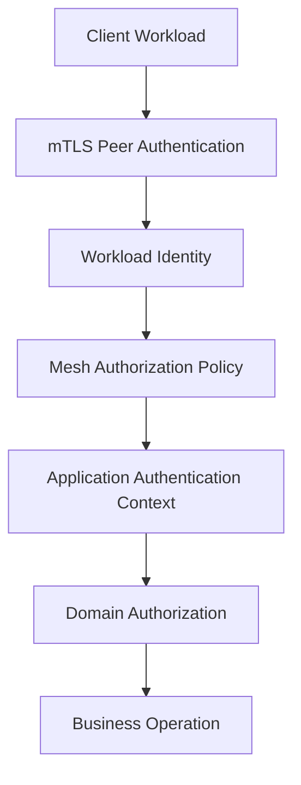
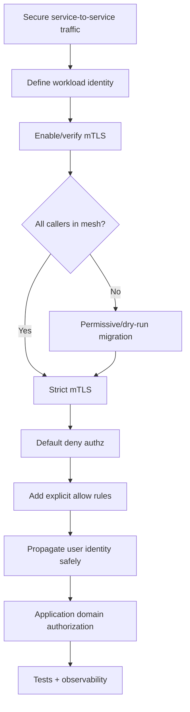

# Part 085 — Service Mesh Security, mTLS, Identity, and Authorization

Service mesh security is often summarized as:

```text
turn on mTLS
```

That is incomplete.

mTLS is an important foundation.

But production service-to-service security also needs:

- workload identity,
- certificate lifecycle,
- peer authentication policy,
- request authentication,
- authorization policy,
- trusted identity propagation,
- namespace/service-account design,
- gateway-to-service trust,
- egress trust,
- observability,
- testing,
- migration strategy,
- rollback,
- ownership.

A service mesh can make service-to-service security more consistent.

It can also create a false sense of security if teams confuse transport authentication with business authorization.

The production rule:

> Mesh security can prove which workload called, but application code still decides whether the requested business action is allowed.

---

## 1. Security Layering Mental Model



Layer responsibility:

| Layer | Answers |
|---|---|
| mTLS | is traffic encrypted and peer authenticated? |
| workload identity | which service/workload is calling? |
| mesh authorization | may this workload call this route/service? |
| request authentication | is the end-user/client token valid? |
| identity propagation | what trusted identity reaches the app? |
| application authorization | may this user/service act on this resource? |
| audit | who did what, when, and why? |

Do not collapse these into one checkbox.

---

## 2. mTLS

Mutual TLS provides:

- encryption in transit,
- server authentication,
- client authentication,
- certificate-based peer identity.

In a mesh, proxies often handle mTLS automatically between workloads.

Application code may still use plain HTTP locally:

```text
app -> local proxy -> encrypted mTLS -> remote proxy -> app
```

This can enable secure transport without changing Java HTTP/gRPC code.

But the app still needs to understand:

- trusted caller identity,
- user identity,
- authorization,
- deadlines,
- retries,
- errors,
- audit.

mTLS protects the transport.

It does not validate business intent.

---

## 3. Workload Identity

Workload identity is usually derived from platform identity.

In Kubernetes meshes, common identity inputs include:

- namespace,
- service account,
- trust domain,
- workload labels,
- certificate SAN/SPIFFE-like identity.

Example conceptual identity:

```text
spiffe://cluster.local/ns/case/sa/case-service
```

This means:

```text
service account case-service in namespace case
```

Identity must be designed.

Bad:

```text
all services run as default service account
```

Then authorization cannot distinguish services.

Good:

```text
one service account per deployable service
```

Then policy can say:

```text
order-service may call case-service
analytics-service may not
```

---

## 4. Namespace and Service Account Design

Recommended baseline:

```yaml
apiVersion: v1
kind: ServiceAccount
metadata:
  name: case-service
  namespace: case
```

Deployment:

```yaml
spec:
  template:
    spec:
      serviceAccountName: case-service
```

Policy can now reference the workload identity.

Design principles:

- do not use `default` service account for production workloads,
- one service account per service where possible,
- separate high-trust services,
- avoid broad shared identities,
- label workloads consistently,
- document trust boundaries,
- align namespace with ownership/security boundary.

Identity design is security architecture.

---

## 5. PeerAuthentication

In Istio-style meshes, PeerAuthentication configures how workloads accept mTLS traffic.

Conceptual strict policy:

```yaml
apiVersion: security.istio.io/v1
kind: PeerAuthentication
metadata:
  name: default
  namespace: case
spec:
  mtls:
    mode: STRICT
```

`STRICT` means workload accepts only mTLS traffic.

This is useful after all clients are in the mesh and configured.

Migration often starts with permissive mode.

Do not switch to strict globally without verifying traffic paths.

---

## 6. Permissive to Strict Migration

Migration path:

1. enable mesh injection/participation,
2. observe traffic,
3. enable permissive mTLS,
4. identify plaintext callers,
5. migrate callers,
6. apply namespace/workload strict mTLS,
7. monitor failures,
8. enforce mesh-wide strict if appropriate.

Checklist:

- are all callers in mesh?
- are gateways included?
- are cron jobs included?
- are probes compatible?
- are external clients routed correctly?
- are egress calls unaffected?
- are metrics showing mTLS?
- is rollback plan ready?

mTLS migration is a production rollout.

---

## 7. AuthorizationPolicy

Authorization policy controls who may call what.

Conceptual:

```yaml
apiVersion: security.istio.io/v1
kind: AuthorizationPolicy
metadata:
  name: case-service
  namespace: case
spec:
  selector:
    matchLabels:
      app: case-service
  action: ALLOW
  rules:
    - from:
        - source:
            principals:
              - cluster.local/ns/order/sa/order-service
      to:
        - operation:
            methods: ["GET"]
            paths: ["/internal/cases/*"]
```

Meaning:

```text
only order-service identity may GET /internal/cases/*
```

Authorization policy should be specific.

Avoid broad allow-all policies in production.

---

## 8. Default Deny

A mature zero-trust posture often starts from default deny:

```text
deny all inbound unless explicitly allowed
```

Then add allow rules.

Benefits:

- unknown dependencies blocked,
- lateral movement reduced,
- accidental access prevented,
- architecture dependencies become visible.

Risks:

- hidden dependencies break,
- missing policy causes outage,
- migration requires careful observation,
- probes/gateways/ops traffic may need rules.

Default deny is powerful.

Adopt gradually with telemetry and tests.

---

## 9. Mesh Authorization vs Application Authorization

Mesh authorization can answer:

```text
may order-service call case-service /internal/cases/*
```

Application authorization answers:

```text
may this user or service view CASE-100?
```

Mesh lacks domain state such as:

- resource owner,
- tenant membership,
- workflow state,
- object classification,
- business role,
- approval status.

Do not move resource-level authorization fully into mesh.

Use mesh for coarse service-to-service control.

Use app for domain authorization.

---

## 10. Request Authentication

Request authentication validates end-user or client tokens, often JWT.

Example concepts:

- issuer,
- JWKS URI,
- audience,
- claims,
- token expiry,
- signature.

In a mesh/gateway, request authentication can reject invalid tokens before app.

But backend services must still receive trusted identity/claims or validate token themselves.

Questions:

- where is JWT validated?
- is token forwarded?
- are claims propagated as headers?
- are headers signed/trusted?
- can backend be called directly?
- does service need raw token for downstream call?
- are scopes/audience checked?

Authentication architecture must be explicit.

---

## 11. End-User Identity Propagation

Common approaches:

### Forward original JWT

Pros:

- backend can validate independently,
- full claims available.

Cons:

- token audience may not match backend,
- token leakage risk,
- long tokens,
- every service needs JWT validation config.

### Gateway/mesh validates and injects trusted headers

Pros:

- simpler backend,
- centralized validation.

Cons:

- header spoofing risk if backend bypassable,
- trust boundary must be enforced,
- claims may be stale/incomplete.

### Token exchange

Pros:

- least privilege downstream token,
- audience-specific.

Cons:

- more infrastructure and complexity.

Choose deliberately.

---

## 12. Header Spoofing

If backend trusts:

```text
X-User-Id: alice
```

from any request, attacker can spoof identity if backend is reachable.

Mitigation:

- strip inbound identity headers at gateway,
- set trusted headers only after authentication,
- block direct access to backend,
- use mTLS identity between gateway and service,
- sign internal identity headers if needed,
- backend rejects requests without trusted source.

Trusted identity headers require a trusted path.

Do not trust client-supplied identity headers.

---

## 13. Service-to-Service Delegation

A service may call another service on behalf of a user.

Questions:

- is caller acting as itself or user?
- should downstream see user identity?
- should downstream see service identity?
- what scopes are delegated?
- how is tenant enforced?
- how is audit recorded?
- does downstream trust caller to enforce policy?

Example:

```text
gateway authenticates user
case-service checks user can view case
case-service calls document-service to fetch documents for same case
```

Document-service may need both:

```text
caller = case-service
user = alice
```

Audit should capture both.

---

## 14. Confused Deputy Risk

A confused deputy occurs when a privileged service is tricked into using its authority for an unprivileged requester.

Example:

```text
user cannot access document
user calls case-service
case-service calls document-service with service credential
document-service returns document
```

Mitigations:

- propagate user/tenant context,
- downstream performs domain authorization,
- use scoped delegation tokens,
- check resource ownership,
- audit caller and user,
- avoid broad service credentials.

Mesh identity alone can make confused deputy worse if downstream trusts service identity too broadly.

---

## 15. Authorization Policy Granularity

Mesh policy can match:

- source principal,
- namespace,
- service account,
- destination workload,
- port,
- HTTP method,
- path,
- host,
- sometimes JWT claims depending implementation.

Use route-level match carefully.

Problems:

- path rewrites,
- gRPC method paths,
- versioned APIs,
- broad wildcards,
- missing trailing slash behavior,
- non-HTTP protocols.

Policy should be tested with real requests.

---

## 16. gRPC Authorization

gRPC method path often appears as:

```text
/package.Service/Method
```

Authorization policy may match this path.

Example concept:

```yaml
paths:
  - /example.case.CaseService/GetCase
```

Test:

- unary methods,
- streaming methods,
- health checks,
- reflection,
- admin methods.

Do not accidentally expose reflection/admin endpoints broadly.

gRPC authorization needs method-level awareness.

---

## 17. Health Checks and Probes

mTLS/authz can break health probes.

Questions:

- does kubelet probe through sidecar?
- are probes rewritten by mesh?
- should readiness endpoint require auth?
- should liveness endpoint bypass auth?
- is health exposed externally?
- does gateway health check include auth?

Health endpoints should not leak sensitive data.

But they must remain reachable by platform components that need them.

Configure probe behavior intentionally.

---

## 18. Egress Identity

Outbound calls to external systems need identity too.

Options:

- service authenticates directly,
- egress gateway authenticates,
- workload identity exchanged for cloud IAM,
- mTLS client cert to partner,
- OAuth client credentials,
- API key from secret manager.

If egress gateway centralizes outbound identity, ensure:

- per-service attribution is preserved,
- credentials are scoped,
- audit records source workload,
- one service cannot abuse another's external authority.

Egress security is part of mesh security.

---

## 19. Secrets and Certificates

Mesh may automate workload certificates.

But applications still manage:

- API keys,
- OAuth client secrets,
- database passwords,
- signing keys,
- provider credentials.

Rules:

- never pass secrets in mesh headers,
- never log certificates/private keys,
- rotate credentials,
- use secret manager/workload identity,
- avoid broad shared secrets,
- audit secret access.

mTLS reduces some secret burden.

It does not eliminate application secrets.

---

## 20. Certificate Rotation

Mesh control plane typically handles certificate rotation.

Operational concerns:

- CA availability,
- trust root rotation,
- workload cert expiry,
- clock skew,
- proxy reconnect behavior,
- long-lived connections,
- multi-cluster trust,
- external mTLS partners.

Monitor:

```text
certificate expiry
certificate issuance failures
mTLS handshake failures
control plane cert errors
```

Certificate rotation failure can become cluster-wide outage.

---

## 21. Multi-Cluster Trust

Multi-cluster mesh security requires:

- trust domains,
- root CA strategy,
- identity uniqueness,
- namespace collisions,
- service account naming,
- cross-cluster authorization,
- data residency,
- failover policy,
- audit.

Example risk:

```text
namespace/payment service-account/default exists in two clusters
```

Identity collision can cause policy confusion if trust domains are not designed.

Multi-cluster identity is architecture-level security.

---

## 22. Authorization Observability

Metrics:

```text
mesh.authz.allowed.total{source,destination,policy}
mesh.authz.denied.total{source,destination,policy,reason}
mesh.mtls.handshake.failures.total{source,destination}
mesh.request_authentication.failures.total{route,issuer,reason}
mesh.jwt.validation.failures.total{route,reason}
mesh.policy.shadow_denied.total{source,destination,policy}
```

Logs:

- source principal,
- destination workload,
- method/path,
- decision,
- policy name,
- request ID,
- trace ID,
- user subject if available.

Do not log full tokens.

---

## 23. Dry Run / Audit Mode

Before enforcing policy, use audit/dry-run mode if platform supports it.

Purpose:

- discover hidden dependencies,
- identify calls that would be denied,
- test default deny,
- reduce outage risk.

Workflow:

1. deploy policy in dry-run,
2. observe would-deny logs,
3. fix legitimate dependencies,
4. remove unexpected dependencies,
5. enforce,
6. monitor real denies.

Dry-run policy is extremely useful for zero-trust migration.

---

## 24. Testing Mesh Security

Test cases:

| Scenario | Expected |
|---|---|
| authorized service calls allowed route | success |
| unauthorized service calls route | denied |
| plaintext call to strict mTLS workload | denied/fails |
| invalid JWT | rejected |
| expired JWT | rejected |
| missing JWT on protected route | rejected |
| spoofed identity header | stripped/ignored |
| gRPC unauthorized method | denied |
| health probe | works as intended |
| direct backend bypass | blocked |
| egress unauthorized host | blocked |

Security tests must run through actual mesh/gateway path.

Unit tests cannot prove proxy policy.

---

## 25. Negative Authorization Test

Example intent:

```text
analytics-service must not call POST /internal/cases/{id}/close
```

Black-box test:

```bash
kubectl exec deploy/analytics-service -n analytics -- \
  curl -i http://case-service.case.svc.cluster.local/internal/cases/CASE-100/close
```

Expected:

```text
403 / denied by mesh policy
```

Automate for critical routes.

---

## 26. Header Spoofing Test

Test:

1. client sends `X-User-Id: admin`,
2. gateway authenticates as normal user,
3. backend receives trusted identity for normal user, not spoofed admin,
4. direct backend call with header is blocked.

This test catches dangerous trust-boundary mistakes.

---

## 27. Policy Drift Detection

Detect:

- service without sidecar/mesh participation,
- workload using default service account,
- namespace without mTLS policy,
- workload without authz policy,
- wildcard allow rules,
- direct public exposure bypassing gateway,
- stale service account still allowed,
- policy referencing missing workload labels,
- JWT issuer mismatch,
- authz policy not exercised.

Security posture drifts unless continuously checked.

---

## 28. Production Policy Template

```yaml
meshSecurity:
  namespace: case

  mtls:
    mode: STRICT
    migration:
      dryRunRequired: true

  identity:
    serviceAccountPerService: true
    defaultServiceAccountForbidden: true
    trustDomain: cluster.local

  authorization:
    defaultDeny: true
    allowRules:
      - source: cluster.local/ns/order/sa/order-service
        destination: case-service
        methods:
          - GET
        paths:
          - /internal/cases/*
      - source: cluster.local/ns/edge/sa/api-gateway
        destination: case-service
        methods:
          - GET
          - POST
        paths:
          - /cases/*
    wildcardAllowForbidden: true

  requestAuthentication:
    jwt:
      requiredAtGateway: true
      backendTrustBoundary: gateway-mtls

  headers:
    stripUntrustedIdentityHeaders: true
    trustedHeadersSetByGatewayOnly: true

  observability:
    authzDenyAlert: true
    mtlsFailureAlert: true
    certExpiryAlert: true

  testing:
    unauthorizedCallTestsRequired: true
    headerSpoofingTestRequired: true
    mtlsStrictTestRequired: true
```

Policy must be environment-specific and reviewed.

---

## 29. Common Anti-Patterns

### 29.1 mTLS equals complete security

mTLS authenticates workloads, not business rights.

### 29.2 All services use default service account

No useful identity.

### 29.3 Wildcard ALLOW

Zero-trust illusion.

### 29.4 Backend trusts internet headers

Identity spoofing.

### 29.5 Mesh authz replaces domain authorization

Resource access bugs.

### 29.6 Strict mTLS rollout without observing plaintext callers

Outage.

### 29.7 No gRPC method policy tests

Admin/reflection endpoints exposed.

### 29.8 No dry-run/default-deny migration

Hidden dependencies break.

### 29.9 No certificate monitoring

Cert expiry becomes outage.

### 29.10 Policies changed manually in production

No audit, no rollback.

---

## 30. Decision Model



Mesh security is layered and incremental.

---

## 31. Design Checklist

Before enforcing mesh security:

- Does every service have unique service account?
- Is mTLS mode understood?
- Are plaintext callers identified?
- Is default deny planned?
- Are allow rules specific?
- Are wildcard rules forbidden?
- Are gateways included?
- Are health probes compatible?
- Is JWT validation location defined?
- Are trusted identity headers protected?
- Are direct backend paths blocked?
- Is domain authorization still in app?
- Are gRPC methods covered?
- Are egress identities defined?
- Are certs monitored?
- Are deny logs visible?
- Are negative tests automated?
- Is rollback plan ready?

---

## 32. The Real Lesson

Service mesh security is valuable because it standardizes:

```text
workload identity
+ encrypted traffic
+ peer authentication
+ coarse authorization
+ security telemetry
```

But it is not a substitute for:

```text
domain authorization
+ tenant checks
+ input validation
+ idempotency
+ audit
+ secure data handling
```

Use mesh security to shrink the network trust boundary.

Use application security to protect business resources.

When both layers are designed intentionally, service-to-service communication becomes much safer.

---

## References

- Istio Security Concepts: https://istio.io/latest/docs/concepts/security/
- Istio Authentication Policy Task: https://istio.io/latest/docs/tasks/security/authentication/authn-policy/
- Istio Mutual TLS Migration: https://istio.io/latest/docs/tasks/security/authentication/mtls-migration/
- Istio Authorization Policy Reference: https://istio.io/latest/docs/reference/config/security/authorization-policy/
- Istio PeerAuthentication Reference: https://istio.io/latest/docs/reference/config/security/peer_authentication/
- Envoy TLS Architecture: https://www.envoyproxy.io/docs/envoy/latest/intro/arch_overview/security/ssl
