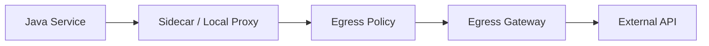
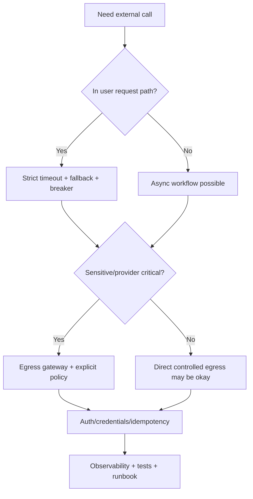

# Part 086 — Egress, External Dependency Routing, and Hybrid Connectivity

Internal service-to-service communication is only part of production reality.

Java microservices also call:

- payment providers,
- identity providers,
- partner APIs,
- SaaS APIs,
- object storage,
- email/SMS providers,
- fraud systems,
- legacy SOAP services,
- mainframes,
- cloud APIs,
- data platforms,
- cross-cluster services,
- on-prem systems.

These are egress dependencies.

Egress is dangerous because it crosses trust, ownership, reliability, and network boundaries.

A top-tier engineer does not treat external calls as normal internal calls.

They ask:

```text
Which external systems can this service call?
How is traffic authenticated?
Where is TLS terminated/originated?
How is DNS verified?
What rate limits apply?
What happens if the provider is down?
How is data protected?
How is access audited?
How do we test failover?
```

Egress is communication architecture plus security plus vendor dependency management.

---

## 1. Egress Mental Model



Possible paths:

1. direct from workload to external host,
2. sidecar-controlled direct egress,
3. dedicated egress gateway,
4. corporate proxy,
5. NAT gateway,
6. private link/private service connect,
7. VPN/direct connect to on-prem,
8. cross-cluster mesh/gateway.

The architecture determines:

- visibility,
- access control,
- TLS handling,
- identity,
- audit,
- failure modes,
- bottlenecks.

---

## 2. Why Egress Governance Matters

Uncontrolled egress causes:

- data exfiltration risk,
- unknown external dependencies,
- shadow integrations,
- no audit,
- rate-limit incidents,
- unpredictable latency,
- inconsistent retry policies,
- credential sprawl,
- compliance violations,
- difficult incident response,
- uncontrolled vendor cost.

Production baseline:

```text
external dependencies must be declared, allowed, observed, and owned
```

If a service can call the internet freely, your architecture has a blind spot.

---

## 3. ServiceEntry

In Istio, `ServiceEntry` lets the mesh know about services that are not automatically discovered in the platform registry.

It describes external service properties such as:

- host,
- ports,
- protocol,
- resolution,
- endpoints,
- location.

Conceptual:

```yaml
apiVersion: networking.istio.io/v1
kind: ServiceEntry
metadata:
  name: payment-provider
spec:
  hosts:
    - api.payment.example.com
  location: MESH_EXTERNAL
  ports:
    - number: 443
      name: https
      protocol: HTTPS
  resolution: DNS
```

This allows controlled routing/policy for an external service.

The host becomes explicit infrastructure.

---

## 4. DNS Resolution and Host Verification

For external services, DNS resolution matters.

If policy is based only on HTTP Host header without resolving/validating destination properly, clients may bypass intent by connecting to another IP while claiming a host header.

Use DNS/SNI-aware policy correctly.

For HTTPS:

- SNI hostname,
- TLS certificate SAN,
- DNS resolution,
- HTTP Host header,
- proxy route config,

should align.

If they disagree, you may have security or routing bugs.

---

## 5. Egress Gateway

An egress gateway routes outbound traffic through a dedicated gateway service.

Benefits:

- centralized outbound control,
- audit,
- source IP stability,
- partner IP allowlisting,
- TLS origination at gateway,
- policy enforcement,
- easier monitoring,
- restricted internet access from workloads.

Costs:

- extra hop,
- possible bottleneck,
- gateway scaling,
- high availability requirement,
- config complexity,
- debugging complexity.

Use egress gateway when external access needs central governance.

---

## 6. Direct Egress vs Egress Gateway

| Factor | Direct sidecar egress | Egress gateway |
|---|---|---|
| Simplicity | simpler | more complex |
| Central audit | weaker | stronger |
| Source IP control | harder | easier |
| Partner allowlist | harder | easier |
| Bottleneck risk | lower central bottleneck | gateway must scale |
| Policy control | good | stronger |
| TLS origination centralization | no | yes |
| Debugging | local | central path |

Use direct egress for low-risk internal-like dependencies if allowed.

Use egress gateway for sensitive, regulated, partner, or internet-bound dependencies.

---

## 7. TLS Origination

TLS origination means gateway/proxy initiates TLS to external service.

Flow:

```text
app -> internal plain/mTLS to proxy/gateway -> TLS to external API
```

Use cases:

- central certificate validation,
- central client certificate,
- external mTLS,
- SNI control,
- policy inspection before TLS,
- consistent outbound TLS settings.

Risks:

- app may think it is talking HTTPS while internal leg differs,
- certificate validation must be correct,
- hostname/SNI must match,
- secrets/certs centralized,
- debugging harder.

Document where TLS starts and ends.

---

## 8. External mTLS

Some partners require client certificates.

Options:

- Java application presents client cert,
- sidecar/proxy presents client cert,
- egress gateway presents client cert.

Gateway-managed client cert benefits:

- central rotation,
- fewer app secrets,
- stable partner identity,
- consistent TLS config.

Risks:

- all services through gateway may share cert unless separated,
- authorization must ensure only approved service uses cert,
- partner audit may see gateway identity only,
- per-service attribution must be logged internally.

Never let unauthorized services use privileged partner credentials through shared gateway.

---

## 9. API Keys and OAuth Credentials

External API auth may use:

- API key,
- OAuth client credentials,
- signed request,
- JWT assertion,
- mTLS,
- cloud IAM,
- temporary token.

Credential handling rules:

- store in secret manager,
- scope per service/provider,
- rotate,
- audit access,
- avoid logging,
- avoid event headers,
- avoid sharing across services,
- monitor usage,
- support revocation.

If egress gateway holds credential, ensure caller authorization is strict.

Gateway should not become a credential laundering point.

---

## 10. External Dependency Contract

Each external dependency needs a contract:

```yaml
dependency: payment-provider
owner: payments-team
host: api.payment.example.com
protocol: HTTPS
auth: mTLS + OAuth2 client credentials
dataClassification: restricted
timeoutMs: 1000
retry:
  safeOperationsOnly: true
rateLimit:
  providerLimit: 500/s
circuitBreaker:
  failureRateThreshold: 50%
egress:
  viaGateway: true
  sourceIpAllowlisted: true
observability:
  dependencyDashboard: true
runbook: runbooks/payment-provider.md
```

External systems are APIs you do not control.

Document them more carefully, not less.

---

## 11. Timeout Policy for External Calls

External calls are usually slower and less reliable than internal calls.

Define:

- connect timeout,
- TLS handshake timeout,
- response timeout,
- total deadline,
- retry budget,
- circuit breaker,
- fallback,
- async handoff if slow.

Example:

```yaml
payment-provider:
  connectTimeoutMs: 200
  responseTimeoutMs: 1000
  totalDeadlineMs: 1500
  maxAttempts: 2
```

Do not let external provider latency consume internal request budgets.

Use async workflow when external dependency is slow or unreliable.

---

## 12. Retry Policy for External Calls

External retries must consider:

- idempotency,
- provider rate limits,
- provider `Retry-After`,
- payment/side-effect semantics,
- timeout budget,
- circuit breaker,
- duplicate charge risk,
- request body repeatability.

For payment-like commands:

```text
retry only with provider idempotency key
```

For GET/reference lookup:

```text
bounded retry may be safe
```

For email/SMS:

```text
use notification ID/idempotency if provider supports
```

External retry is business risk.

---

## 13. Rate Limits and Quotas

External providers often impose quotas.

Design:

- per-provider rate limiter,
- per-tenant fairness,
- queueing/backpressure,
- shed optional traffic,
- respect `429` and `Retry-After`,
- alert before quota exhaustion,
- dashboards by provider/client.

Do not discover quotas during incident.

Example metrics:

```text
external.requests.total{provider,operation,status}
external.rate_limited.total{provider}
external.quota.remaining{provider}
external.retry_after.seconds{provider}
```

---

## 14. Circuit Breaker for External Dependency

Circuit breaker prevents hammering sick provider.

States:

- closed,
- open,
- half-open.

External dependency breaker should be per provider/operation.

Example:

```yaml
circuitBreaker:
  failureRateThreshold: 50
  minimumCalls: 50
  openDurationMs: 30000
  permittedHalfOpenCalls: 5
```

When open:

- fail fast,
- enqueue async work,
- serve cached/stale data,
- degrade feature,
- show pending state.

Do not keep thousands of threads waiting on down provider.

---

## 15. Fallback for External Dependency

Fallback options:

| Dependency | Fallback |
|---|---|
| exchange rate API | stale cached rate |
| fraud score API | manual review |
| email provider | queue intent and retry later |
| identity provider | fail closed for login |
| payment provider | pending state |
| address validation | allow with unverified flag |
| analytics SaaS | drop/buffer best-effort event |

Fallback must be domain-specific.

Do not fake success for critical external side effects.

---

## 16. Bulkhead for External Dependencies

Protect internal service resources from external slowness.

Use:

- separate connection pool per provider,
- thread/semaphore bulkhead,
- rate limiter,
- timeout,
- queue limit,
- async worker pool,
- backpressure.

Bad:

```text
all outbound HTTP calls share one huge pool
```

One slow provider can starve all dependencies.

Good:

```yaml
paymentProviderPool:
  maxConnections: 50
identityProviderPool:
  maxConnections: 30
smsProviderPool:
  maxConnections: 20
```

Dependency isolation matters.

---

## 17. Egress Observability

Metrics:

```text
egress.requests.total{provider,operation,status}
egress.request.duration{provider,operation}
egress.connect.failures.total{provider}
egress.tls.handshake.failures.total{provider}
egress.dns.failures.total{provider}
egress.retries.total{provider,operation}
egress.rate_limited.total{provider}
egress.circuit.open{provider,operation}
egress.gateway.requests.total{provider,status}
egress.gateway.upstream.failures.total{provider}
```

Logs:

- provider,
- operation,
- status,
- timeout,
- retry count,
- circuit state,
- correlation ID,
- idempotency key hash,
- gateway route.

Do not log secrets, tokens, full payloads, or raw API keys.

---

## 18. Egress Gateway Bottleneck

If all outbound traffic uses one egress gateway, it can bottleneck.

Monitor:

- CPU,
- memory,
- connection count,
- request rate,
- p99 latency,
- upstream failures,
- TLS handshakes,
- DNS resolution,
- queue/pending requests,
- dropped connections,
- per-provider traffic.

Scale:

- replicas,
- horizontal pod autoscaling,
- separate gateways per domain/classification,
- connection pool tuning,
- locality placement.

Egress gateway is production-critical infrastructure.

---

## 19. Source IP Allowlisting

Partners may allowlist source IPs.

Egress gateway/NAT can provide stable outbound IP.

But:

- failover may change IP,
- multi-region needs multiple IPs,
- NAT exhaustion possible,
- gateway scaling must preserve expected egress path,
- partner changes require coordination.

Document provider allowlist.

Monitor egress path.

Do not let workloads bypass gateway and use unexpected source IP.

---

## 20. DNS and External Dependencies

External DNS can fail or change.

Consider:

- DNS TTL,
- JVM DNS caching,
- proxy DNS refresh,
- provider failover,
- DNS poisoning protections,
- split-horizon DNS,
- private DNS zones,
- outbound DNS policy.

For Java clients, DNS cache behavior can interact with provider failover.

If provider rotates IPs quickly but JVM/proxy caches too long, failover may be delayed.

For mesh egress, understand whether DNS is resolved by app, sidecar, or gateway.

---

## 21. Private Connectivity

External dependency may be reachable through:

- private link/private service connect,
- VPC peering,
- VPN,
- direct connect,
- transit gateway,
- on-prem link.

Private connectivity changes:

- DNS,
- routing,
- firewall,
- MTU,
- latency,
- failover,
- security boundary,
- observability.

Treat private dependency as external if owned by another team/vendor.

Network proximity does not mean operational ownership.

---

## 22. Hybrid On-Prem Connectivity

On-prem systems often have:

- high latency,
- strict firewall rules,
- legacy protocols,
- maintenance windows,
- batch availability,
- weak observability,
- limited retries,
- fragile authentication.

Use:

- async integration where possible,
- queue/buffer,
- circuit breaker,
- timeout,
- reconciliation,
- explicit maintenance mode,
- synthetic probes,
- runbooks with network team.

Do not make user-facing request path depend synchronously on fragile legacy systems unless unavoidable.

---

## 23. Cross-Cluster Service Calls

Calling services across clusters is more like external dependency than local call.

Questions:

- service identity across clusters,
- mTLS trust domain,
- failover,
- latency,
- retries,
- data residency,
- version compatibility,
- network partitions,
- observability,
- routing policy.

Prefer:

- local call if service exists locally,
- async replication/events,
- gateway-mediated cross-cluster traffic,
- explicit failover policy.

Do not hide cross-cluster latency behind the same service name without awareness.

---

## 24. External Dependency in User Path

If external dependency is in user request path:

```text
user -> service -> provider -> response
```

you need:

- tight timeout,
- fallback/degradation,
- user-facing error semantics,
- SLO impact,
- provider status monitoring,
- circuit breaker,
- bulkhead,
- idempotency,
- provider SLA review.

If external call can be async:

```text
user command -> local accepted -> background workflow -> provider
```

availability improves.

Use async handoff for slow/unreliable providers when business allows.

---

## 25. External Dependency Status

Monitor provider status pages/API if available.

But do not rely only on vendor status.

Measure your actual calls.

Provider status may say "healthy" while:

- your region is affected,
- your account is throttled,
- your mTLS cert expired,
- DNS is wrong,
- private link is broken,
- one endpoint is failing.

Synthetic probes and real traffic metrics both matter.

---

## 26. Idempotency with External APIs

For side-effecting provider calls, use idempotency.

Examples:

- payment idempotency key,
- notification ID,
- partner request ID,
- file upload checksum/object key,
- order reference,
- command ID.

Store mapping:

```sql
CREATE TABLE external_call_attempt (
    provider text NOT NULL,
    operation text NOT NULL,
    idempotency_key text NOT NULL,
    request_hash text NOT NULL,
    status text NOT NULL,
    provider_reference text,
    created_at timestamptz NOT NULL,
    updated_at timestamptz NOT NULL,
    PRIMARY KEY (provider, operation, idempotency_key)
);
```

If timeout occurs after provider accepted request, query by idempotency key/reference instead of blindly retrying with new ID.

---

## 27. Credential Rotation

External credentials rotate.

Readiness:

- credentials in secret manager,
- rotation runbook,
- dual credential overlap if provider supports,
- reload without restart if possible,
- alert before expiry,
- synthetic probe validates new credential,
- rollback credential available,
- no old credential in logs/config.

For mTLS certificates:

- monitor expiry,
- test renewal,
- coordinate with partner CA/truststore.

Credential expiry is an avoidable outage.

---

## 28. Egress Security Policy

Policy:

```yaml
egress:
  defaultDeny: true
  allowedHosts:
    - api.payment.example.com
    - api.identity.example.com
  wildcardHostsAllowed: false
  requireServiceEntry: true
  requireOwner: true
  requireDataClassification: true
  requireTimeout: true
  requireCircuitBreaker: true
  requireCredentialSource: secret-manager
```

Default deny egress reduces unknown dependencies and exfiltration risk.

Migrate carefully.

---

## 29. Wildcard Egress

Wildcard egress:

```text
*.example.com
```

can be useful for dynamic SaaS subdomains.

Risks:

- over-broad access,
- host spoofing,
- policy bypass,
- difficult audit,
- unexpected endpoints.

Use:

- narrow wildcard,
- DNS/SNI validation,
- explicit owner,
- logs by actual host,
- approval,
- expiration/review.

Avoid:

```text
*.com
```

or broad internet allow.

---

## 30. Testing Egress

Test:

- allowed external host succeeds,
- unauthorized host denied,
- DNS failure behavior,
- TLS certificate validation failure,
- mTLS client certificate success/failure,
- provider timeout,
- provider 429 with Retry-After,
- circuit breaker opens,
- egress gateway down,
- credential expired,
- source IP allowlist,
- no secret in logs,
- direct bypass blocked.

Use mock external services and staged provider sandbox.

---

## 31. Egress Failure Drill

Drill:

```text
payment provider times out for 10 minutes
```

Expected:

- timeout budget enforced,
- circuit opens,
- user sees pending/fail-safe status,
- background retries bounded,
- no thread exhaustion,
- no retry storm,
- alert fires,
- runbook used,
- reconciliation possible.

If drill fails, production incident will fail worse.

---

## 32. Contract Testing External APIs

For external APIs:

- provider sandbox tests,
- contract fixtures,
- schema validation,
- error response fixtures,
- auth failure fixtures,
- rate-limit fixtures,
- timeout/failure simulation,
- idempotency behavior tests.

Do not test only 200 OK.

Provider errors are part of integration contract.

---

## 33. Production Policy Template

```yaml
externalDependencies:
  payment-provider:
    owner: payments-team
    host: api.payment.example.com
    route:
      viaEgressGateway: true
      serviceEntryRequired: true
    security:
      auth: mtls-plus-oauth
      credentialSource: secret-manager
      sourceIpAllowlisted: true
      dataClassification: restricted
    resilience:
      connectTimeoutMs: 200
      responseTimeoutMs: 1000
      maxAttempts: 2
      retryRequiresIdempotencyKey: true
      circuitBreaker:
        enabled: true
        openDurationMs: 30000
      bulkhead:
        maxConcurrentCalls: 50
    rateLimit:
      maxRequestsPerSecond: 300
      respectRetryAfter: true
    observability:
      dashboardRequired: true
      syntheticProbeRequired: true
      providerStatusLinked: true
    testing:
      timeoutDrillRequired: true
      unauthorizedHostTestRequired: true
      credentialRotationTestRequired: true
```

External dependency policy should be reviewed before integration goes live.

---

## 34. Common Anti-Patterns

### 34.1 Free internet egress

No control, no audit.

### 34.2 External call without timeout

Threads hang.

### 34.3 Retrying payment without idempotency

Duplicate charges.

### 34.4 One shared API key for all services

No attribution or least privilege.

### 34.5 Egress gateway as unmonitored bottleneck

Central outage point.

### 34.6 Logging provider tokens

Credential leak.

### 34.7 Wildcard hosts too broad

Policy bypass.

### 34.8 Treating on-prem as local

Latency/failure surprises.

### 34.9 No source IP governance

Partner allowlist failures.

### 34.10 No failure drills

Provider outage plan untested.

---

## 35. Decision Model



External calls deserve architecture review when they affect user or business correctness.

---

## 36. Design Checklist

Before adding external dependency:

- Who owns the dependency?
- Is the host explicit?
- Is egress allowed by policy?
- Is egress gateway required?
- Is TLS/mTLS configured?
- How is authentication handled?
- Where are credentials stored?
- Is source IP allowlisted?
- What data is sent?
- Is privacy classification reviewed?
- What are timeouts?
- Are retries safe?
- Is idempotency key used?
- Is rate limit known?
- Is circuit breaker configured?
- Is bulkhead configured?
- Is fallback defined?
- Is observability ready?
- Are provider failures tested?
- Is credential rotation tested?
- Is runbook ready?

---

## 37. The Real Lesson

External dependencies are not just URLs.

They are reliability, security, data, and ownership boundaries.

Production egress requires:

```text
explicit allowlist
+ secure authentication
+ timeout
+ retry/idempotency
+ circuit breaker
+ rate limit
+ observability
+ audit
+ failure drill
```

A Java service that can call anything on the internet is not flexible.

It is uncontrolled.

Treat egress as a first-class communication pattern.

---

## References

- Istio ServiceEntry Reference: https://istio.io/latest/docs/reference/config/networking/service-entry/
- Istio Accessing External Services: https://istio.io/latest/docs/tasks/traffic-management/egress/egress-control/
- Istio Egress Gateways: https://istio.io/latest/docs/tasks/traffic-management/egress/egress-gateway/
- Istio Egress Tasks: https://istio.io/latest/docs/tasks/traffic-management/egress/
- Gateway API TLSRoute: https://gateway-api.sigs.k8s.io/reference/api-types/tlsroute/
- Envoy TLS Architecture: https://www.envoyproxy.io/docs/envoy/latest/intro/arch_overview/security/ssl
