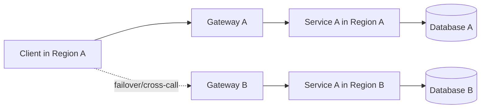
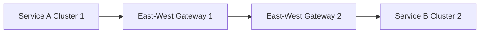
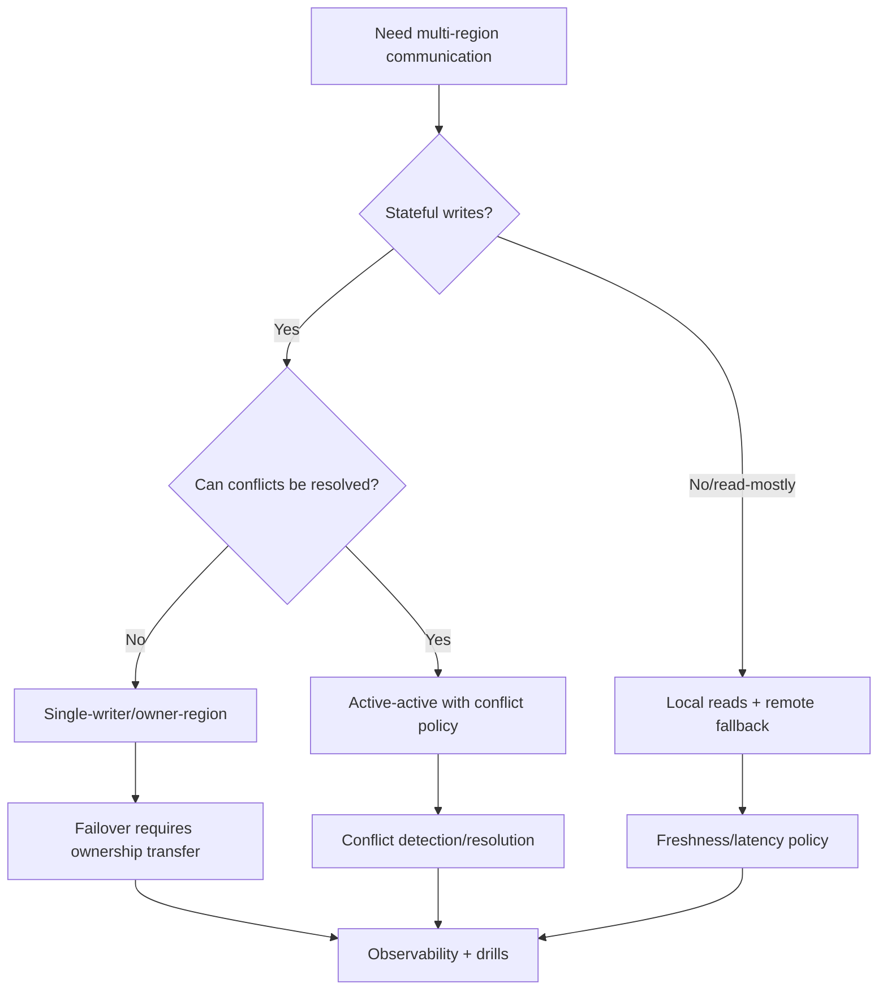

# Part 087 — Multi-Cluster, Multi-Region Communication and Failover

Single-cluster communication is already complex.

Multi-cluster and multi-region communication multiply that complexity.

Now a service call may cross:

- cluster boundary,
- region boundary,
- cloud account boundary,
- network boundary,
- trust domain boundary,
- data residency boundary,
- latency boundary,
- ownership boundary.

The naive design says:

```text
just call the same service name in another cluster
```

The production design asks:

```text
Which region owns the data?
Which endpoint is local?
When is remote call allowed?
How does failover happen?
What happens to retries during failover?
Can the command execute twice?
How do we avoid split brain?
How do we observe cross-region calls?
How do we test regional outage?
```

Multi-region communication is not simply "service discovery but bigger."

It is distributed systems architecture with operational consequences.

---

## 1. Multi-Region Mental Model



Core questions:

- Is Region A active?
- Is Region B active?
- Is data replicated?
- Is the service stateless or stateful?
- Is the command allowed in both regions?
- Is failover automatic or manual?
- Is routing based on latency, health, tenant, or ownership?
- What is the consistency model?

The answer determines communication strategy.

---

## 2. Deployment Topologies

Common topologies:

| Topology | Meaning |
|---|---|
| active-passive | one region serves, another standby |
| active-active | multiple regions serve traffic |
| active-active read, single-writer write | reads local, writes routed to owner |
| regional sharding | tenant/entity assigned to one region |
| follow-the-sun | traffic routed based on geography/time |
| disaster recovery only | secondary used during disaster |
| cell-based architecture | isolated cells each serve subset of traffic |
| multi-cluster same region | HA/scaling within region |

Do not say "multi-region" without specifying topology.

---

## 3. Active-Passive

Active-passive:

```text
Region A serves traffic
Region B is standby
```

Benefits:

- simpler data ownership,
- simpler conflict model,
- easier write consistency,
- easier operational reasoning.

Costs:

- standby may be under-tested,
- failover may be slow,
- region B capacity may be cold,
- data replication lag matters,
- DNS/global routing changes needed,
- rollback/failback is complex.

Active-passive is often better than premature active-active.

It is simpler, but still needs drills.

---

## 4. Active-Active

Active-active:

```text
multiple regions serve live traffic
```

Benefits:

- lower latency near users,
- better regional availability,
- better capacity distribution.

Costs:

- conflict resolution,
- cross-region consistency,
- split brain risk,
- data residency constraints,
- operational complexity,
- hard testing,
- idempotency and duplicate handling,
- event ordering across regions.

Active-active is not a routing feature.

It is a data and workflow architecture.

---

## 5. Single-Writer Pattern

For stateful domains, a single-writer pattern is often safer.

Example:

```text
case CASE-100 is owned by region ap-southeast-1
all commands for CASE-100 route to ap-southeast-1
reads may be served elsewhere if replicated
```

Benefits:

- no concurrent writes for same aggregate,
- simpler ordering,
- easier idempotency,
- easier event sequencing.

Costs:

- cross-region write latency for remote users,
- owner-region outage affects writes,
- routing table needed,
- failover process needed.

Single-writer per aggregate/tenant is a strong pattern for correctness.

---

## 6. Regional Sharding

Regional sharding assigns tenants/entities to regions.

Example:

```yaml
tenantRouting:
  tenant-a: ap-southeast-1
  tenant-b: eu-west-1
  tenant-c: us-east-1
```

Service routes commands based on owner region.

Read paths may use local replica.

Requirements:

- routing metadata,
- ownership lookup,
- migration process,
- failover process,
- audit,
- data residency validation,
- idempotency across route changes.

Changing tenant owner region is a data migration.

Treat it carefully.

---

## 7. Global DNS and Traffic Management

Global routing may use:

- DNS latency routing,
- health-check based DNS,
- Anycast,
- global load balancer,
- cloud traffic manager,
- CDN/edge routing,
- gateway federation.

DNS failover considerations:

- TTL,
- client caching,
- recursive resolver behavior,
- mobile/client DNS caching,
- partial region health,
- propagation delay,
- stale connections,
- split traffic during transition.

DNS failover is not instantaneous.

Design for mixed traffic during failover.

---

## 8. Locality-Aware Routing

Locality-aware routing prefers local endpoints.

Example:

```text
service in zone A calls dependency in zone A
if unavailable, fail to zone B
if region unavailable, fail to region B
```

Benefits:

- lower latency,
- lower cross-zone cost,
- better failure isolation.

Risks:

- local overload,
- inconsistent capacity,
- failover traffic spike,
- accidental cross-region data access,
- hidden dependency on remote region.

Locality policy must be visible.

Do not let clients silently fail over to forbidden regions.

---

## 9. Multi-Cluster Service Mesh

A service mesh can support multi-cluster communication.

Concepts:

- shared control plane or multiple control planes,
- trust domains,
- east-west gateways,
- service discovery across clusters,
- endpoint discovery,
- cross-cluster mTLS,
- locality routing,
- failover policy.

Benefits:

- uniform identity,
- policy across clusters,
- controlled cross-cluster routing,
- telemetry,
- mTLS.

Costs:

- complex control plane,
- certificate/trust management,
- cluster network requirements,
- debugging complexity,
- blast radius of mesh misconfiguration,
- version compatibility.

Multi-cluster mesh should be adopted with strong platform ownership.

---

## 10. East-West Gateway

East-west gateway routes service traffic between clusters.



It can provide:

- controlled cross-cluster entry,
- mTLS termination/passthrough,
- service discovery bridging,
- policy enforcement,
- observability.

It can also become:

- bottleneck,
- failure point,
- debugging layer,
- misrouting risk.

Monitor and test it like a critical gateway.

---

## 11. Trust Domain Design

Multi-cluster identities need trust-domain design.

Example:

```text
spiffe://prod.company/ns/case/sa/case-service
```

Questions:

- do clusters share trust domain?
- are identities globally unique?
- are namespaces globally meaningful?
- can same service account name in different clusters collide?
- how are roots rotated?
- how is cross-cluster authorization written?

Identity collision is a serious security risk.

Multi-cluster trust must be designed before enforcement.

---

## 12. Data Residency

Multi-region communication can violate data residency.

Example:

```text
EU customer data routed to non-EU region during failover
```

Questions:

- which data classes may leave region?
- are backups replicated cross-region?
- can replay write to another region?
- are logs/traces exported globally?
- does DLQ replicate sensitive data?
- does shadow traffic cross region?
- can support tools read payloads?

Routing policy must know data classification.

Availability does not override legal constraints unless explicitly allowed by business/legal policy.

---

## 13. Cross-Region Latency

Cross-region calls add latency and variance.

Example approximate realities:

- same zone: low single-digit ms,
- cross-zone: more latency,
- cross-region: tens to hundreds ms,
- internet/partner: variable.

Design impact:

- synchronous calls become slower,
- deadlines must account for distance,
- retries are more expensive,
- tail latency grows,
- connection pools need tuning,
- user path may fail SLO.

Prefer local reads and async cross-region propagation where possible.

---

## 14. Avoid Synchronous Cross-Region Chains

Bad:

```text
Region A service -> Region B service -> Region C service -> Region A database
```

This creates:

- high latency,
- failure amplification,
- complex retries,
- hard tracing,
- data residency risk,
- timeout tuning nightmare.

Better:

- localize workflow,
- route command to owner region,
- replicate data asynchronously,
- use events for cross-region propagation,
- use regional read models,
- avoid remote dependency in hot path.

Cross-region synchronous calls should be rare and justified.

---

## 15. Cross-Region Events

Events can replicate facts across regions.

Patterns:

- topic replication,
- event bridge,
- CDC replication,
- regional event bus,
- data lake replication,
- outbox relay per region.

Challenges:

- ordering across regions,
- duplicate events,
- replication lag,
- schema compatibility,
- data residency,
- replay semantics,
- failover event ownership,
- conflict resolution.

Event replication is not free.

It needs the same governance as local events plus regional policy.

---

## 16. Replication Lag

Replication lag affects freshness.

Example:

```text
case updated in region A
projection in region B sees update after 30 seconds
```

Expose lag:

```text
sourceRegion=ap-southeast-1
targetRegion=eu-west-1
replicationLagSeconds=30
```

User-facing read models should disclose staleness if decisions depend on freshness.

Failover may serve stale data.

Be honest in API semantics.

---

## 17. Split Brain

Split brain happens when multiple regions believe they are primary/owner and accept conflicting writes.

Example:

```text
network partition
region A accepts command for CASE-100
region B also accepts command for CASE-100
```

Now conflict exists.

Mitigations:

- single-writer ownership,
- consensus/lease mechanism,
- manual failover,
- fencing token,
- monotonic version with owner,
- reject writes when ownership uncertain,
- idempotency keys,
- conflict resolution policy.

Split brain is one of the hardest multi-region failure modes.

Avoid unless you have explicit conflict handling.

---

## 18. Fencing Tokens

Fencing token prevents old primary from continuing writes after failover.

Concept:

```text
region owner lease version = 42
commands include ownerEpoch = 42
after failover, ownerEpoch = 43
old region writes with 42 are rejected
```

Use for:

- active-passive failover,
- leader transfer,
- tenant ownership migration,
- single-writer enforcement.

Fencing is a strong pattern when ownership can change.

---

## 19. Idempotency Across Regions

Retries/failover can duplicate commands.

Example:

```text
client sends command to region A
timeout
global router sends retry to region B
region A actually committed
region B also tries
```

Need:

- global idempotency key,
- owner routing,
- command dedup replicated or routed to owner,
- stable command ID,
- reconciliation.

If idempotency store is regional only, cross-region retry can duplicate effect.

Design idempotency scope according to failover model.

---

## 20. Failover Modes

Failover can be:

| Mode | Meaning |
|---|---|
| automatic | health system shifts traffic |
| manual | operator approves |
| partial | only some tenants/services fail over |
| read-only | reads continue, writes disabled |
| degraded | limited functionality |
| cold standby | start capacity during event |
| warm standby | standby running with partial capacity |
| hot standby | standby ready at full capacity |

Automatic failover is attractive but risky for stateful writes.

Manual failover may be safer when data consistency matters.

---

## 21. Failback Is Hard

Failover:

```text
Region A -> Region B
```

Failback:

```text
Region B -> Region A
```

requires:

- data reconciliation,
- event replication catch-up,
- ownership transfer,
- idempotency consistency,
- cache/projection validation,
- routing updates,
- stale client connection handling,
- DLQ/retry cleanup.

Many teams plan failover but not failback.

That is incomplete disaster recovery.

---

## 22. Partial Failure

Region is rarely simply "up" or "down."

Partial failures:

- database degraded,
- DNS issue,
- one AZ down,
- mesh control plane down,
- egress gateway down,
- Kafka replication lag,
- identity provider unavailable,
- high packet loss,
- one dependency down.

Global health checks may route traffic incorrectly if too coarse.

Health model should be dependency-aware.

Example:

```text
region can serve reads but not writes
```

Expose capability health, not only region health.

---

## 23. Capability-Based Health

Instead of:

```json
{
  "status": "UP"
}
```

use:

```json
{
  "status": "DEGRADED",
  "capabilities": {
    "case.read": "UP",
    "case.write": "DOWN",
    "case.search": "DEGRADED"
  }
}
```

Global routing can make better decisions.

Applications can degrade gracefully.

Health is not binary in multi-region systems.

---

## 24. Multi-Region Observability

Metrics:

```text
requests.total{source_region,target_region,service,operation,status}
request.duration{source_region,target_region,service,operation}
cross_region.requests.total{source_region,target_region}
cross_region.failures.total{source_region,target_region,reason}
replication.lag.seconds{source_region,target_region,stream}
failover.events.total{from_region,to_region,service}
ownership.transfer.total{entity_type,from_region,to_region,status}
split_brain.detected.total{entity_type}
remote_dependency.calls.total{service,target_region}
```

Dashboards must show region dimension.

Average global metrics hide regional outages.

---

## 25. Tracing Cross-Region Calls

Trace attributes should include:

- source region,
- target region,
- cluster,
- zone,
- route,
- failover decision,
- owner region,
- tenant/entity if safe,
- correlation ID.

Cross-region traces help identify latency and routing mistakes.

But do not rely only on traces.

Sampling may miss rare failover paths.

Use metrics and logs too.

---

## 26. Runbook: Regional Failover

Failover runbook:

1. Confirm scope of failure.
2. Identify impacted capabilities.
3. Freeze unsafe writes if needed.
4. Check replication lag.
5. Check standby capacity.
6. Transfer ownership/lease if stateful.
7. Update global routing.
8. Monitor traffic shift.
9. Monitor errors/latency/DLQ.
10. Communicate degraded mode.
11. Record failover event.
12. Plan failback/reconciliation.

Never fail over stateful writes without understanding data ownership.

---

## 27. Runbook: Split Brain Suspected

If split brain suspected:

1. Stop writes for affected entity/tenant/domain.
2. Identify active owners.
3. Compare owner epochs/fencing tokens.
4. Inspect command/event logs.
5. Determine conflicting writes.
6. Choose authoritative state.
7. Apply compensations/corrections.
8. Replay/rebuild projections.
9. Patch ownership/lease bug.
10. Run postmortem.

Split brain is correctness incident.

Treat it as high severity.

---

## 28. Testing Multi-Region

Test scenarios:

- local region dependency down,
- remote region latency increase,
- global DNS failover,
- partial failover reads only,
- write owner region unavailable,
- idempotent retry across regions,
- duplicate command during failover,
- event replication lag,
- stale read after failover,
- split brain prevention,
- failback,
- data residency enforcement,
- cross-region mTLS trust.

Multi-region architecture without drills is theater.

---

## 29. Game Days

Run game days:

```text
Region A unavailable for writes
```

Expected:

- traffic routes according to policy,
- writes disabled or owner transferred,
- idempotency holds,
- users see correct degraded status,
- dashboards light up,
- runbook works,
- failback tested.

Start with staging.

Then controlled production game days for mature systems.

---

## 30. Capacity for Failover

If Region B takes Region A traffic, can it handle load?

Active-passive standby must have:

- compute capacity,
- database capacity,
- broker capacity,
- gateway capacity,
- egress capacity,
- license quota,
- external provider quota,
- cache warmup,
- connection pool capacity.

Failover capacity is expensive but necessary.

If standby has only 30% capacity, failover is degraded by design.

Document it.

---

## 31. Java Client Policy

Java clients should know:

- local endpoint,
- remote fallback endpoint,
- failover allowed or not,
- operation idempotency,
- deadline budget,
- region header,
- owner region,
- retry owner.

Example:

```yaml
dependencies:
  case-service:
    localTarget: http://case-service.case.svc.cluster.local:8080
    remoteFailover:
      enabled: false
      reason: writes must route to owner region
    timeoutMs: 300
```

For read-only dependency:

```yaml
dependencies:
  catalog-service:
    localTarget: http://catalog-service.catalog.svc.cluster.local:8080
    remoteFailover:
      enabled: true
      target: https://catalog.global.example.com
      onlyForMethods:
        - GET
```

Failover is operation-specific.

---

## 32. Headers for Region Context

Useful headers:

```text
X-Source-Region
X-Target-Region
X-Owner-Region
X-Failover-Reason
X-Request-Region-Policy
```

Use carefully.

Do not trust client-supplied region headers unless set by trusted gateway/mesh.

Region context helps debugging and policy.

It should not be spoofable for authorization decisions.

---

## 33. Production Policy Template

```yaml
multiRegionCommunication:
  topology: active-active-read-single-writer-write

  ownership:
    model: tenant-owner-region
    routingTable: tenant-routing
    fencingTokenRequired: true

  routing:
    reads:
      localPreferred: true
      remoteFallbackAllowed: true
      staleReadMaxSeconds: 60
    writes:
      routeToOwnerRegion: true
      remoteFallbackAllowed: false
      failoverRequiresOwnershipTransfer: true

  retries:
    crossRegionRetryAllowedFor:
      - GET
      - HEAD
    crossRegionRetryForbiddenFor:
      - POST
      - PUT
      - PATCH
      - DELETE
    idempotencyKeyRequiredForFailover: true

  observability:
    regionLabelsRequired: true
    replicationLagDashboard: true
    failoverEventAudit: true

  testing:
    regionalFailoverDrillRequired: true
    splitBrainPreventionTestRequired: true
    failbackTestRequired: true

  privacy:
    dataResidencyPolicyRequired: true
```

Multi-region policy should be reviewed by architecture, platform, security, and domain owners.

---

## 34. Common Anti-Patterns

### 34.1 Active-active without conflict model

Split brain waiting to happen.

### 34.2 Cross-region retries for unsafe commands

Duplicate side effects.

### 34.3 Global DNS failover assumed instant

Stale clients continue old route.

### 34.4 No failback plan

Disaster recovery stuck in secondary.

### 34.5 Region health is binary

Partial failures misrouted.

### 34.6 Data residency ignored during failover

Compliance incident.

### 34.7 Idempotency only regional

Cross-region retry duplicates commands.

### 34.8 Cross-region sync chains

Latency and failure amplification.

### 34.9 No replication lag metric

Stale reads surprise users.

### 34.10 No game days

Failover plan unproven.

---

## 35. Decision Model



Multi-region design starts with data ownership, not routing.

---

## 36. Design Checklist

Before enabling multi-region calls:

- What topology is used?
- Which region owns writes?
- Are reads local or global?
- Is data replicated?
- What is replication lag SLO?
- Are writes routed to owner?
- Is failover automatic or manual?
- Is fencing needed?
- Are idempotency keys global?
- Are retries safe across regions?
- Is data residency respected?
- Are region labels in telemetry?
- Is split brain prevented?
- Is failback planned?
- Is standby capacity sufficient?
- Are game days scheduled?
- Are runbooks ready?
- Is cross-region synchronous chain avoided?

---

## 37. The Real Lesson

Multi-region communication is not a networking feature.

It is an architecture commitment.

It requires:

```text
data ownership
+ routing policy
+ failover model
+ idempotency
+ fencing
+ replication
+ observability
+ capacity
+ privacy
+ drills
```

If you only configure global routing, you may get traffic failover.

You do not automatically get correctness failover.

Top-tier engineers design the correctness model before the routing model.

---

## References

- Kubernetes Multi-Cluster Services: https://kubernetes.io/docs/concepts/services-networking/multicluster/
- Istio Deployment Models: https://istio.io/latest/docs/ops/deployment/deployment-models/
- Istio Multi-Cluster Installation: https://istio.io/latest/docs/setup/install/multicluster/
- Istio Traffic Management Concepts: https://istio.io/latest/docs/concepts/traffic-management/
- Gateway API: https://gateway-api.sigs.k8s.io/
- Google SRE Book — Addressing Cascading Failures: https://sre.google/sre-book/addressing-cascading-failures/
