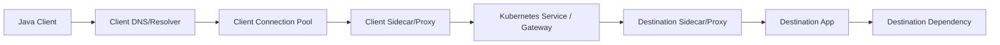
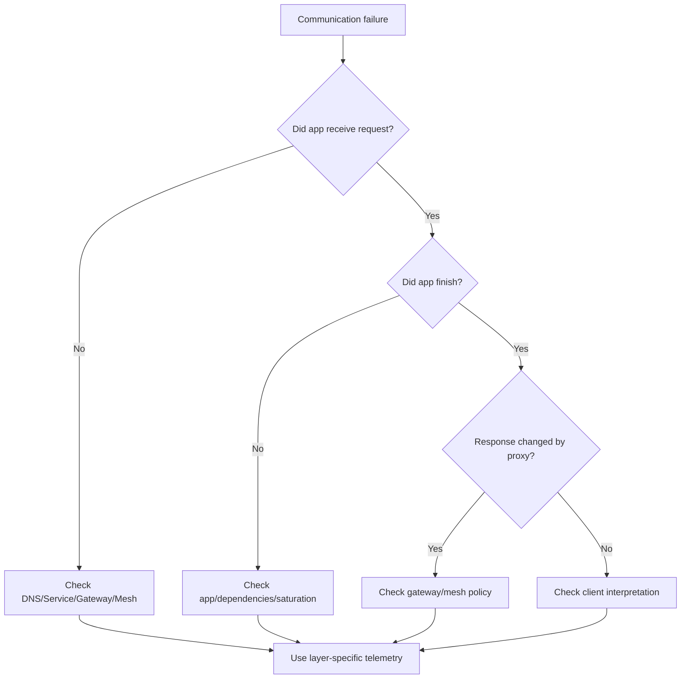

# Part 088 — Platform Communication Observability, Debugging, and Runbooks

Platform-mediated communication has many layers:

```text
Java client
DNS
Kubernetes Service
EndpointSlice
network policy
gateway
ingress
service mesh sidecar
Envoy route
mTLS
authorization policy
destination service
application handler
```

When communication fails, the symptom may be simple:

```text
HTTP 503
timeout
connection refused
gRPC UNAVAILABLE
```

But the cause may live in any layer.

A top-tier engineer can debug the path systematically.

They do not randomly increase timeouts.

They ask:

```text
Where exactly did the request fail?
Was it DNS?
Was it routing?
Was it mTLS?
Was it authz?
Was it no endpoints?
Was it the gateway?
Was it the sidecar?
Was it the app?
Was it the downstream dependency?
```

This part provides the operational model for debugging platform-mediated communication.

---

## 1. Communication Path Mental Model



A failure can occur at:

- name resolution,
- connection establishment,
- TLS handshake,
- mTLS peer auth,
- routing rule,
- authorization,
- load balancing,
- upstream connection pool,
- application readiness,
- application handler,
- downstream call,
- response path.

Observability must identify the failing segment.

---

## 2. The Four Questions

For any communication incident, ask:

### 2.1 Did the client send?

Evidence:

- client logs,
- client metrics,
- trace span,
- connection pool metrics,
- request ID.

### 2.2 Did the platform route?

Evidence:

- DNS resolution,
- gateway/mesh access logs,
- route metrics,
- Envoy response flags,
- Service endpoints.

### 2.3 Did the destination receive?

Evidence:

- server access logs,
- application metrics,
- server trace spans,
- inbound proxy logs.

### 2.4 Did the destination complete?

Evidence:

- application status,
- dependency calls,
- DB metrics,
- response code,
- error logs.

This separates client, platform, and server responsibilities.

---

## 3. Error Code Interpretation

Common symptoms:

| Symptom | Possible layer |
|---|---|
| DNS lookup failed | DNS/CoreDNS/search domain |
| connection refused | port/app not listening/proxy |
| connection timeout | network policy/routing/firewall |
| TLS handshake failed | cert/SNI/trust/mTLS |
| HTTP 401 | authn/gateway/app |
| HTTP 403 | authz/mesh/app |
| HTTP 404 | route/path/app |
| HTTP 408 | gateway/client timeout |
| HTTP 413 | gateway body limit |
| HTTP 429 | rate limit |
| HTTP 502 | gateway upstream connection/protocol |
| HTTP 503 | no healthy upstream/circuit/app |
| HTTP 504 | gateway/upstream timeout |
| gRPC UNAVAILABLE | upstream/proxy/network |
| gRPC DEADLINE_EXCEEDED | deadline/timeout |

Do not assume status code source.

A 503 may be generated by app, gateway, or proxy.

---

## 4. Source of Error

Always identify error source.

Questions:

- Did response include gateway/server headers?
- Is there an Envoy response flag?
- Does app log show request?
- Does server access log show status?
- Does gateway access log show upstream status?
- Does trace include destination span?

If gateway logs 503 but app has no request, issue is before app.

If app logs 503 and gateway shows upstream 503, app generated it.

Source matters.

---

## 5. Envoy Response Flags

Envoy access logs can include response flags.

They help identify proxy-level failures.

Examples include concepts such as:

- upstream connection failure,
- upstream reset,
- local reset,
- no healthy upstream,
- timeout,
- rate limited,
- downstream connection termination.

The exact flags depend on Envoy version/config.

Operational rule:

```text
proxy response flags are first-class debugging signals
```

Do not ignore them.

---

## 6. DNS Debugging

When service name fails:

Check from client pod:

```bash
nslookup case-service.case.svc.cluster.local
```

or:

```bash
dig case-service.case.svc.cluster.local
```

Check:

- correct namespace,
- FQDN,
- CoreDNS health,
- search path,
- Service exists,
- headless vs ClusterIP,
- DNS policy,
- network policy blocking DNS,
- JVM DNS cache.

Application symptom:

```text
UnknownHostException
```

or timeout during DNS lookup.

DNS is dependency.

Monitor it.

---

## 7. Kubernetes Service Debugging

Commands:

```bash
kubectl get svc -n case case-service
kubectl describe svc -n case case-service
kubectl get endpointslices -n case -l kubernetes.io/service-name=case-service
kubectl get pods -n case -l app=case-service -o wide
```

Check:

- Service selector,
- port/targetPort,
- endpoints exist,
- pods ready,
- labels match,
- namespace,
- headless/ClusterIP,
- endpoint addresses.

No endpoints means routing cannot work.

---

## 8. Pod Readiness Debugging

Check:

```bash
kubectl get pods -n case
kubectl describe pod -n case <pod>
kubectl logs -n case <pod>
```

Look for:

- readiness probe failures,
- liveness restarts,
- startup probe still running,
- container not listening,
- port mismatch,
- dependency readiness check broken,
- sidecar readiness issue,
- termination state.

During deploy, readiness issues are common.

---

## 9. Network Policy Debugging

Symptoms:

- connection timeout,
- one namespace cannot call another,
- DNS fails if DNS egress blocked,
- egress dependency unreachable.

Check:

```bash
kubectl get networkpolicy -A
kubectl describe networkpolicy -n <namespace>
```

Test from pod:

```bash
curl -v http://case-service.case.svc.cluster.local:8080/ready
```

Network policy bugs often look like service downtime.

Use allowed/denied connectivity tests in CI/staging.

---

## 10. Gateway/Ingress Debugging

Check:

- route exists,
- host matches,
- path matches,
- TLS certificate valid,
- backend Service exists,
- backend port correct,
- auth/rate-limit policy,
- gateway logs,
- upstream status,
- gateway-generated errors.

Commands vary by gateway/controller.

Kubernetes basics:

```bash
kubectl get ingress -A
kubectl describe ingress -n edge case-api
kubectl get httproute -A
kubectl describe httproute -n edge case-route
```

For Gateway API:

```bash
kubectl get gateway -A
kubectl get httproute -A
```

Route config is production behavior.

---

## 11. Mesh Debugging

Check:

- sidecar injected?
- sidecar ready?
- mTLS policy?
- authorization policy?
- destination rule?
- virtual service?
- service entry?
- proxy config?
- Envoy clusters/listeners/routes?
- proxy logs?

Tooling depends on mesh.

For Istio, common patterns include inspecting proxy status and proxy config.

Debug with actual source/destination identities.

Mesh issues often appear as:

- 403 denied,
- 503 no healthy upstream,
- TLS handshake failure,
- timeout,
- route to wrong subset.

---

## 12. Authorization Debugging

For 403/denied:

Ask:

- Who is source principal?
- What is destination workload?
- Which policy applied?
- Is namespace correct?
- Is service account correct?
- Is path/method matched?
- Is JWT required?
- Are claims present?
- Is request coming through gateway or direct?
- Are dry-run policies showing would-deny?

Authorization logs should include policy name and principal.

If not, debugging becomes painful.

---

## 13. mTLS Debugging

Symptoms:

- TLS handshake failures,
- connection reset,
- 503 upstream connect error,
- peer authentication failure.

Check:

- source has sidecar/proxy,
- destination expects STRICT/PERMISSIVE,
- certificates valid,
- trust domain compatible,
- destination policy,
- gateway TLS mode,
- service entry TLS mode,
- client/proxy SNI.

mTLS misconfiguration is common during migration.

Use permissive/dry-run phases.

---

## 14. Route Debugging

For wrong routing:

- match order,
- host,
- path,
- headers,
- method,
- subset,
- weight,
- gateway binding,
- namespace,
- export/import scope,
- labels.

Canary issues often come from:

- subset label mismatch,
- weight typo,
- route rule priority,
- header not injected,
- route applied in wrong namespace,
- stale proxy config.

Test route rules with real requests.

---

## 15. Java Client Debugging

Client-side metrics:

```text
http.client.requests{dependency,status}
http.client.duration{dependency}
http.client.connection.acquire.duration
http.client.connection.active
http.client.connection.idle
http.client.errors{exception}
grpc.client.calls{method,status}
grpc.channel.state
```

Client logs should include:

- dependency name,
- method/operation,
- timeout budget,
- attempt count,
- error type,
- request ID,
- correlation ID,
- target host,
- not full payload.

Common Java issues:

- connection pool exhausted,
- DNS cached too long,
- connect timeout too high,
- response timeout missing,
- retry loop,
- request body not repeatable,
- gRPC channel stuck,
- TLS truststore issue.

---

## 16. Timeout Debugging

When a timeout occurs:

Ask:

- which timeout fired?
- client connect timeout?
- client response timeout?
- gateway timeout?
- mesh route timeout?
- server execution timeout?
- DB timeout?
- downstream timeout?
- overall deadline?

Timeline trace:

```text
client deadline 500ms
mesh per-try timeout 400ms
backend DB timeout 2s
```

This is inconsistent.

Timeout debugging requires timeline.

Use trace spans and logs with elapsed time.

---

## 17. Retry Debugging

When traffic amplifies:

- client retries?
- gateway retries?
- mesh retries?
- server retries?
- async retry?
- external provider retry?
- load balancer retry?

Compute attempts:

```text
client attempts × gateway attempts × mesh attempts × server attempts
```

If not controlled, a single request can become many upstream calls.

Retry metrics must be tagged by layer.

---

## 18. Observability Correlation

Use consistent IDs:

- request ID,
- trace ID,
- correlation ID,
- causation ID,
- workflow ID,
- event ID if async side effect,
- region/cluster.

Headers:

```text
X-Request-Id
traceparent
tracestate
X-Correlation-Id
X-Causation-Id
```

Do not rely on one ID for all purposes.

Request ID helps edge debugging.

Correlation ID helps business flow.

Trace ID helps distributed trace.

---

## 19. Golden Signals by Layer

### Client

- request rate,
- error rate,
- latency,
- connection pool saturation,
- timeout/retry count.

### Gateway

- route rate,
- auth failures,
- rate limits,
- upstream failures,
- gateway-generated 5xx.

### Mesh/Proxy

- source/destination traffic,
- mTLS status,
- authz denies,
- retries/timeouts,
- outlier ejections,
- proxy resource usage.

### Destination App

- inbound rate,
- handler latency,
- error classification,
- dependency errors,
- saturation.

### Platform

- DNS health,
- endpoint count,
- pod readiness,
- network policy denies,
- node/network health.

Observe all layers.

---

## 20. Dashboard Design

Dashboard tabs:

1. Dependency map.
2. Gateway routes.
3. Service-to-service mesh traffic.
4. DNS/service endpoint health.
5. Client dependency metrics.
6. Destination service metrics.
7. Auth/mTLS/security denies.
8. Canary/version traffic.
9. Egress dependencies.
10. Multi-region traffic.

Each dashboard should answer:

```text
where is traffic failing?
what changed recently?
which team owns the layer?
what is the business impact?
```

---

## 21. Dependency Graph

A dependency graph shows:

```text
service A -> service B
service A -> external provider
gateway -> service C
```

Enhance with:

- rate,
- error rate,
- latency,
- mTLS,
- authz denies,
- retry count,
- version,
- region,
- owner.

Dependency graphs reveal hidden dependencies.

But they must be accurate.

Traffic observed by mesh/gateway can help build them.

---

## 22. Canary Debugging

When canary fails:

Check by version:

- error rate,
- p99 latency,
- gateway status,
- app status,
- business errors,
- DB errors,
- event DLQ,
- projection lag,
- auth denies,
- retries.

Questions:

- Is only v2 failing?
- Is route sending expected percentage?
- Are v2 pods ready?
- Are v2 labels correct?
- Is v2 schema compatible?
- Did v2 emit bad events?
- Is rollback data-safe?

Canary debugging must include async side effects too.

---

## 23. Egress Debugging

External call fails.

Check:

- DNS resolution,
- egress policy allows host,
- ServiceEntry exists,
- egress gateway route,
- TLS/SNI,
- client cert,
- API credential,
- provider status,
- rate limit,
- source IP allowlist,
- firewall/private link,
- circuit breaker,
- provider error body.

External failures often involve teams outside your platform.

Runbooks need contact paths.

---

## 24. Multi-Region Debugging

Check:

- source region,
- target region,
- global routing decision,
- owner region,
- replication lag,
- cross-region latency,
- failover status,
- data residency policy,
- mTLS trust domain,
- regional capacity,
- partial outage.

Do not debug multi-region issue with global averages.

Always split by region/cluster.

---

## 25. Runbook: HTTP 503

Steps:

1. Identify response source: app, gateway, proxy.
2. Check gateway/mesh response flags.
3. Check destination app received request.
4. Check Service endpoints.
5. Check pod readiness.
6. Check route/subset labels.
7. Check outlier ejection/circuit breaking.
8. Check recent deploy/config change.
9. Check dependency saturation.
10. Mitigate: rollback route, scale, pause canary, fix readiness.

503 is a symptom.

Find the generator.

---

## 26. Runbook: Timeout

Steps:

1. Identify timeout layer.
2. Check client timeout config.
3. Check gateway/mesh timeout.
4. Check backend latency.
5. Check downstream dependency.
6. Check retries increasing latency.
7. Check connection pool acquisition.
8. Check DNS/connect latency.
9. Check saturation CPU/DB/thread pool.
10. Mitigate with fail-fast, rollback, throttle, circuit breaker.

Timeout without layer identification leads to bad fixes.

---

## 27. Runbook: 403 Denied

Steps:

1. Identify whether 403 from gateway, mesh, or app.
2. Capture source principal.
3. Capture destination workload.
4. Capture method/path.
5. Check auth token/JWT.
6. Check AuthorizationPolicy.
7. Check trusted identity headers.
8. Check direct vs gateway path.
9. Check recent policy change.
10. Mitigate with correct minimal allow rule or rollback.

Never fix by broad wildcard allow unless emergency approved and time-bounded.

---

## 28. Runbook: DNS Failure

Steps:

1. Reproduce from pod.
2. Check FQDN and namespace.
3. Check CoreDNS health.
4. Check DNS egress/network policy.
5. Check Service exists.
6. Check search domains.
7. Check JVM cache if stale.
8. Check node-level DNS issues.
9. Check external DNS provider if external.
10. Mitigate with rollback, local cache, or platform fix.

DNS failure can become cascading failure if clients retry aggressively.

---

## 29. Runbook: Bad Route/Canary

Steps:

1. Route canary weight to 0 if user impact.
2. Verify traffic returns to stable subset.
3. Check subset labels.
4. Check route match priority.
5. Check metrics by version.
6. Check bad version side effects/events.
7. Check schema/database compatibility.
8. Preserve logs/traces for analysis.
9. Fix config in code.
10. Add route test.

Traffic rollback is fast.

Data rollback may not be.

---

## 30. Runbook: Egress Provider Down

Steps:

1. Confirm provider-specific metrics.
2. Check DNS/TLS/auth/rate limit.
3. Check egress gateway health.
4. Check provider status.
5. Open circuit/enable degradation.
6. Queue async work if supported.
7. Stop retry storm.
8. Communicate feature degradation.
9. Reconcile after provider recovers.
10. Review timeout/retry/bulkhead.

External outages should not take down unrelated internal services.

---

## 31. Testing Debuggability

Test not only behavior, but debuggability.

Examples:

- route failure includes route name,
- authz deny logs policy name,
- timeout logs dependency and timeout type,
- proxy access logs include request ID,
- app logs include correlation ID,
- canary metrics include version,
- egress errors include provider name,
- DNS errors include hostname.

If incidents cannot be diagnosed quickly, observability is incomplete.

---

## 32. Observability Contract

Every service should expose:

```yaml
communicationObservability:
  inbound:
    requestRate: true
    errorRate: true
    duration: true
    requestId: true
    traceId: true
  outbound:
    dependencyMetrics: true
    timeoutType: true
    retryCount: true
    connectionPool: true
  platform:
    routeName: true
    sourcePrincipal: true
    destinationPrincipal: true
    mTls: true
  logs:
    structured: true
    payloadLogging: disabled
```

This is a contract between app and platform teams.

---

## 33. Synthetic Probes

Use probes for:

- gateway route health,
- internal service path,
- egress provider sandbox,
- cross-region route,
- mTLS/authz test,
- canary route,
- DNS resolution.

Probes should test meaningful paths.

Not only:

```text
GET /health
```

But:

```text
authenticated GET /cases/{synthetic-id}
```

when safe.

Synthetic probes catch routing/auth failures before users do.

---

## 34. Change Correlation

Many communication incidents are caused by config changes.

Correlate alerts with:

- deployment,
- route change,
- mesh policy change,
- gateway config change,
- DNS change,
- certificate rotation,
- NetworkPolicy change,
- secret rotation,
- schema migration,
- HPA scaling,
- node upgrade.

Dashboards should show recent changes.

"Nothing changed" is often false.

---

## 35. Production Policy Template

```yaml
platformCommunicationObservability:
  requiredSignals:
    dns:
      - lookupFailures
      - corednsErrors
    kubernetesService:
      - endpointCount
      - readinessTransitions
    gateway:
      - routeMetrics
      - upstreamStatus
      - authFailures
      - rateLimits
      - timeouts
    mesh:
      - sourceDestinationMetrics
      - mtlsStatus
      - authzDenies
      - responseFlags
      - retries
      - outlierEjections
    javaClient:
      - dependencyLatency
      - connectionPoolMetrics
      - timeoutType
      - retryCount
    egress:
      - providerLatency
      - tlsFailures
      - rateLimits
      - circuitState

  logs:
    structured: true
    requestIdRequired: true
    correlationIdRequired: true
    payloadLogging: disabled

  runbooks:
    required:
      - http503
      - timeout
      - dnsFailure
      - authzDeny
      - badCanary
      - egressProviderDown

  testing:
    routeTestsRequired: true
    authzNegativeTestsRequired: true
    syntheticProbesRequired: true
    debuggabilityTestsRequired: true
```

If this policy is missing, incidents become archaeology.

---

## 36. Common Anti-Patterns

### 36.1 Debugging only app logs

Failure may be DNS/gateway/mesh.

### 36.2 No response source identification

503 origin unclear.

### 36.3 No route/version labels

Canary invisible.

### 36.4 No authz deny logs

403 impossible to debug.

### 36.5 No endpoint count metrics

Zero-endpoint Service discovered by users.

### 36.6 Payload logs for debugging

Security risk.

### 36.7 Global averages in multi-region

Regional outage hidden.

### 36.8 Retry count not visible

Amplification hidden.

### 36.9 No synthetic probes

Route/auth failures found by customers.

### 36.10 No runbooks

Incident response improvisation.

---

## 37. Decision Model



Debug by narrowing the failing segment.

---

## 38. Design Checklist

Before declaring platform communication operable:

- Can you identify error source?
- Are DNS failures visible?
- Are Service endpoints monitored?
- Are readiness transitions visible?
- Are gateway route metrics available?
- Are mesh response flags logged?
- Are authz denies explainable?
- Are mTLS failures visible?
- Are Java client connection pools monitored?
- Are timeout types distinguishable?
- Are retries counted by layer?
- Are egress providers named in metrics?
- Are region/cluster labels present?
- Are synthetic probes configured?
- Are runbooks written and tested?
- Are recent config changes visible?
- Are logs structured and redacted?

---

## 39. The Real Lesson

Platform-mediated communication adds power and layers.

Those layers must be observable.

A mature system can answer quickly:

```text
where did the request go?
which policy applied?
which identity was used?
which route matched?
which backend received it?
which layer returned the error?
what changed recently?
who owns the fix?
```

If you cannot answer those, service discovery, gateways, and mesh have become hidden complexity.

Production readiness means every routing layer is debuggable.

---

## References

- Kubernetes Services: https://kubernetes.io/docs/concepts/services-networking/service/
- Kubernetes DNS for Services and Pods: https://kubernetes.io/docs/concepts/services-networking/dns-pod-service/
- Kubernetes Gateway API: https://kubernetes.io/docs/concepts/services-networking/gateway/
- Istio Operations and Deployment Architecture: https://istio.io/latest/docs/ops/deployment/architecture/
- Istio Security Concepts: https://istio.io/latest/docs/concepts/security/
- Envoy Access Logging: https://www.envoyproxy.io/docs/envoy/latest/configuration/observability/access_log/usage
- Envoy Response Flags: https://www.envoyproxy.io/docs/envoy/latest/configuration/observability/access_log/usage#response-flags
