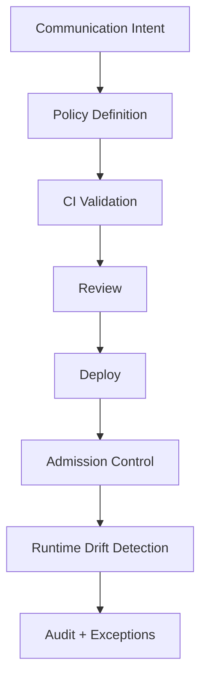
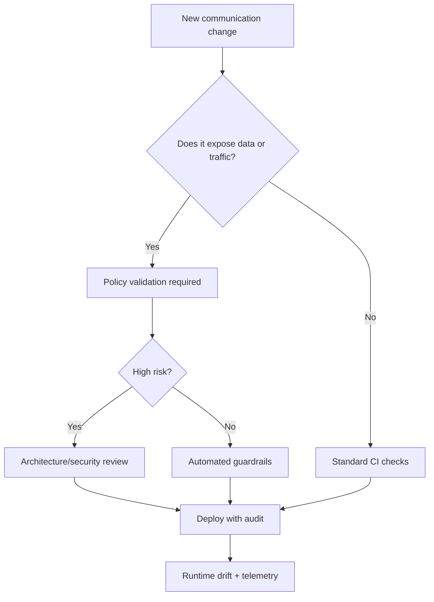

# Part 089 — Communication Policy as Code and Governance Guardrails

At small scale, communication policy lives in people's heads.

At serious scale, that fails.

A mature microservice platform has hundreds or thousands of communication rules:

- which service can call which service,
- which route is exposed publicly,
- which topic can be produced by whom,
- which consumer can read which topic,
- which timeout is allowed,
- which retries are safe,
- which routes need authentication,
- which topics contain PII,
- which egress hosts are allowed,
- which service has mTLS strict,
- which event schemas are compatible,
- which routes can be mirrored,
- which DLQs have owners,
- which cross-region calls are forbidden.

If this is managed manually, drift is guaranteed.

Policy as code means these rules are:

```text
declared
versioned
reviewed
tested
enforced
audited
continuously checked
```

A top-tier engineer does not rely on good intentions for production communication safety.

They build guardrails.

---

## 1. Policy as Code Mental Model



Policy as code is not only writing YAML.

It is the full lifecycle:

1. define desired communication state,
2. validate before merge,
3. enforce during deployment,
4. detect drift after deployment,
5. review exceptions,
6. audit changes.

The goal:

```text
unsafe communication behavior should be hard to deploy accidentally
```

---

## 2. Why Communication Needs Guardrails

Communication mistakes are often systemic:

| Mistake | Impact |
|---|---|
| route exposed without auth | security incident |
| POST retry enabled at gateway | duplicate side effects |
| service has no timeout | thread exhaustion |
| topic has no owner | no incident response |
| DLQ has no alert | silent data loss |
| wildcard ACL | data exfiltration risk |
| no readiness probe | deploy error spike |
| mesh authz broad allow | zero-trust bypass |
| egress wildcard | uncontrolled external calls |
| schema compatibility disabled | consumer breakage |
| cross-region write retry | duplicate commands |

These are not business logic bugs.

They are platform communication governance bugs.

Guardrails catch them early.

---

## 3. Communication Policy Surfaces

Policy exists across many surfaces:

```text
Kubernetes manifests
Gateway API / Ingress
service mesh config
Kafka topics/ACLs/schema registry
OpenAPI / AsyncAPI
client config
resilience config
NetworkPolicy
secret/config management
CI/CD pipeline
observability dashboards
runbooks
```

Policy as code should connect these surfaces.

Example:

```text
AsyncAPI says topic contains PII
Kafka ACL policy restricts consumers
logging policy forbids payload logs
replay policy requires approval
```

If these are disconnected, the system becomes inconsistent.

---

## 4. Policy Categories

Communication policies can be grouped.

### 4.1 Safety policy

- timeouts required,
- retries bounded,
- unsafe retries forbidden,
- readiness required,
- graceful shutdown required.

### 4.2 Security policy

- mTLS required,
- auth required for public routes,
- service accounts unique,
- ACLs least privilege,
- egress default deny.

### 4.3 Data policy

- PII classification required,
- secrets forbidden in events,
- payload logging disabled,
- retention defined.

### 4.4 Reliability policy

- outbox for critical events,
- DLQ owner required,
- idempotency key for commands,
- replay approval.

### 4.5 Observability policy

- metrics required,
- logs structured,
- request IDs propagated,
- dashboards/runbooks linked.

### 4.6 Ownership policy

- every route/topic/dependency has owner,
- escalation contact,
- runbook link,
- lifecycle status.

Policy should be understandable by both humans and machines.

---

## 5. Example: Route Policy

A public route contract:

```yaml
apiVersion: platform.example.com/v1
kind: CommunicationRoutePolicy
metadata:
  name: case-public-api
spec:
  owner: case-platform
  exposure: public
  host: api.example.com
  pathPrefix: /cases
  backend:
    service: case-service.case.svc.cluster.local
    port: 8080
  auth:
    required: true
    type: oidc-jwt
  timeouts:
    requestMs: 1000
    connectMs: 100
  retries:
    enabled: true
    allowedMethods:
      - GET
      - HEAD
    maxAttempts: 2
  limits:
    maxBodyBytes: 1048576
  observability:
    dashboard: https://observability.example.com/case-api
    runbook: runbooks/case-api.md
```

This can generate or validate gateway config.

The route is now reviewable as an API artifact.

---

## 6. Example: Service Dependency Policy

```yaml
apiVersion: platform.example.com/v1
kind: ServiceDependencyPolicy
metadata:
  name: order-service-to-case-service
spec:
  source:
    namespace: order
    serviceAccount: order-service
  destination:
    namespace: case
    service: case-service
    port: 8080
  protocol: http
  allowedOperations:
    - method: GET
      path: /internal/cases/*
  timeoutMs: 300
  retry:
    enabled: true
    safeMethodsOnly: true
    maxAttempts: 2
  mesh:
    mtls: required
    authorizationPolicy: required
  observability:
    dependencyMetricRequired: true
```

This policy can drive:

- mesh AuthorizationPolicy,
- client config validation,
- dependency catalog,
- dashboard labels,
- architecture review.

The dependency is no longer hidden.

---

## 7. Example: Event Topic Policy

```yaml
apiVersion: platform.example.com/v1
kind: EventTopicPolicy
metadata:
  name: case-events
spec:
  owner: case-platform
  classification: internal-confidential
  containsPii: true
  retention: 7d
  partitions: 48
  key:
    field: caseId
    required: true
    orderingScope: per-case
  schema:
    format: json-schema
    compatibility: full-transitive
    registrySubject: case-events-value
  producers:
    - principal: case-service
      eventTypes:
        - com.example.case.CaseCreated.v1
        - com.example.case.CaseEscalated.v1
  consumers:
    - principal: search-indexer
      groupId: search-indexer
    - principal: audit-service
      groupId: audit-service
  dlq:
    ownerRequired: true
    alertOnFirstMessage: true
  replay:
    approvalRequired: true
    sideEffectSuppressionRequired: true
```

This policy connects Kafka, schema, security, replay, and ownership.

---

## 8. Policy Validation in CI

CI should reject risky changes before deployment.

Examples:

```text
route exposed publicly without auth -> fail
POST retry enabled without idempotency policy -> fail
Service without readinessProbe -> fail
Kafka topic without owner -> fail
topic containsPii true but wildcard consumer ACL -> fail
mesh AuthorizationPolicy allows "*" -> fail
egress host wildcard too broad -> fail
event schema breaking change without major version -> fail
DLQ without owner -> fail
```

CI guardrails should produce useful messages.

Bad:

```text
policy violation
```

Good:

```text
Route case-public-api is public but auth.required=false. Public routes must require auth unless exception ticket is approved.
```

Guardrails should teach.

---

## 9. Admission Control

CI is not enough.

Someone can deploy manually.

Admission control enforces policy at the cluster/API server level.

Common approaches include policy engines such as:

- OPA Gatekeeper-style constraint admission,
- Kyverno-style Kubernetes policies,
- custom admission webhooks,
- cloud/platform policy controllers.

Examples:

- reject Deployment without readiness probe,
- reject Ingress without owner label,
- reject Gateway route with no timeout,
- reject ServiceAccount default usage,
- reject wildcard egress,
- reject privileged bypass annotations.

Admission control prevents unsafe runtime state from entering the cluster.

Use gradually and with clear exception handling.

---

## 10. Example Admission Rule Concepts

Reject public route without auth:

```text
if resource.kind in ["Ingress", "HTTPRoute"]
and exposure == "public"
and auth.required != true
then deny
```

Reject unsafe retry:

```text
if route.retries.enabled
and route.methods includes POST
and route.idempotency.required != true
then deny
```

Reject missing owner:

```text
if communication resource has no owner label
then deny
```

Reject default service account:

```text
if deployment.spec.template.spec.serviceAccountName is empty or "default"
then deny
```

Rules should map to documented policies.

---

## 11. Policy Severity Levels

Not every violation must block immediately.

Severity levels:

| Level | Behavior |
|---|---|
| info | report only |
| warn | allow but alert/review |
| audit | record would-deny |
| block | reject deployment |
| emergency exception | allow with approval and expiry |

Adoption strategy:

1. audit mode,
2. warnings,
3. block new violations,
4. remediate existing,
5. block all.

This avoids breaking the platform overnight.

---

## 12. Exception Handling

Policies need exceptions.

But exceptions must be controlled.

Exception record:

```yaml
apiVersion: platform.example.com/v1
kind: PolicyException
metadata:
  name: case-api-temporary-post-retry
spec:
  policy: no-unsafe-post-retry
  resource: case-public-api
  reason: temporary migration; endpoint has idempotency key but metadata not yet modeled
  owner: case-platform
  approvedBy: architecture-review
  expiresAt: 2026-08-01T00:00:00Z
  mitigation:
    - idempotency-key-required
    - retry-attempts-limited-to-2
```

Exception without expiry becomes policy erosion.

Track exceptions like technical debt.

---

## 13. Drift Detection

Drift means actual runtime differs from desired policy.

Examples:

- actual Kafka ACL grants extra consumer,
- topic partition count differs,
- route exists without catalog entry,
- mesh policy changed manually,
- schema compatibility disabled,
- service uses default service account,
- public Ingress bypasses gateway,
- NetworkPolicy missing,
- dashboard missing.

Drift detector compares:

```text
desired state in Git/catalog
vs
actual state in cluster/broker/gateway/mesh
```

Drift reports should be visible and actionable.

---

## 14. Ownership Labels

Every communication resource should include owner labels.

Examples:

```yaml
metadata:
  labels:
    owner.team: case-platform
    owner.slack: "#case-platform"
    system: case-management
    environment: production
    data.classification: internal-confidential
```

Owner is required for:

- routes,
- topics,
- DLQs,
- service accounts,
- mesh policies,
- egress entries,
- dashboards,
- runbooks.

No owner means no accountability.

---

## 15. Communication Catalog

A catalog should answer:

- what services exist?
- what APIs do they expose?
- what topics do they produce/consume?
- what external dependencies do they call?
- what routes expose them?
- what service accounts do they use?
- what policies protect them?
- who owns them?
- what runbooks/dashboards exist?

Sources:

- Kubernetes manifests,
- OpenAPI,
- AsyncAPI,
- Kafka ACLs/topics,
- mesh telemetry,
- gateway config,
- service metadata,
- CI registration.

Catalog is not documentation only.

It is operational inventory.

---

## 16. Dependency Review

For every new dependency:

```text
source service -> destination service/topic/provider
```

review:

- business purpose,
- protocol,
- data classification,
- timeout,
- retry,
- authz,
- ownership,
- SLO impact,
- failure behavior,
- observability,
- runbook,
- deprecation plan.

This prevents hidden dependency graphs.

Hidden dependencies cause cascading failures.

---

## 17. Policy Composition Across Artifacts

Example requirement:

```text
case-events contains PII
```

Implications:

- Kafka ACLs restricted,
- DLQ restricted,
- replay approval required,
- payload logging forbidden,
- AsyncAPI classification set,
- data lake export reviewed,
- retention limited,
- consumers documented,
- schema fields reviewed.

Policy engine should check related artifacts.

The hardest policy bugs are cross-artifact inconsistencies.

---

## 18. OpenAPI and AsyncAPI Gates

For OpenAPI:

- auth required for non-public docs,
- operation IDs stable,
- error schema standard,
- idempotency key required for retryable commands,
- rate limit docs,
- deprecation metadata,
- ownership.

For AsyncAPI:

- topic/channel documented,
- key policy,
- schema reference,
- examples,
- classification,
- replay policy,
- consumer list,
- compatibility.

API contracts should be CI artifacts.

Not PDF documents after release.

---

## 19. Resilience Policy Gates

Validate:

- every dependency has timeout,
- no infinite retry,
- retries only on safe operations,
- circuit breaker for external dependencies,
- bulkhead for high-risk dependencies,
- fallback semantics documented,
- gateway/mesh/app retry ownership not duplicated.

Example invalid:

```yaml
clientRetries: 3
gatewayRetries: 3
meshRetries: 3
```

This can create 27 attempts.

Policy should detect retry amplification.

---

## 20. Security Policy Gates

Validate:

- public routes require auth,
- internal sensitive services default deny,
- mesh mTLS strict for production namespaces,
- service account not default,
- egress allowlist required,
- wildcard hosts prohibited,
- sensitive topics no wildcard ACLs,
- secrets not in manifests,
- JWT issuer/audience configured,
- identity headers stripped at gateway.

Security guardrails are especially important because communication mistakes can expose data.

---

## 21. Data Policy Gates

Validate:

- PII classification,
- forbidden field names,
- retention,
- DLQ retention/classification,
- payload logging disabled,
- replay approval,
- data residency tags,
- cross-region replication approval,
- event schema privacy review when new sensitive fields added.

Data policy must apply to:

- HTTP payloads,
- events,
- logs,
- DLQs,
- traces,
- projections,
- external calls.

Communication moves data.

Data policy belongs here.

---

## 22. Observability Gates

Validate:

- route has dashboard,
- topic has lag dashboard,
- DLQ alert exists,
- outbox alert exists,
- service has dependency metrics,
- request ID propagated,
- trace context propagated,
- runbook link exists,
- owner exists.

Observability should be required before exposure.

Not added after incident.

---

## 23. Production Rollout Policy

For communication changes:

- canary required for public route changes,
- dual-publish required for breaking event migration,
- shadow mode required for new projection,
- staged mTLS migration,
- dry-run authz before enforce,
- egress synthetic probe before production,
- rollback plan.

Policy as code should encode rollout requirements.

Example:

```text
If route exposure changes from internal to public, security review required.
```

---

## 24. Policy Testing

Policy itself needs tests.

Example test cases:

- public route without auth is denied,
- internal route with auth passes,
- POST retry without idempotency denied,
- GET retry allowed,
- topic with PII and wildcard consumer denied,
- service with default service account denied,
- egress wildcard denied.

Policy tests prevent guardrails from silently weakening.

Treat policy code like application code.

---

## 25. Gradual Adoption

Do not start by blocking everything.

Adoption plan:

1. inventory resources,
2. define baseline policies,
3. run audit mode,
4. report violations,
5. remediate high-risk items,
6. block new high-risk violations,
7. create exception process,
8. tighten over time,
9. publish dashboards,
10. continuously improve.

Policy rollout is organizational change.

Make it collaborative.

---

## 26. Developer Experience

Bad guardrail:

```text
Denied.
```

Good guardrail:

```text
Denied: HTTPRoute case-api is public but has no auth policy.
Fix: add spec.auth.required=true or create approved PolicyException.
Docs: /platform/policies/public-routes.md
Owner: platform-security
```

Guardrails should:

- explain problem,
- show fix,
- link docs,
- identify owner,
- support local validation,
- provide examples.

Developer experience determines whether teams adopt or bypass guardrails.

---

## 27. Local Validation

Provide local tooling:

```bash
platformctl validate communication/
```

or:

```bash
make policy-check
```

It should run the same checks as CI when possible.

Developers should not wait for CI to discover simple policy errors.

Fast feedback reduces friction.

---

## 28. Generated Configuration

Some organizations generate platform config from higher-level policy.

Example:

```text
CommunicationRoutePolicy -> HTTPRoute + AuthPolicy + RateLimitPolicy + Dashboard
EventTopicPolicy -> Kafka topic + ACLs + schema subject + dashboard
```

Benefits:

- consistency,
- less boilerplate,
- fewer drift bugs,
- easier review.

Risks:

- generator complexity,
- escape hatches,
- hidden generated behavior,
- versioning.

Generation is powerful if source policy is clear and generated output is inspectable.

---

## 29. Runtime Verification

Even if config is valid, runtime may fail.

Runtime verification:

- synthetic probes,
- route conformance tests,
- authz negative tests,
- egress allowed/denied tests,
- topic ACL tests,
- schema registry checks,
- dashboard existence checks,
- SLO burn alerts,
- drift detection.

Policy as code must be paired with runtime evidence.

A route can pass YAML validation and still fail due to wrong backend.

---

## 30. Audit Trail

Audit communication changes:

- who changed route,
- who changed ACL,
- who changed authz,
- who changed retry,
- who enabled public exposure,
- who approved exception,
- who reset offset,
- who replayed DLQ,
- who changed retention,
- who added egress host.

Audit must include:

- reason,
- ticket/change ID,
- approver,
- diff,
- deployment time,
- rollback plan.

Communication changes can be security and reliability incidents.

---

## 31. Emergency Changes

Emergencies happen.

Define emergency process:

- break-glass permission,
- time-limited exception,
- mandatory audit,
- post-incident review,
- automatic expiry,
- alert to owners,
- required follow-up PR.

Emergency bypass without review becomes permanent backdoor.

---

## 32. Policy Metrics

Track guardrail health:

```text
policy.violations.total{policy,severity}
policy.denials.total{policy}
policy.exceptions.active{policy}
policy.exceptions.expiring_soon{policy}
policy.drift.detected.total{resource_type}
policy.coverage.percent{policy_domain}
policy.audit_mode.would_deny.total{policy}
```

Policy itself should be observable.

Too many exceptions may mean policy is unrealistic or platform support is insufficient.

---

## 33. Communication Review Board

At scale, some changes require review:

- new public API route,
- new sensitive topic,
- cross-region data replication,
- unsafe retry exception,
- broad egress wildcard,
- breaking event/API change,
- new external provider,
- default deny bypass,
- topic retention change.

Review should be lightweight but serious.

The goal is not bureaucracy.

The goal is preventing irreversible communication mistakes.

---

## 34. Production Policy Template

```yaml
communicationGovernance:
  requiredMetadata:
    - owner
    - system
    - environment
    - dataClassification
    - runbook
    - dashboard

  gateway:
    publicRoutesRequireAuth: true
    timeoutRequired: true
    unsafeRetriesForbidden: true
    requestBodyLimitRequired: true

  kubernetes:
    readinessProbeRequired: true
    defaultServiceAccountForbidden: true
    gracefulShutdownRequired: true

  mesh:
    mtlsRequiredInProduction: true
    defaultDenyRequiredForSensitiveNamespaces: true
    wildcardAllowForbidden: true

  kafka:
    topicOwnerRequired: true
    schemaCompatibilityRequired: true
    piiWildcardConsumerForbidden: true
    dlqOwnerRequired: true

  egress:
    defaultDeny: true
    serviceEntryRequired: true
    wildcardHostRequiresReview: true

  exceptions:
    expiryRequired: true
    approvalRequired: true
    auditRequired: true

  driftDetection:
    enabled: true
    interval: 1h
```

This is the kind of platform policy that keeps microservices governable.

---

## 35. Common Anti-Patterns

### 35.1 Policy only in wiki

Not enforced.

### 35.2 Admission control with no exception process

Teams bypass platform.

### 35.3 Exceptions without expiry

Policy erosion.

### 35.4 CI checks not aligned with runtime

False confidence.

### 35.5 Wildcard policies everywhere

Governance theater.

### 35.6 No drift detection

Manual changes persist.

### 35.7 No owner metadata

Incidents stall.

### 35.8 Blocking rules with poor messages

Developer hostility.

### 35.9 Policy not tested

Guardrails break silently.

### 35.10 Generated config that cannot be inspected

Hidden complexity.

---

## 36. Decision Model



The higher the blast radius, the stronger the guardrail.

---

## 37. Design Checklist

Before declaring communication governance mature:

- Are communication policies versioned?
- Are public routes checked for auth?
- Are timeouts required?
- Are unsafe retries blocked?
- Are readiness probes required?
- Are service accounts unique?
- Is mTLS policy enforced?
- Are Kafka topics governed?
- Are event schemas checked?
- Is egress default-deny?
- Are owner labels required?
- Are dashboards/runbooks required?
- Is drift detected?
- Are exceptions time-limited?
- Are policy tests written?
- Can developers validate locally?
- Are policy violations explained clearly?
- Is audit available?
- Is emergency process defined?

---

## 38. The Real Lesson

Microservice communication does not stay safe through memory and meetings.

It stays safe through executable governance.

Production platforms need:

```text
policy as code
+ CI checks
+ admission control
+ drift detection
+ exception management
+ ownership metadata
+ runtime verification
```

This is not bureaucracy.

It is how large engineering organizations keep communication complexity from turning into reliability and security chaos.

Guardrails let teams move fast without repeatedly rediscovering the same dangerous mistakes.

---

## References

- Kubernetes Admission Controllers: https://kubernetes.io/docs/reference/access-authn-authz/admission-controllers/
- Kubernetes Dynamic Admission Control: https://kubernetes.io/docs/reference/access-authn-authz/extensible-admission-controllers/
- Open Policy Agent Gatekeeper: https://open-policy-agent.github.io/gatekeeper/website/
- Kyverno Policies: https://kyverno.io/policies/
- Kubernetes Gateway API: https://gateway-api.sigs.k8s.io/
- Istio Authorization Policy: https://istio.io/latest/docs/reference/config/security/authorization-policy/
- AsyncAPI Specification: https://www.asyncapi.com/docs/reference/specification/latest
