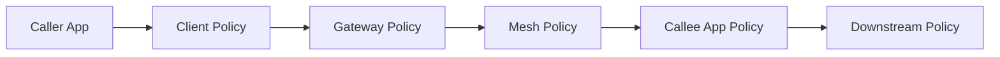
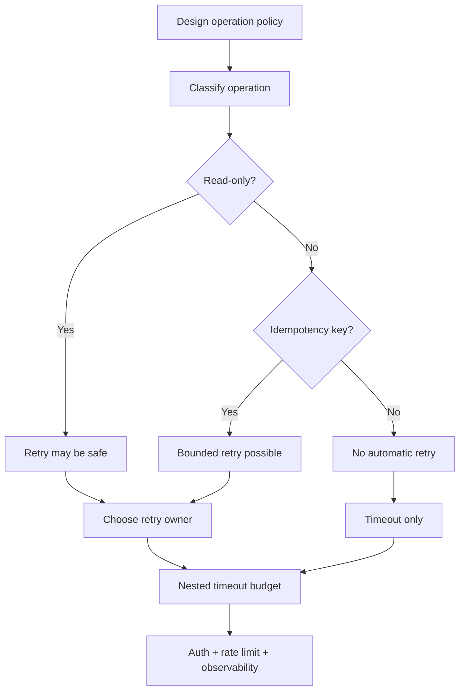

# Part 090 — Policy Composition Across Client, Gateway, Mesh, Broker, and Application

Modern microservice communication has many policy layers.

A single HTTP request may pass through:

```text
Java client
client resilience library
gateway
service mesh proxy
Kubernetes Service
destination proxy
application server
application resilience library
database client
event publisher
```

Each layer can have:

- timeout,
- retry,
- rate limit,
- circuit breaker,
- authentication,
- authorization,
- logging,
- tracing,
- request size limit,
- load balancing,
- fallback,
- cancellation behavior.

If each layer is configured independently, the system may become unsafe.

Example:

```text
client retries 3 times
gateway retries 2 times
mesh retries 2 times
application retries DB 3 times
```

One user request can create:

```text
3 × 2 × 2 × 3 = 36 attempts
```

Policy composition is the discipline of making all communication policies work together instead of fighting each other.

A top-tier engineer designs the whole policy stack.

---

## 1. Layered Policy Mental Model



Each layer sees only part of the truth.

| Layer | Knows well | Does not know well |
|---|---|---|
| client app | business operation, idempotency | fleet-wide traffic |
| gateway | external client, route, edge auth | domain resource state |
| mesh | workload identity, network traffic | business semantics |
| callee app | domain logic, resource auth | upstream retry stack |
| broker | message delivery | business idempotency |
| database | local transaction | distributed workflow |

Correctness comes from assigning each policy to the right layer.

---

## 2. The Policy Ownership Problem

If nobody owns composition, every team configures its own layer.

Platform says:

```text
mesh retries improve reliability
```

Backend team says:

```text
client retries improve reliability
```

Gateway team says:

```text
edge retries improve reliability
```

The combined result:

```text
retry storm
```

Ownership questions:

- who owns end-to-end timeout budget?
- who owns retry eligibility?
- who owns rate limits?
- who owns auth boundary?
- who owns idempotency semantics?
- who owns observability labels?
- who owns rollback?
- who approves exceptions?

Every critical operation needs a named policy owner.

---

## 3. Timeout Composition

Timeouts should be nested.

Example:

```text
client total deadline: 1000ms
gateway request timeout: 900ms
mesh route timeout: 800ms
callee handler budget: 700ms
database timeout: 300ms
```

Bad:

```text
client timeout: 1000ms
gateway timeout: 5000ms
callee DB timeout: 10000ms
```

The backend continues long after client gave up.

Correct principle:

```text
downstream work should stop before upstream caller no longer cares
```

Use deadlines where possible.

Timeouts should enforce a budget, not random numbers.

---

## 4. Timeout Budget Template

```yaml
operation: GetCase
slo:
  p99LatencyMs: 500

budget:
  clientTotalDeadlineMs: 700
  gatewayTimeoutMs: 650
  meshRouteTimeoutMs: 600
  serviceHandlerBudgetMs: 550
  downstream:
    dbTimeoutMs: 150
    cacheTimeoutMs: 50
    remoteDependencyTimeoutMs: 200

cancellation:
  propagate: true
  serverStopsWorkOnDisconnect: true
```

Review timeout budgets per operation.

Not one global timeout for everything.

---

## 5. Retry Composition

Retry should have one primary owner.

Options:

| Retry owner | Good when |
|---|---|
| client app | operation semantics/idempotency known |
| gateway | edge idempotent reads, simple transient failures |
| mesh | uniform safe read retries, connection failures |
| server app | internal dependency retry with domain context |
| broker | asynchronous redelivery |
| workflow engine | long-running business retries |

Do not enable all.

Define:

```yaml
retryOwner: client
gatewayRetries: disabled
meshRetries: disabled
serverDependencyRetries: bounded
```

or:

```yaml
retryOwner: mesh
clientRetries: disabled
meshRetries:
  methods: [GET]
  attempts: 2
```

Retry is not free.

---

## 6. Retry Budget Template

```yaml
operation: SearchCases
idempotency: read-only
retry:
  maxTotalAttemptsAcrossLayers: 2
  owner: mesh
  retryable:
    - connect-failure
    - reset
    - 502
    - 503
  nonRetryable:
    - 400
    - 401
    - 403
    - 409
  perTryTimeoutMs: 200
  totalTimeoutMs: 500
```

For command:

```yaml
operation: CreateEscalation
idempotency: requires-idempotency-key
retry:
  maxTotalAttemptsAcrossLayers: 1
  owner: none-by-default
  retryAllowedOnlyIf:
    - idempotencyKeyPresent
    - failureBeforeCommitKnown
```

Unsafe retries must be opt-in.

---

## 7. Rate Limit Composition

Rate limits can exist at:

- CDN,
- gateway,
- mesh,
- application,
- external provider client,
- broker consumer,
- database pool.

Layer purposes differ.

| Layer | Purpose |
|---|---|
| gateway | protect edge/backend by client/user/tenant |
| mesh | protect service-to-service upstreams |
| app | enforce business quota |
| external client | respect provider quota |
| broker consumer | control processing throughput |
| DB pool | protect database resources |

Do not rely on gateway rate limit for internal batch job traffic that bypasses gateway.

Do not rely on app business quota to protect gateway resources.

Use layered limits with clear intent.

---

## 8. Circuit Breaker Composition

Circuit breakers can be:

- client-side per dependency,
- mesh/proxy outlier detection/circuit breaking,
- gateway upstream protection,
- application workflow breaker.

Mesh breaker often protects transport resources.

Application breaker can know operation and fallback.

Example:

```text
mesh ejects unhealthy pod
client breaker opens payment-provider dependency
workflow marks payment pending
```

These are complementary if tuned correctly.

They conflict if:

- mesh ejects all endpoints,
- app retries anyway,
- gateway keeps sending traffic,
- fallback hides severe failure.

Monitor breaker state by layer.

---

## 9. Authentication Composition

Authentication may happen at:

- edge gateway,
- service mesh request authentication,
- application,
- external provider.

Questions:

- where is token validated?
- is token audience correct?
- is token forwarded?
- are identity headers trusted?
- can service be reached bypassing gateway?
- does mesh authenticate workload identity?
- does app authenticate end-user?
- how is service-to-service delegation handled?

Never assume because gateway authenticated the user, backend domain authorization is complete.

Authentication is identity proof.

Authorization is permission decision.

---

## 10. Authorization Composition

Authorization layers:

| Layer | Example |
|---|---|
| gateway | authenticated clients may call `/cases` |
| mesh | order-service may call case-service |
| app | user may view CASE-100 |
| database | row-level security maybe |
| external provider | API scope allowed |

Each layer should reduce risk.

But app must own domain decisions.

Bad:

```text
gateway allows role=case_admin to /cases/*
backend trusts it for all resources
```

Better:

```text
gateway validates token
backend checks tenant/resource/workflow state
mesh restricts which services can call backend
```

---

## 11. Identity Header Composition

Identity headers can be set by gateway and passed through mesh.

Rules:

- strip untrusted inbound identity headers,
- set trusted headers once,
- protect backend from direct access,
- include source workload identity,
- include user subject if needed,
- include tenant if verified,
- do not include secrets/tokens unless needed,
- log safely.

Example trusted context:

```text
X-Authenticated-Subject: user-123
X-Authenticated-Client: web-app
X-Tenant-Id: tenant-abc
X-Source-Principal: cluster.local/ns/edge/sa/api-gateway
```

Backend should know which headers are trusted and why.

---

## 12. Cancellation Composition

Timeout is incomplete without cancellation.

When caller times out:

- gateway should stop waiting,
- mesh should close/cancel upstream if possible,
- Java server should detect disconnect/cancellation,
- handler should stop work,
- DB query should be cancelled or timed out,
- downstream calls should be cancelled,
- event publication should be semantically safe.

For commands, cancellation is tricky.

If command committed, caller timeout does not mean command failed.

Use idempotency key and status lookup.

Do not treat timeout as automatic rollback.

---

## 13. Deadline Propagation Across Layers

Deadline should propagate as:

- HTTP header,
- gRPC deadline,
- trace/context metadata,
- internal request context.

Gateway/mesh may enforce route timeouts, but app-level deadline context helps:

- DB timeout,
- downstream calls,
- fallback decisions,
- load shedding,
- logging.

Example:

```text
X-Request-Deadline: 2026-07-05T12:00:01.200Z
```

App computes remaining budget.

Do not let each layer start a fresh timeout as if request is new.

---

## 14. Idempotency Composition

Idempotency must be stable across:

- client retries,
- gateway retries,
- mesh retries,
- service retries,
- outbox publish retries,
- consumer retries,
- workflow retries,
- region failover.

For commands:

```text
client idempotency key -> command ID -> outbox event ID -> consumer dedup
```

Do not regenerate identity at each layer.

Example:

```yaml
CreateEscalation:
  idempotency:
    clientKeyRequired: true
    commandIdDerivedFromClientKey: true
    outboxEventIdStable: true
    consumerDedupUsesEventId: true
```

Idempotency is the thread that makes retries safe.

---

## 15. Error Mapping Composition

Errors can be generated by:

- gateway,
- mesh/proxy,
- application,
- downstream dependency,
- broker consumer,
- workflow engine.

Need consistent mapping.

Example:

| Source | Error | External response |
|---|---|---|
| gateway auth | invalid token | 401 |
| gateway rate limit | too many requests | 429 |
| mesh no upstream | no healthy backend | 503 |
| app validation | invalid command | 400 |
| app conflict | version conflict | 409 |
| downstream timeout | dependency timeout | 503/504 depending API |
| workflow accepted | async pending | 202 |

Do not expose proxy internals to external clients.

But preserve enough diagnostic info internally.

---

## 16. Observability Composition

Metrics should identify layer.

Examples:

```text
http.client.requests{layer=client,dependency=case-service}
gateway.requests{layer=gateway,route=case-api}
mesh.requests{layer=mesh,source=order-service,destination=case-service}
http.server.requests{layer=app,service=case-service}
db.calls{layer=app,dependency=case-db}
```

Without layer label, teams argue:

```text
is this gateway latency or app latency?
```

Traces should include spans from relevant layers.

Logs should preserve request/correlation IDs.

---

## 17. SLO Composition

End-to-end SLO decomposes into dependencies.

Example:

```text
GetCase p99 <= 500ms
```

Budget:

- gateway <= 20ms,
- mesh overhead <= 10ms,
- app handler <= 250ms,
- database <= 100ms,
- downstream customer-service <= 100ms,
- buffer <= 20ms.

Each layer has budget.

If mesh adds 50ms p99, it consumes app budget.

If gateway retries, app capacity budget changes.

SLOs need policy composition.

---

## 18. Asynchronous Composition

For async workflows:

```text
HTTP command -> local DB -> outbox -> Kafka -> consumer -> projection -> query API
```

Policies across layers:

- HTTP idempotency,
- command timeout,
- outbox reliability,
- event schema,
- Kafka ACL,
- consumer idempotency,
- retry/DLQ,
- projection freshness,
- read-your-writes behavior.

A user-facing "Create" may finish before async side effects complete.

API contract must state what is complete.

Policy composition includes sync+async boundaries.

---

## 19. Gateway + Event Interaction

Gateway accepts command.

Service writes outbox.

Consumer sends notification.

If gateway retries unsafe POST, two commands may be written unless idempotency key works.

If service returns 202 before outbox publish, external user may think workflow started while event is delayed.

If projection lag is high, subsequent GET may be stale.

This is why communication must be designed end-to-end.

---

## 20. Mesh + Kafka Interaction

Mesh may secure TCP to Kafka brokers.

But Kafka semantics remain Kafka semantics:

- producer acks,
- idempotent producer,
- transactions,
- consumer offsets,
- lag,
- DLQ,
- retry topics,
- schema compatibility.

Do not assume mesh mTLS means Kafka ACLs are unnecessary.

Transport identity and broker authorization are different.

Keep Kafka governance.

---

## 21. Gateway + Mesh Interaction

External request path:

```text
client -> gateway -> mesh -> service
```

Policy questions:

- does gateway or mesh enforce auth?
- does gateway inject identity headers?
- does mesh authorize gateway principal?
- does service reject direct calls?
- does both gateway and mesh retry?
- which layer times out first?
- where is rate limit enforced?
- how are request IDs propagated?

Gateway and mesh teams must coordinate.

Otherwise policy gaps or duplicates appear.

---

## 22. App + Mesh Retry Conflict

Example bad config:

```yaml
appClient:
  retryAttempts: 3

mesh:
  retries:
    attempts: 3
```

Actual upstream attempts:

```text
9
```

If operation is POST:

```text
potential duplicate side effects
```

Fix:

```yaml
retryOwner: app
meshRetries: disabled
```

or:

```yaml
retryOwner: mesh
appRetries: disabled
```

For unsafe operations:

```yaml
retryOwner: none
idempotencyRequiredForAnyRetry: true
```

---

## 23. Gateway Timeout vs App Timeout Conflict

Bad:

```yaml
gatewayTimeout: 1s
appHandlerTimeout: 10s
dbTimeout: 15s
```

Gateway returns 504 at 1s.

App continues until 10s or DB 15s.

Under load, this wastes resources.

Better:

```yaml
gatewayTimeout: 1s
meshTimeout: 900ms
appBudget: 800ms
dbTimeout: 300ms
```

And application cancels work when request is aborted.

---

## 24. Rate Limit Conflict

Gateway rate limit:

```text
1000/min per client
```

App business limit:

```text
10 creates/day per tenant
```

These are different.

Do not replace one with the other.

Gateway protects infrastructure.

App protects business rules.

Both may be necessary.

Document them separately.

---

## 25. Auth Conflict

Gateway validates JWT and forwards user header.

Backend also validates JWT but token audience is gateway, not backend.

Possible failure:

```text
backend rejects valid gateway-authenticated request
```

Solutions:

- token exchange with backend audience,
- backend trusts gateway identity headers through mTLS,
- configure backend accepted audience,
- gateway forwards original token only where appropriate.

Identity architecture must be decided, not emergent.

---

## 26. Request Size Conflict

Gateway max body:

```text
1 MB
```

App max body:

```text
10 MB
```

Client gets 413 at gateway.

App team thinks it supports 10 MB.

Or reverse:

```text
gateway allows 20 MB
app rejects at 1 MB
```

Set route-specific body limits and document them in API contract.

For uploads, use dedicated file upload architecture.

---

## 27. Protocol Conflict

Gateway treats route as HTTP/1.1.

Backend expects gRPC HTTP/2.

Symptoms:

- 502,
- protocol error,
- gRPC UNAVAILABLE,
- trailers missing,
- streaming breaks.

Protocol policy must match:

- client protocol,
- gateway support,
- mesh support,
- backend server,
- health checks,
- observability.

Test actual protocol through full path.

---

## 28. Policy Matrix

For every operation, maintain matrix:

```yaml
operation: CreateEscalation
path: POST /cases/{caseId}/escalations

timeout:
  clientMs: 1500
  gatewayMs: 1400
  meshMs: 1300
  appBudgetMs: 1200

retry:
  gateway: disabled
  mesh: disabled
  app: disabled
  client: allowedOnlyWithIdempotencyKey

idempotency:
  required: true
  header: Idempotency-Key
  retention: 24h

auth:
  gateway: jwt
  mesh: gateway-to-case-service allowed
  app: resource authorization required

rateLimit:
  gateway: per-client
  app: per-tenant business quota

observability:
  requestId: required
  correlationId: required
  operationMetric: required
```

This is explicit composition.

---

## 29. Architecture Review Template

For a new communication flow:

1. Caller and callee?
2. Protocol?
3. Sync or async?
4. User-facing or background?
5. Operation idempotency?
6. Timeout budget?
7. Retry owner?
8. Rate limit layers?
9. Authn/authz boundary?
10. Data classification?
11. Observability?
12. Failure mode?
13. Fallback/degradation?
14. Replay/duplicate behavior if async?
15. Gateway/mesh/client policy?
16. Runbook?

Review flow, not isolated service.

---

## 30. Automated Composition Checks

Detect:

- multiple retry layers enabled,
- gateway timeout > client timeout,
- app DB timeout > app budget,
- public route without app authz marker,
- mesh allows direct backend bypass of gateway-only route,
- event contains PII but route logs payload,
- command route retry enabled without idempotency key,
- cross-region retry enabled for POST,
- external dependency no circuit breaker.

Composition checks need shared metadata.

This is why policy catalog matters.

---

## 31. Runtime Composition Verification

Even if config looks right, runtime can differ.

Verify:

- gateway timeout actually fires before app budget,
- mesh retries disabled for POST,
- direct backend blocked,
- request ID reaches app,
- cancellation stops handler,
- idempotency key deduplicates retry,
- rate limit returns correct response,
- metrics show layer source,
- canary version labels present.

Use integration tests and synthetic probes.

---

## 32. Runbook: Policy Conflict

Symptoms:

- duplicate requests,
- unexpected 504,
- inconsistent auth,
- high attempt count,
- request reaches wrong version,
- gateway says 200 but app failed async side effect,
- stale read after command.

Steps:

1. Trace full path.
2. List policy at each layer.
3. Identify timeout/retry/auth/rate limit owners.
4. Compare actual attempts to intended budget.
5. Check recent config changes.
6. Disable duplicate policy layer if needed.
7. Add composition check.
8. Update policy matrix.

Policy conflicts are design bugs.

---

## 33. Production Policy Template

```yaml
communicationPolicyComposition:
  defaults:
    timeout:
      nestedTimeoutsRequired: true
      deadlinePropagationRequired: true
    retry:
      singleRetryOwnerRequired: true
      unsafeMethodRetryForbiddenWithoutIdempotency: true
      maxTotalAttemptsAcrossLayers: 2
    auth:
      gatewayAuthRequiredForPublicRoutes: true
      meshAuthzRequiredForInternalSensitiveServices: true
      domainAuthorizationRequiredInApp: true
    observability:
      layerLabelRequired: true
      requestIdPropagationRequired: true
      retryAttemptMetricRequired: true
    cancellation:
      serverCancellationRequired: true
      dbTimeoutMustBeWithinRequestBudget: true

  operations:
    CreateEscalation:
      method: POST
      idempotencyRequired: true
      retryOwner: none
      totalDeadlineMs: 1500
    GetCase:
      method: GET
      retryOwner: mesh
      maxTotalAttempts: 2
      totalDeadlineMs: 700
```

Composition policy should be operation-aware.

---

## 34. Common Anti-Patterns

### 34.1 Every layer retries

Attempt explosion.

### 34.2 Timeouts not nested

Wasted backend work.

### 34.3 Mesh/gateway retries unsafe commands

Duplicate side effects.

### 34.4 Gateway auth treated as domain auth

Resource access bug.

### 34.5 App ignores cancellation

Timeouts do not reduce load.

### 34.6 Observability without layer source

Teams cannot identify owner.

### 34.7 Rate limit only at one layer

Wrong protection scope.

### 34.8 Idempotency key not propagated

Retry safety breaks.

### 34.9 Async side effects hidden behind synchronous 200

User/API semantics lie.

### 34.10 Policy matrix absent

Configuration becomes folklore.

---

## 35. Decision Model



Policy begins with operation semantics.

---

## 36. Design Checklist

Before approving a communication flow:

- What is the operation?
- Is it read-only or command?
- Is it idempotent?
- Which layer owns retry?
- What is max total attempts?
- Are timeouts nested?
- Is deadline propagated?
- Does server cancel work?
- Is idempotency key propagated?
- Where is authentication performed?
- Where is domain authorization performed?
- Is backend protected from direct bypass?
- Where are rate limits enforced?
- What does gateway do?
- What does mesh do?
- What does app do?
- Are errors mapped consistently?
- Are metrics labeled by layer?
- Are policy conflicts tested?

---

## 37. The Real Lesson

Microservice communication policy is not a set of independent knobs.

It is a system.

Timeouts, retries, rate limits, auth, idempotency, cancellation, and observability must compose.

The mature approach is:

```text
classify operation
+ assign policy ownership
+ define end-to-end budget
+ enforce one retry strategy
+ require idempotency where needed
+ separate edge/workload/domain auth
+ observe every layer
+ test the composed path
```

Most production communication incidents are not caused by missing features.

They are caused by features composed badly.

Mastering composition is what separates advanced engineers from configuration operators.

---

## References

- Google SRE Book — Addressing Cascading Failures: https://sre.google/sre-book/addressing-cascading-failures/
- Envoy HTTP Connection Management: https://www.envoyproxy.io/docs/envoy/latest/intro/arch_overview/http/http_connection_management
- Istio Traffic Management Concepts: https://istio.io/latest/docs/concepts/traffic-management/
- Kubernetes Gateway API: https://gateway-api.sigs.k8s.io/
- OpenTelemetry Semantic Conventions: https://opentelemetry.io/docs/specs/semconv/
- Resilience4j Documentation: https://resilience4j.readme.io/docs
