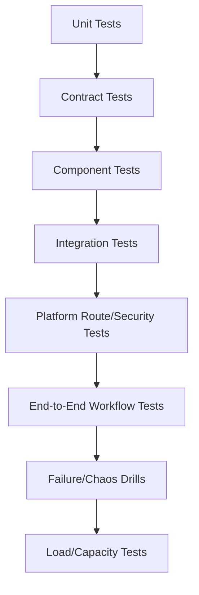
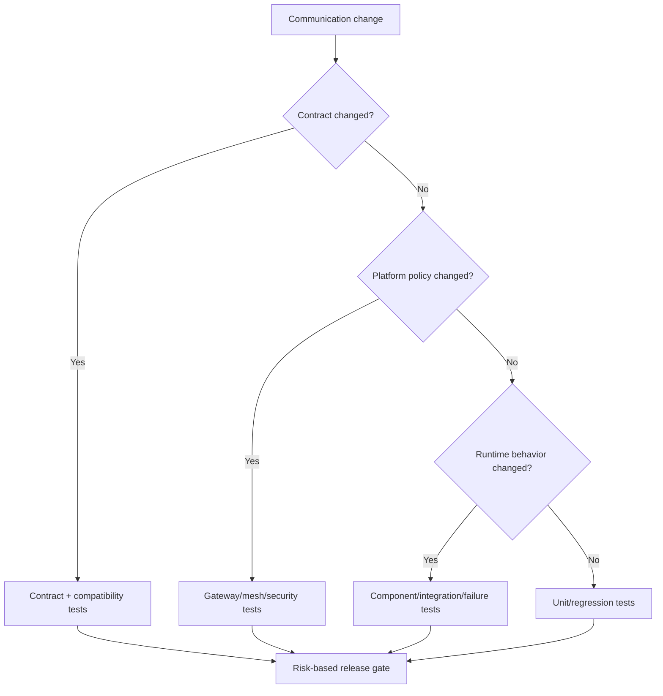

# Part 091 — Communication Testing Strategy Across Sync, Async, and Platform Layers

Microservice communication fails at boundaries.

Therefore communication testing must focus on boundaries:

- API contract boundary,
- client-server boundary,
- schema boundary,
- broker boundary,
- timeout/retry boundary,
- idempotency boundary,
- gateway boundary,
- mesh boundary,
- security boundary,
- observability boundary,
- operational recovery boundary.

Testing only business logic is not enough.

Testing only happy-path HTTP calls is not enough.

Testing only end-to-end flows is too slow and too late.

A top-tier engineer builds a layered test strategy that proves:

```text
contracts are stable
clients behave safely
servers enforce semantics
messages can evolve
duplicates are harmless
retries are bounded
timeouts are respected
platform routes correctly
security blocks unauthorized paths
observability works during failure
```

This part is about designing that test strategy.

---

## 1. Communication Test Pyramid



Each layer answers a different question.

| Layer | Question |
|---|---|
| Unit | Does policy/mapper/handler logic work? |
| Contract | Is API/message schema compatible? |
| Component | Does service boundary behave correctly with fakes? |
| Integration | Does real infrastructure/client/server work? |
| Platform | Does gateway/mesh/DNS/security route correctly? |
| E2E | Does business workflow work across services? |
| Failure | Does the system behave under faults? |
| Load | Does capacity meet SLO? |

Do not rely on one layer.

Each layer has blind spots.

---

## 2. Why E2E Tests Alone Fail

End-to-end tests are valuable.

But they are:

- slow,
- flaky,
- hard to debug,
- expensive to run,
- poor at pinpointing contract drift,
- usually limited in coverage,
- often happy-path focused,
- too late in pipeline.

If an E2E test fails, cause could be:

- producer schema,
- gateway route,
- auth token,
- database,
- Kafka topic,
- consumer lag,
- DNS,
- test data,
- flaky dependency.

Use E2E for critical journeys.

Use lower-level tests for precise guarantees.

---

## 3. Unit Tests for Communication Policy

Test pure logic:

- timeout budget calculator,
- retry classifier,
- error mapper,
- idempotency key validator,
- event mapper,
- header mapper,
- topic/key policy,
- failure classifier,
- DLQ decision,
- route policy validation.

Example:

```java
@Test
void postCommandWithoutIdempotencyIsNotRetryable() {
    OperationPolicy policy = new OperationPolicy(
        "CreateEscalation",
        HttpMethod.POST,
        Idempotency.NONE
    );

    RetryDecision decision = retryPolicy.decide(policy, transientTimeout());

    assertThat(decision.retry()).isFalse();
}
```

Policy logic is business-critical.

Test it as such.

---

## 4. HTTP Server Contract Tests

Test server behavior against OpenAPI or contract fixtures.

Verify:

- method/path,
- request validation,
- response schema,
- status codes,
- error body,
- headers,
- idempotency behavior,
- pagination contract,
- auth requirements,
- content type.

Example intent:

```java
@Test
void createEscalationReturnsAcceptedOperation() {
    mockMvc.perform(post("/cases/CASE-100/escalations")
            .header("Idempotency-Key", "idem-123")
            .contentType(APPLICATION_JSON)
            .content(validCommandJson()))
        .andExpect(status().isAccepted())
        .andExpect(header().exists("Location"))
        .andExpect(jsonPath("$.operationId").exists());
}
```

Contract tests should verify externally visible behavior, not implementation details.

---

## 5. HTTP Client Contract Tests

Client contract test verifies generated/manual client maps responses correctly.

Use stub server such as WireMock-like approach.

Test:

- success response,
- 400 validation error,
- 401/403 auth,
- 404 not found,
- 409 conflict,
- 429 retry-after,
- 500 no retry if unsafe,
- timeout,
- malformed response,
- unknown field tolerance.

Example:

```java
@Test
void clientMapsConflictToDomainException() {
    stubServer.stubFor(post("/cases/CASE-100/escalations")
        .willReturn(response(409, problemJson("version_conflict"))));

    assertThatThrownBy(() -> client.createEscalation(command))
        .isInstanceOf(VersionConflictException.class);
}
```

Generated clients still need behavior tests.

---

## 6. Consumer-Driven Contract Tests

Consumer-driven contracts express what consumer needs from provider.

For HTTP:

```yaml
consumer: order-service
provider: case-service
interaction:
  request:
    method: GET
    path: /internal/cases/CASE-100
  response:
    status: 200
    body:
      required:
        - caseId
        - status
        - version
```

For events:

```yaml
consumer: search-indexer
event: CaseUpdated.v1
requires:
  key: caseId
  fields:
    - caseId
    - status
    - aggregateVersion
unknownFields: ignore
```

This prevents provider from removing fields that look unused.

Consumer contracts reveal hidden coupling.

---

## 7. gRPC Contract Tests

gRPC contract is `.proto`.

Test:

- backward-compatible proto change,
- generated client/server compile,
- unknown fields ignored,
- enum evolution behavior,
- status code mapping,
- metadata propagation,
- deadlines,
- cancellation,
- streaming semantics,
- interceptors.

Example server test:

```java
@Test
void getCaseReturnsNotFoundStatus() {
    StatusRuntimeException ex = assertThrows(
        StatusRuntimeException.class,
        () -> blockingStub.getCase(GetCaseRequest.newBuilder()
            .setCaseId("MISSING")
            .build())
    );

    assertThat(ex.getStatus().getCode()).isEqualTo(Status.Code.NOT_FOUND);
}
```

gRPC contract is not only message shape.

It includes status, metadata, deadlines, and streaming behavior.

---

## 8. Kafka Producer Contract Tests

Producer tests verify:

- topic,
- key,
- event type,
- headers,
- payload schema,
- event ID stability,
- correlation/causation,
- absence of secrets,
- aggregate version,
- outbox row.

Example:

```java
@Test
void caseEscalatedOutboxMessageHasCorrectContract() {
    useCase.escalate(command);

    OutboxMessage message = outboxRepository.singlePending();

    assertThat(message.topic()).isEqualTo("case-events");
    assertThat(message.messageKey()).isEqualTo("CASE-100");
    assertThat(message.eventType()).isEqualTo("CaseEscalated.v1");
    assertThat(message.headers()).containsKey("correlation_id");

    schemaValidator.validate(message.payload(), "case-escalated-v1");
}
```

Do this before hitting Kafka.

Most producer bugs are mapping/policy bugs.

---

## 9. Kafka Consumer Contract Tests

Consumer tests verify fixtures.

Test:

- valid event,
- minimal event,
- event with unknown optional fields,
- old event version,
- duplicate event,
- out-of-order event,
- missing required field,
- unsupported event type,
- malformed payload,
- poison message classification.

Example:

```java
@Test
void consumerIgnoresDuplicateCaseUpdatedEvent() {
    EventEnvelope event = fixture("case-updated-v1.json");

    consumer.handle(event);
    consumer.handle(event);

    assertThat(projectionRepository.updateCount("CASE-100")).isEqualTo(1);
}
```

Consumer correctness is duplicate and evolution correctness.

Not just "listener receives message."

---

## 10. Schema Compatibility Tests

Schema compatibility tests check:

- new schema vs previous schema,
- transitive compatibility,
- enum changes,
- field removals,
- required/optional changes,
- Protobuf field numbers/reserved fields,
- Avro default values,
- JSON Schema additional properties,
- semantic versioning.

CI should fail before deployment.

Breaking event schema in production can break consumers that are not deployed with producer.

Schema testing is mandatory for async systems.

---

## 11. Outbox Tests

Outbox tests:

| Scenario | Expected |
|---|---|
| business transaction commits | outbox row exists |
| transaction rolls back | no outbox row |
| relay publish succeeds | row marked published |
| relay publish fails | row remains retryable |
| relay crashes after publish before mark | duplicate publish possible but event ID stable |
| cleanup runs | published rows removed after retention |
| ordering required | relay preserves ordering policy |

Example crash window test:

```java
@Test
void relayRetryUsesSameEventIdAfterCrash() {
    OutboxMessage message = outboxRepository.insert(pendingEvent("evt-123"));

    relay.publishButCrashBeforeMarkPublished(message.id());
    relay.publishBatch();

    assertThat(kafkaRecords.eventIds()).containsOnly("evt-123", "evt-123");
}
```

Outbox tests prove reliability invariants.

---

## 12. Inbox/Idempotent Consumer Tests

Inbox tests:

- first message claimed,
- duplicate skipped,
- in-progress stale message reclaimed,
- completed message not reprocessed,
- failure transitions to retry/parked,
- ack timing after durable state,
- cleanup retention.

Example:

```java
@Test
void staleInProgressMessageCanBeReclaimed() {
    inbox.insertInProgress("search-indexer", "evt-123", now().minusMinutes(30));

    boolean claimed = inbox.tryClaim("search-indexer", "evt-123", now());

    assertThat(claimed).isTrue();
}
```

Crash windows are first-class test cases.

---

## 13. Retry/DLQ Tests

Test:

- retryable failure retries,
- non-retryable failure DLQs,
- retry attempts exhausted DLQs,
- poison message detected,
- retry preserves key/message ID,
- DLQ preserves original metadata,
- replay from DLQ is safe,
- deserialization failure handled,
- retry storm bounded.

Example:

```java
@Test
void nonRetryableSchemaErrorGoesToDlt() {
    consumer.receive(invalidSchemaRecord());

    assertThat(dlt.records()).hasSize(1);
    assertThat(dlt.single().headers()).containsKey("x-original-offset");
}
```

DLQ path is production path.

Test it.

---

## 14. Spring Kafka Integration Tests

Use real listener container behavior.

Test:

- `@KafkaListener` wiring,
- manual ack behavior,
- error handler,
- DLT publishing,
- retry topic,
- serializer/deserializer,
- group ID,
- headers,
- concurrency basics.

Use embedded Kafka or Testcontainers depending test level.

Example intent:

```java
@Test
void listenerProcessesEventAndCommitsProjection() {
    kafkaTemplate.send("case-events", "CASE-100", caseUpdatedBytes());

    await().untilAsserted(() ->
        assertThat(projectionRepository.get("CASE-100").status())
            .isEqualTo("UPDATED")
    );
}
```

Mocks cannot prove listener container behavior.

---

## 15. Kafka Streams Tests

Use topology-level tests for:

- filtering,
- mapping,
- aggregation,
- joins,
- windows,
- late events,
- tombstones,
- state store content,
- output topics.

Use integration tests for:

- internal topics,
- state restore,
- exactly-once config,
- repartition topics,
- real serdes.

Kafka Streams topologies are dataflow programs.

Test topology deterministically.

---

## 16. Gateway Route Tests

Test gateway behavior:

- host/path/method match,
- TLS certificate,
- auth required,
- unauthenticated rejected,
- identity headers stripped/set,
- rate limit,
- body size limit,
- timeout,
- safe retry only,
- canary route,
- CORS,
- gRPC route if applicable.

Example:

```text
client sends spoofed X-Authenticated-Subject
gateway strips it
backend receives trusted authenticated subject only
```

Gateway config is production code.

Test it through real gateway when possible.

---

## 17. Service Mesh Tests

Test mesh policy:

- mTLS strict blocks plaintext,
- authorized workload allowed,
- unauthorized workload denied,
- route split works,
- subset labels match,
- retry policy not enabled for unsafe methods,
- timeout fires,
- egress denied for unknown host,
- gRPC method authorization works.

Mesh tests need actual platform environment.

YAML validation alone is not enough.

---

## 18. NetworkPolicy Tests

Test allowed and denied paths.

Example:

```text
order-service -> case-service allowed
analytics-service -> case-service close endpoint denied
case-service -> DNS allowed
case-service -> internet denied unless egress approved
```

NetworkPolicy failures look like timeouts.

Automated connectivity tests are worth it.

---

## 19. Security Tests

Communication security tests:

- public route requires auth,
- invalid token rejected,
- expired token rejected,
- wrong audience rejected,
- user without resource permission rejected,
- service without mesh identity denied,
- default service account forbidden,
- sensitive topic ACL restricted,
- unauthorized Kafka consumer denied,
- egress host denied,
- logs do not contain secrets.

Security tests should include negative paths.

A system that only tests successful auth is not secure.

---

## 20. Observability Tests

Test metrics/logging/tracing.

Examples:

```java
@Test
void timeoutMetricIncludesDependencyAndTimeoutType() {
    client.callDependencyThatTimesOut();

    assertThat(metrics.counter("http.client.timeouts")
        .tag("dependency", "case-service")
        .tag("timeout_type", "response")
        .count()).isEqualTo(1);
}
```

Log redaction:

```java
@Test
void failedRequestLogDoesNotContainAuthorizationHeader() {
    client.callWithSecretHeader();

    assertThat(logs).noneMatch(line -> line.contains("Bearer "));
}
```

Observability fails silently unless tested.

---

## 21. Component Tests

Component test runs one service with realistic infrastructure fakes.

Example:

```text
case-service + PostgreSQL Testcontainer + Kafka Testcontainer + stubbed downstream HTTP
```

Verifies:

- app configuration,
- DB transaction,
- outbox,
- HTTP clients,
- Kafka publish,
- error handling,
- observability.

Component tests are excellent for service-level confidence.

They are faster and more debuggable than full E2E.

---

## 22. End-to-End Tests

E2E tests should cover critical user journeys.

Examples:

- create case escalation and observe workflow completed,
- update case and search projection becomes fresh,
- create command with idempotency key and duplicate request deduped,
- external provider degraded and user sees pending status.

Keep E2E tests:

- few,
- stable,
- meaningful,
- observability-rich,
- not responsible for every contract detail.

E2E should prove integrated capability, not replace lower tests.

---

## 23. Replay Tests

Replay tests verify:

- historical fixtures still process,
- side effects suppressed during replay,
- projection rebuild deterministic,
- old schema supported,
- duplicates ignored,
- tombstones handled,
- replay throttle works,
- DLQ replay preserves IDs.

Example:

```java
@Test
void replayDoesNotSendEmail() {
    MessageContext context = MessageContext.replay("rebuild-2026-07");

    consumer.handle(caseEscalatedFixture(), context);

    assertThat(emailProvider.sent()).isEmpty();
}
```

Replay safety must be proven.

---

## 24. Failure Tests

Failure tests simulate:

- timeout,
- connection refused,
- HTTP 500,
- malformed response,
- DNS failure,
- broker unavailable,
- Kafka send failure,
- DB deadlock,
- duplicate delivery,
- poison message,
- downstream rate limit,
- gateway 503,
- mesh deny,
- external provider down.

Failure tests should verify:

- classification,
- retry behavior,
- fallback,
- DLQ,
- no duplicate side effect,
- metrics/logs.

Failure behavior is product behavior.

---

## 25. Load Tests

Load tests should include:

- steady state,
- peak,
- burst,
- hot key,
- replay + live traffic,
- retry storm,
- downstream slow,
- deploy under load,
- canary traffic.

Measure:

- p50/p95/p99,
- error rate,
- saturation,
- lag seconds,
- outbox age,
- DLQ,
- retry attempts,
- CPU/GC,
- DB pool,
- gateway/mesh proxy resources.

Do not benchmark only the happy path.

---

## 26. Test Data Strategy

Communication tests need stable data.

Approaches:

- contract fixtures,
- synthetic tenants,
- deterministic IDs,
- isolated test namespace,
- disposable environments,
- seeded database,
- event fixture library,
- provider sandbox,
- mock external APIs.

Avoid tests that depend on shared mutable production-like data.

Flaky data creates flaky communication tests.

---

## 27. Test Environment Strategy

Levels:

| Environment | Purpose |
|---|---|
| unit JVM | fast logic tests |
| local containers | DB/Kafka/stub integration |
| ephemeral preview env | service + gateway/mesh policy |
| staging | full platform behavior |
| production canary | real traffic validation |
| game day | controlled failure drills |

No single environment covers all needs.

Use the cheapest environment that can prove the specific property.

---

## 28. Contract Fixture Repository

Create shared fixtures:

```text
contracts/
  openapi/
  asyncapi/
  events/
    case-events/
      CaseEscalated.v1/
        valid-minimal.json
        valid-full.json
        unknown-field.json
        historical-2026-01.json
  grpc/
    case-service/
      get-case-not-found.bin
```

Use them in:

- producer tests,
- consumer tests,
- docs,
- replay tests,
- compatibility tests.

Fixtures are executable documentation.

---

## 29. CI Pipeline Template

```yaml
communicationTestPipeline:
  stages:
    - unit
    - schema-compatibility
    - openapi-contract
    - asyncapi-contract
    - producer-contract
    - consumer-fixtures
    - grpc-contract
    - component-testcontainers
    - security-policy-tests
    - observability-tests
    - gateway-mesh-preview-tests
    - selected-e2e
```

Run expensive tests selectively but regularly.

Critical contract tests should run on every PR.

---

## 30. Release Gates

Before production:

- all contract tests pass,
- schema compatibility pass,
- route policy pass,
- security policy pass,
- observability present,
- canary plan exists,
- rollback plan exists,
- runbook updated,
- load test for risky change,
- consumer compatibility reviewed,
- migration plan for breaking changes.

Release gate should match risk.

A change to README does not need the same gate as a new public route or event schema.

---

## 31. Flakiness Management

Communication tests can be flaky.

Causes:

- timing assumptions,
- shared environment,
- real external dependency,
- insufficient await timeout,
- race conditions,
- eventually consistent projection,
- unstable test data,
- overloaded CI.

Mitigation:

- deterministic fixtures,
- await with clear condition,
- isolate namespace/topics,
- avoid sleep-only tests,
- stub external providers,
- collect logs/traces on failure,
- categorize flaky tests,
- fix or quarantine with owner.

Do not normalize flaky tests.

They destroy trust.

---

## 32. Test Observability

When test fails, capture:

- request/trace ID,
- gateway logs,
- app logs,
- Kafka records,
- DLQ contents,
- metrics snapshot,
- pod events,
- route config,
- mesh policy,
- topic offsets.

A failed integration test should be debuggable.

If failure artifact is only:

```text
expected true but was false
```

test design is poor.

---

## 33. Production Verification

Some properties can only be verified in production-like environment:

- real DNS,
- gateway certificate,
- mesh mTLS,
- cloud IAM,
- external provider sandbox/prod,
- global routing,
- real quotas,
- load balancer behavior.

Use:

- canary,
- synthetic probes,
- shadow traffic,
- dark launch,
- production read-only probes.

Production verification must be safe and controlled.

---

## 34. Testing Policy Template

```yaml
communicationTesting:
  http:
    openApiContractRequired: true
    clientStubTestsRequired: true
    serverContractTestsRequired: true
  grpc:
    protoCompatibilityRequired: true
    statusMappingTestsRequired: true
    deadlineTestsRequired: true
  kafka:
    producerContractTestsRequired: true
    consumerFixtureTestsRequired: true
    schemaCompatibilityRequired: true
    replayTestsRequiredForReplayConsumers: true
  platform:
    gatewayRouteTestsRequiredForPublicRoutes: true
    meshAuthzNegativeTestsRequired: true
    networkPolicyTestsRequiredForRestrictedNamespaces: true
  resilience:
    timeoutTestsRequired: true
    retryBudgetTestsRequired: true
    dlqTestsRequired: true
  observability:
    metricsTestsRequired: true
    redactionTestsRequired: true
```

Testing policy makes communication quality consistent across teams.

---

## 35. Common Anti-Patterns

### 35.1 E2E-only strategy

Slow, flaky, and imprecise.

### 35.2 Mock-only communication tests

Real protocol/config bugs missed.

### 35.3 No negative tests

Security and failure paths untested.

### 35.4 No schema compatibility gate

Consumer breakage reaches production.

### 35.5 No duplicate delivery tests

At-least-once semantics ignored.

### 35.6 No gateway/mesh tests

YAML bugs become outages.

### 35.7 No observability tests

Incidents lack signals.

### 35.8 Sleep-based async tests

Flaky and slow.

### 35.9 External provider prod dependency in CI

Flaky and risky.

### 35.10 Contract fixtures not versioned

Examples drift.

---

## 36. Decision Model



Test selection should follow risk.

---

## 37. Design Checklist

Before approving a communication testing strategy:

- Are contracts tested?
- Are consumers tested against fixtures?
- Are producers tested for topic/key/header?
- Are schemas compatibility-checked?
- Are duplicates tested?
- Are retry/DLQ paths tested?
- Are timeouts tested?
- Are gateway routes tested?
- Are mesh authz policies tested?
- Are security negative tests included?
- Are replay paths tested?
- Are observability/redaction tested?
- Are load/failure scenarios covered?
- Are test artifacts captured on failure?
- Are flaky tests owned and fixed?
- Are release gates risk-based?

---

## 38. The Real Lesson

Communication reliability is not proven by a green happy-path E2E test.

It is proven by a layered strategy:

```text
unit policy tests
+ contract tests
+ producer/consumer fixtures
+ infrastructure integration tests
+ platform route/security tests
+ failure tests
+ load tests
+ production verification
```

Each layer removes a class of unknowns.

Top-tier engineers design communication tests to prove the behaviors that matter most in production:

```text
compatibility
correctness
security
resilience
observability
operability
```

That is how microservice communication remains safe as systems evolve.

---

## References

- Spring Kafka Testing Reference: https://docs.spring.io/spring-kafka/reference/testing.html
- Testcontainers Kafka Guide: https://testcontainers.com/guides/testing-spring-boot-kafka-listener-using-testcontainers/
- Pact Contract Testing: https://docs.pact.io/
- AsyncAPI Specification: https://www.asyncapi.com/docs/reference/specification/latest
- Kubernetes Gateway API: https://gateway-api.sigs.k8s.io/
- Istio Traffic Management Concepts: https://istio.io/latest/docs/concepts/traffic-management/
