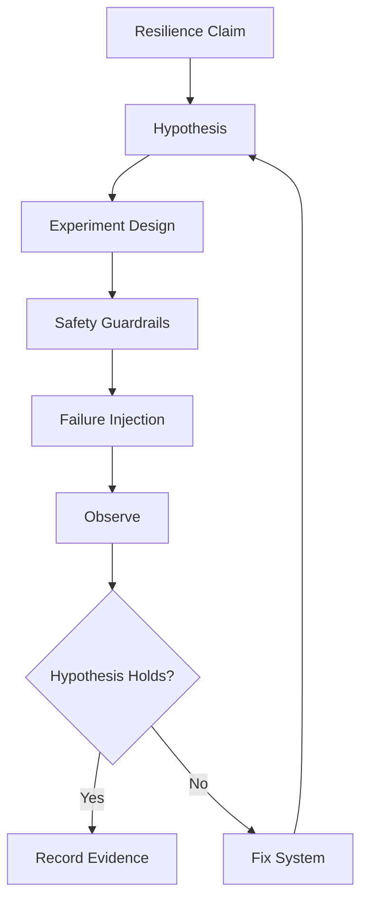

# Part 092 — Chaos Engineering, Failure Injection, and Resilience Drills

Resilience is not a claim.

It is evidence.

You can say:

```text
our service handles dependency failure
our consumer is idempotent
our gateway canary rollback works
our DLQ replay is safe
our region failover works
```

But until those claims are tested under realistic failure, they are assumptions.

Chaos engineering and failure drills turn assumptions into evidence.

---

## 1. Failure Engineering Mental Model



Chaos is not random outage.

It is disciplined experimentation.

---

## 2. Hypothesis Format

Example:

```yaml
experiment: payment-provider-timeout
hypothesis: >
  When payment provider times out for 5 minutes,
  checkout-service returns PENDING within 1.5s,
  opens circuit breaker within 30s,
  queues retry intent,
  and does not create duplicate payment captures.
steadyState:
  - checkout p95 < 800ms for unaffected flows
  - payment duplicate count = 0
  - pending payment count increases but drains after recovery
abortIf:
  - checkout 5xx > 2%
  - duplicate payment detected
  - pending queue age > 10m
```

A hypothesis makes success objective.

---

## 3. Failure Catalog

Sync failures:

- timeout,
- connection refused,
- HTTP 500/503,
- DNS failure,
- slow response,
- malformed response,
- TLS failure,
- rate limit,
- auth failure.

Async failures:

- broker unavailable,
- producer send failure,
- outbox relay down,
- duplicate message,
- poison message,
- consumer lag,
- DLQ spike,
- retry storm,
- replay accident,
- schema incompatibility.

Platform failures:

- gateway route missing,
- mesh authz deny,
- mTLS failure,
- network policy block,
- no endpoints,
- bad canary,
- egress gateway down,
- regional failover.

---

## 4. Blast Radius

Limit blast radius by:

- environment,
- namespace,
- service,
- route,
- tenant,
- traffic percentage,
- region,
- time window,
- operation type.

Example:

```yaml
scope:
  environment: production
  tenant: chaos-test-tenant
  route: /checkout
  trafficPercent: 1
  duration: 10m
```

Start small.

Expand only after confidence grows.

---

## 5. Abort Conditions

Abort if:

- error rate exceeds threshold,
- p99 latency exceeds threshold,
- DLQ grows unexpectedly,
- duplicate payment detected,
- data corruption detected,
- observability unavailable,
- unrelated incident begins,
- on-call requests abort.

Chaos without abort condition is irresponsible.

---

## 6. Fault Injection Layers

Inject faults at:

| Layer | Examples |
|---|---|
| application | exception, delay |
| client | stub timeout |
| network | latency, packet loss |
| gateway | abort/delay route |
| mesh | fault injection |
| broker | unavailable topic/broker |
| database | latency/lock |
| external provider | sandbox outage |
| platform | kill pod/node |
| region | failover drill |

Choose the layer that tests the hypothesis.

---

## 7. Important Drills

### 7.1 Pod failure

Expected:

- readiness removes pod,
- traffic routes elsewhere,
- in-flight requests drain or fail safely,
- duplicate consumer processing safe.

### 7.2 Gateway failure

Expected:

- route/auth/rate-limit failures visible,
- synthetic probes detect issue,
- rollback config works.

### 7.3 Mesh security drill

Expected:

- unauthorized service denied,
- deny logs identify source/destination/policy,
- authorized traffic unaffected.

### 7.4 Egress provider timeout

Expected:

- timeout enforced,
- circuit breaker opens,
- retry bounded,
- pending/degraded response,
- no duplicate side effect.

### 7.5 Kafka producer failure

Expected:

- outbox backlog grows,
- alert fires,
- relay drains after recovery,
- no event lost.

### 7.6 Consumer lag drill

Expected:

- lag/freshness alert fires,
- stale semantics work,
- replay stops if live lag too high,
- recovery drains backlog.

### 7.7 DLQ replay drill

Expected:

- message ID/key preserved,
- side effects controlled,
- replay audited,
- metrics show replay.

### 7.8 Regional failover drill

Expected:

- traffic routes according to policy,
- writes disabled or ownership transferred,
- idempotency holds,
- no split brain.

---

## 8. Game Day Format

Agenda:

1. choose scenario,
2. define hypothesis,
3. define blast radius,
4. assign roles,
5. confirm dashboards,
6. confirm abort conditions,
7. run experiment,
8. observe and record,
9. abort or complete,
10. debrief,
11. create fixes,
12. schedule retest.

Roles:

- experiment lead,
- service owner,
- platform owner,
- observer/scribe,
- incident commander if production,
- security/data owner if sensitive.

---

## 9. Experiment Record

```yaml
experiment: consumer-poison-message
owner: case-platform
environment: staging
hypothesis: >
  Poison CaseUpdated event is retried three times, sent to DLQ,
  partition continues processing if ordering policy allows,
  and alert fires within 2 minutes.
scope:
  topic: case-events
  consumerGroup: search-indexer
abortIf:
  - dlqPublishFailure
  - unrelatedConsumerLag > 5m
result:
  status: failed
  finding: DLQ alert missing owner label
actions:
  - add DLQ owner metric
  - update runbook
  - retest by 2026-07-20
```

Experiments create organizational memory.

---

## 10. Safety Guardrails

Guardrails:

- small blast radius,
- approved window,
- owner present,
- abort button,
- automated abort if possible,
- no destructive data fault without backup,
- no sensitive data exposure,
- no external partner impact without agreement,
- no experiment during active incident,
- rollback verified.

Chaos must be safer than real failure.

---

## 11. Maturity Levels

| Level | Practice |
|---|---|
| 0 | no failure drills |
| 1 | staging pod kill tests |
| 2 | controlled dependency failure tests |
| 3 | production canary fault injection |
| 4 | regular game days with runbooks |
| 5 | automated continuous verification with guardrails |

Grow maturity gradually.

---

## 12. Production Policy Template

```yaml
chaosEngineering:
  requirements:
    hypothesisRequired: true
    blastRadiusRequired: true
    abortConditionsRequired: true
    ownerRequired: true
    observabilityRequired: true
    runbookRequired: true

  allowedProductionExperiments:
    - scopedDependencyTimeout
    - canaryRouteRollback
    - syntheticTenantEgressFailure
    - readOnlyGatewayFault
    - controlledConsumerLag

  cadence:
    criticalCapabilities: monthly
    standardCapabilities: quarterly

  evidence:
    experimentRecordRequired: true
    postExperimentActionsTracked: true
    retestRequiredAfterFix: true
```

---

## 13. Common Anti-Patterns

### 13.1 Random failure without hypothesis

No learning.

### 13.2 Production chaos without abort condition

Irresponsible.

### 13.3 Only killing pods

Many communication failures untouched.

### 13.4 No observability during experiment

Cannot know impact.

### 13.5 Findings not fixed

Chaos becomes theater.

### 13.6 Too broad blast radius

Experiment becomes incident.

### 13.7 Testing only infrastructure

Business correctness may still fail.

---

## 14. Design Checklist

Before running experiment:

- What claim are we testing?
- What is the hypothesis?
- What is steady state?
- What is blast radius?
- Who owns experiment?
- What is abort condition?
- What dashboards are ready?
- What runbook is exercised?
- What data can be affected?
- Is rollback tested?
- What metrics prove success?
- What business correctness must hold?
- How will findings be tracked?
- When will retest happen?

---

## 15. The Real Lesson

Resilience is demonstrated behavior under failure.

Mature communication systems are proven through:

```text
targeted fault injection
+ scoped blast radius
+ observability
+ runbook execution
+ business correctness checks
+ learning loop
```

Chaos engineering is not about breaking systems.

It is about discovering weakness before real incidents do.

---

## References

- Principles of Chaos Engineering: https://principlesofchaos.org/
- Google SRE Book — Addressing Cascading Failures: https://sre.google/sre-book/addressing-cascading-failures/
- Google SRE Book — Testing for Reliability: https://sre.google/sre-book/testing-reliability/
- Istio Fault Injection: https://istio.io/latest/docs/tasks/traffic-management/fault-injection/
- Envoy Fault Injection Filter: https://www.envoyproxy.io/docs/envoy/latest/configuration/http/http_filters/fault_filter
- Kubernetes Pod Lifecycle: https://kubernetes.io/docs/concepts/workloads/pods/pod-lifecycle/
