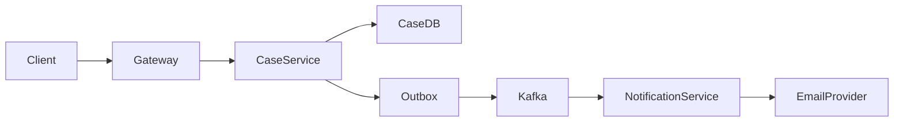
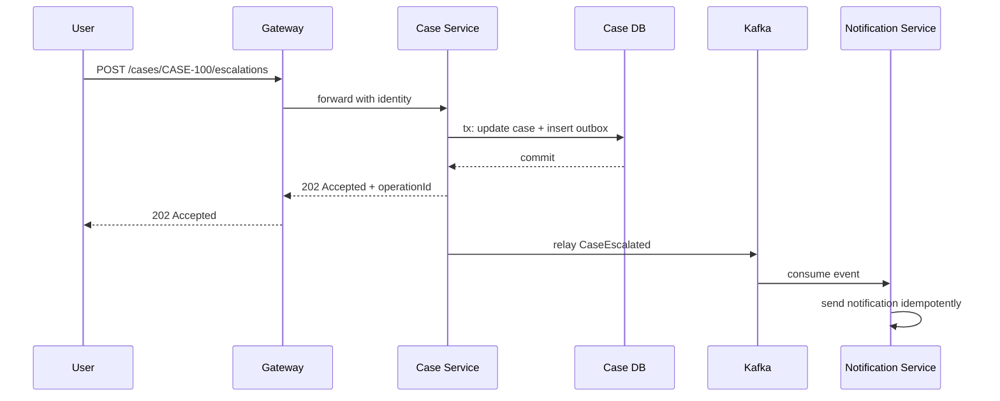
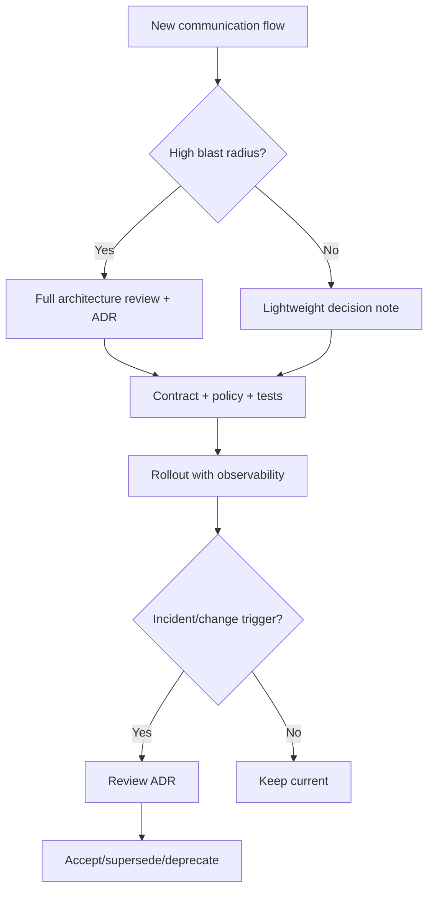

# Part 093 — Communication Architecture Review, ADRs, and Decision Records

Advanced engineers do not only implement communication.

They justify it.

They can explain why a flow is:

- synchronous or asynchronous,
- HTTP or gRPC,
- direct client call or gateway-mediated,
- event-driven or command-driven,
- orchestrated saga or choreography,
- regional or global,
- client-retried or mesh-retried,
- strongly consistent or eventually consistent,
- owned by one service or shared platform policy.

Communication design is full of trade-offs.

If those trade-offs are not written down, organizations repeat debates, forget constraints, and accidentally break assumptions.

A top-tier engineer produces decision records that future engineers can use during:

- incidents,
- refactoring,
- onboarding,
- migrations,
- audits,
- capacity reviews,
- security reviews,
- deprecation planning.

This part is about turning communication design into durable architecture knowledge.

---

## 1. Why Communication Decisions Need Records

Microservice communication decisions age.

Example decision:

```text
Order service calls payment provider synchronously.
```

At the time, this may have been fine because:

- traffic was low,
- provider was reliable,
- UX required immediate result,
- retries were manually controlled,
- payment idempotency existed.

Two years later:

- traffic increased,
- provider rate limits changed,
- checkout SLO changed,
- mobile retry behavior changed,
- multiple regions added,
- async workflow exists,
- duplicate payment incident happened.

Without decision records, nobody knows whether the design is still valid.

Architecture decisions should be revisitable.

---

## 2. ADR Mental Model

Architecture Decision Record:

```text
context
decision
consequences
alternatives
status
```

For communication, ADR should also include:

- operation semantics,
- consistency model,
- timeout/retry policy,
- idempotency,
- failure modes,
- observability,
- security/privacy,
- capacity,
- ownership,
- migration/deprecation path.

Communication ADR is not a philosophical essay.

It is an operational design artifact.

---

## 3. Communication ADR Template

```md
# ADR-042: Use asynchronous workflow for case escalation notification

## Status
Accepted

## Context
Case escalation currently sends notification synchronously in the user request path.
Notification provider p99 latency has increased and causes API timeout risk.

## Decision
Case service will persist escalation and publish CaseEscalated event via outbox.
Notification service will consume event and send notification asynchronously.

## Consequences
Positive:
- Case escalation API no longer depends on notification provider latency.
- Notification failures do not roll back case escalation.
- Notification can retry independently.

Negative:
- User may see escalation complete before notification is sent.
- Need notification workflow status.
- Need idempotent notification consumer.

## Alternatives
1. Keep synchronous call and increase timeout.
2. Use queue command instead of event.
3. Move provider call to workflow orchestrator.

## Operational Policy
- Outbox required.
- Event ID stable.
- Consumer idempotency required.
- DLQ alert on first message.
- Projection status exposes notification pending/failure.

## Review Date
2026-10-01
```

This is the right level of decision clarity.

---

## 4. Decision Status

Use statuses:

| Status | Meaning |
|---|---|
| Proposed | under review |
| Accepted | approved current decision |
| Deprecated | decision should no longer be used |
| Superseded | replaced by another ADR |
| Rejected | considered but not chosen |
| Trial | limited experiment/canary |
| Emergency | temporary decision under incident constraint |

Status matters.

A deprecated ADR still teaches history.

A superseded ADR points to the new decision.

Do not delete old decisions.

---

## 5. Sync vs Async Review

For every major flow, ask:

| Question | Sync implication | Async implication |
|---|---|---|
| Does caller need immediate result? | yes maybe sync | no async possible |
| Can operation complete later? | sync not required | async better |
| Is downstream slow/unreliable? | sync risk | async isolates |
| Is ordering required? | simpler if single call | key/sequence needed |
| Is user experience pending state acceptable? | maybe no | needs status model |
| Are duplicates safe? | still needed with retries | required |
| Is fan-out needed? | sync fan-out bad | event fan-out good |
| Is rollback required? | local transaction easier | saga/compensation |

Decision should not be:

```text
Kafka because scalable
```

It should be:

```text
Async because caller does not need immediate side effect, provider latency is unstable, and workflow status can represent pending completion.
```

---

## 6. HTTP vs gRPC Review

Ask:

| Question | HTTP/JSON | gRPC |
|---|---|---|
| Human/browser/client compatibility? | strong | weaker |
| Internal low-latency RPC? | okay | strong |
| Streaming needed? | possible but varied | strong |
| Contract-first generated clients? | OpenAPI | Protobuf |
| Polyglot ease? | strong | strong but tooling-specific |
| Debuggability with curl/logs? | strong | weaker |
| Backward compatibility discipline? | needed | strongly needed |
| Gateway/proxy support? | broad | must verify |
| Public API? | often better | possible but specialized |

The right choice depends on ecosystem and operation semantics.

Document protocol choice.

---

## 7. Direct Call vs Gateway vs Mesh Review

Ask:

| Concern | Direct Service DNS | Gateway | Mesh |
|---|---:|---:|---:|
| internal simplicity | high | medium | medium |
| public edge security | weak | strong | not enough alone |
| traffic split | limited | strong | strong |
| mTLS workload identity | app-dependent | limited | strong |
| domain semantics | app | not ideal | not ideal |
| observability | app-dependent | edge | service-to-service |
| operational complexity | lower | medium | higher |

Do not route all internal traffic through an API gateway just because it exists.

Do not adopt mesh just to compensate for missing application timeouts.

Use the right layer for the right reason.

---

## 8. Event vs Command Review

Events are facts.

Commands are requests.

Ask:

| Question | Event | Command |
|---|---|---|
| Has something already happened? | yes | no |
| Does receiver decide to act? | yes | maybe |
| Does sender require specific receiver action? | no | yes |
| Is there one intended handler? | usually no | usually yes |
| Is fan-out natural? | yes | no |
| Does sender need result? | no | often yes/async reply |

Bad:

```text
UserCreated event used as imperative "send welcome email now"
```

Better:

```text
UserCreated event -> notification service decides policy
```

or:

```text
SendWelcomeEmail command -> notification service must act
```

Document semantic intent.

---

## 9. Choreography vs Orchestration Review

Use choreography when:

- workflow is simple,
- few participants,
- local reactions are natural,
- no central state needed,
- failure visibility is acceptable through events/dashboards.

Use orchestration/process manager when:

- workflow has many steps,
- timeout/compensation required,
- business status must be visible,
- manual intervention required,
- commands/replies needed,
- stakeholders need one workflow state.

Architecture review should ask:

```text
Who can answer "where is this workflow now?"
```

If nobody can, choreography may be too implicit.

---

## 10. Consistency Review

For every communication design, state consistency model.

Options:

- strong consistency in one service boundary,
- read-your-writes through source API,
- eventual consistency through projection,
- causal consistency by version,
- asynchronous completion,
- compensating transaction,
- manual reconciliation.

Example:

```text
CreateEscalation returns 202 after local case state is committed and event is written to outbox.
Notification is eventually sent. Search projection is expected fresh within 30s p99.
```

This is clear.

Users and clients need semantics, not implementation slogans.

---

## 11. Idempotency Review

For commands:

- is idempotency required?
- who generates key?
- what is key scope?
- how long retained?
- what response is returned on duplicate?
- is request body hash checked?
- does key survive gateway/client retry?
- does key map to command ID?
- does event ID remain stable?

For consumers:

- dedup by event ID?
- aggregate version?
- provider idempotency key?
- inbox table?
- external side effect key?

If retry exists, idempotency must be explicit.

---

## 12. Timeout and Retry Review

For every dependency:

```yaml
dependency: payment-provider
operation: CapturePayment
timeout:
  connectMs: 200
  responseMs: 1000
retry:
  owner: application
  maxTotalAttempts: 2
  allowedOnlyWithIdempotencyKey: true
fallback:
  pendingPaymentState: true
```

Review questions:

- Is timeout smaller than caller deadline?
- Which layer retries?
- Are retries safe?
- What errors are retryable?
- What is total attempt budget?
- Are retries visible?
- Is there fallback/degradation?
- Does timeout cancel work?

No operation should have "default timeout" without thought.

---

## 13. Security/Privacy Review

For communication flow:

- what identity is authenticated?
- where is authentication performed?
- where is authorization performed?
- what data crosses boundary?
- does payload contain PII?
- are secrets forbidden?
- is transport encrypted?
- is mTLS required?
- are ACLs least-privilege?
- is topic/route classified?
- is logging redacted?
- is replay/audit controlled?

Security review must include async paths.

Events, DLQs, traces, and replays are data exposure channels.

---

## 14. Observability Review

Ask:

- what metrics prove health?
- what SLO applies?
- how do we know events are flowing?
- how do we detect lag?
- how do we identify source of 503?
- are retries counted by layer?
- are DLQ/outbox alerts configured?
- are trace/correlation IDs propagated?
- are logs structured/redacted?
- is there dashboard?
- is there runbook?

A design without observability is not production design.

It is a prototype.

---

## 15. Capacity Review

Ask:

- expected normal QPS/event rate?
- peak rate?
- burst behavior?
- record size?
- partition count?
- consumer throughput?
- downstream capacity?
- retry amplification?
- replay/backfill allowance?
- failover capacity?
- resource budget?
- rate limit?
- backpressure behavior?

Communication design must survive expected load plus failure modes.

Capacity is part of architecture.

---

## 16. Ownership Review

Every communication link needs owners:

| Artifact | Owner |
|---|---|
| API provider | service owner |
| API consumer | caller owner |
| event topic | domain owner |
| event schema | producer owner |
| consumer group | consumer owner |
| DLQ | consumer owner |
| gateway route | API owner/platform |
| mesh policy | platform + service |
| egress dependency | service owner |
| runbook | service owner |
| dashboard | service/platform |

If ownership is unclear, production incident response will be slow.

---

## 17. Risk Assessment

Communication review should identify risk.

Risk examples:

- duplicate side effect,
- stale projection,
- unknown consumer,
- retry storm,
- provider outage,
- data leak,
- cross-region split brain,
- no rollback,
- schema break,
- gateway misroute,
- mesh deny,
- DLQ backlog.

For each risk:

```yaml
risk: duplicate payment capture
likelihood: medium
impact: critical
mitigation:
  - provider idempotency key
  - command dedup
  - retry only with same key
  - reconciliation job
test:
  - payment timeout duplicate retry test
owner: payments-team
```

Risk without mitigation is an accepted risk.

Make acceptance explicit.

---

## 18. Decision Trade-Off Table

Example:

| Option | Pros | Cons | Decision |
|---|---|---|---|
| sync notification call | simple, immediate failure | couples escalation to provider latency | reject |
| event-driven notification | decouples provider, retriable | eventual notification, needs DLQ | accept |
| workflow orchestrator | visible status | more complexity | defer |
| gateway retry | central retry | unsafe for POST | reject |
| app retry with idempotency | semantic safety | more app code | accept |

Trade-off table helps future readers understand why alternatives were rejected.

---

## 19. Communication Review Meeting Template

Agenda:

1. business flow summary,
2. communication diagram,
3. sync/async decision,
4. protocol/contract,
5. consistency semantics,
6. idempotency/retry/timeout,
7. security/privacy,
8. observability/SLO,
9. capacity/backpressure,
10. failure modes,
11. testing plan,
12. rollout/rollback,
13. ownership/runbook,
14. decision and action items.

Review should be focused.

Not every small endpoint needs full committee.

High-blast-radius flows do.

---

## 20. Architecture Diagram Standard

Minimum diagram:



Annotate:

- sync calls,
- async events,
- transaction boundaries,
- retries,
- timeouts,
- ownership,
- data classification,
- consistency semantics.

A diagram without failure boundaries is incomplete.

---

## 21. Sequence Diagram Standard

Use sequence diagrams for operation behavior.



Sequence diagrams reveal hidden assumptions.

---

## 22. Failure Mode Table

Example:

| Failure | Expected behavior | Signal | Test |
|---|---|---|---|
| DB timeout | API returns 503, no outbox row | db timeout metric | integration test |
| Kafka unavailable | outbox backlog grows, alert | outbox age | drill |
| notification provider down | notification retry, escalation remains complete | workflow pending | chaos test |
| duplicate event | consumer skips duplicate | duplicate metric | unit/integration |
| DLQ message | alert, runbook | DLQ count | DLQ test |

This is one of the most valuable architecture review artifacts.

---

## 23. Rollout Plan

Communication rollout plan:

- deploy schema first,
- deploy producer disabled/dark mode,
- deploy consumer passive,
- enable producer canary,
- monitor event production,
- enable consumer effect,
- monitor DLQ/retry/lag,
- expand traffic,
- remove old path,
- deprecate old contract.

Rollout depends on flow.

HTTP route rollout differs from event migration.

Document the plan.

---

## 24. Rollback Plan

Rollback should answer:

- can route be reverted?
- can producer stop emitting?
- can consumer pause?
- can schema change be rolled back?
- can old service read new data?
- did new version emit events?
- did side effects occur?
- is data migration reversible?
- is DLQ/replay needed?
- are clients compatible?

Traffic rollback is not enough if data/schema/event side effects already happened.

---

## 25. Review After Incident

After communication incident, update ADR.

Add:

- what assumption failed?
- what policy was missing?
- what test was missing?
- what runbook was missing?
- what metric was missing?
- should decision be superseded?
- should guardrail be added?

Incidents are decision feedback.

If ADRs are not updated, organization loses learning.

---

## 26. Review Cadence

Not all ADRs need constant review.

Review triggers:

- incident,
- traffic growth,
- new region,
- new consumer,
- schema change,
- dependency SLO change,
- provider contract change,
- security classification change,
- team ownership change,
- platform migration,
- deprecation.

Use review date for high-risk decisions.

Example:

```yaml
reviewDate: 2026-10-01
reviewTrigger:
  - payment provider p99 > 800ms
  - checkout traffic doubles
  - multi-region checkout enabled
```

---

## 27. Communication Decision Catalog

Maintain searchable catalog:

- ADR ID,
- flow name,
- services involved,
- protocol,
- sync/async,
- owner,
- status,
- risk level,
- review date,
- links to OpenAPI/AsyncAPI,
- dashboard,
- runbook,
- related incidents.

This becomes architecture memory.

A new engineer can answer:

```text
why is notification async?
why does GetCase use HTTP not gRPC?
why are writes single-region?
```

without Slack archaeology.

---

## 28. ADR Quality Checklist

Good ADR:

- describes context,
- states decision clearly,
- lists alternatives,
- explains consequences,
- includes operational policy,
- includes failure modes,
- includes observability,
- includes ownership,
- includes rollout/rollback,
- includes review date,
- links contracts/diagrams,
- is concise enough to read.

Bad ADR:

- vague,
- only says "we use Kafka",
- no alternatives,
- no consequences,
- no production policy,
- no owner,
- no review.

---

## 29. Architecture Review Smells

Smells during review:

- "Kafka because async is scalable"
- "timeout will be default"
- "gateway will handle auth"
- "we trust internal services"
- "DLQ means handled"
- "retry on 500 should be fine"
- "we can replay later"
- "we do not know consumers"
- "no one owns that topic"
- "we will add observability after launch"
- "failover will be automatic"
- "it works in staging"

Each smell deserves questions.

---

## 30. Principal-Level Questions

Ask:

- What happens if this dependency is down for 30 minutes?
- What happens if caller retries after timeout?
- What state is committed before response?
- Can this operation execute twice?
- How does consumer know event version?
- Who owns DLQ at 3 AM?
- What does user see during partial failure?
- Can old version read data written by new version?
- What happens during region failover?
- How do we know projection is fresh?
- What is the blast radius of bad schema?
- Which layer owns retry?

These questions reveal design depth.

---

## 31. Production Review Template

```yaml
communicationArchitectureReview:
  flow: Create case escalation
  owner: case-platform
  protocol:
    external: HTTP
    internal: event-driven
  syncAsyncDecision:
    apiResponse: 202 Accepted
    asyncSideEffects:
      - notification
      - search projection
  consistency:
    committedBeforeResponse:
      - case state
      - outbox row
    eventual:
      - notification sent
      - search projection updated
  idempotency:
    required: true
    key: Idempotency-Key
  timeoutRetry:
    gatewayTimeoutMs: 1500
    appRetry: none
    asyncRetry: notification-service policy
  security:
    authn: gateway JWT
    authz: application resource policy
    mesh: gateway -> case-service allowed
  observability:
    dashboard: case-escalation-dashboard
    slo: projection fresh within 30s p99
  failureModes:
    - provider down
    - Kafka unavailable
    - duplicate command
  rollout:
    canary: true
    rollback: route + producer flag
```

Use templates to improve review consistency.

---

## 32. Common Anti-Patterns

### 32.1 No ADR for high-risk flow

Future teams rediscover assumptions.

### 32.2 ADR says what but not why

Decision cannot be evaluated later.

### 32.3 No alternatives

No evidence of trade-off thinking.

### 32.4 No consequences

Costs hidden.

### 32.5 No operational policy

Implementation diverges.

### 32.6 No review trigger

Decision goes stale.

### 32.7 Review only happy path

Failure behavior undefined.

### 32.8 Security left to later

Data exposure risk.

### 32.9 Observability absent

Design cannot be operated.

### 32.10 Rollback assumed

Data/event side effects ignored.

---

## 33. Decision Model



Review depth should match risk.

---

## 34. Design Checklist

Before accepting a communication ADR:

- Is business context clear?
- Is chosen communication style clear?
- Are alternatives documented?
- Are consequences documented?
- Is consistency model clear?
- Is idempotency defined?
- Are timeout/retry owners defined?
- Is security/privacy reviewed?
- Is observability specified?
- Is capacity/backpressure considered?
- Are failure modes listed?
- Is test strategy included?
- Is rollout/rollback included?
- Are owners clear?
- Is review trigger/date set?
- Are contracts linked?

---

## 35. The Real Lesson

Communication architecture is not only code and configuration.

It is a set of decisions under uncertainty.

Top-tier engineers make those decisions explicit.

They record:

```text
context
trade-offs
decision
consequences
operational policy
failure modes
ownership
review triggers
```

This turns architecture from folklore into organizational memory.

When systems grow, memory matters.

Without decision records, microservices become a maze of accidental communication.

With good ADRs, they become an evolvable architecture.

---

## References

- Architecture Decision Records: https://adr.github.io/
- Documenting Architecture Decisions by Michael Nygard: https://cognitect.com/blog/2011/11/15/documenting-architecture-decisions
- Google SRE Book — Addressing Cascading Failures: https://sre.google/sre-book/addressing-cascading-failures/
- AsyncAPI Specification: https://www.asyncapi.com/docs/reference/specification/latest
- OpenAPI Specification: https://spec.openapis.org/oas/latest.html
- Enterprise Integration Patterns: https://www.enterpriseintegrationpatterns.com/
