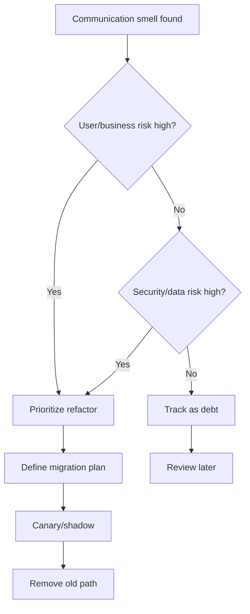

# Part 094 — Communication Anti-Patterns, Smells, and Refactoring Playbook

Real systems are messy.

Even if you know ideal patterns, you will inherit systems with:

- chatty synchronous APIs,
- sync fan-out,
- event spaghetti,
- DLQs nobody owns,
- retry storms,
- stale projections,
- undocumented topics,
- gRPC without deadlines,
- gateway business logic,
- mesh retries on unsafe methods,
- external provider calls in user path,
- hidden cross-region dependencies,
- no idempotency,
- no observability.

Top-tier engineers do not only design greenfield systems.

They can diagnose communication debt and refactor it safely.

This part is a practical smell catalog and refactoring playbook.

---

## 1. Smell-Driven Architecture

A smell is not always a bug.

It is a signal:

```text
this design may have hidden risk
```

Example smell:

```text
POST endpoint has automatic retries enabled.
```

Maybe it is safe because idempotency key exists.

Maybe it is dangerous.

The smell tells you what to investigate.

Architecture improvement begins with recognizing smells.

---

## 2. Anti-Pattern: Chatty API

### Symptom

A client makes many calls to complete one user action.

```text
GET /case
GET /case/{id}/customer
GET /case/{id}/documents
GET /case/{id}/history
GET /case/{id}/permissions
```

### Impact

- high latency,
- cascading failures,
- mobile/browser inefficiency,
- increased retries,
- hard timeout budgeting,
- poor UX,
- more gateway load.

### Refactoring

Options:

- create query aggregate endpoint,
- BFF for client-specific view,
- projection/read model,
- GraphQL/federated query if appropriate,
- cache stable reference data,
- batch endpoint,
- reduce frontend waterfall.

### Caution

Do not create giant "god endpoint" with every field.

Design by use case.

---

## 3. Anti-Pattern: Synchronous Fan-Out

### Symptom

One request calls many services sequentially or in parallel.

```text
Checkout -> inventory
         -> pricing
         -> payment
         -> fraud
         -> notification
         -> loyalty
```

### Impact

- availability multiplication,
- tail latency,
- retry amplification,
- partial failure complexity,
- hard rollback,
- large blast radius.

### Refactoring

- separate critical from optional work,
- move side effects to events/workflow,
- use local read models,
- precompute/reference data,
- use orchestration for long-running workflow,
- return 202 with operation status where acceptable,
- bulkhead optional dependencies.

### Principle

Only keep synchronous dependencies that are required for immediate decision.

---

## 4. Anti-Pattern: Distributed Monolith

### Symptom

Services are separate deployables but must call each other for almost every operation.

Signs:

- services cannot operate independently,
- deployment order tightly coupled,
- many synchronous cycles,
- shared database semantics through APIs,
- no clear ownership of data,
- transaction-like workflows across services.

### Impact

- microservice overhead without autonomy,
- cascading failures,
- slow changes,
- difficult testing,
- high latency.

### Refactoring

- revisit bounded contexts,
- merge services if split is artificial,
- move data ownership to one service,
- replace cycles with events/projections,
- define coarse-grained APIs,
- remove shared domain behavior from multiple services.

Sometimes the best microservice refactor is deleting a service boundary.

---

## 5. Anti-Pattern: Sync Call Cycle

### Symptom

```text
A -> B -> C -> A
```

or:

```text
case-service calls notification-service
notification-service calls case-service
```

### Impact

- deadlocks,
- timeout loops,
- retry amplification,
- hard tracing,
- circular ownership,
- deployment coupling.

### Refactoring

- break cycle with event,
- introduce read model,
- move responsibility to one service,
- invert dependency,
- use workflow orchestrator,
- duplicate stable reference data intentionally.

Cycles indicate unclear boundaries.

---

## 6. Anti-Pattern: Request-Response Over Events

### Symptom

A service publishes event and waits for another event as if doing RPC.

```text
CreateInvoiceCommand -> InvoiceCreatedReply
caller blocks waiting
```

### Impact

- complicated correlation,
- hidden timeout,
- harder debugging,
- broker used as RPC transport,
- poor user semantics,
- resource waiting.

### Refactoring

- use synchronous API if immediate response required,
- use async operation/status resource,
- use workflow state,
- use command/reply only when durable async request-reply is truly needed,
- avoid blocking thread while waiting for event.

Async request-reply is advanced.

Use deliberately.

---

## 7. Anti-Pattern: Event as Command

### Symptom

Event name is past tense but semantics are imperative.

```text
UserRegistered event means "email service must send welcome email now"
```

### Impact

- hidden command coupling,
- producer assumes consumer behavior,
- difficult retries,
- unclear ownership,
- new consumers misinterpret event.

### Refactoring

- if fact: keep event and let consumers choose behavior,
- if instruction: create command topic/API,
- if workflow: use process manager,
- document event semantics.

Facts and instructions are different.

---

## 8. Anti-Pattern: Command as Event

### Symptom

Topic contains commands named like:

```text
SendEmailRequested
ReserveInventoryRequested
CapturePaymentRequested
```

but treated as domain events.

### Impact

- consumers misinterpret as facts,
- ordering and compensation unclear,
- source of truth ambiguous,
- workflow state hidden.

### Refactoring

- rename as command if imperative,
- use command/reply contract,
- add command ID and status,
- use orchestrator if sequence matters,
- publish fact events after successful action.

Naming is semantics.

---

## 9. Anti-Pattern: Shared Event Mega-Topic

### Symptom

One topic contains everything.

```text
all-events
```

with many unrelated event types.

### Impact

- broad ACLs,
- noisy consumers,
- poor ownership,
- schema governance hard,
- retention mismatch,
- replay expensive,
- PII spreads,
- partitioning/key conflicts.

### Refactoring

- split by domain/data classification,
- define topic ownership,
- separate high-volume/low-value events,
- separate sensitive events,
- document event catalog,
- migrate consumers gradually.

Do not over-split either.

Use domain and operational boundaries.

---

## 10. Anti-Pattern: Topic Per Event Type Without Governance

### Symptom

Hundreds of tiny topics.

```text
case-created
case-updated
case-closed
case-reopened
case-escalated
```

### Impact

- topic sprawl,
- ACL sprawl,
- operational overhead,
- hard discovery,
- partition waste,
- inconsistent retention.

### Refactoring

- group related domain lifecycle events,
- use event type header,
- keep separate topics for distinct retention/security/volume,
- enforce topic policy.

Topic design is a balance.

---

## 11. Anti-Pattern: Null Key Events

### Symptom

Events that require per-entity ordering are published with null key.

### Impact

- no ordering per entity,
- random partitioning,
- projection gaps,
- hard replay,
- hot/cold imbalance.

### Refactoring

- define key policy,
- fail producer on missing key,
- add contract tests,
- include aggregate version,
- rebuild affected projections if needed.

Null key is not harmless for domain events.

---

## 12. Anti-Pattern: No Idempotency

### Symptom

Duplicate request/message creates duplicate side effect.

Examples:

- duplicate payment,
- duplicate email,
- duplicate task,
- duplicate projection row,
- duplicate workflow step.

### Impact

- data corruption,
- customer impact,
- manual cleanup,
- unsafe retries,
- fear of replay.

### Refactoring

- idempotency key for commands,
- processed message table,
- aggregate version upsert,
- external provider idempotency,
- stable command/event IDs,
- tests for duplicate delivery.

Idempotency is prerequisite for reliable distributed communication.

---

## 13. Anti-Pattern: Retry Storm

### Symptom

During dependency failure, traffic increases.

Signs:

- retry metrics spike,
- provider gets more requests while down,
- thread pools saturate,
- logs explode,
- upstream recovers slowly.

### Impact

- cascading failure,
- self-inflicted overload,
- prolonged incident.

### Refactoring

- bounded retries,
- exponential backoff + jitter,
- single retry owner,
- circuit breaker,
- load shedding,
- retry budget,
- disable duplicate retry layers,
- observability by attempt.

Retries are medicine with dosage.

---

## 14. Anti-Pattern: Infinite or Long Blocking Consumer Retry

### Symptom

Consumer retries same message forever and blocks partition.

### Impact

- partition lag,
- stale projection,
- other keys blocked,
- no DLQ,
- no alert.

### Refactoring

- classify failures,
- bounded blocking retry,
- non-blocking retry if ordering allows,
- DLQ/parking lot,
- poison detection,
- sequence gap policy,
- alert on lag age.

Consumer retry must match ordering requirements.

---

## 15. Anti-Pattern: DLQ Graveyard

### Symptom

Messages go to DLQ and nobody looks.

### Impact

- silent data loss,
- broken workflows,
- compliance risk,
- reprocessing debt.

### Refactoring

- assign DLQ owner,
- alert on first message for critical topics,
- classify DLQ reasons,
- build replay/remediation tool,
- dashboard DLQ age,
- runbook,
- test DLQ path.

DLQ is an operational queue, not trash.

---

## 16. Anti-Pattern: Stale Projection Hidden

### Symptom

API returns stale read model with no indication.

### Impact

- user confusion,
- wrong decisions,
- support tickets,
- consistency bugs.

### Refactoring

- projection freshness metric,
- expose version/updatedAt,
- read-your-writes status,
- fallback to source for critical reads,
- stale marker,
- rebuild capability,
- SLO for freshness.

Eventual consistency must be visible where it matters.

---

## 17. Anti-Pattern: Gateway Monolith

### Symptom

Gateway contains:

- business rules,
- data aggregation,
- transformations,
- workflow logic,
- service-specific branching,
- domain validation.

### Impact

- central bottleneck,
- hard deployments,
- unclear ownership,
- coupling,
- poor testing,
- edge incidents affect all APIs.

### Refactoring

- move domain logic to services/BFF,
- keep gateway to edge policy,
- create BFF per client where needed,
- reduce transformations,
- document route ownership.

Gateway should route and protect.

Not become business platform.

---

## 18. Anti-Pattern: Mesh Magic Reliability

### Symptom

Team enables mesh retries/timeouts and removes application resilience thinking.

### Impact

- unsafe retries,
- timeout mismatch,
- hidden failures,
- duplicate commands,
- no domain fallback,
- false confidence.

### Refactoring

- define policy ownership,
- disable unsafe mesh retries,
- align timeouts,
- keep app idempotency,
- keep app authorization,
- test composed policy.

Mesh standardizes network.

It does not understand business semantics.

---

## 19. Anti-Pattern: Direct External Calls Everywhere

### Symptom

Many services call external providers directly with their own credentials/config.

### Impact

- credential sprawl,
- inconsistent timeout/retry,
- provider quota incidents,
- no audit,
- hard rotation,
- data leakage risk.

### Refactoring

- external dependency catalog,
- egress policy,
- shared client library or integration service where appropriate,
- egress gateway for sensitive providers,
- per-provider timeout/retry/circuit breaker,
- credential management,
- observability.

External calls need governance.

---

## 20. Anti-Pattern: Cross-Region Sync Chain

### Symptom

Request in one region calls services across multiple regions synchronously.

### Impact

- high latency,
- partial failure,
- data residency risk,
- timeout complexity,
- retries across partitions,
- split brain risk.

### Refactoring

- route command to owner region,
- use local read models,
- async replication,
- avoid remote dependency in user path,
- define failover policy.

Cross-region calls should be rare and explicit.

---

## 21. Anti-Pattern: Hidden Consumer

### Symptom

Producer does not know who consumes topic.

### Impact

- breaking changes,
- unknown blast radius,
- no migration plan,
- security gap,
- incident escalation delay.

### Refactoring

- event catalog,
- consumer registration,
- ACL-based discovery,
- consumer-driven contracts,
- schema compatibility,
- deprecation process.

Producer does not need runtime coupling to consumers.

But governance needs consumer visibility.

---

## 22. Anti-Pattern: OpenAPI/AsyncAPI as Dead Docs

### Symptom

Docs exist but do not match runtime.

### Impact

- generated clients wrong,
- onboarding confusion,
- contract drift,
- broken integrations.

### Refactoring

- generate docs from source contract,
- validate contract in CI,
- test server against OpenAPI,
- test producer/consumer against AsyncAPI/schema,
- drift detection.

Contracts must be executable.

---

## 23. Anti-Pattern: Observability Afterthought

### Symptom

Only logs exist.

No metrics for:

- lag,
- retries,
- DLQ,
- outbox age,
- dependency p99,
- gateway route,
- auth denies,
- projection freshness.

### Impact

- incidents take long,
- root cause unclear,
- user impact hidden,
- no SLO.

### Refactoring

- define communication dashboards,
- emit layer-specific metrics,
- propagate IDs,
- structured logs,
- trace critical flows,
- alert on freshness/backlog,
- test observability.

If you cannot see it, you cannot operate it.

---

## 24. Anti-Pattern: Ownership Vacuum

### Symptom

Nobody owns:

- topic,
- DLQ,
- route,
- gateway config,
- mesh policy,
- external dependency,
- projection,
- runbook.

### Impact

- incident stalls,
- risky changes,
- no cleanup,
- no deprecation,
- governance failure.

### Refactoring

- owner labels,
- catalog,
- escalation paths,
- runbooks,
- ownership review,
- block new resources without owner.

Ownership is reliability infrastructure.

---

## 25. Anti-Pattern: Big Bang Communication Rewrite

### Symptom

Team wants to replace all sync calls with events at once.

### Impact

- huge risk,
- hidden compatibility issues,
- hard rollback,
- incomplete observability,
- duplicate paths,
- migration fatigue.

### Refactoring

Prefer strangler approach:

1. identify one painful flow,
2. define contract,
3. add outbox/event,
4. build passive consumer/projection,
5. compare,
6. canary,
7. shift traffic,
8. remove old path.

Small safe migrations beat heroic rewrites.

---

## 26. Smell Detection Queries

Useful questions:

- Which endpoints call more than 3 downstream services?
- Which routes have no timeout?
- Which POST routes have retries?
- Which topics have no owner?
- Which consumer groups have DLQ messages older than 1 day?
- Which services use default service account?
- Which events have null keys?
- Which projections have no freshness metric?
- Which external hosts are called by more than one service?
- Which mesh policies use wildcard allow?
- Which services call across region synchronously?
- Which dependencies have no dashboard?

Turn smells into automated reports.

---

## 27. Refactoring Prioritization

Prioritize by:

```text
risk = impact × likelihood × change frequency × observability gap
```

High priority examples:

- duplicate payment risk,
- public unauthenticated route,
- stale compliance projection,
- DLQ for financial events,
- unsafe retries on commands,
- cross-region write ambiguity.

Lower priority:

- small internal read endpoint with mild chattiness,
- low-value telemetry event with broad topic,
- minor docs mismatch.

Fix biggest blast radius first.

---

## 28. Refactoring Playbook: Sync to Async

Steps:

1. document current sync behavior,
2. define event/command contract,
3. add outbox in producer,
4. add idempotent consumer,
5. add status/projection if user needs visibility,
6. run in shadow mode,
7. compare outcomes,
8. canary async path,
9. monitor,
10. remove sync dependency.

Do not remove sync call before async side is proven.

---

## 29. Refactoring Playbook: Add Idempotency

Steps:

1. identify duplicate risk,
2. choose idempotency key scope,
3. add request header/command ID,
4. store request hash and result,
5. return same result for duplicate,
6. reject same key with different payload,
7. propagate key to events/side effects,
8. add tests,
9. update API docs.

Idempotency retrofit is often the highest-leverage reliability improvement.

---

## 30. Refactoring Playbook: Fix Retry Storm

Steps:

1. inventory retry layers,
2. compute max attempts,
3. disable duplicate layers,
4. classify retryable errors,
5. add backoff/jitter,
6. add circuit breaker,
7. enforce timeout budget,
8. add retry metrics,
9. test dependency outage.

Do not simply lower retry count without understanding owner.

---

## 31. Refactoring Playbook: Govern Topic

Steps:

1. identify producer/consumers,
2. document owner/classification,
3. define key/schema/retention,
4. register AsyncAPI/catalog,
5. add schema compatibility,
6. add ACL policy,
7. add DLQ owner/alert,
8. add replay policy,
9. add contract tests.

This turns topic from pipe into API.

---

## 32. Refactoring Playbook: Improve Projection Freshness

Steps:

1. measure current lag/freshness,
2. identify bottleneck,
3. add idempotent/versioned writes,
4. fix hot partitions,
5. tune consumer/batch writes,
6. add stale marker/read semantics,
7. add rebuild/shadow rebuild,
8. define SLO,
9. alert on lag age.

Projection fix may involve producer key, consumer capacity, or target store.

---

## 33. Refactoring Playbook: Gateway Cleanup

Steps:

1. inventory routes,
2. classify public/internal,
3. assign owner,
4. remove business logic,
5. move aggregation to BFF/service,
6. enforce auth/rate limit/timeouts,
7. add route tests,
8. add versioned metrics,
9. deprecate stale routes.

Gateway cleanup is often organizational.

Many teams may depend on edge behavior.

---

## 34. Refactoring Playbook: Mesh Policy Cleanup

Steps:

1. inventory policies,
2. detect wildcards,
3. map source/destination traffic,
4. run dry-run default deny,
5. add explicit allow rules,
6. disable unsafe retries,
7. align timeouts,
8. add authz tests,
9. monitor deny logs.

Mesh cleanup must be gradual.

Blocking hidden dependency abruptly causes outages.

---

## 35. Refactoring Playbook: External Dependency Control

Steps:

1. inventory external hosts,
2. identify owners/credentials,
3. classify data,
4. add timeout/retry/circuit policy,
5. centralize credentials if needed,
6. decide egress gateway/direct,
7. add provider dashboard,
8. test provider failure,
9. remove broad internet egress.

External dependency governance reduces both reliability and security risk.

---

## 36. Migration Safety

For any refactor:

- preserve old path during transition,
- dual-run/shadow where possible,
- compare results,
- canary,
- monitor,
- rollback,
- avoid irreversible data changes,
- support old contracts during retention window,
- communicate consumers.

Communication refactors affect other teams.

Treat them as migrations, not local code cleanups.

---

## 37. Refactoring Metrics

Track:

```text
sync fan-out count
retry layers per operation
routes without timeout
topics without owner
DLQ age
projection freshness
events with null key
services using default service account
external hosts count
cross-region sync calls
contracts without tests
```

Use metrics to show architecture debt reduction.

Improvement should be measurable.

---

## 38. Common False Fixes

### 38.1 Increase timeout

May hide slowness and worsen saturation.

### 38.2 Add retry

May duplicate commands and amplify outage.

### 38.3 Add Kafka

May move complexity to async correctness.

### 38.4 Add gateway logic

May centralize business coupling.

### 38.5 Add mesh

May hide bad app resilience.

### 38.6 Split service

May create distributed monolith.

### 38.7 Merge topics

May worsen ACL/retention/security.

### 38.8 Add cache

May create stale consistency bugs.

Every fix has trade-offs.

---

## 39. Communication Debt Register

Maintain register:

```yaml
communicationDebt:
  - id: CD-001
    smell: sync fan-out in checkout
    impact: high latency and cascading failure
    owner: checkout-platform
    risk: high
    proposedRefactor: async notification + fraud precheck cache
    status: planned
    due: 2026-09-01

  - id: CD-002
    smell: case-events DLQ no owner
    impact: silent projection loss
    owner: case-platform
    risk: critical
    proposedRefactor: DLQ owner + alert + replay runbook
    status: in-progress
```

Architecture debt becomes manageable when visible.

---

## 40. Decision Model



Not every smell needs immediate fix.

But every significant smell needs visibility.

---

## 41. Design Checklist

When diagnosing communication debt:

- Is the flow too chatty?
- Is there sync fan-out?
- Are there cycles?
- Are retries duplicated?
- Are commands idempotent?
- Are events keyed?
- Are topics owned?
- Are DLQs monitored?
- Are projections fresh?
- Is gateway doing business logic?
- Is mesh retrying unsafe operations?
- Are external calls governed?
- Are cross-region calls explicit?
- Are contracts executable?
- Is observability sufficient?
- Is ownership clear?
- Is there migration plan?

---

## 42. The Real Lesson

Advanced communication engineering is not only knowing patterns.

It is recognizing when a system has drifted away from them and refactoring safely.

Most production systems will contain anti-patterns because constraints change over time.

The skill is to:

```text
detect smells
measure risk
prioritize by blast radius
design migration path
prove with tests
roll out gradually
remove old coupling
```

That is how you turn a fragile microservice network into an evolvable communication architecture.

Top-tier engineers are not pattern collectors.

They are system repairers.

---

## References

- Enterprise Integration Patterns: https://www.enterpriseintegrationpatterns.com/
- Microservices.io Patterns: https://microservices.io/patterns/
- Google SRE Book — Addressing Cascading Failures: https://sre.google/sre-book/addressing-cascading-failures/
- Martin Fowler — Strangler Fig Application: https://martinfowler.com/bliki/StranglerFigApplication.html
- Architecture Decision Records: https://adr.github.io/
- AsyncAPI Specification: https://www.asyncapi.com/docs/reference/specification/latest
