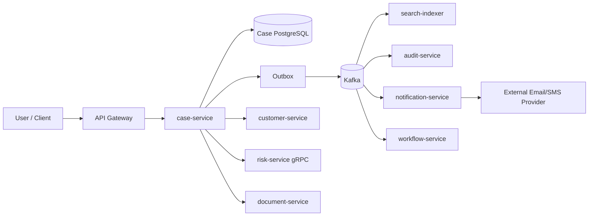

# Part 096 — Capstone: Full Java Microservices Communication Architecture

This final part is the capstone.

We will design a complete communication architecture for a realistic Java microservice system.

The goal is to show how the pieces fit:

- HTTP APIs,
- gRPC internal RPC,
- Kafka events,
- transactional outbox,
- idempotent consumers,
- projections,
- saga/process manager,
- API gateway,
- service mesh,
- egress control,
- external providers,
- security,
- observability,
- testing,
- capacity,
- production readiness.

The final skill is composition.

---

## 1. Case Study: Case Management Platform

Domain:

```text
A financial operations platform handles customer cases.
Cases can be created, assigned, escalated, investigated, resolved, audited, searched, and notified.
```

Core services:

| Service | Responsibility |
|---|---|
| case-service | owns case aggregate and lifecycle |
| customer-service | owns customer profile |
| risk-service | computes risk score |
| document-service | manages case documents |
| notification-service | sends email/SMS/push |
| search-indexer | builds searchable case projection |
| audit-service | stores audit trail |
| workflow-service | orchestrates long-running escalations |
| api-gateway | public API entry |

Infrastructure:

- Java 21,
- Spring Boot,
- PostgreSQL,
- Kafka,
- Schema Registry,
- Kubernetes,
- Gateway API/API gateway,
- service mesh,
- OpenTelemetry,
- CI/CD policy checks.

---

## 2. High-Level Architecture



Communication choices:

| Flow | Style |
|---|---|
| client -> gateway -> case-service | HTTP |
| case-service -> risk-service | gRPC |
| case-service -> customer-service | internal HTTP |
| case-service -> Kafka | outbox event publish |
| Kafka -> consumers | async event |
| notification -> provider | controlled egress |
| workflow | process manager commands/events |
| service-to-service network | mesh mTLS/authz |

---

## 3. Boundary Decisions

| Boundary | Decision | Rationale |
|---|---|---|
| Public API | HTTP/JSON | client compatibility and gateway auth |
| Internal risk scoring | gRPC | typed low-latency internal RPC |
| Case lifecycle fan-out | Kafka event | durable fan-out |
| Notification | async consumer | provider latency should not block case operation |
| Audit | async immutable consumer | durable history |
| Search | async projection | query optimization |
| Workflow | process manager | visible state and timeout handling |
| External provider | egress gateway | security, audit, rate limits |

Architecture uses different communication styles per boundary.

---

## 4. Public API Design

```http
POST /cases/{caseId}/escalations
Idempotency-Key: 9d617...
Authorization: Bearer ...
Content-Type: application/json
```

Response:

```http
202 Accepted
Location: /operations/op-123
```

Body:

```json
{
  "operationId": "op-123",
  "caseId": "CASE-100",
  "status": "ACCEPTED",
  "committed": [
    "case_escalation",
    "outbox_event"
  ],
  "pending": [
    "notification",
    "search_projection",
    "workflow_steps"
  ]
}
```

Semantics:

```text
case state committed before response
notification/search/workflow eventually complete
```

The API is honest about async side effects.

---

## 5. HTTP API Policy

```yaml
operation: CreateEscalation
method: POST
route: /cases/{caseId}/escalations

idempotency:
  required: true
  header: Idempotency-Key
  duplicateSamePayload: returnOriginalResult
  duplicateDifferentPayload: 409

timeouts:
  gatewayMs: 1500
  meshMs: 1400
  serviceBudgetMs: 1200
  dbMs: 300
  riskServiceMs: 250

retries:
  gateway: disabled
  mesh: disabled
  client: allowedOnlyWithSameIdempotencyKey

auth:
  gateway: oidc-jwt
  service: domain authorization
```

POST command is not retried by gateway/mesh.

---

## 6. Case Service Transaction

Inside `case-service`:

```text
validate command
check authorization
load case aggregate
apply escalation
insert idempotency record
insert case state change
insert outbox event
commit transaction
return 202
```

Critical invariant:

```text
if case state commits, outbox row commits
if transaction rolls back, no event row exists
```

This prevents missing events.

---

## 7. Java Command Handler Sketch

```java
@Transactional
public OperationResult escalate(EscalateCaseCommand command) {
    idempotency.checkOrReserve(
        command.idempotencyKey(),
        command.requestHash()
    );

    CaseAggregate caze = cases.getForUpdate(command.caseId());

    authorization.requireCanEscalate(command.user(), caze);

    DomainEvent domainEvent = caze.escalate(
        command.reason(),
        command.targetQueue(),
        command.comment()
    );

    cases.save(caze);

    CaseEscalatedEvent event = eventMapper.toEvent(domainEvent);

    outbox.insert(OutboxMessage.of(
        event.eventId(),
        "case-events",
        event.caseId(),
        event.eventType(),
        event.schemaVersion(),
        event.payload(),
        event.headers()
    ));

    OperationResult result = OperationResult.accepted(
        command.operationId(),
        command.caseId()
    );

    idempotency.complete(command.idempotencyKey(), result);

    return result;
}
```

Domain mutation and outbox are atomic.

---

## 8. Event Design

Topic:

```text
case-events
```

Key:

```text
caseId
```

Event:

```json
{
  "eventId": "evt-123",
  "eventType": "CaseEscalated.v1",
  "occurredAt": "2026-07-05T10:15:30Z",
  "caseId": "CASE-100",
  "aggregateVersion": 42,
  "reason": "HIGH_RISK_ACTIVITY",
  "targetQueue": "FRAUD_REVIEW"
}
```

Headers:

```text
event_id=evt-123
event_type=CaseEscalated.v1
correlation_id=corr-123
causation_id=cmd-456
producer=case-service
schema_id=case-escalated-v1
```

Contract:

- per-case ordering,
- aggregate version,
- event ID for dedup,
- schema compatibility,
- no secrets,
- PII minimized.

---

## 9. Consumer Design

Search projection consumer:

```yaml
consumer: search-indexer
topic: case-events
groupId: search-indexer
autoCommit: false
ackAfterDurableProjectionWrite: true
idempotency: processed-message-table
orderingScope: caseId
sequenceGapPolicy: retry-then-park
freshnessSloP99Seconds: 30
```

Notification consumer:

```yaml
consumer: notification-service
sideEffect: send notification
idempotency:
  notificationId: eventId + channel
providerIdempotencyKey: notificationId
retry:
  bounded: true
  backoff: exponential-jitter
replay:
  sideEffectsSuppressedByDefault: true
```

Audit consumer:

- append-only,
- idempotent by event ID,
- restricted access,
- longer retention,
- replay tested.

---

## 10. Workflow Service

Workflow example:

```text
CaseEscalated -> create EscalationWorkflow
EscalationWorkflow -> request risk review
RiskReviewed -> assign queue
QueueAssigned -> notify team
Timeout -> manual intervention
```

Use process manager because workflow has:

- multiple steps,
- timeouts,
- visible state,
- manual intervention,
- retries,
- compensation/fallback.

Choreography alone would make workflow progress hard to operate.

---

## 11. gRPC Risk Service

`case-service` calls `risk-service`.

Policy:

```yaml
dependency: risk-service
protocol: grpc
method: ScoreCaseRisk
deadlineMs: 250
retry:
  enabled: false
fallback:
  markRiskScorePending: true
metadata:
  correlationId: required
mesh:
  mtls: strict
  authz: case-service may call risk-service
```

gRPC is chosen for internal typed low-latency RPC.

---

## 12. Gateway, Mesh, and Egress

Gateway policy:

```yaml
route: /cases/**
host: api.example.com
auth: oidc-jwt
tls: terminate-at-gateway
rateLimit:
  by: clientId
  default: 1000/min
bodyLimitBytes: 1048576
timeouts:
  requestMs: 1500
retries:
  methods: [GET, HEAD]
  maxAttempts: 2
```

Mesh policy:

```yaml
mesh:
  mtls: strict
  authorization:
    case-service:
      allowFrom:
        - edge/api-gateway
        - order/order-service
    risk-service:
      allowFrom:
        - case/case-service
```

Egress provider:

```yaml
externalDependency: email-provider
viaEgressGateway: true
auth: oauth-client-credentials
timeoutMs: 1000
retry:
  maxAttempts: 3
  idempotencyKeyRequired: true
circuitBreaker:
  enabled: true
```

---

## 13. Multi-Region Strategy

Decision:

```yaml
topology: active-active-read-single-writer-write
ownership:
  owner: tenantRegion
writes:
  routeToOwnerRegion: true
  crossRegionRetryForCommands: forbidden
reads:
  localProjectionAllowed: true
  staleReadMaxSeconds: 60
failover:
  writeFailoverRequiresOwnershipTransfer: true
  fencingTokenRequired: true
```

Case commands route to tenant owner region.

Search projections may exist in multiple regions.

This avoids split brain for writes.

---

## 14. Observability Architecture

Signals:

```text
http.server.requests{service,operation,status}
http.client.requests{dependency,operation,status}
grpc.client.calls{service,method,status}
outbox.oldest_pending_age.seconds
messaging.consumer.lag.seconds
messaging.dlq.messages.total
case.escalation.workflow.duration
search.projection.freshness.seconds
gateway.requests.total{route,status}
mesh.authz.denied.total
egress.requests.total{provider,status}
```

Every flow has metrics, logs, traces, owner, dashboard, and runbook.

---

## 15. Testing and Chaos

Test layers:

- OpenAPI contract,
- gRPC proto compatibility,
- Kafka producer contract,
- consumer fixture tests,
- outbox crash-window tests,
- idempotency duplicate tests,
- DLQ tests,
- replay tests,
- gateway route tests,
- mesh authz tests,
- egress provider failure tests,
- load tests,
- selected E2E tests.

Drills:

- provider timeout,
- Kafka unavailable,
- consumer duplicate delivery,
- poison message,
- search consumer lag,
- bad canary,
- mesh authz deny,
- DNS failure,
- regional write failover.

---

## 16. Production Readiness Decision

```yaml
productionReadiness:
  decision: ready-with-conditions
  blockers: []
  conditions:
    - complete DLQ replay drill before GA
    - enable projection freshness SLO alert before 100% rollout
  acceptedRisks:
    - search projection may be stale up to 60s during replay
    - notification provider outage leaves notification pending
  rollout:
    phase1: internal tenant
    phase2: 5% production traffic
    phase3: 25%
    phase4: 100% after 7 days stable
  rollback:
    gatewayRouteRollback: true
    producerFeatureFlag: true
    consumerPause: true
```

This turns design into launch plan.

---

## 17. Master Checklist

Before launch:

- OpenAPI complete.
- AsyncAPI complete.
- Proto compatibility checked.
- Idempotency implemented.
- Outbox implemented.
- Consumer idempotency implemented.
- DLQ owned and alerted.
- Replay controlled.
- Gateway route tested.
- Mesh authz tested.
- Egress controlled.
- External provider failure tested.
- Projection freshness measured.
- Saga/workflow state visible.
- Dashboards ready.
- Runbooks ready.
- Capacity tested.
- Chaos drills done.
- ADRs accepted.
- Policy checks passing.
- Rollback ready.
- Owners on-call.

---

## 18. Final Mental Model

Every communication design should answer:

```text
Who is calling?
What contract applies?
What state changes?
What is committed before response?
What can be duplicated?
What can be delayed?
What can fail?
Who retries?
Who owns timeout?
Who authorizes?
Who observes?
Who operates?
Who recovers?
```

If you can answer those questions for every critical flow, you are operating at a very high engineering level.

---

## 19. Series Closing Summary

This series covered:

1. communication mental models,
2. HTTP transport and API design,
3. Java HTTP clients,
4. resilience patterns,
5. gRPC,
6. Kafka/event-driven communication,
7. outbox/inbox/idempotency,
8. schema and contract governance,
9. replay/projection/saga,
10. Kafka implementation,
11. observability/security/capacity,
12. service discovery,
13. gateway/ingress,
14. service mesh,
15. egress and multi-region,
16. policy as code,
17. testing and chaos,
18. ADR/review,
19. anti-pattern refactoring,
20. production readiness and capstone.

The throughline:

```text
communication is not transport
communication is distributed correctness
```

---

## 20. Final Lesson

A microservice architecture succeeds or fails at its boundaries.

Boundaries decide:

- reliability,
- scalability,
- security,
- team autonomy,
- debuggability,
- evolvability.

Mastering Java microservices communication means mastering boundary design.

That is the skillset of an elite distributed-systems engineer.

---

## References

- OpenAPI Specification: https://spec.openapis.org/oas/latest.html
- AsyncAPI Specification: https://www.asyncapi.com/docs/reference/specification/latest
- Apache Kafka Documentation: https://kafka.apache.org/documentation/
- gRPC Java: https://grpc.io/docs/languages/java/
- Spring Kafka Reference: https://docs.spring.io/spring-kafka/reference/
- Kubernetes Services: https://kubernetes.io/docs/concepts/services-networking/service/
- Kubernetes Gateway API: https://gateway-api.sigs.k8s.io/
- Istio Concepts: https://istio.io/latest/docs/concepts/
- Google SRE Book: https://sre.google/sre-book/table-of-contents/
- Enterprise Integration Patterns: https://www.enterpriseintegrationpatterns.com/
