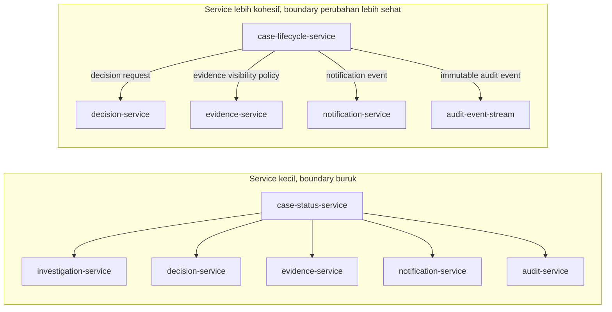
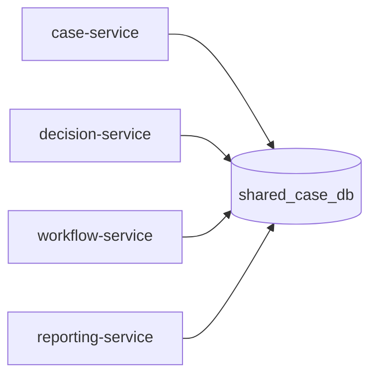
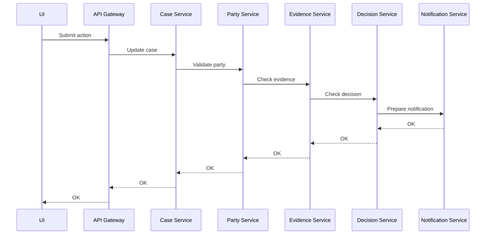
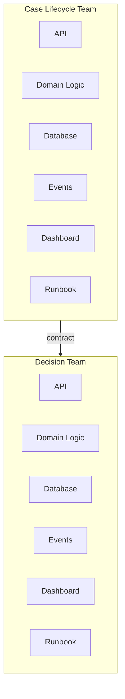

# Part 001 — Why Microservices Are Not Small Services

Microservices sering diajarkan dengan definisi yang terlalu dangkal:

> Pecah aplikasi besar menjadi service-service kecil.

Definisi itu tidak salah sepenuhnya, tapi berbahaya. Jika ukuran menjadi pusat pemikiran, engineer akan mengejar jumlah service, bukan kualitas boundary. Hasil akhirnya sering bukan microservices, melainkan **distributed monolith**: banyak deployment unit, banyak network call, banyak repository, banyak pipeline, tetapi tetap saling mengunci dalam release, data, dan perubahan bisnis.

Microservice bukan terutama tentang kecil. Microservice adalah **unit perubahan yang dapat dimiliki, diubah, diuji, dirilis, dioperasikan, dan dipulihkan secara relatif independen**.

Ukuran hanya efek samping dari boundary yang baik.

---

## 1. Tujuan Part Ini

Setelah bagian ini, kamu harus bisa menjawab pertanyaan berikut dengan tajam:

1. Apa bedanya microservice dengan sekadar service kecil?
2. Apa syarat minimum agar sebuah service layak disebut microservice?
3. Kapan microservices mempercepat organisasi, dan kapan justru memperlambat semuanya?
4. Mengapa microservices adalah keputusan organisasi, operasional, dan domain, bukan hanya keputusan teknis?
5. Apa yang harus berubah dalam cara berpikir Java engineer ketika berpindah dari monolith ke microservices?

Bagian ini belum membahas cara membuat REST controller, Kafka consumer, Dockerfile, atau deployment YAML. Itu semua hanya mekanisme. Kita mulai dari mental model karena microservices gagal paling sering bukan karena salah annotation, melainkan karena salah boundary, salah ownership, salah consistency model, dan salah ekspektasi terhadap distributed system.

---

## 2. Definisi Kerja yang Akan Kita Pakai

Dalam seri ini, sebuah microservice adalah:

> Sebuah service yang mengenkapsulasi kapabilitas bisnis tertentu, memiliki boundary perubahan yang jelas, menjalankan prosesnya sendiri, mengekspos kontrak integrasi yang eksplisit, memiliki ownership operasional, mengelola state/invariant yang menjadi tanggung jawabnya, dan dapat berevolusi tanpa memaksa seluruh sistem ikut berubah pada saat yang sama.

Definisi ini sengaja panjang karena realitas production juga panjang.

Definisi singkat seperti “small independently deployable service” berguna sebagai pintu masuk, tetapi tidak cukup untuk desain serius. Untuk engineer tingkat lanjut, pertanyaan yang lebih penting adalah:

- Apa yang membuat service ini **independen**?
- Independen terhadap apa: deploy, data, schema, scaling, team, release, failure, observability, atau lifecycle?
- Apa biaya dari independensi itu?
- Apa yang tetap tidak bisa independen karena constraint bisnis?

Microservice yang baik bukan service yang tidak punya dependency. Itu tidak realistis. Microservice yang baik adalah service yang dependencynya **diketahui, dibatasi, dimonitor, dan tidak membuat perubahan lokal berubah menjadi koordinasi global**.

---

## 3. “Small” adalah Metrik yang Buruk

Ukuran service bisa diukur dengan banyak cara:

- jumlah endpoint;
- jumlah class;
- jumlah baris kode;
- jumlah tabel;
- jumlah use case;
- jumlah developer;
- jumlah deployment artifact;
- jumlah bounded context;
- jumlah event yang diproduksi/dikonsumsi.

Masalahnya, tidak ada satu pun metrik ukuran yang otomatis menjawab apakah boundary-nya benar.

Sebuah service dengan 30 endpoint bisa tetap sehat jika semua endpoint berada dalam satu kapabilitas bisnis yang kohesif. Sebaliknya, service dengan 2 endpoint bisa buruk jika satu endpoint mengubah data milik domain lain, dan endpoint lainnya menjadi pass-through ke lima service berbeda.

Ukuran bukan akar. **Cohesion dan coupling** adalah akar.

### 3.1 Service kecil yang buruk

Contoh service kecil yang buruk:

```text
case-status-service
├── GET /cases/{id}/status
└── POST /cases/{id}/status
```

Sekilas terlihat rapi. Hanya status case. Sangat kecil.

Tetapi setelah dilihat lebih dalam:

- status hanya boleh berubah jika investigation service mengizinkan;
- status tertentu membutuhkan approval dari decision service;
- status tertentu membuat deadline di SLA service;
- status tertentu mengirim notification;
- status tertentu mengubah visibility evidence;
- status tertentu harus dicatat sebagai regulatory audit event;
- UI membutuhkan status bersama case summary, party, allegation, and next action.

Jika `case-status-service` tidak memiliki keputusan bisnis sendiri dan hanya menjadi titik transit untuk mengubah banyak state lain, service ini bukan boundary yang baik. Ia kecil, tetapi bukan microservice yang sehat.

### 3.2 Service besar yang mungkin benar

Contoh service yang lebih besar tetapi masuk akal:

```text
case-lifecycle-service
├── OpenCase
├── AssignInvestigator
├── RequestInformation
├── EscalateCase
├── RecommendDecision
├── CloseCase
├── ReopenCase
└── Emit case lifecycle events
```

Service ini lebih besar. Namun jika seluruh operasi itu berbagi language, invariant, workflow, ownership, audit requirement, dan lifecycle yang sama, maka boundary-nya bisa jauh lebih sehat.

Microservices bukan perlombaan mengecilkan komponen. Microservices adalah latihan menemukan **unit perubahan yang stabil**.

---

## 4. Microservice sebagai Unit Perubahan

Cara paling efektif memahami microservice adalah melihatnya sebagai **unit perubahan**.

Sebuah service layak berdiri sendiri jika ada alasan kuat bahwa ia perlu berubah, diskalakan, dimiliki, diamankan, atau dipulihkan dengan ritme berbeda dari bagian lain.

Pertanyaan kuncinya:

> Jika bagian ini berubah, siapa yang ikut terganggu?

Jika setiap perubahan kecil pada Service A memaksa perubahan di Service B, C, D, database bersama, pipeline bersama, contract bersama, dan release plan bersama, maka Service A tidak benar-benar independen.

### 4.1 Dimensi independensi

Independensi tidak biner. Ada beberapa dimensi:

| Dimensi | Pertanyaan | Tanda sehat | Tanda bermasalah |
|---|---|---|---|
| Deployment | Bisakah service dirilis sendiri? | Release lokal tidak memaksa release global | Harus sinkron dengan banyak service |
| Data | Siapa pemilik data dan invariant? | Satu owner jelas | Banyak service menulis tabel yang sama |
| Runtime | Apakah failure terisolasi? | Kegagalan dependency bisa didegradasi | Satu service lambat membuat semua lambat |
| Team | Siapa yang on-call dan mengambil keputusan? | Owner jelas | Semua orang merasa “bukan punya saya” |
| Contract | Apakah integrasi eksplisit? | API/event versioned dan compatible | Consumer bergantung ke detail internal |
| Scaling | Apakah beban berbeda? | Bisa scale sesuai karakteristik | Semua harus scale bersama |
| Security | Apakah trust boundary jelas? | Policy enforcement jelas | Trust berdasarkan network location |
| Compliance | Apakah bukti keputusan bisa direkonstruksi? | Audit trail terdesain | Log tersebar tanpa semantic trail |

Microservice bukan harus sempurna pada semua dimensi sejak hari pertama. Tetapi jika tidak ada satu pun dimensi independensi yang nyata, kamu mungkin hanya membuat distributed module.

---

## 5. Microservices adalah Architecture for Change

Architecture bukan gambar kotak dan panah. Architecture adalah kumpulan constraint yang membentuk bagaimana sistem bisa berubah.

Dalam monolith, banyak hal mudah dilakukan secara lokal:

- satu transaction boundary;
- satu process memory;
- satu deployment artifact;
- satu database query join;
- satu debugger session;
- satu stack trace;
- satu consistent model.

Dalam microservices, banyak kemudahan itu hilang. Sebagai gantinya, kamu mendapat potensi:

- independent deployment;
- independent scaling;
- independent ownership;
- fault isolation;
- technology specialization;
- organizational parallelism;
- bounded complexity per team.

Kata pentingnya adalah **potensi**. Microservices tidak otomatis memberikan semua itu. Ia hanya memungkinkan jika boundary dan operating model benar.

Jika boundary salah, kamu tetap membayar biaya distributed system tanpa mendapatkan manfaatnya.

---

## 6. Microservice Tax

Setiap microservice membawa pajak. Pajak ini harus dibayar terus-menerus, bukan sekali di awal.

### 6.1 Network tax

Call yang dulu method call sekarang menjadi remote call. Remote call bisa:

- lambat;
- timeout;
- gagal sebagian;
- berhasil tapi response hilang;
- dieksekusi dua kali karena retry;
- ditolak karena rate limit;
- gagal karena certificate;
- gagal karena DNS;
- gagal karena connection pool exhaustion;
- gagal karena dependency sedang deploy;
- gagal karena overload.

### 6.2 Data tax

Data yang dulu bisa di-join langsung sekarang berada di ownership berbeda.

Konsekuensinya:

- query lintas domain menjadi sulit;
- consistency menjadi eksplisit;
- data duplication menjadi normal;
- reconciliation menjadi kebutuhan;
- reporting butuh read model;
- audit butuh semantic event, bukan hanya row history.

### 6.3 Operational tax

Setiap service butuh:

- build pipeline;
- runtime config;
- secret management;
- deployment strategy;
- health check;
- metrics;
- logs;
- traces;
- dashboards;
- alerts;
- runbooks;
- ownership;
- capacity planning;
- incident response.

Satu service baru bukan hanya satu repository baru. Ia adalah satu operational asset baru.

### 6.4 Cognitive tax

Distributed system sulit dipahami karena behavior muncul dari interaksi.

Engineer tidak hanya membaca kode. Engineer harus memahami:

- dependency graph;
- event flow;
- state propagation;
- retry behavior;
- timeout hierarchy;
- rollout sequence;
- compatibility window;
- failure mode;
- ownership map.

Microservices memindahkan kompleksitas dari dalam proses ke antar proses. Kompleksitas tidak hilang. Ia berubah bentuk.

---

## 7. Diagram Mental: Dari Code Boundary ke Change Boundary



Perbedaan utamanya bukan jumlah service. Perbedaannya adalah siapa yang memegang invariant dan bagaimana perubahan dipropagasi.

Pada desain buruk, service kecil menjadi pusat koordinasi rapuh. Pada desain lebih sehat, boundary mengikuti lifecycle bisnis dan setiap integrasi memiliki semantic contract.

---

## 8. Syarat Minimum Microservice Production-Grade

Sebuah service di lingkungan production enterprise minimal perlu memenuhi hal berikut.

### 8.1 Purpose yang eksplisit

Service harus bisa dijelaskan dalam satu kalimat yang bukan teknis murni.

Buruk:

> Service untuk menyimpan tabel case_status.

Lebih baik:

> Service yang mengelola lifecycle case enforcement dari pembukaan sampai penutupan, termasuk validasi transisi status, SLA lifecycle, dan audit event.

Purpose yang baik menjelaskan kapabilitas, bukan tabel.

### 8.2 Owner yang jelas

Harus jelas:

- siapa tim pemilik service;
- siapa mengambil keputusan desain;
- siapa menerima alert;
- siapa memperbaiki incident;
- siapa menyetujui breaking change;
- siapa bertanggung jawab pada documentation dan runbook.

Service tanpa ownership adalah liability.

### 8.3 Contract yang eksplisit

Service berkomunikasi melalui contract:

- HTTP API;
- gRPC/protobuf;
- event schema;
- batch file contract;
- command message;
- query model;
- callback contract.

Contract harus punya aturan evolusi. Tanpa compatibility discipline, independent deployment hanya ilusi.

### 8.4 Data authority

Harus jelas data apa yang dimiliki service:

- data yang boleh ditulis;
- invariant yang dijaga;
- event yang diterbitkan;
- data yang boleh disalin oleh service lain;
- data yang hanya boleh dibaca melalui API;
- retention dan privacy rule.

Jika semua service menulis semua tabel, microservices tidak ada. Yang ada hanya monolith database dengan banyak aplikasi kecil.

### 8.5 Operability

Service harus dapat dioperasikan tanpa membuka source code pada jam 3 pagi.

Minimal:

- structured logs;
- metrics;
- distributed tracing;
- health/readiness endpoint;
- graceful shutdown;
- config validation;
- dependency visibility;
- known failure modes;
- runbook;
- dashboard;
- alert rule.

### 8.6 Failure behavior

Setiap dependency harus punya jawaban:

- timeout berapa?
- retry atau tidak?
- retry berapa kali?
- apakah idempotent?
- fallback apa?
- kalau dependency unavailable, user melihat apa?
- apakah operation boleh masuk queue?
- apakah ada compensation?
- apakah failure harus menghentikan workflow atau hanya menunda?

Jika jawaban ini tidak ada, service belum production-grade.

---

## 9. Microservices dan Java: Apa yang Berubah?

Java engineer yang kuat di monolith biasanya terbiasa mengoptimalkan hal-hal seperti:

- struktur package;
- dependency injection;
- transaction management;
- database access;
- object mapping;
- unit testing;
- performance JVM;
- clean code;
- framework conventions.

Semua itu tetap penting, tetapi tidak cukup.

Dalam microservices, Java engineer harus naik satu level:

| Dari | Menjadi |
|---|---|
| Method call | Remote call dengan timeout, retry, idempotency |
| Exception | Failure contract yang terlihat oleh caller |
| Local transaction | Business transaction dengan consistency strategy |
| Shared model | Explicit API/event contract |
| Package boundary | Service boundary dan ownership boundary |
| Stack trace | Trace across services |
| Unit test | Contract test, integration test, failure test |
| JVM tuning | Capacity model dan overload behavior |
| Database join | Read model, projection, API composition |
| Deployment artifact | Runtime asset dengan SLO dan runbook |

Framework seperti Spring Boot, Jakarta EE, MicroProfile, Quarkus, atau Micronaut bisa membantu, tetapi tidak menggantikan desain.

Annotation tidak membuat boundary menjadi benar.

---

## 10. Membedakan Modular Monolith, Microservices, dan Distributed Monolith

### 10.1 Modular monolith

Modular monolith memiliki satu deployment unit tetapi boundary internalnya disiplin.

Ciri sehat:

- module memiliki API internal yang jelas;
- dependency direction dikontrol;
- database access tidak liar;
- domain language terpisah;
- test boundary jelas;
- perubahan lokal tidak menyebar ke seluruh codebase.

Modular monolith sering menjadi pilihan terbaik sebelum microservices, terutama jika organisasi belum punya operational maturity.

### 10.2 Microservices

Microservices memiliki banyak deployment unit dengan boundary yang mengikuti business capability.

Ciri sehat:

- service dapat dirilis sendiri;
- data ownership jelas;
- dependency eksplisit;
- failure isolation dirancang;
- observability menjadi bagian desain;
- owner jelas;
- contract evolution disiplin.

### 10.3 Distributed monolith

Distributed monolith memiliki banyak service tetapi perubahan tetap terkunci bersama.

Ciri umum:

- release harus sinkron;
- banyak synchronous call berantai;
- semua service berbagi database;
- DTO internal bocor ke banyak service;
- satu failure kecil menjatuhkan flow besar;
- gateway menjadi tempat business logic;
- event dipakai sebagai remote setter;
- tidak ada owner yang benar-benar memegang invariant.

Distributed monolith adalah kondisi terburuk: biaya microservices, manfaat monolith pun hilang.

---

## 11. Smell: Kamu Tidak Punya Microservices, Kamu Punya Distributed Modules

Berikut smell yang sering muncul di enterprise Java system.

### 11.1 Shared database write

Jika banyak service menulis tabel yang sama, boundary data tidak ada.



Ini biasanya terjadi karena alasan praktis:

- legacy schema sudah ada;
- reporting butuh akses cepat;
- tim ingin menghindari API call;
- transaction lebih mudah;
- deadline project pendek.

Namun dampaknya berat:

- tidak ada owner data;
- schema migration harus koordinasi banyak service;
- invariant mudah rusak;
- audit trail tidak jelas;
- bug bisa muncul dari writer mana pun.

### 11.2 Synchronous chain terlalu panjang



Semakin panjang chain, semakin besar peluang failure dan latency. Jika setiap hop punya timeout sendiri dan retry sendiri, satu request user bisa berubah menjadi badai request internal.

### 11.3 DTO sebagai shared library antar service

Shared library untuk DTO terlihat efisien, tetapi bisa merusak independent evolution.

Masalahnya bukan reuse. Masalahnya adalah coupling.

Jika semua service memakai satu package `com.company.common.dto.CaseDto`, maka perubahan field bisa memaksa banyak service rebuild dan redeploy. Itu bukan contract ownership; itu compile-time coupling lintas service.

Shared library seharusnya dibatasi untuk hal yang benar-benar stabil dan non-domain-specific, misalnya tracing helper atau error envelope yang sangat matang. Domain contract lebih aman dikelola sebagai API schema/event schema dengan compatibility discipline.

### 11.4 Gateway menjadi business brain

API gateway seharusnya menangani concern edge:

- routing;
- authentication handoff;
- coarse rate limiting;
- request shaping;
- TLS termination;
- protocol translation terbatas;
- BFF composition jika memang desainnya begitu.

Gateway menjadi smell ketika mulai memegang:

- business rule;
- workflow state;
- domain validation;
- compensation;
- data ownership;
- audit decision;
- complex orchestration tanpa visibility.

Jika gateway tahu terlalu banyak, service di belakangnya menjadi CRUD backend, bukan domain service.

---

## 12. Decision Model: Kapan Microservices Layak?

Gunakan microservices ketika beberapa tekanan berikut benar-benar kuat.

### 12.1 Delivery autonomy pressure

Banyak tim perlu bergerak paralel tanpa saling menunggu.

Tanda:

- satu codebase menjadi bottleneck release;
- perubahan domain A sering tertahan domain B;
- ownership tidak bisa dipisahkan dalam monolith;
- regression surface terlalu luas;
- release train terlalu lambat untuk kebutuhan bisnis.

### 12.2 Domain volatility pressure

Sebagian domain berubah jauh lebih cepat daripada bagian lain.

Contoh:

- pricing policy berubah mingguan;
- enforcement escalation rule sering berubah karena regulasi;
- notification channel sering berubah;
- reporting dimensions berubah sesuai kebutuhan regulator;
- identity/authorization model berubah karena compliance.

Jika semua perubahan itu berada dalam satu deployment unit besar, koordinasi membesar.

### 12.3 Scaling asymmetry pressure

Beban tiap capability berbeda drastis.

Contoh:

- read case summary 10.000 RPS;
- submit enforcement decision 20 RPS;
- generate audit report 2 RPS tapi sangat berat;
- notification burst saat campaign;
- evidence indexing CPU-intensive.

Jika semua berada dalam satu runtime, kamu harus scale semuanya mengikuti bottleneck tertentu.

### 12.4 Reliability isolation pressure

Satu bagian tidak boleh menjatuhkan bagian lain.

Contoh:

- reporting lambat tidak boleh mengganggu case submission;
- notification provider down tidak boleh membuat decision gagal;
- search index unavailable tidak boleh membuat case update berhenti;
- external regulator API lambat tidak boleh menghabiskan thread request utama.

### 12.5 Compliance and audit pressure

Beberapa domain membutuhkan bukti, retention, policy, dan audit trail yang berbeda.

Contoh:

- decision service harus menyimpan alasan keputusan;
- evidence service harus menjaga chain of custody;
- case lifecycle service harus merekam transisi dan actor;
- privacy-sensitive service harus membatasi data exposure;
- regulatory reporting service harus bisa menjelaskan asal data.

Microservices bisa membantu jika boundary mengikuti responsibility tersebut.

### 12.6 Technology specialization pressure

Sebagian workload butuh karakteristik teknis berbeda.

Contoh:

- low-latency API;
- streaming processor;
- search/indexing worker;
- batch reconciliation;
- CPU-heavy document classification;
- workflow orchestration;
- audit event store.

Namun hati-hati: technology specialization adalah alasan pendukung, bukan alasan utama. Jangan memecah service hanya karena ingin mencoba stack baru.

---

## 13. Kapan Jangan Memakai Microservices

Microservices bukan maturity badge.

Hindari microservices jika:

1. Domain belum dipahami.
2. Tim belum bisa mendefinisikan ownership.
3. Deployment masih manual dan rapuh.
4. Observability belum memadai.
5. Testing masih bergantung pada manual regression besar.
6. Data ownership tidak bisa diputuskan.
7. Semua perubahan tetap harus disetujui satu komite pusat.
8. Platform belum punya standard untuk logging, metrics, tracing, config, secrets, deployment.
9. Tidak ada on-call ownership.
10. Masalah utama sebenarnya adalah code quality dalam monolith, bukan boundary bisnis.

Dalam kondisi ini, modular monolith sering lebih rasional. Kamu bisa memperbaiki boundary internal dulu, lalu mengekstrak service ketika seam sudah jelas.

---

## 14. The “Micro” in Microservice

Kata “micro” lebih baik dipahami sebagai:

- micro dalam scope ownership;
- micro dalam blast radius;
- micro dalam cognitive load per team;
- micro dalam release coordination;
- micro dalam alasan untuk berubah.

Bukan otomatis micro dalam jumlah class.

### 14.1 Ukuran yang sehat muncul dari cohesion

Jika capability kecil, service kecil.

Jika capability kompleks tetapi kohesif, service bisa lebih besar.

Yang penting:

- semua operasi dalam service berbagi model mental;
- perubahan biasanya terjadi bersama;
- invariant berada dalam satu boundary;
- owner memahami keseluruhan responsibility;
- integrasi keluar tidak menjadi detail internal.

### 14.2 Ukuran harus mengikuti load dan lifecycle

Service yang menangani workflow panjang mungkin memiliki banyak code tetapi sedikit traffic. Service yang menangani read-heavy endpoint mungkin kecil secara domain tetapi besar secara capacity concern.

Jangan menilai service hanya dari code size. Nilai dari:

- change frequency;
- operational risk;
- data authority;
- dependency complexity;
- domain cohesion;
- team ownership;
- runtime profile.

---

## 15. Contoh Analisis: Enforcement Case Management

Kita pakai domain regulatory/enforcement karena domain ini memaksa desain yang serius.

Entitas yang mungkin ada:

- Case;
- Party;
- Allegation;
- Evidence;
- Investigation;
- Finding;
- Decision;
- Penalty;
- Appeal;
- Notification;
- Audit Event;
- Regulatory Report.

Pendekatan CRUD naïf akan menghasilkan service seperti:

```text
case-service
party-service
allegation-service
evidence-service
finding-service
decision-service
penalty-service
appeal-service
notification-service
report-service
```

Ini belum tentu salah, tetapi sangat mencurigakan. Decomposition by entity sering gagal karena business process tidak mengikuti tabel.

Pertanyaan yang lebih baik:

1. Siapa yang memiliki lifecycle case?
2. Siapa yang boleh mengubah status case?
3. Apa invariant transisi status?
4. Apa yang terjadi jika evidence berubah setelah decision draft dibuat?
5. Apakah decision adalah bagian dari case lifecycle atau bounded context sendiri?
6. Apakah notification adalah side effect atau policy-aware communication service?
7. Apakah audit event hanya log teknis atau evidence chain untuk regulatory defensibility?
8. Apakah reporting membaca operational data langsung atau read model sendiri?
9. Apa yang harus tetap benar ketika external system down?
10. Apa yang boleh eventual consistent dan apa yang harus immediate?

Dari sini, service candidate mungkin berubah menjadi:

```text
case-lifecycle-service
investigation-service
evidence-custody-service
decision-service
appeal-service
communication-service
audit-trail-service
regulatory-reporting-service
```

Ini bukan final answer. Ini contoh bahwa boundary harus lahir dari behavior dan responsibility, bukan daftar tabel.

---

## 16. Service Charter: Dokumen Minimum Sebelum Membuat Service

Sebelum membuat repository baru, tulis service charter.

```mdx
# Service Charter: <service-name>

## Purpose
Satu kalimat kapabilitas bisnis yang dimiliki service.

## Owned Decisions
Keputusan bisnis apa yang boleh dibuat service ini?

## Owned Data
Data apa yang menjadi source of truth service ini?

## Invariants
Aturan apa yang harus selalu benar di dalam boundary ini?

## Public Contracts
API, event, command, atau query apa yang diekspos?

## Consumers
Siapa consumer langsung dan tidak langsung?

## Dependencies
Service/data/external system apa yang dibutuhkan?

## Failure Behavior
Jika dependency gagal, apa yang dilakukan service?

## Consistency Model
Mana yang strongly consistent, mana eventual, mana asynchronous?

## Operational Ownership
Tim owner, dashboard, alert, runbook, SLO.

## Lifecycle
Kapan service ini dibuat, kapan bisa digabung/dipensiunkan, apa migration path?
```

Jika service charter sulit diisi, kemungkinan boundary belum jelas.

---

## 17. Microservices as Socio-Technical Architecture

Microservices bukan hanya technical architecture. Ia adalah socio-technical architecture.

Artinya, struktur sistem dan struktur organisasi saling memengaruhi.

Jika organisasi tersusun berdasarkan layer:

- frontend team;
- backend team;
- database team;
- QA team;
- deployment team;
- operations team;

maka microservices sulit memberi manfaat independent ownership. Setiap perubahan tetap melewati banyak handoff.

Microservices lebih cocok dengan ownership end-to-end:



Tim tidak hanya menulis kode. Tim memiliki behavior production.

---

## 18. Prinsip Desain yang Akan Dipakai Sepanjang Seri

Seri ini akan konsisten dengan prinsip berikut.

### 18.1 Design from business capability, not technical layer

Jangan membuat service seperti:

```text
auth-controller-service
case-repository-service
validation-service
mapper-service
common-service
```

Service seperti itu biasanya mencerminkan layer teknis, bukan capability bisnis.

### 18.2 Own your data or do not pretend to be independent

Jika service tidak punya data authority atau setidaknya state responsibility yang jelas, hati-hati. Bisa jadi ia hanya wrapper.

### 18.3 Every remote call is a failure boundary

Remote call harus selalu didesain dengan timeout, retry, idempotency, fallback, dan observability.

### 18.4 Events are facts, not remote procedure calls

Event seharusnya merepresentasikan sesuatu yang sudah terjadi dan bermakna bisnis. Jangan memakai event sebagai cara tersembunyi untuk memanggil setter service lain.

### 18.5 Prefer explicit consistency over accidental consistency

Jika data boleh stale, tulis staleness contract. Jika harus immediate, jelaskan mengapa dan apa konsekuensinya.

### 18.6 Optimize for change locality

Boundary yang baik membuat perubahan umum tetap lokal.

Pertanyaan praktis:

> Dalam 10 perubahan terakhir, berapa banyak service yang harus ikut berubah?

Jika jawabannya sering lebih dari tiga, boundary perlu diperiksa.

---

## 19. Mini Checklist: Apakah Ini Microservice yang Masuk Akal?

Gunakan checklist ini sebelum membuat service baru.

### Boundary

- [ ] Apakah service merepresentasikan capability, bukan tabel/layer teknis?
- [ ] Apakah domain language service jelas?
- [ ] Apakah invariant utama berada dalam boundary yang sama?
- [ ] Apakah perubahan umum bisa tetap lokal?

### Ownership

- [ ] Apakah ada team owner yang jelas?
- [ ] Apakah owner punya wewenang mengubah dan merilis service?
- [ ] Apakah owner juga bertanggung jawab atas operasi production?

### Data

- [ ] Apakah owned data jelas?
- [ ] Apakah service lain dilarang menulis data tersebut langsung?
- [ ] Apakah data exposure dilakukan melalui contract?

### Runtime

- [ ] Apakah dependency diketahui?
- [ ] Apakah timeout/retry/fallback dirancang?
- [ ] Apakah service bisa degraded mode?
- [ ] Apakah service punya readiness/liveness semantics?

### Contract

- [ ] Apakah API/event schema eksplisit?
- [ ] Apakah backward compatibility dipikirkan?
- [ ] Apakah consumer diketahui?

### Operability

- [ ] Apakah logs, metrics, traces tersedia?
- [ ] Apakah dashboard dan alert ada?
- [ ] Apakah runbook tersedia?
- [ ] Apakah failure mode utama terdokumentasi?

Jika banyak jawaban “tidak”, jangan buru-buru membuat repository baru.

---

## 20. Exercise: Audit Service yang Pernah Kamu Bangun

Ambil satu service dari sistem nyata yang pernah kamu bangun. Isi tabel berikut.

| Pertanyaan | Jawaban |
|---|---|
| Apa purpose bisnis service ini? |  |
| Data apa yang dimiliki? |  |
| Invariant apa yang dijaga? |  |
| Siapa owner production? |  |
| Berapa consumer langsung? |  |
| Apakah service bisa dirilis sendiri? |  |
| Apakah schema change memaksa service lain berubah? |  |
| Apa dependency paling berbahaya? |  |
| Apa yang terjadi jika dependency itu down? |  |
| Apa failure mode paling sering? |  |
| Apakah service ini boundary bisnis atau hanya technical wrapper? |  |

Lalu beri skor:

- 0–3: kemungkinan distributed module;
- 4–6: service candidate yang perlu diperbaiki;
- 7–8: service cukup sehat;
- 9–10: microservice boundary kuat.

Skor ini bukan kebenaran absolut. Tujuannya memaksa percakapan arsitektur menjadi konkret.

---

## 21. Kesimpulan Part 001

Microservices bukan tentang membuat service kecil.

Microservices adalah tentang membuat boundary yang membuat perubahan, ownership, failure, data, dan operasi menjadi lebih lokal dan terkendali.

Prinsip utama:

1. Ukuran bukan metrik utama; cohesion dan coupling lebih penting.
2. Service harus punya purpose bisnis, owner, contract, data authority, dan failure behavior.
3. Microservices membawa pajak network, data, operational, dan cognitive.
4. Jika boundary salah, hasilnya distributed monolith.
5. Java framework membantu implementasi, tetapi tidak menggantikan desain.
6. Modular monolith sering lebih baik daripada microservices yang dipaksakan.
7. Microservice yang sehat adalah unit perubahan, bukan unit folder/repository.

Pada Part 002, kita akan masuk ke realitas yang tidak bisa dinegosiasikan: begitu service berbicara melalui network, kamu sedang mendesain distributed system. Local reasoning tidak cukup lagi.

---

## 22. Rujukan

- Martin Fowler, “Microservices” — https://martinfowler.com/articles/microservices.html
- Martin Fowler, “Microservices Guide” — https://martinfowler.com/microservices/
- AWS, “Implementing Microservices on AWS” — https://docs.aws.amazon.com/whitepapers/latest/microservices-on-aws/microservices-on-aws.html
- AWS Well-Architected Framework, “Build services focused on specific business domains” — https://docs.aws.amazon.com/wellarchitected/latest/framework/rel_service_architecture_business_domains.html
- AWS Prescriptive Guidance, “Database-per-service pattern” — https://docs.aws.amazon.com/prescriptive-guidance/latest/modernization-data-persistence/database-per-service.html
- Microsoft Azure Architecture Center, “Microservices architecture style” — https://learn.microsoft.com/en-us/azure/architecture/guide/architecture-styles/microservices
- Google SRE Book, “Addressing Cascading Failures” — https://sre.google/sre-book/addressing-cascading-failures/
