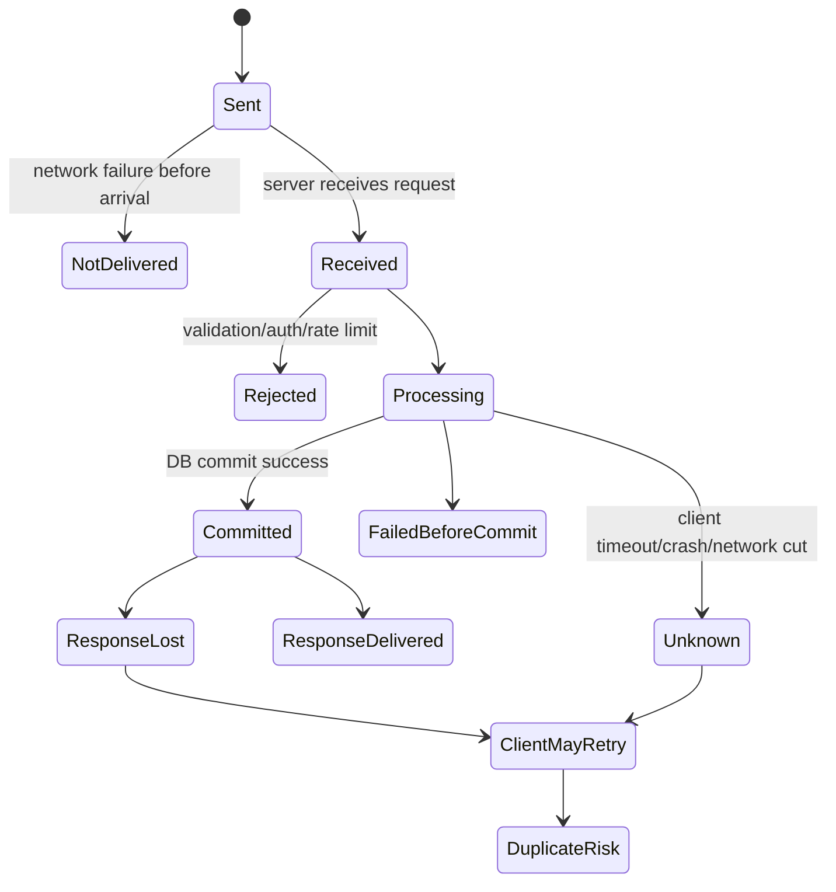
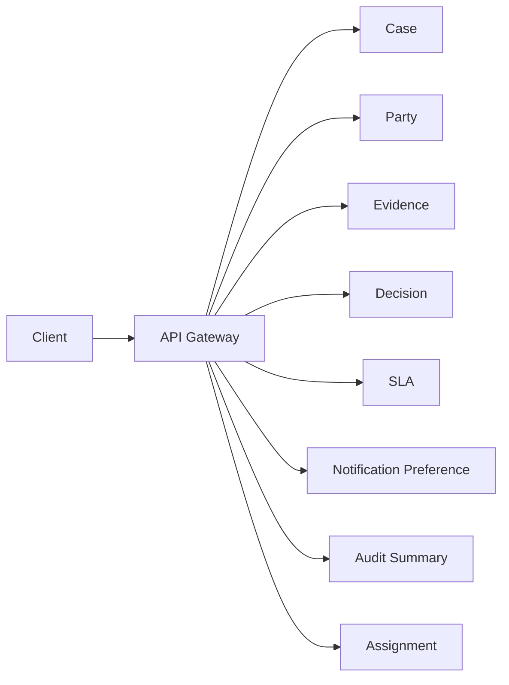
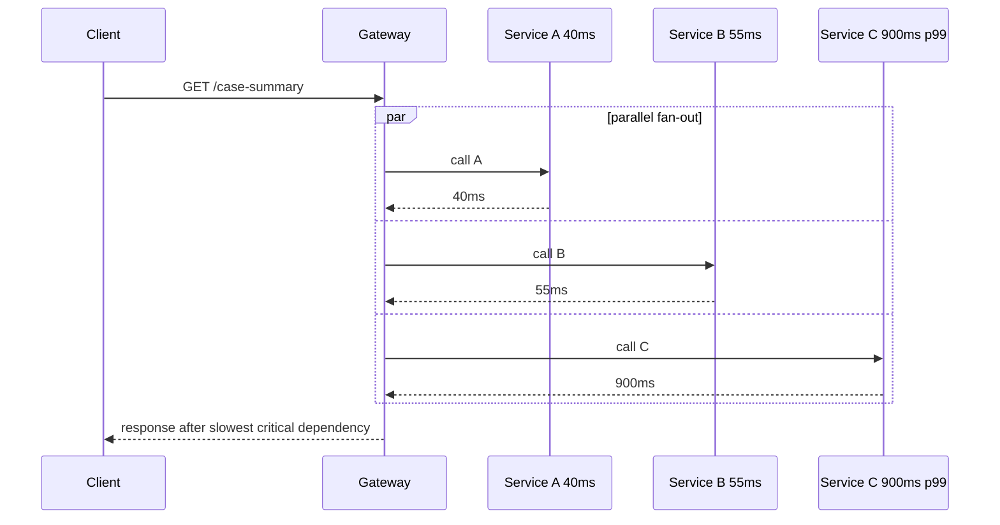
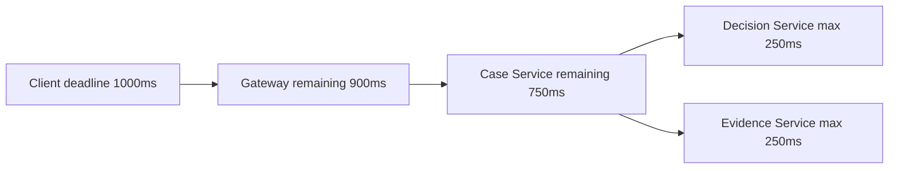
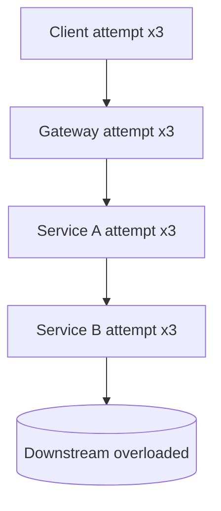
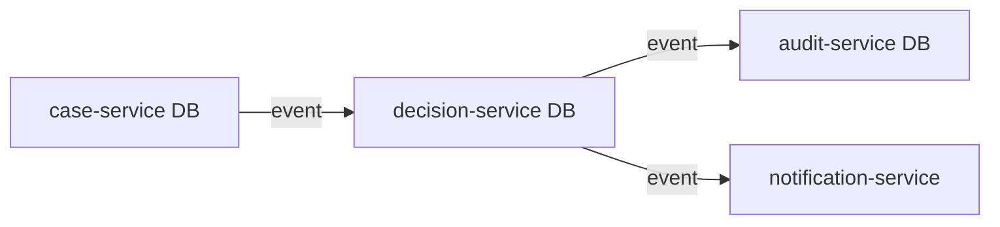
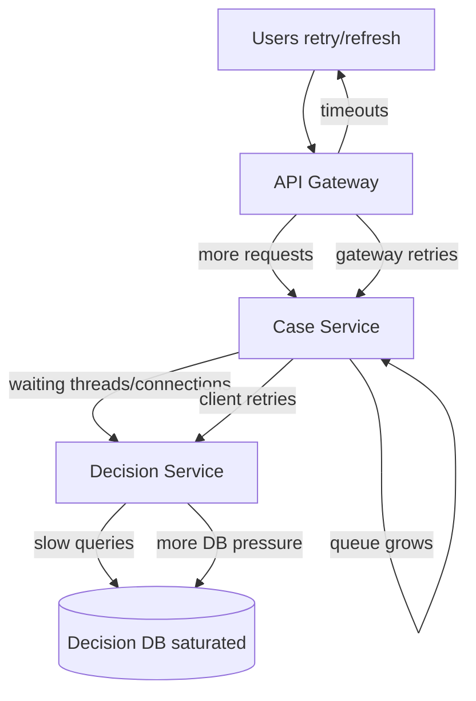
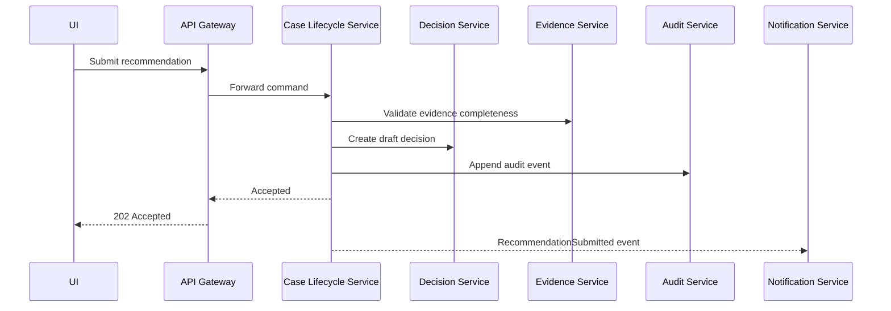

# Part 002 — Distributed System Reality Check

Begitu satu service memanggil service lain melalui network, kamu tidak lagi hanya menulis aplikasi Java. Kamu sedang mendesain **distributed system**.

Ini bukan perbedaan akademik. Ini mengubah cara kamu berpikir tentang correctness, performance, debugging, testing, transaction, dan user experience.

Dalam monolith, banyak operasi terasa deterministik:

```java
Decision decision = decisionService.approve(command);
```

Dalam microservices, operasi yang terlihat sama secara konseptual mungkin menjadi:

```text
case-service --HTTP/gRPC--> decision-service --DB--> decision-db
```

Sekarang ada network, serialization, timeout, retry, connection pool, load balancer, DNS, TLS, deployment race, dependency overload, dan observability gap.

Distributed system tidak gagal seperti program lokal. Ia gagal sebagian.

---

## 1. Tujuan Part Ini

Setelah bagian ini, kamu harus memiliki mental model berikut:

1. Remote call bukan method call.
2. Partial failure adalah kondisi normal, bukan edge case langka.
3. Latency bukan angka tunggal; latency adalah distribusi.
4. Retry bisa memperbaiki transient failure, tetapi juga bisa memperbesar outage.
5. Timeout tanpa deadline budget sering hanya memindahkan masalah.
6. Availability menurun ketika dependency chain memanjang.
7. Service design harus mencantumkan failure semantics, bukan hanya happy path.
8. Java abstraction yang nyaman tidak boleh menyembunyikan realitas network.

Kita belum akan masuk ke implementasi detail Resilience4j, OpenTelemetry, circuit breaker, atau saga. Itu akan dibahas nanti. Bagian ini membangun dasar: apa yang sebenarnya terjadi ketika sistem didistribusikan.

---

## 2. Remote Call Bukan Local Call

Perbedaan ini harus menjadi refleks.

| Aspek | Local call | Remote call |
|---|---|---|
| Lokasi eksekusi | Proses yang sama | Proses berbeda, host berbeda, mungkin region berbeda |
| Failure mode | Exception, bug, OOM lokal | Timeout, network error, 5xx, 4xx, partial success, duplicate execution |
| Latency | Nanosecond/microsecond-ish | Millisecond hingga second |
| Observability | Stack trace lokal | Trace lintas service dibutuhkan |
| Transaction | Bisa satu transaction lokal | Harus desain consistency lintas boundary |
| Type safety | Compiler membantu | Contract/schema compatibility membantu, tapi runtime tetap berisiko |
| Retry | Jarang dibutuhkan | Sering dipertimbangkan, tetapi berbahaya jika salah |
| Debugging | Breakpoint/stack lokal | Logs, metrics, traces, correlation ID |
| Versioning | Satu binary | Banyak versi hidup bersamaan |
| Ownership | Biasanya satu codebase/team | Bisa beda team, beda release cadence |

Kesalahan umum engineer adalah memperlakukan remote call seperti method call dengan latency lebih besar. Itu salah. Remote call adalah operasi yang bisa masuk ke banyak state ambigu.

---

## 3. State Ambigu dalam Remote Call

Dalam local call, jika method return sukses, kamu cukup yakin operasi selesai. Jika throw exception, operasi gagal di proses lokal.

Dalam remote call, outcome tidak selalu jelas.

Misalnya `case-service` mengirim command ke `decision-service`:

```text
POST /decisions/{caseId}/approve
```

Kemungkinan outcome:

1. Request tidak pernah sampai.
2. Request sampai, tetapi ditolak sebelum diproses.
3. Request diproses, database commit berhasil, response gagal dikirim.
4. Request diproses, commit gagal, response 500 dikirim.
5. Request diproses sebagian, lalu service crash.
6. Request diproses dua kali karena retry.
7. Request timeout di client, tetapi server masih bekerja.
8. Load balancer memutus koneksi saat rolling deployment.
9. Client menerima 200 OK, tetapi event lanjutan gagal dipublish.
10. Server sukses, tetapi caller gagal menyimpan state lokal setelah menerima response.

Distributed system penuh dengan state seperti ini:



Karena outcome bisa ambigu, desain harus menjawab:

- Apakah command ini idempotent?
- Apakah client boleh retry?
- Bagaimana server mendeteksi duplicate?
- Apakah ada idempotency key?
- Apakah ada operation ID?
- Bagaimana client mengetahui status final?
- Apakah operasi punya read-after-write expectation?
- Apa yang ditampilkan ke user ketika status unknown?

Tanpa jawaban ini, correctness bergantung pada keberuntungan.

---

## 4. Fallacies of Distributed Computing dalam Microservices

Ada beberapa asumsi klasik yang sering diam-diam masuk ke desain microservices. Kita tulis ulang dalam bahasa engineer produksi.

### 4.1 “Network is reliable”

Tidak. Network bisa gagal, lambat, packet loss, DNS error, TLS handshake gagal, load balancer salah route, atau firewall berubah.

Implikasi desain:

- semua call perlu timeout;
- semua dependency perlu failure behavior;
- semua client perlu observability;
- semua retry harus dibatasi.

### 4.2 “Latency is zero”

Tidak. Bahkan jika rata-rata latency rendah, tail latency bisa buruk. User tidak mengalami rata-rata; user mengalami request tertentu.

Implikasi desain:

- ukur p95/p99, bukan hanya average;
- kurangi fan-out;
- gunakan deadline budget;
- hindari synchronous chain yang tidak perlu.

### 4.3 “Bandwidth is infinite”

Tidak. Payload besar, chatty API, dan over-fetching bisa membuat network menjadi bottleneck.

Implikasi desain:

- desain payload sesuai use case;
- hindari API yang memaksa banyak round trip;
- compression perlu trade-off CPU;
- streaming/batch perlu dipilih sadar.

### 4.4 “Network is secure”

Tidak. Network internal bukan trust boundary yang cukup.

Implikasi desain:

- service identity penting;
- mTLS/workload identity sering dibutuhkan;
- authorization tetap harus dipikirkan di service boundary;
- sensitive data tidak boleh bocor karena “internal”.

### 4.5 “Topology does not change”

Tidak. Instance naik turun, deployment rolling, autoscaling, rescheduling, node failure, DNS cache stale.

Implikasi desain:

- client harus tahan endpoint churn;
- connection pool harus dikonfigurasi dengan benar;
- readiness harus bermakna;
- graceful shutdown wajib.

### 4.6 “There is one administrator”

Tidak. Banyak tim, banyak pipeline, banyak ownership, banyak release cadence.

Implikasi desain:

- contract evolution harus eksplisit;
- observability harus lintas team;
- incident escalation harus jelas;
- dependency ownership harus diketahui.

---

## 5. Availability Chain: Matematika Sederhana yang Sering Diabaikan

Misalkan satu service punya availability 99.9%.

Jika satu user request harus melewati 1 dependency, availability idealnya sekitar:

```text
0.999 = 99.9%
```

Jika harus melewati 5 dependency serial, dan kita sederhanakan seolah independent:

```text
0.999^5 = 0.995 ≈ 99.5%
```

Jika 10 dependency:

```text
0.999^10 = 0.990 ≈ 99.0%
```

Model ini tidak sempurna karena failure tidak selalu independent. Dalam real system, failure sering correlated: satu network issue, satu region issue, satu database issue, atau satu overload event bisa memengaruhi banyak service sekaligus. Artinya realitas bisa lebih buruk.

Pelajaran penting:

> Satu service yang “cukup reliable” tidak membuat flow end-to-end reliable jika dependency chain panjang.

### 5.1 Fan-out memperburuk risiko

Jika API gateway memanggil 8 service secara paralel untuk membangun satu response, request sukses hanya jika semua dependency kritikal sukses.



Jika semua dependency wajib sukses, satu service lambat bisa membuat seluruh response lambat.

Solusi bukan selalu “jangan fan-out”. Kadang fan-out dibutuhkan. Tetapi desain harus menentukan:

- dependency mana critical;
- dependency mana optional;
- data mana boleh stale;
- apakah response partial boleh;
- apakah ada cache/read model;
- apakah composition lebih baik dilakukan asynchronous.

---

## 6. Latency adalah Distribusi, Bukan Angka Tunggal

Average latency sering menipu.

Misalnya:

```text
average latency: 40 ms
p95 latency:     250 ms
p99 latency:     1200 ms
```

Jika dashboard hanya menunjukkan average, sistem terlihat sehat. Tetapi user di p99 mengalami 1.2 detik untuk satu dependency. Jika request melewati beberapa dependency, tail latency bisa saling menumpuk.

### 6.1 Tail latency dalam fan-out

Jika satu response membutuhkan 10 call paralel, latency response kira-kira ditentukan oleh dependency paling lambat, bukan rata-rata semua dependency.



Karena itu desain API composition harus bertanya:

- apakah semua data harus real-time?
- apakah dependency lambat bisa dipisahkan?
- apakah UI bisa progressive rendering?
- apakah read model bisa dipersiapkan sebelumnya?
- apakah p99 dependency sudah masuk latency budget?

---

## 7. Timeout: Safety Belt yang Sering Salah Dipakai

Timeout diperlukan agar caller tidak menunggu selamanya. Tetapi timeout bukan angka yang bisa dipilih sembarangan.

Timeout terlalu panjang:

- thread/request slot tertahan;
- connection pool habis;
- queue menumpuk;
- user menunggu lama;
- overload makin parah.

Timeout terlalu pendek:

- request valid dianggap gagal;
- retry meningkat;
- dependency menerima duplicate;
- false failure naik;
- user experience buruk.

### 7.1 Timeout harus mengikuti deadline budget

Misalnya end-to-end user request harus selesai dalam 1 detik.

```text
Total budget: 1000 ms
- API gateway processing: 50 ms
- case-service processing: 150 ms
- decision-service call: 250 ms
- evidence-service call: 250 ms
- response serialization/network: 100 ms
- safety margin: 200 ms
```

Jika setiap service asal memasang timeout 5 detik, total request bisa menggantung jauh melewati user budget.

Yang lebih sehat adalah deadline propagation:



Service tidak boleh membuat timeout lokal yang mengabaikan deadline global.

### 7.2 Java implication

Dalam Java, pastikan timeout bukan hanya satu angka.

Untuk HTTP client biasanya ada beberapa timeout berbeda:

- connect timeout;
- connection request/acquire timeout;
- read/response timeout;
- write timeout;
- overall request timeout;
- idle connection timeout.

Untuk gRPC, konsep deadline biasanya lebih natural karena deadline bisa dipropagasikan. Tetapi tetap harus dipakai secara eksplisit.

Virtual threads di Java modern dapat mengurangi biaya blocking thread, tetapi tidak menghilangkan masalah dependency lambat. Jika dependency lambat dan request menumpuk, bottleneck tetap muncul di connection pool, database, downstream capacity, memory, atau queue.

---

## 8. Retry: Obat yang Bisa Menjadi Racun

Retry berguna untuk transient failure:

- packet loss sesaat;
- connection reset;
- temporary 503;
- leader election pendek;
- cold start dependency;
- brief network blip.

Tetapi retry berbahaya jika failure disebabkan overload. Ketika dependency sudah tidak sanggup, retry menambah beban.

### 8.1 Retry amplification

Bayangkan satu request memanggil tiga layer. Setiap layer melakukan retry 3 kali.

```text
Client retries 3x
Gateway retries 3x
Service A retries 3x
Service B retries 3x
```

Worst-case attempt ke dependency paling bawah bisa meningkat secara eksponensial.



Satu request user bisa berubah menjadi banyak request internal.

### 8.2 Retry harus punya rule

Retry hanya boleh dilakukan jika:

- operasi aman untuk diulang;
- failure kemungkinan transient;
- ada retry budget;
- ada backoff;
- ada jitter;
- ada maximum attempts;
- ada observability;
- tidak melebihi caller deadline;
- downstream tidak memberi sinyal jangan retry.

### 8.3 Retry dan idempotency tidak bisa dipisah

Jika operation mengubah state, retry tanpa idempotency bisa membuat duplicate effect.

Contoh buruk:

```text
POST /penalties
```

Client timeout lalu retry. Server mungkin sudah membuat penalty pertama, lalu membuat penalty kedua.

Lebih sehat:

```text
POST /penalties
Idempotency-Key: 7f1c7e2a-...
```

Server menyimpan hasil berdasarkan idempotency key. Retry dengan key yang sama mengembalikan hasil yang sama, bukan membuat effect baru.

---

## 9. Partial Failure: Sistem Bisa Setengah Berhasil

Dalam distributed system, “berhasil” dan “gagal” tidak selalu global.

Contoh use case:

> Investigator submit recommendation untuk case.

Flow:

1. Simpan recommendation.
2. Update case lifecycle.
3. Publish audit event.
4. Kirim notification ke reviewer.
5. Update search index.

Kemungkinan partial success:

| Step | Status |
|---|---|
| Simpan recommendation | sukses |
| Update case lifecycle | sukses |
| Publish audit event | sukses |
| Kirim notification | gagal |
| Update search index | tertunda |

Apakah use case gagal?

Jawabannya tergantung business semantics.

Mungkin recommendation tetap sah karena data utama dan audit berhasil. Notification bisa retry asynchronous. Search index boleh eventually consistent.

Tetapi jika audit event gagal, mungkin operation tidak boleh dianggap sukses karena regulatory defensibility rusak.

Distributed system memaksa kamu membedakan:

- critical side effect;
- optional side effect;
- retryable side effect;
- compensatable side effect;
- user-visible state;
- internal propagation state.

---

## 10. Consistency Tidak Hilang, Hanya Harus Didesain

Dalam monolith, sering ada satu database transaction:

```text
BEGIN
  update case
  insert recommendation
  insert audit_log
COMMIT
```

Dalam microservices, data mungkin tersebar.



Sekarang pertanyaannya:

- apakah update case dan decision harus atomic?
- apakah audit harus berada dalam transaction yang sama dengan decision?
- apakah notification boleh tertunda?
- bagaimana jika event publish gagal setelah DB commit?
- bagaimana jika consumer memproses event dua kali?
- bagaimana user melihat status sementara?

Microservices tidak menghapus kebutuhan consistency. Ia memaksa consistency menjadi explicit design.

---

## 11. Overload dan Cascading Failure

Overload adalah salah satu sumber paling berbahaya dalam microservices.

Misalnya `decision-service` lambat karena database saturation.

Apa yang terjadi?

1. `case-service` menunggu lebih lama.
2. Thread/connection di `case-service` tertahan.
3. Request queue di `case-service` naik.
4. `api-gateway` melihat timeout dan retry.
5. Retry menambah beban ke `case-service` dan `decision-service`.
6. `decision-service` makin lambat.
7. User refresh halaman, membuat request baru.
8. Autoscaler menambah instance, tetapi database tetap bottleneck.
9. Sistem makin luas terdampak.



Cascading failure sering bukan karena satu komponen mati total, tetapi karena sistem terus memaksa komponen yang sedang sakit untuk menerima lebih banyak beban.

### 11.1 Prinsip pertahanan overload

- timeout harus terbatas;
- retry harus dibudgetkan;
- load shedding lebih baik daripada mati total;
- backpressure harus ada;
- dependency critical harus diisolasi;
- queue harus punya batas;
- circuit breaker bisa menghentikan call yang hampir pasti gagal;
- fallback/degraded response harus disiapkan untuk beberapa path;
- alert harus mendeteksi saturation sebelum outage penuh.

---

## 12. Queue Bukan Solusi Ajaib

Async messaging sering dipakai untuk mengurangi coupling. Itu benar, tetapi queue bukan penghapus failure.

Queue mengubah bentuk failure:

| Sync call problem | Async problem equivalent |
|---|---|
| Caller timeout | Consumer lag |
| Immediate failure | Delayed failure |
| Backpressure langsung | Queue depth membesar |
| Duplicate request | Duplicate message |
| User menunggu | User melihat pending state |
| Dependency down | Message menumpuk |
| Error response | Dead-letter / poison message |

Queue memberi buffer. Buffer memberi waktu. Tetapi buffer juga bisa menyembunyikan masalah sampai terlambat.

Pertanyaan desain:

- Berapa maksimum queue depth?
- Berapa maksimum acceptable lag?
- Apa yang terjadi pada poison message?
- Apakah message idempotent?
- Apakah ordering penting?
- Apakah consumer bisa scale?
- Apakah ada dead-letter policy?
- Apakah ada replay strategy?
- Apakah user bisa melihat pending state?

Async bukan berarti sederhana. Async berarti kamu menukar coupling waktu dengan kompleksitas state dan operability.

---

## 13. Debugging Distributed System

Dalam monolith, bug sering bisa dicari dari satu log file dan satu stack trace.

Dalam microservices, satu user action bisa menghasilkan:

- log di gateway;
- log di service A;
- log di service B;
- event di broker;
- consumer log;
- database update;
- trace spans;
- metric spikes;
- alert dari dependency;
- dashboard p99 latency.

Tanpa correlation ID dan distributed tracing, debugging menjadi tebak-tebakan.

### 13.1 Minimum observability per request

Setiap request lintas service harus membawa:

- trace ID;
- span ID;
- request ID atau correlation ID;
- user/actor context yang aman;
- tenant/context jika multi-tenant;
- operation name;
- dependency target;
- result status;
- latency;
- retry attempt;
- timeout/failure reason.

Contoh log event konseptual:

```json
{
  "timestamp": "2026-07-04T10:15:30.120Z",
  "level": "INFO",
  "service": "case-lifecycle-service",
  "operation": "SubmitRecommendation",
  "traceId": "8f3c...",
  "caseId": "CASE-2026-000123",
  "dependency": "decision-service",
  "dependencyOperation": "CreateDraftDecision",
  "attempt": 1,
  "latencyMs": 183,
  "result": "SUCCESS"
}
```

Ini bukan sekadar logging style. Ini kemampuan sistem untuk menjelaskan dirinya sendiri.

---

## 14. Java-Specific Distributed System Traps

### 14.1 Default timeout yang tidak kamu sadari

Banyak client library punya default timeout yang terlalu panjang, tidak lengkap, atau bahkan tidak sesuai kebutuhan production.

Jangan pernah mengandalkan default untuk dependency penting. Timeout adalah bagian dari contract runtime.

### 14.2 Connection pool exhaustion

Service bisa terlihat CPU normal tetapi gagal karena connection pool habis.

Penyebab umum:

- downstream lambat;
- timeout terlalu panjang;
- pool terlalu kecil;
- pool terlalu besar hingga menekan downstream;
- connection leak;
- DNS/endpoint churn;
- idle connection stale.

Metrik yang perlu dilihat:

- active connections;
- pending acquire;
- pool saturation;
- connection creation rate;
- error by exception type;
- dependency latency percentile.

### 14.3 Blocking call dalam request path

Blocking call bukan selalu buruk. Java modern dengan virtual threads membuat blocking style lebih murah untuk banyak kasus. Tetapi blocking dependency tetap blocking terhadap progress bisnis.

Virtual threads tidak membuat dependency lebih cepat, tidak menambah kapasitas database, dan tidak menghapus timeout.

### 14.4 Serialization compatibility

JSON terlihat fleksibel, tetapi contract tetap bisa pecah.

Contoh breaking change:

- rename field;
- mengubah semantic field;
- mengubah enum tanpa fallback;
- mengubah nullable menjadi required;
- mengubah number menjadi string;
- mengubah timezone interpretation;
- mengubah default sorting;
- menghapus field yang dipakai consumer.

Distributed system berarti banyak versi hidup bersamaan. Compatibility harus dipikirkan sejak awal.

### 14.5 Transaction annotation illusion

`@Transactional` hanya menjaga transaction lokal di boundary resource tertentu. Ia tidak membuat operasi lintas service atomic.

Jika method Java memanggil database lokal lalu HTTP service lain, transaction lokal tidak mencakup HTTP side effect.

```java
@Transactional
public void approveCase(ApproveCaseCommand command) {
    caseRepository.markApproved(command.caseId());
    decisionClient.createDecision(command.caseId());
}
```

Jika database commit sukses tetapi HTTP call gagal, state sistem partial. Jika HTTP call sukses tetapi transaction lokal rollback, state juga partial.

Solusinya bukan sekadar annotation tambahan. Solusinya adalah desain: outbox, saga, idempotency, compensation, atau boundary ulang.

---

## 15. Failure Semantics: Pertanyaan Wajib untuk Setiap Dependency

Untuk setiap dependency, jawab tabel ini.

| Pertanyaan | Contoh jawaban |
|---|---|
| Apa dependency ini critical untuk response? | Critical / optional / async side effect |
| Timeout berapa? | 250 ms connect, 800 ms response, mengikuti deadline |
| Retry? | Hanya untuk 502/503/network reset, max 2, exponential backoff + jitter |
| Operation idempotent? | Ya, pakai idempotency key per command |
| Fallback? | Return partial response dengan stale decision summary |
| Jika gagal, user melihat apa? | “Decision is being prepared” bukan 500 mentah |
| Apakah failure dicatat? | Metric + structured log + trace span status |
| Apakah ada alert? | Alert jika p95 > threshold dan error budget burn tinggi |
| Bagaimana recovery? | Retry async worker / reconciliation job |
| Apa blast radius? | Hanya decision submission, case read tetap jalan |

Jika tabel ini kosong, desain belum selesai.

---

## 16. Request Path Review

Ambil satu endpoint:

```text
POST /cases/{caseId}/recommendations
```

Jangan hanya desain controller. Gambar request path.



Lalu klasifikasikan:

| Dependency | Sync/Async | Critical? | Failure behavior |
|---|---|---|---|
| Evidence validation | Sync | Critical | Reject if unavailable? Use cached completeness? |
| Decision draft | Sync/Async? | Maybe critical | Could return 202 and continue async |
| Audit event | Sync/outbox? | Critical | Must not lose event |
| Notification | Async | Non-critical | Retry later |

Review seperti ini membuat desain tidak terjebak happy path.

---

## 17. Pattern Preview: Tools yang Akan Kita Pakai Nanti

Bagian ini bukan tempat implementasi detail, tetapi kamu perlu tahu peta solusi.

| Masalah | Pattern/Technique |
|---|---|
| Duplicate command karena retry | Idempotency key, operation table |
| DB commit sukses tapi event gagal | Transactional outbox |
| Consumer memproses message dua kali | Inbox/deduplication |
| Dependency lambat | Timeout, deadline, circuit breaker |
| Dependency overloaded | Load shedding, rate limiting, backpressure |
| Business transaction lintas service | Saga/orchestration/choreography |
| Query lintas service lambat | Read model, projection, API composition |
| Debugging lintas service | OpenTelemetry tracing, structured logs |
| Contract berubah | Versioning, compatibility tests, expand-contract |
| Partial side effect | Compensation, retry workflow, reconciliation |

Jangan menghafal pattern sebagai template. Pahami failure yang diselesaikan.

---

## 18. Principle: Design the Failure Path First

Untuk setiap use case, tulis happy path singkat, lalu habiskan energi pada failure path.

Happy path:

```text
User submits recommendation, system saves it, decision draft is created, audit is recorded, reviewer is notified.
```

Failure path yang harus dijawab:

- Evidence service timeout.
- Decision service returns 409 because draft exists.
- Decision service accepts command but response lost.
- Audit append fails.
- Notification provider down.
- User submits twice.
- Browser retry occurs.
- Gateway timeout but backend continues.
- Case is closed concurrently by another actor.
- Deployment happens mid-request.
- Consumer processes event twice.
- Search projection lags behind.

Engineer biasa berhenti di happy path. Engineer top-level mendesain failure path sampai behavior production bisa diprediksi.

---

## 19. Exercise: Distributed Reality Audit

Pilih satu endpoint di sistemmu. Isi ini.

```mdx
# Distributed Reality Audit

## Endpoint
<method> <path>

## User-visible goal
Apa yang user anggap berhasil?

## Service path
Service apa saja yang disentuh?

## Critical dependencies
Dependency mana yang wajib sukses sebelum response?

## Optional dependencies
Dependency mana yang boleh gagal/tertunda?

## Timeout budget
Berapa budget end-to-end dan per dependency?

## Retry policy
Retry dilakukan di mana? Berapa kali? Untuk error apa?

## Idempotency
Apa key-nya? Di mana disimpan? Berapa lama?

## Partial failure behavior
Apa yang terjadi jika step 1 sukses, step 2 gagal?

## Observability
Trace/log/metric apa yang membuktikan status operasi?

## Recovery
Bagaimana sistem kembali konsisten?
```

Jika kamu tidak bisa mengisi audit ini, endpoint tersebut belum siap untuk microservices production-grade.

---

## 20. Kesimpulan Part 002

Distributed system reality check:

1. Remote call bukan local call.
2. Partial failure adalah kondisi normal.
3. Timeout, retry, dan fallback harus didesain sebagai bagian contract runtime.
4. Retry tanpa idempotency adalah sumber duplicate side effect.
5. Fan-out dan dependency chain menurunkan reliability end-to-end.
6. Latency harus dilihat sebagai distribusi, terutama p95/p99.
7. Queue mengubah failure, bukan menghapus failure.
8. `@Transactional` tidak membuat operasi lintas service atomic.
9. Observability bukan tambahan; ia adalah requirement desain.
10. Failure path harus didesain sebelum production.

Pada Part 003, kita akan membahas architecture sebagai constraint untuk perubahan: bukan diagram kotak-panah, tetapi sistem keputusan yang menentukan bagaimana software berevolusi, gagal, dan dioperasikan.

---

## 21. Rujukan

- Google SRE Book, “Addressing Cascading Failures” — https://sre.google/sre-book/addressing-cascading-failures/
- Google SRE Book, “Handling Overload” — https://sre.google/sre-book/handling-overload/
- Google SRE Book, “Production Services Best Practices” — https://sre.google/sre-book/service-best-practices/
- AWS Well-Architected Reliability Pillar, “Implement loosely coupled dependencies” — https://docs.aws.amazon.com/wellarchitected/latest/reliability-pillar/rel_prevent_interaction_failure_loosely_coupled_system.html
- Microsoft Azure Architecture Center, “Microservices architecture style” — https://learn.microsoft.com/en-us/azure/architecture/guide/architecture-styles/microservices
- Martin Fowler, “Microservices” — https://martinfowler.com/articles/microservices.html
