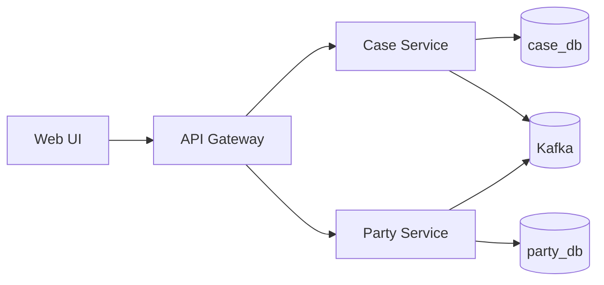
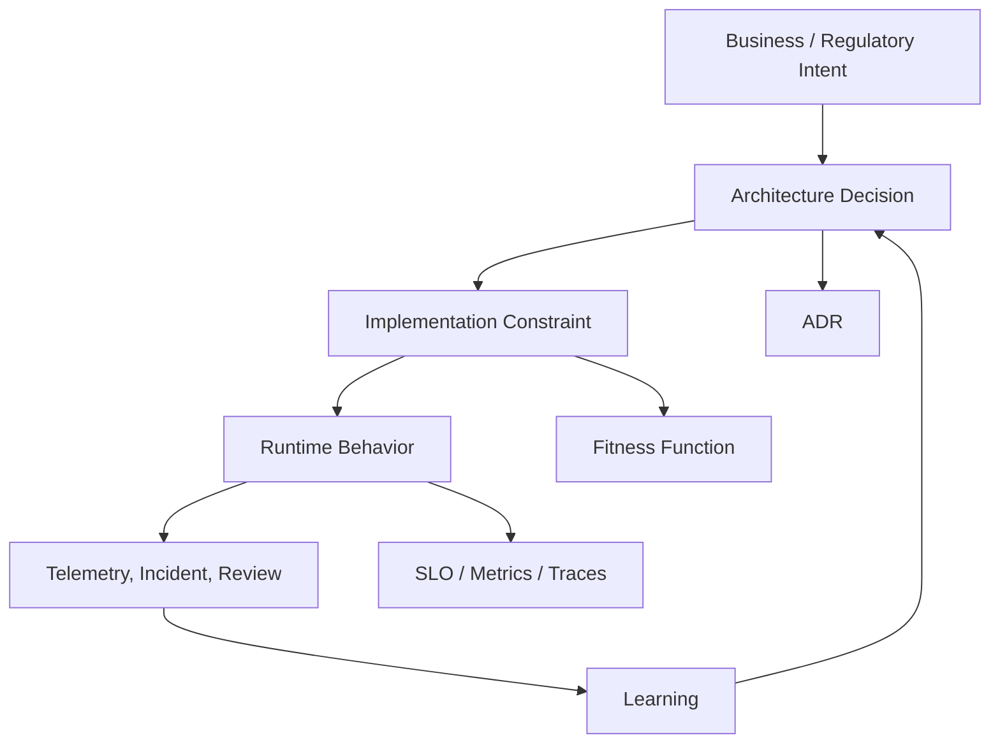
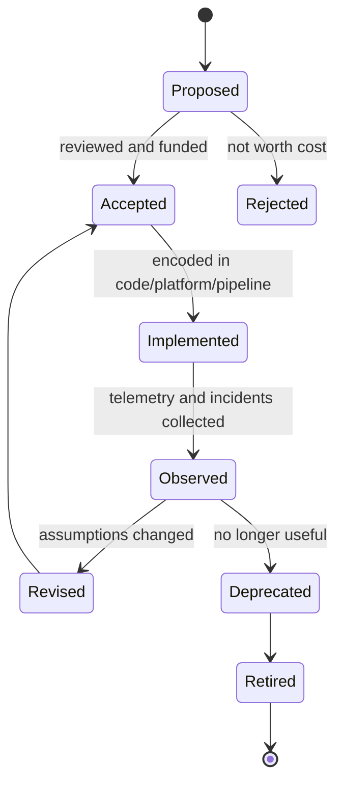
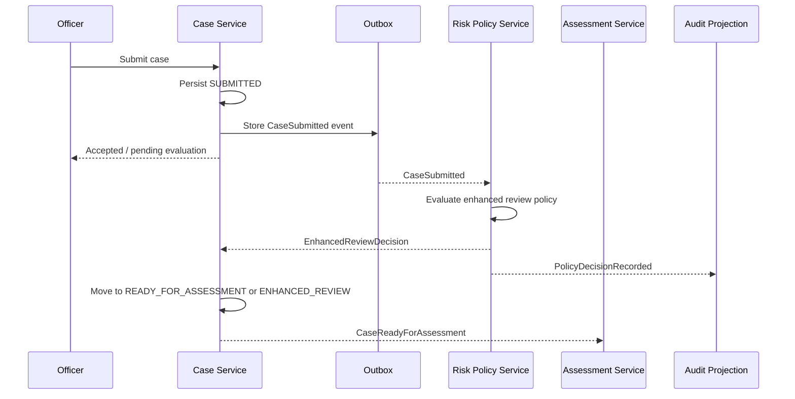
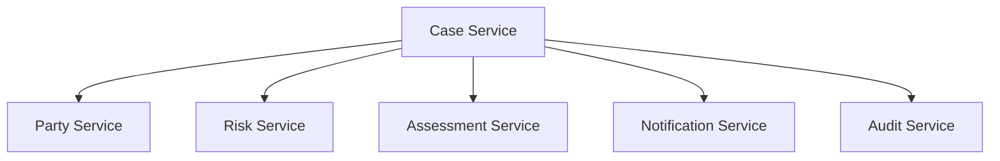
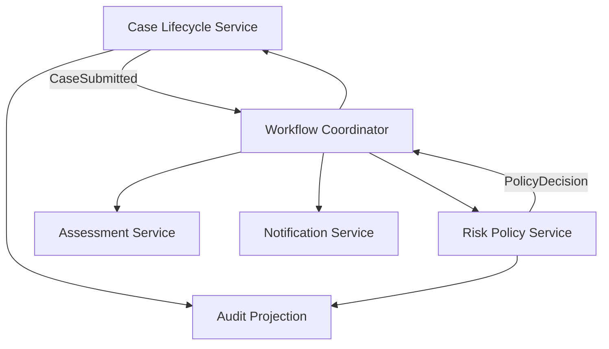

# Part 003 — Architecture for Change, Not for Diagrams

Banyak tim memperlakukan arsitektur sebagai **gambar**.

Mereka membuat diagram service, database, Kafka topic, API gateway, Kubernetes cluster, lalu merasa sistem sudah “terdesain”. Masalahnya: diagram menjelaskan **bentuk**, bukan **kemampuan berubah**. Diagram bisa terlihat rapi bahkan ketika sistemnya sulit diubah, sulit dideploy, sulit dipulihkan, sulit diaudit, dan mudah runtuh karena satu dependency lambat.

Dalam microservices, arsitektur yang baik bukan arsitektur yang paling indah di whiteboard. Arsitektur yang baik adalah arsitektur yang membuat perubahan penting bisa dilakukan dengan **biaya koordinasi, risiko produksi, dan blast radius yang terkendali**.

Dengan kata lain:

> Architecture is not the diagram. Architecture is the set of constraints and feedback loops that shape how the system can safely change.

Bagian ini membangun mental model itu.

---

## 1. Tujuan Part Ini

Setelah bagian ini, kamu harus bisa:

1. Membedakan architecture diagram dari architecture decision.
2. Menjelaskan arsitektur sebagai constraint system.
3. Mengidentifikasi coupling yang tidak terlihat di diagram.
4. Mendesain architecture fitness function sederhana untuk Java microservices.
5. Menulis ADR yang menangkap trade-off, bukan hanya keputusan final.
6. Mengevaluasi apakah sebuah desain memudahkan perubahan atau hanya memindahkan kompleksitas.

Part ini belum membahas service boundary secara mendalam. Itu akan masuk di Part 004. Di sini kita fokus pada fondasi: **bagaimana seorang architect-level engineer memandang arsitektur**.

---

## 2. Diagram Itu Berguna, Tapi Tidak Cukup

Diagram membantu komunikasi. Ia memampatkan banyak informasi menjadi bentuk visual. Diagram bisa menunjukkan:

- service apa saja yang ada;
- siapa memanggil siapa;
- database mana yang dipakai;
- topic/event apa yang menghubungkan service;
- di mana API gateway, message broker, cache, atau workflow engine berada.

Tapi diagram sering menyembunyikan hal yang justru paling menentukan kualitas sistem:

- Apakah service A dan B harus deploy bersamaan?
- Apakah perubahan schema di service B memaksa perubahan code di service A?
- Apakah service C bisa tetap berjalan ketika service D overload?
- Apakah error response antar service punya semantic contract yang stabil?
- Apakah data yang sama ditulis oleh beberapa service?
- Apakah team ownership jelas?
- Apakah incident bisa didiagnosis dari telemetry yang ada?
- Apakah perubahan rule bisnis bisa dilakukan tanpa menyentuh tujuh service?
- Apakah ada jalur audit untuk menjelaskan keputusan sistem enam bulan kemudian?

Diagram menjawab “apa yang terhubung”. Arsitektur harus menjawab “apa konsekuensi dari keterhubungan itu”.

Perhatikan diagram berikut.



Sekilas terlihat seperti microservices yang rapi: ada gateway, dua service, dua database, dan event broker. Namun diagram itu belum menjawab pertanyaan paling penting:

- Apakah `Case Service` boleh langsung menyimpan `party_status` di `case_db`?
- Apakah `Party Service` harus online agar case bisa dibuat?
- Apakah event dari `Party Service` bersifat notification atau state transfer?
- Apakah perubahan status party harus langsung memblokir submission case?
- Apakah API gateway hanya routing, atau mulai mengandung business rule?
- Apakah ada ownership yang berbeda antara case dan party?

Tanpa jawaban itu, diagram hanya peta bentuk. Belum menjadi arsitektur.

---

## 3. Definisi Kerja: Architecture as Constraints

Dalam seri ini, kita akan memakai definisi kerja berikut:

> Arsitektur adalah kumpulan keputusan dan constraint yang sengaja dipilih untuk mengarahkan evolusi sistem dalam kondisi bisnis, teknis, operasional, organisasi, dan risiko tertentu.

Kata pentingnya: **constraint**.

Constraint bukan sekadar larangan. Constraint adalah alat desain. Constraint membuat sistem tidak bergerak sembarangan. Constraint membentuk ruang solusi.

Contoh constraint:

- Service tidak boleh membaca database service lain.
- Semua synchronous outbound call wajib punya timeout eksplisit.
- Event integration tidak boleh membawa data sensitif tertentu.
- Internal API harus backward compatible minimal dua versi minor.
- Service yang memproses keputusan regulator wajib menulis audit event.
- Deployment satu service tidak boleh mensyaratkan deployment service lain.
- Domain layer tidak boleh bergantung pada Spring, JPA, Kafka, atau HTTP.
- Gateway tidak boleh mengandung business decision yang menjadi milik domain service.

Constraint yang baik membuat sistem lebih dapat diprediksi. Constraint yang buruk membuat tim lambat tanpa mengurangi risiko.

Jadi tugas architect bukan membuat aturan sebanyak mungkin. Tugasnya adalah memilih constraint minimum yang menghasilkan properti sistem yang dibutuhkan.

---

## 4. Properti Sistem yang Ingin Dijaga

Microservices tidak otomatis memberikan kualitas. Microservices hanya memberi kamu alat untuk mengejar kualitas tertentu, dengan biaya tambahan berupa distributed complexity.

Properti sistem yang biasanya ingin dijaga:

| Properti | Pertanyaan desain |
|---|---|
| Changeability | Apakah perubahan domain lokal tetap lokal? |
| Independent deployability | Apakah service bisa dirilis tanpa lockstep global? |
| Reliability | Apakah failure satu dependency tidak meruntuhkan seluruh alur? |
| Observability | Apakah perilaku runtime bisa dipahami dari telemetry? |
| Security | Apakah trust boundary eksplisit? |
| Compliance | Apakah keputusan dan data movement bisa dijelaskan? |
| Scalability | Apakah bottleneck bisa diskalakan tanpa memecah sistem sembarangan? |
| Operability | Apakah tim bisa menjalankan service saat incident? |
| Evolvability | Apakah arsitektur bisa berubah tanpa big-bang rewrite? |

Setiap keputusan microservices harus dikaitkan dengan properti yang ingin dijaga. Tanpa itu, pattern menjadi cargo cult.

Contoh:

- “Kita pakai event-driven architecture.”
  - Properti apa yang ingin dijaga?
  - Mengurangi temporal coupling?
  - Meningkatkan throughput?
  - Memisahkan lifecycle?
  - Mendukung audit trail?
  - Atau hanya karena terlihat modern?

- “Kita pisahkan Payment Service dari Order Service.”
  - Apakah karena ownership berbeda?
  - Karena scaling profile berbeda?
  - Karena consistency rule berbeda?
  - Karena vendor/payment integration volatile?
  - Atau hanya karena `Payment` adalah noun berbeda?

Architect-level thinking dimulai ketika kamu selalu bertanya: **property apa yang kita beli, dan cost apa yang kita bayar?**

---

## 5. Architecture Decision Bukan Selalu Best Practice

Kalimat “best practice” sering menipu. Dalam arsitektur, hampir semua keputusan serius adalah trade-off.

Contoh:

| Keputusan | Membantu | Membayar biaya |
|---|---|---|
| Split service | Ownership, deployability, failure isolation | Network latency, consistency complexity, observability cost |
| Async messaging | Temporal decoupling, throughput smoothing | Eventual consistency, ordering, replay, deduplication |
| API gateway | Central edge policy, routing, client simplification | Bottleneck governance, god-gateway risk |
| Service mesh | mTLS, traffic policy, telemetry | Operational complexity, debugging layer tambahan |
| Saga | Cross-service business transaction | Compensation complexity, state visibility, edge cases |
| CQRS | Query scalability, model separation | Projection lag, duplicated model, operational overhead |
| Multi-region active-active | Availability, locality | Conflict resolution, data replication complexity, cost |

Tidak ada keputusan yang gratis.

Karena itu, arsitektur yang matang tidak hanya berkata:

> Kita pakai pattern X.

Tapi:

> Kita memilih pattern X karena constraint A, B, C. Kita menerima cost D dan E. Kita menolak alternatif Y karena risiko F. Jika kondisi berubah, keputusan ini perlu ditinjau ulang.

Itulah bedanya template architecture dengan engineering decision.

---

## 6. Architecture as Feedback Loop

Arsitektur bukan dokumen satu kali. Arsitektur adalah feedback loop antara intent, implementation, runtime, dan learning.



Penjelasan:

1. Business/regulatory intent menciptakan kebutuhan.
2. Architect menerjemahkan kebutuhan itu menjadi keputusan dan constraint.
3. Constraint diwujudkan dalam code, pipeline, contract, topology, dan platform.
4. Sistem berjalan di production dan memperlihatkan perilaku nyata.
5. Telemetry, incident, customer feedback, dan audit review memberi sinyal.
6. Keputusan ditinjau ulang.

Jika arsitektur berhenti di diagram, loop ini putus.

Jika arsitektur masuk ke pipeline, observability, dan review, loop ini hidup.

---

## 7. Coupling yang Tidak Terlihat di Diagram

Microservices sering gagal karena tim hanya melihat coupling teknis yang kasat mata. Padahal coupling yang lebih berbahaya sering tersembunyi.

### 7.1 Deployment Coupling

Deployment coupling terjadi ketika service harus dirilis bersama agar sistem tetap benar.

Contoh:

- `Case Service` menambahkan field wajib baru di request ke `Assessment Service`.
- `Assessment Service` belum support field itu.
- Release harus dikoordinasikan.
- Jika urutan deploy salah, alur produksi rusak.

Smell:

- Release service A selalu menunggu service B.
- Banyak “coordination meeting” sebelum deployment.
- Rollback satu service memaksa rollback service lain.
- Ada “release train” karena semua service saling menunggu.

Mitigasi:

- additive change;
- tolerant reader;
- contract testing;
- expand-contract migration;
- version compatibility window;
- feature flags untuk behavior baru.

### 7.2 Data Coupling

Data coupling terjadi ketika beberapa service bergantung pada struktur data internal yang sama.

Contoh buruk:

```text
case-service  ---> case_db.cases
report-service ---> case_db.cases
audit-service  ---> case_db.cases
```

Di diagram, ini mungkin terlihat efisien. Di production, ini membuat schema change menjadi perubahan global.

Mitigasi:

- database ownership per service;
- published read model;
- event-carried state transfer;
- reporting pipeline;
- API/query model eksplisit;
- anti-corruption layer.

### 7.3 Temporal Coupling

Temporal coupling terjadi ketika dua komponen harus tersedia pada saat yang sama agar alur selesai.

Request-response selalu memiliki temporal coupling. Itu bukan salah. Yang salah adalah memakai synchronous call untuk alur yang sebenarnya tidak membutuhkan jawaban langsung.

Contoh:

- Submit case harus langsung membuat audit log durable.
- Tapi submit case tidak harus menunggu notification terkirim.

Maka audit write mungkin wajib berada dalam transaction/outbox lokal, sedangkan notification bisa async.

### 7.4 Semantic Coupling

Semantic coupling terjadi ketika service bergantung pada makna internal service lain, bukan hanya kontrak eksplisitnya.

Contoh:

```java
if (partyStatus.equals("A") || partyStatus.equals("PENDING_2")) {
    allowEscalation();
}
```

Kode ini tampak sederhana, tetapi `Case Service` sekarang memahami kode status internal `Party Service`. Jika `Party Service` mengubah state machine-nya, `Case Service` ikut rusak secara semantic.

Mitigasi:

- expose capability-oriented API;
- gunakan domain vocabulary publik;
- hindari leak enum internal;
- translate via ACL;
- publish business meaning, bukan storage/state code mentah.

### 7.5 Operational Coupling

Operational coupling terjadi ketika incident satu service membuat tim lain tidak bisa operate dengan jelas.

Smell:

- Tidak jelas siapa owner alert.
- Dashboard service A butuh login ke dashboard service B untuk diagnosis dasar.
- Error message service A hanya berkata “downstream failed”.
- Runbook selalu mengarah ke “ask team X”.

Mitigasi:

- service ownership eksplisit;
- dependency dashboard;
- runbook per failure mode;
- SLO per service;
- correlation ID dan distributed tracing.

### 7.6 Organizational Coupling

Conway’s Law bukan kutipan dekoratif. Struktur komunikasi tim sering muncul sebagai struktur sistem.

Jika tiga tim harus approval untuk perubahan kecil, jangan berharap microservice menjadi independen hanya karena repository dipisah.

Smell:

- Service owner di atas kertas ada, tetapi approval tetap terpusat.
- Platform constraint membuat perubahan sederhana harus melewati banyak gate manual.
- Satu tim mengontrol shared library yang dipakai semua service dan sering breaking.

Mitigasi:

- ownership boundary nyata;
- golden path yang self-service;
- platform guardrail otomatis;
- shared library yang minimal dan stabil;
- keputusan lokal untuk domain lokal.

---

## 8. Constraint Taxonomy untuk Java Microservices

Agar arsitektur tidak abstrak, kita perlu mengklasifikasikan constraint yang biasanya dipakai di Java microservices.

### 8.1 Structural Constraint

Mengatur bentuk code dan dependency.

Contoh:

- Domain package tidak boleh depend ke Spring MVC.
- Application layer tidak boleh import adapter implementation.
- Adapter boleh depend ke external library.
- Shared kernel hanya boleh berisi primitive/common value type yang stabil.

Contoh struktur:

```text
com.example.casecontext
├── domain
│   ├── model
│   ├── policy
│   └── event
├── application
│   ├── command
│   ├── query
│   └── port
├── adapter
│   ├── inbound
│   │   ├── rest
│   │   └── messaging
│   └── outbound
│       ├── persistence
│       ├── messaging
│       └── client
└── bootstrap
```

Structural constraint menjaga dependency direction.

### 8.2 Runtime Constraint

Mengatur perilaku ketika service berjalan.

Contoh:

- Semua outbound HTTP call wajib punya connect timeout dan read timeout.
- Semua Kafka consumer harus idempotent.
- Semua job harus safe untuk retry.
- Graceful shutdown harus menyelesaikan request aktif dalam batas waktu tertentu.
- Service tidak boleh menerima traffic sebelum readiness check valid.

### 8.3 Integration Constraint

Mengatur cara service berkomunikasi.

Contoh:

- Request-response hanya untuk kebutuhan immediate decision.
- Event digunakan untuk state change yang downstream tidak perlu memblokir upstream.
- Public event schema harus additive-compatible.
- Error contract harus stabil.
- Correlation ID wajib dipropagasi.

### 8.4 Data Constraint

Mengatur authority dan akses data.

Contoh:

- Service tidak boleh menulis database service lain.
- Read model lintas service harus dipublikasikan, bukan query langsung ke database private.
- Data sensitif tidak boleh masuk event publik tanpa classification.
- Audit event tidak boleh mutable.

### 8.5 Operational Constraint

Mengatur cara service dioperasikan.

Contoh:

- Setiap service wajib punya dashboard minimal: traffic, error, latency, saturation.
- Setiap alert harus punya runbook.
- Setiap service wajib expose build version dan dependency health.
- Setiap dependency kritikal harus terlihat di topology view.

### 8.6 Governance Constraint

Mengatur keputusan yang perlu traceability.

Contoh:

- Setiap boundary decision harus punya ADR.
- Setiap breaking API change harus punya migration plan.
- Setiap service baru harus punya owner dan retirement criteria.
- Setiap data-sharing path harus punya privacy classification.

Constraint taxonomy membantu kita membahas arsitektur secara konkret, bukan normatif.

---

## 9. Fitness Function: Architecture yang Bisa Diuji

Istilah **fitness function** dari evolutionary architecture berguna karena memindahkan arsitektur dari opini menjadi sinyal yang bisa diperiksa.

Fitness function adalah mekanisme yang mengukur apakah sistem masih memenuhi properti arsitektur yang diinginkan.

Contoh sederhana:

> Domain layer tidak boleh depend ke Spring framework.

Ini bukan hanya aturan di dokumen. Ini bisa diuji.

Contoh dengan ArchUnit:

```java
package com.example.casecontext.arch;

import com.tngtech.archunit.core.importer.ImportOption;
import com.tngtech.archunit.junit.AnalyzeClasses;
import com.tngtech.archunit.junit.ArchTest;
import com.tngtech.archunit.lang.ArchRule;

import static com.tngtech.archunit.lang.syntax.ArchRuleDefinition.noClasses;

@AnalyzeClasses(
    packages = "com.example.casecontext",
    importOptions = ImportOption.DoNotIncludeTests.class
)
class ArchitectureRulesTest {

    @ArchTest
    static final ArchRule domain_must_not_depend_on_spring =
        noClasses()
            .that()
            .resideInAPackage("..domain..")
            .should()
            .dependOnClassesThat()
            .resideInAnyPackage(
                "org.springframework..",
                "jakarta.persistence..",
                "com.fasterxml.jackson.."
            );
}
```

Aturan itu sederhana, tapi efeknya besar: domain model tidak diam-diam berubah menjadi model framework.

Contoh lain:

### 9.1 Fitness Function untuk API Compatibility

```text
Given previous OpenAPI contract
When current contract is compared
Then all existing response fields remain compatible
And removed endpoints must be explicitly approved
```

### 9.2 Fitness Function untuk Observability

```text
Every production service must expose:
- request rate
- error rate
- latency percentile
- JVM memory
- thread usage
- outbound dependency latency
- build version
```

### 9.3 Fitness Function untuk Reliability

```text
Every outbound client must define:
- timeout
- retry policy, or explicit no-retry decision
- circuit breaker, or explicit no-circuit-breaker decision
- metric tags for dependency and operation
```

### 9.4 Fitness Function untuk Data Ownership

```text
No service is allowed to connect to another service's private database schema.
```

Sebagian bisa otomatis. Sebagian perlu review. Yang penting: arsitektur punya feedback loop.

---

## 10. Dari Rule ke Guardrail

Ada dua cara menerapkan constraint:

1. **Gatekeeping**: semua harus minta izin architect.
2. **Guardrail**: sistem membantu tim tetap berada di jalur aman.

Microservices yang sehat butuh guardrail lebih banyak daripada gatekeeping.

Gatekeeping membuat architect menjadi bottleneck. Guardrail membuat keputusan arsitektur bisa dijalankan secara konsisten oleh banyak tim.

Contoh guardrail:

- service template dengan logging/tracing/health check default;
- CI check untuk contract compatibility;
- library HTTP client internal yang memaksa timeout eksplisit;
- platform deployment template dengan readiness/liveness probe;
- scaffold ADR dalam repository;
- dependency dashboard otomatis;
- OpenTelemetry auto-instrumentation baseline;
- policy-as-code untuk deployment rule.

Architecture governance yang baik tidak berkata:

> Kirim semua desain ke architecture board.

Ia berkata:

> Untuk keputusan standar, gunakan golden path. Untuk keputusan yang keluar dari envelope, tulis ADR dan review risiko.

---

## 11. Architecture Decision Record: Menangkap Alasan, Bukan Hanya Hasil

ADR adalah cara ringan untuk mencatat keputusan arsitektur.

ADR yang buruk hanya berkata:

```text
Decision: Use Kafka.
```

Itu tidak cukup. Enam bulan kemudian, tidak ada yang tahu mengapa Kafka dipilih, alternatif apa yang ditolak, dan kapan keputusan itu perlu ditinjau.

ADR yang berguna menangkap konteks.

```md
# ADR-014 — Use Async Event Publication for Case Status Changes

## Status
Accepted

## Context
Case status changes are consumed by notification, audit projection,
reporting, and risk scoring. These consumers do not need to block the
case transition command. Synchronous fan-out increases latency and makes
case submission depend on non-critical downstream availability.

## Decision
Case Service will publish `CaseStatusChanged` integration events using
transactional outbox. Downstream services consume events asynchronously.
The command response returns after the case state and outbox record are
committed locally.

## Consequences
Positive:
- Case transition is not blocked by notification/reporting downtime.
- New consumers can be added without changing Case Service command flow.
- Event stream becomes a source for audit projection.

Negative:
- Downstream read models are eventually consistent.
- Consumers must be idempotent.
- Operational support must monitor outbox lag and consumer lag.

## Alternatives Considered
1. Synchronous calls to every consumer.
   Rejected due to fan-out latency and cascading failure risk.
2. Direct database access by reporting.
   Rejected due to schema coupling and data ownership violation.
3. CDC from case database.
   Deferred because domain event semantics are more explicit for now.

## Review Trigger
Review if event throughput exceeds current broker capacity, or if
regulatory audit requires stricter ordering semantics.
```

Perhatikan pola ADR ini:

- Ada konteks.
- Ada keputusan.
- Ada konsekuensi positif dan negatif.
- Ada alternatif yang ditolak.
- Ada trigger untuk review.

Keputusan yang tidak punya konsekuensi negatif biasanya belum dipikirkan cukup serius.

---

## 12. Architecture Decision Lifecycle

Keputusan arsitektur bukan abadi. Ia punya lifecycle.



Setiap keputusan besar sebaiknya punya:

- owner;
- tanggal;
- konteks;
- alternatives;
- expected properties;
- known risks;
- review trigger.

Tanpa lifecycle, arsitektur berubah menjadi fosil. Sistem tetap hidup, tapi keputusan lama tidak pernah diuji ulang.

---

## 13. Example: “Architecture for Change” dalam Regulatory Case Management

Bayangkan sistem case management untuk enforcement lifecycle.

Requirement awal:

> Officer dapat membuat case, menambahkan allegation, mengunggah evidence metadata, lalu submit untuk assessment.

Enam bulan kemudian, requirement berubah:

> Jika party punya active sanction di yurisdiksi lain, case harus otomatis masuk enhanced review sebelum assessment normal.

Jika arsitektur hanya diagram CRUD, perubahan ini tampak sederhana:

- tambah field `enhancedReviewRequired`;
- tambah endpoint check sanction;
- panggil dari `Case Service`.

Tapi architect-level engineer bertanya lebih dalam:

1. Siapa owner policy “enhanced review required”?
2. Apakah sanction data authoritative di internal system atau external regulator?
3. Apakah check harus synchronous saat submit?
4. Apa yang terjadi jika sanction system timeout?
5. Apakah officer harus melihat status “pending external check”?
6. Apakah keputusan enhanced review harus audit-able?
7. Apakah policy bisa berubah tanpa redeploy Case Service?
8. Apakah existing cases harus dire-evaluate?
9. Apakah downstream assessment service memahami enhanced review sebagai state atau queue?

Jika keputusan arsitektur sebelumnya adalah:

- `Case Service` owns case lifecycle.
- `Risk Policy Service` owns cross-party risk policy.
- Case submission writes durable case state and emits `CaseSubmitted`.
- Risk evaluation can be async but must produce audit decision.
- Assessment starts only after case reaches `READY_FOR_ASSESSMENT`.

Maka perubahan bisa dilakukan dengan menambah policy evaluation flow tanpa merusak domain utama.



Di sini arsitektur membantu perubahan karena boundary-nya memisahkan:

- lifecycle case;
- risk policy decision;
- assessment execution;
- audit projection.

Jika semua rule ditaruh di `CaseService.submit()`, perubahan tetap bisa dilakukan, tapi biaya evolusinya meningkat. Setiap policy baru menambah kompleksitas pusat.

---

## 14. Java Implementation Implication

Architecture for change harus terlihat dalam struktur Java, bukan hanya dokumen.

Contoh buruk:

```java
@RestController
class CaseController {

    private final JdbcTemplate jdbc;
    private final RestTemplate restTemplate;
    private final KafkaTemplate<String, Object> kafka;

    @PostMapping("/cases/{id}/submit")
    ResponseEntity<?> submit(@PathVariable String id) {
        var caseRow = jdbc.queryForMap("select * from cases where id = ?", id);

        var partyId = (String) caseRow.get("party_id");
        var sanction = restTemplate.getForObject(
            "http://party-service/parties/" + partyId + "/sanction-status",
            SanctionDto.class
        );

        if (sanction.active()) {
            jdbc.update("update cases set status = 'ENHANCED_REVIEW' where id = ?", id);
        } else {
            jdbc.update("update cases set status = 'READY_FOR_ASSESSMENT' where id = ?", id);
        }

        kafka.send("case-events", new CaseSubmitted(id));
        return ResponseEntity.accepted().build();
    }
}
```

Masalahnya bukan karena kode ini pendek. Masalahnya:

- controller mengandung domain decision;
- SQL, HTTP, Kafka, dan business policy bercampur;
- tidak ada boundary antara use case dan infrastructure;
- remote call terjadi di tengah command tanpa timeout/decision model eksplisit;
- auditability lemah;
- sulit mengubah policy tanpa menyentuh endpoint;
- test cenderung menjadi integration-heavy.

Versi lebih sehat:

```java
final class SubmitCaseHandler {

    private final CaseRepository cases;
    private final CaseSubmissionPolicy submissionPolicy;
    private final DomainEventPublisher events;

    SubmitCaseHandler(
        CaseRepository cases,
        CaseSubmissionPolicy submissionPolicy,
        DomainEventPublisher events
    ) {
        this.cases = cases;
        this.submissionPolicy = submissionPolicy;
        this.events = events;
    }

    SubmitCaseResult handle(SubmitCase command) {
        CaseRecord caseRecord = cases.get(command.caseId());

        SubmissionDecision decision = submissionPolicy.evaluate(caseRecord);
        caseRecord.apply(decision);

        cases.save(caseRecord);
        events.publishAll(caseRecord.pullDomainEvents());

        return SubmitCaseResult.from(caseRecord.currentStatus());
    }
}
```

Ini belum sempurna. Detail outbox, transaction, idempotency, dan event publishing akan dibahas nanti. Tetapi struktur ini menunjukkan intent arsitektur:

- use case ada di application layer;
- domain decision tidak tersebar di controller;
- repository dan event publisher adalah port;
- infrastructure bisa diganti tanpa mengubah use case;
- policy bisa dipecah lebih lanjut ketika boundary bisnis matang.

Arsitektur yang baik terlihat dari dependency direction dan seam yang disediakan untuk perubahan.

---

## 15. Decision Pressure: Apa yang Membuat Arsitektur Berubah?

Sistem berubah karena tekanan. Architect harus peka terhadap pressure berikut:

### 15.1 Business Volatility

Bagian domain yang sering berubah perlu boundary lebih hati-hati.

Contoh:

- eligibility policy;
- risk scoring;
- escalation rule;
- notification template;
- regional compliance rule.

Jika bagian volatile dicampur dengan bagian stabil, perubahan kecil menjadi risky.

### 15.2 Scale Pressure

Bagian sistem punya scaling profile berbeda.

Contoh:

- `Case Intake` lebih banyak write saat campaign/reporting period.
- `Search` lebih banyak read dan query kompleks.
- `Notification` bursty.
- `Audit Projection` append-heavy.

Scale pressure bisa membenarkan pemisahan service atau model. Tapi scale saja tidak selalu berarti service baru; bisa juga cukup cache, read replica, partitioning, atau async worker.

### 15.3 Reliability Pressure

Jika satu dependency sering gagal, arsitektur harus mengisolasi dampaknya.

Contoh:

- External sanction API lambat.
- Notification provider rate-limited.
- Document scanning service CPU-heavy.

Solusi mungkin:

- async boundary;
- circuit breaker;
- queue;
- fallback;
- degraded mode;
- separate worker pool.

### 15.4 Compliance Pressure

Regulatory system sering butuh traceability.

Pertanyaan:

- Siapa membuat keputusan?
- Berdasarkan data apa?
- Versi rule mana yang digunakan?
- Apakah data berubah setelah keputusan?
- Apakah keputusan bisa direkonstruksi?

Jika compliance pressure tinggi, architecture harus memasukkan auditability sejak awal. Audit bukan add-on logging di akhir.

### 15.5 Team Pressure

Jika banyak tim mengubah codebase yang sama dan saling menunggu, mungkin boundary perlu diperbaiki.

Tapi hati-hati: memecah service tanpa memperbaiki ownership hanya memindahkan koordinasi dari codebase ke network.

---

## 16. Architecture Smells

Berikut smell yang menunjukkan arsitektur lebih fokus ke diagram daripada perubahan.

### 16.1 Diagram Looks Clean, Release Is Painful

Jika diagram microservices rapi tetapi release tetap lockstep, problemnya bukan drawing. Problemnya coupling.

Cari:

- breaking contract;
- shared schema;
- shared library yang tidak stabil;
- feature yang menyentuh banyak service;
- environment promotion yang saling menunggu.

### 16.2 Every Change Needs a Meeting

Meeting bukan selalu buruk. Tapi jika perubahan lokal selalu butuh koordinasi banyak tim, boundary tidak sesuai ownership.

### 16.3 Architecture Rules Live Only in Wiki

Jika aturan penting hanya ada di Confluence/Notion, aturan itu akan dilanggar.

Aturan kritikal harus masuk ke:

- code review checklist;
- CI;
- template service;
- platform default;
- runtime dashboard;
- security policy;
- architecture tests.

### 16.4 Pattern Before Problem

Contoh:

- “Kita butuh saga.”
- “Kenapa?”
- “Karena microservices.”

Ini tanda pattern-driven thinking. Seharusnya:

- Apa business transaction-nya?
- Apa consistency requirement-nya?
- Apa failure mode-nya?
- Apa compensation semantics-nya?
- Apa user experience saat pending?

### 16.5 God Gateway

Gateway mulai mengandung business rule karena “lebih gampang taruh di depan”.

Awalnya hanya routing. Lalu validasi. Lalu policy. Lalu orchestration. Lalu transformasi domain. Akhirnya gateway menjadi monolith baru.

### 16.6 Shared Utility Library as Hidden Platform

Shared library dipakai semua service. Lalu library berubah. Semua service harus upgrade. Microservices kehilangan independensi.

Shared library boleh ada, tapi harus sangat stabil dan minimal. Untuk behavior yang volatile, lebih baik gunakan service, platform capability, atau copy kecil yang lokal daripada coupling global.

---

## 17. Practical Design Method: Change Scenario First

Cara efektif mengevaluasi arsitektur bukan bertanya “apakah diagramnya bagus?”, melainkan menjalankan change scenario.

Template:

```text
Given current architecture
When business change X happens
Then which services, data models, APIs, events, dashboards, and teams must change?
And what is the deployment order?
And what can fail during migration?
And how do we know production is safe?
```

Contoh scenario:

```text
When enhanced review policy changes from static rule to configurable regional policy,
which components must change?
```

Jawaban ideal bukan “tidak ada yang berubah”. Itu tidak realistis. Jawaban ideal adalah:

- perubahan terlokalisasi;
- dependency jelas;
- contract tetap backward compatible;
- data migration terkendali;
- deployment bisa bertahap;
- rollback/roll-forward jelas;
- telemetry menunjukkan state transisi.

---

## 18. Mini Case: Evaluasi Dua Desain

### Desain A — Central Case Service



Semua keputusan dimulai dari `Case Service`.

Kelebihan:

- alur mudah dilihat di satu tempat;
- debugging awal lebih sederhana;
- consistency dapat dikelola lebih langsung.

Kelemahan:

- `Case Service` menjadi orchestrator semua hal;
- setiap downstream volatility masuk ke Case Service;
- fan-out sync risk tinggi jika tidak hati-hati;
- tim Case menjadi bottleneck.

Cocok jika:

- domain masih kecil;
- tim masih satu;
- process belum stabil;
- volume rendah;
- regulatory complexity belum tinggi.

### Desain B — Case Lifecycle + Policy + Workflow



Kelebihan:

- policy volatility lebih terpisah;
- workflow state lebih terlihat;
- audit decision bisa lebih eksplisit;
- Case Service tidak menjadi tempat semua rule.

Kelemahan:

- lebih banyak moving parts;
- butuh observability lebih matang;
- consistency dan timeout lebih kompleks;
- onboarding engineer lebih berat.

Cocok jika:

- process panjang;
- ada human task;
- ada SLA/escalation;
- policy sering berubah;
- auditability penting;
- beberapa tim punya ownership berbeda.

Kesimpulan: tidak ada pemenang universal. Yang benar tergantung pressure.

---

## 19. Architecture Review Questions

Saat meninjau desain microservices, gunakan pertanyaan berikut.

### 19.1 Changeability

- Perubahan rule bisnis paling mungkin terjadi di mana?
- Apakah perubahan itu lokal atau menyentuh banyak service?
- Apakah ada service yang menjadi tempat semua perubahan?
- Apakah dependency direction membuat perubahan domain bocor ke infrastructure?

### 19.2 Deployability

- Apakah service bisa deploy independen?
- Apa deployment order jika contract berubah?
- Apakah ada compatibility window?
- Apakah rollback satu service aman?

### 19.3 Data and Consistency

- Siapa owner setiap data penting?
- Apakah ada shared database?
- Apa consistency expectation user?
- Apakah eventual consistency dijelaskan sebagai business behavior?

### 19.4 Failure

- Apa yang terjadi jika dependency timeout?
- Apakah retry memperburuk overload?
- Apakah ada fallback/degraded mode?
- Apakah failure satu consumer memblokir publisher?

### 19.5 Observability

- Bisakah request dilacak end-to-end?
- Apakah event punya correlation ID?
- Apakah dashboard menunjukkan saturation?
- Apakah alert punya runbook?

### 19.6 Compliance

- Apakah keputusan penting bisa direkonstruksi?
- Apakah audit event immutable?
- Apakah PII tidak bocor ke log/event?
- Apakah data lineage jelas?

---

## 20. Prinsip Praktis

Pegang prinsip berikut sepanjang seri:

1. **Architecture is about change cost.**
   Jika desain tidak mengubah biaya perubahan, itu hanya dekorasi.

2. **Every dependency is a liability and an asset.**
   Dependency memberi kemampuan, tetapi membawa coupling.

3. **Local simplicity can create global complexity.**
   Endpoint cepat dibuat bisa menciptakan coupling bertahun-tahun.

4. **A service boundary is a promise.**
   Ia menjanjikan ownership, contract, data authority, dan operational responsibility.

5. **A decision without a review trigger becomes technical debt.**
   Sistem berubah. Keputusan juga harus bisa berubah.

6. **Architecture must be encoded.**
   Aturan penting harus muncul di code, pipeline, platform, observability, atau review ritual.

7. **Do not optimize for diagram elegance.**
   Optimalkan untuk safe change, safe failure, dan clear ownership.

---

## 21. Latihan

Gunakan sistem microservices yang pernah kamu lihat atau bayangkan. Jawab pertanyaan berikut.

### Latihan 1 — Coupling Inventory

Pilih dua service yang sering berubah bersama. Identifikasi coupling berikut:

- deployment coupling;
- data coupling;
- temporal coupling;
- semantic coupling;
- operational coupling;
- organizational coupling.

Tulis mana yang paling mahal dan kenapa.

### Latihan 2 — Change Scenario

Ambil satu requirement baru:

```text
A new regional policy requires additional approval before a case can be escalated.
```

Jawab:

- Service mana yang berubah?
- API/event mana yang berubah?
- Data apa yang perlu dimiliki siapa?
- Deployment order-nya apa?
- Failure mode-nya apa?
- Telemetry apa yang membuktikan rollout aman?

### Latihan 3 — ADR Mini

Tulis ADR singkat untuk keputusan:

```text
Use asynchronous event publication for downstream notification after case submission.
```

Wajib berisi:

- context;
- decision;
- positive consequences;
- negative consequences;
- rejected alternatives;
- review trigger.

---

## 22. Ringkasan

Architecture for change berarti melihat microservices sebagai sistem constraint, bukan koleksi service.

Diagram tetap berguna, tetapi diagram bukan arsitektur. Arsitektur yang matang menjawab:

- perubahan apa yang mudah atau sulit;
- failure apa yang terisolasi atau menyebar;
- data siapa yang authoritative;
- dependency mana yang berbahaya;
- decision mana yang reversible;
- constraint mana yang perlu dijaga otomatis;
- telemetry apa yang membuktikan sistem berjalan sesuai intent.

Di Part 004, kita akan masuk ke salah satu keputusan paling penting dalam microservices: **service boundary sebagai business boundary**. Karena jika boundary salah, semua pattern lain hanya menjadi tambalan mahal.

---

## Referensi

- Martin Fowler — Microservices: https://martinfowler.com/articles/microservices.html
- Martin Fowler — Bounded Context: https://martinfowler.com/bliki/BoundedContext.html
- Neal Ford, Rebecca Parsons, Patrick Kua — Building Evolutionary Architectures: https://www.thoughtworks.com/insights/books/building-evolutionary-architectures-second-edition
- AWS Well-Architected Framework: https://docs.aws.amazon.com/wellarchitected/latest/framework/welcome.html
- Google SRE Book — Addressing Cascading Failures: https://sre.google/sre-book/addressing-cascading-failures/
