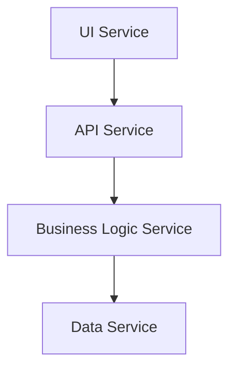
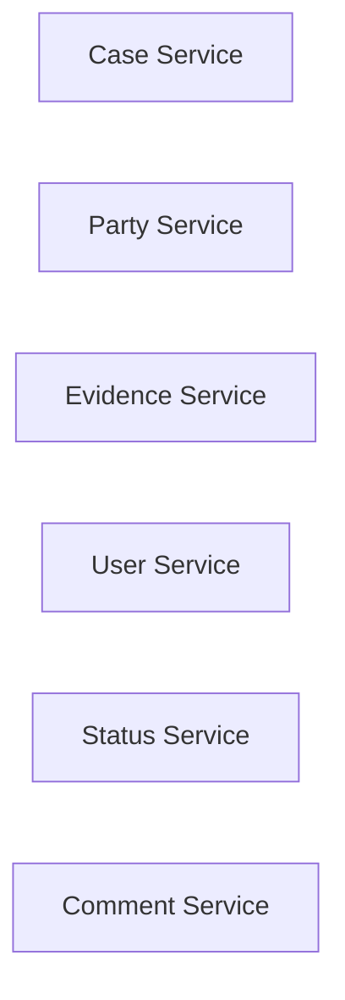
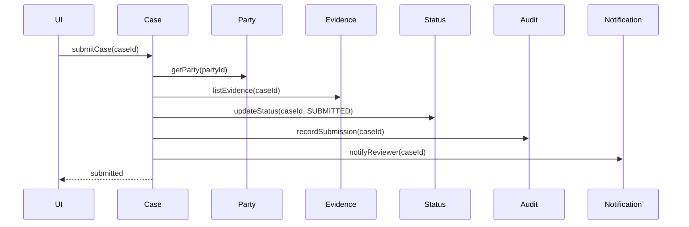
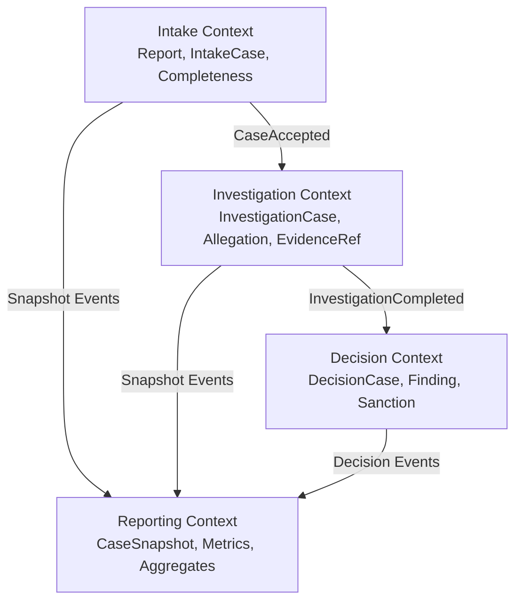
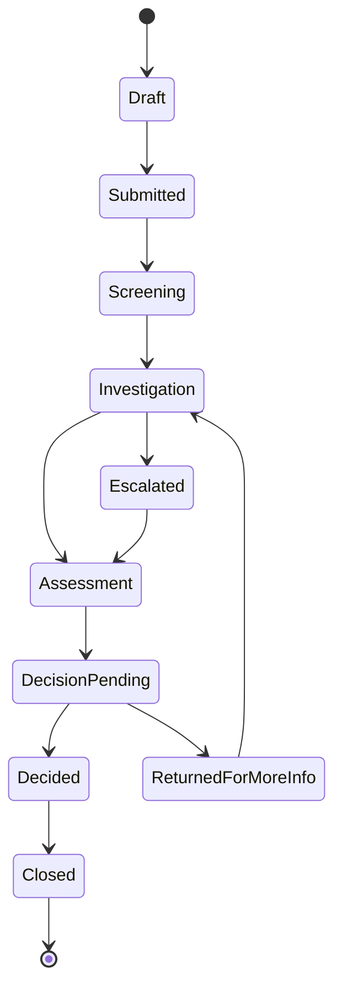
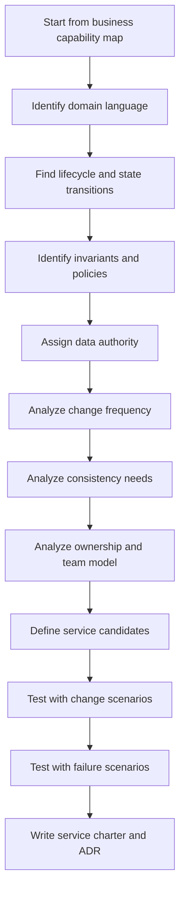
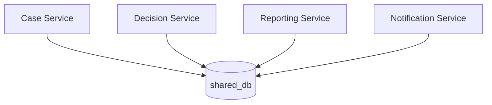
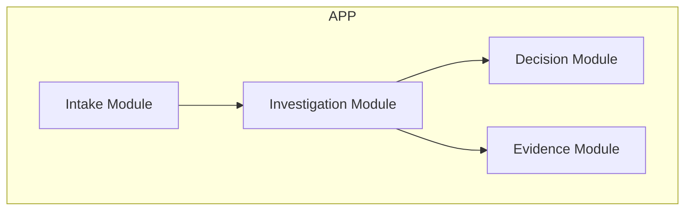
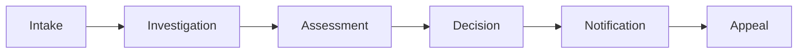

# Part 004 — Service Boundary as Business Boundary

Jika Part 003 membahas arsitektur sebagai constraint untuk perubahan, Part 004 membahas keputusan yang paling menentukan biaya perubahan dalam microservices:

> Di mana service boundary diletakkan?

Service boundary yang salah membuat sistem mahal bahkan ketika teknologinya benar. Kamu bisa memakai Spring Boot terbaru, Kafka, Kubernetes, OpenTelemetry, service mesh, dan CI/CD yang rapi, tetapi jika boundary salah, sistem tetap menjadi distributed monolith.

Boundary bukan garis di diagram. Boundary adalah **kontrak kepemilikan**.

Ia menentukan:

- siapa boleh mengubah apa;
- siapa authoritative atas data apa;
- siapa menjaga invariant apa;
- siapa bertanggung jawab ketika production gagal;
- siapa memutuskan policy apa;
- perubahan mana yang lokal dan mana yang perlu koordinasi;
- failure mana yang harus diisolasi;
- audit trail mana yang harus bisa direkonstruksi.

Dalam microservices, service boundary harus dekat dengan business boundary. Bukan technical layer. Bukan tabel. Bukan CRUD noun. Bukan endpoint grouping.

---

## 1. Tujuan Part Ini

Setelah bagian ini, kamu harus bisa:

1. Menjelaskan kenapa decomposition by entity sering menghasilkan distributed monolith.
2. Membedakan business capability, bounded context, business process, dan technical component.
3. Menggunakan beberapa dimensi untuk mengevaluasi service boundary.
4. Membuat service charter yang menjelaskan purpose, owner, data authority, dan contract.
5. Menganalisis boundary dalam domain regulatory case management.
6. Mengenali smell boundary yang buruk sebelum menjadi masalah produksi.

Part ini bukan pengantar DDD umum. Kita memakai konsep DDD secara praktis untuk keputusan microservices.

---

## 2. Kesalahan Umum: Boundary Berdasarkan Technical Layer

Decomposition paling naif adalah memecah sistem berdasarkan layer:



Ini bukan microservices. Ini distributed layered architecture.

Masalahnya:

- setiap feature melewati semua service;
- perubahan business rule menyentuh `API Service`, `Business Logic Service`, dan `Data Service`;
- deployment independen hampir tidak ada;
- latency meningkat tanpa ownership yang lebih jelas;
- `Data Service` menjadi bottleneck semua domain;
- domain language tidak punya boundary.

Layering berguna di dalam service. Tetapi layer bukan service boundary yang baik.

Boundary microservices seharusnya memisahkan business capability, bukan memindahkan MVC ke network.

---

## 3. Kesalahan Umum: Boundary Berdasarkan CRUD Entity

Kesalahan kedua adalah memecah berdasarkan noun/entity:



Sekilas terlihat masuk akal. Domain punya entity `Case`, `Party`, `Evidence`, `User`, `Status`, `Comment`. Maka masing-masing menjadi service.

Masalahnya: business behavior jarang berhenti di satu entity.

Contoh use case:

> Submit enforcement case for assessment.

Alur ini mungkin butuh:

- case status;
- party eligibility;
- allegation completeness;
- evidence metadata;
- officer authorization;
- workflow state;
- audit event;
- SLA timer;
- notification.

Jika setiap entity menjadi service kecil, satu use case menjadi distributed transaction by accident.



Masalah yang muncul:

- latency fan-out;
- partial failure di tengah use case;
- retry sulit aman;
- transaction boundary kabur;
- setiap service menyimpan potongan rule;
- debugging susah;
- perubahan business flow menyentuh semua service.

Entity penting untuk modeling. Tapi entity bukan otomatis service.

Rule praktis:

> Jika service hanya CRUD wrapper di atas tabel, kemungkinan besar boundary-nya terlalu teknis.

---

## 4. Business Capability: Unit Kemampuan, Bukan Unit Data

Business capability adalah kemampuan organisasi untuk menghasilkan outcome bisnis tertentu.

Contoh dalam regulatory case management:

- menerima laporan/pengaduan;
- membuat case;
- mengelola allegation;
- mengelola evidence lifecycle;
- melakukan risk assessment;
- membuat enforcement decision;
- mengelola escalation;
- mencatat audit trail;
- mengirim regulatory notification;
- menghasilkan management reporting;
- menangani appeal/review.

Capability bukan sekadar data. Capability mengandung:

- purpose;
- policy;
- workflow;
- decision;
- owner;
- data yang dibutuhkan;
- output yang dihasilkan;
- SLA;
- failure expectation;
- audit requirement.

Contoh:

`Evidence Management` bukan hanya tabel `evidence`.

Ia bisa mencakup:

- evidence metadata;
- upload initiation;
- virus scanning status;
- chain of custody;
- retention policy;
- access policy;
- redaction status;
- admissibility marker;
- evidence event history.

Jika kamu membuat `Evidence Service` hanya karena ada tabel `evidence`, boundary-nya dangkal. Jika kamu membuat service karena ada capability evidence lifecycle dengan policy dan ownership jelas, boundary-nya mulai masuk akal.

---

## 5. Bounded Context: Boundary Makna

Business capability menjawab “organisasi melakukan apa”. Bounded context menjawab “model dan bahasa apa yang valid di area ini”.

Dalam domain besar, kata yang sama bisa punya makna berbeda.

Contoh `case`:

| Context | Makna `case` |
|---|---|
| Intake | laporan yang sedang diverifikasi kelengkapannya |
| Investigation | unit kerja investigasi dengan allegation, evidence, officer |
| Enforcement Decision | bahan keputusan formal yang harus punya reasoning dan approval |
| Appeal | objek yang sedang ditinjau ulang setelah keputusan |
| Reporting | record agregat untuk statistik dan dashboard |

Jika semua konteks memaksa satu model `Case`, model itu akan membesar dan membingungkan.

Bounded context mengizinkan beberapa model yang berbeda, selama relasi antar konteks eksplisit.



Perhatikan: ini tidak otomatis berarti empat microservice. Tetapi ini menunjukkan boundary makna. Service boundary yang baik biasanya mengikuti bounded context atau subset capability yang cukup stabil.

---

## 6. Service Boundary adalah Multi-Dimensional Decision

Boundary yang matang tidak diputuskan dari satu sinyal. Gunakan beberapa dimensi.

### 6.1 Business Purpose

Pertanyaan:

- Outcome bisnis apa yang dihasilkan service ini?
- Apakah purpose-nya bisa dijelaskan tanpa menyebut teknologi?
- Apakah domain expert mengenali boundary ini?

Boundary buruk:

```text
Common Data Service
Generic Lookup Service
Status Service
Validation Service
```

Boundary lebih baik:

```text
Case Intake Service
Risk Assessment Service
Evidence Lifecycle Service
Enforcement Decision Service
Regulatory Notification Service
```

### 6.2 Ownership

Pertanyaan:

- Tim mana yang bertanggung jawab atas behavior service ini?
- Apakah tim itu punya authority untuk mengubah rule di dalamnya?
- Apakah incident service ini punya owner yang jelas?

Boundary tanpa ownership nyata akan gagal.

Jika service A dimiliki oleh Team X tetapi semua perubahan harus disetujui Team Y, ownership hanya tulisan.

### 6.3 Change Frequency

Pertanyaan:

- Bagian mana yang sering berubah?
- Apakah perubahan itu datang dari regulasi, policy internal, produk, integrasi vendor, atau scaling?
- Apakah bagian volatile tercampur dengan bagian stabil?

Boundary sering diletakkan untuk memisahkan volatility.

Contoh:

- `Risk Policy` mungkin sering berubah.
- `Case Identity` relatif stabil.
- `Notification Template` sering berubah.
- `Audit Event Store` harus sangat stabil.

### 6.4 Data Authority

Pertanyaan:

- Data apa yang authoritative di service ini?
- Siapa boleh mengubah data itu?
- Data apa yang hanya copy/cache/projection?
- Apakah downstream memahami staleness?

Boundary tanpa data authority akan menciptakan konflik.

### 6.5 Invariant Ownership

Invariant adalah aturan yang harus selalu benar.

Contoh:

- Case tidak boleh masuk assessment jika allegation kosong.
- Evidence yang sudah sealed tidak boleh diubah tanpa audit action.
- Enforcement decision tidak boleh final tanpa approval dua role tertentu.
- SLA escalation harus terjadi jika case idle lebih dari X hari.

Pertanyaan:

- Invariant ini dijaga oleh service mana?
- Apakah invariant butuh transaction lokal?
- Apakah invariant boleh eventually consistent?
- Apakah rule ini policy yang berubah atau hukum domain yang stabil?

Invariant ownership sering lebih penting daripada entity ownership.

### 6.6 Lifecycle Boundary

Banyak domain object punya lifecycle.

Contoh `Case`:



Pertanyaan:

- Apakah satu service mengontrol seluruh lifecycle?
- Apakah lifecycle melewati beberapa bounded context?
- Apakah transisi tertentu milik capability berbeda?
- Apakah state machine perlu workflow engine?

Jika lifecycle panjang, boundary sering perlu dipisahkan antara:

- entity state owner;
- workflow coordinator;
- policy decision;
- task execution.

### 6.7 Consistency Requirement

Pertanyaan:

- Apa yang harus konsisten dalam satu transaction?
- Apa yang boleh menyusul?
- Apa yang user boleh lihat saat pending?
- Apa compensation yang sah secara bisnis?

Jika dua data harus selalu konsisten kuat, memisahkannya ke service berbeda mungkin mahal.

Jika dua capability bisa berjalan dengan event-driven propagation, pemisahan lebih masuk akal.

### 6.8 Failure Isolation

Pertanyaan:

- Jika service ini down, alur apa yang masih boleh berjalan?
- Apakah failure service ini critical atau non-critical?
- Apakah dependency lambat harus memblokir user action?
- Apakah queue bisa menyerap failure sementara?

Boundary yang baik membantu menentukan degraded mode.

### 6.9 Security and Compliance Boundary

Pertanyaan:

- Apakah data sensitif terkonsentrasi di area ini?
- Apakah access policy berbeda?
- Apakah audit requirement berbeda?
- Apakah data retention berbeda?
- Apakah regulator meminta traceability khusus?

Kadang service boundary dibenarkan oleh compliance boundary, bukan hanya capability boundary.

### 6.10 Team Cognitive Load

Pertanyaan:

- Apakah satu tim bisa memahami service ini end-to-end?
- Apakah domain terlalu luas?
- Apakah operasionalnya terlalu berat?
- Apakah boundary mengurangi atau menambah koordinasi?

Service terlalu besar membuat ownership kabur. Service terlalu kecil membuat koordinasi meledak.

---

## 7. Boundary Decision Matrix

Gunakan matrix ini saat mengevaluasi candidate service.

| Dimensi | Pertanyaan | Sinyal untuk split | Sinyal untuk keep together |
|---|---|---|---|
| Purpose | Outcome bisnis berbeda? | Outcome jelas berbeda | Outcome sama, hanya data berbeda |
| Ownership | Tim berbeda? | Tim punya authority berbeda | Satu tim mengubah bersama |
| Volatility | Berubah dengan alasan berbeda? | Change driver berbeda | Selalu berubah bersamaan |
| Data authority | Data authoritative berbeda? | Owner data berbeda | Invariant lintas data kuat |
| Invariant | Rule lokal? | Rule bisa dijaga lokal | Rule butuh transaction bersama |
| Lifecycle | Lifecycle terpisah? | State machine berbeda | Satu lifecycle utuh |
| Scale | Scaling profile berbeda? | Throughput/latency sangat berbeda | Bottleneck sama |
| Failure | Perlu isolasi failure? | Dependency sering gagal/berat | Failure impact sama |
| Compliance | Policy/audit berbeda? | Data classification berbeda | Audit model sama |
| Cognitive load | Terlalu besar untuk satu tim? | Melebihi ownership sehat | Split hanya menambah koordinasi |

Jangan gunakan satu kolom saja. Boundary bagus biasanya didukung oleh beberapa sinyal sekaligus.

---

## 8. Service Charter

Sebelum membuat repository baru, tulis service charter.

Template:

```md
# Service Charter: <Service Name>

## Purpose
What business capability does this service own?

## Non-Purpose
What explicitly does this service not own?

## Owner
Team responsible for development, operation, incidents, and roadmap.

## Domain Language
Important public terms and their meaning inside this service.

## Data Authority
Data this service owns as source of truth.

## Invariants
Rules this service must enforce locally.

## Public Contracts
APIs, events, commands, or queries exposed to other services.

## Consistency Model
What is strongly consistent? What is eventually consistent?

## Failure Behavior
What happens when dependencies fail?

## Observability
Key metrics, logs, traces, dashboards, and alerts.

## Compliance Notes
Audit, privacy, retention, and evidence requirements.

## Lifecycle
Birth, maturity, deprecation, and retirement criteria.
```

Service charter memaksa boundary dijelaskan secara eksplisit. Jika charter sulit ditulis, service boundary mungkin belum matang.

---

## 9. Example Service Charters

### 9.1 Case Intake Service

```md
# Service Charter: Case Intake Service

## Purpose
Owns the intake lifecycle from external/internal report submission until
the report is accepted as an investigation candidate or rejected as invalid.

## Non-Purpose
Does not own full investigation lifecycle, enforcement decision, sanction,
or long-term reporting aggregates.

## Owner
Case Intake Team.

## Domain Language
- Intake Report: submitted information before formal case creation.
- Completeness Check: validation that required intake information exists.
- Intake Decision: accept, reject, or request more information.

## Data Authority
- intake_report
- intake_attachment_reference
- intake_decision

## Invariants
- Intake report cannot be accepted without required reporter and allegation details.
- Rejected intake must record rejection reason.
- Intake decision must be audit recorded.

## Public Contracts
- POST /intake-reports
- POST /intake-reports/{id}/submit
- Event: IntakeReportAccepted
- Event: IntakeReportRejected

## Consistency Model
Submission and intake decision are strongly consistent inside the service.
Investigation creation after acceptance is eventually consistent.

## Failure Behavior
If Investigation Service is unavailable, accepted intake remains durable and
will be retried through outbox event publication.

## Observability
- intake submission rate
- intake rejection rate
- validation failure count
- outbox lag
- intake decision latency

## Compliance Notes
Decision reason must be immutable after publication.
```

### 9.2 Enforcement Decision Service

```md
# Service Charter: Enforcement Decision Service

## Purpose
Owns formal enforcement decision drafting, approval, issuance, and decision audit trail.

## Non-Purpose
Does not own evidence storage, investigation task management, or notification delivery.

## Owner
Enforcement Decision Team.

## Domain Language
- Finding: conclusion on a specific allegation.
- Proposed Decision: draft decision before approval.
- Final Decision: approved regulatory decision.
- Sanction: regulatory action resulting from decision.

## Data Authority
- decision_case
- finding
- decision_approval
- final_decision
- sanction_reference

## Invariants
- Final decision cannot be issued without required approvals.
- Approval must be performed by eligible role.
- Final decision must reference evidence snapshot/version.
- Final decision cannot be changed after issuance; amendment creates new record.

## Public Contracts
- POST /decision-cases/{id}/draft
- POST /decision-cases/{id}/approve
- POST /decision-cases/{id}/issue
- Event: EnforcementDecisionIssued

## Consistency Model
Draft, approval, and issuance are strongly consistent inside the service.
Notification and reporting are eventually consistent.

## Failure Behavior
If Notification Service fails, final decision issuance still succeeds and notification is retried.
If Evidence Service is unavailable during final snapshot verification, issuance is blocked.

## Observability
- decision draft rate
- approval latency
- issuance failure rate
- evidence verification latency
- final decision audit event lag

## Compliance Notes
Decision reasoning, approver identity, timestamp, evidence snapshot, and rule version must be audit preserved.
```

Perhatikan perbedaan dua charter tersebut. Mereka bukan sekadar CRUD service. Mereka memiliki purpose, invariant, data authority, dan failure behavior yang berbeda.

---

## 10. Boundary Design Workflow

Berikut workflow praktis untuk mendesain service boundary.



### Step 1 — Start from Capability Map

Jangan mulai dari database schema. Mulai dari kemampuan bisnis.

Contoh:

```text
Regulatory Enforcement
├── Intake Management
├── Case Investigation
├── Evidence Lifecycle
├── Risk Assessment
├── Enforcement Decision
├── Appeal / Review
├── Notification
├── Audit and Evidence Chain
└── Reporting and Analytics
```

### Step 2 — Identify Domain Language

Untuk setiap capability, kumpulkan kata yang dipakai domain expert.

Contoh:

- intake report;
- allegation;
- evidence packet;
- finding;
- decision;
- sanction;
- escalation;
- appeal;
- audit record.

Kata yang sama bisa punya makna berbeda di context berbeda.

### Step 3 — Find Lifecycle

Cari state machine penting.

Contoh:

- intake report lifecycle;
- investigation case lifecycle;
- evidence lifecycle;
- decision lifecycle;
- appeal lifecycle.

Boundary sering muncul di tempat lifecycle berubah owner.

### Step 4 — Identify Invariants

Tuliskan rule yang tidak boleh dilanggar.

Contoh:

```text
A final decision cannot be issued unless all required approvals are completed.
```

Jika invariant butuh transaction kuat, letakkan data/rule terkait dalam boundary yang sama jika memungkinkan.

### Step 5 — Assign Data Authority

Untuk setiap data penting, pilih satu authoritative owner.

Contoh:

| Data | Authoritative owner |
|---|---|
| Intake report | Case Intake Service |
| Investigation status | Investigation Service |
| Evidence metadata | Evidence Lifecycle Service |
| Final decision | Enforcement Decision Service |
| Notification delivery status | Notification Service |
| Audit projection | Audit Service / Audit Projection |

Jika ada dua owner untuk data yang sama, desain belum selesai.

### Step 6 — Analyze Change Frequency

Tanyakan:

- apa yang sering berubah bersama?
- apa yang berubah karena alasan berbeda?
- apakah regulasi sering mengubah policy tertentu?
- apakah vendor integration sering berubah?

Hal yang berubah bersama cenderung tetap bersama. Hal yang berubah karena alasan berbeda bisa menjadi boundary.

### Step 7 — Analyze Consistency

Tentukan consistency model.

Contoh:

```text
Case finalization and decision approval must be strongly consistent inside Decision Service.
Notification after finalization may be eventually consistent.
Reporting projection may lag up to 5 minutes.
```

Boundary tanpa consistency model akan menghasilkan bug UX.

### Step 8 — Analyze Ownership

Boundary harus sesuai tim.

Jika tidak ada tim yang bisa own service end-to-end, jangan buru-buru membuat service baru. Mulai dengan modular monolith boundary atau internal module.

### Step 9 — Test with Change Scenarios

Contoh:

```text
New regulation requires dual approval for high-risk decisions in one region only.
```

Apakah perubahan lokal ke Decision/Policy area? Atau menyentuh Intake, Investigation, Evidence, Notification, Reporting, dan Gateway?

### Step 10 — Test with Failure Scenarios

Contoh:

```text
Notification provider is down for 2 hours.
```

Apakah decision issuance tetap bisa berjalan? Apakah notification retry aman? Apakah user mendapat status jelas?

---

## 11. Boundary Patterns

### 11.1 Capability Service

Service yang mengelola business capability jelas.

Contoh:

- Case Intake Service
- Evidence Lifecycle Service
- Enforcement Decision Service

Cocok ketika capability punya data, rule, workflow, dan ownership jelas.

### 11.2 Policy Service

Service yang mengelola rule/decision yang sering berubah atau perlu audit khusus.

Contoh:

- Risk Policy Service
- Eligibility Decision Service
- Regional Compliance Rule Service

Hati-hati: jangan jadikan semua if-else menjadi remote call. Policy service cocok jika policy punya lifecycle, ownership, audit, atau deployment cadence berbeda.

### 11.3 Workflow Coordinator

Service atau engine yang mengelola long-running business process lintas capability.

Cocok jika ada:

- human task;
- timeout;
- escalation;
- compensation;
- visibility terhadap process state;
- audit requirement untuk perjalanan proses.

Tidak cocok jika hanya ingin mengganti method call biasa.

### 11.4 Integration Facade

Service yang melindungi domain dari external system atau legacy.

Contoh:

- External Sanction Registry Adapter
- Legacy Case System Facade
- Payment Provider Integration Service

Cocok jika external contract volatile, semantic-nya berbeda, atau butuh anti-corruption layer.

### 11.5 Reporting Projection Service

Service/read side yang membangun model query lintas domain.

Cocok jika:

- query lintas service kompleks;
- reporting tidak boleh membaca database private;
- staleness bisa diterima;
- agregasi punya lifecycle sendiri.

---

## 12. Boundary Anti-Patterns

### 12.1 CRUD Wrapper Service

Service hanya punya endpoint seperti:

```text
GET /statuses
POST /statuses
PUT /statuses/{id}
DELETE /statuses/{id}
```

Tetapi tidak memiliki business behavior. Service ini biasanya hanya tabel yang dipindah ke network.

### 12.2 Shared Database with Multiple Service Owners



Ini mungkin terasa cepat di awal. Tetapi schema menjadi public contract tidak resmi. Setiap perubahan database menjadi koordinasi global.

### 12.3 God Service

Satu service menguasai semua business flow.

Smell:

- service punya terlalu banyak bounded context;
- semua tim sering mengubah repository yang sama;
- incident service ini menghentikan hampir semua business capability;
- domain language bercampur.

### 12.4 Nano-Service

Service terlalu kecil sampai setiap use case menjadi banyak network call.

Smell:

- endpoint hanya proxy ke satu query;
- tidak ada invariant lokal;
- tidak ada owner bisnis jelas;
- pembuatan feature sederhana perlu mengubah 5 service;
- observability cost lebih besar daripada value boundary.

### 12.5 Common Service Dumping Ground

Service bernama `Common`, `Core`, `Master`, `Reference`, atau `Utility` sering menjadi tempat semua yang tidak jelas.

Tidak selalu salah, tapi sangat berbahaya.

Pertanyaan:

- Apakah service ini punya business capability?
- Apakah data authority-nya jelas?
- Apakah change frequency-nya stabil?
- Apakah ia menjadi dependency semua service?
- Apa blast radius jika ia down?

### 12.6 Gateway as Business Boundary

Gateway mengambil decision karena mudah menggabungkan data dari banyak service.

Contoh smell:

```text
Gateway decides whether case can be escalated.
```

Gateway boleh enforce edge policy seperti authentication, coarse authorization, routing, rate limiting, dan request shaping. Business decision seharusnya tetap di domain owner.

---

## 13. Java Service Boundary and Code Boundary

Service boundary harus tercermin dalam code.

Jika satu repository berisi banyak domain yang saling import bebas, kamu belum punya boundary, meskipun nama package berbeda.

Contoh buruk:

```text
com.example.app
├── controller
├── service
├── repository
├── entity
└── dto
```

Package ini berbasis technical layer. Semua domain bercampur.

Lebih baik:

```text
com.example.enforcement
├── intake
│   ├── domain
│   ├── application
│   └── adapter
├── investigation
│   ├── domain
│   ├── application
│   └── adapter
├── decision
│   ├── domain
│   ├── application
│   └── adapter
└── sharedkernel
```

Dalam modular monolith, struktur ini bisa menjadi stepping stone sebelum split service.

Dalam microservices, struktur serupa tetap berguna di dalam satu service.

Prinsipnya:

> Boundary yang tidak terlihat di code akan sulit dipertahankan di runtime.

---

## 14. From Modular Boundary to Service Boundary

Tidak semua boundary harus langsung menjadi microservice.

Sering kali desain matang dimulai sebagai modular monolith:



Jika boundary terbukti stabil dan pressure meningkat, modul bisa diekstrak menjadi service.

Ekstraksi lebih aman jika sejak awal:

- dependency direction jelas;
- database ownership dipikirkan;
- domain event internal ada;
- module API eksplisit;
- no cyclic dependency;
- no shared mutable model across modules.

Microservices bukan tujuan pertama. Boundary adalah tujuan pertama. Deployment split adalah keputusan berikutnya.

---

## 15. Boundary and Data: The Hard Part

Service boundary paling sering gagal karena data.

Contoh:

- `Case Service` butuh party name.
- `Decision Service` butuh evidence summary.
- `Reporting Service` butuh semua data.
- `Notification Service` butuh recipient preference.

Jika semua service membaca database yang sama, mudah sekarang, mahal nanti.

Alternatif:

### 15.1 Query via API

Service memanggil owner data saat butuh data terbaru.

Cocok untuk:

- data kecil;
- kebutuhan real-time;
- low fan-out;
- owner availability cukup tinggi.

Risiko:

- temporal coupling;
- latency;
- cascading failure;
- chatty call.

### 15.2 Replicate via Event

Owner data publish event, consumer menyimpan local projection.

Cocok untuk:

- read-heavy;
- reporting;
- search;
- downstream tidak butuh strong consistency;
- consumer butuh autonomy.

Risiko:

- stale data;
- schema evolution;
- replay;
- deduplication;
- projection repair.

### 15.3 Snapshot at Decision Time

Service mengambil snapshot data saat keputusan dibuat dan menyimpannya sebagai evidence.

Cocok untuk:

- auditability;
- legal/regulatory decisions;
- decision reconstruction;
- data bisa berubah setelah keputusan.

Contoh:

```text
FinalDecision stores:
- party identity snapshot
- evidence version references
- policy version
- approver identity
- decision timestamp
```

Ini bukan duplikasi sembarangan. Ini data evidence untuk menjelaskan keputusan.

---

## 16. Boundary and Business Process

Business process sering melewati beberapa service. Jangan memaksa satu service memiliki seluruh proses jika ownership sebenarnya tersebar.

Contoh enforcement lifecycle:



Ada dua pendekatan:

### 16.1 Service Owns Local State, Process Emerges via Events

Setiap service mengelola transisi lokal dan publish event.

Kelebihan:

- decoupled;
- setiap service autonomous;
- mudah menambah consumer.

Kelemahan:

- process visibility sulit;
- debugging lintas event sulit;
- compensation tersebar;
- business user sulit melihat “di mana proses sekarang”.

### 16.2 Workflow Coordinator Owns Process State

Workflow coordinator mengelola state proses lintas service.

Kelebihan:

- state proses eksplisit;
- timeout/escalation jelas;
- human task lebih mudah;
- audit process path lebih kuat.

Kelemahan:

- coordinator bisa menjadi pusat coupling;
- butuh discipline agar tidak menjadi god service;
- lebih banyak operational complexity.

Pilihan tergantung domain. Untuk regulatory enforcement dengan SLA, escalation, human approval, dan audit, workflow visibility sering penting.

---

## 17. Example: Boundary Evaluation for Enforcement Domain

Candidate capability:

```text
Enforcement Decision
```

Evaluasi:

| Dimensi | Observasi |
|---|---|
| Business purpose | Menghasilkan keputusan formal regulator |
| Ownership | Biasanya dimiliki legal/enforcement decision team |
| Change frequency | Approval rule dan sanction policy bisa berubah |
| Data authority | Final decision, finding, approval, sanction reference |
| Invariant | Decision final butuh approval dan evidence reference |
| Lifecycle | Draft → Review → Approved → Issued → Amended |
| Consistency | Approval dan finalization harus strong dalam boundary |
| Failure isolation | Notification/reporting failure tidak boleh membatalkan issuance |
| Compliance | Auditability sangat tinggi |
| Cognitive load | Cukup besar tetapi coherent sebagai capability |

Kesimpulan:

`Enforcement Decision Service` masuk akal sebagai service boundary jika organisasi punya ownership dan volume/complexity cukup. Jika sistem masih kecil, ia bisa mulai sebagai `decision` module di modular monolith.

Candidate capability:

```text
Status Service
```

Evaluasi:

| Dimensi | Observasi |
|---|---|
| Business purpose | Tidak jelas, hanya menyimpan status |
| Ownership | Semua tim memakai status |
| Change frequency | Status berubah karena lifecycle domain berbeda |
| Data authority | Berpotensi bentrok dengan owner lifecycle |
| Invariant | Tidak punya invariant domain selain update status |
| Lifecycle | Status milik lifecycle masing-masing domain |
| Consistency | Menjadi dependency banyak use case |
| Failure isolation | Jika down, banyak service gagal |
| Compliance | Audit status tanpa konteks tidak cukup |
| Cognitive load | Tampak kecil, tetapi coupling besar |

Kesimpulan:

`Status Service` kemungkinan buruk. Status adalah bagian dari lifecycle owner, bukan service generic.

---

## 18. Boundary Heuristics

Gunakan heuristic berikut. Tidak absolut, tapi praktis.

### 18.1 Split When

Pertimbangkan split jika beberapa hal ini benar:

- capability punya owner berbeda;
- data authority jelas berbeda;
- invariant bisa dijaga lokal;
- change driver berbeda;
- scaling/failure profile berbeda;
- compliance boundary berbeda;
- service bisa expose contract stabil;
- deployment independen memberi value nyata;
- tim bisa operate service end-to-end.

### 18.2 Keep Together When

Pertimbangkan tetap bersama jika:

- data harus selalu transactionally consistent;
- perubahan selalu terjadi bersamaan;
- tidak ada ownership berbeda;
- service baru hanya CRUD wrapper;
- latency/failure cost lebih besar daripada autonomy;
- domain belum dipahami;
- tim belum siap operate service tambahan;
- boundary belum bisa dijelaskan dalam service charter.

### 18.3 Start Modular When Unsure

Jika ragu, mulai dengan modular boundary yang ketat di satu deployable.

Dengan begitu kamu belajar domain tanpa langsung membayar full distributed systems cost.

---

## 19. Testing a Boundary with Scenarios

Boundary harus diuji dengan skenario.

### Scenario A — Policy Change

```text
High-risk case now requires two approvals instead of one in region SG.
```

Boundary sehat:

- perubahan terutama di Decision/Policy area;
- Case Intake tidak berubah;
- Evidence tidak berubah kecuali evidence requirement ikut berubah;
- Notification mungkin hanya menerima event baru;
- Reporting projection additive.

Boundary buruk:

- perubahan menyentuh gateway, case service, user service, status service, notification, reporting, dan database shared schema.

### Scenario B — External Dependency Failure

```text
External sanction registry timeout for 30 minutes.
```

Boundary sehat:

- capability yang butuh registry masuk pending/degraded;
- alur yang tidak butuh registry tetap jalan;
- retry terkendali;
- audit mencatat unavailable decision source jika relevan;
- user melihat state yang benar.

Boundary buruk:

- semua case submission gagal karena one-size-fits-all synchronous check.

### Scenario C — Reporting Requirement

```text
Management wants dashboard of average time from intake to final decision.
```

Boundary sehat:

- reporting projection consume domain events;
- service owner tidak membuka database private;
- staleness jelas;
- backfill/replay plan ada.

Boundary buruk:

- reporting langsung query semua database service;
- schema setiap service menjadi public contract liar.

---

## 20. Boundary Documentation Example

Ketika menyetujui boundary, tulis ADR.

```md
# ADR-008 — Split Enforcement Decision from Investigation Case Lifecycle

## Status
Accepted

## Context
Investigation and enforcement decision have different owners, different
approval rules, different audit requirements, and different lifecycle states.
Investigation changes frequently around task assignment and evidence collection.
Decision changes frequently around approval policy, legal reasoning, and sanction issuance.

## Decision
Create Enforcement Decision as a separate bounded context and service candidate.
In the first release it will be implemented as a module inside the modular monolith,
with explicit module API and database tables owned by the decision module.
It may be extracted into a separately deployable service when operational ownership
and integration contracts are mature.

## Consequences
Positive:
- Decision approval invariants can be modeled explicitly.
- Legal/regulatory audit requirements are localized.
- Investigation workflow does not absorb decision policy complexity.

Negative:
- Cross-context transition from investigation completed to decision draft must be modeled.
- Reporting needs projection across contexts.
- Evidence snapshot contract must be explicit.

## Rejected Alternatives
1. Keep all states in one Case table.
   Rejected because lifecycle and audit semantics become overloaded.
2. Create generic Status Service.
   Rejected because status has meaning only inside lifecycle owner.
3. Split into service immediately.
   Deferred because module boundary must be validated first.

## Review Trigger
Review after decision volume exceeds current operational threshold or after a second team owns decision roadmap independently.
```

Perhatikan keputusan ini tidak memaksa microservice dari hari pertama. Ia memprioritaskan boundary dulu, deployment split kemudian.

---

## 21. Practical Checklist

Sebelum membuat service baru, jawab ini:

### Purpose

- Bisakah purpose service dijelaskan dalam satu kalimat bisnis?
- Apakah domain expert akan memahami nama service?
- Apakah service punya non-purpose yang jelas?

### Ownership

- Siapa owner development?
- Siapa owner production incident?
- Siapa owner roadmap?
- Apakah owner bisa mengubah rule tanpa approval global?

### Data

- Data apa yang authoritative di service ini?
- Apakah ada service lain yang menulis data itu?
- Data apa yang dipublikasikan ke service lain?
- Apakah staleness contract jelas?

### Behavior

- Invariant apa yang dijaga?
- Use case apa yang service ini own end-to-end?
- Business process apa yang hanya dilewati, bukan dimiliki?

### Contracts

- API/event apa yang diekspos?
- Apakah contract intent-based atau CRUD-based?
- Apa compatibility strategy-nya?

### Failure

- Jika dependency gagal, apa yang terjadi?
- Apakah user action bisa diterima secara async?
- Apakah retry aman?
- Apakah failure mode terlihat di telemetry?

### Compliance

- Apakah data sensitif terkandung?
- Apakah audit event dibutuhkan?
- Apakah decision reconstruction dibutuhkan?
- Apakah retention berbeda?

### Operability

- Dashboard apa yang wajib ada?
- Alert apa yang meaningful?
- Runbook apa yang dibutuhkan?
- Apakah service ini menambah cognitive load yang sepadan?

---

## 22. Rule of Thumb yang Keras Tapi Berguna

Pegang aturan berikut:

1. **Jangan split karena noun. Split karena capability, lifecycle, ownership, dan invariant.**
2. **Jangan membuat service yang tidak bisa kamu jelaskan tanpa kata database, endpoint, atau table.**
3. **Jika service tidak punya business decision, mungkin ia bukan service boundary utama.**
4. **Jika dua hal harus selalu berubah bersama, memisahkannya mungkin premature.**
5. **Jika dua hal berubah karena alasan berbeda, mencampurnya mungkin technical debt.**
6. **Jika boundary tidak punya data authority, ia akan bergantung pada owner lain.**
7. **Jika boundary tidak punya operational owner, ia hanya diagram.**
8. **Jika boundary membuat satu use case menjadi lima network call tanpa value, boundary itu buruk.**
9. **Jika ragu, buat module boundary dulu, bukan microservice langsung.**
10. **Boundary yang baik mengurangi koordinasi penting, bukan hanya memindahkan koordinasi ke runtime.**

---

## 23. Latihan

### Latihan 1 — Entity vs Capability

Ambil entity berikut:

```text
Case, Party, Evidence, Decision, Notification, Audit
```

Untuk masing-masing, jawab:

- Apakah ini entity, capability, bounded context, atau technical concern?
- Rule apa yang hidup di sekitarnya?
- Siapa owner-nya?
- Apakah layak menjadi service sendiri?

### Latihan 2 — Service Charter

Buat service charter untuk:

```text
Risk Assessment Service
```

Wajib berisi:

- purpose;
- non-purpose;
- owner;
- data authority;
- invariants;
- public contracts;
- consistency model;
- failure behavior;
- observability;
- compliance notes.

### Latihan 3 — Boundary Stress Test

Gunakan scenario:

```text
A new law requires all high-risk decisions to include an additional evidence snapshot and a second approver.
```

Jawab:

- Boundary mana yang berubah?
- Service mana yang tidak boleh berubah?
- Contract apa yang perlu additive change?
- Data snapshot apa yang harus disimpan?
- Audit event apa yang harus ditambahkan?

---

## 24. Ringkasan

Service boundary adalah keputusan bisnis, bukan keputusan folder, endpoint, atau tabel.

Boundary yang baik biasanya memiliki:

- business purpose jelas;
- ownership nyata;
- domain language yang konsisten;
- data authority eksplisit;
- invariant lokal;
- lifecycle yang coherent;
- consistency model yang jujur;
- failure behavior yang diketahui;
- observability dan auditability yang cukup;
- alasan trade-off yang terdokumentasi.

Jangan mengejar jumlah service. Kejar boundary yang membuat perubahan penting lebih aman, lebih lokal, dan lebih dapat dijelaskan.

Di Part 005, kita akan membandingkan **microservices, modular monolith, dan distributed monolith** secara lebih tajam. Itu penting karena keputusan terbaik sering bukan “pecah sekarang”, melainkan “buat boundary dulu, deploy split ketika pressure-nya benar-benar ada”.

---

## Referensi

- Martin Fowler — Microservices: https://martinfowler.com/articles/microservices.html
- Martin Fowler — Bounded Context: https://martinfowler.com/bliki/BoundedContext.html
- Domain-Driven Design Reference by Eric Evans: https://domainlanguage.com/ddd/reference/
- AWS Well-Architected Framework: https://docs.aws.amazon.com/wellarchitected/latest/framework/welcome.html
- Google SRE Book — Addressing Cascading Failures: https://sre.google/sre-book/addressing-cascading-failures/
