# Part 005 — Microservices vs Modular Monolith vs Distributed Monolith

Banyak tim masuk ke microservices karena satu alasan yang terdengar masuk akal:

> “Monolith kami sudah terlalu besar.”

Kalimat itu benar-benar bisa berarti banyak hal.

Ia bisa berarti codebase sulit dipahami. Bisa berarti build lambat. Bisa berarti release harus menunggu banyak tim. Bisa berarti satu perubahan kecil berisiko merusak banyak area. Bisa berarti database sudah menjadi tempat semua aturan bisnis saling menempel. Bisa juga berarti tim hanya bosan dengan struktur lama dan ingin pindah ke stack yang lebih modern.

Masalahnya: **microservices bukan obat untuk semua jenis kebesaran**.

Kalau masalahmu adalah modularity, microservices belum tentu solusi pertama. Kalau masalahmu adalah ownership dan independent deployment, microservices bisa menjadi sangat kuat. Kalau masalahmu adalah coupling yang tidak dipahami, memecah sistem ke banyak service justru bisa menghasilkan bentuk paling buruk: **distributed monolith**.

Part ini membahas tiga bentuk arsitektur yang sering tertukar:

1. **Monolith** — satu deployable unit, boundary internal lemah atau kuat tergantung disiplin desain.
2. **Modular monolith** — satu deployable unit, tetapi internal module boundary dibuat eksplisit dan dijaga.
3. **Microservices** — banyak deployable unit, boundary harus lebih keras karena crossing boundary berarti crossing process/network/team/runtime.
4. **Distributed monolith** — terlihat seperti microservices, tetapi masih berubah, diuji, dirilis, dan gagal seperti satu monolith besar.

Kita tidak akan membahas ini sebagai debat agama arsitektur. Kita akan membahasnya sebagai **decision model**.

---

## 1. Tujuan Part Ini

Setelah bagian ini, kamu harus bisa:

1. Menjelaskan perbedaan operasional antara monolith, modular monolith, microservices, dan distributed monolith.
2. Menentukan kapan modular monolith lebih sehat daripada microservices.
3. Mengenali distributed monolith dari coupling, deployment, data, dan team signal.
4. Membuat decision matrix berbasis constraint, bukan hype.
5. Mendesain jalur evolusi dari monolith menuju microservices tanpa big-bang rewrite.
6. Membuat Java modular monolith yang sengaja dirancang agar bisa diekstraksi nanti.

---

## 2. Definisi Kerja yang Akan Kita Pakai

Kita butuh definisi yang praktis, bukan definisi akademik yang terlalu bersih.

### 2.1 Monolith

Monolith adalah sistem yang biasanya punya satu deployable unit.

Contoh:

```text
case-management.war
case-management.jar
case-management-service:1.42.0
```

Semua capability berada dalam proses aplikasi yang sama. Satu deployment membawa semua modul.

Monolith bisa buruk, tetapi tidak otomatis buruk. Monolith buruk ketika:

- boundary internal kabur;
- semua module bisa memanggil semua module;
- semua code bisa menulis semua tabel;
- perubahan kecil memicu regresi besar;
- test suite menjadi lambat dan rapuh;
- ownership tidak jelas;
- release selalu menjadi proyek koordinasi besar.

Tetapi monolith bisa sangat baik ketika:

- domain masih belum stabil;
- tim masih kecil;
- operational maturity belum siap;
- boundary belum cukup dipahami;
- latency lokal lebih penting daripada independent deployment;
- consistency strong lebih dominan daripada autonomy.

Monolith bukan kegagalan. Monolith adalah trade-off.

### 2.2 Modular Monolith

Modular monolith adalah monolith yang punya **module boundary eksplisit**.

Satu deployable unit, tetapi internal architecture tidak bebas liar.

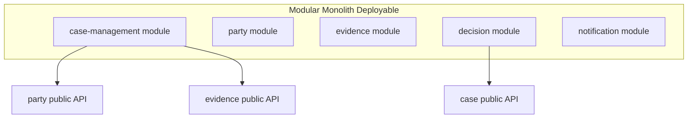

Kuncinya bukan “satu aplikasi”. Kuncinya adalah **encapsulation**.

Module lain tidak boleh menyentuh internal package, internal table, internal object model, atau internal workflow module sembarangan. Mereka hanya boleh berinteraksi melalui public API internal yang jelas.

Dalam Java, ini bisa dijaga dengan:

- package visibility;
- module convention;
- Maven multi-module;
- Gradle module;
- Java Platform Module System;
- ArchUnit test;
- Spring Modulith-style module verification;
- explicit application service API;
- event publication internal;
- database schema boundary.

Modular monolith sering menjadi bentuk paling sehat ketika domain masih berubah cepat tetapi tim ingin mempersiapkan extraction path.

### 2.3 Microservices

Microservices adalah sistem yang terdiri dari service-service yang:

- berorientasi business capability;
- dapat dibangun dan dideploy secara independen;
- punya boundary data dan ownership jelas;
- berkomunikasi lewat network/message boundary;
- dapat gagal secara parsial;
- dioperasikan oleh team yang bertanggung jawab atas lifecycle-nya.

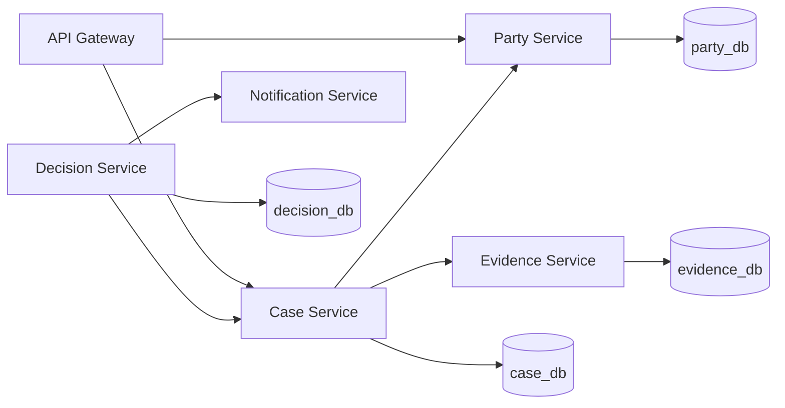

Microservices bukan sekadar “module dipisah menjadi REST API”.

Microservices mengubah banyak hal sekaligus:

- function call menjadi network call;
- local transaction menjadi distributed business transaction;
- exception propagation menjadi error contract;
- in-memory consistency menjadi eventual consistency;
- local debugging menjadi distributed tracing;
- single deployable menjadi release choreography;
- package dependency menjadi runtime dependency;
- local ownership ambiguity menjadi team ownership requirement.

Kalau perubahan ini tidak disadari, microservices akan terlihat modern tetapi berperilaku buruk.

### 2.4 Distributed Monolith

Distributed monolith adalah sistem yang secara fisik terdistribusi, tetapi secara perubahan masih satu kesatuan rapuh.

Ciri sederhananya:

> Services are separately deployed, but not independently changeable.

Contoh smell:

- setiap release harus deploy 12 service bersamaan;
- satu endpoint kecil memanggil 8 service secara sinkron;
- semua service sharing database;
- perubahan field di `Party Service` memaksa perubahan `Case Service`, `Decision Service`, dan `Reporting Service` pada sprint yang sama;
- integration test end-to-end adalah satu-satunya cara percaya sistem berjalan;
- satu service down membuat semua user journey gagal;
- retry antar service memperbesar outage;
- tidak ada service owner yang benar-benar bisa membuat keputusan sendiri;
- event hanya dipakai sebagai remote procedure call yang lebih sulit dilacak;
- service boundary mengikuti entity CRUD, bukan capability.

Distributed monolith adalah bentuk mahal dari monolith: kamu tetap punya coupling monolith, tetapi sekarang ditambah latency, network failure, observability complexity, deployment complexity, dan operational overhead.

---

## 3. Perbandingan Cepat

| Dimensi | Monolith | Modular Monolith | Microservices | Distributed Monolith |
|---|---:|---:|---:|---:|
| Deployable unit | Satu | Satu | Banyak | Banyak |
| Boundary enforcement | Lemah/tergantung disiplin | Kuat di codebase | Kuat di runtime dan organisasi | Tampak kuat, sebenarnya bocor |
| Network cost antar capability | Tidak ada | Tidak ada | Ada | Ada, sering berlebihan |
| Independent deployability | Rendah | Rendah-sedang | Tinggi | Rendah |
| Operational complexity | Rendah | Rendah-sedang | Tinggi | Sangat tinggi |
| Data ownership | Sering campur | Bisa dipisah | Harus dipisah | Sering sharing/ambigu |
| Cocok untuk domain berubah cepat | Ya | Ya | Hati-hati | Tidak |
| Cocok untuk banyak team autonomous | Terbatas | Sedang | Ya | Tidak |
| Failure mode | Whole app failure | Whole app failure, tapi internal lebih jelas | Partial failure | Cascading failure |
| Smell utama | Big ball of mud | Over-modularization | Service sprawl | Tight coupling over network |

Tabel ini tidak mengatakan microservices lebih baik. Ia mengatakan microservices memindahkan complexity dari codebase ke runtime, delivery, ownership, data, dan operations.

Kalau tim belum siap membayar biaya itu, modular monolith biasanya lebih rasional.

---

## 4. Kesalahan Umum: Mengira “Distributed” Berarti “Decoupled”

Dua class dalam satu JVM bisa tightly coupled.

Dua service di Kubernetes juga bisa tightly coupled.

Perbedaannya: tight coupling dalam satu JVM lebih murah dideteksi, lebih murah dites, dan lebih murah di-debug. Tight coupling lewat network lebih mahal karena failure-nya tidak deterministik.

Lihat dua desain berikut.

### Desain A — Monolith dengan Boundary Buruk

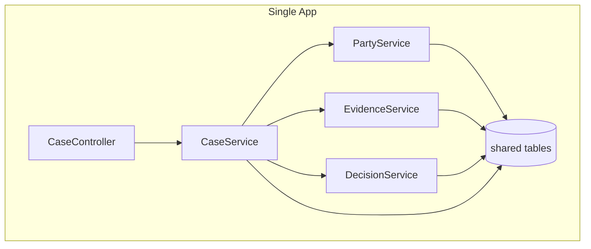

Ini buruk karena semua area saling tahu terlalu banyak.

### Desain B — Microservices dengan Boundary Buruk

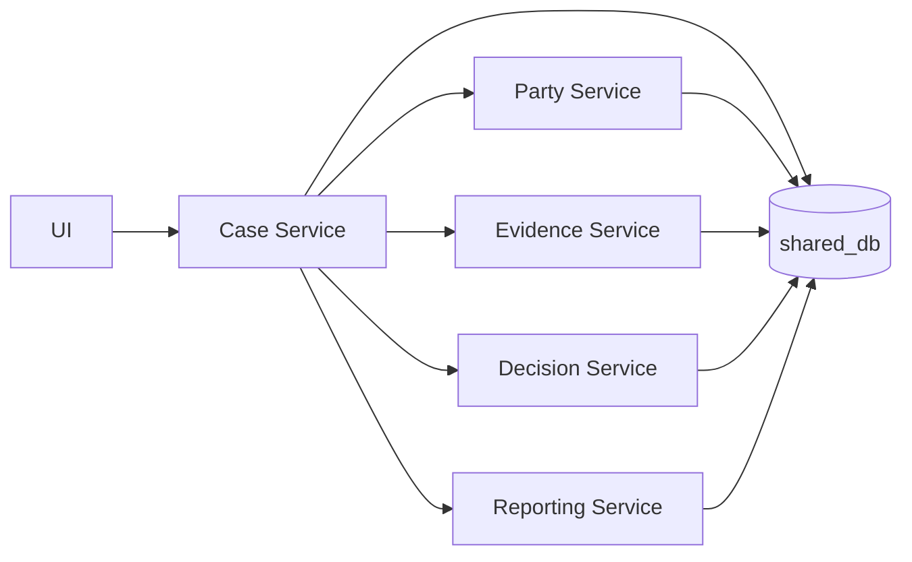

Desain B sering dianggap lebih modern karena ada banyak service. Padahal ia lebih berbahaya. Boundary buruk di Desain A masih terjadi dalam satu process. Boundary buruk di Desain B sekarang terjadi lewat network, shared database, dan deployment choreography.

Poin penting:

> Distribution does not create decoupling. Boundary design creates decoupling.

---

## 5. Independent Deployability sebagai Tes Kejujuran

Salah satu tes paling jujur untuk microservices adalah pertanyaan ini:

> Bisakah service ini berubah dan dideploy tanpa memaksa service lain ikut deploy pada waktu yang sama?

Kalau jawabannya “tidak”, service itu mungkin belum benar-benar microservice.

Independent deployability tidak berarti tidak ada dependency. Tidak ada sistem enterprise yang bebas dependency. Artinya dependency tersebut dikelola dengan contract yang stabil.

Contoh dependency sehat:

- consumer memakai field additive dari API producer;
- producer menjaga backward compatibility;
- event schema berevolusi secara kompatibel;
- consumer dapat mengabaikan field yang tidak dikenal;
- deployment producer tidak harus sinkron dengan deployment consumer;
- failure dependency punya fallback/degraded behavior;
- contract diuji secara otomatis.

Contoh dependency tidak sehat:

- service A dan B harus deploy bersamaan karena DTO berubah;
- service A membaca tabel service B;
- service A memanggil internal endpoint service B yang tidak dijaga compatibility-nya;
- service B mengubah enum dan service A langsung gagal deserialize;
- integration test full environment menjadi satu-satunya pengaman release;
- deployment order menjadi tribal knowledge.

Kalau deployment order menjadi bagian dari ritual manual, sistemmu belum loosely coupled.

---

## 6. Modular Monolith Bukan “Kalah dari Microservices”

Modular monolith sering dipandang sebagai tahap sementara atau pilihan inferior. Ini cara berpikir yang lemah.

Modular monolith bisa menjadi pilihan utama yang sangat kuat ketika constraint-nya cocok.

### 6.1 Kapan Modular Monolith Lebih Tepat

Pilih modular monolith ketika:

1. **Domain belum stabil**  
   Boundary masih sering berubah. Memindahkan boundary antar package lebih murah daripada memindahkan boundary antar service, database, contract, deployment pipeline, dan ownership.

2. **Tim masih kecil atau koordinasi masih sederhana**  
   Microservices memberi nilai besar saat banyak team butuh bergerak independen. Kalau satu tim masih bisa mengelola keseluruhan sistem, operational overhead microservices sering tidak sepadan.

3. **Consistency requirement masih kuat**  
   Jika banyak use case butuh atomic consistency lintas capability yang belum bisa dipisah secara bisnis, modular monolith memberi ruang untuk belajar domain sebelum memecah transaksi.

4. **Operational maturity belum cukup**  
   Microservices butuh observability, CI/CD, incident response, rollout strategy, service ownership, on-call discipline, dan platform maturity. Tanpa itu, production akan menjadi laboratorium kegagalan.

5. **Throughput bottleneck belum jelas**  
   Jangan memecah sistem hanya karena “nanti scaling”. Scaling bottleneck harus diukur. Banyak sistem bisa scale jauh dengan satu deployable yang dirancang baik.

6. **Boundary extraction masih butuh eksperimen**  
   Modular monolith memungkinkan membuat internal boundary yang bisa diekstraksi nanti.

### 6.2 Kapan Modular Monolith Mulai Tidak Cukup

Modular monolith mulai kalah ketika:

- release satu module selalu menunggu regression cycle semua module;
- build/test time menghambat team secara nyata;
- beberapa capability punya scaling profile sangat berbeda;
- team ownership sudah saling menunggu;
- domain boundary sudah stabil tetapi masih terkunci deployment tunggal;
- satu bug di supporting capability sering memblokir core capability;
- compliance atau isolation butuh runtime boundary keras;
- technology lifecycle antar capability sangat berbeda.

Pada titik itu, microservices bisa memberi nilai. Tapi extraction tetap harus selektif, bukan rewrite besar.

---

## 7. Java Modular Monolith: Bentuk yang Benar

Mari buat contoh sederhana.

Kita punya sistem regulatory case management dengan capability:

- Case Intake
- Party Management
- Evidence Registry
- Enforcement Decision
- Notification

Dalam modular monolith, kita bisa membuat module seperti ini:

```text
case-platform/
  pom.xml
  case-app/
    src/main/java/com/acme/platform/app
  case-domain/
    src/main/java/com/acme/platform/casecore
  party-domain/
    src/main/java/com/acme/platform/party
  evidence-domain/
    src/main/java/com/acme/platform/evidence
  decision-domain/
    src/main/java/com/acme/platform/decision
  notification-domain/
    src/main/java/com/acme/platform/notification
  shared-kernel/
    src/main/java/com/acme/platform/shared
```

Namun struktur folder saja tidak cukup. Kita perlu aturan.

### 7.1 Public API Module

```java
package com.acme.platform.party.api;

import java.util.Optional;

public interface PartyDirectory {
    Optional<PartySummary> findByPartyId(PartyId partyId);
}
```

```java
package com.acme.platform.party.api;

public record PartySummary(
        PartyId partyId,
        String displayName,
        PartyType type,
        PartyStatus status
) {}
```

Module lain hanya boleh memakai `com.acme.platform.party.api`, bukan internal implementation.

### 7.2 Internal Implementation

```java
package com.acme.platform.party.internal;

import com.acme.platform.party.api.PartyDirectory;
import com.acme.platform.party.api.PartyId;
import com.acme.platform.party.api.PartySummary;

import java.util.Optional;

final class PartyDirectoryAdapter implements PartyDirectory {
    private final PartyRepository repository;

    PartyDirectoryAdapter(PartyRepository repository) {
        this.repository = repository;
    }

    @Override
    public Optional<PartySummary> findByPartyId(PartyId partyId) {
        return repository.findById(partyId)
                .map(party -> new PartySummary(
                        party.id(),
                        party.displayName(),
                        party.type(),
                        party.status()
                ));
    }
}
```

Package `internal` tidak boleh dipakai module lain.

### 7.3 Enforcing Boundary dengan ArchUnit

```java
package com.acme.platform.arch;

import com.tngtech.archunit.core.importer.ImportOption;
import com.tngtech.archunit.junit.AnalyzeClasses;
import com.tngtech.archunit.junit.ArchTest;
import com.tngtech.archunit.lang.ArchRule;

import static com.tngtech.archunit.lang.syntax.ArchRuleDefinition.noClasses;

@AnalyzeClasses(
        packages = "com.acme.platform",
        importOptions = ImportOption.DoNotIncludeTests.class
)
class ModuleBoundaryTest {

    @ArchTest
    static final ArchRule party_internal_must_not_be_accessed_by_other_modules =
            noClasses()
                    .that().resideOutsideOfPackage("com.acme.platform.party..")
                    .should().accessClassesThat()
                    .resideInAnyPackage("com.acme.platform.party.internal..");

    @ArchTest
    static final ArchRule evidence_internal_must_not_be_accessed_by_other_modules =
            noClasses()
                    .that().resideOutsideOfPackage("com.acme.platform.evidence..")
                    .should().accessClassesThat()
                    .resideInAnyPackage("com.acme.platform.evidence.internal..");
}
```

Ini bukan sekadar test. Ini architecture fitness function kecil. Ia menjaga agar boundary tidak membusuk diam-diam.

### 7.4 Internal Event sebagai Latihan Decoupling

Dalam modular monolith, kamu bisa memakai internal domain event sebelum memakai Kafka/RabbitMQ.

```java
package com.acme.platform.casecore.api;

import java.time.Instant;

public record CaseSubmitted(
        CaseId caseId,
        String submittedBy,
        Instant submittedAt
) {}
```

```java
package com.acme.platform.notification.internal;

import com.acme.platform.casecore.api.CaseSubmitted;
import org.springframework.context.event.EventListener;

final class CaseNotificationListener {

    private final NotificationSender sender;

    CaseNotificationListener(NotificationSender sender) {
        this.sender = sender;
    }

    @EventListener
    void on(CaseSubmitted event) {
        sender.sendCaseSubmittedNotification(event.caseId(), event.submittedBy());
    }
}
```

Ini belum microservices. Tapi ini melatih satu prinsip penting:

> Module jangan selalu memanggil module lain secara imperative kalau yang terjadi sebenarnya adalah event bisnis.

Saat nanti module diekstraksi menjadi service, event semacam ini lebih mudah dipindah ke broker.

---

## 8. Distributed Monolith: Anatomi Kegagalan

Distributed monolith biasanya tidak lahir dari niat buruk. Ia lahir dari transisi yang terlalu cepat.

Tim memecah sistem berdasarkan entity:

```text
Case Service
Party Service
Evidence Service
User Service
Document Service
Decision Service
Status Service
Comment Service
Attachment Service
```

Lalu setiap user journey butuh banyak entity. Akibatnya satu request berubah menjadi orchestration panjang.

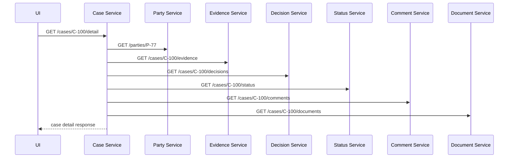

Sekilas rapi. Tapi operasionalnya buruk.

Jika setiap dependency punya availability 99.9%, dan request sukses butuh semua dependency sukses, maka success probability kasar untuk 6 dependency adalah:

```text
0.999^6 = 0.994
```

Artinya request agregat bisa turun ke sekitar 99.4% bahkan jika tiap dependency terlihat “bagus”. Ini perhitungan kasar karena real system punya correlation, retry, timeout, dan caching. Tapi intuisi pentingnya jelas: **fan-out memperbesar failure surface**.

### 8.1 Smell: Entity Service

Entity service adalah service yang hanya membungkus tabel entity.

Contoh:

```text
Party Service = CRUD table party
Status Service = CRUD table status
Comment Service = CRUD table comment
Attachment Service = CRUD table attachment
```

Entity service sering menyebabkan chatty communication karena business use case jarang berhenti di satu entity.

Service boundary yang lebih sehat biasanya mengikuti capability:

```text
Case Intake Service
Evidence Registry Service
Enforcement Decision Service
Case Review Service
Notification Service
```

Capability service punya alasan bisnis untuk berubah dan dimiliki.

### 8.2 Smell: Shared Database with Service Wrapper

Ini pola berbahaya:

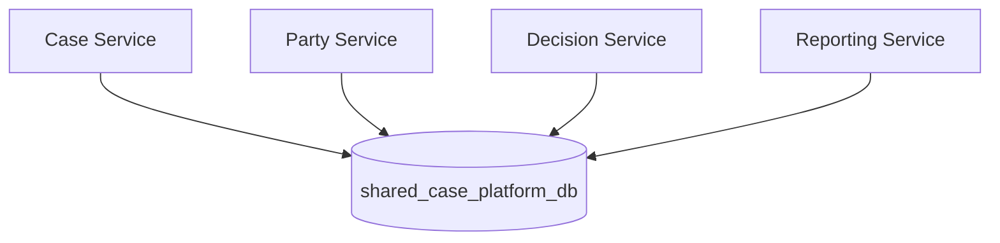

Tim berkata: “Kami sudah punya microservices karena ada beberapa service.”

Tapi database adalah integration layer utama. Service boundary menjadi tipis. Tabel menjadi shared contract. Perubahan schema menjadi distributed coordination problem.

Jika beberapa service boleh menulis tabel yang sama, ownership hilang.

### 8.3 Smell: Lockstep Deployment

Contoh release note:

```text
Release 2026.07.04
- Deploy party-service v2.8 first
- Deploy case-service v4.1 after party-service
- Deploy decision-service v1.9 within 10 minutes
- Do not deploy reporting-service until migration job completes
- Rollback must rollback all services together
```

Ini bukan microservices. Ini distributed release train.

Kadang koordinasi deployment tidak bisa dihindari, terutama saat migrasi besar. Tetapi kalau ini menjadi normal path untuk perubahan biasa, boundary-mu salah atau compatibility strategy-mu lemah.

### 8.4 Smell: Synchronous Chain untuk Long-Running Business Process

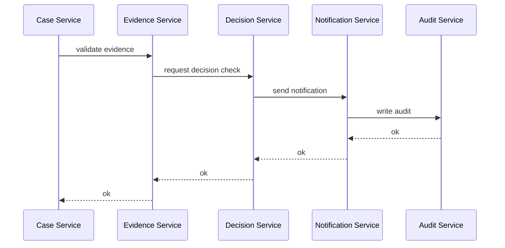

Jika proses bisnisnya long-running, punya human decision, SLA, timeout, compensation, dan audit trail, chain sinkron seperti ini rapuh. Workflow atau event-driven orchestration mungkin lebih tepat.

---

## 9. Decision Matrix: Pilih Apa?

Gunakan matrix ini sebagai alat berpikir awal.

| Constraint | Monolith | Modular Monolith | Microservices |
|---|---:|---:|---:|
| Domain belum jelas | Baik | Sangat baik | Buruk-sedang |
| Tim kecil | Baik | Sangat baik | Overhead tinggi |
| Banyak team autonomous | Lemah | Sedang | Baik |
| Independent deployment wajib | Lemah | Lemah-sedang | Sangat baik |
| Strong consistency dominan | Baik | Baik | Sulit |
| Scalability per capability berbeda ekstrem | Lemah | Sedang | Baik |
| Operational maturity rendah | Baik | Baik | Berisiko |
| Compliance isolation kuat | Sedang | Sedang | Baik |
| Domain boundary stabil | Sedang | Baik | Baik |
| Eksperimen produk cepat | Baik | Baik | Bisa berat |
| Banyak integration dengan external system | Sedang | Sedang | Baik jika boundary jelas |

Cara memakai matrix:

1. Jangan hitung skor buta.
2. Tandai constraint yang benar-benar keras.
3. Bedakan pain saat ini vs pain hipotetis.
4. Pilih arsitektur yang mengurangi pain nyata tanpa menciptakan pain lebih mahal.

Architecture decision yang dewasa jarang berbunyi:

> “Kita pakai microservices karena scalable.”

Ia lebih sering berbunyi:

> “Capability A dan B punya ownership, release cadence, scaling profile, dan compliance boundary berbeda. Boundary domain sudah stabil. Kita ekstrak A terlebih dahulu karena change coupling-nya tinggi tetapi data ownership-nya bisa dipisahkan dengan outbox dan read model.”

---

## 10. Extraction Readiness: Kapan Module Siap Jadi Service?

Sebelum module diekstraksi, tanyakan:

### 10.1 Boundary

- Apakah module punya public API yang jelas?
- Apakah internal model tidak dipakai module lain?
- Apakah use case module cukup cohesive?
- Apakah alasan perubahan module berbeda dari module lain?

### 10.2 Data

- Apakah tabel module punya owner jelas?
- Apakah module lain masih join langsung ke tabelnya?
- Apakah ada shared transaction lintas module?
- Apakah query lintas module bisa diganti read model/projection/API?

### 10.3 Runtime

- Apakah module punya scaling profile berbeda?
- Apakah module butuh deploy cadence berbeda?
- Apakah failure module harus diisolasi dari capability lain?
- Apakah observability signal module sudah jelas?

### 10.4 Contract

- Apakah API/event module bisa distabilkan?
- Apakah consumer diketahui?
- Apakah backward compatibility bisa dijaga?
- Apakah versioning/deprecation policy ada?

### 10.5 Team

- Apakah ada owner yang bisa menjalankan service setelah diekstraksi?
- Apakah owner punya kemampuan on-call/debugging?
- Apakah platform mendukung deployment independen?
- Apakah incident ownership jelas?

Jika sebagian besar jawabannya “belum”, jangan ekstrak dulu. Perkuat modular boundary lebih dulu.

---

## 11. Jalur Evolusi yang Sehat

Microservices terbaik sering lahir dari sistem yang sudah dimodularisasi, bukan dari rewrite besar.

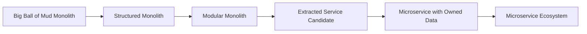

### 11.1 Dari Big Ball of Mud ke Structured Monolith

Target:

- pisahkan controller, application service, domain, infrastructure;
- hentikan akses database sembarangan;
- buat package boundary;
- hilangkan circular dependency besar;
- tulis architecture tests.

### 11.2 Dari Structured Monolith ke Modular Monolith

Target:

- definisikan module berdasarkan capability;
- buat public API per module;
- internal implementation tidak boleh dipakai luar;
- mulai publish internal events;
- mapping ownership module.

### 11.3 Dari Modular Monolith ke Extracted Service

Target:

- pilih module dengan boundary stabil dan pain nyata;
- pisahkan data ownership;
- stabilkan API/event contract;
- buat adapter di monolith untuk memanggil service baru;
- jalankan parallel/shadow jika perlu;
- ukur latency, failure, dan correctness.

### 11.4 Dari Extracted Service ke Ecosystem

Target:

- observability standar;
- CI/CD independen;
- incident runbook;
- service catalog;
- SLO;
- compatibility policy;
- cost monitoring.

---

## 12. Contoh Keputusan: Regulatory Case Management

Misalkan ada monolith regulatory case management.

Capability:

- intake case;
- manage parties;
- collect evidence;
- evaluate allegation;
- issue enforcement decision;
- notify regulated entity;
- generate audit report.

Tim ingin “memicroservice-kan” sistem.

### 12.1 Pemecahan yang Lemah

```text
Case Service
Party Service
Evidence Service
Decision Service
Notification Service
Audit Service
```

Ini bisa baik, tapi bisa juga entity split. Kita perlu lihat behavior.

Jika `Case Service` setiap saat harus sinkron memanggil semua service untuk menampilkan case detail, membuat case, submit evidence, dan issue decision, maka `Case Service` menjadi god orchestrator.

### 12.2 Pemecahan yang Lebih Bermakna

Pertimbangkan capability boundary:

```text
Case Intake Service
Case Review Service
Evidence Registry Service
Enforcement Decision Service
Regulated Party Registry
Notification Service
Audit Evidence Service
```

Perbedaannya:

- `Case Intake` fokus pada lifecycle pendaftaran case.
- `Case Review` fokus pada proses review dan assignment.
- `Evidence Registry` fokus pada registrasi, metadata, chain of custody.
- `Enforcement Decision` fokus pada decision, rationale, approval, publication.
- `Regulated Party Registry` bukan sekadar CRUD party; ia authoritative registry untuk identity/status party.
- `Audit Evidence Service` bukan sekadar log; ia membangun evidence chain untuk defensibility.

Boundary ini lebih dekat ke capability dan policy.

### 12.3 Apakah Semua Harus Langsung Jadi Microservice?

Tidak.

Mungkin fase pertama lebih baik:

```text
Modular Monolith:
- case-intake module
- case-review module
- evidence-registry module
- enforcement-decision module
- party-registry module
- notification module
- audit-evidence module
```

Lalu ekstraksi pertama dipilih berdasarkan pain nyata:

- Notification Service sering berubah dan bisa async → kandidat baik.
- Audit Evidence butuh immutability dan compliance isolation → kandidat baik.
- Evidence Registry punya storage/scaling profile berbeda → kandidat baik.
- Enforcement Decision punya workflow kompleks dan audit tinggi → kandidat mungkin, tapi butuh boundary matang.

Case Intake mungkin tetap dalam modular monolith lebih lama jika tightly coupled dengan review lifecycle.

---

## 13. Anti-Pattern: “Microservices by Table”

Ini salah satu anti-pattern paling mahal.

```text
case table        -> Case Service
party table       -> Party Service
evidence table    -> Evidence Service
decision table    -> Decision Service
comment table     -> Comment Service
status table      -> Status Service
attachment table  -> Attachment Service
```

Kenapa buruk?

Karena database table bukan business capability.

Business use case biasanya seperti:

- submit a case;
- assign case to officer;
- request additional evidence;
- escalate overdue review;
- approve enforcement action;
- notify regulated party;
- generate audit package.

Use case itu melintasi banyak table. Jika service boundary mengikuti table, setiap use case menjadi distributed transaction atau distributed query.

Service boundary harus mengikuti **behavioral cohesion**, bukan storage decomposition.

---

## 14. Anti-Pattern: “Everything Async”

Sebagian tim mencoba menghindari distributed monolith dengan membuat semua komunikasi async.

```text
Service A publishes event
Service B consumes event
Service C consumes event
Service D consumes event
```

Async tidak otomatis decoupled.

Event-driven distributed monolith bisa terjadi jika:

- event schema berubah dan semua consumer harus ikut berubah;
- event name generik seperti `DataChanged`;
- event tidak punya semantic business meaning;
- consumer bergantung pada urutan event global yang rapuh;
- tidak ada ownership event;
- tidak ada replay strategy;
- tidak ada idempotency;
- producer tahu terlalu banyak tentang consumer;
- event dipakai untuk menyembunyikan RPC.

Event yang sehat adalah business fact yang sudah terjadi dan punya makna stabil.

Contoh buruk:

```json
{
  "type": "CaseUpdated",
  "table": "case",
  "columns": {
    "status": "SUBMITTED",
    "updated_by": "u123"
  }
}
```

Contoh lebih baik:

```json
{
  "type": "CaseSubmitted",
  "caseId": "C-2026-00017",
  "submittedBy": "u123",
  "submittedAt": "2026-07-04T09:15:31Z",
  "submissionChannel": "PORTAL"
}
```

Event pertama adalah database mutation disguised as event. Event kedua adalah business fact.

---

## 15. Architecture Test: Distributed Monolith Detection

Kamu bisa membuat checklist berbobot.

| Signal | Pertanyaan | Severity |
|---|---|---:|
| Lockstep deployment | Apakah perubahan biasa butuh deploy beberapa service serentak? | High |
| Shared DB | Apakah beberapa service menulis schema/tabel yang sama? | Critical |
| Chatty call | Apakah satu request user memanggil >5 service sinkron? | Medium-High |
| Circular dependency | Apakah service A memanggil B dan B memanggil A? | High |
| Contract fragility | Apakah field rename memecahkan consumer? | High |
| Ownership ambiguity | Apakah tidak jelas siapa owner endpoint/event/table? | High |
| E2E dependency | Apakah semua release butuh full E2E environment? | Medium |
| Central orchestrator | Apakah satu service menjadi god coordinator? | High |
| Shared domain model | Apakah semua service memakai library DTO/domain yang sama? | Medium-High |
| Failure amplification | Apakah dependency lambat membuat request pile-up di upstream? | Critical |

Contoh scoring sederhana:

```java
package com.acme.archreview;

import java.util.List;

public final class DistributedMonolithRiskScorer {

    public RiskLevel score(List<RiskSignal> signals) {
        int score = signals.stream()
                .mapToInt(signal -> signal.severity().points())
                .sum();

        if (score >= 25) return RiskLevel.CRITICAL;
        if (score >= 15) return RiskLevel.HIGH;
        if (score >= 8) return RiskLevel.MEDIUM;
        return RiskLevel.LOW;
    }

    public enum RiskLevel {
        LOW,
        MEDIUM,
        HIGH,
        CRITICAL
    }

    public record RiskSignal(String name, Severity severity, String evidence) {}

    public enum Severity {
        LOW(1),
        MEDIUM(3),
        HIGH(5),
        CRITICAL(8);

        private final int points;

        Severity(int points) {
            this.points = points;
        }

        public int points() {
            return points;
        }
    }
}
```

Ini bukan untuk menggantikan judgment. Ini untuk memaksa discussion berbasis evidence.

---

## 16. Shared Library: Bantuan atau Coupling?

Dalam Java microservices, shared library sering menjadi sumber distributed monolith.

Shared library sehat:

```text
company-observability-starter
company-http-client-resilience
company-error-contract
company-security-context
company-test-fixtures
```

Shared library berbahaya:

```text
company-domain-model
company-all-dtos
company-database-entities
company-service-clients-all
company-common-everything
```

Kenapa?

Karena shared domain model membuat service tampak konsisten tetapi sebenarnya coupling meningkat. Jika semua service memakai `CaseStatus` enum yang sama dari library yang sama, perubahan enum bisa memaksa banyak service release.

Lebih baik setiap service punya model internal sendiri dan melakukan translation di boundary.

```java
package com.acme.casecore.integration.party;

import com.acme.casecore.domain.PartyRiskCategory;

final class PartyClientTranslator {

    PartyRiskCategory toDomainRiskCategory(ExternalPartyRisk risk) {
        return switch (risk.code()) {
            case "LOW" -> PartyRiskCategory.LOW;
            case "MEDIUM" -> PartyRiskCategory.MEDIUM;
            case "HIGH" -> PartyRiskCategory.HIGH;
            default -> PartyRiskCategory.UNKNOWN;
        };
    }
}
```

Translation terasa repetitive. Tapi repetition kecil di boundary sering lebih murah daripada coupling besar di shared model.

---

## 17. Practical Heuristics

Gunakan heuristic berikut.

### 17.1 Start with Modular Boundaries, Not Network Boundaries

Sebelum membuat service baru, coba buat boundary internal yang keras.

Kalau boundary internal saja tidak bisa dijaga, boundary network tidak akan menyelamatkanmu.

### 17.2 Extract for a Reason

Ekstrak service karena alasan nyata:

- ownership;
- release cadence;
- scale profile;
- compliance isolation;
- failure isolation;
- technology lifecycle;
- external integration isolation.

Jangan ekstrak hanya karena entity berbeda.

### 17.3 Prefer Capability over Entity

Service harus menjawab:

> “Business capability apa yang service ini miliki?”

Bukan:

> “Tabel apa yang service ini bungkus?”

### 17.4 Avoid Synchronous Fan-Out on Critical Paths

Satu request yang butuh banyak service sinkron punya failure surface besar.

Gunakan:

- API composition dengan fallback;
- read model;
- caching dengan staleness contract;
- async projection;
- UI progressive loading;
- workflow orchestration untuk proses panjang.

### 17.5 Treat Deployment Coupling as Architecture Smell

Jika kamu harus menulis deployment choreography manual, kamu sedang melihat coupling.

### 17.6 Keep Data Ownership Boring and Explicit

Setiap table/topic/index/materialized view harus punya owner.

Kalau tidak ada owner, tidak ada boundary.

---

## 18. Diagram Keputusan

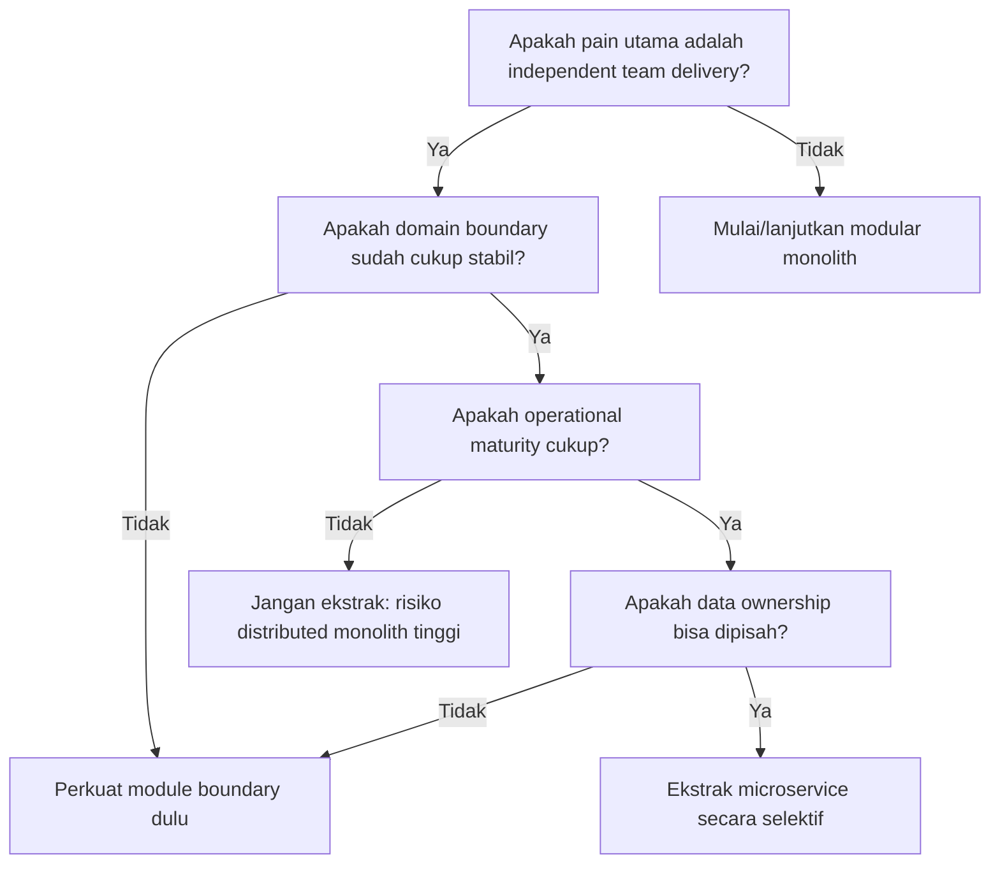

Diagram ini sengaja konservatif. Microservices adalah alat mahal. Gunakan ketika manfaatnya mengalahkan biaya distribusi.

---

## 19. Mini Case: Notification Service

Notification sering menjadi kandidat ekstraksi awal.

Kenapa?

- Biasanya bisa async.
- Failure-nya bisa diisolasi.
- Scaling profile berbeda.
- Integrasi external email/SMS/push bisa lambat atau tidak stabil.
- Domain inti tidak harus tahu detail provider.

### 19.1 Dalam Modular Monolith

```java
public interface NotificationPort {
    void send(NotificationCommand command);
}
```

```java
public record NotificationCommand(
        String recipient,
        String template,
        Map<String, Object> variables
) {}
```

### 19.2 Setelah Diekstraksi

Case service tidak lagi memanggil SMTP provider. Ia publish event.

```java
public record EnforcementDecisionIssued(
        String decisionId,
        String caseId,
        String partyId,
        Instant issuedAt
) {}
```

Notification Service consume event dan mengirim notifikasi.

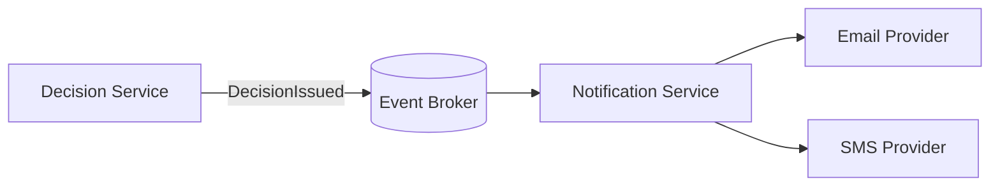

Jika Notification Service down, Decision Service masih bisa issue decision selama event tersimpan reliable. Ini contoh extraction yang memberi failure isolation nyata.

---

## 20. Mini Case: Party Service yang Salah Diekstraksi

Party sering tampak cocok menjadi service karena entity-nya jelas. Tapi hati-hati.

Jika hampir semua use case butuh data party dan semua call sinkron ke Party Service, service ini menjadi dependency kritis.

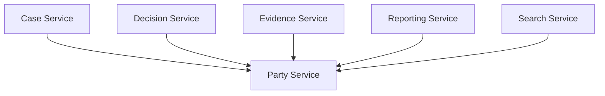

Ini tidak otomatis buruk. Registry service memang sering menjadi dependency pusat. Tapi desainnya harus sadar risiko:

- cache read-only party summary;
- publish `PartyUpdated` event untuk projection;
- bedakan authoritative command vs query summary;
- hindari synchronous call di critical path yang tidak perlu;
- punya SLO tinggi;
- punya fallback untuk display name/status lama;
- punya clear ownership dan compatibility policy.

Jika tidak, Party Service menjadi single point of architecture pain.

---

## 21. Refactoring dari Distributed Monolith

Jika sistem sudah terlanjur distributed monolith, jangan langsung rewrite. Lakukan stabilisasi.

### 21.1 Buat Dependency Map

Kumpulkan:

- runtime calls dari tracing;
- API dependencies;
- database access;
- topic producer/consumer;
- deployment order;
- incident history;
- ownership map.

### 21.2 Cari Coupling Tertinggi

Pertanyaan:

- service mana paling sering menyebabkan coordinated release?
- endpoint mana punya fan-out terbesar?
- database table mana ditulis banyak service?
- event mana punya consumer paling rapuh?
- dependency mana paling sering muncul di incident?

### 21.3 Putus Coupling Secara Bertahap

Strategi:

- stabilkan API contract;
- tambahkan backward compatibility;
- hilangkan shared table write;
- buat read model untuk query fan-out;
- pindahkan proses panjang ke workflow/event;
- hapus shared domain library;
- ubah lockstep deployment menjadi expand-contract.

### 21.4 Jangan Tambah Service Baru Dulu

Saat coupling belum terkendali, menambah service baru sering memperburuk graph.

Perbaiki boundary sebelum memperbanyak node.

---

## 22. Checklist Desain

Sebelum memilih microservices, jawab:

- Apa pain nyata yang ingin diselesaikan?
- Apakah pain itu berasal dari code structure, team ownership, runtime scaling, compliance, atau deployment coupling?
- Apakah modular monolith bisa menyelesaikan 70% masalah dengan 30% biaya?
- Service mana yang benar-benar butuh deploy independen?
- Apakah data ownership bisa dipisah?
- Apakah consumer contract bisa dijaga kompatibel?
- Apakah ada team owner?
- Apakah observability sudah siap?
- Apakah platform deployment sudah matang?
- Apakah failure mode setelah distribusi sudah dipahami?
- Apa risiko distributed monolith?
- Apa extraction path paling kecil dan reversible?

---

## 23. Latihan

Ambil satu sistem yang kamu kenal. Buat tabel berikut.

| Capability | Current module/service | Owner | Data owned | Release pain | Scaling pain | Consistency need | Extraction candidate? |
|---|---|---|---|---|---|---|---|
| Case Intake |  |  |  |  |  |  |  |
| Evidence Registry |  |  |  |  |  |  |  |
| Decisioning |  |  |  |  |  |  |  |
| Notification |  |  |  |  |  |  |  |
| Audit Evidence |  |  |  |  |  |  |  |

Lalu jawab:

1. Capability mana yang paling aman diekstraksi pertama?
2. Capability mana yang sebaiknya tetap dalam modular monolith?
3. Dependency mana yang paling berisiko menjadi distributed monolith?
4. Tabel mana yang ownership-nya tidak jelas?
5. User journey mana yang punya synchronous fan-out terbesar?

---

## 24. Ringkasan

Microservices bukan tujuan. Ia adalah alat untuk mengelola perubahan, ownership, deployability, scaling, dan failure isolation.

Modular monolith bukan pilihan inferior. Ia sering menjadi bentuk paling efisien ketika domain belum stabil, tim masih kecil, dan operational maturity belum cukup.

Distributed monolith adalah kondisi yang harus dihindari: banyak service, tetapi masih tightly coupled dalam data, contract, deployment, dan failure.

Rule utama:

> Jangan memecah sistem sebelum kamu memahami apa yang sebenarnya ingin kamu pisahkan.

Boundary yang buruk dalam monolith adalah masalah. Boundary yang buruk dalam microservices adalah masalah yang sama, tetapi sekarang berjalan di atas network.

---

## 25. Referensi

- Martin Fowler — Microservices
- Martin Fowler — Monolith First
- Martin Fowler — Microservice Trade-Offs
- Martin Fowler — How to Break a Monolith into Microservices
- Chris Richardson / microservices.io — Database per Service Pattern
- Chris Richardson / microservices.io — Shared Database Pattern
- Thoughtworks — Modular Monolith as pragmatic architecture discussion
