# Part 006 — Topology of Enterprise Microservices

Setelah kamu paham bahwa microservices bukan sekadar service kecil, dan bahwa distributed monolith adalah risiko nyata, pertanyaan berikutnya adalah:

> Bagaimana membaca bentuk sistem microservices yang besar?

Banyak engineer membaca microservices sebagai daftar repository:

```text
case-service
party-service
evidence-service
decision-service
notification-service
reporting-service
```

Itu belum topology. Itu baru inventory.

Topology adalah cara service-service itu membentuk **graph**:

- siapa memanggil siapa;
- siapa memiliki data apa;
- siapa menjadi source of truth;
- siapa berada di critical path;
- siapa boleh gagal tanpa menghentikan user journey;
- siapa punya blast radius besar;
- siapa punya ownership jelas;
- siapa menjadi dependency platform;
- siapa menjadi edge-facing;
- siapa hanya adapter ke external system;
- siapa mengatur workflow panjang;
- siapa membangun read model;
- siapa menyimpan audit evidence.

Dalam sistem enterprise, topology lebih penting daripada jumlah service.

Sistem dengan 12 service bisa sehat. Sistem dengan 4 service bisa menjadi distributed monolith. Sistem dengan 80 service bisa mudah dioperasikan jika graph-nya terkendali. Sistem dengan 20 service bisa kacau jika dependency-nya circular dan shared database ada di mana-mana.

Part ini membangun mental model untuk membaca, merancang, dan mengendalikan topology microservices.

---

## 1. Tujuan Part Ini

Setelah bagian ini, kamu harus bisa:

1. Membedakan service inventory dan service topology.
2. Mengklasifikasikan service berdasarkan peran enterprise-nya.
3. Membaca dependency graph dan menemukan blast radius.
4. Membedakan system of record, system of engagement, system of intelligence, dan system of integration.
5. Mendesain topology yang mendukung independent delivery dan operability.
6. Membuat topology review untuk sistem Java microservices.

---

## 2. Service Inventory Bukan Architecture

Daftar service seperti ini terlihat informatif:

| Service | Repo | Owner | Language | Database |
|---|---|---|---|---|
| case-service | `case-service` | Case Team | Java | PostgreSQL |
| party-service | `party-service` | Party Team | Java | PostgreSQL |
| evidence-service | `evidence-service` | Evidence Team | Java | PostgreSQL |
| decision-service | `decision-service` | Decision Team | Java | PostgreSQL |
| notification-service | `notification-service` | Platform Team | Java | PostgreSQL |

Tapi daftar itu belum menjawab:

- apakah `case-service` bisa hidup tanpa `party-service`?
- apakah `decision-service` membaca database `case-service`?
- apakah `notification-service` berada di critical path transaksi?
- apakah `evidence-service` punya storage profile khusus?
- apakah `party-service` authoritative untuk party status?
- apakah service-service ini deploy independen?
- apakah ada dependency cycle?
- apakah ada edge service yang berubah karena UI?

Architecture mulai terlihat ketika kita menggambar hubungan.

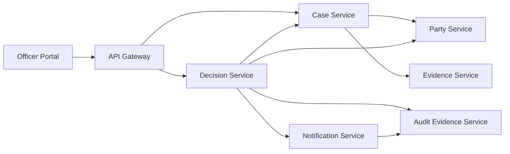

Sekarang mulai terlihat:

- `Party Service` banyak dipakai;
- `Case Service` menjadi dependency `Decision Service`;
- `Audit Evidence Service` menerima event/command dari decision dan notification;
- Gateway tidak hanya routing ke satu backend;
- topology punya potensi fan-out.

Tapi diagram call saja masih belum cukup. Kita butuh beberapa lapisan topology.

---

## 3. Lima Topology yang Harus Dibaca Bersama

Dalam sistem microservices production-grade, minimal ada lima topology.

### 3.1 Logical Capability Topology

Ini menjawab: capability bisnis apa yang ada dan bagaimana hubungannya?

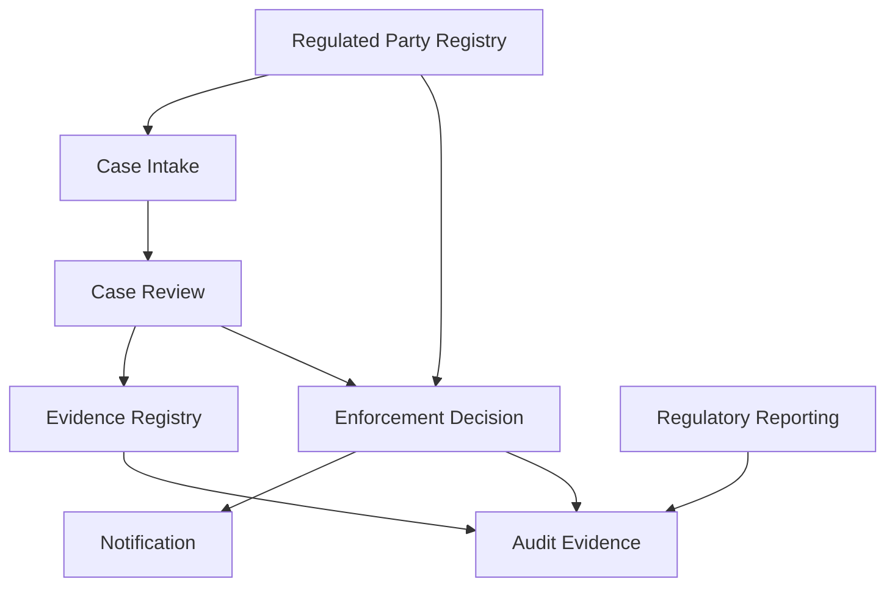

Capability topology tidak peduli service deployment dulu. Ia membantu kita memahami domain.

### 3.2 Runtime Call Topology

Ini menjawab: request nyata melewati service mana?

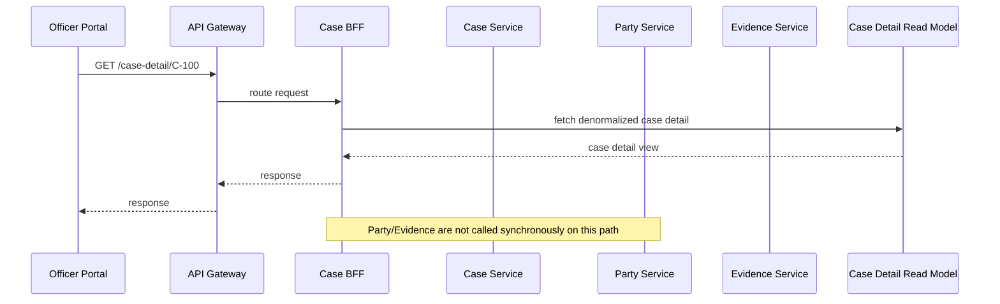

Runtime topology harus dibuat dari telemetry, bukan asumsi diagram lama.

### 3.3 Data Authority Topology

Ini menjawab: siapa source of truth untuk data apa?

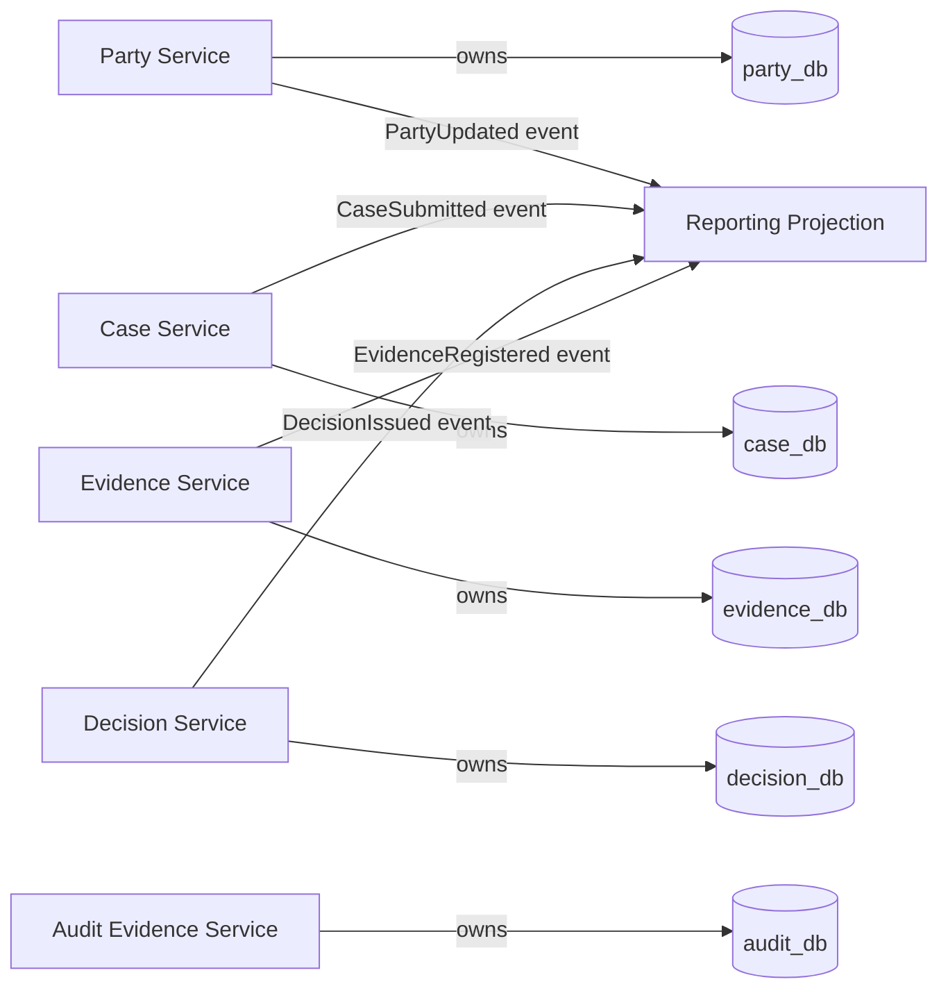

Data authority topology mencegah shared database chaos.

### 3.4 Ownership Topology

Ini menjawab: team mana bertanggung jawab atas service, contract, runtime, dan incident?

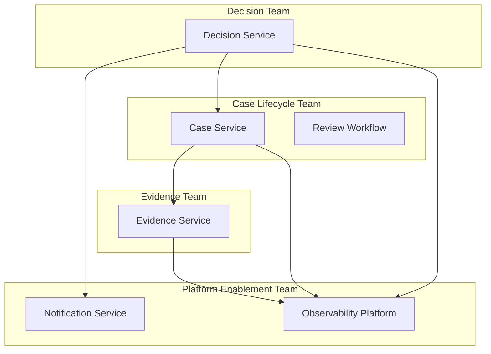

Ownership topology penting karena banyak architecture failure sebenarnya adalah ownership failure.

### 3.5 Failure Topology

Ini menjawab: kalau service X lambat/down, user journey apa yang rusak?

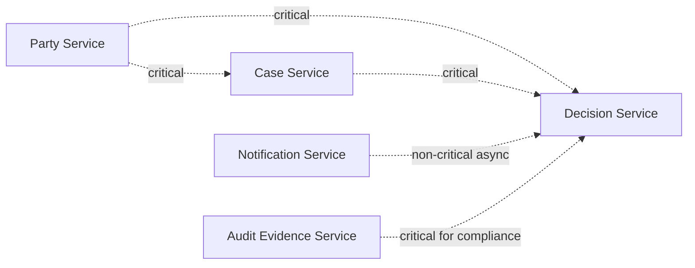

Failure topology harus memberi label dependency:

- critical synchronous;
- non-critical synchronous;
- async required;
- async best-effort;
- cached/degraded;
- batch/reconciliation;
- compliance critical;
- operational only.

Tanpa label ini, semua arrow terlihat sama. Padahal konsekuensinya berbeda.

---

## 4. Kategori Service dalam Enterprise Microservices

Tidak semua service punya peran yang sama. Salah satu kesalahan topology adalah memperlakukan semua service seperti peer yang setara.

Dalam enterprise system, biasanya ada beberapa kategori.

### 4.1 Core Domain Service

Core domain service mengandung capability yang paling membedakan bisnis atau organisasi.

Contoh regulatory case management:

- Case Lifecycle Service
- Enforcement Decision Service
- Evidence Assessment Service
- Compliance Review Service

Ciri:

- business rule kompleks;
- perubahan sering terkait policy/process;
- butuh domain language yang kuat;
- auditability tinggi;
- owner harus dekat dengan domain expert;
- tidak boleh menjadi generic CRUD service.

Desain core service harus kaya secara domain, bukan sekadar database wrapper.

### 4.2 Supporting Domain Service

Supporting service mendukung core, tetapi bukan sumber diferensiasi utama.

Contoh:

- Notification Service
- Document Rendering Service
- Template Service
- Comment Service
- Attachment Metadata Service

Ciri:

- penting untuk user journey;
- business logic sedang;
- sering bisa reusable;
- failure-nya kadang bisa degraded;
- owner bisa platform/product support team.

Supporting service tidak boleh mencuri business orchestration core. Notification Service tidak boleh menentukan kapan enforcement decision sah.

### 4.3 Generic Platform Service

Platform service menyediakan capability teknis lintas domain.

Contoh:

- Identity context propagation
- Observability collector
- Feature flag service
- Configuration service
- Audit log infrastructure
- File scanning service

Ciri:

- dipakai banyak service;
- reliability requirement tinggi;
- API harus stabil;
- failure bisa berdampak luas;
- harus punya compatibility discipline ketat.

Platform service berbahaya jika menjadi bottleneck delivery atau memasukkan domain rule.

### 4.4 Edge Service

Edge service berada dekat client.

Contoh:

- API Gateway
- Backend-for-Frontend Officer Portal
- Mobile BFF
- Partner API Facade

Ciri:

- client-specific;
- composition-heavy;
- security/policy entry point;
- caching/projection consumer;
- tidak boleh menjadi tempat domain decision utama.

BFF boleh mengkomposisi data untuk UI. BFF tidak boleh menjadi “mini monolith” yang memegang business truth.

### 4.5 Integration Service

Integration service mengisolasi external system.

Contoh:

- Government Registry Adapter
- Payment Gateway Adapter
- Email Provider Adapter
- Legacy Case System Adapter
- External Document Repository Adapter

Ciri:

- menerjemahkan external contract ke internal model;
- melindungi domain dari external instability;
- mengelola retry, timeout, rate limit external;
- punya anti-corruption responsibility.

Integration service adalah shock absorber antara sistem internal dan dunia luar.

### 4.6 Workflow / Process Service

Workflow service mengelola business process panjang.

Contoh:

- Enforcement Lifecycle Orchestrator
- Case Escalation Workflow
- Evidence Request Workflow
- Appeal Processing Workflow

Ciri:

- stateful process;
- timeout/SLA;
- human task;
- compensation;
- audit trail;
- visibility ke process state.

Workflow service bukan tempat semua domain logic. Ia mengoordinasi proses, sementara invariant tetap milik domain service terkait.

### 4.7 Read Model / Query Service

Read model service mengoptimalkan query lintas domain.

Contoh:

- Case Detail View Service
- Officer Work Queue Service
- Regulatory Reporting Projection
- Search Index Service

Ciri:

- denormalized;
- eventually consistent;
- dibangun dari event/replication;
- punya staleness contract;
- mengurangi synchronous fan-out.

Read model service bukan source of truth. Ia boleh disposable/rebuildable jika datanya berasal dari event/source lain.

---

## 5. System of Record, Engagement, Intelligence, Integration

Dalam enterprise architecture, service juga bisa dilihat dari peran data dan experience.

### 5.1 System of Record

System of record adalah authoritative owner.

Contoh:

- Party Registry owns regulated party identity/status.
- Case Service owns case lifecycle state.
- Decision Service owns enforcement decision outcome.
- Evidence Service owns evidence metadata and chain of custody.

Aturan:

- hanya owner yang boleh mutate authoritative data;
- service lain harus request via API/command atau consume event;
- reporting boleh copy, tapi bukan owner;
- ownership harus tertulis.

### 5.2 System of Engagement

System of engagement mengoptimalkan user interaction.

Contoh:

- Officer Portal BFF;
- Public Portal API;
- Partner Submission API.

Aturan:

- boleh client-specific;
- boleh aggregate;
- tidak boleh menjadi data authority;
- tidak boleh menyimpan business decision sebagai truth.

### 5.3 System of Intelligence

System of intelligence menghasilkan insight, scoring, recommendation, risk signal.

Contoh:

- Risk Scoring Service;
- Case Prioritization Service;
- Anomaly Detection Service;
- SLA Breach Prediction Service.

Aturan:

- output harus punya confidence/explanation jika dipakai untuk regulated decision;
- tidak boleh diam-diam override domain policy;
- auditability penting;
- model/data lineage perlu jelas.

### 5.4 System of Integration

System of integration menghubungkan internal domain dengan external system.

Contoh:

- External Company Registry Adapter;
- National ID Verification Adapter;
- Email/SMS Provider Adapter;
- Legacy Enforcement Database Bridge.

Aturan:

- external schema tidak boleh bocor ke core domain;
- failures harus diisolasi;
- rate limit harus dihormati;
- retry harus aman;
- mapping harus eksplisit.

---

## 6. Dependency Graph: Cara Membaca Risiko

Topology microservices adalah graph. Graph punya properti yang bisa dianalisis.

### 6.1 In-Degree

In-degree adalah jumlah service yang bergantung pada sebuah service.

Jika banyak service bergantung pada `Party Service`, maka `Party Service` punya in-degree tinggi.

Risiko:

- perubahan contract berdampak luas;
- downtime punya blast radius besar;
- SLO harus lebih ketat;
- compatibility harus disiplin;
- caching/projection mungkin diperlukan.

### 6.2 Out-Degree

Out-degree adalah jumlah dependency yang dipanggil oleh sebuah service.

Jika `Case Detail BFF` memanggil 10 service, out-degree tinggi.

Risiko:

- latency meningkat;
- failure probability meningkat;
- debugging sulit;
- timeout budget kompleks;
- synchronous fan-out menjadi bottleneck.

### 6.3 Betweenness / Bridge Service

Ada service yang menjadi jembatan antar cluster domain.

Contoh:

```text
Case Service menghubungkan portal, review, evidence, decision, reporting.
```

Risiko:

- menjadi god service;
- semua perubahan melewatinya;
- ownership overloaded;
- incident sering berhenti di service ini.

### 6.4 Cycles

Dependency cycle adalah smell kuat.

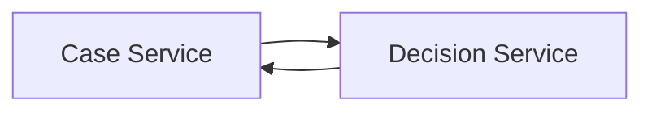

Cycle membuat:

- deployment order sulit;
- failure propagation dua arah;
- domain ownership kabur;
- contract evolution berat;
- testing harus end-to-end.

Cycle tidak selalu bisa dihapus dalam satu hari, tetapi harus diberi label sebagai architecture debt.

---

## 7. Blast Radius

Blast radius adalah area dampak ketika sesuatu gagal atau berubah.

Ada beberapa jenis blast radius.

### 7.1 Runtime Blast Radius

Apa yang gagal jika service down?

Contoh:

| Service Down | Dampak |
|---|---|
| Notification Service | Notifikasi tertunda, decision masih bisa dibuat |
| Party Service | Case intake baru gagal jika party validation sync required |
| Audit Evidence Service | Decision issuance mungkin harus dihentikan karena compliance |
| Reporting Projection | Dashboard stale, core transaction tetap berjalan |

Tidak semua service harus critical. Justru topology sehat membedakan critical path dan non-critical path.

### 7.2 Change Blast Radius

Apa yang harus berubah jika contract berubah?

Contoh:

```text
PartyStatus enum berubah:
- Case Service harus update mapper
- Decision Service harus update policy
- Reporting Projection harus update dimension
- Search Index harus update facet
```

Jika change blast radius luas, contract perlu distabilkan atau downstream perlu dibuat lebih tolerant.

### 7.3 Data Blast Radius

Apa yang rusak jika data salah?

Contoh:

- party status salah → decision eligibility salah;
- evidence chain broken → audit defensibility rusak;
- case SLA timestamp salah → escalation salah;
- notification delivery status salah → user communication misleading.

Data blast radius penting dalam domain regulatory karena konsekuensi bisnis/legal bisa lebih besar dari downtime.

### 7.4 Security Blast Radius

Apa yang terekspos jika credential/token/service compromised?

Pertanyaan:

- apakah service punya akses terlalu luas?
- apakah database credential shared?
- apakah service account punya permission lintas domain?
- apakah token audience dibatasi?
- apakah logs mengandung data sensitif?

Security blast radius harus didesain, bukan hanya dipatch.

---

## 8. Critical Path vs Supporting Path

Tidak semua call dalam user journey punya bobot sama.

Contoh use case: issue enforcement decision.

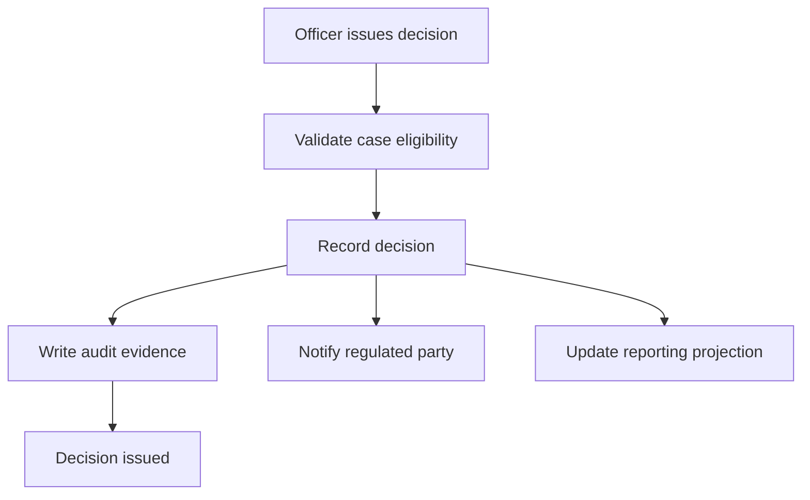

Kita bisa label:

| Step | Path Type | Failure Policy |
|---|---|---|
| Validate case eligibility | Critical synchronous | Fail closed |
| Record decision | Critical transactional | Must succeed |
| Write audit evidence | Compliance critical | Usually fail closed or durable outbox |
| Notify regulated party | Async required | Retry and monitor |
| Update reporting projection | Async derived | Retry/rebuild allowed |

Jika semua step dibuat synchronous critical path, availability turun dan user experience buruk. Jika semua step async tanpa compliance thinking, correctness dan auditability bisa rusak.

Architecture-level skill adalah membedakan mana yang harus selesai sekarang, mana yang boleh selesai nanti, dan mana yang boleh degraded.

---

## 9. Enterprise Topology Pattern

Berikut topology yang sering sehat untuk sistem enterprise.

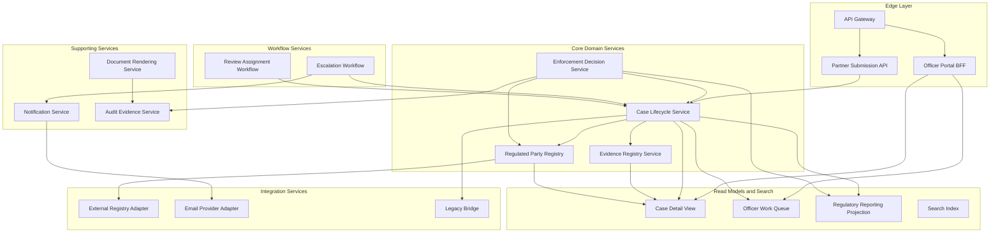

Perhatikan beberapa hal:

1. Edge tidak langsung memanggil semua core service jika read model cukup.
2. Read model mengurangi fan-out UI.
3. Integration service mengisolasi external systems.
4. Workflow service mengoordinasi process panjang.
5. Audit service diperlakukan sebagai compliance capability, bukan log biasa.
6. Core service tetap memiliki data dan invariant-nya.

---

## 10. Topology Smell Catalog

### 10.1 God Gateway

API Gateway berisi business rule.

Smell:

- gateway menentukan eligibility;
- gateway transformasi domain kompleks;
- gateway memanggil database;
- gateway punya release coupling dengan domain changes.

Gateway seharusnya menangani edge concerns:

- routing;
- authentication entry point;
- coarse policy;
- rate limiting;
- request shaping;
- protocol translation terbatas;
- observability edge.

Bukan domain brain.

### 10.2 God BFF

BFF menjadi mini-monolith.

Smell:

- BFF menyimpan workflow state;
- BFF punya business rule lintas domain;
- BFF menjadi dependency semua UI;
- BFF harus deploy setiap domain berubah.

BFF sehat:

- client-specific composition;
- simple orchestration untuk view;
- uses read models;
- no authoritative business decision.

### 10.3 Central Orchestrator Service

Satu service mengatur semua proses.

Smell:

```text
orchestration-service
  calls case
  calls party
  calls evidence
  calls decision
  calls notification
  calls audit
  calls reporting
```

Jika ia generic technical orchestrator, ia cenderung menjadi distributed monolith center.

Workflow orchestration sehat harus process-specific dan punya business meaning.

### 10.4 Shared Reporting Pulling from Everyone

Reporting service query langsung ke semua database.

Smell:

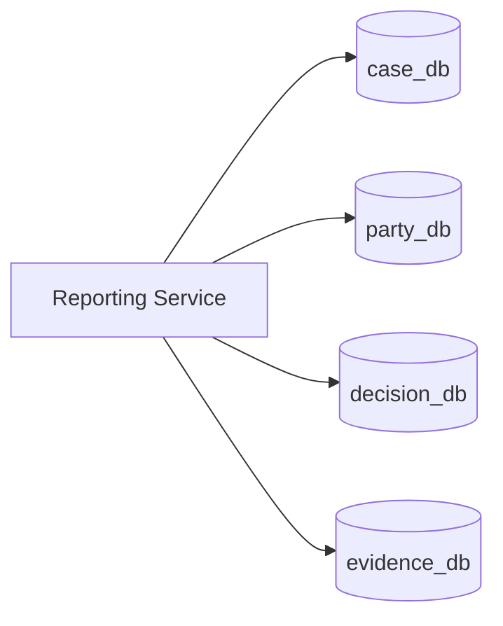

Ini membuat database schema menjadi public contract.

Alternatif lebih sehat:

- event-driven projection;
- CDC dengan ownership agreement;
- analytical replica;
- governed data product;
- explicit export API.

### 10.5 Cyclic Runtime Calls

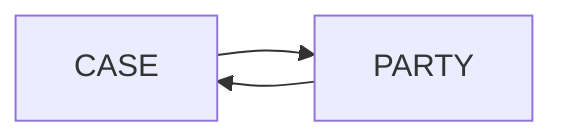

Kadang cycle muncul karena dua service saling butuh data. Solusi biasanya bukan saling call, tetapi:

- ubah ownership;
- tambahkan read model;
- publish event;
- split command/query;
- pindahkan capability ke boundary yang lebih tepat;
- buat domain service baru jika ada concept tersembunyi.

### 10.6 Platform Service as Delivery Bottleneck

Platform service dipakai semua tim, tetapi hanya satu tim kecil bisa mengubahnya.

Smell:

- semua feature butuh perubahan platform;
- platform API terlalu opinionated;
- platform team menjadi approval bottleneck;
- extension mechanism tidak ada.

Platform sehat memberi golden path dan guardrail, bukan menjadi choke point.

---

## 11. Java Implementation: Representing Service Topology as Code

Topology sering tinggal di diagram yang cepat basi. Untuk sistem besar, sebagian topology harus bisa dihasilkan dari config, telemetry, atau metadata.

Contoh service metadata sederhana.

```yaml
service:
  name: case-service
  owner: case-lifecycle-team
  category: core-domain
  systemRole: system-of-record
  dataOwned:
    - case
    - case_assignment
    - case_sla
  synchronousDependencies:
    - service: party-service
      reason: validate regulated party during intake
      criticality: critical
      timeoutMs: 300
      fallback: reject_if_unavailable
    - service: evidence-service
      reason: fetch evidence summary for review
      criticality: degraded
      timeoutMs: 500
      fallback: show_stale_summary
  asynchronousPublications:
    - CaseSubmitted
    - CaseAssigned
    - CaseClosed
  asynchronousSubscriptions:
    - PartyStatusChanged
  slo:
    availability: 99.9
    latencyP95Ms: 250
```

Metadata seperti ini bisa masuk service catalog, docs, atau architecture review pipeline.

### 11.1 Java Record untuk Topology Model

```java
package com.acme.platform.topology;

import java.util.List;

public record ServiceDescriptor(
        String name,
        String owner,
        ServiceCategory category,
        SystemRole systemRole,
        List<String> dataOwned,
        List<SyncDependency> synchronousDependencies,
        List<String> asynchronousPublications,
        List<String> asynchronousSubscriptions,
        ServiceSlo slo
) {}
```

```java
package com.acme.platform.topology;

public enum ServiceCategory {
    CORE_DOMAIN,
    SUPPORTING_DOMAIN,
    PLATFORM,
    EDGE,
    INTEGRATION,
    WORKFLOW,
    READ_MODEL
}
```

```java
package com.acme.platform.topology;

public enum SystemRole {
    SYSTEM_OF_RECORD,
    SYSTEM_OF_ENGAGEMENT,
    SYSTEM_OF_INTELLIGENCE,
    SYSTEM_OF_INTEGRATION,
    DERIVED_PROJECTION
}
```

```java
package com.acme.platform.topology;

public record SyncDependency(
        String service,
        String reason,
        Criticality criticality,
        int timeoutMs,
        String fallback
) {}
```

```java
package com.acme.platform.topology;

public enum Criticality {
    CRITICAL,
    DEGRADED,
    OPTIONAL
}
```

```java
package com.acme.platform.topology;

public record ServiceSlo(
        double availability,
        int latencyP95Ms
) {}
```

### 11.2 Topology Rule: Critical Dependency Harus Punya Timeout

```java
package com.acme.platform.topology.rules;

import com.acme.platform.topology.Criticality;
import com.acme.platform.topology.ServiceDescriptor;

import java.util.List;

public final class TopologyRules {

    public List<String> validate(ServiceDescriptor descriptor) {
        return descriptor.synchronousDependencies().stream()
                .filter(dep -> dep.criticality() == Criticality.CRITICAL)
                .filter(dep -> dep.timeoutMs() <= 0)
                .map(dep -> descriptor.name() + " has critical dependency without timeout: " + dep.service())
                .toList();
    }
}
```

Ini contoh kecil, tetapi mental model-nya penting: architecture topology bisa divalidasi sebagai data.

### 11.3 Rule: Tidak Boleh Circular Dependency

```java
package com.acme.platform.topology.rules;

import com.acme.platform.topology.ServiceDescriptor;

import java.util.*;

public final class CycleDetector {

    public List<List<String>> findCycles(List<ServiceDescriptor> services) {
        Map<String, List<String>> graph = new HashMap<>();
        for (ServiceDescriptor service : services) {
            graph.put(
                    service.name(),
                    service.synchronousDependencies().stream()
                            .map(dep -> dep.service())
                            .toList()
            );
        }

        List<List<String>> cycles = new ArrayList<>();
        Set<String> visited = new HashSet<>();
        Set<String> stack = new HashSet<>();
        Deque<String> path = new ArrayDeque<>();

        for (String node : graph.keySet()) {
            dfs(node, graph, visited, stack, path, cycles);
        }

        return cycles;
    }

    private void dfs(
            String node,
            Map<String, List<String>> graph,
            Set<String> visited,
            Set<String> stack,
            Deque<String> path,
            List<List<String>> cycles
    ) {
        if (stack.contains(node)) {
            List<String> cycle = new ArrayList<>();
            Iterator<String> iterator = path.descendingIterator();
            while (iterator.hasNext()) {
                String current = iterator.next();
                cycle.add(current);
                if (current.equals(node)) break;
            }
            Collections.reverse(cycle);
            cycle.add(node);
            cycles.add(cycle);
            return;
        }

        if (visited.contains(node)) return;

        visited.add(node);
        stack.add(node);
        path.push(node);

        for (String next : graph.getOrDefault(node, List.of())) {
            dfs(next, graph, visited, stack, path, cycles);
        }

        path.pop();
        stack.remove(node);
    }
}
```

Di production, kamu mungkin mengambil graph dari OpenTelemetry traces, service catalog, mesh telemetry, atau API gateway logs. Tapi prinsipnya sama: dependency topology harus diamati dan dijaga.

---

## 12. Topology dan Observability

Kamu tidak bisa mengelola topology yang tidak bisa kamu lihat.

Minimal setiap service harus memancarkan:

- service name;
- version;
- environment;
- owner/team;
- dependency target;
- endpoint/operation;
- latency;
- error status;
- timeout;
- retry count;
- circuit breaker state;
- correlation/trace id.

Dalam Java, OpenTelemetry instrumentation bisa membantu membuat runtime topology dari trace. Tapi instrumentation default tidak cukup jika semantic span buruk.

Contoh span naming yang buruk:

```text
HTTP GET
execute
call
process
```

Contoh lebih baik:

```text
CaseIntake.submitCase
PartyRegistry.validateParty
EvidenceRegistry.fetchEvidenceSummary
DecisionService.issueDecision
```

Span harus membantu memahami domain operation, bukan hanya transport.

---

## 13. Topology Review: Pertanyaan yang Harus Ditanyakan

Saat review architecture diagram microservices, jangan hanya tanya “pakai apa?”. Tanya topology.

### 13.1 Dependency

- Service mana punya in-degree tertinggi?
- Service mana punya out-degree tertinggi?
- Ada dependency cycle?
- Ada dependency yang tidak terlihat di diagram, seperti shared DB atau shared cache?
- Ada service yang menjadi central orchestrator tanpa alasan process yang jelas?

### 13.2 Data

- Siapa system of record untuk setiap data penting?
- Service mana boleh mutate data tersebut?
- Apakah reporting membaca database operasional langsung?
- Apakah ada duplicate data? Kalau ada, mana authoritative dan mana derived?
- Bagaimana reconciliation dilakukan?

### 13.3 Runtime

- User journey critical melewati service mana saja?
- Timeout budget per hop berapa?
- Dependency mana punya fallback?
- Dependency mana fail-open vs fail-closed?
- Apa yang terjadi jika service paling sentral down?

### 13.4 Ownership

- Siapa owner tiap service?
- Siapa owner tiap API/event?
- Siapa on-call?
- Siapa boleh approve breaking change?
- Apakah ownership sesuai business capability?

### 13.5 Evolution

- Service mana sering berubah bersama?
- Service mana release cadence-nya berbeda?
- Service mana kandidat split/merge?
- Service mana punya unclear purpose?
- Service mana hanya wrapper database?

---

## 14. Service Merge juga Valid

Engineer sering berpikir arsitektur evolutif berarti terus memecah service. Salah.

Kadang keputusan terbaik adalah merge service.

Merge layak dipertimbangkan jika:

- dua service selalu berubah bersama;
- dua service selalu deploy bersama;
- ada synchronous cycle yang tidak masuk akal;
- data ownership sebenarnya satu aggregate/business capability;
- latency antar service tidak memberi nilai isolation;
- ownership team sama;
- separation hanya historis atau politis.

Contoh:

```text
case-status-service
case-assignment-service
case-sla-service
```

Jika ketiganya selalu bagian dari Case Lifecycle, mungkin lebih sehat menjadi satu `Case Lifecycle Service` atau satu module dalam modular monolith.

Microservices maturity bukan jumlah service bertambah. Maturity adalah kemampuan mengubah topology sesuai pemahaman domain dan constraint yang makin baik.

---

## 15. Topology untuk Regulatory Case Management

Mari susun topology awal untuk domain regulatory case management.

### 15.1 Core Domain

| Service | Role | Data Owned |
|---|---|---|
| Case Lifecycle Service | System of Record | case, assignment, SLA, lifecycle state |
| Evidence Registry Service | System of Record | evidence metadata, custody state |
| Enforcement Decision Service | System of Record | decision, rationale, approval state |
| Regulated Party Registry | System of Record | party identity, regulated status |

### 15.2 Workflow

| Service | Role | Responsibility |
|---|---|---|
| Case Escalation Workflow | Process coordinator | SLA breach, escalation, reassignment |
| Evidence Request Workflow | Process coordinator | request, reminder, timeout, closure |
| Decision Approval Workflow | Process coordinator | approval chain, delegation, timeout |

### 15.3 Read Models

| Service | Role | Sources |
|---|---|---|
| Officer Work Queue | Derived projection | case, SLA, assignment, risk |
| Case Detail View | Derived projection | case, party, evidence, decision |
| Regulatory Reporting Projection | Derived projection | case, decision, audit |
| Search Index | Derived projection | selected indexed data |

### 15.4 Supporting / Platform

| Service | Role | Failure Policy |
|---|---|---|
| Notification Service | Supporting | async retry |
| Document Rendering Service | Supporting | retry/degraded depending use case |
| Audit Evidence Service | Compliance support/core-adjacent | durable, often fail-closed |
| Feature Flag Service | Platform | cached fallback |
| Observability Collector | Platform | should not block business flow |

### 15.5 Integration

| Service | External Dependency | Responsibility |
|---|---|---|
| External Company Registry Adapter | company registry | validation, mapping, rate limit |
| Email Provider Adapter | email provider | send email, handle provider failures |
| Legacy Case Bridge | legacy database/API | anti-corruption, migration bridge |

---

## 16. Topology Decision Example: Case Detail Page

Naive design:

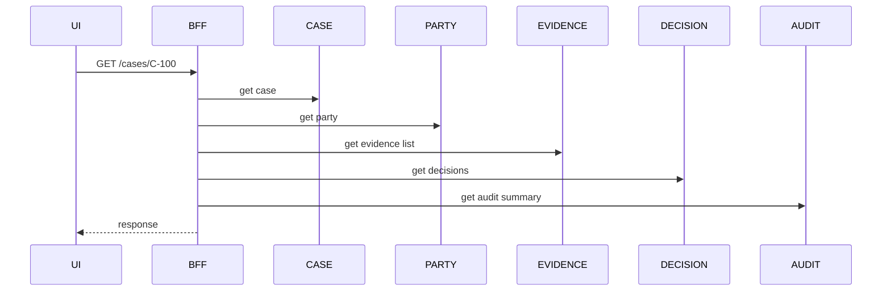

Better topology for high-traffic page:

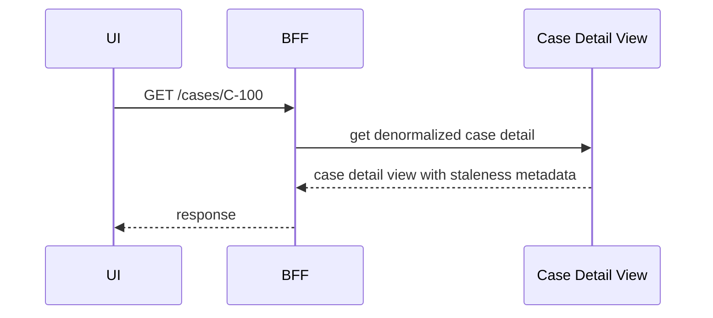

`Case Detail View` dibangun dari event:

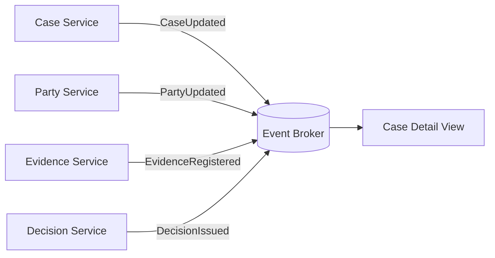

Trade-off:

| Aspect | Synchronous Fan-Out | Read Model |
|---|---|---|
| Freshness | Lebih fresh | Eventually consistent |
| Availability | Tergantung banyak service | Lebih stabil untuk read |
| Latency | Fan-out latency | Single query latency |
| Complexity | Runtime dependency complex | Projection complexity |
| Debugging | Distributed call tracing | Event/projection tracing |

Tidak ada pilihan gratis. Tapi topology read model sering lebih sehat untuk page agregat yang sering dibaca.

---

## 17. Topology Decision Example: Issue Decision

Use case issue decision berbeda. Ini command critical.

Tidak semua hal boleh eventual.

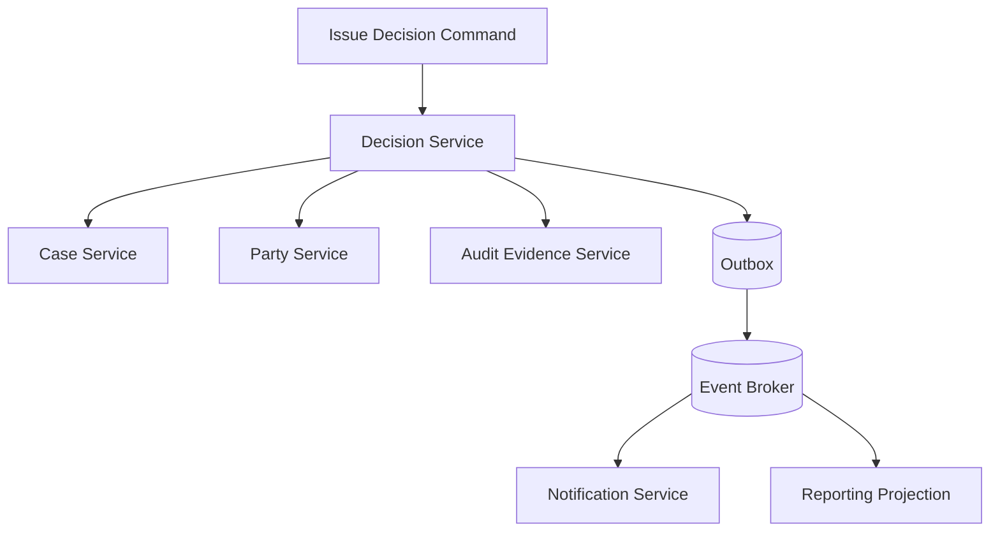

Pertanyaan topology:

- Apakah `Decision Service` harus sync validate `Case Service`?
- Apakah eligibility data bisa dicache/projection?
- Apakah `Audit Evidence Service` harus sync atau cukup durable outbox?
- Apakah notification boleh async? Biasanya ya.
- Apakah reporting boleh async? Biasanya ya.

Untuk regulated decision, audit mungkin critical. Tapi implementasinya bisa:

1. write decision + audit event ke outbox dalam transaksi lokal;
2. publish event reliably;
3. Audit Evidence Service consume dan materialize evidence;
4. decision dianggap issued setelah durable business event tersimpan, bukan setelah email terkirim.

Topology seperti ini memisahkan critical correctness dari supporting side effect.

---

## 18. Topology Metrics

Gunakan metric untuk memahami topology.

### 18.1 Runtime Graph Metrics

- average dependencies per request;
- p95 dependency fan-out;
- top 10 services by in-degree;
- top 10 services by out-degree;
- cycle count;
- critical path length;
- dependency latency contribution;
- timeout rate per dependency;
- retry rate per dependency.

### 18.2 Change Graph Metrics

- services changed per feature;
- services deployed per release;
- coordinated deployment frequency;
- contract break frequency;
- consumer impact count;
- rollback scope.

### 18.3 Ownership Metrics

- services per team;
- orphan services;
- services without on-call;
- APIs without owner;
- topics without owner;
- stale service catalog entries.

### 18.4 Data Ownership Metrics

- tables with multiple writers;
- services reading another service database;
- duplicate data without source marker;
- projections without rebuild path;
- data products without owner.

Metric ini bukan KPI kosmetik. Ini architecture health signal.

---

## 19. Topology Governance tanpa Bureaucracy

Enterprise architecture sering gagal karena governance terlalu lambat. Tapi tanpa governance, microservices menjadi sprawl.

Prinsip governance sehat:

1. **Lightweight by default**  
   Gunakan template dan automated checks.

2. **Risk-based review**  
   Service kecil non-critical tidak butuh review berat. Service yang menjadi system of record atau high in-degree perlu review lebih dalam.

3. **Fitness function over committee**  
   Validasi dependency, ownership, SLO, compatibility secara otomatis bila bisa.

4. **Service catalog sebagai source of truth**  
   Jangan biarkan topology hanya hidup di kepala senior engineer.

5. **Review topology changes, not every code change**  
   Tambah dependency critical baru? Review. Ubah owner data? Review. Tambah endpoint internal biasa? Tidak perlu committee besar.

---

## 20. Service Catalog Minimum

Setiap service harus punya metadata minimum:

```yaml
name: enforcement-decision-service
owner: enforcement-decision-team
slack: '#team-decision'
oncall: decision-primary
category: core-domain
systemRole: system-of-record
runtimeCriticality: high
businessCriticality: high
containsSensitiveData: true
ownsData:
  - enforcement_decision
  - decision_rationale
  - decision_approval
publishesEvents:
  - DecisionDrafted
  - DecisionApproved
  - DecisionIssued
subscribesEvents:
  - CaseSubmitted
  - CaseClosed
syncDependencies:
  - case-service
  - party-service
asyncDependencies:
  - audit-evidence-service
  - notification-service
slo:
  availability: 99.9
  latencyP95Ms: 300
runbook: https://internal/runbooks/enforcement-decision-service
adr:
  - ADR-014-decision-service-boundary
  - ADR-027-decision-audit-outbox
```

Service catalog yang baik menjawab dua pertanyaan saat incident:

1. “Siapa yang bertanggung jawab?”
2. “Apa konsekuensi jika ini gagal?”

---

## 21. Topology Review Checklist

Gunakan checklist ini saat mendesain sistem baru atau mereview sistem lama.

### Service Purpose

- Apakah setiap service punya purpose satu kalimat?
- Apakah purpose-nya business capability, bukan technical wrapper?
- Apakah ada service yang terlalu generic?
- Apakah ada service yang terlalu kecil dan selalu dipakai bersama service lain?

### Dependency

- Apakah dependency direction masuk akal secara domain?
- Apakah ada cycle?
- Apakah ada service dengan fan-out tinggi di critical path?
- Apakah dependency critical punya timeout, fallback, dan SLO?

### Data

- Apakah setiap data penting punya system of record?
- Apakah ada shared database?
- Apakah duplicate data diberi label derived?
- Apakah read model punya rebuild/reconciliation path?

### Runtime

- Apakah critical user journey sudah dipetakan?
- Apakah path command dan query dibedakan?
- Apakah supporting side effect dibuat async bila aman?
- Apakah blast radius dependency tinggi sudah dikurangi?

### Ownership

- Apakah tiap service punya owner?
- Apakah owner sesuai capability?
- Apakah service punya runbook?
- Apakah service punya SLO?

### Evolution

- Apakah topology mendukung extraction/merge nanti?
- Apakah contract evolution strategy ada?
- Apakah service catalog diperbarui otomatis/semi-otomatis?
- Apakah topology bisa diamati dari telemetry?

---

## 22. Latihan

Buat topology map untuk sistem yang kamu kerjakan.

### 22.1 Service Classification

| Service | Category | System Role | Owner | Data Owned | Criticality |
|---|---|---|---|---|---|
|  | Core Domain / Edge / Integration / Read Model / Platform | SoR / Engagement / Intelligence / Integration / Projection |  |  |  |

### 22.2 Dependency Classification

| From | To | Sync/Async | Reason | Criticality | Timeout | Fallback |
|---|---|---|---|---|---|---|
|  |  |  |  |  |  |  |

### 22.3 Blast Radius

| Failure | User Impact | Business Impact | Compliance Impact | Degraded Mode |
|---|---|---|---|---|
| Service X down |  |  |  |  |
| Event broker delayed |  |  |  |  |
| Read model stale |  |  |  |  |
| External registry unavailable |  |  |  |  |

### 22.4 Review Questions

1. Service mana yang punya in-degree tertinggi?
2. Service mana yang punya out-degree tertinggi?
3. Ada cycle?
4. Ada shared database atau hidden dependency?
5. Service mana yang sebaiknya digabung?
6. Service mana yang sebaiknya dipecah?
7. User journey mana yang paling rentan cascading failure?
8. Dependency mana yang bisa diganti read model atau event?

---

## 23. Ringkasan

Topology microservices bukan daftar service. Topology adalah graph dependency, data authority, ownership, runtime path, dan failure impact.

Service dalam enterprise system punya peran berbeda:

- core domain service;
- supporting service;
- platform service;
- edge service;
- integration service;
- workflow service;
- read model service.

Sistem yang sehat tidak hanya punya service yang “kecil”. Ia punya topology yang membuat perubahan, failure, ownership, dan data authority dapat dipahami.

Rule utama:

> You cannot operate what you cannot map. You cannot evolve what you cannot reason about.

Sebelum menambah service baru, lihat graph-nya. Kadang jawaban terbaik bukan membuat node baru, tetapi mengurangi edge yang salah.

---

## 24. Referensi

- Martin Fowler — Microservices
- Martin Fowler — Microservice Trade-Offs
- Chris Richardson / microservices.io — Database per Service Pattern
- Chris Richardson / microservices.io — Saga Pattern
- Google SRE Book — Cascading Failures and Addressing Cascading Failures
- OpenTelemetry Documentation — distributed tracing concepts
- Team Topologies — stream-aligned team, platform team, enabling team, complicated-subsystem team
