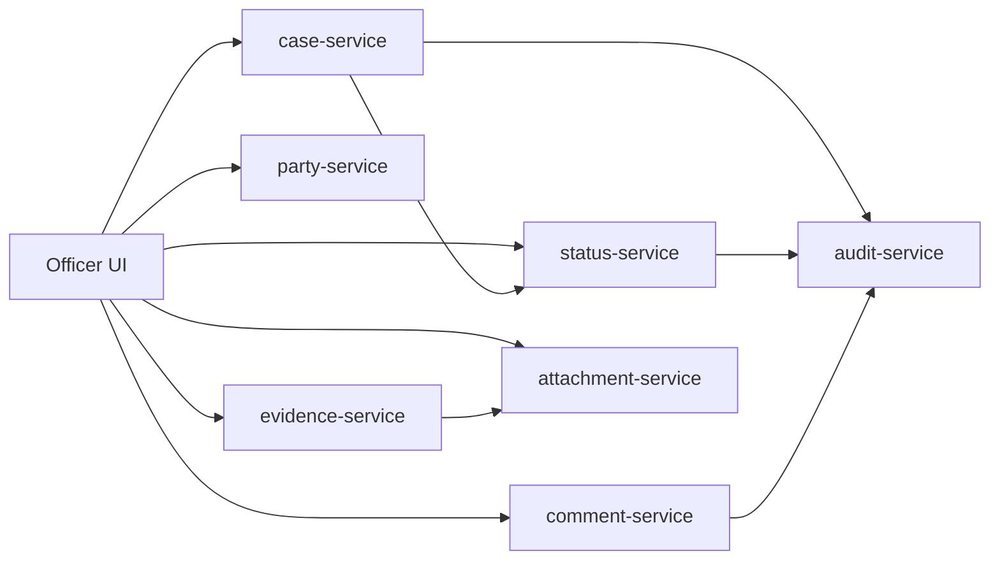
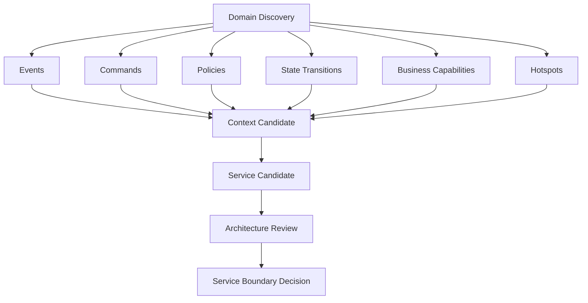
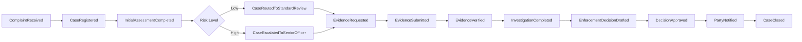
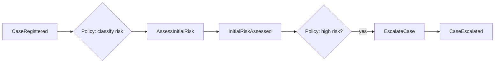
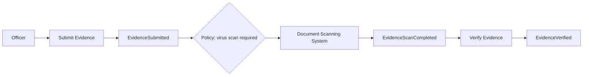
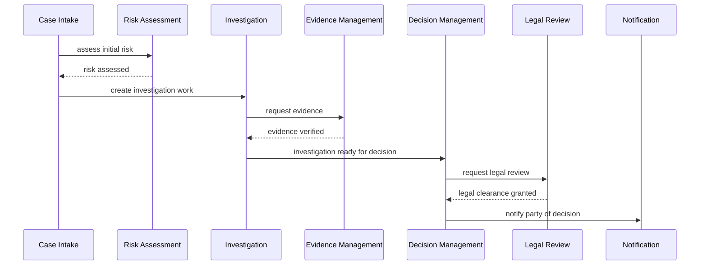
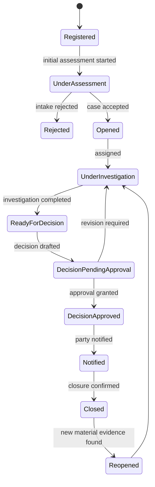
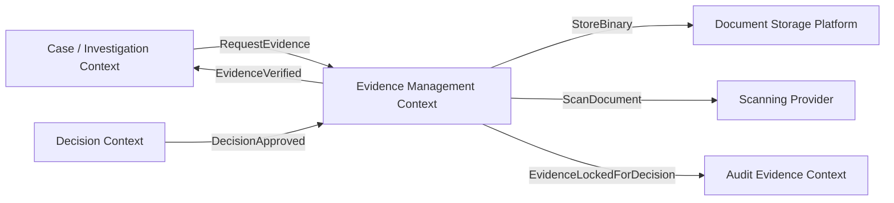
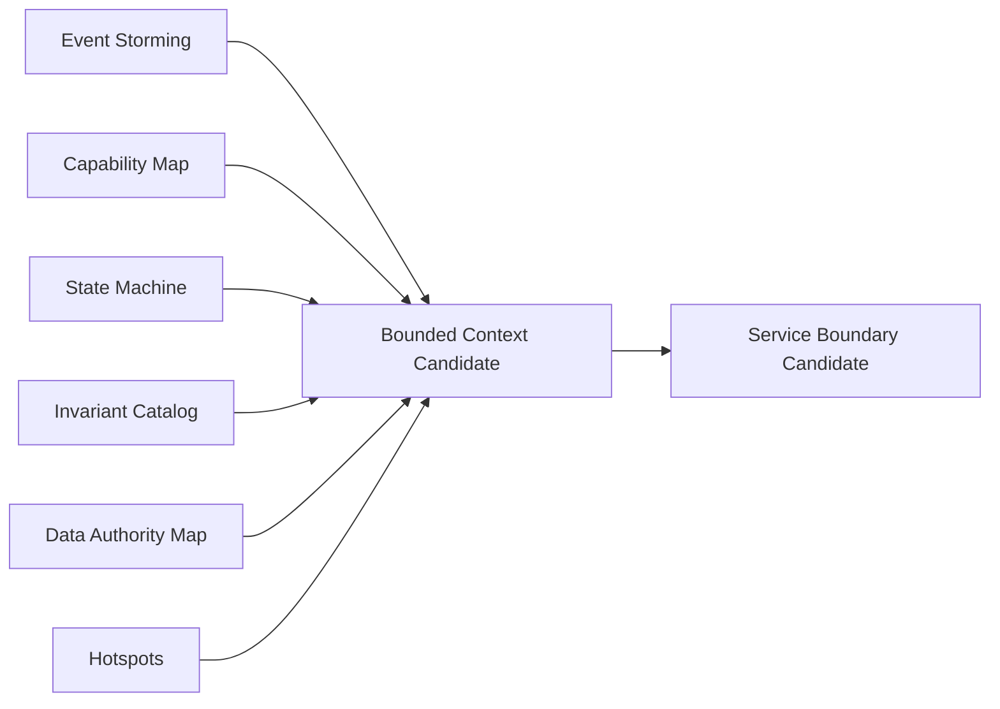

# Part 007 — Domain Discovery for Microservices

Microservices yang bagus jarang lahir dari diagram teknis pertama.

Microservices yang bagus lahir dari pemahaman yang tajam tentang:

- bisnis melakukan apa;
- keputusan penting dibuat di mana;
- state berubah karena event apa;
- aturan mana yang menjaga invariant;
- data mana yang authoritative;
- proses mana yang panjang dan lintas tim;
- perubahan biasanya datang dari area mana;
- kegagalan area mana yang tidak boleh menyebar;
- siapa owner operasional dari capability tersebut.

Itulah domain discovery.

Banyak tim langsung mulai dari pertanyaan:

> Service apa saja yang perlu kita buat?

Pertanyaan itu terlalu cepat.

Pertanyaan yang lebih kuat:

> Bagaimana domain bekerja, berubah, gagal, dan dipertanggungjawabkan?

Kalau kamu belum bisa menjawab itu, daftar service-mu hampir pasti hanya menyalin nama tabel, halaman UI, atau struktur organisasi lama.

Dalam microservices, service boundary adalah keputusan mahal. Boundary yang salah menciptakan latency, distributed transaction, event soup, data duplication, dan ownership conflict. Domain discovery adalah cara untuk mengurangi tebakan sebelum boundary ditetapkan.

---

## 1. Tujuan Part Ini

Setelah bagian ini, kamu harus bisa:

1. Menjelaskan mengapa domain discovery harus terjadi sebelum service decomposition.
2. Membedakan entity, process, capability, policy, event, dan bounded context candidate.
3. Menggunakan event storming sebagai alat menemukan domain behavior, bukan sekadar workshop sticky note.
4. Membuat capability map yang dapat diturunkan menjadi kandidat service.
5. Mengidentifikasi hotspot, invariant, state transition, dan ownership ambiguity.
6. Mengubah hasil discovery menjadi service candidate matrix.
7. Menolak decomposition yang terlihat rapi tetapi menghasilkan distributed monolith.

---

## 2. Mental Model: Domain Discovery adalah Reverse Engineering of Business Reality

Domain discovery bukan kegiatan menggambar architecture diagram.

Domain discovery adalah usaha untuk menemukan struktur realitas bisnis yang selama ini tersembunyi di:

- percakapan subject matter expert;
- SOP;
- spreadsheet manual;
- exception handling;
- escalation rule;
- approval chain;
- regulatory obligation;
- audit trail;
- database legacy;
- UI form;
- email antar tim;
- batch job malam;
- laporan manajemen;
- komplain user;
- incident production.

Microservices memecah sistem berdasarkan responsibility. Masalahnya, responsibility sering tidak tertulis secara eksplisit.

Contoh:

```text
"Case service mengurus case."
```

Kalimat itu terlihat jelas, tetapi terlalu dangkal.

Apa itu `case`?

- Apakah case adalah laporan awal?
- Apakah case adalah investigasi aktif?
- Apakah case adalah container untuk allegation?
- Apakah case adalah unit kerja officer?
- Apakah case adalah unit pelaporan regulator?
- Apakah case adalah subject of enforcement decision?
- Apakah case masih case setelah ditutup?
- Siapa yang boleh reopen case?
- Apakah satu case bisa punya banyak enforcement action?
- Apakah case closure membekukan evidence?
- Apakah case status authoritative untuk notification?

Sebelum pertanyaan ini dijawab, `case-service` hanya nama repository.

Domain discovery mengubah kata benda menjadi model perilaku.

---

## 3. Kesalahan Awal: Decomposition by Noun

Tim sering melihat domain lalu mengambil semua kata benda sebagai service:

```text
case-service
party-service
evidence-service
document-service
user-service
notification-service
comment-service
attachment-service
status-service
```

Ini tampak natural karena database dan UI biasanya berbasis noun.

Tapi microservices tidak boleh hanya mengikuti noun.

Masalah decomposition by noun:

1. **Entity tidak selalu capability**  
   `Comment` mungkin hanya bagian dari case collaboration, bukan service mandiri.

2. **Entity tidak selalu punya lifecycle independen**  
   `Attachment` mungkin tidak punya business lifecycle sendiri selain sebagai evidence artifact.

3. **Entity sering cross-context**  
   `Party` dalam compliance, billing, legal, dan identity bisa berarti berbeda.

4. **Noun decomposition menghasilkan chatty API**  
   Satu use case user memanggil 8 service hanya untuk melakukan satu keputusan.

5. **Invariant tersebar**  
   Aturan bisnis tidak punya rumah yang jelas.

6. **Transaction boundary menjadi kacau**  
   Semua operation tampak butuh distributed transaction.

7. **Ownership tidak natural**  
   Tim tidak tahu siapa yang bertanggung jawab atas perubahan rule.

Contoh buruk:



Diagram ini tampak modular, tetapi behavior-nya tersebar.

Pertanyaan penting:

> Di mana rule “case tidak boleh ditutup jika mandatory evidence belum diverifikasi” hidup?

Pilihan buruk:

- di UI;
- di `case-service` dengan remote call ke `evidence-service`;
- di `status-service`;
- di workflow service tanpa domain ownership;
- di database trigger;
- di semua tempat sedikit-sedikit.

Domain discovery harus menemukan **natural home of rule** sebelum service dibelah.

---

## 4. Decomposition by Table Juga Berbahaya

Bentuk lain dari decomposition by noun adalah decomposition by table.

Legacy schema:

```text
CASE
CASE_STATUS
CASE_PARTY
CASE_EVIDENCE
CASE_DECISION
CASE_NOTE
CASE_ASSIGNMENT
CASE_AUDIT
```

Tim lalu membuat:

```text
case-service
case-status-service
case-party-service
case-evidence-service
case-decision-service
case-note-service
case-assignment-service
case-audit-service
```

Ini bukan microservices. Ini database schema yang dipindah ke network.

Akibatnya:

- join berubah menjadi REST call;
- transaction berubah menjadi saga palsu;
- foreign key berubah menjadi runtime dependency;
- stored procedure berubah menjadi orchestration spaghetti;
- database contention berubah menjadi network contention;
- debug query berubah menjadi distributed trace maze.

Microservices bukan “normalized database over HTTP”.

Microservices harus merepresentasikan **business capability with ownership and behavior**.

---

## 5. Unit Discovery yang Benar

Untuk menemukan service boundary, kamu tidak mulai dari service.

Kamu mulai dari unit-unit domain berikut.

| Unit | Pertanyaan | Contoh |
|---|---|---|
| Event | Apa yang sudah terjadi dan penting bagi bisnis? | `CaseRegistered`, `EvidenceVerified`, `DecisionApproved` |
| Command | Apa intensi user/system untuk mengubah state? | `RegisterCase`, `SubmitEvidence`, `ApproveDecision` |
| Policy | Aturan apa yang bereaksi terhadap event? | Ketika case high-risk, assign senior officer |
| Aggregate | State apa yang harus menjaga invariant secara konsisten? | Case lifecycle, decision approval |
| Capability | Kemampuan bisnis apa yang menghasilkan value? | Case Intake, Evidence Management, Enforcement Decisioning |
| Process | Urutan aktivitas lintas capability apa yang menghasilkan outcome? | Investigation-to-Enforcement |
| Context | Bahasa dan model mana yang valid dalam batas tertentu? | Investigation Context, Decision Context |
| Owner | Tim mana yang bertanggung jawab mengubah dan mengoperasikan capability? | Case Operations Team, Legal Decision Team |

Service baru muncul setelah unit-unit ini cukup jelas.



Urutannya penting.

Kalau kamu langsung lompat ke service, kamu kehilangan evidence.

---

## 6. Event Storming: Melihat Domain sebagai Aliran Fakta

Event storming adalah teknik discovery kolaboratif untuk memahami domain melalui event bisnis.

Bukan “kita tempel sticky note lalu foto”.

Yang dicari adalah:

- apa yang terjadi;
- siapa yang memicu;
- command apa yang menyebabkan;
- policy apa yang bereaksi;
- data apa yang diperlukan;
- external system apa yang terlibat;
- ambiguity apa yang muncul;
- area mana yang penuh conflict;
- istilah mana yang berarti beda bagi stakeholder berbeda.

Event storming kuat karena event ditulis sebagai fakta masa lalu.

Bukan:

```text
Approve Decision
```

Tetapi:

```text
DecisionApproved
```

Kalimat masa lalu memaksa kita berpikir:

- apa artinya approval benar-benar terjadi?
- siapa yang boleh menyatakan approval?
- state apa yang berubah?
- notifikasi apa yang harus terjadi setelahnya?
- audit evidence apa yang wajib ada?
- apakah approval bisa dibatalkan?
- apa event berikutnya?

Event adalah titik observasi domain.

---

## 7. Event Storming Big Picture

Big picture event storming bertujuan memahami proses besar, bukan langsung mendesain software.

Contoh domain regulatory case management:



Ini bukan workflow final.

Ini peta awal untuk bertanya:

- event mana yang paling penting?
- event mana yang diperdebatkan definisinya?
- event mana yang sebenarnya hanya technical event?
- event mana yang berhubungan dengan regulator?
- event mana yang mengubah hak/kewajiban pihak terkait?
- event mana yang harus immutable?
- event mana yang boleh direkonstruksi?

Event storming yang baik menghasilkan diskusi, bukan diagram indah.

---

## 8. Event Naming Rule

Event harus dinamai sebagai fakta bisnis, bukan operasi teknis.

| Buruk | Lebih Baik | Kenapa |
|---|---|---|
| `CaseUpdated` | `CaseRiskLevelChanged` | Lebih spesifik secara bisnis |
| `DataSaved` | `EvidenceSubmitted` | Menghindari technical event |
| `StatusChanged` | `CaseEscalatedToSeniorOfficer` | Mengungkap meaning, bukan field |
| `DecisionProcessed` | `DecisionApproved` / `DecisionRejected` | Memisahkan outcome |
| `NotificationSent` | `PartyNotifiedOfDecision` | Menjelaskan tujuan bisnis |

Event yang terlalu generik menyembunyikan domain.

Kalau semua event bernama `Updated`, `Changed`, `Processed`, kamu belum menemukan domain. Kamu baru menemukan CRUD.

---

## 9. Command: Intensi yang Mengubah State

Command adalah permintaan untuk melakukan sesuatu.

Event adalah fakta bahwa sesuatu sudah terjadi.

```text
Command: RegisterCase
Event: CaseRegistered

Command: VerifyEvidence
Event: EvidenceVerified

Command: ApproveDecision
Event: DecisionApproved
```

Command bisa gagal. Event tidak boleh “gagal” karena event berarti sudah terjadi.

Command mengandung intensi dan parameter.

```java
public record RegisterCaseCommand(
        String externalReference,
        String complainantPartyId,
        String allegationType,
        String intakeChannel,
        String receivedByOfficerId
) {}
```

Event mengandung fakta yang perlu diketahui downstream.

```java
public record CaseRegisteredEvent(
        String caseId,
        String externalReference,
        String complainantPartyId,
        String allegationType,
        String intakeChannel,
        Instant registeredAt
) {}
```

Jangan buru-buru memakai class ini sebagai public integration event. Pada tahap discovery, ini adalah model pemahaman.

Pertanyaan discovery untuk command:

- siapa aktornya?
- precondition apa yang harus terpenuhi?
- aggregate mana yang menjaga invariant?
- command idempotent atau tidak?
- command bisa ditolak karena apa?
- error-nya business rejection atau technical failure?
- event apa yang muncul jika berhasil?
- audit evidence apa yang harus dicatat?

---

## 10. Policy: Aturan yang Menghubungkan Event dan Command

Policy menjawab:

> Ketika X terjadi, apa yang harus dilakukan karena aturan bisnis?

Contoh:

```text
When CaseRegistered and allegationType is "market abuse",
then AssignCaseToMarketAbuseUnit.
```

```text
When CaseRiskLevelChanged to HIGH,
then EscalateCaseToSeniorOfficer.
```

```text
When EvidenceVerified and all mandatory evidence are verified,
then MarkInvestigationReadyForDecision.
```

Dalam event storming, policy sering menjadi tempat business rule penting muncul.



Policy bisa menjadi:

- domain rule di aggregate;
- application service orchestration;
- workflow step;
- decision table;
- external policy engine;
- human review rule;
- scheduled rule.

Discovery belum menentukan implementasi. Discovery hanya memastikan rule terlihat.

---

## 11. Read Model: Data yang Dibutuhkan untuk Membuat Keputusan

Dalam event storming, read model bukan CQRS dulu.

Read model berarti:

> Informasi apa yang harus dilihat aktor untuk menjalankan command?

Contoh:

Command:

```text
ApproveDecision
```

Officer/legal approver butuh melihat:

- case summary;
- allegation list;
- verified evidence list;
- previous enforcement history;
- risk score;
- recommended sanction;
- legal basis;
- draft decision;
- audit checklist.

Ini tidak berarti semua data harus dimiliki `decision-service`.

Tapi ini memberi sinyal bahwa ada kebutuhan composition/read model.

Kalau satu command butuh 10 data dari 10 service secara synchronous, ada risiko:

- chatty dependency;
- high latency;
- fragile approval flow;
- poor UX;
- hidden reporting service;
- wrong boundary.

Discovery harus mencatat read model karena query need sering memengaruhi boundary.

---

## 12. External System: Jangan Disembunyikan

External system sering terlihat sebagai detail integrasi.

Padahal ia memengaruhi boundary besar.

Contoh external system:

- identity provider;
- payment gateway;
- document management system;
- regulator registry;
- court filing system;
- email/SMS provider;
- data warehouse;
- legacy case database;
- sanctions registry;
- KYC provider.

Dalam event storming, external system harus terlihat sebagai node.



Pertanyaan discovery:

- external system authoritative untuk data apa?
- SLA-nya berapa?
- apa failure mode-nya?
- apakah call harus synchronous?
- apakah integrasi butuh retry?
- apakah ada duplicate callback?
- apakah data dari external system legal evidence?
- apakah perlu anti-corruption layer?

External system yang buruk reliability-nya tidak boleh berada di critical path tanpa strategi degradasi.

---

## 13. Hotspot: Area yang Paling Bernilai

Hotspot adalah area domain yang:

- banyak diperdebatkan;
- sering berubah;
- punya risiko hukum tinggi;
- punya aturan rumit;
- punya exception banyak;
- punya ownership tidak jelas;
- punya incident berulang;
- sulit dijelaskan SME;
- berbeda antara kebijakan tertulis dan praktik lapangan.

Dalam workshop, hotspot sering muncul sebagai kalimat:

```text
"Biasanya begitu, tapi kalau case high profile beda."
"Sebenarnya status closed bisa dibuka lagi kalau ada evidence baru."
"Legal team tidak menyebut itu approval, mereka menyebut clearance."
"Kalau party sudah sanctioned, notification tidak boleh langsung dikirim."
"Audit minta alasan keputusan, bukan hanya status."
```

Hotspot jangan diabaikan.

Hotspot adalah sinyal boundary.

Area dengan rule rumit dan perubahan tinggi mungkin perlu context/service sendiri, atau minimal module boundary yang kuat.

---

## 14. Capability Mapping

Capability adalah kemampuan bisnis untuk menghasilkan outcome.

Capability bukan proses tunggal. Capability juga bukan entity.

Contoh capability dalam regulatory case management:

```text
Case Intake
Risk Assessment
Evidence Management
Investigation Management
Decision Drafting
Legal Review
Enforcement Action Management
Party Notification
Appeal Handling
Audit Evidence Management
Regulatory Reporting
```

Capability menjawab:

> Bisnis harus mampu melakukan apa agar value tercipta?

Capability biasanya lebih stabil daripada proses dan UI.

UI bisa berubah. Workflow bisa berubah. Database bisa berubah. Tapi capability seperti `Evidence Management` cenderung tetap ada selama domainnya ada.

Itulah mengapa microservices sering lebih sehat bila disusun sekitar capability.

---

## 15. Capability vs Process vs Entity

Jangan campur tiga hal ini.

| Dimensi | Entity | Process | Capability |
|---|---|---|---|
| Menjawab | Benda apa? | Langkah apa? | Kemampuan apa? |
| Stabilitas | Sedang | Bisa berubah | Relatif tinggi |
| Contoh | Case, Evidence, Decision | Intake-to-Closure | Investigation Management |
| Risiko jika jadi service | CRUD service | Workflow service terlalu besar | Biasanya lebih natural |
| Fokus | Data | Urutan | Responsibility |

Contoh:

```text
Entity: Evidence
Process: Submit -> Scan -> Verify -> Attach -> Use in Decision
Capability: Evidence Management
```

Service candidate yang sehat kemungkinan bukan `file-service`, tetapi `evidence-management-service` atau modul evidence dalam investigation context.

---

## 16. Capability Map Bertingkat

Capability map harus hierarchical.

Contoh:

```text
Regulatory Enforcement
├── Case Intake
│   ├── Complaint Registration
│   ├── Case Classification
│   └── Intake Validation
├── Investigation Management
│   ├── Assignment Management
│   ├── Evidence Request
│   ├── Evidence Verification
│   └── Investigation Closure
├── Decision Management
│   ├── Draft Decision
│   ├── Legal Review
│   ├── Approval
│   └── Decision Publication
├── Enforcement Action Management
│   ├── Sanction Creation
│   ├── Enforcement Tracking
│   └── Compliance Monitoring
└── Audit and Reporting
    ├── Audit Evidence Capture
    ├── Regulatory Report Generation
    └── Decision Trace Reconstruction
```

Jangan langsung jadikan semua leaf sebagai service.

Capability map adalah bahan analisis, bukan daftar service final.

---

## 17. Capability Heatmap

Untuk service decomposition, capability harus diberi sinyal.

| Capability | Volatility | Complexity | Compliance Risk | Scale Need | Ownership Clarity | Boundary Candidate |
|---|---:|---:|---:|---:|---:|---|
| Case Intake | Medium | Medium | High | Medium | High | Strong |
| Evidence Management | High | High | High | High | Medium | Strong |
| Legal Review | High | High | Very High | Low | High | Strong |
| Notification | Low | Low | Medium | High | High | Supporting/platform |
| Audit Evidence | Medium | High | Very High | Medium | High | Strong |
| Reporting | High | Medium | High | High | Medium | Separate read model |

Interpretasi:

- high compliance risk meningkatkan kebutuhan audit boundary;
- high scale need bisa memisahkan runtime service;
- high volatility bisa memerlukan ownership terpisah;
- low ownership clarity berarti discovery belum cukup;
- high complexity + high volatility + clear ownership sering menjadi service candidate kuat.

---

## 18. Process Mapping: Melihat End-to-End Journey

Capability map menunjukkan kemampuan. Process map menunjukkan aliran kerja.

Contoh process:

```text
Complaint received
-> Case registered
-> Initial risk assessed
-> Case assigned
-> Evidence requested
-> Evidence submitted
-> Evidence verified
-> Investigation completed
-> Decision drafted
-> Legal reviewed
-> Decision approved
-> Party notified
-> Case closed
```

Process penting karena user journey sering lintas capability.



Kalau proses end-to-end butuh banyak service, itu tidak otomatis salah.

Yang perlu dicek:

- apakah setiap boundary punya alasan bisnis?
- apakah communication async/sync sesuai kebutuhan?
- apakah user butuh konsistensi langsung?
- apakah ada long-running state?
- siapa owner process orchestration?
- apakah failure dapat dipulihkan?

---

## 19. State Machine Discovery

Domain yang serius hampir selalu punya lifecycle.

Dalam regulatory system, lifecycle bukan detail UI. Lifecycle adalah kontrol legal dan operasional.

Contoh case lifecycle:



State machine membantu menemukan:

- allowed transition;
- forbidden transition;
- event yang mengubah state;
- role yang boleh trigger transition;
- audit requirement per transition;
- SLA per state;
- escalation rule;
- compensation path;
- reopen logic;
- concurrency risk.

Boundary sering mengikuti lifecycle authority.

Jika satu lifecycle memiliki invariant kuat dan owner jelas, ia mungkin menjadi aggregate atau service boundary.

---

## 20. Invariant Discovery

Invariant adalah aturan yang harus selalu benar.

Contoh:

```text
Case cannot be closed unless all mandatory evidence has been verified.
```

```text
Decision cannot be approved by the same officer who drafted it.
```

```text
A high-risk case must have at least one senior officer assigned.
```

```text
Party notification cannot be sent before decision approval is legally effective.
```

```text
Evidence used in an approved decision must remain immutable.
```

Invariant adalah sinyal kuat untuk boundary.

Jika dua data harus konsisten atomically untuk menjaga invariant, mereka sebaiknya berada dalam transaction boundary yang sama.

Jika invariant bisa dijaga eventual dengan compensation, mereka boleh berada di boundary berbeda.

Contoh:

| Invariant | Kemungkinan Boundary |
|---|---|
| Decision approval membutuhkan legal clearance dan drafter berbeda dari approver | Decision context/service |
| Case closure membutuhkan investigation completed | Case lifecycle atau Investigation context harus authoritative |
| Evidence immutable setelah decision approved | Evidence context perlu menerima event `DecisionApproved` |
| Party notification setelah decision effective | Notification bukan owner decision; hanya bereaksi |

Jangan pecah data yang harus menjaga invariant atomically hanya karena “ingin microservices”.

---

## 21. Ownership Discovery

Boundary tanpa ownership tidak lengkap.

Pertanyaan ownership:

- siapa yang menerima requirement perubahan?
- siapa yang on-call ketika service gagal?
- siapa yang bisa memutuskan rule berubah?
- siapa yang memahami domain language?
- siapa yang bertanggung jawab atas audit dan compliance?
- siapa yang merawat data quality?
- siapa yang berhak menolak consumer coupling?

Ownership buruk:

```text
case-service dimiliki backend team
```

Ownership lebih baik:

```text
Case Intake capability dimiliki Case Operations Platform Team.
Mereka bertanggung jawab atas registration, initial classification, duplicate detection,
and intake audit evidence.
```

Microservices tanpa ownership hanya memindahkan koordinasi dari codebase ke meeting.

---

## 22. Data Authority Discovery

Domain discovery harus menemukan source of truth.

Untuk setiap data penting, tanya:

- siapa authoritative owner?
- data ini dibuat di mana?
- data ini diubah karena command apa?
- event apa yang mempublikasikan perubahan?
- siapa boleh menyimpan copy?
- copy boleh stale berapa lama?
- siapa bertanggung jawab jika data salah?

Contoh:

| Data | Authoritative Owner | Copy Allowed? | Staleness Tolerance |
|---|---|---|---|
| Case lifecycle status | Case Lifecycle Context | Yes | Low |
| Evidence verification result | Evidence Context | Yes | Medium |
| Legal clearance | Decision/Legal Review Context | Yes | Low |
| Notification delivery status | Notification Context | Yes | Medium |
| Audit event | Audit Evidence Context | Append-only | N/A |

Ini belum database design. Ini authority design.

Tanpa authority design, microservices akan kembali ke shared database atau cross-service read chaos.

---

## 23. Discovery Artifact: Command-Event-Policy Table

Salah satu artifact paling berguna adalah tabel command-event-policy.

| Command | Actor | Precondition | Event | Policy Triggered | Candidate Context |
|---|---|---|---|---|---|
| `RegisterCase` | Intake Officer | external reference valid | `CaseRegistered` | classify risk | Case Intake |
| `AssessInitialRisk` | Risk Engine / Officer | case registered | `InitialRiskAssessed` | escalate if high risk | Risk Assessment |
| `SubmitEvidence` | Officer / External Party | evidence request active | `EvidenceSubmitted` | scan evidence | Evidence Management |
| `VerifyEvidence` | Evidence Officer | scan passed | `EvidenceVerified` | mark investigation ready if complete | Evidence Management |
| `DraftDecision` | Decision Officer | investigation complete | `DecisionDrafted` | request legal review | Decision Management |
| `GrantLegalClearance` | Legal Reviewer | decision draft valid | `LegalClearanceGranted` | approve decision if authority exists | Legal Review |
| `ApproveDecision` | Authorized Approver | clearance granted | `DecisionApproved` | notify party, lock evidence | Decision Management |

Gunanya:

- melihat behavior, bukan noun;
- menemukan context candidate;
- menemukan policy chain;
- menemukan synchronous/asynchronous boundary;
- menemukan event yang perlu dipublikasikan;
- menemukan command yang butuh idempotency;
- menemukan invariant location.

---

## 24. Discovery Artifact: Context Candidate Board

Setelah event storming dan capability map, buat board kandidat context.

```text
Context Candidate: Evidence Management
Purpose:
  Manage lifecycle of evidence request, submission, scanning, verification, immutability.

Owns:
  Evidence request
  Evidence metadata
  Verification status
  Evidence immutability rule

Does not own:
  Case lifecycle
  Decision approval
  Party identity
  Document binary storage platform

Publishes:
  EvidenceRequested
  EvidenceSubmitted
  EvidenceVerified
  EvidenceRejected
  EvidenceLockedForDecision

Consumes:
  CaseOpened
  DecisionApproved
  CaseClosed

Main invariants:
  Evidence cannot be verified before scan passed.
  Evidence used in approved decision cannot be modified.

Hotspots:
  External document scanning latency.
  Legal dispute over evidence admissibility.
  Reopen case with new evidence.

Likely service?
  Strong candidate.
```

Board seperti ini jauh lebih berguna daripada sekadar “buat evidence-service”.

---

## 25. Service Candidate Matrix

Setelah discovery, kamu bisa membuat matrix kandidat service.

| Candidate Service | Capability | Owns Data | Owns Rules | Needs DB? | Communication Style | Risk |
|---|---|---|---|---|---|---|
| Case Intake Service | Complaint registration and case opening | Intake record, initial case metadata | duplicate detection, intake validation | Yes | REST in, events out | Medium |
| Investigation Service | Manage investigation lifecycle | Investigation assignment, progress | investigation completion rules | Yes | REST + events | High |
| Evidence Service | Evidence lifecycle | Evidence metadata, verification | verification, immutability | Yes | REST + async events | High |
| Decision Service | Draft and approve enforcement decision | Decision draft, approval record | approval rule, legal effectiveness | Yes | REST + workflow/events | Very High |
| Notification Service | Deliver messages | delivery request/status | delivery retry, channel policy | Yes | Async preferred | Medium |
| Audit Evidence Service | Immutable audit trail | audit event log | retention, integrity | Yes | Append-only events | Very High |

Matrix ini belum final. Tapi sudah berbasis evidence.

---

## 26. Heuristics: Kapan Candidate Layak Jadi Service?

Candidate lebih layak menjadi service jika:

1. **Punya business capability jelas**  
   Bukan hanya utility atau table wrapper.

2. **Punya data authority**  
   Ada data yang secara natural ia miliki.

3. **Punya rule/invariant sendiri**  
   Ada behavior yang butuh rumah.

4. **Punya lifecycle independen**  
   State-nya tidak selalu ikut entity lain.

5. **Punya owner jelas**  
   Tim bisa mengubah dan mengoperasikan secara mandiri.

6. **Punya change cadence berbeda**  
   Sering berubah secara independen dari capability lain.

7. **Punya scaling/failure profile berbeda**  
   Misalnya evidence storage dan scanning punya load profile khusus.

8. **Punya compliance boundary**  
   Audit, privacy, legal traceability butuh batas eksplisit.

9. **Tidak membutuhkan distributed transaction terus-menerus**  
   Jika setiap command butuh atomic consistency lintas service, boundary-nya salah atau belum matang.

---

## 27. Heuristics: Kapan Candidate Jangan Jadi Service Dulu?

Candidate sebaiknya tidak menjadi service jika:

1. Hanya wrapper CRUD satu tabel.
2. Tidak punya owner operasional.
3. Tidak punya rule bisnis signifikan.
4. Semua request-nya selalu dipanggil bersama service lain.
5. Membuat satu user action menjadi 8 synchronous calls.
6. Data ownership-nya tidak jelas.
7. Masih sering berubah karena domain belum dipahami.
8. Tim belum punya observability dan deployment maturity.
9. Boundary hanya karena struktur organisasi sementara.
10. Lebih tepat sebagai module dalam modular monolith atau dalam service lain.

Keputusan matang kadang berarti tidak membuat microservice baru.

---

## 28. Java Implication: Discovery Harus Mengarah ke Code Shape

Domain discovery tidak berhenti di sticky notes. Ia harus memengaruhi struktur Java.

Misalnya hasil discovery menunjukkan context kandidat:

```text
case-intake
investigation
evidence
decision
audit-evidence
```

Dalam tahap awal, kamu bisa memodelkan sebagai module internal dalam satu codebase sebelum dipisah runtime.

```text
src/main/java/com/acme/enforcement
├── caseintake
│   ├── application
│   ├── domain
│   └── infrastructure
├── investigation
│   ├── application
│   ├── domain
│   └── infrastructure
├── evidence
│   ├── application
│   ├── domain
│   └── infrastructure
├── decision
│   ├── application
│   ├── domain
│   └── infrastructure
└── audit
    ├── application
    ├── domain
    └── infrastructure
```

Ini memungkinkan kamu menguji boundary tanpa langsung membayar biaya distributed system.

---

## 29. Java Example: Command Handler sebagai Boundary of Use Case

Contoh sederhana command handler dari discovery.

```java
package com.acme.enforcement.caseintake.application;

import com.acme.enforcement.caseintake.domain.CaseIntake;
import com.acme.enforcement.caseintake.domain.CaseIntakeRepository;
import com.acme.enforcement.caseintake.domain.CaseRegistered;

public final class RegisterCaseHandler {

    private final CaseIntakeRepository repository;
    private final DuplicateCaseChecker duplicateCaseChecker;
    private final DomainEventPublisher eventPublisher;

    public RegisterCaseHandler(
            CaseIntakeRepository repository,
            DuplicateCaseChecker duplicateCaseChecker,
            DomainEventPublisher eventPublisher
    ) {
        this.repository = repository;
        this.duplicateCaseChecker = duplicateCaseChecker;
        this.eventPublisher = eventPublisher;
    }

    public CaseId handle(RegisterCaseCommand command) {
        if (duplicateCaseChecker.mightBeDuplicate(command.externalReference())) {
            throw new DuplicateCaseCandidateException(command.externalReference());
        }

        CaseIntake intake = CaseIntake.register(
                command.externalReference(),
                command.complainantPartyId(),
                command.allegationType(),
                command.intakeChannel(),
                command.receivedByOfficerId()
        );

        repository.save(intake);

        eventPublisher.publish(new CaseRegistered(
                intake.id().value(),
                intake.externalReference(),
                intake.allegationType(),
                intake.registeredAt()
        ));

        return intake.id();
    }
}
```

Yang penting bukan framework-nya.

Yang penting:

- command punya intensi bisnis;
- duplicate rule punya tempat eksplisit;
- repository adalah port;
- event keluar dari boundary;
- handler menjadi use case boundary;
- domain event tidak dicampur dengan HTTP response model.

---

## 30. Jangan Campur Discovery Event dan Integration Event Terlalu Cepat

Pada tahap discovery, event adalah bahasa pemahaman.

Belum tentu semua event harus menjadi Kafka topic.

Contoh discovery event:

```text
CaseViewedBySupervisor
```

Mungkin hanya audit log internal.

Contoh integration event:

```text
DecisionApproved
```

Mungkin perlu dipublikasikan karena downstream notification, audit, evidence locking, reporting.

Klasifikasi event:

| Event | Discovery Event | Domain Event | Integration Event | Audit Event |
|---|---:|---:|---:|---:|
| `CaseRegistered` | Yes | Yes | Yes | Yes |
| `CaseViewed` | Yes | No | No | Maybe |
| `EvidenceVerified` | Yes | Yes | Yes | Yes |
| `DecisionApproved` | Yes | Yes | Yes | Yes |
| `SearchFilterChanged` | Maybe | No | No | No |

Tidak semua yang menarik dalam workshop perlu menjadi event publik.

Event publik adalah contract. Treat it seriously.

---

## 31. Boundary Stress Test

Sebelum menerima boundary, lakukan stress test.

Untuk setiap service candidate, tanya:

1. Apa alasan service ini ada?
2. Capability apa yang ia miliki?
3. Data apa yang authoritative di sini?
4. Rule apa yang tidak boleh keluar dari sini?
5. Event apa yang ia publikasikan?
6. Command apa yang ia terima?
7. Siapa owner-nya?
8. Kalau service ini down, use case apa yang gagal?
9. Kalau service ini lambat, dependency mana yang ikut lambat?
10. Apakah ada command yang selalu butuh service lain secara synchronous?
11. Apakah service ini bisa deploy tanpa mengubah consumer?
12. Apakah ada shared table atau shared entity library?
13. Apakah service ini punya reason to change sendiri?
14. Apakah boundary ini membuat audit lebih jelas atau lebih kabur?

Kalau banyak jawaban tidak jelas, jangan finalize boundary.

---

## 32. Discovery Smells

### Smell 1 — Semua Service Candidate Berakhiran `-service`, Tapi Tidak Ada Capability

```text
case-service
user-service
status-service
file-service
setting-service
```

Ini inventory teknis, bukan domain model.

### Smell 2 — Event Terlalu Generic

```text
CaseUpdated
StatusChanged
DataProcessed
RecordSaved
```

Event seperti ini menyembunyikan bahasa bisnis.

### Smell 3 — Semua Rule Ada di Workflow Diagram

Workflow penting, tetapi kalau semua rule hanya ada di workflow, domain model lemah.

Workflow mengatur proses. Domain menjaga invariant.

### Smell 4 — SME Tidak Setuju Arti Kata Dasar

Jika legal, operations, dan reporting memakai kata `case closed` dengan arti berbeda, kamu mungkin punya bounded context berbeda.

### Smell 5 — Service Candidate Mengikuti Tim Existing Tanpa Kritik

Struktur organisasi bisa membantu, tapi juga bisa mewariskan silo lama.

### Smell 6 — Semua Data Ingin Dibaca Real-Time dari Source

Ini biasanya tanda read model belum dipikirkan.

### Smell 7 — Boundary Dibuat Berdasarkan Load Saja

Scaling concern valid, tetapi jika tidak ada ownership dan capability, service bisa menjadi technical shard yang sulit dipahami.

---

## 33. Discovery Output yang Harus Dibawa ke Architecture Review

Minimal artifact:

1. **Event map**
   - major business events in order;
   - alternative flow;
   - exception flow.

2. **Command-event-policy table**
   - command;
   - actor;
   - precondition;
   - event;
   - policy;
   - candidate context.

3. **Capability map**
   - level 1 dan level 2 capability;
   - owner;
   - heatmap.

4. **State machine**
   - critical lifecycle;
   - allowed transition;
   - forbidden transition.

5. **Invariant catalog**
   - rule;
   - data involved;
   - consistency need;
   - owner candidate.

6. **Data authority map**
   - source of truth;
   - copy rule;
   - staleness tolerance.

7. **Service candidate matrix**
   - reason to exist;
   - owns data;
   - owns rules;
   - communication style;
   - risk.

8. **Hotspot/risk register**
   - ambiguity;
   - conflict;
   - unknown;
   - decision needed.

Tanpa artifact ini, architecture review sering berubah menjadi opini seniority.

Dengan artifact ini, boundary decision punya evidence.

---

## 34. Mini Case Study: Evidence Management Boundary

Awalnya tim mengusulkan:

```text
file-service
attachment-service
scan-service
evidence-service
```

Setelah discovery, ditemukan:

- officer meminta evidence untuk case tertentu;
- external party mengirim document;
- system melakukan malware scan;
- evidence officer melakukan verification;
- evidence bisa rejected;
- verified evidence bisa dipakai dalam decision;
- evidence yang dipakai dalam approved decision harus immutable;
- evidence metadata harus muncul di audit trail;
- document binary storage bisa memakai platform service;
- legal team peduli admissibility, bukan sekadar file uploaded.

Boundary yang lebih baik:

```text
Evidence Management Context
```

Ia memiliki:

- evidence request lifecycle;
- submission metadata;
- scan result interpretation;
- verification result;
- admissibility status;
- immutability rule;
- evidence-domain events.

Ia tidak harus memiliki:

- binary object storage implementation;
- virus scanner infrastructure;
- case lifecycle;
- final enforcement decision.



Discovery mengubah desain dari utility services menjadi domain capability.

---

## 35. Dari Discovery ke Bounded Context

Part ini belum membahas bounded context secara dalam. Itu bagian berikutnya.

Tapi transisinya seperti ini:



Domain discovery memberikan bahan mentah. Bounded context memberi batas model.

Tanpa domain discovery, bounded context hanya nama folder.

---

## 36. Practical Workshop Format

Untuk sistem enterprise, format workshop yang masuk akal:

### Session 1 — Scope and Business Outcome

Output:

- problem statement;
- business outcome;
- critical user journey;
- known pain points;
- stakeholder list.

### Session 2 — Big Picture Event Storming

Output:

- event map;
- command/event/policy draft;
- hotspot;
- external systems.

### Session 3 — Capability Mapping

Output:

- capability hierarchy;
- owner candidate;
- heatmap;
- change frequency.

### Session 4 — Lifecycle and Invariant Discovery

Output:

- state machine;
- invariant catalog;
- consistency classification.

### Session 5 — Boundary Candidate Review

Output:

- context candidate board;
- service candidate matrix;
- unresolved questions;
- ADR draft.

Workshop yang baik tidak harus besar. Yang penting melibatkan:

- domain expert;
- engineering lead;
- architect;
- QA/test lead;
- operations/SRE;
- security/compliance jika domain sensitif;
- product owner;
- representative user.

---

## 37. Discovery Questions untuk Engineer Senior

Gunakan pertanyaan ini saat membedah domain.

### Business Meaning

- Outcome bisnis apa yang sedang dicapai?
- Apa definisi sukses/failure bagi user?
- Istilah apa yang punya arti berbeda antar tim?
- Keputusan bisnis paling mahal dibuat di mana?

### State and Lifecycle

- State apa yang legal/valid?
- Transition apa yang dilarang?
- Siapa boleh memindahkan state?
- Apa yang terjadi jika transition gagal di tengah?
- Apakah object bisa reopen/reverse?

### Consistency

- Data mana yang harus konsisten langsung?
- Data mana yang boleh stale?
- Staleness maksimal berapa lama?
- Apakah user perlu read-your-writes?
- Apakah compensation acceptable?

### Ownership

- Siapa source of truth?
- Siapa owner rule?
- Siapa owner data quality?
- Siapa on-call?
- Siapa berhak mengubah contract?

### Integration

- External system mana yang authoritative?
- Call mana yang harus sync?
- Event mana yang perlu publik?
- Apa failure mode dependency?
- Apa duplicate/retry behavior?

### Compliance and Audit

- Keputusan apa yang harus bisa dijelaskan?
- Evidence apa yang harus immutable?
- Siapa bisa melihat data?
- Data apa yang sensitif?
- Berapa lama data harus disimpan?

---

## 38. Architecture Decision Record dari Discovery

Setiap boundary besar sebaiknya punya ADR.

Contoh ringkas:

```md
# ADR: Evidence Management as Separate Bounded Context

## Context
Evidence lifecycle has separate rules from case lifecycle. Evidence can be requested,
submitted, scanned, verified, rejected, and locked after decision approval. Evidence
immutability has regulatory consequences.

## Decision
Create Evidence Management as a separate bounded context and service candidate.
It owns evidence metadata, verification status, admissibility status, and immutability rules.
Binary document storage remains in Document Storage Platform.

## Consequences
- Case/Investigation context must not update evidence status directly.
- Decision context publishes DecisionApproved to lock evidence.
- Reporting uses projected evidence read model.
- Requires idempotent handling for duplicate scan callbacks.

## Alternatives Rejected
- Keep evidence as table inside case-service: rejected because lifecycle and scale differ.
- Create file-service only: rejected because file storage is not evidence domain.
```

ADR bukan birokrasi. ADR adalah memory sistem.

---

## 39. Latihan: Pecah Domain Tanpa Membuat Distributed Monolith

Ambil domain berikut:

```text
A regulator receives market misconduct complaints. Officers register complaints,
classify risk, request evidence, investigate parties, draft enforcement decisions,
obtain legal clearance, notify affected parties, handle appeals, and produce audit reports.
```

Tugas:

1. Tulis 20 event bisnis utama.
2. Tulis 10 command penting.
3. Temukan minimal 8 policy.
4. Buat capability map level 1 dan level 2.
5. Buat satu state machine untuk case lifecycle.
6. Buat invariant catalog minimal 10 rule.
7. Identifikasi 5 bounded context candidate.
8. Buat service candidate matrix.
9. Tolak minimal 3 service candidate yang terlihat masuk akal tetapi sebenarnya lemah.
10. Buat satu ADR boundary.

Jawaban yang bagus tidak harus punya banyak service. Jawaban yang bagus punya alasan.

---

## 40. Checklist Part 007

Sebelum lanjut, pastikan kamu bisa menjawab:

- [ ] Apakah saya bisa menjelaskan perbedaan entity, process, dan capability?
- [ ] Apakah saya bisa menemukan event bisnis, bukan technical event?
- [ ] Apakah saya bisa membedakan command dan event?
- [ ] Apakah saya bisa menemukan policy dari event storming?
- [ ] Apakah saya bisa membuat capability map bertingkat?
- [ ] Apakah saya bisa menemukan lifecycle dan invariant?
- [ ] Apakah saya bisa menentukan source of truth per data penting?
- [ ] Apakah saya bisa membuat service candidate matrix?
- [ ] Apakah saya bisa menolak candidate service yang hanya CRUD wrapper?
- [ ] Apakah saya bisa menjelaskan boundary decision dengan evidence?

---

## 41. Ringkasan

Domain discovery adalah fondasi microservices yang serius.

Tanpa discovery, service boundary biasanya mengikuti:

- tabel;
- noun;
- UI page;
- team silo;
- technical utility;
- trend arsitektur.

Dengan discovery, boundary lahir dari:

- business capability;
- event;
- command;
- policy;
- lifecycle;
- invariant;
- data authority;
- ownership;
- compliance risk;
- operational reality.

Microservices bukan seni memecah aplikasi.

Microservices adalah disiplin menemukan batas responsibility yang bisa berubah, berjalan, gagal, dan dipertanggungjawabkan secara independen.

Part berikutnya membahas **Bounded Context in Practice**: bagaimana mengubah hasil discovery menjadi model boundary yang eksplisit, menjaga bahasa domain tetap bersih, dan memetakan hubungan antar context tanpa menciptakan coupling tersembunyi.
