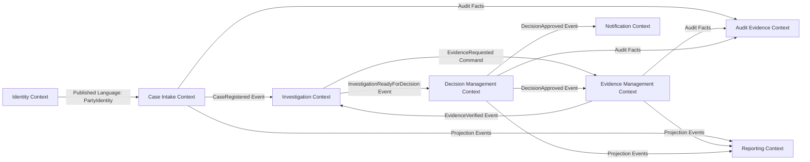
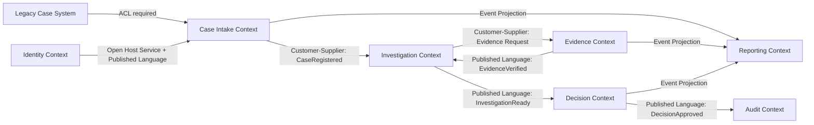
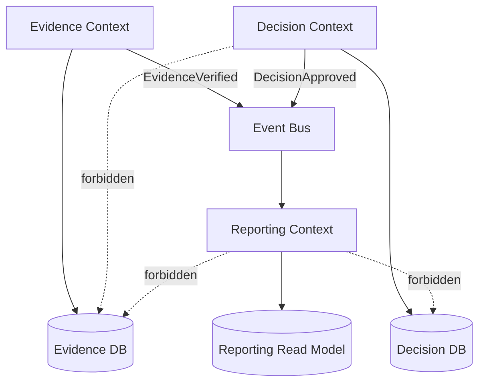
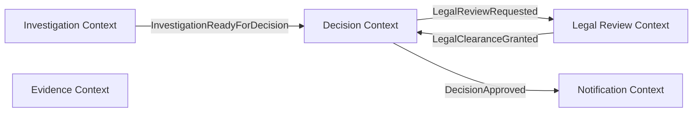
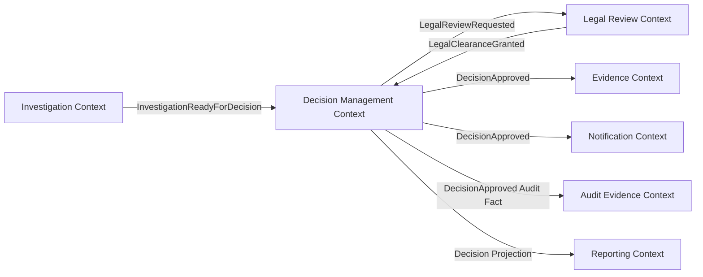

# Part 008 — Bounded Context in Practice

Setelah domain discovery, kamu punya banyak bahan:

- event;
- command;
- policy;
- lifecycle;
- invariant;
- capability;
- source of truth;
- hotspot;
- service candidate.

Tapi bahan itu belum menjadi desain yang aman.

Kita masih perlu menjawab:

> Model mana berlaku di mana?

Itulah bounded context.

Bounded context adalah batas tempat suatu model, bahasa, rule, dan meaning berlaku secara konsisten.

Dalam sistem besar, kata yang sama bisa berarti hal berbeda.

`Case` bagi intake officer mungkin berarti laporan yang baru masuk.

`Case` bagi investigator berarti unit kerja investigasi.

`Case` bagi legal reviewer berarti kumpulan fakta dan rekomendasi untuk keputusan.

`Case` bagi reporting berarti unit agregasi statistik.

Kalau semua dipaksa memakai satu `Case` model universal, sistem akan membusuk.

Bounded context mengizinkan model berbeda hidup berdampingan secara eksplisit.

---

## 1. Tujuan Part Ini

Setelah bagian ini, kamu harus bisa:

1. Menjelaskan bounded context sebagai language and model boundary.
2. Membedakan bounded context, service, module, database, dan team.
3. Membuat context map antar domain area.
4. Mengidentifikasi upstream/downstream relationship.
5. Menggunakan anti-corruption layer untuk melindungi model Java.
6. Menentukan kapan bounded context menjadi service terpisah dan kapan tetap module.
7. Menghindari shared domain model yang menciptakan distributed monolith.
8. Mendesain context boundary untuk sistem enterprise yang butuh audit, compliance, dan evolusi jangka panjang.

---

## 2. Mental Model: Model Tidak Universal

Engineer sering ingin satu model canonical untuk semua hal.

```java
public class Case {
    private String id;
    private String status;
    private List<Party> parties;
    private List<Evidence> evidence;
    private Decision decision;
    private RiskScore riskScore;
    private LocalDateTime createdAt;
    private LocalDateTime closedAt;
}
```

Model seperti ini tampak praktis.

Tapi dalam domain kompleks, model universal berubah menjadi tempat sampah:

- field dipakai oleh sebagian context saja;
- status punya arti berbeda;
- enum dipenuhi value untuk semua workflow;
- validation rule saling bertabrakan;
- database table menjadi bottleneck perubahan;
- semua tim takut mengubah class;
- backward compatibility menjadi mimpi buruk;
- microservices tetap coupled oleh shared model.

Bounded context mengatakan:

> Jangan paksa satu model menjelaskan seluruh dunia.

Gunakan model yang tepat untuk problem lokal.

---

## 3. Contoh: `Party` Bukan Selalu `Party`

Dalam regulatory enforcement, `Party` bisa berarti:

| Context | Meaning of Party | Data Penting | Rule Penting |
|---|---|---|---|
| Identity Context | legal/person identity record | name, identifier, address | identity uniqueness |
| Case Intake Context | complainant or reported party | submitted identity info | enough data to register case |
| Investigation Context | subject under investigation | role in case, risk relation | conflict and evidence relation |
| Decision Context | affected party in decision | legal standing, sanction recipient | must be notified before enforcement effective |
| Notification Context | message recipient | channel preference, delivery address | retry and delivery proof |
| Reporting Context | statistical dimension | party category, sector | aggregation and anonymization |

Kalau semua context memakai class `Party` yang sama, perubahan kecil bisa merusak banyak area.

Dalam bounded context, setiap context boleh punya model lokal.

```text
IdentityParty
CaseParticipant
InvestigationSubject
DecisionAffectedParty
NotificationRecipient
ReportingPartyDimension
```

Ini bukan over-engineering. Ini mencegah meaning collision.

---

## 4. Bounded Context Bukan Selalu Microservice

Ini penting.

Bounded context adalah batas model.

Microservice adalah deployment/runtime boundary.

Hubungannya bisa 1:1, tetapi tidak wajib.

| Bounded Context | Runtime Shape | Cocok Ketika |
|---|---|---|
| 1 context = 1 service | service mandiri | ownership, lifecycle, data, deployment butuh independen |
| multiple contexts = 1 service | modular service | context kecil, team sama, coupling tinggi tapi model beda |
| 1 context = multiple services | beberapa runtime service | scale/runtime profile berbeda, tetapi model language sama |
| context = module in modular monolith | belum dipisah runtime | boundary belum matang atau ops maturity belum cukup |

Kesalahan umum:

```text
bounded context ditemukan -> langsung buat service
```

Itu terlalu cepat.

Pertanyaan yang benar:

> Apakah context ini juga membutuhkan independent deployment, data ownership, runtime scaling, dan operational ownership?

Kalau belum, bounded context bisa dimulai sebagai module Java yang ketat.

---

## 5. Context Boundary adalah Batas Bahasa

Dalam satu bounded context, istilah harus konsisten.

Contoh `Closed`:

| Context | Arti Closed |
|---|---|
| Case Intake | intake tidak lagi menerima perubahan awal |
| Investigation | investigasi selesai atau dihentikan |
| Decision | keputusan final dan effective |
| Notification | delivery workflow selesai |
| Reporting | periode pelaporan dikunci |

Jika satu enum `Status.CLOSED` dipakai semua context, itu bug semantik yang menunggu waktu.

Lebih baik:

```java
// Case Intake context
public enum IntakeStatus {
    REGISTERED,
    VALIDATED,
    REJECTED,
    ACCEPTED
}
```

```java
// Investigation context
public enum InvestigationStatus {
    OPEN,
    ASSIGNED,
    IN_PROGRESS,
    READY_FOR_DECISION,
    SUSPENDED,
    CLOSED
}
```

```java
// Decision context
public enum DecisionStatus {
    DRAFTED,
    UNDER_LEGAL_REVIEW,
    CLEARED,
    APPROVED,
    EFFECTIVE,
    REVOKED
}
```

Nama boleh mirip. Meaning harus lokal dan eksplisit.

---

## 6. Context Boundary adalah Batas Invariant

Bounded context juga tempat invariant dijaga.

Contoh:

```text
Decision cannot be approved unless legal clearance exists.
```

Invariant ini milik Decision Context.

Bukan milik:

- API Gateway;
- UI;
- Notification Context;
- Reporting Context;
- shared utility library.

Kalau invariant membutuhkan data dari context lain, ada tiga kemungkinan:

1. Boundary salah: data seharusnya satu context.
2. Context butuh local copy/projection dari data lain.
3. Business rule sebenarnya eventual dan butuh process/workflow.

Jangan langsung remote call ke semua service untuk menjaga invariant.

---

## 7. Context Boundary adalah Batas Ownership

Bounded context yang sehat punya owner.

Owner bertanggung jawab atas:

- language;
- model;
- rule;
- data quality;
- contract;
- operational behavior;
- backward compatibility;
- audit semantics.

Contoh:

```text
Decision Management Context
Owner: Enforcement Legal Platform Team
Responsible for:
  - decision draft lifecycle
  - approval authority rule
  - legal clearance integration
  - decision effectiveness date
  - decision audit facts
Not responsible for:
  - evidence verification
  - party identity master data
  - notification delivery retry
```

Ownership seperti ini membuat architecture governance konkret.

---

## 8. Context Map

Context map menggambarkan hubungan antar bounded context.

Bukan hanya siapa memanggil siapa.

Context map menunjukkan:

- siapa upstream;
- siapa downstream;
- siapa authoritative;
- siapa mengikuti model siapa;
- siapa menerjemahkan model siapa;
- contract apa yang dipakai;
- dependency mana yang harus distabilkan.

Contoh:



Diagram ini belum cukup. Setiap edge harus punya relationship type.

---

## 9. Upstream dan Downstream

Upstream adalah context yang model/contract-nya diikuti oleh context lain.

Downstream adalah context yang bergantung pada upstream.

Contoh:

```text
Identity Context -> Case Intake Context
```

Identity adalah upstream untuk party identity.

Case Intake downstream karena ia menggunakan identity data untuk registrasi case.

Tapi ini tidak berarti Case Intake harus memakai internal entity Identity.

Ia boleh memakai published contract:

```json
{
  "partyId": "PTY-123",
  "legalName": "Acme Trading Ltd",
  "identityType": "LEGAL_ENTITY",
  "registrationCountry": "SG"
}
```

Downstream harus melindungi model lokalnya.

---

## 10. Relationship Type dalam Context Map

### 10.1 Partnership

Dua context berkembang bersama dan saling menyesuaikan.

Cocok jika:

- dua team punya koordinasi erat;
- perubahan contract dinegosiasikan bersama;
- domain sama-sama core.

Risiko:

- release coordination tinggi;
- independent deployability berkurang.

### 10.2 Customer-Supplier

Upstream melayani kebutuhan downstream secara eksplisit.

Cocok jika:

- downstream adalah customer penting;
- upstream punya backlog untuk contract consumer;
- ada product ownership jelas.

### 10.3 Conformist

Downstream mengikuti model upstream tanpa banyak kontrol.

Cocok jika:

- upstream adalah external/legacy platform;
- downstream tidak punya bargaining power.

Risiko:

- model downstream tercemar;
- perubahan upstream menyakitkan.

### 10.4 Anti-Corruption Layer

Downstream menerjemahkan model upstream ke model lokal.

Cocok jika:

- upstream model buruk/legacy/terlalu generic;
- downstream domain butuh model bersih;
- compliance/meaning tidak boleh tercemar.

### 10.5 Published Language

Upstream menyediakan bahasa/contract stabil untuk integrasi.

Cocok untuk:

- public API;
- integration event;
- canonical external message;
- OpenAPI/AsyncAPI/protobuf contract.

### 10.6 Open Host Service

Upstream menyediakan interface umum untuk banyak consumer.

Cocok untuk:

- identity;
- notification;
- audit append;
- document storage;
- lookup/reference data.

### 10.7 Shared Kernel

Dua context berbagi subset model kecil.

Harus sangat hati-hati.

Cocok hanya jika:

- shared model sangat kecil;
- team berkoordinasi kuat;
- perubahan jarang;
- dependency benar-benar worth it.

Shared kernel sering disalahgunakan menjadi shared domain jar.

---

## 11. Context Map dengan Relationship Label



Interpretasi:

- Legacy system tidak boleh mencemari Case Intake; butuh ACL.
- Identity menyediakan published language untuk party identity.
- Investigation membutuhkan evidence, tetapi tidak memiliki evidence lifecycle.
- Reporting downstream menerima projection, bukan meng-query database context lain.
- Audit menerima facts, bukan melakukan business decision.

---

## 12. Anti-Corruption Layer dalam Java

ACL melindungi model lokal dari model luar.

Misalnya legacy case API mengirim:

```json
{
  "CASE_NO": "2026-00017",
  "STAT_CD": "C",
  "PARTY_TYP": "R",
  "PRTY_NM": "Acme Trading",
  "RISK": "03"
}
```

Jangan biarkan model ini masuk ke domain.

Buruk:

```java
public class CaseIntake {
    private String CASE_NO;
    private String STAT_CD;
    private String PARTY_TYP;
    private String RISK;
}
```

Lebih baik:

```java
package com.acme.enforcement.caseintake.infrastructure.legacy;

record LegacyCaseResponse(
        String CASE_NO,
        String STAT_CD,
        String PARTY_TYP,
        String PRTY_NM,
        String RISK
) {}
```

```java
package com.acme.enforcement.caseintake.domain;

public record ImportedCaseDraft(
        ExternalCaseReference externalReference,
        IntakeStatus status,
        ReportedParty reportedParty,
        RiskBand initialRiskBand
) {}
```

```java
package com.acme.enforcement.caseintake.infrastructure.legacy;

import com.acme.enforcement.caseintake.domain.*;

final class LegacyCaseTranslator {

    ImportedCaseDraft toDomain(LegacyCaseResponse response) {
        return new ImportedCaseDraft(
                new ExternalCaseReference(response.CASE_NO()),
                mapStatus(response.STAT_CD()),
                new ReportedParty(response.PRTY_NM(), mapPartyType(response.PARTY_TYP())),
                mapRisk(response.RISK())
        );
    }

    private IntakeStatus mapStatus(String code) {
        return switch (code) {
            case "N" -> IntakeStatus.REGISTERED;
            case "V" -> IntakeStatus.VALIDATED;
            case "C" -> IntakeStatus.ACCEPTED;
            case "R" -> IntakeStatus.REJECTED;
            default -> throw new UnknownLegacyStatusException(code);
        };
    }

    private PartyType mapPartyType(String code) {
        return switch (code) {
            case "C" -> PartyType.COMPLAINANT;
            case "R" -> PartyType.REPORTED_PARTY;
            default -> PartyType.UNKNOWN;
        };
    }

    private RiskBand mapRisk(String code) {
        return switch (code) {
            case "01" -> RiskBand.LOW;
            case "02" -> RiskBand.MEDIUM;
            case "03" -> RiskBand.HIGH;
            default -> RiskBand.UNASSESSED;
        };
    }
}
```

ACL bukan mapper boilerplate. ACL adalah semantic firewall.

---

## 13. Ports untuk Upstream Dependency

Context lokal tidak boleh bergantung langsung pada client external.

Gunakan port.

```java
package com.acme.enforcement.caseintake.application;

import com.acme.enforcement.caseintake.domain.ExternalCaseReference;
import com.acme.enforcement.caseintake.domain.ImportedCaseDraft;

public interface LegacyCaseImportPort {
    ImportedCaseDraft importByReference(ExternalCaseReference reference);
}
```

Adapter berada di infrastructure.

```java
package com.acme.enforcement.caseintake.infrastructure.legacy;

import com.acme.enforcement.caseintake.application.LegacyCaseImportPort;
import com.acme.enforcement.caseintake.domain.ExternalCaseReference;
import com.acme.enforcement.caseintake.domain.ImportedCaseDraft;

public final class LegacyCaseHttpAdapter implements LegacyCaseImportPort {

    private final LegacyCaseHttpClient client;
    private final LegacyCaseTranslator translator;

    public LegacyCaseHttpAdapter(
            LegacyCaseHttpClient client,
            LegacyCaseTranslator translator
    ) {
        this.client = client;
        this.translator = translator;
    }

    @Override
    public ImportedCaseDraft importByReference(ExternalCaseReference reference) {
        LegacyCaseResponse response = client.fetchCase(reference.value());
        return translator.toDomain(response);
    }
}
```

Domain tidak tahu bahwa legacy system memakai `STAT_CD`.

Itulah tujuan boundary.

---

## 14. Published Language untuk Integration Event

Ketika sebuah context mempublikasikan event untuk context lain, event itu menjadi published language.

Contoh:

```java
public record DecisionApprovedEvent(
        String decisionId,
        String caseId,
        String approvedBy,
        Instant approvedAt,
        Instant effectiveAt,
        String decisionType,
        int schemaVersion
) {}
```

Published language harus stabil.

Jangan publikasikan internal aggregate langsung:

```java
// Buruk: internal model bocor
public record DecisionAggregatePublished(
        Decision decision
) {}
```

Masalah:

- consumer bergantung pada internal field;
- refactor domain menjadi breaking change;
- semua consumer tahu terlalu banyak;
- event schema tidak punya lifecycle jelas.

Lebih baik event publik hanya berisi fakta yang dibutuhkan consumer.

---

## 15. Jangan Share Domain Entity sebagai Library

Anti-pattern umum Java microservices:

```text
common-domain.jar
├── Case.java
├── Party.java
├── Evidence.java
├── Decision.java
├── Status.java
└── ErrorCode.java
```

Lalu semua service depend pada library ini.

Hasilnya:

- model menjadi global;
- perubahan satu context memaksa semua service rebuild;
- boundary runtuh di compile time;
- service tampak deploy independen tapi domain tidak independen;
- ownership kabur;
- enum menjadi landfill.

Yang boleh dishare?

Sangat terbatas:

- primitive technical utility yang stabil;
- generated client contract bila lifecycle dikelola;
- tracing/logging helper;
- error envelope standar;
- test fixture untuk contract jika hati-hati.

Yang tidak boleh dishare:

- aggregate;
- entity domain;
- repository;
- domain service;
- business enum yang context-specific;
- validation rule bisnis.

---

## 16. Model Translation Antar Context

Saat context menerima event dari context lain, ia harus menerjemahkan ke model lokal.

Contoh Decision Context menerima `EvidenceVerified`.

Event publik:

```java
public record EvidenceVerifiedEvent(
        String evidenceId,
        String caseId,
        String verifiedBy,
        Instant verifiedAt,
        String admissibilityStatus
) {}
```

Decision Context tidak harus menyimpan seluruh evidence model.

Ia bisa membuat local projection:

```java
package com.acme.enforcement.decision.domain;

public record DecisionEvidenceReference(
        EvidenceId evidenceId,
        CaseId caseId,
        EvidenceAdmissibility admissibility,
        Instant verifiedAt
) {}
```

Consumer handler:

```java
package com.acme.enforcement.decision.application;

public final class EvidenceVerifiedConsumer {

    private final DecisionEvidenceProjectionRepository repository;

    public EvidenceVerifiedConsumer(DecisionEvidenceProjectionRepository repository) {
        this.repository = repository;
    }

    public void on(EvidenceVerifiedEvent event) {
        DecisionEvidenceReference reference = new DecisionEvidenceReference(
                new EvidenceId(event.evidenceId()),
                new CaseId(event.caseId()),
                EvidenceAdmissibility.fromPublishedValue(event.admissibilityStatus()),
                event.verifiedAt()
        );

        repository.upsert(reference);
    }
}
```

Ini membuat Decision Context punya data yang ia butuhkan tanpa mencuri ownership Evidence Context.

---

## 17. Bounded Context dan Consistency

Bounded context membantu menentukan consistency boundary.

Pertanyaan:

> Apakah rule ini harus benar dalam satu transaction?

Jika ya, data yang dibutuhkan rule itu sebaiknya berada dalam context/aggregate yang sama.

Jika tidak, gunakan event, projection, saga, atau workflow.

Contoh:

```text
Decision cannot be approved unless legal clearance exists.
```

Jika legal clearance adalah bagian dari Decision Context, approval bisa satu transaction.

```text
Evidence must be locked after decision approved.
```

Ini bisa eventual:

- Decision Context approve decision.
- Publish `DecisionApproved`.
- Evidence Context consumes event.
- Evidence Context locks referenced evidence.

Apakah ada window di mana decision approved tetapi evidence belum locked?

Ya.

Apakah itu acceptable?

Tergantung domain. Jika tidak acceptable, boundary atau workflow perlu berubah.

Bounded context tidak menghapus consistency problem. Ia membuat problem terlihat.

---

## 18. Context Boundary Decision Matrix

Gunakan matrix ini saat bingung apakah dua model masuk context yang sama.

| Pertanyaan | Jika Ya | Jika Tidak |
|---|---|---|
| Apakah mereka memakai bahasa yang sama? | cenderung sama context | pisahkan context |
| Apakah invariant membutuhkan atomic consistency? | cenderung sama aggregate/context | bisa berbeda context |
| Apakah owner rule sama? | bisa sama context | pisahkan ownership |
| Apakah change cadence sama? | bisa sama context | pisahkan context/service |
| Apakah data authority sama? | bisa sama context | pisahkan context |
| Apakah failure profile sama? | bisa sama runtime | mungkin beda service |
| Apakah scaling profile sama? | bisa sama runtime | mungkin beda service |
| Apakah compliance boundary sama? | bisa sama context | pisahkan audit/control boundary |

Jangan gunakan satu pertanyaan saja. Boundary adalah keputusan multi-factor.

---

## 19. Same Context, Same Service, Different Service?

Contoh `Investigation` dan `Evidence`.

### Option A — Same Context, Same Service

Cocok jika:

- evidence hanya ada dalam investigation;
- lifecycle sangat terikat;
- team sama;
- scale sama;
- invariant sering atomic.

### Option B — Different Context, Same Service

Cocok jika:

- language/rule berbeda;
- runtime separation belum perlu;
- team masih sama;
- ingin menjaga module boundary dulu.

### Option C — Different Context, Different Service

Cocok jika:

- evidence punya lifecycle dan owner sendiri;
- evidence storage/scanning punya scale berbeda;
- evidence dipakai banyak domain;
- immutability/compliance rule tinggi;
- deployment perlu independen.

Dalam domain enterprise, Option B sering menjadi langkah evolusi yang sehat sebelum Option C.

---

## 20. Java Module Boundary sebelum Runtime Boundary

Kamu bisa menjaga bounded context dalam satu deployable dengan package/module rules.

Contoh Maven multi-module:

```text
enforcement-platform
├── case-intake
│   └── pom.xml
├── investigation
│   └── pom.xml
├── evidence-management
│   └── pom.xml
├── decision-management
│   └── pom.xml
├── audit-evidence
│   └── pom.xml
└── application-bootstrap
    └── pom.xml
```

Atau Gradle multi-module.

Aturan:

- context tidak mengakses repository context lain;
- context tidak memakai entity context lain;
- communication antar context melalui port/event/application API;
- dependency direction eksplisit;
- module test memastikan boundary.

Ini memudahkan extraction ke microservice saat boundary matang.

---

## 21. Example: Internal Boundary API

Jika masih satu codebase, jangan langsung inject repository context lain.

Buruk:

```java
class DecisionApprovalService {
    private final EvidenceRepository evidenceRepository;
    private final CaseRepository caseRepository;
    private final DecisionRepository decisionRepository;
}
```

Ini menghapus boundary.

Lebih baik Decision Context memakai port:

```java
package com.acme.enforcement.decision.application;

public interface EvidenceReadinessPort {
    EvidenceReadinessSnapshot getReadinessForDecision(CaseId caseId);
}
```

Evidence Context menyediakan adapter internal:

```java
package com.acme.enforcement.evidence.integration;

import com.acme.enforcement.decision.application.EvidenceReadinessPort;

public final class EvidenceReadinessAdapter implements EvidenceReadinessPort {

    private final EvidenceQueryService evidenceQueryService;

    public EvidenceReadinessAdapter(EvidenceQueryService evidenceQueryService) {
        this.evidenceQueryService = evidenceQueryService;
    }

    @Override
    public EvidenceReadinessSnapshot getReadinessForDecision(CaseId caseId) {
        EvidenceSummary summary = evidenceQueryService.summaryForCase(caseId.value());
        return new EvidenceReadinessSnapshot(
                caseId,
                summary.allMandatoryEvidenceVerified(),
                summary.verifiedEvidenceIds()
        );
    }
}
```

Keuntungan:

- Decision tidak tahu storage Evidence;
- Evidence mengontrol model keluar;
- extraction ke remote call lebih mudah;
- dependency menjadi explicit contract.

---

## 22. Bounded Context dan Database

Ideal microservice: database owned by service/context.

Tapi dalam migrasi, realitas bisa bertahap.

Yang tidak boleh:

```text
Decision Context membaca langsung tabel evidence.
Evidence Context update tabel case.
Reporting join semua tabel operational.
```

Yang lebih baik:

```text
Context owns write model.
Other contexts receive event/projection/API.
Reporting uses replicated read model.
```

Diagram:



Database adalah implementation detail dari context, bukan enterprise integration layer.

---

## 23. Shared ID Tidak Sama dengan Shared Model

Context boleh berbagi identity reference.

Contoh:

```text
caseId
evidenceId
partyId
decisionId
```

Tapi berbagi ID tidak berarti berbagi model.

Decision Context boleh menyimpan:

```java
public record CaseReference(String caseId) {}
```

Itu bukan berarti Decision memiliki Case aggregate.

Guideline:

- shared ID OK;
- shared semantic meaning harus jelas;
- shared entity tidak OK;
- shared lifecycle tidak otomatis;
- shared database foreign key lintas context biasanya buruk.

---

## 24. Context Boundary dan Workflow

Long-running workflow sering melintasi bounded context.

Contoh:



Pertanyaan:

> Siapa memiliki workflow?

Ada beberapa model:

### Model 1 — Choreography

Setiap context bereaksi terhadap event.

Cocok jika:

- flow sederhana;
- ownership terdistribusi jelas;
- tidak perlu satu visible process state.

Risiko:

- sulit melacak end-to-end;
- policy tersebar;
- debugging sulit.

### Model 2 — Orchestration

Workflow coordinator mengirim command ke context lain.

Cocok jika:

- process panjang;
- SLA/escalation penting;
- human task banyak;
- audit proses penting.

Risiko:

- orchestrator menjadi god service jika menyimpan business rule semua context.

### Model 3 — Context-Owned Workflow

Satu context owning lifecycle mengorkestrasi sebagian proses.

Cocok jika:

- workflow adalah bagian dari capability context tertentu;
- rule utama milik context itu.

Kuncinya:

Workflow boleh mengatur urutan. Context tetap menjaga invariant lokal.

---

## 25. Context Integration Patterns

### Request-Response

Gunakan untuk query/command yang butuh jawaban langsung.

Risiko:

- tight runtime coupling;
- latency chain;
- cascading failure.

### Event Notification

Context publikasi fakta bahwa sesuatu terjadi.

Consumer mengambil tindakan sendiri.

Cocok untuk loose coupling.

### Event-Carried State Transfer

Event membawa data cukup agar consumer tidak perlu callback.

Cocok untuk projection.

Risiko:

- event terlalu besar;
- data sensitive tersebar.

### Command Message

Satu context meminta context lain melakukan action.

Harus jelas ownership-nya.

### Projection Feed

Context menyediakan stream data untuk read model downstream.

Cocok untuk reporting/search.

---

## 26. Context Smells

### Smell 1 — Shared `domain-common` Jar

Jika semua service pakai entity yang sama, bounded context tidak nyata.

### Smell 2 — Universal Status Enum

```java
public enum Status {
    NEW,
    OPEN,
    PENDING,
    APPROVED,
    REJECTED,
    CLOSED,
    CANCELLED,
    SUSPENDED,
    EFFECTIVE,
    EXPIRED
}
```

Enum seperti ini biasanya tidak punya meaning kuat.

### Smell 3 — Cross-Context Repository Access

```java
decisionService.approve(caseRepository.findById(caseId), evidenceRepository.findAll(caseId));
```

Ini modulith tanpa boundary.

### Smell 4 — Context Menyebut Internal Detail Context Lain

```text
Decision Context knows Evidence table column `scan_status_code`.
```

Ini coupling bocor.

### Smell 5 — Semua Context Bergantung pada Gateway untuk Rule

Gateway bukan domain boundary.

### Smell 6 — Reporting Menjadi Consumer Paling Kuat

Jika operational model dibentuk demi laporan, domain model akan rusak. Reporting perlu projection sendiri.

### Smell 7 — Context Tanpa Owner

Jika tidak ada owner language/rule, context hanya folder.

---

## 27. Context Boundary Review Template

Gunakan template berikut.

```md
# Bounded Context Review: <Context Name>

## Purpose
What business capability/problem does this context own?

## Ubiquitous Language
Key terms and their local meaning.

## Owns
Data, rules, lifecycle, commands, events.

## Does Not Own
Explicit exclusions.

## Main Aggregates / Models
Local models and why they exist.

## Invariants
Rules that must always hold inside this context.

## Published Language
APIs/events exposed to other contexts.

## Upstream Dependencies
Contexts/systems this context depends on.

## Downstream Consumers
Contexts/systems depending on this context.

## Relationship Types
Customer-supplier, ACL, conformist, partnership, published language.

## Consistency Contract
What is immediate, what is eventual, what is not guaranteed.

## Data Authority
Source of truth and allowed copies.

## Operational Notes
SLO, failure mode, scaling profile, observability needs.

## Open Questions
Ambiguities and unresolved decisions.
```

Review ini memaksa context menjadi eksplisit.

---

## 28. Case Study: Decision Management Context

### Purpose

Mengelola drafting, legal review, approval, effectiveness, and revocation of enforcement decisions.

### Ubiquitous Language

| Term | Local Meaning |
|---|---|
| Decision Draft | Proposed enforcement decision before approval |
| Legal Clearance | Legal review outcome allowing approval to proceed |
| Approval | Authority action making decision accepted internally |
| Effective Date | Date/time decision becomes legally enforceable |
| Revocation | Formal reversal/cancellation after approval |

### Owns

- decision draft;
- approval record;
- decision status;
- legal clearance reference;
- effectiveness rule;
- revocation rule.

### Does Not Own

- evidence verification lifecycle;
- party identity master;
- notification delivery;
- case intake;
- reporting aggregation.

### Invariants

```text
Decision cannot be approved without legal clearance.
Decision cannot be approved by its drafter.
Decision cannot become effective before approval.
Decision revocation requires reason and authority.
Decision approval must emit immutable audit fact.
```

### Published Events

```text
DecisionDrafted
LegalReviewRequested
LegalClearanceRecorded
DecisionApproved
DecisionBecameEffective
DecisionRevoked
```

### Context Map



### Java Package Shape

```text
com.acme.enforcement.decision
├── application
│   ├── DraftDecisionHandler.java
│   ├── RecordLegalClearanceHandler.java
│   ├── ApproveDecisionHandler.java
│   └── RevokeDecisionHandler.java
├── domain
│   ├── Decision.java
│   ├── DecisionStatus.java
│   ├── LegalClearance.java
│   ├── ApprovalAuthority.java
│   └── DecisionApproved.java
└── infrastructure
    ├── persistence
    ├── messaging
    └── legalreview
```

Boundary terlihat di language, code, data, events, and ownership.

---

## 29. Tactical DDD Tidak Menggantikan Strategic Boundary

Banyak engineer langsung bicara:

- entity;
- value object;
- aggregate;
- repository;
- domain service.

Itu berguna, tapi tactical.

Sebelum tactical DDD, kamu butuh strategic DDD:

- bounded context;
- context map;
- upstream/downstream;
- published language;
- anti-corruption layer;
- core/supporting/generic subdomain.

Tanpa strategic boundary, tactical pattern hanya membuat class terlihat rapi di domain yang salah.

Contoh:

```text
Aggregate yang bagus di boundary yang salah tetap menghasilkan sistem buruk.
```

---

## 30. Core, Supporting, Generic Subdomain

Bounded context sering berkaitan dengan subdomain type.

| Type | Meaning | Architecture Treatment |
|---|---|---|
| Core | Diferensiasi bisnis utama | desain serius, ownership kuat, jangan outsource sembarangan |
| Supporting | Penting tapi bukan diferensiasi utama | custom cukup, boundary jelas |
| Generic | Umum di banyak bisnis | beli/pakai platform/library jika mungkin |

Contoh:

| Context | Type |
|---|---|
| Enforcement Decision Management | Core |
| Investigation Management | Core |
| Evidence Management | Core/Supporting tergantung organisasi |
| Notification | Generic/Supporting |
| Identity | Generic/Platform |
| Audit Evidence | Supporting/Core jika compliance sangat penting |
| Reporting | Supporting |

Core domain layak mendapat model lebih kaya. Generic domain jangan over-customize tanpa alasan.

---

## 31. Bounded Context dan Regulatory Defensibility

Dalam sistem regulasi, bounded context tidak hanya soal code maintainability.

Ia juga soal defensibility.

Pertanyaan:

- keputusan dibuat di context mana?
- rule yang dipakai versi berapa?
- siapa actor-nya?
- data apa yang tersedia saat keputusan dibuat?
- apakah evidence immutable?
- apakah downstream notification mengubah meaning keputusan?
- apakah report bisa direkonsiliasi ke event operasional?

Jika context boundary kabur, audit story juga kabur.

Contoh buruk:

```text
Decision approved in case-service.
Legal clearance stored in document-service metadata.
Notification status updates case status.
Reporting reads directly from all tables.
Audit logs are generic JSON blobs.
```

Sulit membuktikan apa yang terjadi.

Context yang baik:

```text
Decision Context owns approval.
Legal Review Context owns clearance result.
Evidence Context owns immutability.
Notification Context owns delivery proof.
Audit Context owns append-only evidence of facts.
Reporting Context owns derived projections.
```

Ini membuat accountability lebih kuat.

---

## 32. Menentukan Context Boundary dari Conflict

Context sering ditemukan bukan dari harmoni, tetapi dari konflik.

Contoh konflik bahasa:

```text
Operations: "Case closed" berarti tidak ada task aktif.
Legal: "Case closed" berarti decision legally final.
Reporting: "Case closed" berarti masuk periode laporan tertentu.
```

Solusi bukan memaksa satu definisi.

Solusi:

- Case Operations Context: `OperationallyClosed`
- Decision Context: `DecisionFinalized`
- Reporting Context: `ReportingPeriodLocked`

Setiap context punya bahasa sendiri.

Integration event harus eksplisit:

```text
CaseOperationallyClosed
DecisionFinalized
ReportingPeriodLocked
```

Generic `CaseClosed` mungkin terlalu ambigu.

---

## 33. Context Boundary dari Change Cadence

Jika dua area selalu berubah karena alasan berbeda, mungkin context-nya berbeda.

Contoh:

- Evidence scanning berubah karena vendor/security requirement.
- Legal clearance berubah karena policy/regulation.
- Notification template berubah karena communication team.
- Reporting metric berubah karena management/regulator.

Menyatukan semuanya dalam satu service besar membuat setiap perubahan berisiko menyentuh area lain.

Bounded context membantu menahan perubahan di area yang tepat.

---

## 34. Context Boundary dari Failure Mode

Jika dua area punya failure profile berbeda, runtime service mungkin perlu dipisah.

Contoh:

- Evidence upload bisa spike tinggi dan lambat karena file size.
- Decision approval traffic rendah tapi critical.
- Notification bisa delay tanpa menghentikan approval.
- Reporting batch bisa berat tapi tidak boleh mengganggu operation.

Bounded context saja belum cukup. Tapi context map membantu melihat mana yang layak menjadi runtime boundary.

---

## 35. Context Boundary dan API Gateway

API Gateway tidak boleh menjadi bounded context.

Gateway boleh menangani:

- routing;
- authentication enforcement;
- coarse rate limiting;
- request shaping sederhana;
- protocol translation tertentu;
- edge observability.

Gateway tidak boleh memiliki:

- case lifecycle rule;
- decision approval rule;
- evidence verification rule;
- party legal status meaning;
- business transaction state.

Jika gateway mulai punya business rule, itu tanda context boundary bocor ke edge.

---

## 36. Context Boundary dan BFF

Backend-for-Frontend boleh melakukan composition untuk user experience.

Tapi BFF bukan owner domain.

Contoh:

BFF `OfficerPortalBackend` boleh mengambil:

- case summary;
- investigation task;
- evidence summary;
- decision readiness.

Tetapi BFF tidak boleh menentukan:

```text
Case is ready for decision because all mandatory evidence verified.
```

Rule itu milik Investigation/Evidence/Decision context sesuai boundary.

BFF boleh menampilkan readiness. Jangan jadikan BFF tempat policy utama.

---

## 37. Bounded Context Evolution

Context boundary tidak selalu benar di awal.

Boundary berevolusi.

Tahap sehat:

```text
Discovery candidate
-> module boundary
-> internal contract
-> separate data ownership
-> independent deployment
-> runtime service
```

Jangan selalu lompat dari discovery ke service.

Kadang kamu mulai dengan:

```text
modular monolith with bounded contexts
```

Lalu extract context yang:

- high change;
- high load;
- high risk;
- clear ownership;
- stable contract;
- independent data;
- mature observability.

---

## 38. Boundary Migration Strategy

Jika context masih bercampur di legacy system:

1. Definisikan language lokal.
2. Buat package/module boundary.
3. Larang akses langsung ke model lain.
4. Buat ports untuk dependency.
5. Buat translator untuk legacy model.
6. Pisahkan write path terlebih dahulu.
7. Publikasikan event dari boundary baru.
8. Bangun projection untuk read needs.
9. Potong dependency database secara bertahap.
10. Baru pisahkan deployment jika perlu.

Ini lebih aman daripada “rewrite jadi microservices”.

---

## 39. Latihan: Context Map Enforcement Domain

Dari domain berikut:

```text
Case intake receives complaints. Investigation manages evidence. Legal reviews draft decisions.
Decision authority approves enforcement actions. Notification informs parties. Audit records evidence.
Reporting produces regulatory reports.
```

Tugas:

1. Identifikasi minimal 7 bounded context.
2. Tulis ubiquitous language masing-masing context.
3. Tulis 5 istilah yang berpotensi ambigu.
4. Buat context map dengan relationship type.
5. Tentukan mana upstream/downstream.
6. Tentukan mana butuh ACL.
7. Tentukan published language untuk minimal 5 event.
8. Tentukan mana context yang layak menjadi service mandiri sekarang.
9. Tentukan mana context yang sebaiknya masih module.
10. Tulis satu ADR untuk context boundary paling kontroversial.

---

## 40. Checklist Part 008

Sebelum lanjut, pastikan kamu bisa menjawab:

- [ ] Apakah saya bisa menjelaskan bounded context tanpa menyamakannya dengan service?
- [ ] Apakah saya bisa menemukan language collision dalam domain?
- [ ] Apakah saya bisa membuat context map dengan relationship type?
- [ ] Apakah saya bisa membedakan upstream dan downstream?
- [ ] Apakah saya bisa menjelaskan kapan perlu anti-corruption layer?
- [ ] Apakah saya bisa menolak shared domain jar?
- [ ] Apakah saya bisa menerjemahkan event publik ke local model?
- [ ] Apakah saya bisa menentukan consistency boundary?
- [ ] Apakah saya bisa memilih same context, same service, atau different service dengan alasan?
- [ ] Apakah saya bisa membuat bounded context review template?

---

## 41. Ringkasan

Bounded context adalah salah satu konsep paling penting dalam microservices yang serius.

Ia bukan sinonim dari service.

Ia adalah batas tempat model dan bahasa berlaku.

Tanpa bounded context:

- semua service berbagi model yang sama;
- entity menjadi global;
- enum membusuk;
- rule pindah ke gateway/workflow/UI;
- data ownership kabur;
- service deploy independen hanya di atas kertas.

Dengan bounded context:

- bahasa lokal menjadi jelas;
- rule punya rumah;
- source of truth terlihat;
- integration contract lebih stabil;
- legacy model bisa ditahan oleh ACL;
- service boundary punya alasan;
- audit dan ownership lebih defensible.

Part berikutnya membahas **Service Granularity Decision Model**: bagaimana menentukan ukuran service yang tepat tanpa jatuh ke nanoservice, god service, atau distributed monolith.
