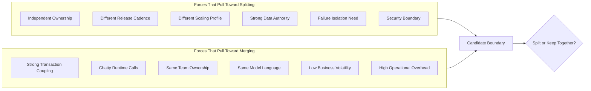
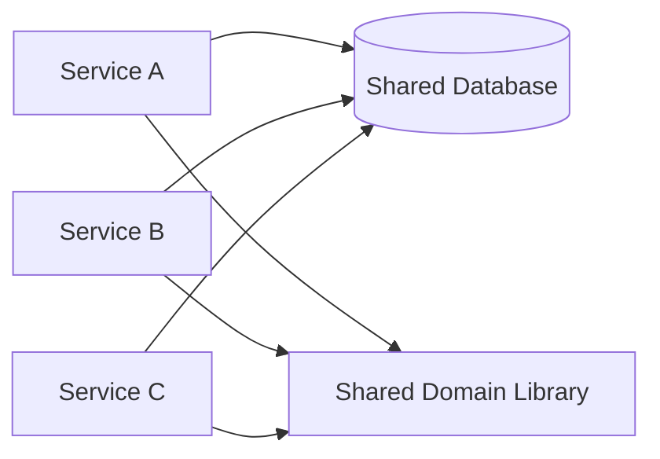
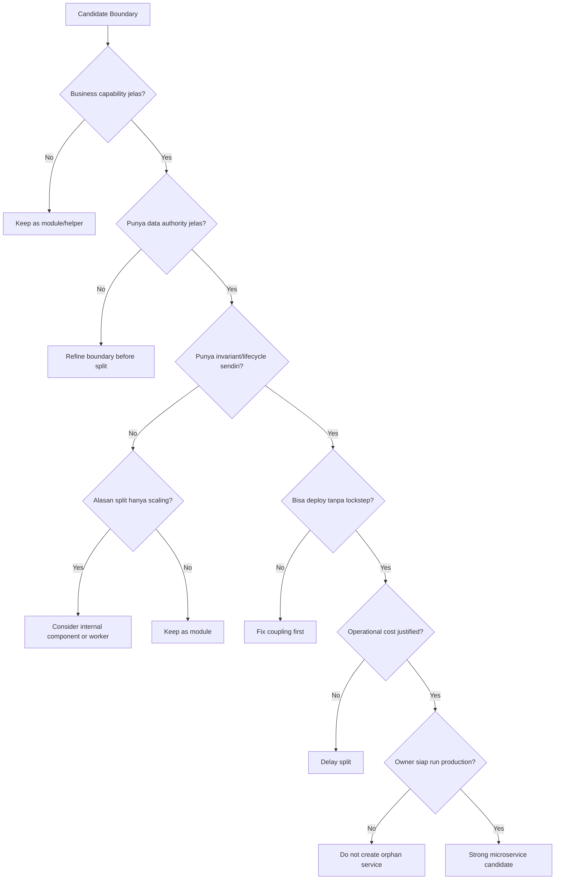
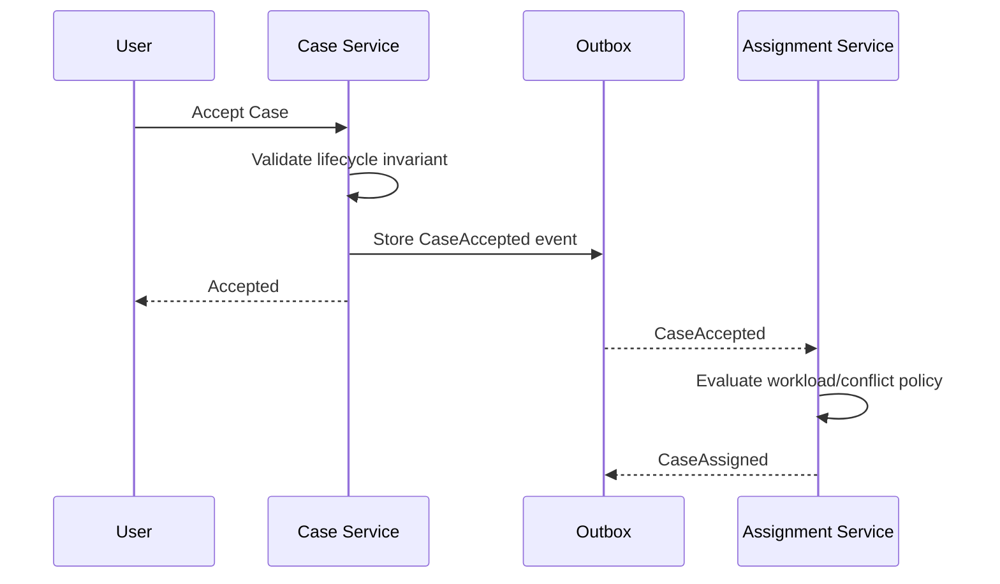
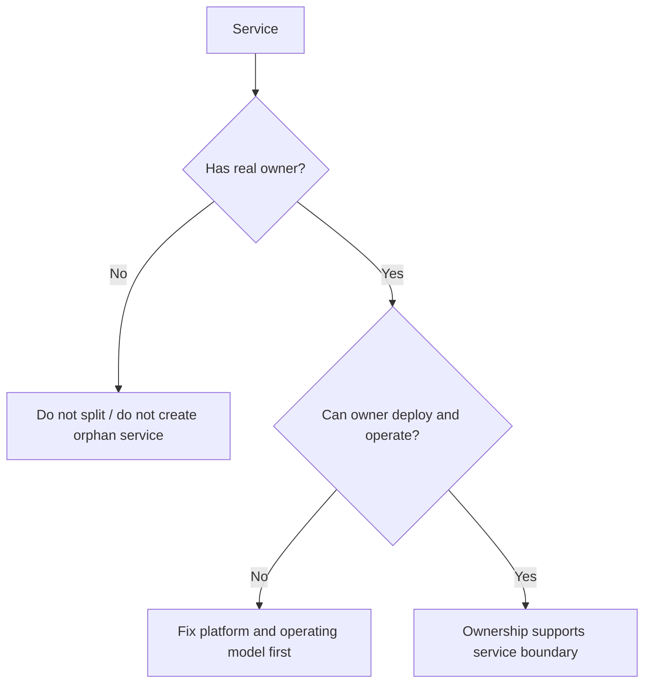
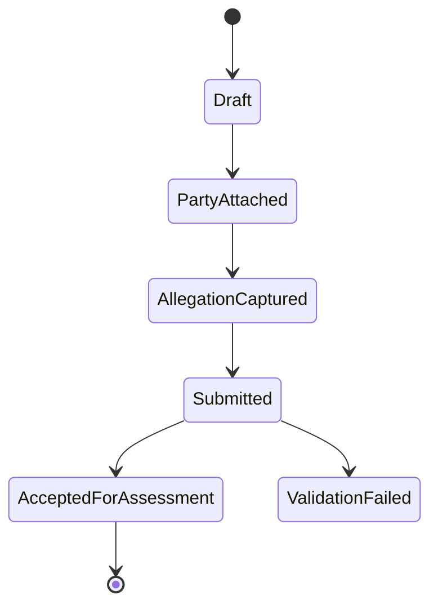
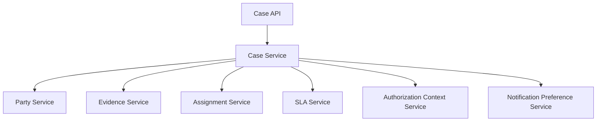

# Part 009 — Service Granularity Decision Model

Di part sebelumnya kita sudah punya dua fondasi:

1. domain discovery menghasilkan **bahan mentah**: event, command, policy, lifecycle, actor, invariant;
2. bounded context mengubah bahan itu menjadi **batas model**: bahasa, rule, ownership, consistency, dan relationship antar context.

Sekarang pertanyaannya lebih tajam:

> Dari semua candidate boundary itu, mana yang harus menjadi microservice terpisah?

Ini bukan pertanyaan naming.
Ini bukan pertanyaan jumlah class.
Ini bukan pertanyaan “service ini kecil atau besar?”

Pertanyaan sebenarnya adalah:

> Apakah boundary ini cukup bernilai untuk membayar biaya distribusi?

Microservice adalah boundary yang mahal.
Setiap split menambah:

- network hop;
- deployment unit;
- runtime dependency;
- observability surface;
- security boundary;
- data consistency cost;
- incident response scope;
- ownership responsibility;
- versioning problem;
- operational cost.

Karena itu service granularity bukan seni memotong sistem menjadi kotak kecil.
Service granularity adalah disiplin menyeimbangkan **autonomy gain** melawan **distribution cost**.

---

## 1. Prinsip Utama

Service yang baik bukan service yang kecil.
Service yang baik adalah service yang punya **alasan kuat untuk hidup sendiri**.

Alasan kuat itu biasanya datang dari kombinasi:

- business capability yang jelas;
- model dan bahasa yang berbeda;
- invariant yang harus dijaga sendiri;
- data ownership yang jelas;
- release cadence yang berbeda;
- scalability profile yang berbeda;
- failure isolation yang penting;
- ownership/team boundary yang nyata;
- security/compliance boundary yang berbeda;
- lifecycle yang cukup mandiri.

Service yang buruk biasanya muncul karena salah satu bias berikut:

- “setiap entity jadi service”;
- “setiap table jadi service”;
- “setiap controller jadi service”;
- “setiap repository jadi service”;
- “setiap team minta punya service sendiri”;
- “semua harus microservice karena modern.”

Microservices yang matang bukan hasil antusiasme.
Microservices yang matang adalah hasil **pembatasan yang sadar**.

---

## 2. Mental Model: Granularity Sebagai Force Field

Bayangkan setiap candidate service ditarik oleh dua gaya berlawanan.



Kalau split forces lebih kuat, service bisa dipisah.
Kalau merge forces lebih kuat, boundary lebih aman tetap menjadi module dalam service yang sama atau modular monolith.

Yang membuat engineer senior berbeda bukan hafal pattern.
Yang membuatnya matang adalah kemampuan membaca force ini secara jujur.

---

## 3. Ukuran Fisik Bukan Ukuran Arsitektural

Ukuran service tidak bisa diukur dari:

- jumlah line of code;
- jumlah endpoint;
- jumlah table;
- jumlah class;
- jumlah package;
- jumlah developer yang menyentuh repo;
- jumlah container.

Ukuran arsitektural lebih tepat diukur dari:

- jumlah alasan untuk berubah;
- jumlah owner yang berhak mengubah rule;
- jumlah invariant yang harus dijaga;
- jumlah lifecycle yang dikelola;
- jumlah downstream yang bergantung;
- jumlah runtime dependency yang dibutuhkan;
- jumlah data authority yang diklaim;
- jumlah failure mode yang dibawa.

Contoh:

```text
Evidence Service
- 35 endpoint
- 80 table
- 200 ribu LOC
- owned by one domain team
- one data authority
- one lifecycle family
- clear audit and retention policy

=> Bisa saja masih coherent.
```

Sebaliknya:

```text
CaseStatusService
- 4 endpoint
- 2 table
- 1 ribu LOC
- called by 18 services synchronously
- cannot change without Case Service
- no independent business meaning
- no separate owner

=> Ini mungkin nano-service yang buruk.
```

Granularity bukan tentang kecil.
Granularity tentang **separation of reasons to change**.

---

## 4. Tiga Bentuk Granularity Error

Ada tiga error klasik.

### 4.1 Service Terlalu Besar

Gejala:

- terlalu banyak business capability dalam satu service;
- banyak team mengubah repository yang sama;
- deployment selalu menunggu koordinasi;
- konflik domain language;
- satu schema menjadi pusat semua domain;
- service menjadi bottleneck delivery;
- incident di satu capability menjatuhkan capability lain;
- logic authorization, workflow, audit, reporting, dan integration bercampur.

Biasanya disebut:

- mini-monolith;
- service monolith;
- god service;
- domain blob.

Contoh:

```text
RegulatoryCaseManagementService
├── Intake
├── Party Management
├── Evidence
├── Allegation Assessment
├── Enforcement Decision
├── Escalation
├── Notification
├── Payment Penalty
├── Audit
└── Reporting
```

Ini bukan microservice yang besar.
Ini kemungkinan monolith yang dipindahkan ke container.

### 4.2 Service Terlalu Kecil

Gejala:

- service hanya membungkus table/entity;
- satu user action memanggil 7–15 service secara synchronous;
- business invariant tersebar;
- transaction logic pindah ke API gateway/orchestrator;
- banyak network call untuk satu rule sederhana;
- semua service selalu dirilis bersama;
- setiap change kecil butuh update banyak repo;
- observability penuh noise;
- operational cost lebih besar dari business value.

Biasanya disebut:

- nano-service;
- entity service;
- distributed object model;
- over-decomposition.

Contoh buruk:

```text
CaseService
CaseStatusService
CasePriorityService
CaseAssignmentService
CaseDeadlineService
CaseTagService
CaseCommentService
CaseHistoryService
```

Jika semuanya berubah bersama, dimiliki team yang sama, dan butuh transaksi/consistency ketat, ini bukan microservices.
Ini object model yang dipaksa lewat HTTP.

### 4.3 Service Terpisah Secara Deployment, Tapi Tidak Secara Arsitektur

Gejala:

- repository berbeda, tapi schema sama;
- endpoint berbeda, tapi domain model shared via common library;
- deployment berbeda, tapi harus dirilis dalam urutan ketat;
- runtime berbeda, tapi selalu synchronous chain;
- team berbeda, tapi decision ownership tidak jelas.

Ini paling berbahaya karena terlihat modern.



Kelihatannya microservices.
Secara operasional, ini distributed monolith.

---

## 5. Decision Model: 12 Dimensi Service Granularity

Gunakan dua belas dimensi berikut untuk mengevaluasi candidate boundary.

Skor bukan untuk menggantikan judgment.
Skor dipakai agar diskusi tidak emosional.

| Dimensi | Pertanyaan | Split Signal | Merge Signal |
|---|---|---|---|
| Business Capability | Apakah capability-nya punya value stream sendiri? | Capability jelas dan bernilai | Hanya technical helper |
| Domain Language | Apakah vocabulary berbeda? | Istilah sama tapi makna berbeda | Bahasa dan rule sama |
| Invariant | Apakah rule harus dijaga lokal? | Invariant kuat dalam boundary | Invariant sering lintas boundary |
| Data Authority | Siapa source of truth? | Data ownership jelas | Data ownership kabur/shared |
| Change Cadence | Apakah berubah dengan ritme berbeda? | Sering berubah terpisah | Selalu berubah bersama |
| Ownership | Apakah ada owner nyata? | Team/domain owner jelas | Tidak ada owner independen |
| Scalability | Apakah beban berbeda? | Scaling profile berbeda | Scaling profile sama |
| Availability | Apakah perlu failure isolation? | Bisa degrade/isolated | Harus hidup/mati bersama |
| Security | Apakah trust boundary berbeda? | Access/data sensitivity berbeda | Trust model sama |
| Workflow | Apakah lifecycle mandiri? | State machine jelas | State bergantung context lain |
| Integration | Apakah punya external contract kuat? | Banyak consumer mandiri | Hanya internal call chain |
| Operational Cost | Apakah layak dioperasikan sendiri? | Cost justified | Cost lebih besar dari manfaat |

Cara membaca:

- banyak split signal: kandidat microservice kuat;
- banyak merge signal: kandidat module lebih aman;
- campuran: butuh refactoring boundary, bukan langsung split.

---

## 6. Granularity Scorecard

Gunakan skor 1–5.

```text
1 = sangat mendukung merge
2 = cenderung merge
3 = netral / belum jelas
4 = cenderung split
5 = sangat mendukung split
```

Template:

```md
# Service Granularity Scorecard

Candidate: <nama candidate service>
Date: <tanggal>
Reviewer: <nama/team>

| Dimension | Score | Evidence | Risk if Wrong |
|---|---:|---|---|
| Business Capability |  |  |  |
| Domain Language |  |  |  |
| Invariant |  |  |  |
| Data Authority |  |  |  |
| Change Cadence |  |  |  |
| Ownership |  |  |  |
| Scalability |  |  |  |
| Availability |  |  |  |
| Security |  |  |  |
| Workflow |  |  |  |
| Integration |  |  |  |
| Operational Cost |  |  |  |

Average Score: 
Decision: Split / Keep as Module / Merge / Revisit Later
Decision Owner:
Review Date:
```

Interpretasi kasar:

| Average | Recommendation |
|---:|---|
| 1.0–2.4 | Keep together / module only |
| 2.5–3.4 | Unclear; collect more evidence |
| 3.5–4.2 | Candidate service, validate operational cost |
| 4.3–5.0 | Strong service boundary |

Jangan gunakan average secara buta.
Satu dimensi bisa veto.

Contoh veto:

- data authority tidak jelas;
- tidak ada owner;
- semua operation butuh distributed transaction;
- service hanya ada untuk CRUD entity;
- semua consumer butuh strong consistency real-time.

---

## 7. Example: Case Assignment Candidate

Misal dalam sistem regulatory case management ada candidate service:

```text
Case Assignment Service
```

Tugasnya:

- menentukan investigator;
- mengatur reassignment;
- mempertimbangkan workload;
- mencegah conflict of interest;
- menyimpan assignment history;
- memberi sinyal ke SLA/escalation ketika case belum assigned.

Scorecard:

| Dimension | Score | Evidence | Risk if Wrong |
|---|---:|---|---|
| Business Capability | 4 | Assignment adalah capability operasional nyata | Jika digabung, workload policy sulit berubah |
| Domain Language | 4 | Investigator, workload, assignment window, conflict rule | Bahasa bercampur dengan case lifecycle |
| Invariant | 4 | Satu active assignee, no conflict assignment | Invariant bisa tersebar |
| Data Authority | 4 | Assignment record bisa dimiliki sendiri | Perlu jelas relasi dengan Case |
| Change Cadence | 3 | Policy berubah, tapi tidak selalu sering | Bisa premature split |
| Ownership | 3 | Mungkin masih team yang sama | Owner belum kuat |
| Scalability | 3 | Workload calculation bisa berat periodik | Belum cukup sebagai alasan utama |
| Availability | 4 | Case intake bisa tetap hidup walau assignment delay | Perlu async fallback |
| Security | 3 | Data sensitif tapi masih domain sama | Tidak cukup sebagai split driver |
| Workflow | 4 | Assignment lifecycle cukup jelas | Perlu event/timeout |
| Integration | 4 | Digunakan SLA, notification, case view | Contract harus stabil |
| Operational Cost | 3 | Cost sedang | Perlu observability matang |

Average sekitar 3.58.

Keputusan yang masuk akal:

```text
Candidate service, but validate ownership and data boundary first.
```

Bukan langsung split besok.
Lebih baik mulai dengan module boundary yang keras dalam Case domain, lalu lihat change cadence dan operational pressure.

---

## 8. Example: Case Priority Candidate

Candidate:

```text
Case Priority Service
```

Tugas:

- menyimpan priority;
- update priority;
- expose priority by case id.

Scorecard:

| Dimension | Score | Evidence | Risk if Wrong |
|---|---:|---|---|
| Business Capability | 1 | Priority bukan capability mandiri | Nano-service |
| Domain Language | 2 | Bahasa mengikuti case assessment | Model pecah tanpa alasan |
| Invariant | 2 | Priority ditentukan oleh risk/assessment | Rule tersebar |
| Data Authority | 2 | Source of truth tidak jelas | Duplicate state |
| Change Cadence | 2 | Berubah bersama assessment rule | Lockstep release |
| Ownership | 1 | Tidak ada owner khusus | Orphan service |
| Scalability | 1 | Beban sama dengan case read | Tidak ada manfaat scaling |
| Availability | 2 | Jika down, banyak flow terganggu | Failure surface bertambah |
| Security | 2 | Sama dengan case | Tidak ada trust boundary |
| Workflow | 1 | Tidak punya lifecycle sendiri | CRUD wrapper |
| Integration | 2 | Hanya dipakai case view | Chatty calls |
| Operational Cost | 1 | Cost tidak justified | Maintenance noise |

Decision:

```text
Do not split. Keep inside Case Assessment or Case Lifecycle boundary.
```

Ini contoh penting.
Service kecil bisa menjadi desain buruk.

---

## 9. Split/Merge Decision Tree

Gunakan decision tree berikut sebelum membuat service baru.



Pertanyaan paling mematikan:

> Jika service ini dibuat, siapa yang bangun jam 3 pagi ketika gagal?

Kalau tidak ada jawaban, jangan buat service.

---

## 10. Granularity and Java Code Shape

Service granularity harus tercermin di struktur kode.
Jika boundary belum layak jadi service, jangan pura-pura dengan HTTP.
Buat module boundary dulu.

### 10.1 Bad: Split Terlalu Cepat ke Remote Service

```java
@Service
public class CaseLifecycleService {
    private final CaseStatusClient statusClient;
    private final CasePriorityClient priorityClient;
    private final CaseDeadlineClient deadlineClient;
    private final CaseAssignmentClient assignmentClient;

    public void acceptCase(UUID caseId) {
        statusClient.updateStatus(caseId, "ACCEPTED");
        priorityClient.recalculate(caseId);
        deadlineClient.createInitialDeadline(caseId);
        assignmentClient.assign(caseId);
    }
}
```

Masalah:

- satu business action menjadi banyak remote call;
- tidak jelas siapa menjaga invariant;
- failure handling kompleks;
- retry bisa membuat duplicate action;
- transaksi bisnis tersebar;
- orchestration muncul karena boundary terlalu kecil.

Kode ini terlihat clean secara dependency injection.
Secara arsitektur, ini rapuh.

### 10.2 Better: Keep Strongly Coupled Behavior Local

```java
public final class CaseLifecycle {
    private CaseStatus status;
    private CasePriority priority;
    private CaseDeadline deadline;
    private AssignmentState assignmentState;

    public List<DomainEvent> accept(AcceptCaseCommand command, RiskPolicy riskPolicy) {
        requireCurrentStatus(CaseStatus.SUBMITTED);

        this.status = CaseStatus.ACCEPTED;
        this.priority = riskPolicy.initialPriorityFor(command.riskSignals());
        this.deadline = CaseDeadline.initialFrom(command.acceptedAt(), priority);
        this.assignmentState = AssignmentState.awaitingAssignment();

        return List.of(
            new CaseAccepted(command.caseId(), command.acceptedAt()),
            new CaseAwaitingAssignment(command.caseId(), command.acceptedAt())
        );
    }
}
```

Di sini status, priority, deadline, dan assignment state awal masih berada dalam satu consistency boundary.
Event bisa digunakan untuk memberi tahu context lain.
Tapi invariant awal tidak dipaksa melewati network.

### 10.3 Later: Extract Assignment When Evidence Supports It

Jika assignment berkembang menjadi capability sendiri, extraction lebih aman.

```java
public interface AssignmentPort {
    AssignmentRequestId requestAssignment(RequestAssignmentCommand command);
}
```

Application service:

```java
@Service
public class AcceptCaseUseCase {
    private final CaseRepository caseRepository;
    private final AssignmentPort assignmentPort;
    private final TransactionalOutbox outbox;

    @Transactional
    public void handle(AcceptCaseCommand command) {
        CaseLifecycle lifecycle = caseRepository.get(command.caseId());
        List<DomainEvent> events = lifecycle.accept(command, RiskPolicy.current());

        caseRepository.save(lifecycle);
        outbox.appendAll(events);
    }
}
```

Assignment tidak harus synchronous.
Boundary bisa diekstrak lewat event.



Ini contoh granularity yang lebih sehat:

- command awal konsisten;
- assignment bisa delay;
- failure assignment tidak membatalkan acceptance;
- user-visible state bisa menjelaskan “awaiting assignment”.

---

## 11. Kapan Split Karena Scalability Masuk Akal?

Banyak tim terlalu cepat memecah service karena “scaling”.

Scaling adalah alasan valid hanya jika:

- beban satu capability berbeda jauh dari capability lain;
- scaling bersama membuat cost terlalu tinggi;
- resource profile berbeda: CPU, memory, IO, network, GPU, batch;
- bottleneck bisa diisolasi tanpa merusak business invariant;
- deployment dan data ownership juga mendukung split.

Contoh valid:

```text
Document OCR Processing
- CPU intensive
- async workload
- retryable
- can be delayed
- no need to share transaction with Case
- independent capacity planning

=> Good candidate for separate processing service/worker.
```

Contoh tidak valid:

```text
CaseStatusService
- lightweight CRUD
- called on every case screen
- strongly tied to Case lifecycle
- no independent scale need

=> Scaling is not a strong reason.
```

Kadang solusi bukan microservice baru.
Kadang cukup:

- background worker;
- queue consumer;
- separate thread pool;
- read replica;
- cache;
- materialized view;
- internal module;
- separate deployment profile;
- JVM tuning;
- database index.

Split service adalah salah satu alat.
Bukan alat pertama.

---

## 12. Kapan Split Karena Ownership Masuk Akal?

Ownership adalah alasan kuat jika nyata.

Nyata berarti:

- ada team yang menguasai domain;
- team bisa memutuskan roadmap;
- team bisa deploy sendiri;
- team punya operational responsibility;
- team punya SLO/alert/runbook;
- team bisa menolak coupling yang buruk;
- team bisa menjaga contract.

Ownership palsu:

- repository dimiliki team A, tapi semua keputusan dari team B;
- service dimiliki platform team, tapi business rule dari domain team;
- semua change butuh approval architecture board;
- on-call bukan team pemilik;
- service tidak punya product owner/domain owner.

Microservice tanpa owner adalah liability.



---

## 13. Kapan Split Karena Security/Compliance Masuk Akal?

Security boundary bisa menjadi alasan kuat.

Contoh:

- service mengelola data sangat sensitif;
- access policy berbeda drastis;
- audit requirement berbeda;
- retention policy berbeda;
- data residency berbeda;
- encryption/key management berbeda;
- privileged operation harus diisolasi;
- breach blast radius harus dibatasi.

Contoh regulatory system:

```text
Evidence Service
- stores evidence metadata
- references secure object storage
- has strict chain-of-custody audit
- access depends on role, case assignment, legal hold, classification
- retention differs from normal case notes

=> Strong security/compliance split signal.
```

Tapi hati-hati.
Memecah security-sensitive data ke service baru tidak otomatis aman.
Kamu juga menambah:

- network exposure;
- service-to-service authorization;
- token propagation;
- secret management;
- logging redaction;
- audit correlation;
- incident response complexity.

Security split hanya layak jika threat model dan operating model ikut matang.

---

## 14. Kapan Merge Lebih Baik?

Merge lebih baik jika:

- operasi harus atomic dan sering terjadi;
- rule tidak bisa dijelaskan tanpa model yang sama;
- perubahan selalu lockstep;
- service tidak punya owner berbeda;
- dependency selalu synchronous;
- data source of truth tidak bisa dipisah;
- throughput rendah dan cost distribusi tidak justified;
- lifecycle sebenarnya sama;
- service hanya CRUD wrapper;
- boundary dibuat karena struktur organisasi sementara.

Merge bukan kegagalan.
Merge adalah desain yang jujur.

Top engineer tidak malu mengatakan:

> Ini belum layak menjadi microservice. Jadikan module dulu.

---

## 15. Module First, Service Later

Pendekatan paling aman untuk boundary yang belum terbukti:

1. buat internal module boundary;
2. paksa dependency direction;
3. larang akses database lintas module;
4. expose API internal via interface;
5. catat event/domain language;
6. ukur change cadence;
7. ukur coupling;
8. split hanya saat evidence cukup.

Contoh struktur:

```text
case-service/
├── src/main/java/com/acme/caseapp/
│   ├── lifecycle/
│   │   ├── api/
│   │   ├── domain/
│   │   ├── application/
│   │   └── infrastructure/
│   ├── assignment/
│   │   ├── api/
│   │   ├── domain/
│   │   ├── application/
│   │   └── infrastructure/
│   └── sharedkernel/
└── architecture-tests/
```

Dependency rule:

```java
package com.acme.caseapp.architecture;

import com.tngtech.archunit.core.importer.ClassFileImporter;
import com.tngtech.archunit.lang.ArchRule;
import org.junit.jupiter.api.Test;

import static com.tngtech.archunit.library.dependencies.SlicesRuleDefinition.slices;

class ModuleBoundaryTest {

    @Test
    void featureModulesShouldNotHaveCycles() {
        var classes = new ClassFileImporter()
            .importPackages("com.acme.caseapp");

        ArchRule rule = slices()
            .matching("com.acme.caseapp.(*)..")
            .should()
            .beFreeOfCycles();

        rule.check(classes);
    }
}
```

Module-first memberi kamu pilihan.
Over-splitting mengunci kamu pada distributed complexity terlalu cepat.

---

## 16. Granularity and Transaction Boundaries

Pertanyaan paling keras:

> Apakah operation utama service ini bisa selesai tanpa distributed transaction?

Jika jawabannya tidak, split harus dipertanyakan.

### Bad Sign

```text
Submit Case requires:
1. insert case in Case Service
2. insert party in Party Service
3. insert allegation in Allegation Service
4. insert status in Status Service
5. insert deadline in Deadline Service
6. insert audit in Audit Service

All must commit or rollback together.
```

Ini bukan microservice-friendly.
Ini transaksi monolith yang dipotong lewat network.

### Better Question

Bisakah business process dirancang sebagai state progression?

```text
CaseDraftCreated
PartyAttached
AllegationCaptured
CaseSubmitted
CaseValidationFailed
CaseAcceptedForAssessment
```

Kalau domain bisa menerima intermediate state yang valid, split lebih mungkin.
Kalau tidak, mungkin boundary salah atau split terlalu dini.



Microservices sering lebih cocok dengan explicit lifecycle dibanding hidden all-or-nothing transaction.

---

## 17. Granularity and Runtime Coupling

Service terpisah harus mengurangi coupling total.
Kalau split justru menambah coupling runtime, desainnya buruk.

Indikator runtime coupling:

- jumlah synchronous call per request;
- fan-out depth;
- retry chain;
- timeout propagation;
- shared cache dependency;
- shared database dependency;
- deployment ordering;
- cyclic dependency;
- chatty calls.

### Fan-out Risk



Jika endpoint utama butuh semua dependency untuk sukses, availability endpoint turun.

Aturan praktis:

> Semakin sering service harus memanggil service lain untuk menjalankan rule intinya, semakin mencurigakan boundary-nya.

---

## 18. Granularity and Data Duplication

Microservices sehat sering membutuhkan duplikasi data.

Tapi duplikasi yang sehat berbeda dari shared ownership.

### Healthy Duplication

```text
Case Service owns:
- case id
- lifecycle status
- assigned unit id

Search Service stores projection:
- case id
- status
- assigned unit name
- last updated
- searchable text
```

Search Service tidak menjadi authority.
Ia hanya read model.

### Unhealthy Duplication

```text
Case Service updates case status.
SLA Service also updates case status.
Reporting Service sometimes fixes case status.
```

Ini bukan duplication.
Ini multiple writers.

Granularity harus memperjelas:

- who owns command;
- who owns state;
- who can derive copy;
- who can correct state;
- how stale copy is allowed to be;
- how reconciliation works.

---

## 19. Granularity Smell Catalog

### 19.1 Entity Service Smell

```text
PartyService
AddressService
PhoneNumberService
EmailService
CountryCodeService
```

Tanda bahaya:

- service mengikuti ERD;
- setiap screen butuh aggregate dari banyak entity service;
- rule business tidak hidup di service manapun.

### 19.2 Verb Service Smell

```text
ValidationService
ProcessingService
CalculationService
UpdateService
```

Tanda bahaya:

- nama service terlalu teknis;
- tidak punya domain language;
- menjadi dumping ground helper logic.

Tidak semua verb buruk.
`Payment Processing` bisa capability.
Tapi `ProcessingService` generik biasanya buruk.

### 19.3 God Service Smell

```text
CaseManagementService
CustomerService
CoreService
MasterService
PlatformService
```

Tanda bahaya:

- semua capability masuk;
- banyak domain language bercampur;
- semua team takut mengubahnya.

### 19.4 Chatty Service Smell

```text
GET /case/{id}
  -> GET /case-status/{id}
  -> GET /case-priority/{id}
  -> GET /case-deadline/{id}
  -> GET /case-assignee/{id}
  -> GET /case-risk/{id}
```

Tanda bahaya:

- endpoint sederhana butuh banyak call;
- UI lambat;
- error handling kacau;
- caching jadi obat untuk boundary yang salah.

### 19.5 Shared Library Domain Smell

```text
common-domain.jar
├── Case
├── Party
├── Evidence
├── Decision
├── Penalty
└── WorkflowState
```

Tanda bahaya:

- semua service tergantung model yang sama;
- perubahan model memaksa banyak service release;
- bounded context hilang.

Shared library boleh untuk hal stabil:

- tracing utilities;
- error envelope;
- primitive technical helpers;
- generated contract DTO jika lifecycle jelas;
- security integration adapter.

Shared domain model hampir selalu mencurigakan.

---

## 20. Anti-Pattern: Granularity by Team Politics

Kadang service dibuat bukan karena boundary, tapi karena politik organisasi.

Contoh:

```text
Team A ingin punya Service A.
Team B ingin punya Service B.
Team C tidak mau bergantung pada Team A.
Architecture board menyetujui semua agar damai.
```

Hasilnya:

- boundary mengikuti organisasi yang belum matang;
- domain rule terpecah;
- user journey menjadi lambat;
- ownership malah makin ambigu;
- governance menjadi approval theater.

Conway's Law penting, tapi jangan dibaca dangkal.
Arsitektur memang dipengaruhi komunikasi organisasi.
Tapi tugas architect bukan menyalin struktur organisasi apa adanya.
Tugas architect adalah membentuk boundary yang membuat ownership dan komunikasi menjadi lebih sehat.

---

## 21. Granularity Refactoring Patterns

### 21.1 Merge Nano-Services

Gunakan saat:

- service terlalu kecil;
- lockstep release;
- chatty calls;
- invariant tersebar.

Langkah:

1. identifikasi request path paling chatty;
2. cari service yang selalu berubah bersama;
3. pilih authority service;
4. pindahkan logic ke authority;
5. expose compatibility API sementara;
6. deprecate service lama;
7. hapus remote dependency.

### 21.2 Extract Service from Module

Gunakan saat:

- module sudah punya boundary kuat;
- data ownership jelas;
- owner siap;
- API sudah stabil;
- operational cost justified.

Langkah:

1. jadikan module API eksplisit;
2. buat data ownership boundary;
3. hilangkan direct DB access dari module lain;
4. publish event internal;
5. buat adapter remote;
6. deploy service baru;
7. switch consumer bertahap;
8. hapus in-process implementation.

### 21.3 Split Read Model, Not Command Model

Gunakan saat:

- query berat;
- reporting butuh denormalisasi;
- command invariant masih lokal;
- staleness bisa diterima.

Contoh:

```text
Case Service tetap owner command.
Case Search Service menjadi projection/query service.
```

Ini sering lebih aman daripada memecah command domain terlalu dini.

### 21.4 Extract Worker, Not Service

Gunakan saat:

- workload async;
- CPU/IO intensive;
- tidak butuh API product surface;
- tidak punya domain authority mandiri.

Contoh:

```text
Evidence Virus Scan Worker
Document OCR Worker
Notification Dispatch Worker
```

Worker bisa punya deployment berbeda tanpa menjadi domain microservice penuh.

---

## 22. Service Granularity Review Meeting

Gunakan meeting kecil, bukan forum besar.

Peserta:

- domain owner;
- tech lead;
- service owner candidate;
- platform/ops representative;
- security/compliance jika relevan;
- consumer representative.

Agenda:

1. candidate boundary purpose;
2. business capability evidence;
3. command/event/lifecycle evidence;
4. data authority;
5. ownership readiness;
6. dependency topology;
7. failure mode;
8. migration path;
9. decision and revisit date.

Output:

- ADR;
- service charter draft;
- scorecard;
- dependency diagram;
- risk register;
- explicit non-goals.

---

## 23. ADR Template for Granularity Decision

```md
# ADR: Service Granularity Decision for <Candidate>

## Status
Proposed / Accepted / Rejected / Superseded

## Context
What business problem are we solving?
What domain capability does this boundary represent?
What pain exists in the current design?

## Candidate Boundary
Commands:
- ...

Events:
- ...

Data Owned:
- ...

Consumers:
- ...

## Forces
### Split Forces
- ...

### Merge Forces
- ...

## Scorecard Summary
| Dimension | Score | Notes |
|---|---:|---|
| Business Capability |  |  |
| Data Authority |  |  |
| Ownership |  |  |
| Operational Cost |  |  |

## Decision
We will / will not create a separate service.

## Rationale
Why this decision is the least bad option.

## Consequences
Positive:
- ...

Negative:
- ...

## Revisit Trigger
We will revisit this decision when:
- change frequency exceeds ...
- scaling cost exceeds ...
- team ownership changes ...
- dependency graph changes ...
```

ADR yang baik tidak hanya bilang “kami memilih microservice”.
ADR yang baik menjelaskan **kenapa tidak memilih alternatif lain**.

---

## 24. Practical Heuristics

### Heuristic 1: One Service Should Own a Business Verb Family

Lebih baik:

```text
Case Assessment Service
- assess case
- classify risk
- request evidence
- produce assessment outcome
```

Daripada:

```text
RiskScoreService
PriorityService
AssessmentStatusService
AssessmentCommentService
```

### Heuristic 2: Jangan Pisahkan State yang Selalu Berubah Bersama

Jika dua piece of state selalu diubah dalam command yang sama, boundary terpisah mencurigakan.

### Heuristic 3: Jangan Buat Service Tanpa Product Surface

Jika tidak ada consumer yang peduli pada contract-nya, mungkin itu module/helper.

### Heuristic 4: Jangan Buat Service Tanpa Failure Story

Service harus punya jawaban:

- apa yang terjadi jika service down?
- siapa terdampak?
- apakah caller bisa degrade?
- apakah command bisa retry?
- apakah data bisa reconcile?

### Heuristic 5: Split Read First, Command Later

Read-side split sering lebih aman daripada command-side split.

### Heuristic 6: Extract Around Pain, Not Around Diagram

Split karena:

- bottleneck nyata;
- ownership conflict nyata;
- scaling pain nyata;
- compliance boundary nyata;
- release conflict nyata.

Bukan karena diagram lebih cantik.

---

## 25. Top 1% Mental Model

Engineer biasa bertanya:

> Berapa banyak microservice yang ideal?

Engineer senior bertanya:

> Boundary mana yang mengurangi koordinasi tanpa menambah coupling tersembunyi?

Engineer biasa bertanya:

> Service ini kecil belum?

Engineer senior bertanya:

> Apakah service ini punya authority, owner, invariant, lifecycle, dan failure story sendiri?

Engineer biasa bertanya:

> Bisa dipisah?

Engineer senior bertanya:

> Haruskah dipisah sekarang?

Perbedaan terbesar adalah **timing**.
Boundary yang benar pada waktu yang salah tetap bisa menjadi desain buruk.

---

## 26. Checklist

Sebelum membuat service baru, jawab:

- [ ] Apakah ini business capability, bukan entity/table/helper?
- [ ] Apakah domain language-nya cukup berbeda?
- [ ] Apakah command utamanya bisa diselesaikan tanpa distributed transaction?
- [ ] Apakah data authority jelas?
- [ ] Apakah service punya owner nyata?
- [ ] Apakah owner siap deploy dan operate?
- [ ] Apakah service bisa berubah tanpa lockstep release?
- [ ] Apakah failure service ini bisa diisolasi?
- [ ] Apakah caller punya fallback/degraded mode?
- [ ] Apakah observability dan alerting layak dibuat?
- [ ] Apakah ada SLO yang bermakna?
- [ ] Apakah split mengurangi koordinasi manusia?
- [ ] Apakah split tidak menambah runtime coupling berlebihan?
- [ ] Apakah cost distribusi justified?
- [ ] Apakah ada migration path jika keputusan salah?

Jika banyak jawaban “tidak tahu”, jangan split dulu.
Cari evidence.

---

## 27. Latihan Desain

Ambil domain berikut:

```text
Regulatory Case Management
- case intake
- party profile
- allegation capture
- evidence upload
- risk assessment
- assignment
- investigation plan
- enforcement decision
- appeal
- audit log
- notification
- reporting
```

Tugas:

1. pilih tiga candidate service;
2. isi scorecard 12 dimensi;
3. tentukan split/merge/module;
4. gambar dependency graph;
5. jelaskan failure story masing-masing;
6. tulis ADR pendek.

Pertanyaan penting:

- mana source of truth untuk case lifecycle?
- apakah party profile punya authority sendiri?
- apakah audit log domain service atau platform capability?
- apakah notification business capability atau infrastructure service?
- apakah reporting boleh stale?
- apakah assignment harus synchronous?

Jangan cari jawaban template.
Cari trade-off.

---

## 28. Ringkasan

Service granularity adalah keputusan paling mahal dalam microservices.

Boundary yang terlalu besar menciptakan mini-monolith.
Boundary yang terlalu kecil menciptakan distributed monolith.
Boundary yang tepat memberi autonomy tanpa membuat sistem rapuh.

Gunakan model ini:

```text
Service = Business Capability
        + Clear Language
        + Data Authority
        + Local Invariant
        + Real Owner
        + Independent Deployment
        + Failure Story
        + Operational Justification
```

Jangan tanya “berapa kecil service ini?”

Tanya:

> Apakah boundary ini cukup kuat untuk membayar biaya distribusi?

Kalau belum, jadikan module dulu.

---

## 29. Referensi Lanjutan

- Martin Fowler & James Lewis — Microservices
- Martin Fowler — MonolithFirst
- Chris Richardson — Microservices Patterns: Decompose by Business Capability
- AWS Prescriptive Guidance — Decompose by Business Capability
- Microsoft Azure Architecture Center — Use Domain Analysis to Model Microservices
- Sam Newman — Building Microservices
- Neal Ford, Rebecca Parsons, Patrick Kua — Building Evolutionary Architectures
