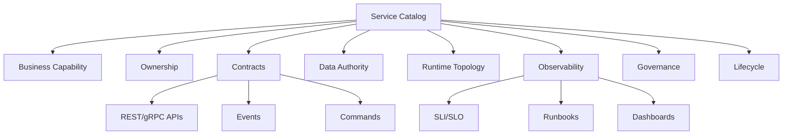
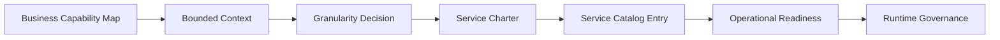
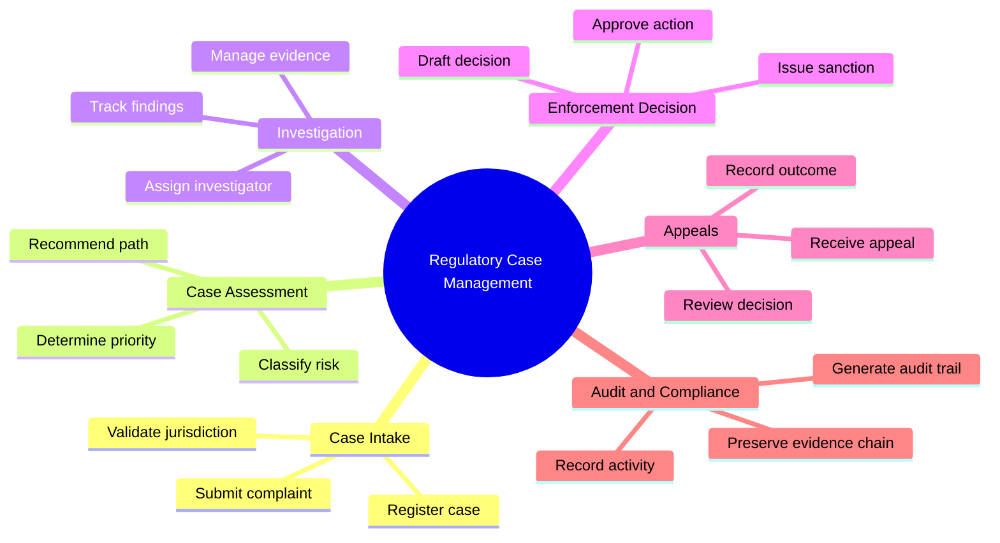
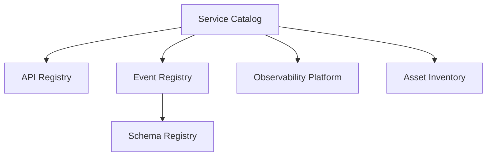
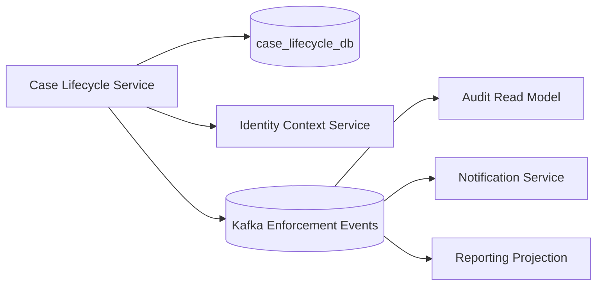

# Part 010 — Business Capability to Service Catalog

Di part sebelumnya, kita membuat model keputusan service granularity.
Sekarang kita ubah boundary candidate menjadi artefak yang bisa dipakai organisasi:

> service catalog.

Tapi jangan bayangkan service catalog sebagai daftar repo.
Jangan juga bayangkan sebagai CMDB yang hanya diisi karena audit.

Dalam microservices production-grade, service catalog adalah **operating contract**.

Ia menjawab:

- service ini untuk capability apa?
- siapa owner-nya?
- apa command/query/event yang disediakan?
- data apa yang dimiliki?
- siapa consumer-nya?
- dependency apa yang kritikal?
- bagaimana service gagal?
- apa SLO-nya?
- bagaimana cara deploy, observe, rollback, dan retire?
- apakah service ini masih sehat secara arsitektur?

Service catalog bukan dokumentasi pasif.
Service catalog adalah peta kontrol untuk mengelola sistem yang sudah terlalu besar untuk diingat manusia.

---

## 1. Masalah yang Diselesaikan Service Catalog

Microservices tanpa catalog cepat menjadi kabut.

Gejalanya:

- tidak ada yang tahu service mana source of truth;
- beberapa service mengklaim data yang sama;
- consumer memanggil endpoint lama karena tidak tahu endpoint baru;
- ownership kabur;
- on-call bingung saat incident;
- dependency graph tidak diketahui;
- service mati tapi tidak ada yang berani menghapus;
- architecture review mengulang pertanyaan yang sama;
- audit/compliance mencari evidence manual;
- platform team tidak tahu service mana production-critical.

Ketika jumlah service masih 5, ini terasa tidak penting.
Ketika jumlah service 50, ini mulai menyakitkan.
Ketika jumlah service 500, ini menjadi survival mechanism.

---

## 2. Definisi Praktis

Service catalog adalah registry yang mengikat **business, technical, operational, dan governance metadata** dari setiap service.



Jika catalog hanya berisi:

```text
service name
repo url
team name
```

itu belum cukup.

Minimal production-grade catalog harus menjawab:

```text
Why does this service exist?
What does it own?
Who depends on it?
How does it fail?
Who operates it?
How do we know it is healthy?
```

---

## 3. Service Catalog Bukan Inventory Biasa

Inventory bertanya:

> Apa saja service kita?

Service catalog bertanya:

> Apa konsekuensi operational dan business dari service ini?

Inventory statis:

```text
case-service
party-service
evidence-service
notification-service
```

Catalog hidup:

```text
case-lifecycle-service
- capability: manage regulatory case lifecycle
- owner: enforcement-platform/case-lifecycle-team
- source of truth: case lifecycle state
- critical consumers: case-ui, escalation-service, audit-read-model
- SLO: 99.9% successful command handling over 30 days
- failure mode: intake can continue as draft, escalation delayed
- runbook: /runbooks/case-lifecycle
- maturity: production-critical
```

Perbedaannya besar.
Inventory membuat daftar.
Catalog membuat sistem bisa dioperasikan.

---

## 4. Dari Capability Map ke Service Catalog

Input awal:

- capability map;
- bounded context map;
- service granularity scorecard;
- data ownership decision;
- dependency topology;
- operational requirements.

Output:

- service charter;
- service catalog entry;
- service maturity level;
- ownership record;
- API/event contract reference;
- SLO/runbook/dashboard link;
- dependency graph;
- lifecycle status.

Pipeline-nya:



Jangan mulai dari repo.
Mulai dari capability.

---

## 5. Capability Map: Input Utama

Capability map menjawab:

> Bisnis harus mampu melakukan apa agar value stream berjalan?

Contoh sederhana regulatory case management:



Capability bukan module.
Capability bukan team.
Capability bukan table.

Capability adalah kemampuan bisnis yang relatif stabil, bahkan ketika aplikasi, UI, atau database berubah.

---

## 6. Service Candidate from Capability

Tidak semua capability langsung menjadi service.

Gunakan mapping:

| Capability | Possible Implementation |
|---|---|
| Core capability with strong data authority | Microservice candidate |
| Supporting capability with tight local invariant | Module inside service |
| Technical reusable concern | Platform service/library |
| Read-heavy analytical capability | Projection/read model |
| Async heavy processing | Worker/service depending on authority |
| External integration | Adapter/ACL/integration service |

Contoh:

| Capability | Decision |
|---|---|
| Case Lifecycle Management | Core microservice |
| Case Priority Calculation | Module inside Case Assessment |
| Evidence Chain of Custody | Strong microservice candidate |
| Notification Dispatch | Platform/infrastructure service |
| Investigation Dashboard | Read model / BFF / query service |
| External Registry Lookup | ACL/integration service |

Catalog harus menyimpan **decision**, bukan hanya hasil akhirnya.
Kalau tidak, generasi engineer berikutnya akan mengulang debat yang sama.

---

## 7. Service Charter

Sebelum masuk catalog, tulis service charter.

Service charter adalah definisi singkat:

> Service ini ada untuk apa, memiliki apa, tidak memiliki apa, dan bagaimana ia berinteraksi.

Template:

```md
# Service Charter: <Service Name>

## Purpose
One paragraph explaining why this service exists.

## Business Capability
Capability name:
Capability type: core / supporting / generic / platform

## Responsibilities
- ...

## Non-Responsibilities
- ...

## Owned Data
- ...

## Not Owned Data
- ...

## Commands
- ...

## Queries
- ...

## Events Published
- ...

## Events Consumed
- ...

## Primary Consumers
- ...

## Critical Dependencies
- ...

## Failure Story
What happens when this service is unavailable?

## Owner
Team:
On-call:
Domain owner:

## Lifecycle Status
proposed / incubating / production / deprecated / retired
```

Charter memaksa clarity sebelum coding.

---

## 8. Example Service Charter: Case Lifecycle Service

```md
# Service Charter: Case Lifecycle Service

## Purpose
The Case Lifecycle Service is the source of truth for the regulatory case lifecycle. It manages valid state transitions from draft registration to closure and publishes lifecycle events for downstream services.

## Business Capability
Capability name: Case Lifecycle Management
Capability type: Core

## Responsibilities
- Register new regulatory cases.
- Validate lifecycle transitions.
- Maintain current lifecycle status.
- Record lifecycle transition reason.
- Publish lifecycle events.
- Expose case lifecycle query APIs.

## Non-Responsibilities
- It does not store evidence files.
- It does not decide enforcement outcomes.
- It does not assign investigators.
- It does not send notifications directly.
- It does not own analytical reporting projections.

## Owned Data
- case id
- lifecycle status
- lifecycle transition history
- closure reason
- submission metadata

## Not Owned Data
- party master profile
- evidence content
- enforcement decision text
- notification delivery status
- reporting aggregates

## Commands
- RegisterCase
- SubmitCase
- AcceptCaseForAssessment
- CloseCase
- ReopenCase

## Queries
- GetCaseLifecycle
- GetCaseStatus
- ListCasesByLifecycleState

## Events Published
- CaseRegistered
- CaseSubmitted
- CaseAcceptedForAssessment
- CaseClosed
- CaseReopened

## Events Consumed
- EnforcementDecisionFinalized
- AppealAccepted

## Primary Consumers
- case-management-ui
- case-assessment-service
- escalation-service
- audit-read-model

## Critical Dependencies
- identity-context-service
- party-reference-service
- transactional-outbox

## Failure Story
If this service is unavailable, new case submission is unavailable. Draft UI can continue locally only if draft storage is separate. Downstream services must not infer lifecycle state from stale projections.

## Owner
Team: enforcement-case-platform
Domain owner: Director of Case Operations
On-call: case-platform-primary

## Lifecycle Status
production
```

Ini jauh lebih berguna daripada:

```text
case-service: manages cases
```

Kalimat pendek seperti itu menciptakan ambiguity.
Ambiguity menciptakan coupling.

---

## 9. Catalog Entry: YAML Format

Service catalog sebaiknya machine-readable.
Manusia bisa membaca MDX/Markdown, tapi platform perlu YAML/JSON.

Contoh:

```yaml
apiVersion: platform.acme.com/v1
kind: ServiceCatalogEntry
metadata:
  name: case-lifecycle-service
  displayName: Case Lifecycle Service
  lifecycle: production
  tier: tier-1
  tags:
    - java
    - spring-boot
    - regulatory-case-management
    - core-domain
spec:
  purpose: >
    Source of truth for regulatory case lifecycle state and lifecycle transitions.
  businessCapability:
    name: Case Lifecycle Management
    type: core
    domain: Enforcement Lifecycle
    boundedContext: Case Lifecycle
  ownership:
    team: enforcement-case-platform
    domainOwner: case-operations
    technicalOwner: case-platform-tech-lead
    onCallRotation: case-platform-primary
    slackChannel: '#case-platform'
  source:
    repository: github.com/acme/enforcement/case-lifecycle-service
    defaultBranch: main
    buildSystem: maven
    runtime: java-21
  runtime:
    platform: kubernetes
    namespace: enforcement-prod
    deploymentName: case-lifecycle-service
    replicas:
      min: 3
      max: 20
  contracts:
    rest:
      openapi: ./contracts/openapi.yaml
    eventsPublished:
      - CaseRegistered
      - CaseSubmitted
      - CaseAcceptedForAssessment
      - CaseClosed
    eventsConsumed:
      - EnforcementDecisionFinalized
      - AppealAccepted
  dataOwnership:
    owns:
      - case_lifecycle
      - case_transition_history
    doesNotOwn:
      - party_profile
      - evidence_blob
      - enforcement_decision
    database: case_lifecycle_db
  dependencies:
    critical:
      - identity-context-service
      - postgresql-case-lifecycle
      - kafka-enforcement-events
    nonCritical:
      - notification-service
      - search-projection-service
  observability:
    dashboard: grafana://dashboards/case-lifecycle
    runbook: https://internal/runbooks/case-lifecycle
    logs:
      index: prod-case-lifecycle
      correlationField: trace_id
    tracing:
      serviceName: case-lifecycle-service
  reliability:
    slo:
      availability: 99.9
      latencyP95Ms: 250
      errorRateMaxPercent: 0.1
    failureMode: >
      Case submission unavailable. Read projections may remain available but must show staleness.
  security:
    dataClassification: confidential
    pii: true
    auditRequired: true
    serviceToServiceAuth: mtls-jwt
  governance:
    architectureDecisionRecord: ./docs/adr/adr-004-case-lifecycle-boundary.md
    lastArchitectureReview: 2026-07-05
    nextReviewDue: 2026-10-05
```

Ini bukan sekadar metadata.
Ini operational contract.

---

## 10. Catalog Entry Fields: Yang Wajib dan Alasannya

### 10.1 Identity

```yaml
metadata:
  name: case-lifecycle-service
  displayName: Case Lifecycle Service
  lifecycle: production
  tier: tier-1
```

Kenapa penting:

- nama stabil untuk automation;
- display name untuk manusia;
- lifecycle untuk governance;
- tier untuk incident priority.

### 10.2 Purpose

```yaml
purpose: Source of truth for regulatory case lifecycle state.
```

Purpose harus menjawab “mengapa service ini ada”.
Jika purpose tidak bisa ditulis dalam satu paragraf jelas, boundary belum matang.

### 10.3 Business Capability

```yaml
businessCapability:
  name: Case Lifecycle Management
  type: core
  domain: Enforcement Lifecycle
  boundedContext: Case Lifecycle
```

Ini menghubungkan service ke domain.
Tanpa ini, service catalog menjadi technical inventory.

### 10.4 Ownership

```yaml
ownership:
  team: enforcement-case-platform
  domainOwner: case-operations
  technicalOwner: case-platform-tech-lead
  onCallRotation: case-platform-primary
```

Service tanpa owner adalah risiko.
Catalog harus membuat risiko itu terlihat.

### 10.5 Contracts

```yaml
contracts:
  rest:
    openapi: ./contracts/openapi.yaml
  eventsPublished:
    - CaseSubmitted
```

Contract adalah permukaan dependensi.
Catalog harus membantu consumer menemukan contract yang benar.

### 10.6 Data Ownership

```yaml
dataOwnership:
  owns:
    - case_lifecycle
  doesNotOwn:
    - party_profile
```

Bagian `doesNotOwn` penting.
Banyak masalah microservices muncul bukan karena orang tidak tahu service memiliki apa, tapi karena tidak jelas service **tidak boleh** memiliki apa.

### 10.7 Dependencies

```yaml
dependencies:
  critical:
    - identity-context-service
  nonCritical:
    - notification-service
```

Critical dependency harus memengaruhi failure story.
Non-critical dependency harus punya degradation path.

### 10.8 Observability

```yaml
observability:
  dashboard: grafana://dashboards/case-lifecycle
  runbook: https://internal/runbooks/case-lifecycle
```

Jika service production tidak punya dashboard dan runbook, ia belum production-ready secara operasional.

### 10.9 Reliability

```yaml
reliability:
  slo:
    availability: 99.9
    latencyP95Ms: 250
```

SLO membantu membedakan “service hidup” dari “service cukup baik untuk user/business”.

### 10.10 Governance

```yaml
governance:
  architectureDecisionRecord: ./docs/adr/adr-004-case-lifecycle-boundary.md
```

Governance yang baik bukan approval panjang.
Governance yang baik adalah traceability keputusan.

---

## 11. Lifecycle Status

Setiap service harus punya status lifecycle.

| Status | Meaning |
|---|---|
| proposed | Boundary sedang dievaluasi |
| incubating | Service dibangun/diuji, belum critical |
| production | Melayani workload production |
| production-critical | Tier tinggi, punya SLO/on-call kuat |
| deprecated | Consumer tidak boleh bertambah |
| retiring | Sedang migrasi consumer keluar |
| retired | Sudah tidak melayani traffic |

Lifecycle mencegah service mati suri.

Contoh policy:

```text
If service lifecycle = deprecated:
- no new consumers allowed
- API changes limited to compatibility/security fixes
- retirement owner must be assigned
- migration deadline must exist
```

Tanpa lifecycle policy, service lama menjadi fossil dependency.

---

## 12. Service Tiering

Tier membantu incident response.

| Tier | Description | Example |
|---|---|---|
| Tier 0 | Platform foundation | identity, networking, event backbone |
| Tier 1 | Critical user/business path | case lifecycle, payment, enforcement decision |
| Tier 2 | Important but degradable | notification, search projection |
| Tier 3 | Internal/supporting | admin tooling, batch reconciliation |
| Tier 4 | Experimental/incubating | prototype services |

Tier tidak boleh jadi vanity label.
Tier harus memengaruhi:

- SLO;
- alerting;
- on-call;
- deployment rules;
- change freeze;
- DR requirement;
- review depth.

```yaml
metadata:
  tier: tier-1
reliability:
  slo:
    availability: 99.9
    latencyP95Ms: 250
operations:
  onCallRequired: true
  incidentSeverityMax: sev1
```

---

## 13. Service Catalog and Java Runtime Metadata

Catalog jangan hanya di wiki.
Sebagian metadata bisa diekspos dari service runtime.

Contoh Spring Boot `info` properties:

```yaml
management:
  endpoints:
    web:
      exposure:
        include: health,info,metrics,prometheus
  info:
    env:
      enabled: true

info:
  service:
    name: case-lifecycle-service
    capability: Case Lifecycle Management
    owner: enforcement-case-platform
    tier: tier-1
    lifecycle: production
  build:
    java: 21
    artifact: case-lifecycle-service
```

Endpoint `/actuator/info` bisa mengembalikan:

```json
{
  "service": {
    "name": "case-lifecycle-service",
    "capability": "Case Lifecycle Management",
    "owner": "enforcement-case-platform",
    "tier": "tier-1",
    "lifecycle": "production"
  },
  "build": {
    "java": "21",
    "artifact": "case-lifecycle-service"
  }
}
```

Tapi hati-hati.
Jangan expose metadata sensitif ke public network.
Endpoint management harus diamankan dan dibatasi.

---

## 14. Code-Level Service Metadata

Untuk beberapa organisasi, metadata bisa dideklarasikan di code.

Contoh annotation:

```java
package com.acme.platform.catalog;

import java.lang.annotation.Retention;
import java.lang.annotation.RetentionPolicy;

@Retention(RetentionPolicy.RUNTIME)
public @interface ServiceCatalogMetadata {
    String name();
    String capability();
    String ownerTeam();
    String tier();
    String lifecycle();
    String boundedContext();
}
```

Pemakaian:

```java
@ServiceCatalogMetadata(
    name = "case-lifecycle-service",
    capability = "Case Lifecycle Management",
    ownerTeam = "enforcement-case-platform",
    tier = "tier-1",
    lifecycle = "production",
    boundedContext = "Case Lifecycle"
)
@SpringBootApplication
public class CaseLifecycleApplication {
    public static void main(String[] args) {
        SpringApplication.run(CaseLifecycleApplication.class, args);
    }
}
```

Ini bisa dibaca oleh build plugin untuk menghasilkan catalog entry.

Tapi jangan semua metadata ditaruh di annotation.
Metadata seperti dependency, runbook, SLO, dan ADR lebih baik tetap di file catalog karena sering berubah tanpa perlu rebuild aplikasi.

---

## 15. Catalog as Code

Service catalog harus versioned.

Struktur repo:

```text
case-lifecycle-service/
├── catalog/
│   └── service.yaml
├── contracts/
│   ├── openapi.yaml
│   └── events/
│       ├── CaseSubmitted.schema.json
│       └── CaseClosed.schema.json
├── docs/
│   ├── adr/
│   ├── runbook.md
│   └── service-charter.md
├── src/
└── pom.xml
```

Keuntungan:

- review metadata bersama code;
- perubahan ownership terlihat;
- ADR tersambung dengan catalog;
- CI bisa validate required fields;
- platform bisa ingest otomatis.

CI validation sederhana:

```bash
#!/usr/bin/env bash
set -euo pipefail

required=(
  ".metadata.name"
  ".metadata.lifecycle"
  ".metadata.tier"
  ".spec.businessCapability.name"
  ".spec.ownership.team"
  ".spec.dataOwnership.owns"
  ".spec.observability.runbook"
  ".spec.reliability.slo.availability"
)

for field in "${required[@]}"; do
  value=$(yq "$field" catalog/service.yaml)
  if [[ "$value" == "null" || -z "$value" ]]; then
    echo "Missing required catalog field: $field"
    exit 1
  fi
done
```

Governance terbaik sering berupa guardrail otomatis kecil.
Bukan meeting besar.

---

## 16. Relationship: Catalog, API Registry, Event Registry

Jangan campur semua hal menjadi satu blob.



Service catalog menjawab service ownership dan operating model.
API registry menjawab endpoint contract.
Event registry menjawab event semantics.
Schema registry menjawab schema compatibility.
Observability platform menjawab runtime behavior.

Masing-masing bisa terpisah, tapi harus terhubung.

---

## 17. Consumer Discovery

Service catalog harus membantu consumer menjawab:

- service mana yang harus saya panggil?
- contract mana yang stabil?
- apakah endpoint ini deprecated?
- siapa yang harus saya ajak bicara?
- data ini source of truth dari mana?
- apakah saya boleh consume event ini?
- freshness/staleness expectation-nya apa?

Tambahkan section consumer guidance:

```yaml
consumerGuidance:
  preferredIntegration:
    command: rest
    lifecycleEvents: kafka
    readModel: case-search-service
  compatibilityPolicy: additive-changes-only-with-90-day-deprecation-window
  onboarding:
    contact: '#case-platform'
    docs: https://internal/docs/case-lifecycle/onboarding
  deprecatedEndpoints:
    - method: GET
      path: /cases/{caseId}/legacy-status
      removalDate: 2026-12-31
```

Catalog yang baik mengurangi tribal knowledge.

---

## 18. Service Dependencies

Dependency harus diklasifikasi.

Bukan semua dependency sama.

| Dependency Type | Meaning | Example |
|---|---|---|
| critical runtime | service tidak bisa menjalankan command tanpa ini | database, identity |
| optional runtime | service bisa degrade | notification |
| async input | event consumed | CaseSubmitted |
| async output | event published | CaseClosed |
| build-time | library/build dependency | shared error library |
| operational | dashboard/log/event backbone | telemetry collector |
| data projection | read model source | search index |

Catalog entry:

```yaml
dependencies:
  runtime:
    critical:
      - name: postgresql-case-lifecycle
        reason: primary data store
      - name: identity-context-service
        reason: caller authorization context
    optional:
      - name: notification-service
        degradation: lifecycle transition succeeds; notification retried asynchronously
  async:
    consumes:
      - name: EnforcementDecisionFinalized
        source: enforcement-decision-service
    publishes:
      - name: CaseClosed
        consumers:
          - audit-read-model
          - notification-service
          - reporting-projection
  buildTime:
    - name: platform-error-envelope
      versionPolicy: semver-compatible
```

Dependency graph yang tidak diklasifikasi tidak cukup untuk reliability.

---

## 19. Mermaid Dependency View

Catalog bisa menghasilkan diagram otomatis.



Diagram ini harus dikaitkan dengan failure story.

Contoh:

```text
If Notification Service is down:
- CaseLifecycle command still succeeds.
- CaseClosed event remains in Kafka/outbox.
- Notification retry handles delivery later.
- User sees lifecycle state updated.

If Identity Context Service is down:
- Commands requiring authorization fail closed.
- Read-only public metadata may remain available if separately authorized.
```

Tanpa failure story, diagram dependency hanya gambar.

---

## 20. Catalog and Operational Readiness

Sebuah service boleh masuk production hanya jika catalog menyatakan operational readiness.

Checklist:

```yaml
operationalReadiness:
  hasRunbook: true
  hasDashboard: true
  hasAlerts: true
  hasSlo: true
  hasOwner: true
  hasOnCall: true
  hasRollbackPlan: true
  hasCapacityProfile: true
  hasFailureModeDocumented: true
  hasSecurityReview: true
  hasDataClassification: true
```

Gate sederhana:

```text
No production deployment for tier-1/tier-2 service unless:
- owner exists
- runbook exists
- dashboard exists
- SLO exists
- critical dependencies declared
- data classification declared
```

Ini bukan bureaucracy.
Ini mencegah service yatim di production.

---

## 21. Catalog Maturity Levels

Service tidak harus sempurna sejak hari pertama.
Gunakan maturity level.

| Level | Description |
|---|---|
| 0 | Unknown service; no reliable metadata |
| 1 | Basic identity and owner known |
| 2 | Capability, contracts, and data ownership documented |
| 3 | SLO, runbook, dashboards, dependencies documented |
| 4 | Automated validation and runtime metadata linked |
| 5 | Catalog drives governance, incident, cost, and architecture review |

Catalog entry:

```yaml
maturity:
  level: 3
  missing:
    - automated dependency discovery
    - cost attribution
```

Maturity membantu improvement tanpa pura-pura semua lengkap.

---

## 22. Service Catalog Review Cadence

Catalog membusuk jika tidak dirawat.

Trigger review:

- service baru dibuat;
- owner berubah;
- service naik tier;
- API breaking change;
- incident besar;
- new critical dependency;
- data classification berubah;
- service deprecated;
- architecture review periodik;
- compliance audit.

Review policy:

```yaml
governance:
  review:
    lastReviewed: 2026-07-05
    nextReviewDue: 2026-10-05
    requiredOn:
      - owner-change
      - tier-change
      - new-critical-dependency
      - public-contract-change
      - incident-sev1
```

Catalog bukan dokumen selesai.
Catalog adalah living control plane.

---

## 23. Avoiding Catalog Theater

Catalog theater terjadi saat organisasi punya catalog tetapi tidak memakainya.

Gejala:

- metadata diisi sekali lalu basi;
- owner field berisi team lama;
- runbook link 404;
- SLO tidak dipakai alerting;
- API contract tidak cocok dengan runtime;
- service deprecated tapi consumer baru tetap masuk;
- tidak ada CI validation;
- tidak ada hubungan dengan incident management.

Cara mencegah:

- generate sebagian metadata otomatis;
- validate required fields di CI;
- hubungkan catalog dengan deployment;
- hubungkan catalog dengan dashboards;
- hubungkan catalog dengan alert ownership;
- audit link runbook/dashboard;
- tampilkan freshness/last verified;
- buat missing metadata terlihat.

Catalog harus punya konsekuensi operasional.
Kalau tidak, ia menjadi wiki dekoratif.

---

## 24. Service Catalog and Architecture Review

Architecture review yang sehat bisa dimulai dari catalog.

Pertanyaan review:

- apakah purpose service masih jelas?
- apakah capability mapping masih valid?
- apakah data ownership dilanggar?
- apakah dependency graph makin berbahaya?
- apakah SLO sesuai tier?
- apakah runbook terbukti saat incident?
- apakah consumer bertambah tanpa kontrol?
- apakah endpoint deprecated masih dipakai?
- apakah service masih punya owner?
- apakah service harus di-merge, split, atau retire?

Catalog memberi evidence.
Tanpa evidence, architecture review menjadi opini.

---

## 25. Example: Capability to Catalog Mapping Table

```md
| Capability | Bounded Context | Service | Status | Owner | Data Authority | Notes |
|---|---|---|---|---|---|---|
| Case Lifecycle Management | Case Lifecycle | case-lifecycle-service | production | enforcement-case-platform | case lifecycle state | Core tier-1 |
| Evidence Chain of Custody | Evidence Management | evidence-service | proposed | investigation-platform | evidence metadata, custody events | Requires security review |
| Assignment Management | Assignment | assignment-service | incubating | case-operations-automation | assignment records | Validate owner readiness |
| Notification Dispatch | Notification | notification-service | production | platform-messaging | delivery attempt state | Platform capability |
| Investigation Dashboard | Investigation Query | investigation-bff | proposed | investigation-experience | none; read projection | Not command authority |
```

Tabel ini membantu melihat landscape.
Tapi setiap row tetap butuh catalog entry detail.

---

## 26. Java Service Template with Catalog

Saat membuat service baru, template sebaiknya sudah membawa catalog.

```text
new-java-service/
├── catalog/
│   └── service.yaml
├── docs/
│   ├── service-charter.md
│   ├── runbook.md
│   └── adr/
│       └── adr-001-service-boundary.md
├── contracts/
│   ├── openapi.yaml
│   └── events/
├── src/main/java/
├── src/test/java/
├── pom.xml
└── README.md
```

README tidak menggantikan catalog.
README menjelaskan developer workflow.
Catalog menjelaskan operating contract.

---

## 27. Minimal `service.yaml` for New Service

```yaml
apiVersion: platform.acme.com/v1
kind: ServiceCatalogEntry
metadata:
  name: TODO
  displayName: TODO
  lifecycle: proposed
  tier: tier-3
  tags: []
spec:
  purpose: TODO
  businessCapability:
    name: TODO
    type: TODO # core/supporting/generic/platform
    domain: TODO
    boundedContext: TODO
  ownership:
    team: TODO
    domainOwner: TODO
    technicalOwner: TODO
    onCallRotation: TODO
  source:
    repository: TODO
    buildSystem: maven
    runtime: java-21
  contracts:
    rest:
      openapi: ./contracts/openapi.yaml
    eventsPublished: []
    eventsConsumed: []
  dataOwnership:
    owns: []
    doesNotOwn: []
  dependencies:
    critical: []
    nonCritical: []
  observability:
    dashboard: TODO
    runbook: ./docs/runbook.md
  reliability:
    slo:
      availability: TODO
      latencyP95Ms: TODO
    failureMode: TODO
  security:
    dataClassification: TODO
    pii: TODO
    auditRequired: TODO
  governance:
    architectureDecisionRecord: ./docs/adr/adr-001-service-boundary.md
    lastArchitectureReview: TODO
    nextReviewDue: TODO
```

CI boleh menolak `TODO` untuk production.

---

## 28. Catalog-Driven Guardrails

Setelah catalog ada, gunakan untuk automation.

Contoh guardrail:

1. tier-1 service wajib punya SLO;
2. service dengan PII wajib security review;
3. service production wajib owner dan on-call;
4. deprecated service tidak boleh punya consumer baru;
5. public API wajib punya compatibility policy;
6. service dengan critical dependency baru wajib update failure story;
7. service tanpa dashboard tidak boleh naik production-critical;
8. service tanpa ADR tidak boleh dibuat sebagai new boundary.

Pseudo-rule:

```java
public final class CatalogPolicy {

    public List<String> validate(ServiceCatalogEntry entry) {
        List<String> violations = new ArrayList<>();

        if (entry.isProduction() && entry.ownerTeam().isBlank()) {
            violations.add("Production service must have owner team");
        }

        if (entry.isTierOne() && entry.slo().isEmpty()) {
            violations.add("Tier-1 service must define SLO");
        }

        if (entry.security().containsPii() && !entry.security().hasReview()) {
            violations.add("PII service must have security review");
        }

        if (entry.isDeprecated() && entry.hasNewConsumers()) {
            violations.add("Deprecated service cannot add new consumers");
        }

        return violations;
    }
}
```

Catalog menjadi control plane ketika ia punya rules.

---

## 29. What Should Not Be in Service Catalog

Jangan masukkan semuanya.

Hindari:

- secret value;
- password/token;
- private key;
- terlalu banyak low-level config;
- runtime metrics mentah;
- semua endpoint detail jika sudah ada OpenAPI;
- semua schema detail jika sudah ada schema registry;
- informasi yang berubah setiap detik;
- informasi yang tidak punya owner.

Catalog adalah pointer dan summary.
Bukan dumping ground.

---

## 30. Governance Without Slowing Teams

Catalog sering ditakuti karena dianggap governance berat.

Governance yang buruk:

```text
Fill 40-page document.
Wait for architecture board.
Nobody reads after approval.
```

Governance yang baik:

```text
Write service.yaml.
Write short ADR.
CI validates mandatory fields.
Architecture review focuses on high-risk decisions.
Catalog links to runtime evidence.
```

Tujuannya bukan mengontrol semua keputusan.
Tujuannya membuat keputusan penting terlihat dan bisa dipertanggungjawabkan.

---

## 31. Service Catalog for Regulatory Defensibility

Dalam sistem regulasi, catalog punya nilai tambahan.

Ia membantu menjawab:

- service mana yang membuat keputusan bisnis?
- service mana yang hanya menyimpan projection?
- data sensitif mengalir ke mana?
- audit event berasal dari service apa?
- siapa owner kontrol tertentu?
- dependency apa yang memengaruhi keputusan enforcement?
- jika incident terjadi, service mana yang mungkin memengaruhi evidence chain?

Contoh metadata compliance:

```yaml
compliance:
  decisionMaking: true
  auditTrailRequired: true
  evidenceChainImpact: false
  retentionPolicy: case-lifecycle-retention-v2
  legalHoldAware: true
  dataLineage:
    upstream:
      - party-reference-service
    downstream:
      - audit-read-model
      - reporting-projection
```

Ini membuat architecture bukan hanya teknis.
Ini membuatnya defensible.

---

## 32. Catalog Health Metrics

Ukur catalog juga.

Metric:

- percentage of production services with owner;
- percentage with runbook;
- percentage with SLO;
- percentage with declared data ownership;
- number of deprecated services with active consumers;
- number of services with unknown tier;
- number of stale catalog entries;
- number of orphan services;
- number of services with missing critical dependency declaration.

Example dashboard:

```text
Catalog Completeness
- Owner coverage: 98%
- Runbook coverage: 91%
- SLO coverage tier-1/tier-2: 87%
- Stale entries > 90 days: 14
- Deprecated services with consumers: 6
- Unknown data classification: 22
```

Catalog quality adalah architecture health signal.

---

## 33. Anti-Patterns

### 33.1 Repo Catalog

```yaml
name: case-service
repo: github.com/acme/case-service
owner: backend-team
```

Masalah:

- tidak menjelaskan capability;
- tidak menjelaskan data authority;
- tidak menjelaskan failure story;
- tidak membantu incident.

### 33.2 Static Wiki Catalog

```text
Last updated: 2022
Owner: old-team
Runbook: missing
```

Masalah:

- tidak trusted;
- orang berhenti menggunakannya;
- governance menjadi formalitas.

### 33.3 Catalog as Approval Trap

Semua perubahan harus menunggu catalog board.

Masalah:

- team bypass process;
- metadata tidak jujur;
- architecture governance dianggap musuh delivery.

### 33.4 Catalog Without Consequences

Metadata missing tapi deployment tetap jalan.

Masalah:

- catalog tidak punya daya;
- production dipenuhi service yang tidak siap.

---

## 34. Implementation Roadmap

Jika organisasi belum punya catalog, jangan mulai terlalu besar.

### Step 1: Minimum Viable Catalog

Wajib:

- service name;
- owner team;
- lifecycle;
- tier;
- business capability;
- data ownership;
- repo;
- runbook;
- dashboard;
- critical dependencies.

### Step 2: Catalog as Code

- simpan `catalog/service.yaml` di setiap repo;
- validate di CI;
- publish ke central index.

### Step 3: Link Runtime Metadata

- actuator/info;
- deployment labels;
- tracing service name;
- dashboard tags.

### Step 4: Add Governance Rules

- tier policy;
- security policy;
- deprecation policy;
- ownership policy.

### Step 5: Use in Incidents and Reviews

- incident commander membuka catalog;
- service owner terlihat;
- dependencies terlihat;
- runbook terlihat.

### Step 6: Architecture Intelligence

- dependency graph;
- ownership graph;
- stale service detection;
- cost attribution;
- risk heatmap.

---

## 35. Example Central Index

```yaml
services:
  - name: case-lifecycle-service
    catalog: github.com/acme/enforcement/case-lifecycle-service/catalog/service.yaml
  - name: evidence-service
    catalog: github.com/acme/enforcement/evidence-service/catalog/service.yaml
  - name: notification-service
    catalog: github.com/acme/platform/notification-service/catalog/service.yaml
```

Central platform bisa ingest semua entry dan membuat UI.

Jangan paksa semua metadata ditulis manual di central UI.
Jika metadata hanya di UI, ia sering tidak direview bersama code.

---

## 36. Catalog and Deployment Labels

Runtime deployment harus bisa dikaitkan ke catalog.

Kubernetes labels:

```yaml
apiVersion: apps/v1
kind: Deployment
metadata:
  name: case-lifecycle-service
  labels:
    app.kubernetes.io/name: case-lifecycle-service
    app.kubernetes.io/part-of: regulatory-case-management
    acme.com/service-tier: tier-1
    acme.com/owner-team: enforcement-case-platform
    acme.com/business-capability: case-lifecycle-management
spec:
  replicas: 3
```

Dengan label ini:

- cost bisa dikaitkan ke service/team;
- alert bisa route ke owner;
- dashboards bisa group by capability;
- inventory bisa dicocokkan dengan runtime.

---

## 37. Catalog and Observability Correlation

Logging/tracing metric harus memakai nama service yang konsisten.

```yaml
observability:
  serviceName: case-lifecycle-service
```

Java config:

```yaml
spring:
  application:
    name: case-lifecycle-service

management:
  tracing:
    enabled: true
```

Structured log field:

```json
{
  "timestamp": "2026-07-05T10:00:00Z",
  "service": "case-lifecycle-service",
  "trace_id": "4bf92f3577b34da6a3ce929d0e0e4736",
  "event": "CaseSubmitted",
  "case_id": "CASE-2026-00001"
}
```

Jika service name berbeda antara catalog, deployment, tracing, dan logs, debugging menjadi sulit.

---

## 38. Catalog and Deprecation

Deprecation harus terlihat.

```yaml
lifecycle: deprecated
deprecation:
  reason: Replaced by case-lifecycle-service v2 API
  noNewConsumersAfter: 2026-08-01
  removalTargetDate: 2027-01-31
  migrationGuide: https://internal/docs/case-lifecycle/migration-v2
  knownConsumers:
    - legacy-case-ui
    - audit-adapter-v1
```

Policy:

```text
Deprecated service cannot add new consumers.
Consumer list must be reviewed monthly.
Removal date cannot be empty.
```

Tanpa policy, deprecation hanya label palsu.

---

## 39. Catalog and Cost Awareness

Service catalog juga bisa menjadi dasar cost attribution.

```yaml
cost:
  costCenter: enforcement-platform
  ownerTeam: enforcement-case-platform
  monthlyBudgetUsd: 12000
  costDrivers:
    - database-storage
    - kafka-throughput
    - api-traffic
```

Pertanyaan architecture:

- apakah service ini worth the cost?
- apakah read model terlalu mahal?
- apakah observability cardinality meledak?
- apakah tier service sesuai biaya DR?
- apakah service kecil terlalu banyak memakan overhead platform?

Microservices punya biaya ekonomi.
Catalog membuat biaya itu terlihat.

---

## 40. Top 1% Mental Model

Engineer biasa melihat service catalog sebagai dokumentasi.

Engineer senior melihat service catalog sebagai:

- ownership map;
- capability map;
- dependency graph;
- operational readiness index;
- risk register;
- governance surface;
- incident navigation tool;
- architecture memory.

Service catalog bukan “nice to have”.
Ia adalah cara organisasi menjaga sistem tetap bisa dipahami setelah microservices melewati kapasitas memori individu.

Microservices gagal bukan hanya karena teknologi.
Microservices gagal karena organisasi kehilangan peta.

Service catalog adalah peta itu.

---

## 41. Checklist

Untuk setiap service production, pastikan catalog menjawab:

- [ ] Apa purpose service ini?
- [ ] Business capability apa yang dilayani?
- [ ] Bounded context apa yang dimodelkan?
- [ ] Siapa owner team?
- [ ] Siapa domain owner?
- [ ] Siapa on-call?
- [ ] Data apa yang dimiliki?
- [ ] Data apa yang tidak dimiliki?
- [ ] API/event contract mana yang stabil?
- [ ] Siapa consumer utama?
- [ ] Dependency apa yang critical?
- [ ] Apa failure story service ini?
- [ ] Apa SLO service ini?
- [ ] Di mana dashboard?
- [ ] Di mana runbook?
- [ ] Apa lifecycle status?
- [ ] Apa tier service?
- [ ] Apakah ada ADR boundary?
- [ ] Apakah service punya deprecation plan jika deprecated?
- [ ] Apakah metadata masih fresh?

Jika service tidak bisa menjawab ini, service belum benar-benar owned.

---

## 42. Latihan Desain

Buat catalog untuk tiga service candidate:

1. Case Lifecycle Service;
2. Evidence Service;
3. Assignment Service.

Untuk masing-masing, tulis:

- service charter;
- `service.yaml` minimal;
- dependency graph Mermaid;
- failure story;
- data ownership section;
- SLO awal;
- lifecycle status;
- ADR link placeholder.

Pertanyaan evaluasi:

- mana service yang seharusnya tier-1?
- mana yang boleh stale/degraded?
- mana yang mengandung PII?
- mana yang punya evidence chain impact?
- mana yang sebaiknya tetap module dulu?

---

## 43. Ringkasan

Business capability map menghasilkan candidate boundary.
Granularity decision menentukan apakah boundary layak menjadi service.
Service catalog membuat boundary itu bisa dioperasikan, diaudit, dan dievolusikan.

Formula praktis:

```text
Capability Map
  -> Bounded Context
  -> Granularity Decision
  -> Service Charter
  -> Catalog Entry
  -> Operational Readiness
  -> Runtime Governance
```

Service catalog bukan daftar service.
Service catalog adalah **kontrak hidup** antara bisnis, engineering, operasi, security, dan governance.

Kalau microservices adalah sistem terdistribusi, catalog adalah peta agar manusia tidak tersesat di dalamnya.

---

## 44. Referensi Lanjutan

- Martin Fowler & James Lewis — Microservices
- Chris Richardson — Microservices Patterns: Decompose by Business Capability
- AWS Prescriptive Guidance — Decompose by Business Capability
- Microsoft Azure Architecture Center — Use Domain Analysis to Model Microservices
- Backstage Software Catalog — System model and catalog-info.yaml
- Google SRE Workbook — Service Level Objectives
- Team Topologies — Team ownership and platform operating model
