# Part 011 — Process Boundaries and Long-Running Workflows

> Microservice boundary menjawab: **siapa yang memiliki capability dan data?**  
> Process boundary menjawab: **bagaimana pekerjaan bisnis bergerak dari satu keputusan ke keputusan berikutnya?**

Banyak sistem microservices terlihat benar di diagram service, tetapi gagal saat masuk proses nyata:

- approval menunggu manusia selama 3 hari;
- investigasi bisa dikembalikan ke tahap sebelumnya;
- payment berhasil, fulfillment gagal;
- dokumen perlu diverifikasi sebelum keputusan final;
- SLA harus naik level otomatis jika tidak ada tindakan;
- audit harus bisa menjelaskan kenapa sebuah keputusan terjadi;
- beberapa service harus ikut bergerak, tetapi tidak boleh dikunci dalam satu distributed transaction.

Itulah wilayah **long-running workflow**.

Part ini bukan membahas “pakai Camunda atau Temporal?” sebagai pilihan tool. Tool hanya konsekuensi. Fokus kita adalah mental model: **bagaimana mengenali process boundary, bagaimana memisahkannya dari service boundary, dan bagaimana membuat proses lintas service tetap observable, recoverable, dan defensible.**

---

## 1. Masalah Utama: Service Boundary Bukan Selalu Process Boundary

Satu service biasanya memiliki satu capability utama. Namun satu **business process** sering melewati banyak capability.

Contoh regulatory enforcement lifecycle:

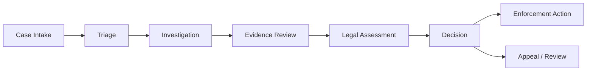

Kalau semua step itu dimasukkan ke satu service raksasa, kita kehilangan independent ownership. Kalau semua step dipisah tanpa process model, kita mendapat event soup: tiap service “bereaksi” tetapi tidak ada yang tahu lifecycle end-to-end.

Jadi pertanyaan arsitekturalnya bukan:

> “Service mana yang memanggil service mana?”

Pertanyaan yang lebih benar:

> “Di mana state proses hidup, siapa yang boleh mengubahnya, bagaimana timeout/compensation terjadi, dan bagaimana kita menjelaskan hasil akhirnya?”

---

## 2. Vocabulary yang Harus Dibedakan

Sebelum desain, bedakan beberapa istilah yang sering dicampur.

| Istilah | Arti | Scope | Contoh |
|---|---|---:|---|
| Entity state | Status domain object lokal | Dalam satu bounded context | `Case.status = UNDER_INVESTIGATION` |
| Process state | Posisi pekerjaan dalam lifecycle | Bisa lintas service | `InvestigationWorkflow.currentStep = WAITING_EVIDENCE_REVIEW` |
| Command | Permintaan melakukan aksi | Biasanya sync atau queued | `SubmitEvidenceReview` |
| Domain event | Fakta yang terjadi dalam domain | Setelah state berubah | `EvidenceReviewCompleted` |
| Integration event | Fakta untuk service lain | Lintas boundary | `CaseReadyForLegalAssessment` |
| Saga | Koordinasi beberapa local transaction | Lintas service | reserve → pay → fulfill |
| Workflow | Model proses durable, sering long-running | Lintas waktu dan aktor | escalation lifecycle |
| Process manager | Komponen yang menyimpan state koordinasi | Application/integration layer | `CaseEscalationProcessManager` |
| Orchestrator | Koordinator eksplisit yang memberi instruksi | Bisa workflow engine/service | BPMN/Temporal/custom orchestrator |
| Choreography | Service bereaksi terhadap event tanpa pusat kontrol | Event-driven | `PaymentCaptured` triggers shipping |

Kesalahan umum: menganggap semua proses lintas service adalah saga. Tidak selalu. Saga adalah pola untuk menjaga konsistensi bisnis lintas local transactions. Workflow lebih luas: bisa mencakup human task, timer, SLA, approval, audit, branching, dan manual override.

---

## 3. Mental Model: Process Boundary sebagai Lifecycle Ownership

Process boundary adalah boundary dari **perubahan status pekerjaan bisnis dari waktu ke waktu**.

Service boundary menjawab:

- siapa owner data;
- siapa owner invariant;
- siapa owner API;
- siapa owner deployment;
- siapa owner runtime behavior.

Process boundary menjawab:

- apa lifecycle end-to-end;
- state mana yang legal setelah state ini;
- event apa yang memindahkan proses;
- siapa actor pada tiap step;
- timeout apa yang berlaku;
- escalation apa yang otomatis;
- bagaimana compensation dilakukan;
- bagaimana proses bisa diobservasi dan diaudit.

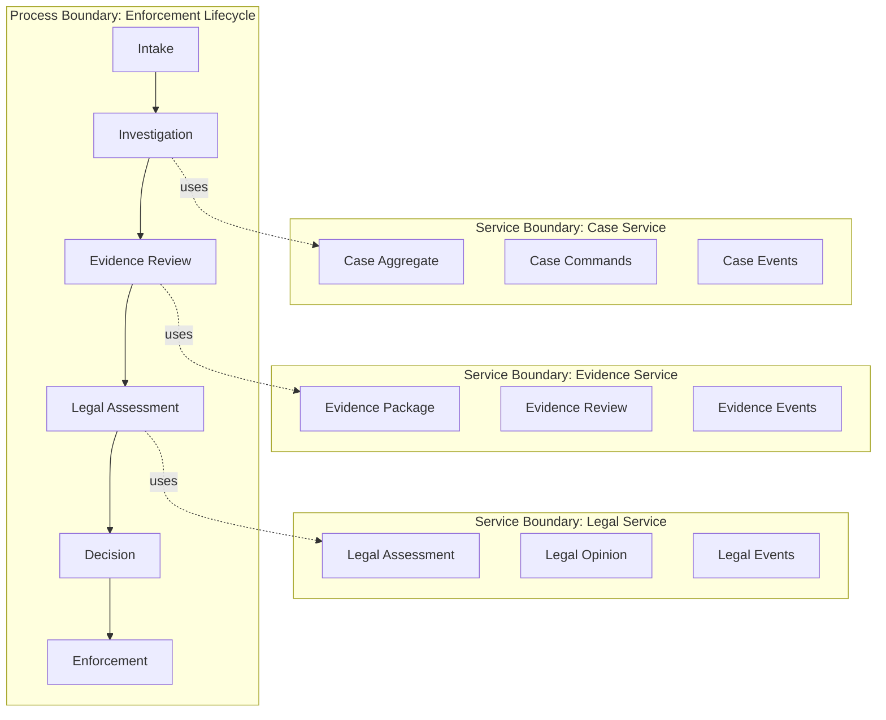

Process boundary boleh melintasi service. Yang berbahaya adalah ketika process boundary **disembunyikan** di chain REST call, scheduler acak, listener event tersebar, dan status string yang tidak punya state machine.

---

## 4. Local Transaction vs Business Transaction

Dalam microservices, local transaction masih valid. Yang hilang adalah kenyamanan membuat satu database transaction untuk seluruh proses.

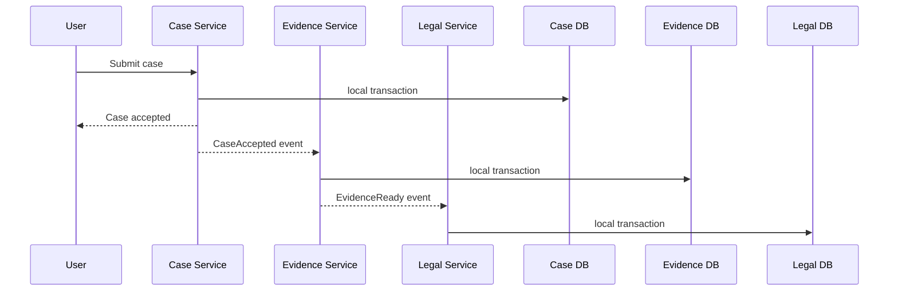

Database transaction biasanya pendek: milidetik sampai detik. Business transaction bisa berjalan menit, hari, bulan.

| Dimension | Database Transaction | Business Transaction / Workflow |
|---|---|---|
| Duration | pendek | panjang |
| Locking | database lock | business state / reservation / claim |
| Failure recovery | rollback | compensation / retry / manual recovery |
| Visibility | low-level | business-level |
| Owner | one service/database | process owner / orchestrator / workflow |
| Audit meaning | technical | business defensibility |

Top engineer tidak bertanya “bagaimana distributed transaction-nya?” sebagai default. Ia bertanya: **apa arti bisnis dari kegagalan step 4 setelah step 1–3 sudah commit?**

---

## 5. Kapan Workflow Dibutuhkan?

Tidak semua flow butuh workflow engine. Banyak proses cukup dengan command handler dan event. Gunakan decision model.

| Gejala | Cukup local service | Choreography | Process manager custom | Workflow engine |
|---|---:|---:|---:|---:|
| Durasi < 1 detik | ✅ | ⚠️ | ❌ | ❌ |
| Satu bounded context | ✅ | ❌ | ❌ | ❌ |
| Banyak service | ❌ | ✅ | ✅ | ✅ |
| Human task | ❌ | ⚠️ | ✅ | ✅ |
| Timer/SLA kompleks | ❌ | ⚠️ | ✅ | ✅ |
| Compensation kompleks | ❌ | ⚠️ | ✅ | ✅ |
| Butuh visual process audit | ❌ | ❌ | ⚠️ | ✅ |
| Perubahan flow sering | ⚠️ | ⚠️ | ✅ | ✅ |
| Branching/parallel gateway kompleks | ❌ | ⚠️ | ⚠️ | ✅ |
| Regulated process evidence | ⚠️ | ⚠️ | ✅ | ✅ |

Rule of thumb:

> Jika proses bisa dijelaskan sebagai satu use case pendek, jangan pakai workflow.  
> Jika proses punya state lintas waktu, actor, SLA, retry, compensation, dan audit, jadikan workflow sebagai konsep eksplisit.

---

## 6. Lima Bentuk Process Coordination

### 6.1 Direct orchestration inside application service

Cocok untuk proses pendek, synchronous, dan satu atau dua dependency.

```java
public final class SubmitCaseUseCase {
    private final CaseRepository cases;
    private final RiskScoringClient riskScoring;
    private final DomainEventPublisher events;

    public CaseId handle(SubmitCaseCommand command) {
        CaseRecord record = CaseRecord.open(command.subject(), command.summary());

        RiskScore score = riskScoring.score(command.subject(), command.summary());
        record.attachInitialRisk(score);

        cases.save(record);
        events.publish(new CaseSubmitted(record.id(), score.level()));

        return record.id();
    }
}
```

Bahaya: kalau dependency makin banyak, use case berubah menjadi mini-orchestrator yang sulit direcover.

Smell:

- ada 5+ remote call berurutan;
- partial failure tidak jelas;
- retry dilakukan manual tanpa policy;
- status proses tersebar di beberapa service;
- tidak bisa menjawab “step mana yang gagal?”.

---

### 6.2 Event choreography

Service publish event, service lain bereaksi.

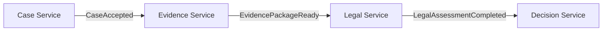

Kelebihan:

- loose coupling dari sisi producer;
- mudah menambah consumer;
- cocok untuk propagation fakta;
- tidak ada central coordinator.

Kekurangan:

- flow end-to-end tersembunyi;
- sulit menjawab “proses ini stuck di mana?”;
- compensation sering tersebar;
- versioning event dan semantic drift bisa menyulitkan;
- consumer coupling tetap ada meskipun producer tidak tahu.

Choreography cocok ketika:

- reaksi antar service relatif sederhana;
- order tidak terlalu ketat;
- tidak ada satu lifecycle yang harus dijelaskan secara formal;
- consumer boleh independen.

---

### 6.3 Process manager

Process manager adalah komponen yang menyimpan state koordinasi dan memberi command ke service lain.

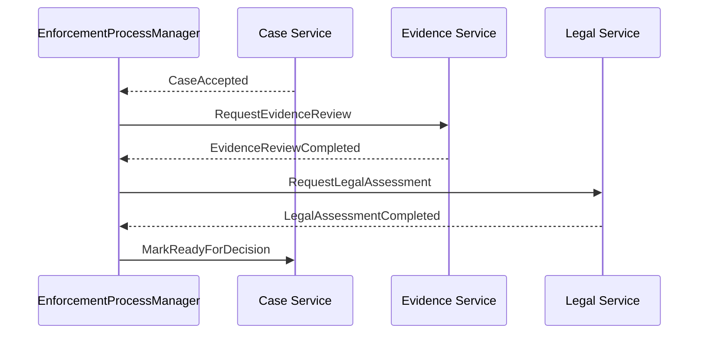

Process manager cocok ketika flow cukup penting untuk dijadikan eksplisit, tetapi belum perlu workflow engine penuh.

Contoh struktur Java:

```java
public final class EnforcementProcessManager {
    private final ProcessRepository processes;
    private final CommandBus commandBus;

    public void on(CaseAccepted event) {
        EnforcementProcess process = EnforcementProcess.start(event.caseId());
        process.requestEvidenceReview();

        processes.save(process);
        commandBus.send(new RequestEvidenceReview(event.caseId()));
    }

    public void on(EvidenceReviewCompleted event) {
        EnforcementProcess process = processes.getByCaseId(event.caseId());
        process.markEvidenceReviewed(event.reviewId());

        if (process.canRequestLegalAssessment()) {
            process.requestLegalAssessment();
            commandBus.send(new RequestLegalAssessment(event.caseId(), event.reviewId()));
        }

        processes.save(process);
    }
}
```

Kunci: process manager bukan tempat business rule semua domain. Ia hanya menyimpan **coordination state** dan transition rule lintas service. Invariant lokal tetap milik service masing-masing.

---

### 6.4 Workflow engine orchestration

Workflow engine menyimpan state proses, timer, retry, incident, dan visual model.

BPMN-style mental model:

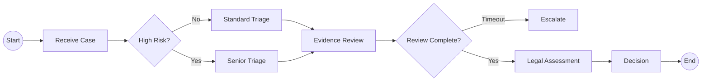

Workflow engine cocok ketika:

- proses long-running;
- ada human task;
- ada SLA dan timer;
- ada branching/parallelism;
- proses harus mudah divisualkan untuk business/ops;
- incident recovery harus operasional, bukan hanya log;
- audit dan traceability penting.

Namun workflow engine bukan silver bullet.

Bahaya:

- semua business logic dipindah ke BPMN/script;
- model proses menjadi god orchestrator;
- service berubah menjadi CRUD worker tanpa domain responsibility;
- workflow versioning diabaikan;
- proses visual terlihat bagus tetapi sulit dites.

Boundary yang sehat:

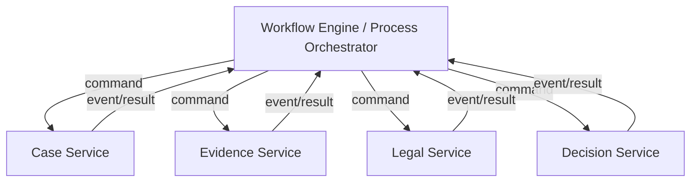

Workflow mengatur **sequence**. Service tetap memiliki **business authority**.

---

### 6.5 Durable execution / code-first workflow

Sebagian platform workflow memakai code-first model. Secara konsep, workflow function terlihat seperti program biasa, tetapi state, timer, retry, dan replay ditangani platform.

Pseudo Java-like example:

```java
public final class EnforcementWorkflow {
    public void run(CaseId caseId) {
        EvidenceReview review = activities.requestEvidenceReview(caseId);

        if (review.requiresLegalAssessment()) {
            LegalOpinion opinion = activities.requestLegalAssessment(caseId, review.id());
            activities.markReadyForDecision(caseId, opinion.id());
        } else {
            activities.markReadyForDecision(caseId, null);
        }
    }
}
```

Kelebihan:

- flow mudah dibaca developer;
- retry/timer/durable state tidak perlu dibangun manual;
- cocok untuk complex orchestration;
- lebih mudah testing dibanding event soup.

Kekurangan:

- determinism constraint;
- versioning workflow code harus hati-hati;
- coupling ke platform runtime;
- business stakeholder tidak selalu bisa membaca code workflow.

---

## 7. State Machine adalah Fondasi Workflow

Sebelum memilih tool, tulis state machine.

Contoh enforcement lifecycle:

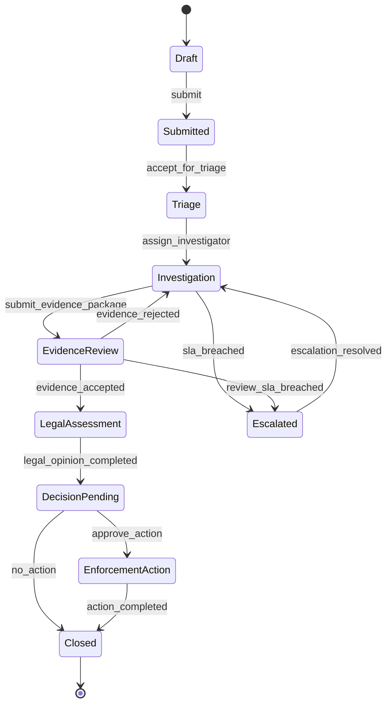

State machine memaksa pertanyaan penting:

- state apa saja yang valid;
- transition apa yang legal;
- actor apa yang boleh trigger transition;
- command apa yang menghasilkan transition;
- event apa yang harus dipublish;
- timer apa yang aktif pada state tertentu;
- compensation apa yang mungkin;
- apa terminal state;
- apa stuck state;
- apa manual override path.

Java representation:

```java
public enum EnforcementState {
    DRAFT,
    SUBMITTED,
    TRIAGE,
    INVESTIGATION,
    EVIDENCE_REVIEW,
    LEGAL_ASSESSMENT,
    DECISION_PENDING,
    ENFORCEMENT_ACTION,
    ESCALATED,
    CLOSED
}

public enum EnforcementTrigger {
    SUBMIT,
    ACCEPT_FOR_TRIAGE,
    ASSIGN_INVESTIGATOR,
    SUBMIT_EVIDENCE_PACKAGE,
    ACCEPT_EVIDENCE,
    REJECT_EVIDENCE,
    COMPLETE_LEGAL_OPINION,
    APPROVE_ACTION,
    DECIDE_NO_ACTION,
    COMPLETE_ACTION,
    BREACH_SLA,
    RESOLVE_ESCALATION
}
```

Transition table:

```java
public record TransitionRule(
        EnforcementState from,
        EnforcementTrigger trigger,
        EnforcementState to,
        Set<Role> allowedRoles
) {}

public final class EnforcementStateMachine {
    private final Map<StateTrigger, TransitionRule> rules;

    public EnforcementState transition(
            EnforcementState current,
            EnforcementTrigger trigger,
            Actor actor
    ) {
        TransitionRule rule = rules.get(new StateTrigger(current, trigger));

        if (rule == null) {
            throw new IllegalStateException(
                    "Illegal transition: " + current + " + " + trigger
            );
        }

        if (!rule.allowedRoles().contains(actor.role())) {
            throw new AccessDeniedException(
                    "Role " + actor.role() + " cannot trigger " + trigger
            );
        }

        return rule.to();
    }
}
```

Ingat: state machine bukan hanya coding pattern. Ia adalah kontrak bisnis.

---

## 8. Process State vs Entity State

Kesalahan umum adalah menyimpan seluruh workflow di `case_status`.

```sql
-- Smell
case_status = 'WAITING_FOR_LEGAL_AFTER_EVIDENCE_REVIEW_BUT_ESCALATED'
```

Status semacam itu mencampur banyak hal:

- status case;
- status evidence review;
- status legal assessment;
- status escalation;
- process position;
- SLA condition.

Lebih sehat:

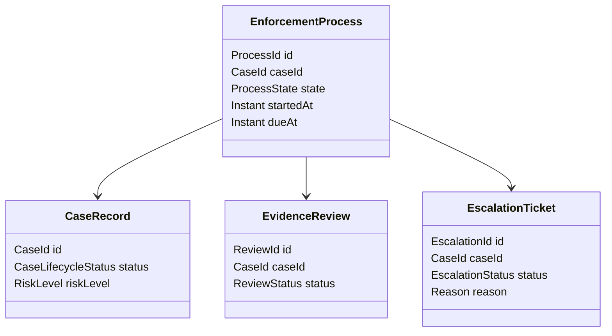

Guideline:

- entity state menjelaskan keadaan entity;
- process state menjelaskan posisi orchestration;
- SLA state menjelaskan waktu/obligation;
- audit event menjelaskan fakta historis;
- read model boleh menggabungkan semuanya untuk UI.

---

## 9. SLA, Timer, dan Escalation adalah First-Class Design

Long-running workflow hampir selalu punya waktu.

Jangan desain timer sebagai cron job acak yang mencari row “terlambat”. Itu bisa dipakai sebagai implementasi, tetapi secara desain timer harus eksplisit.

Contoh:

| State | Timer | On Timeout | Owner |
|---|---:|---|---|
| `TRIAGE` | 4 jam kerja | escalate to senior officer | Case Ops |
| `INVESTIGATION` | 10 hari kerja | require supervisor review | Investigation |
| `EVIDENCE_REVIEW` | 3 hari kerja | notify reviewer + escalate | Evidence Review |
| `LEGAL_ASSESSMENT` | 5 hari kerja | legal manager escalation | Legal |

Mermaid:

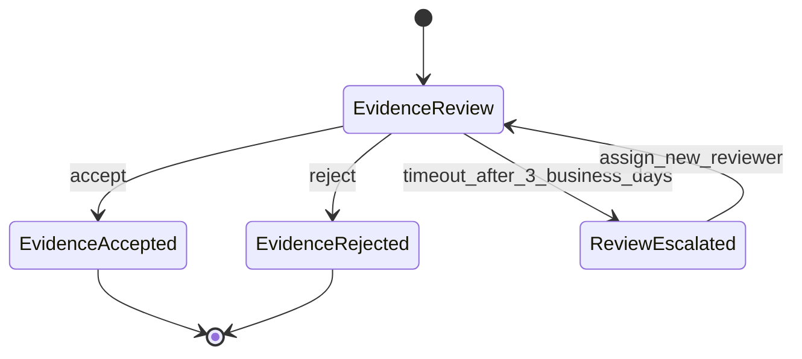

Java concept:

```java
public record ProcessTimer(
        ProcessId processId,
        String timerName,
        Instant dueAt,
        TimerAction action,
        boolean cancelled
) {}

public enum TimerAction {
    ESCALATE_EVIDENCE_REVIEW,
    NOTIFY_SUPERVISOR,
    AUTO_CLOSE_INACTIVE_DRAFT,
    REQUIRE_MANUAL_REVIEW
}
```

Timer design checklist:

- apakah timer kalender biasa atau business calendar;
- apakah pause saat menunggu external party;
- apakah due date berubah saat reassignment;
- apakah timeout idempotent;
- apakah timeout event audited;
- apakah timeout boleh otomatis mengambil keputusan;
- apakah ada manual override;
- apakah timer survive restart/deploy.

---

## 10. Compensation: Bukan Sekadar Rollback

Dalam workflow lintas service, rollback database jarang mungkin. Yang ada adalah **compensating action**.

Contoh sederhana:

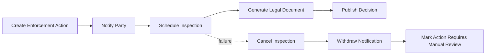

Compensation harus business-valid. Tidak semua aksi bisa dibalik.

| Action | Bisa dikompensasi? | Compensation | Catatan |
|---|---:|---|---|
| Reserve slot | ✅ | release slot | mudah |
| Send notification | ⚠️ | send correction notice | tidak menghapus fakta notifikasi |
| Publish legal decision | ⚠️ | issue amendment/withdrawal | perlu audit kuat |
| Delete evidence | ❌ | restore from retention if available | harus dicegah sejak awal |
| Charge payment | ⚠️ | refund | ada settlement delay |

Prinsip:

> Compensation bukan menghapus sejarah. Compensation adalah aksi bisnis baru yang memperbaiki konsekuensi dari aksi sebelumnya.

Jadi event audit tidak boleh dihapus:

```text
DecisionPublished
DecisionWithdrawn
CorrectionNoticeSent
```

Bukan:

```text
DecisionPublished removed from history
```

---

## 11. Orchestration vs Choreography: Pilih Berdasarkan Kebutuhan Visibility dan Control

Tidak ada jawaban absolut. Gunakan decision axis.

| Axis | Lebih cocok choreography | Lebih cocok orchestration |
|---|---|---|
| Control flow | sederhana, emergent | eksplisit, kompleks |
| Debugging | cukup lihat event log | butuh process instance view |
| Business visibility | rendah-sedang | tinggi |
| Compliance | rendah-sedang | tinggi |
| Human task | jarang | sering |
| SLA/timer | sederhana | kompleks |
| Coupling | producer loose, consumer reactive | orchestrator tahu participants |
| Change impact | event contract stable | flow versioning managed |
| Failure recovery | local handlers | central incident/retry model |

Choreography smell:

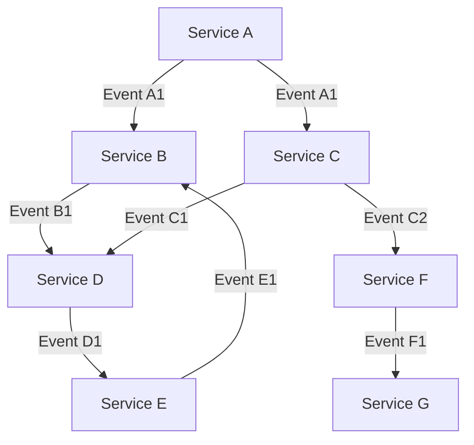

Jika engineer baru harus membaca 12 listener untuk memahami satu business process, itu bukan loose coupling yang sehat. Itu control flow yang tersebar.

Orchestration smell:

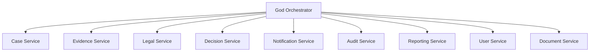

Jika orchestrator tahu terlalu banyak detail internal dan semua service hanya CRUD worker, orchestrator berubah menjadi monolith baru.

Target sehat:

- orchestrator tahu urutan business milestone;
- service tahu rule internalnya sendiri;
- event/result cukup kaya untuk keputusan proses;
- compensation punya semantic owner;
- process state observable.

---

## 12. Process Boundary Design Procedure

Gunakan langkah berikut saat mendesain long-running workflow.

### Step 1 — Tuliskan business outcome

Buruk:

> “Kita butuh workflow untuk Case Service.”

Baik:

> “Kita butuh lifecycle yang memastikan setiap high-risk case menjalani triage, investigation, evidence review, legal assessment, decision, dan enforcement action dengan SLA dan audit trail.”

### Step 2 — Daftar milestones, bukan screen

| Milestone | Business meaning | Terminal? |
|---|---|---:|
| Case Submitted | case masuk sistem | no |
| Triage Completed | risk/path ditentukan | no |
| Evidence Package Accepted | evidence cukup untuk legal | no |
| Legal Opinion Completed | legal risk dinilai | no |
| Decision Published | outcome formal dibuat | yes/no |
| Enforcement Action Completed | action selesai | yes |

### Step 3 — Identifikasi actor

| Step | Actor | Human/System | Authority |
|---|---|---|---|
| Submit case | Officer/Public API | both | Case Intake |
| Complete triage | Triage officer | human | Triage Unit |
| Submit evidence | Investigator | human | Investigation Unit |
| Accept evidence | Evidence reviewer | human | Evidence Review Unit |
| Complete legal opinion | Legal officer | human | Legal Unit |
| Publish decision | Decision authority | human/system-assisted | Decision Board |

### Step 4 — Identifikasi service participants

| Participant | Responsibility | Owns state? |
|---|---|---:|
| Case Service | case lifecycle and case identity | ✅ |
| Evidence Service | evidence package/review | ✅ |
| Legal Service | legal assessment/opinion | ✅ |
| Decision Service | decision record and publication | ✅ |
| Notification Service | outbound notification | ✅, for notification delivery |
| Workflow/Process Service | coordination state | ✅, for process only |

### Step 5 — Tuliskan state machine

Jangan langsung coding. State machine dulu.

### Step 6 — Tentukan command/event contract

| From | To | Command | Result/Event |
|---|---|---|---|
| Process | Evidence | `RequestEvidenceReview` | `EvidenceReviewRequested` |
| Evidence | Process | - | `EvidenceReviewCompleted` |
| Process | Legal | `RequestLegalAssessment` | `LegalAssessmentRequested` |
| Legal | Process | - | `LegalAssessmentCompleted` |
| Process | Decision | `RequestDecisionDraft` | `DecisionDraftRequested` |
| Decision | Process | - | `DecisionPublished` |

### Step 7 — Tentukan timeout dan compensation

| Step | Timeout | Compensation / Recovery |
|---|---:|---|
| Evidence review | 3 business days | escalate reviewer |
| Legal assessment | 5 business days | notify legal manager |
| Decision publication | 2 business days | manual decision board review |
| Notification delivery | 24 hours | retry + fallback channel |

### Step 8 — Tentukan observability

Minimal:

- `process_instance_id`;
- `case_id`;
- `current_state`;
- `current_owner`;
- `started_at`;
- `due_at`;
- `last_transition_at`;
- `blocked_reason`;
- `correlation_id`;
- `causation_id`.

---

## 13. Process Instance Data Model

Contoh relational model sederhana:

```sql
create table enforcement_process_instance (
    process_id uuid primary key,
    case_id uuid not null,
    process_type text not null,
    process_version int not null,
    state text not null,
    started_at timestamptz not null,
    updated_at timestamptz not null,
    due_at timestamptz,
    current_owner text,
    blocked_reason text,
    correlation_id uuid not null
);

create table enforcement_process_transition (
    transition_id uuid primary key,
    process_id uuid not null references enforcement_process_instance(process_id),
    from_state text,
    to_state text not null,
    trigger text not null,
    actor_id text,
    occurred_at timestamptz not null,
    causation_id uuid,
    reason text
);

create table enforcement_process_timer (
    timer_id uuid primary key,
    process_id uuid not null references enforcement_process_instance(process_id),
    timer_name text not null,
    due_at timestamptz not null,
    status text not null,
    fired_at timestamptz
);
```

Kalau memakai workflow engine, tabel internal bisa ditangani engine. Tetapi domain tetap perlu menentukan semantic fields untuk reporting dan audit.

---

## 14. Idempotency dalam Workflow

Workflow hampir pasti akan menerima duplicate event, retry command, dan timeout race.

Contoh race:

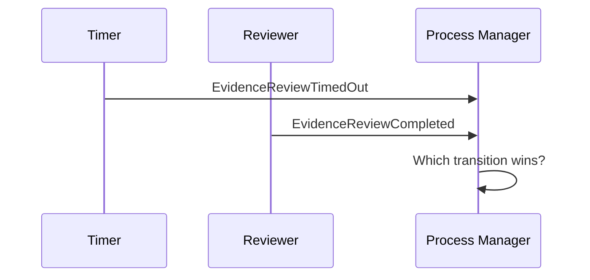

Desain harus eksplisit:

- jika completion datang sebelum timeout commit, completion menang;
- jika timeout sudah escalate, completion mungkin masih diterima tetapi escalation harus resolved;
- jika step terminal, late event tidak boleh mengubah state sembarangan;
- semua handler harus idempotent.

Java example:

```java
public void on(EvidenceReviewCompleted event) {
    EnforcementProcess process = repository.getByCaseId(event.caseId());

    if (process.hasProcessed(event.eventId())) {
        return;
    }

    if (process.state() == ProcessState.EVIDENCE_REVIEW) {
        process.markEvidenceReviewed(event.reviewId(), event.eventId());
        commandBus.send(new RequestLegalAssessment(event.caseId(), event.reviewId()));
    } else if (process.state() == ProcessState.EVIDENCE_REVIEW_ESCALATED) {
        process.resolveEscalationByLateCompletion(event.reviewId(), event.eventId());
        commandBus.send(new RequestLegalAssessment(event.caseId(), event.reviewId()));
    } else {
        process.recordIgnoredLateEvent(event.eventId(), event.type(), process.state());
    }

    repository.save(process);
}
```

Late event bukan selalu error. Dalam distributed system, late event adalah kondisi normal yang harus diberi semantic treatment.

---

## 15. Human Task dalam Microservices

Human task bukan sekadar row di tabel `tasks`.

Human task punya:

- assignee;
- candidate group;
- claim/release;
- due date;
- delegation;
- escalation;
- form data;
- decision reason;
- evidence attachments;
- audit trail;
- authorization;
- concurrency conflict;
- completion event.

Model:

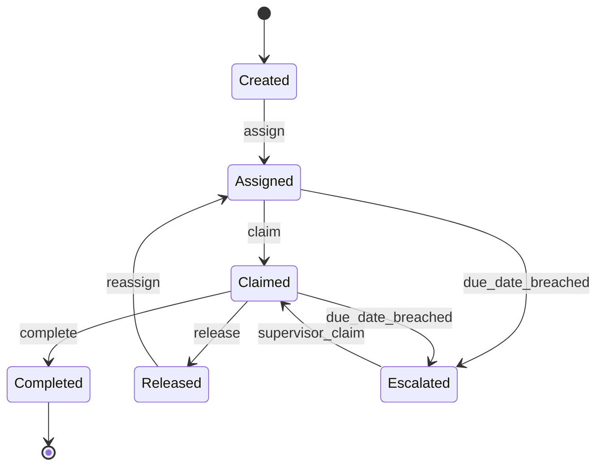

Task completion harus menghasilkan event bermakna:

```java
public record EvidenceReviewCompleted(
        UUID eventId,
        CaseId caseId,
        ReviewId reviewId,
        ReviewerId reviewerId,
        ReviewOutcome outcome,
        String rationale,
        Instant completedAt
) {}
```

Jangan hanya publish:

```json
{ "taskId": "123", "status": "DONE" }
```

Itu tidak membawa business meaning.

---

## 16. Workflow Versioning

Long-running workflow bisa berjalan ketika definisi proses berubah.

Contoh:

- Version 1: Triage → Investigation → Decision
- Version 2: Triage → Investigation → Evidence Review → Decision
- Version 3: High-risk branch wajib Legal Assessment

Pertanyaan:

- instance lama mengikuti flow lama atau dimigrasikan?
- apakah migration legal/compliant?
- bagaimana audit menjelaskan perubahan path?
- apakah UI bisa menampilkan proses version berbeda?
- apakah event lama masih dipahami?

Design guideline:

```text
Process definition version is part of the process instance identity.
```

Contoh:

```java
public record ProcessDefinitionRef(
        String processType,
        int version
) {}

public record ProcessInstance(
        ProcessId id,
        ProcessDefinitionRef definition,
        CaseId caseId,
        ProcessState state
) {}
```

Jangan deploy perubahan workflow dengan asumsi semua instance aktif otomatis aman.

---

## 17. Jangan Campur Orchestration Logic dengan Domain Invariant

Misalnya Evidence Service punya rule:

> Evidence package tidak boleh accepted jika mandatory document belum lengkap.

Rule itu harus tetap di Evidence Service.

Workflow boleh berkata:

> Setelah evidence accepted, lanjut legal assessment.

Workflow tidak boleh mengimplementasikan detail:

> Mandatory document X, Y, Z harus ada dan checksum valid.

Diagram boundary:

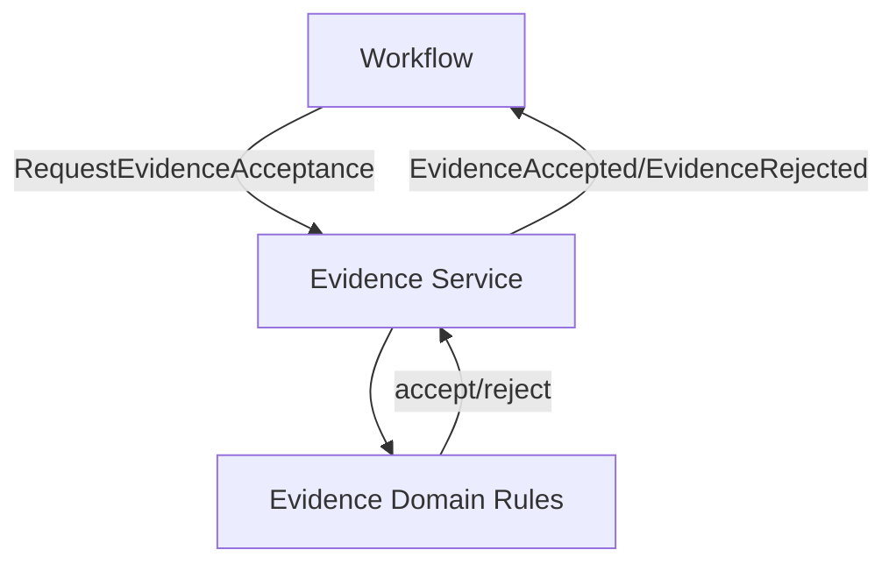

Kalau workflow tahu terlalu banyak invariant lokal, service kehilangan authority. Kalau service tahu terlalu banyak urutan proses global, service menjadi process monolith. Pisahkan.

---

## 18. Process Observability

Untuk long-running workflow, log request-response tidak cukup.

Kita butuh process observability:

| Signal | Question answered |
|---|---|
| process state | proses ini sekarang di mana? |
| transition history | bagaimana sampai ke sini? |
| active timers | apa yang akan terjadi jika tidak ada aksi? |
| current assignee | siapa yang pegang pekerjaan? |
| blocked reason | kenapa stuck? |
| failed activity | remote step mana gagal? |
| retry count | apakah dependency sedang bermasalah? |
| compensation status | apakah recovery sudah selesai? |
| SLA status | apakah breached/at risk? |

Log format example:

```json
{
  "event_type": "process.transitioned",
  "process_id": "6f6e6c5b-5c94-4f4c-a853-8dc9d1e3a571",
  "process_type": "enforcement_lifecycle",
  "process_version": 3,
  "case_id": "CASE-2026-000912",
  "from_state": "EVIDENCE_REVIEW",
  "to_state": "LEGAL_ASSESSMENT",
  "trigger": "EVIDENCE_ACCEPTED",
  "actor_id": "reviewer-91",
  "correlation_id": "b4cc1d2a-3438-4a6a-9e8e-6a7d7a05a315",
  "occurred_at": "2026-07-05T10:15:30Z"
}
```

Metric examples:

- `workflow_instances_active{process_type,state}`
- `workflow_transition_duration_seconds{process_type,from_state,to_state}`
- `workflow_sla_breaches_total{process_type,state}`
- `workflow_activity_failures_total{activity,dependency}`
- `workflow_compensations_total{process_type,reason}`
- `workflow_stuck_instances{process_type,state}`

---

## 19. Failure Modes yang Harus Didesain

| Failure mode | Example | Design response |
|---|---|---|
| command sent, response lost | service completed but orchestrator times out | idempotency + query/reconcile |
| event duplicated | same event delivered twice | inbox/deduplication |
| event late | completion after timeout | explicit late-event policy |
| dependency down | Legal Service unavailable | retry with backoff + incident state |
| human task abandoned | reviewer on leave | reassignment/escalation |
| process definition changed | active instance on old version | versioned process instance |
| compensation failed | refund service down | compensation retry + manual queue |
| poison message | event cannot be processed | DLQ + operational recovery |
| stuck state | no timer/owner | stuck detector |
| split brain ownership | two orchestrators act on same process | optimistic lock / single writer |

Optimistic locking example:

```java
public void save(ProcessInstance process, long expectedVersion) {
    int updated = jdbc.update("""
        update process_instance
        set state = ?, version = version + 1, updated_at = now()
        where process_id = ? and version = ?
        """,
        process.state().name(),
        process.id().value(),
        expectedVersion
    );

    if (updated != 1) {
        throw new ConcurrentProcessModificationException(process.id());
    }
}
```

---

## 20. Regulatory Lens: Defensible Workflow

Untuk regulated systems, workflow bukan hanya execution. Workflow adalah evidence.

Sebuah enforcement decision harus bisa dijawab:

- siapa melakukan tindakan;
- berdasarkan data apa;
- pada waktu apa;
- rule/policy versi berapa;
- apakah SLA dipenuhi;
- apakah ada escalation;
- apakah ada override;
- siapa menyetujui override;
- apa alasan keputusan;
- bagaimana affected party diberi notifikasi;
- apakah compensation/amendment terjadi.

Karena itu, workflow harus mencatat **decision rationale**, bukan hanya status.

```java
public record DecisionRationale(
        String summary,
        List<EvidenceRef> evidenceRefs,
        PolicyVersion policyVersion,
        List<String> appliedRules,
        Optional<String> overrideReason
) {}
```

Audit event:

```java
public record EnforcementDecisionApproved(
        UUID eventId,
        CaseId caseId,
        DecisionId decisionId,
        OfficerId approvedBy,
        DecisionRationale rationale,
        Instant approvedAt
) {}
```

---

## 21. Implementation Option: Custom Process Manager

Minimal package structure:

```text
com.acme.enforcement.process
  ├── application
  │   ├── EnforcementProcessEventHandler.java
  │   ├── EnforcementProcessCommandHandler.java
  │   └── ProcessTimerHandler.java
  ├── domain
  │   ├── EnforcementProcess.java
  │   ├── EnforcementProcessState.java
  │   ├── ProcessTransition.java
  │   └── ProcessTimer.java
  ├── infrastructure
  │   ├── JdbcProcessRepository.java
  │   ├── KafkaProcessEventConsumer.java
  │   ├── HttpCaseServiceClient.java
  │   └── SchedulerAdapter.java
  └── api
      └── ProcessQueryResource.java
```

Domain object:

```java
public final class EnforcementProcess {
    private final ProcessId id;
    private final CaseId caseId;
    private ProcessState state;
    private final Set<UUID> processedEvents = new HashSet<>();
    private final List<ProcessTransition> transitions = new ArrayList<>();

    public void evidenceAccepted(UUID eventId, ReviewId reviewId, Instant occurredAt) {
        ignoreDuplicate(eventId);
        requireState(ProcessState.EVIDENCE_REVIEW, ProcessState.EVIDENCE_REVIEW_ESCALATED);

        ProcessState previous = state;
        this.state = ProcessState.LEGAL_ASSESSMENT;
        this.processedEvents.add(eventId);
        this.transitions.add(ProcessTransition.of(previous, state, "EVIDENCE_ACCEPTED", occurredAt));
    }

    private void requireState(ProcessState... allowed) {
        if (!Set.of(allowed).contains(state)) {
            throw new IllegalStateException("Process " + id + " is in " + state);
        }
    }

    private void ignoreDuplicate(UUID eventId) {
        if (processedEvents.contains(eventId)) {
            throw new DuplicateProcessEventException(eventId);
        }
    }
}
```

In real implementation, duplicate handling may return silently instead of throwing depending on handler style.

---

## 22. Implementation Option: Workflow Engine Boundary

Kalau memakai workflow engine, treat engine sebagai process runtime, bukan domain brain.

Service task contract:

```java
public interface EvidenceReviewActivities {
    EvidenceReviewResult requestEvidenceReview(CaseId caseId);
}

public interface LegalAssessmentActivities {
    LegalAssessmentResult requestLegalAssessment(CaseId caseId, ReviewId reviewId);
}

public interface DecisionActivities {
    DecisionResult requestDecision(CaseId caseId, LegalOpinionId opinionId);
}
```

Workflow activities should call service APIs through stable contracts. Activity result should be business meaningful.

Bad activity result:

```java
public record ActivityResult(boolean success) {}
```

Better:

```java
public sealed interface EvidenceReviewResult {
    record Accepted(ReviewId reviewId, ReviewerId reviewerId, Instant acceptedAt)
            implements EvidenceReviewResult {}

    record Rejected(ReviewId reviewId, String reason, Instant rejectedAt)
            implements EvidenceReviewResult {}

    record RequiresManualEscalation(ReviewId reviewId, String reason)
            implements EvidenceReviewResult {}
}
```

---

## 23. Design Smells

### Smell 1 — Status-driven architecture

Everything is `status` field. No transition rule. No history. No owner.

Fix: define state machine and transition events.

### Smell 2 — Hidden workflow in REST chain

Controller calls Service A → B → C → D. Any failure leaves unknown state.

Fix: shorten synchronous transaction or introduce process manager/workflow.

### Smell 3 — Event soup

Many consumers react to events, but no one owns lifecycle.

Fix: create process map and decide whether choreography is still appropriate.

### Smell 4 — Workflow owns all rules

BPMN/code workflow validates domain invariants that belong in services.

Fix: service owns invariant; workflow owns sequencing.

### Smell 5 — No timeout semantics

Cron finds stale rows and changes status without audited business event.

Fix: model timers as part of process definition.

### Smell 6 — Compensation as delete/update

System “undoes” by deleting records.

Fix: compensation is a new auditable business action.

### Smell 7 — No process version

Deployed flow changes active instances unpredictably.

Fix: version process definitions and migration rules.

---

## 24. Architecture Review Questions

Use these questions during design review:

1. What is the business outcome of this process?
2. What are the valid states and terminal states?
3. Which service owns each state-bearing entity?
4. Which component owns process state?
5. Is the process synchronous, asynchronous, or mixed?
6. What happens if step N succeeds but step N+1 fails?
7. What commands are idempotent?
8. What events can arrive late?
9. Which timers exist and who owns them?
10. What is the manual recovery path?
11. What is the compensation path?
12. How is process version tracked?
13. How does operations see stuck processes?
14. How does audit reconstruct decision history?
15. What data is needed in the read model for user visibility?

---

## 25. Practical Exercise

Take this process:

> A high-risk enforcement case must be triaged, assigned to an investigator, reviewed for evidence completeness, sent to legal assessment, approved by a decision board, then published to the affected party. Evidence review has a 3-business-day SLA. Legal assessment has a 5-business-day SLA. If either breaches SLA, supervisor escalation is required. If decision publication fails after approval, the case must enter manual recovery.

Produce:

1. state machine;
2. service participant table;
3. command/event table;
4. timer table;
5. compensation table;
6. process observability metrics;
7. decision whether to use choreography, custom process manager, or workflow engine.

Expected reasoning:

- this is long-running;
- has human tasks;
- has SLA;
- has regulated decision;
- has compensation/manual recovery;
- should not be implemented as hidden REST call chain;
- likely deserves explicit workflow/process manager.

---

## 26. Key Takeaways

- Service boundary and process boundary are different concepts.
- Long-running workflow needs explicit state, timer, actor, event, and recovery model.
- Choreography gives loose producer coupling but can hide lifecycle.
- Orchestration gives visibility/control but can become god service.
- Workflow engine is useful when human task, SLA, branching, recovery, and audit become central.
- Saga is about distributed consistency; workflow is about durable business lifecycle.
- Compensation is a new business action, not deletion of history.
- State machine is the smallest serious design artifact for workflow.
- In regulated domains, workflow is evidence.

---

## References

- Camunda 8 Docs — Processes and microservice orchestration: https://docs.camunda.io/docs/components/concepts/processes/
- Camunda 8 Guide — Orchestrate microservices: https://docs.camunda.io/docs/8.7/guides/orchestrate-microservices/
- Temporal Docs — Workflow Execution and durable execution model: https://docs.temporal.io/workflow-execution
- Microsoft Azure Architecture Center — Saga pattern: https://learn.microsoft.com/en-us/azure/architecture/patterns/saga
- Martin Fowler — Domain Event: https://martinfowler.com/eaaDev/DomainEvent.html
- Martin Fowler — Event Collaboration: https://martinfowler.com/eaaDev/EventCollaboration.html
