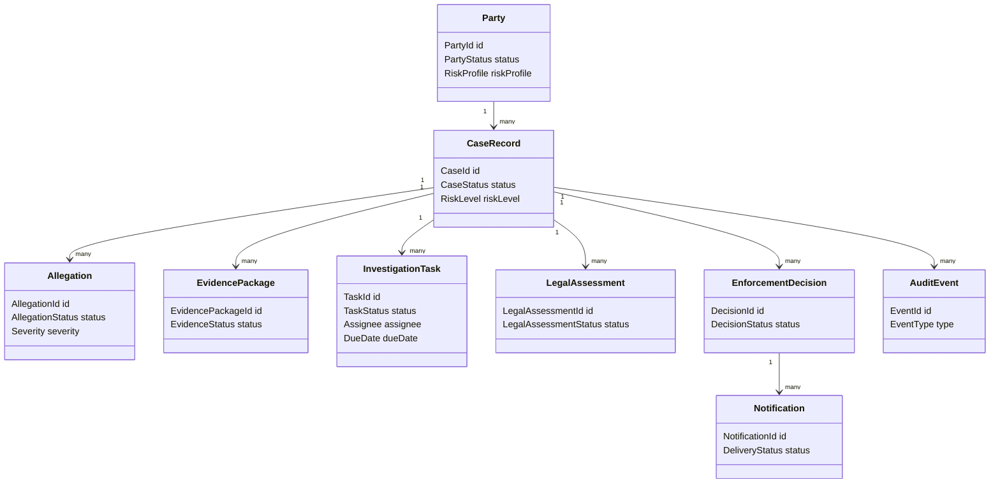
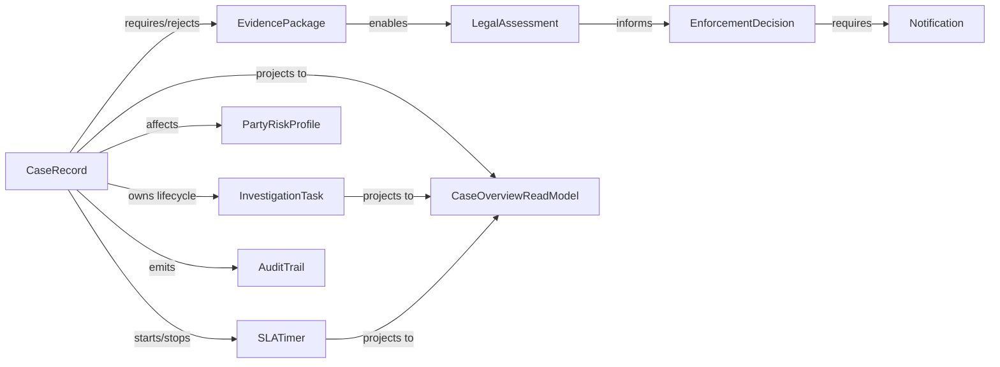
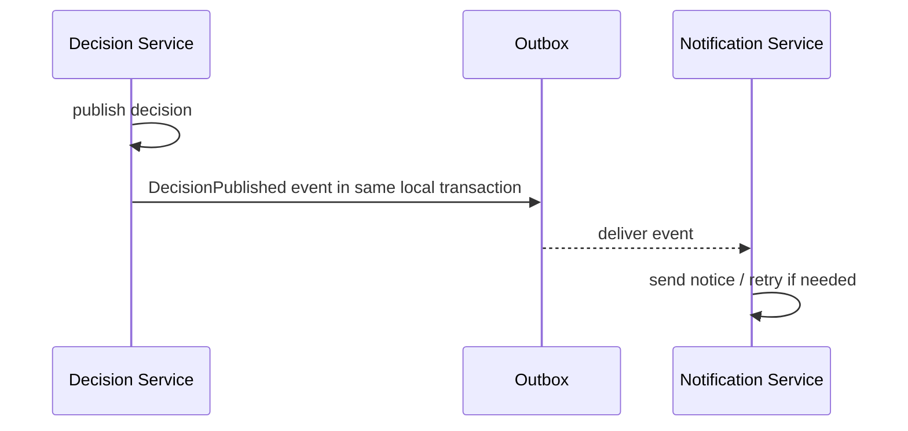
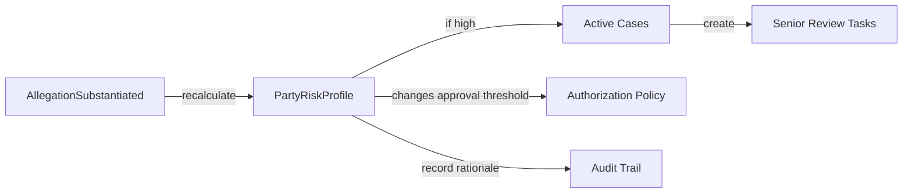
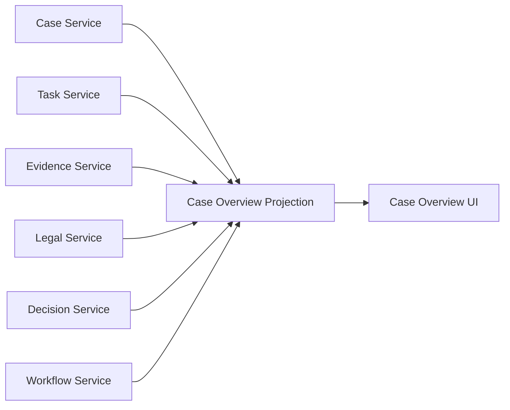
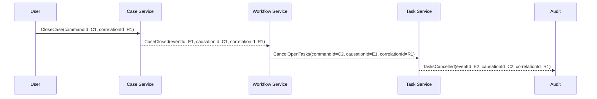
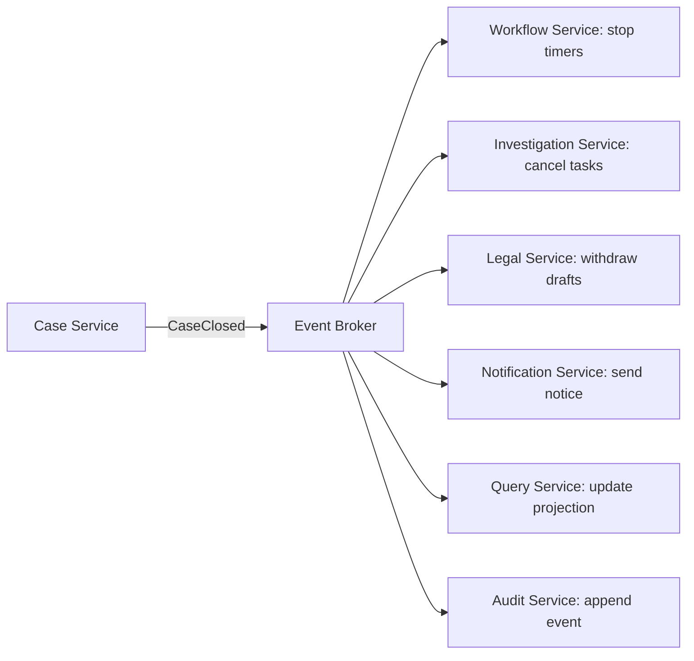

# Part 012 — Cross-Entity Impact Analysis

> Banyak bug enterprise bukan karena satu entity salah.  
> Banyak bug enterprise muncul karena perubahan pada satu entity punya dampak diam-diam ke entity lain, service lain, SLA lain, policy lain, read model lain, dan audit trail lain.

Dalam sistem microservices, cross-entity impact sering menjadi sumber defect paling mahal:

- case ditutup, tetapi active investigation task masih terbuka;
- party dinyatakan high-risk, tetapi monitoring obligation tidak dibuat;
- evidence ditolak, tetapi legal assessment masih lanjut;
- permit dicabut, tetapi notification dan public register tidak sinkron;
- escalation terjadi, tetapi SLA reporting tidak berubah;
- decision diperbaiki, tetapi audit narrative tidak bisa merekonstruksi alasan perubahan.

Masalahnya bukan “kurang event”. Masalahnya adalah **impact tidak dimodelkan**.

Part ini membahas cara menganalisis dan mendesain dampak lintas entity secara eksplisit menggunakan graph, matrix, invariant, policy propagation, dan event design.

---

## 1. Core Thesis

Cross-entity impact analysis menjawab:

> “Jika entity X berubah, entity/domain/service/read model/policy apa yang harus ikut diperiksa, diberi tahu, diubah, dibekukan, dihitung ulang, atau diaudit?”

Ini berbeda dari dependency analysis biasa.

Dependency analysis teknis bertanya:

- class mana memanggil class mana;
- service mana memanggil endpoint mana;
- topic mana dikonsumsi service mana.

Impact analysis domain bertanya:

- perubahan status ini mengubah obligation siapa;
- invariant apa yang terdampak;
- decision apa yang harus direview;
- task apa yang harus dibuka/ditutup;
- SLA mana yang mulai/berhenti;
- notification apa yang legally required;
- audit event apa yang wajib muncul;
- read model apa yang stale;
- user journey apa yang berubah.

Architecture-level impact analysis menggabungkan keduanya.

---

## 2. Running Example: Enforcement Case Management

Kita gunakan domain regulatory enforcement.

Core entities:



Sepertinya sederhana. Tetapi perubahan satu status bisa punya impact luas.

Contoh command:

```text
CloseCase(caseId, reason = NO_BREACH_FOUND)
```

Dampaknya mungkin:

- `CaseRecord.status` menjadi `CLOSED`;
- open investigation task harus ditutup atau dibatalkan;
- pending evidence review harus diberi status no-longer-required;
- legal assessment draft harus withdrawn;
- party risk profile mungkin diturunkan;
- notification ke affected party harus dikirim;
- dashboard active case count harus turun;
- SLA timer harus dihentikan;
- audit event harus mencatat reason;
- reporting projection harus diperbarui.

Jika ini hanya ditulis sebagai `case.status = CLOSED`, arsitektur akan bocor.

---

## 3. Impact Graph

Representasikan domain sebagai graph:

- node = entity, process, policy, service, read model, actor, obligation;
- edge = relationship atau impact;
- edge punya type, direction, strength, timing, dan owner.



Graph ini bukan dekorasi. Ia membantu menjawab:

- apa blast radius perubahan;
- mana synchronous invariant;
- mana asynchronous projection;
- mana policy-triggered obligation;
- mana perlu compensation;
- mana hanya read model update.

---

## 4. Jenis Impact

Tidak semua impact sama. Klasifikasi penting karena menentukan implementasi.

| Impact type | Meaning | Example | Usual mechanism |
|---|---|---|---|
| State impact | status entity lain berubah | close case cancels tasks | command/event |
| Invariant impact | rule harus tetap benar | decision cannot publish if legal assessment missing | synchronous check / domain rule |
| Policy impact | obligation muncul karena policy | high-risk case requires senior review | policy evaluation |
| SLA impact | timer start/stop/change | evidence review starts 3-day SLA | workflow/timer |
| Authorization impact | who may act changes | escalated case only supervisor can approve | policy/authz service |
| Notification impact | party/regulator/user must be informed | decision published notification | event-driven notification |
| Audit impact | historical evidence required | override reason must be logged | audit event |
| Reporting impact | read model/analytics changes | active case count decreases | projection/event |
| Operational impact | ownership/support changes | escalated process moves queue | task/workflow |
| Risk impact | risk score/profile changes | repeated allegations increase risk | risk service/event |

Top-level rule:

> Do not treat all impacts as “call another service”. Some are invariants, some are obligations, some are projections, some are audit facts, some are operational work.

---

## 5. Impact Strength: Strong vs Weak Impact

Impact strength tells us whether action must happen in the same consistency boundary.

### Strong impact

A strong impact must be enforced before the command is considered successful.

Example:

> A decision cannot be published if the case has no completed legal assessment.

This is an invariant.

```java
public void publishDecision(CaseSnapshot caseSnapshot, LegalAssessmentSnapshot legal) {
    if (!caseSnapshot.isReadyForDecision()) {
        throw new BusinessRuleViolation("Case is not ready for decision");
    }

    if (!legal.isCompleted()) {
        throw new BusinessRuleViolation("Legal assessment is required before publication");
    }

    this.status = DecisionStatus.PUBLISHED;
}
```

### Weak impact

A weak impact may happen asynchronously after the main state change.

Example:

> After decision publication, notification should be sent.

Publication may commit first, then notification is retried until delivered.



Design mistake: making weak impact synchronous and blocking critical path unnecessarily.

Opposite mistake: making strong invariant asynchronous, causing invalid business states.

---

## 6. Impact Timing

Impact can happen at different moments.

| Timing | Meaning | Example |
|---|---|---|
| Pre-condition | must be true before command | case must be open before add evidence |
| During transaction | changed atomically in same service | case status + audit row |
| Immediately after commit | event generated from outbox | `CaseClosed` published |
| Eventually | projection/notification catches up | dashboard updated |
| On timer | impact triggered by elapsed time | SLA breach creates escalation |
| On reconciliation | periodic correction | repair missed projection |
| On manual review | human confirms impact | legal withdrawal approval |

Timing should be part of design. “Eventually consistent” is incomplete. Eventually **when**, with what user-visible semantics, and what recovery path?

---

## 7. Impact Ownership

Every impact needs an owner.

Bad design:

```text
When case closes, the system should update related stuff.
```

Better:

| Impact | Owner | Mechanism | SLA |
|---|---|---|---:|
| Cancel open investigation tasks | Investigation Service | consumes `CaseClosed` | 5 min |
| Withdraw legal draft | Legal Service | consumes `CaseClosed` | 15 min |
| Stop case SLA timer | Workflow Service | local transition | immediate |
| Send closure notice | Notification Service | consumes `CaseClosed` | 24 hr |
| Update active cases read model | Query Service | projection | 1 min |
| Record closure audit | Case Service | local audit event | immediate |

If ownership is not explicit, incidents become “not my service”.

---

## 8. Command Impact Card

Before implementing any command with broad effect, create a Command Impact Card.

Example: `CloseCase`

```yaml
command: CloseCase
owner_service: case-service
business_meaning: Close an enforcement case because no further action is required.
primary_entity: CaseRecord
preconditions:
  - case must not already be closed
  - no decision requiring active enforcement may be pending
state_changes:
  - CaseRecord.status -> CLOSED
  - CaseRecord.closedAt -> now
  - CaseRecord.closureReason -> supplied reason
local_audit:
  - CaseClosed
published_events:
  - CaseClosed
strong_impacts:
  - reject if active enforcement decision exists
weak_impacts:
  - cancel investigation tasks
  - stop SLA timers
  - withdraw legal drafts
  - send party notification
  - update read models
late_event_policy:
  - ignore evidence submitted after closure unless reopen command exists
  - legal assessment completed after closure is recorded as late and withdrawn
compensation:
  - ReopenCase command, supervisor-only
observability:
  - metric case_closed_total{reason}
  - trace correlation with task cancellation and notification
```

This card prevents hidden assumptions.

---

## 9. Impact Matrix

For architecture review, create a matrix.

| Trigger / Entity | Case | Task | Evidence | Legal | Decision | Party Risk | SLA | Notification | Audit | Read Model |
|---|---|---|---|---|---|---|---|---|---|---|
| CaseSubmitted | create | create triage task | - | - | - | maybe score | start | optional | record | update |
| CaseClosed | close | cancel open | mark no longer required | withdraw draft | block new | maybe reduce | stop | send | record | update |
| EvidenceRejected | maybe back to investigation | create rework task | reject | block | block | no | restart | notify officer | record | update |
| LegalCompleted | ready for decision | - | - | complete | create draft | maybe update | stop legal SLA | notify board | record | update |
| DecisionPublished | mark decided | close tasks | freeze evidence | archive | publish | update risk | stop | send | record | update |
| SLABreached | escalate | assign supervisor | maybe lock review | maybe escalate legal | - | - | breach | notify owner | record | update |

This matrix should not become bureaucracy. It is valuable when command impact spans multiple domains.

---

## 10. Impact as Code: Small Graph Model

You can represent impact rules explicitly.

```java
public enum ImpactKind {
    STATE,
    INVARIANT,
    POLICY,
    SLA,
    AUTHORIZATION,
    NOTIFICATION,
    AUDIT,
    REPORTING,
    OPERATIONAL,
    RISK
}

public enum ConsistencyRequirement {
    SAME_TRANSACTION,
    BEFORE_COMMIT,
    AFTER_COMMIT_ASYNC,
    EVENTUAL,
    MANUAL_REVIEW
}

public record ImpactEdge(
        String source,
        String target,
        ImpactKind kind,
        ConsistencyRequirement consistency,
        String ownerService,
        String description
) {}
```

Example registry:

```java
public final class CaseImpactModel {
    public List<ImpactEdge> impactsOf(String trigger) {
        return switch (trigger) {
            case "CaseClosed" -> List.of(
                    new ImpactEdge(
                            "CaseRecord",
                            "InvestigationTask",
                            ImpactKind.STATE,
                            ConsistencyRequirement.AFTER_COMMIT_ASYNC,
                            "investigation-service",
                            "Cancel open investigation tasks"
                    ),
                    new ImpactEdge(
                            "CaseRecord",
                            "SLATimer",
                            ImpactKind.SLA,
                            ConsistencyRequirement.SAME_TRANSACTION,
                            "workflow-service",
                            "Stop active case timers"
                    ),
                    new ImpactEdge(
                            "CaseRecord",
                            "AuditTrail",
                            ImpactKind.AUDIT,
                            ConsistencyRequirement.SAME_TRANSACTION,
                            "case-service",
                            "Record closure reason"
                    ),
                    new ImpactEdge(
                            "CaseRecord",
                            "Notification",
                            ImpactKind.NOTIFICATION,
                            ConsistencyRequirement.EVENTUAL,
                            "notification-service",
                            "Notify affected party"
                    )
            );
            default -> List.of();
        };
    }
}
```

This does not replace design thinking. It makes design review and testing easier.

---

## 11. Impact Plan at Runtime

For complex commands, application service can generate an impact plan.

```java
public record ImpactAction(
        String actionType,
        String targetService,
        String targetEntity,
        ConsistencyRequirement consistency,
        Map<String, Object> payload
) {}

public record ImpactPlan(
        UUID planId,
        String commandName,
        String primaryEntity,
        List<ImpactAction> actions
) {}
```

Example:

```java
public final class CloseCaseImpactPlanner {
    public ImpactPlan plan(CaseRecord caseRecord, CloseCaseCommand command) {
        List<ImpactAction> actions = new ArrayList<>();

        actions.add(new ImpactAction(
                "STOP_SLA_TIMERS",
                "workflow-service",
                "SLATimer",
                ConsistencyRequirement.AFTER_COMMIT_ASYNC,
                Map.of("caseId", caseRecord.id().value())
        ));

        actions.add(new ImpactAction(
                "CANCEL_OPEN_TASKS",
                "investigation-service",
                "InvestigationTask",
                ConsistencyRequirement.AFTER_COMMIT_ASYNC,
                Map.of("caseId", caseRecord.id().value(), "reason", command.reason())
        ));

        actions.add(new ImpactAction(
                "SEND_CLOSURE_NOTICE",
                "notification-service",
                "Notification",
                ConsistencyRequirement.EVENTUAL,
                Map.of("caseId", caseRecord.id().value())
        ));

        return new ImpactPlan(UUID.randomUUID(), "CloseCase", "CaseRecord", actions);
    }
}
```

Whether you persist this plan depends on domain criticality. In regulated systems, persisting impact plan can help audit and recovery.

---

## 12. Event Design for Impact

Event should carry enough meaning for downstream impact without exposing internal model.

Bad event:

```json
{
  "type": "CaseUpdated",
  "caseId": "CASE-123",
  "status": "CLOSED"
}
```

Better:

```json
{
  "eventId": "9c2d6ee8-a79d-41e8-9e7f-d37f33f0ac4d",
  "eventType": "CaseClosed",
  "caseId": "CASE-123",
  "closureReason": "NO_BREACH_FOUND",
  "closedBy": "officer-42",
  "closedAt": "2026-07-05T09:30:00Z",
  "requiresPartyNotification": true,
  "correlationId": "0e0c7386-4959-4f53-aa9c-a18fd34d823a",
  "causationId": "2b85f471-cc12-42d2-a35a-dc2e56a31f4c",
  "policyVersion": "ENF-CLOSE-2026.2"
}
```

Event naming rule:

- event names should be past-tense facts;
- event names should express business meaning;
- avoid generic `Updated`, `Changed`, `Synced` for important transitions;
- include reason and policy context when required for downstream decisions;
- avoid dumping full internal aggregate unless event-carried state transfer is intentional.

---

## 13. Policy Propagation

Policy often creates hidden impact.

Example policy:

> If a party has two substantiated high-severity allegations within 12 months, risk profile must be escalated to high and all active cases require senior review.

Impact graph:



This is not just data update. It changes operational obligations and authorization.

Policy impact card:

```yaml
policy: EscalatePartyRiskOnRepeatedHighSeverityAllegations
policy_version: RISK-2026.4
trigger: AllegationSubstantiated
conditions:
  - severity == HIGH
  - substantiated_high_severity_count_last_12_months >= 2
decision:
  - PartyRiskProfile.level -> HIGH
impacts:
  - create senior review task for active cases
  - require supervisor approval for new enforcement decision
  - update party risk dashboard
  - emit PartyRiskEscalated
  - record policy version and calculation inputs
```

For regulated systems, always persist policy version used to make decision.

---

## 14. Cross-Entity Invariant

Some invariants involve multiple entities. Be careful: cross-service invariant is expensive.

Example:

> A case cannot be closed while an enforcement decision is pending publication.

If Case and Decision are in different services, how enforce?

Options:

### Option A — Synchronous check

Case Service calls Decision Service before close.

Pros:

- strong guarantee at command time.

Cons:

- availability coupling;
- latency;
- failure mode: cannot close if Decision Service down.

### Option B — Local replicated state

Case Service keeps a projection of decision status.

Pros:

- no synchronous dependency;
- faster command.

Cons:

- projection staleness;
- need staleness contract;
- risk of accepting command on stale state.

### Option C — Process owner decides

Workflow/process service owns close decision because it has process state.

Pros:

- lifecycle consistency;
- good for long-running process.

Cons:

- process owner becomes critical authority;
- must not duplicate domain rules incorrectly.

Decision matrix:

| Need | Option A | Option B | Option C |
|---|---:|---:|---:|
| Strong immediate correctness | ✅ | ⚠️ | ✅ |
| High availability | ⚠️ | ✅ | ⚠️ |
| Low latency | ⚠️ | ✅ | ⚠️ |
| Long-running lifecycle clarity | ⚠️ | ⚠️ | ✅ |
| Low operational complexity | ✅ | ⚠️ | ⚠️ |

There is no free option. The architect must choose the failure mode consciously.

---

## 15. Impact Analysis and Read Models

Read models are frequent victims of hidden impact.

Example Case Overview UI needs:



If `CaseClosed` occurs, read model needs to update:

- status badge;
- open task count;
- SLA badge;
- pending legal badge;
- available actions;
- timeline event;
- notification status.

Staleness contract:

```yaml
read_model: CaseOverview
max_staleness: 60 seconds
source_events:
  - CaseSubmitted
  - CaseClosed
  - InvestigationTaskCreated
  - InvestigationTaskCancelled
  - EvidenceReviewCompleted
  - LegalAssessmentCompleted
  - DecisionPublished
  - SLABreached
rebuild_strategy:
  - replay from event log
  - nightly reconciliation against source services
user_visible_semantics:
  - show "updating" marker if projection lag > 60 seconds
```

Do not promise real-time UI if architecture only guarantees eventual projection.

---

## 16. Late Events and Impact Suppression

Cross-entity systems must handle late events.

Scenario:

1. Case is closed.
2. Evidence reviewer completes review using stale screen.
3. `EvidenceReviewCompleted` arrives after `CaseClosed`.

Options:

| Policy | Behavior |
|---|---|
| reject | ignore event and mark review obsolete |
| record-only | record event but do not affect case |
| reopen candidate | create manual review for possible reopen |
| compensate | withdraw review and notify reviewer |

Java example:

```java
public void on(EvidenceReviewCompleted event) {
    CaseProcessSnapshot caseSnapshot = caseQuery.getSnapshot(event.caseId());

    if (caseSnapshot.isClosed()) {
        audit.record(new LateEvidenceReviewIgnored(
                event.caseId(),
                event.reviewId(),
                event.completedAt(),
                "CASE_ALREADY_CLOSED"
        ));
        return;
    }

    impactHandler.applyEvidenceReviewImpact(event);
}
```

Important: late event must not disappear silently. It is a valuable operational and audit signal.

---

## 17. Causation and Correlation

Impact analysis fails when events cannot be connected.

Every important command/event should carry:

- `eventId`;
- `commandId`;
- `correlationId`;
- `causationId`;
- `actorId`;
- `tenantId` if multi-tenant;
- `policyVersion` if policy decision;
- `occurredAt`;
- source service/version.

Example event chain:



Correlation explains the story. Causation explains the chain.

---

## 18. Architecture Pattern: Impact Handler

When impact is simple, event consumers are enough. When impact grows, introduce explicit impact handlers.

```text
CaseClosed event
  -> CaseClosureImpactHandler
      -> Cancel tasks
      -> Stop timers
      -> Withdraw legal draft
      -> Send notification
      -> Update read model
      -> Record audit
```

But be careful: an impact handler can become god orchestrator. Keep ownership clear.

Better model:



Each owner applies its own impact.

Use central impact handler only when:

- impact is a real process sequence;
- ordering matters;
- compensation matters;
- visibility matters;
- no single downstream owner can decide alone.

---

## 19. Testing Cross-Entity Impact

Unit test aggregate rules, but impact needs scenario tests.

Example scenario test description:

```gherkin
Scenario: Closing a case cancels active investigation tasks
  Given a case is under investigation
  And it has two active investigation tasks
  When the case is closed with reason NO_BREACH_FOUND
  Then a CaseClosed event is published
  And the investigation service cancels the two active tasks
  And the case overview read model shows zero active tasks
  And the audit trail contains the closure reason
```

Java-ish integration test skeleton:

```java
@Test
void closingCaseCancelsActiveInvestigationTasks() {
    CaseId caseId = fixtures.caseUnderInvestigation();
    fixtures.activeInvestigationTask(caseId);
    fixtures.activeInvestigationTask(caseId);

    caseApi.closeCase(caseId, new CloseCaseRequest("NO_BREACH_FOUND"));

    await().untilAsserted(() -> {
        assertThat(investigationApi.tasksFor(caseId))
                .allMatch(task -> task.status() == TaskStatus.CANCELLED);

        assertThat(caseOverviewApi.get(caseId).activeTaskCount()).isZero();

        assertThat(auditApi.eventsFor(caseId))
                .anyMatch(event -> event.type().equals("CaseClosed"));
    });
}
```

This is not the same as testing every internal class. It tests business impact.

---

## 20. Reconciliation as Safety Net

Event-driven impact can fail:

- consumer down;
- event skipped;
- poison message;
- projection bug;
- manual database repair;
- service restored from backup.

Critical impact should have reconciliation.

Example reconciliation rule:

```sql
-- Find closed cases with active investigation tasks
select c.case_id, t.task_id
from case_snapshot c
join investigation_task_snapshot t on t.case_id = c.case_id
where c.status = 'CLOSED'
  and t.status in ('OPEN', 'ASSIGNED', 'CLAIMED');
```

Reconciliation worker:

```java
public final class ClosedCaseTaskReconciler {
    public void reconcile() {
        List<Inconsistency> inconsistencies = query.findClosedCasesWithActiveTasks();

        for (Inconsistency item : inconsistencies) {
            commandBus.send(new CancelTaskBecauseCaseClosed(
                    item.taskId(),
                    item.caseId(),
                    "RECONCILIATION"
            ));
        }
    }
}
```

Reconciliation should emit audit/ops events. Silent repair hides systemic problems.

---

## 21. Impact Analysis for Architecture Change

Cross-entity impact is also useful when changing architecture.

Suppose you split `Case Service` into:

- `Case Intake Service`;
- `Investigation Service`;
- `Case Lifecycle Service`.

Impact questions:

1. Which commands currently update multiple entity groups?
2. Which tables are used to enforce cross-entity invariant?
3. Which UI screens depend on joined data?
4. Which events currently imply multiple meanings?
5. Which policies need data from both future services?
6. Which reports assume one database transaction?
7. Which audit trails assume one source system?
8. Which failure modes become possible after split?

Migration impact matrix:

| Current behavior | After split risk | Mitigation |
|---|---|---|
| case close cancels tasks in same DB | task cancellation eventually consistent | publish `CaseClosed`, add reconciliation |
| dashboard joins case/task tables | projection lag | build query read model |
| close command checks active tasks locally | stale task state | sync check or local projection with staleness policy |
| audit row written in same DB | fragmented audit | correlation/causation IDs and audit aggregator |

---

## 22. Impact Analysis and Regulatory Defensibility

For regulated domains, impact is not only technical correctness. It is defensibility.

You may need to prove:

- why a decision changed;
- who was affected;
- which related obligations were triggered;
- whether required notifications were sent;
- whether timers were stopped or breached;
- whether late evidence was ignored or considered;
- whether policy version was correct at time of decision;
- whether manual override was authorized.

Impact event should support reconstruction:

```java
public record CaseClosed(
        UUID eventId,
        CaseId caseId,
        ClosureReason reason,
        OfficerId closedBy,
        PolicyVersion policyVersion,
        List<AffectedEntityRef> affectedEntities,
        Instant closedAt,
        UUID correlationId,
        UUID causationId
) {}
```

`affectedEntities` should be used carefully. It can be snapshot or reference. If future reconstruction requires exact historical view, references alone may not be enough because target entity may change.

---

## 23. Data Snapshot vs Reference

When recording impact, choose whether to store references or snapshots.

| Data | Store reference | Store snapshot |
|---|---:|---:|
| Entity ID | ✅ | ✅ |
| Display name | ⚠️ | ✅ if legal/audit needs historical value |
| Policy version | ❌ | ✅ |
| Decision rationale | ❌ | ✅ |
| Large document | ✅ | ⚠️ hash/metadata snapshot |
| Risk score input | ⚠️ | ✅ for defensibility |
| Task status | ✅ | ✅ if reconstructing past state |

Rule:

> If the future question is “what is the current value?”, reference is fine.  
> If the future question is “what did we know then?”, snapshot the relevant facts.

---

## 24. Common Anti-Patterns

### Anti-pattern 1 — Generic update event

`EntityUpdated` forces consumers to infer business meaning.

Fix: publish semantic events.

### Anti-pattern 2 — Hidden impact in UI

Frontend calls multiple APIs to “complete” a business action.

Fix: backend command owns business transition.

### Anti-pattern 3 — Shared database impact

Service A updates Service B’s table because it is convenient.

Fix: service owner handles impact through command/event.

### Anti-pattern 4 — Unowned side effect

Everyone assumes notification/reporting/audit “will happen somewhere”.

Fix: impact owner table.

### Anti-pattern 5 — Async invariant

A business-invalid state is allowed temporarily without explicit user semantics.

Fix: make it synchronous or define pending state with clear meaning.

### Anti-pattern 6 — No late-event policy

Late events mutate closed/terminal entities.

Fix: terminal state policy and audit ignored late events.

### Anti-pattern 7 — Read model treated as source of truth

Command decisions use stale projection without staleness check.

Fix: command-side authority or explicit staleness contract.

---

## 25. Cross-Entity Impact Review Checklist

Use this checklist before implementing commands with broad effects.

### Domain

- What primary entity changes?
- What related entities may become invalid?
- What invariant must remain true?
- Which business policy is triggered?
- Are there terminal states?
- Are there late-event scenarios?

### Service ownership

- Which service owns the primary command?
- Which services own impacted entities?
- Which service owns process state?
- Which team owns each side effect?

### Consistency

- Which impacts must happen before commit?
- Which can happen after commit?
- Which can be eventual?
- What is acceptable staleness?
- Is reconciliation required?

### Events

- Is event semantic enough?
- Does it include reason/policy version?
- Does it include correlation and causation?
- Are consumers known?
- Is event versioning considered?

### Operations

- How do we detect missed impact?
- What metrics show stuck impact?
- What DLQ/retry path exists?
- Who is alerted?
- What manual repair command exists?

### Audit/compliance

- Can we reconstruct why impact happened?
- Can we prove who approved it?
- Do we snapshot facts known at the time?
- Are ignored/late events recorded?
- Are compensation actions visible?

---

## 26. Practical Exercise

Command:

```text
SubstantiateAllegation(caseId, allegationId, severity = HIGH)
```

Domain rule:

> If a party has two high-severity substantiated allegations in 12 months, its risk profile becomes HIGH. All active cases for that party require senior review. Any pending enforcement decision now requires supervisor approval.

Produce:

1. impact graph;
2. impact matrix;
3. command impact card;
4. event design for `AllegationSubstantiated` and `PartyRiskEscalated`;
5. consistency decision for risk profile update;
6. policy version capture;
7. late-event policy;
8. reconciliation query.

Expected architecture thinking:

- allegation substantiation is local to investigation/case domain;
- party risk may be separate service;
- active cases require process/task impact;
- authorization/approval threshold changes;
- audit must capture policy version and calculation inputs;
- read models must update;
- eventual consistency may be acceptable only if pending decision publication checks latest risk synchronously or uses a safe pending state.

---

## 27. Key Takeaways

- Cross-entity impact must be modeled explicitly; otherwise it hides in UI, listeners, cron jobs, and tribal knowledge.
- Impact analysis is not just technical dependency analysis. It includes policy, SLA, audit, authorization, notification, read model, and operational ownership.
- Strong impacts enforce invariants. Weak impacts propagate consequences.
- Event design should express business meaning, not generic data mutation.
- Every impact needs owner, timing, consistency expectation, and recovery path.
- Late events are normal in distributed systems; define semantic handling.
- In regulated systems, impact analysis is part of defensibility.
- Graph + matrix + command impact card is a practical lightweight toolkit.

---

## References

- Martin Fowler — Domain Event: https://martinfowler.com/eaaDev/DomainEvent.html
- Martin Fowler — Event Collaboration: https://martinfowler.com/eaaDev/EventCollaboration.html
- Microsoft Azure Architecture Center — Design patterns for microservices: https://learn.microsoft.com/en-us/azure/architecture/microservices/design/patterns
- Microsoft Azure Architecture Center — Saga pattern: https://learn.microsoft.com/en-us/azure/architecture/patterns/saga
- Camunda 8 Docs — Processes: https://docs.camunda.io/docs/components/concepts/processes/
