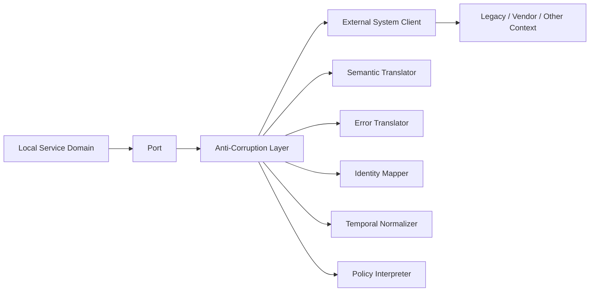
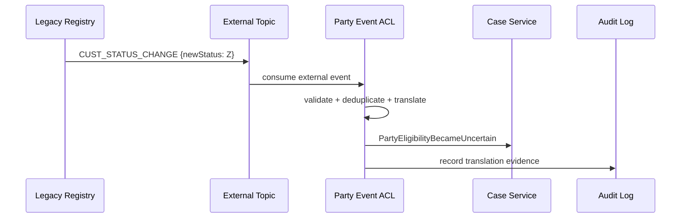
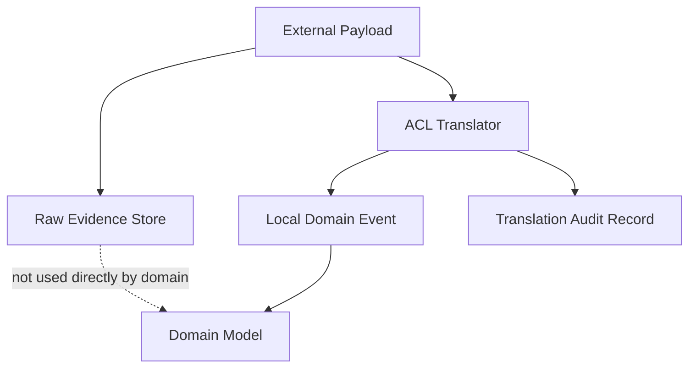
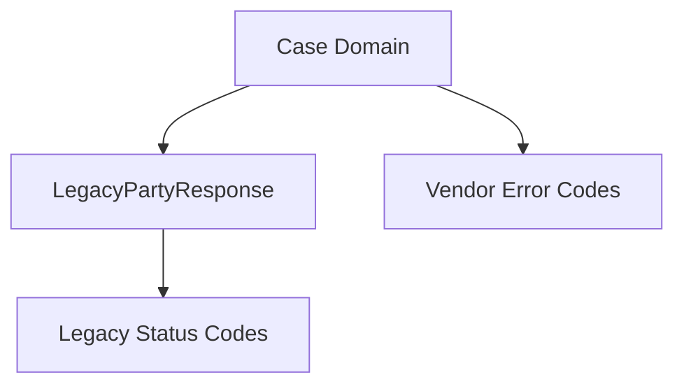
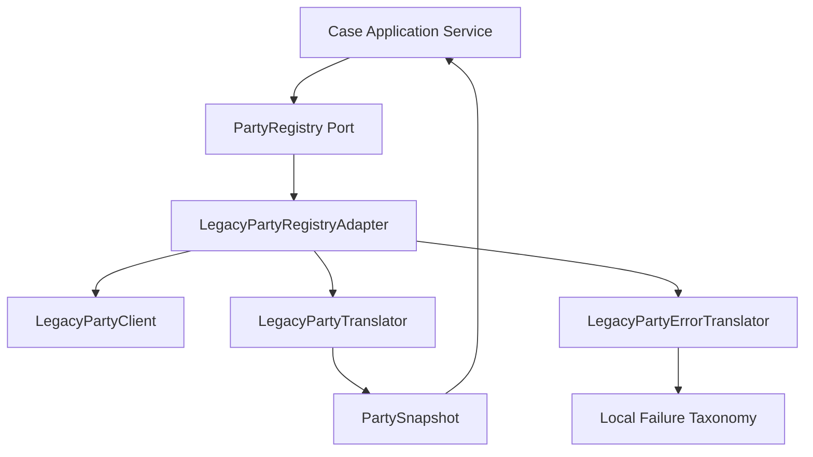

# Part 013 — Anti-Corruption Layer in Java

> Anti-Corruption Layer bukan “mapper DTO”.  
> Anti-Corruption Layer adalah **immunity system** agar model, policy, invariant, lifecycle, dan language milik service kita tidak rusak oleh model dari sistem lain.

Dalam microservices enterprise, service jarang hidup sendiri. Service harus bicara dengan:

- legacy monolith;
- mainframe;
- vendor API;
- CRM;
- IAM;
- payment gateway;
- document management system;
- workflow engine;
- external regulator;
- reporting platform;
- data lake;
- service lain yang punya bounded context berbeda.

Tanpa Anti-Corruption Layer, model luar perlahan masuk ke domain kita. Awalnya hanya satu field. Lalu enum ikut bocor. Lalu lifecycle ikut bocor. Lalu error code ikut bocor. Akhirnya service kita tidak lagi punya model sendiri; ia hanya menjadi projection dari sistem lain.

Part ini membahas ACL dari sudut implementasi Java production-grade: package structure, port, adapter, translator, error translation, semantic mapping, event translation, testing, dan failure mode.

---

## 1. Core Thesis

Anti-Corruption Layer menjawab pertanyaan:

> “Bagaimana service saya tetap berbicara dengan sistem luar tanpa mengadopsi model, terminologi, lifecycle, bug, constraint, dan kebiasaan buruk sistem luar itu?”

ACL adalah boundary yang menerjemahkan antara dua model yang berbeda.

Bukan hanya:

```java
LegacyCustomerDto -> CustomerDto
```

Tetapi:

```text
external language -> local domain language
external lifecycle -> local lifecycle
external identity -> local identity
external failure -> local failure semantics
external consistency -> local consistency contract
external authorization assumptions -> local trust boundary
external time semantics -> local temporal model
```

Microsoft Azure Architecture Center menjelaskan ACL sebagai facade/adapter layer di antara subsystem yang tidak memiliki semantic yang sama, agar desain aplikasi tidak dibatasi oleh dependency pada subsystem luar. Prinsip ini juga berasal dari Domain-Driven Design.

Dalam bahasa microservices:

> ACL menjaga **bounded context sovereignty**.

Sovereignty berarti service punya hak untuk menentukan:

- istilah domainnya sendiri;
- invariant-nya sendiri;
- error semantics-nya sendiri;
- policy interpretation-nya sendiri;
- lifecycle state-nya sendiri;
- data ownership-nya sendiri.

---

## 2. The Problem: Model Corruption

Model corruption terjadi ketika konsep dari luar masuk tanpa filter ke domain internal.

Contoh sederhana.

Legacy system punya status party:

```text
A = active
I = inactive
D = deceased
P = pending
X = unknown
Z = archived manually but sometimes active in nightly batch
```

Service kita membutuhkan konsep regulatory participation:

```text
ELIGIBLE_FOR_CASE
NOT_ELIGIBLE
REQUIRES_MANUAL_REVIEW
UNKNOWN
```

Jika kita langsung memakai status legacy di domain service:

```java
public enum PartyStatus {
    A, I, D, P, X, Z
}
```

maka domain kita sudah tercemar.

Masalahnya bukan enum pendek. Masalahnya adalah service kita sekarang harus memahami sejarah, bug, dan operational behavior milik legacy system.

Akhirnya business rule menjadi seperti ini:

```java
if (party.getStatus() == PartyStatus.A || party.getStatus() == PartyStatus.Z) {
    // sometimes Z is actually active after nightly sync
}
```

Ini bukan domain logic. Ini leakage.

ACL mencegah leakage itu dengan menerjemahkan model luar menjadi konsep lokal yang eksplisit:

```java
public enum RegulatoryEligibility {
    ELIGIBLE_FOR_CASE,
    NOT_ELIGIBLE,
    REQUIRES_MANUAL_REVIEW,
    UNKNOWN
}
```

Lalu translation logic ditempatkan di boundary adapter, bukan di domain.

---

## 3. Corruption Is Wider Than Data Shape

Banyak engineer mengira corruption hanya soal field mapping.

Itu terlalu sempit.

Corruption bisa terjadi pada banyak lapisan.

| Jenis Corruption | Contoh | Dampak |
|---|---|---|
| Semantic corruption | `customer`, `party`, `subject`, `account holder` dianggap sama | Rule salah karena istilah terlihat mirip tetapi makna berbeda |
| Lifecycle corruption | external status dipakai sebagai local state | Local workflow bergantung pada lifecycle luar |
| Identity corruption | external ID menjadi aggregate ID lokal | Service sulit migrasi dan sulit multi-source |
| Error corruption | vendor error code bocor ke API internal | Consumer harus tahu vendor behavior |
| Temporal corruption | external timestamp dianggap sebagai event time lokal | Audit timeline salah |
| Consistency corruption | external stale read dianggap authoritative | Keputusan dibuat dari data belum stabil |
| Policy corruption | external eligibility rule dipercaya tanpa evaluasi lokal | Regulatory decision tidak defensible |
| Security corruption | external role dianggap setara dengan local authority | Authorization boundary bocor |
| Availability corruption | downtime dependency membuat domain capability ikut mati total | Blast radius membesar |

ACL harus dirancang untuk mencegah corruption yang relevan terhadap domain.

---

## 4. ACL as Translation Boundary

Mental model ACL:



Domain tidak memanggil vendor client langsung.

Domain atau application service bergantung pada **port**:

```java
public interface PartyRegistry {
    PartySnapshot findParty(PartyId partyId);
}
```

Implementasi port berada di infrastructure adapter:

```java
public final class LegacyPartyRegistryAdapter implements PartyRegistry {
    private final LegacyPartyClient client;
    private final LegacyPartyTranslator translator;

    @Override
    public PartySnapshot findParty(PartyId partyId) {
        LegacyPartyResponse response = client.fetchParty(partyId.externalValue());
        return translator.toPartySnapshot(response);
    }
}
```

Domain hanya tahu `PartySnapshot`, bukan `LegacyPartyResponse`.

---

## 5. ACL Is Not a Generic Mapper Layer

Generic mapper biasanya hanya memindahkan data:

```java
class Mapper {
    Target map(Source source);
}
```

ACL harus lebih eksplisit.

ACL menjawab:

- field mana authoritative;
- field mana tidak dipercaya;
- value mana invalid;
- value mana harus berubah menjadi `UNKNOWN`;
- value mana harus memicu manual review;
- error mana retryable;
- error mana fatal;
- timestamp mana event time;
- timestamp mana processing time;
- external duplicate bagaimana ditangani;
- external enum baru bagaimana dicegah merusak domain;
- lifecycle mismatch bagaimana dimodelkan.

Contoh translator yang buruk:

```java
public PartySnapshot map(LegacyPartyResponse response) {
    return new PartySnapshot(
        response.id(),
        response.name(),
        response.status(),
        response.riskCode()
    );
}
```

Ini bukan ACL. Ini pass-through.

Contoh translator yang lebih tepat:

```java
public PartySnapshot toPartySnapshot(LegacyPartyResponse response) {
    ExternalPartyId externalId = ExternalPartyId.of(response.id());

    RegulatoryEligibility eligibility = switch (response.statusCode()) {
        case "A" -> RegulatoryEligibility.ELIGIBLE_FOR_CASE;
        case "D", "I" -> RegulatoryEligibility.NOT_ELIGIBLE;
        case "P", "Z" -> RegulatoryEligibility.REQUIRES_MANUAL_REVIEW;
        case "X", null -> RegulatoryEligibility.UNKNOWN;
        default -> RegulatoryEligibility.UNKNOWN;
    };

    RiskLevel riskLevel = switch (response.riskCode()) {
        case "H" -> RiskLevel.HIGH;
        case "M" -> RiskLevel.MEDIUM;
        case "L" -> RiskLevel.LOW;
        case null -> RiskLevel.UNASSESSED;
        default -> RiskLevel.UNASSESSED;
    };

    return new PartySnapshot(
        externalId,
        LegalName.normalized(response.legalName()),
        eligibility,
        riskLevel,
        ExternalDataFreshness.from(response.lastUpdatedAt()),
        SourceSystem.LEGACY_PARTY_REGISTRY
    );
}
```

Perhatikan: translator tidak hanya mengubah nama field. Translator membuat keputusan semantic.

---

## 6. When to Use ACL

Gunakan ACL ketika ada perbedaan model yang signifikan.

ACL cocok untuk:

- integrasi dengan legacy system;
- integrasi dengan vendor API;
- integrasi dengan sistem upstream yang tidak bisa dikontrol;
- konteks domain yang punya language berbeda;
- sistem dengan lifecycle berbeda;
- sistem dengan ownership berbeda;
- external API yang sering berubah;
- domain regulated yang butuh audit explanation;
- migrasi monolith ke microservices;
- strangler fig extraction;
- event bridge antar bounded context.

ACL belum tentu perlu jika:

- kedua service berada dalam bounded context yang sama;
- model memang intentionally shared sebagai published language;
- integrasi hanya teknis dan semantic-nya sama;
- data tidak masuk ke domain decision;
- dependency temporary dan sangat kecil.

Namun, hati-hati dengan alasan “sementara”. Banyak corruption permanen dimulai dari temporary shortcut.

---

## 7. ACL Placement in Java Microservice Structure

Struktur yang direkomendasikan:

```text
case-service/
  src/main/java/com/acme/caseapp/
    casecore/
      domain/
        model/
          CaseId.java
          PartySnapshot.java
          RegulatoryEligibility.java
        service/
          CaseEligibilityPolicy.java
      application/
        OpenCaseUseCase.java
        AssessPartyUseCase.java
        port/
          PartyRegistry.java
          RiskIntelligence.java
      infrastructure/
        legacyregistry/
          LegacyPartyRegistryAdapter.java
          LegacyPartyClient.java
          LegacyPartyTranslator.java
          LegacyPartyResponse.java
          LegacyPartyErrorTranslator.java
        riskvendor/
          VendorRiskAdapter.java
          VendorRiskClient.java
          VendorRiskTranslator.java
```

Important rule:

> External DTO tidak boleh keluar dari package adapter.

`LegacyPartyResponse` tidak boleh dipakai oleh:

- controller;
- application service;
- domain service;
- entity;
- domain event;
- repository;
- API response lokal.

Cara enforce sederhana:

```text
application.port may define local contracts
infrastructure.legacyregistry may implement ports
casecore.domain must not depend on infrastructure
casecore.application must not depend on LegacyPartyResponse
```

Jika memakai ArchUnit, rule-nya bisa seperti ini:

```java
@AnalyzeClasses(packages = "com.acme.caseapp")
class ArchitectureRulesTest {

    @ArchTest
    static final ArchRule domainMustNotDependOnLegacyAdapter =
        noClasses()
            .that().resideInAPackage("..casecore.domain..")
            .should().dependOnClassesThat()
            .resideInAnyPackage("..infrastructure.legacyregistry..", "..legacy..", "..vendor..");

    @ArchTest
    static final ArchRule applicationMustOnlyUsePorts =
        noClasses()
            .that().resideInAPackage("..casecore.application..")
            .should().dependOnClassesThat()
            .haveSimpleNameEndingWith("Response");
}
```

Rule seperti ini bukan “test tambahan”. Ini guardrail agar boundary tidak bocor.

---

## 8. Port First, Client Later

Kesalahan umum: engineer membuat HTTP client dulu, lalu domain mengikuti response vendor.

Urutan yang benar:

```text
1. Apa yang domain butuhkan?
2. Buat port dalam bahasa domain lokal.
3. Buat adapter yang memenuhi port tersebut.
4. Baru bicara dengan vendor/legacy/external system.
```

Contoh port yang buruk:

```java
public interface LegacyCustomerGateway {
    LegacyCustomerResponse getCustomer(String customerNo);
}
```

Port ini bukan domain contract. Ini vendor contract yang dibungkus interface.

Contoh port yang lebih baik:

```java
public interface PartyRegistry {
    PartySnapshot getSnapshot(PartyId partyId);
}
```

Application service tidak peduli apakah data berasal dari:

- legacy API;
- cache;
- file drop;
- event projection;
- manual override;
- replicated read model.

Itu keputusan adapter.

---

## 9. Example Domain Model

Kita pakai contoh regulatory case management.

Domain membutuhkan snapshot party untuk menentukan apakah case bisa dibuka.

```java
public record PartySnapshot(
    ExternalPartyId externalPartyId,
    LegalName legalName,
    RegulatoryEligibility eligibility,
    RiskLevel riskLevel,
    ExternalDataFreshness freshness,
    SourceSystem sourceSystem
) {
    public boolean requiresHumanReview() {
        return eligibility == RegulatoryEligibility.REQUIRES_MANUAL_REVIEW
            || eligibility == RegulatoryEligibility.UNKNOWN
            || riskLevel == RiskLevel.UNASSESSED;
    }
}
```

Eligibility lokal:

```java
public enum RegulatoryEligibility {
    ELIGIBLE_FOR_CASE,
    NOT_ELIGIBLE,
    REQUIRES_MANUAL_REVIEW,
    UNKNOWN
}
```

Risk lokal:

```java
public enum RiskLevel {
    HIGH,
    MEDIUM,
    LOW,
    UNASSESSED
}
```

Port lokal:

```java
public interface PartyRegistry {
    PartySnapshot getSnapshot(PartyId partyId);
}
```

Use case:

```java
public final class OpenCaseUseCase {
    private final PartyRegistry partyRegistry;
    private final CaseRepository caseRepository;

    public CaseId open(OpenCaseCommand command) {
        PartySnapshot party = partyRegistry.getSnapshot(command.partyId());

        CaseDraft draft = CaseDraft.forParty(command.partyId(), party);

        if (party.requiresHumanReview()) {
            draft.markRequiresEligibilityReview("Party data requires manual review");
        }

        Case opened = draft.open(command.openedBy(), command.reason());
        caseRepository.save(opened);
        return opened.id();
    }
}
```

`OpenCaseUseCase` tidak tahu status `A`, `Z`, vendor code, SOAP payload, REST endpoint, atau batch sync.

Itulah point ACL.

---

## 10. External DTO Stays Outside

External DTO:

```java
public record LegacyPartyResponse(
    String id,
    String legalName,
    String statusCode,
    String riskCode,
    String lastUpdatedAt,
    String sourceBranch,
    String deceasedFlag,
    String suppressionCode
) {}
```

DTO ini ada di package adapter:

```text
infrastructure/legacyregistry/LegacyPartyResponse.java
```

Jangan letakkan di package umum seperti:

```text
common/dto/LegacyPartyResponse.java
```

Karena begitu masuk `common`, hampir pasti akan dipakai di mana-mana.

Rule:

> Jika sebuah type berasal dari external system, taruh type itu sedekat mungkin dengan adapter external tersebut.

---

## 11. Translator as Semantic Component

Translator bukan util stateless acak.

Translator adalah domain-adjacent component yang punya responsibility jelas.

```java
public final class LegacyPartyTranslator {

    public PartySnapshot toPartySnapshot(LegacyPartyResponse response) {
        return new PartySnapshot(
            ExternalPartyId.of(response.id()),
            translateLegalName(response),
            translateEligibility(response),
            translateRisk(response),
            translateFreshness(response),
            SourceSystem.LEGACY_PARTY_REGISTRY
        );
    }

    private LegalName translateLegalName(LegacyPartyResponse response) {
        if (response.legalName() == null || response.legalName().isBlank()) {
            return LegalName.unknown();
        }
        return LegalName.normalized(response.legalName());
    }

    private RegulatoryEligibility translateEligibility(LegacyPartyResponse response) {
        if ("Y".equals(response.deceasedFlag())) {
            return RegulatoryEligibility.NOT_ELIGIBLE;
        }

        return switch (response.statusCode()) {
            case "A" -> RegulatoryEligibility.ELIGIBLE_FOR_CASE;
            case "I", "D" -> RegulatoryEligibility.NOT_ELIGIBLE;
            case "P", "Z" -> RegulatoryEligibility.REQUIRES_MANUAL_REVIEW;
            case "X", null -> RegulatoryEligibility.UNKNOWN;
            default -> RegulatoryEligibility.UNKNOWN;
        };
    }

    private RiskLevel translateRisk(LegacyPartyResponse response) {
        return switch (response.riskCode()) {
            case "H" -> RiskLevel.HIGH;
            case "M" -> RiskLevel.MEDIUM;
            case "L" -> RiskLevel.LOW;
            case null -> RiskLevel.UNASSESSED;
            default -> RiskLevel.UNASSESSED;
        };
    }

    private ExternalDataFreshness translateFreshness(LegacyPartyResponse response) {
        return ExternalDataFreshness.parseExternalTimestamp(response.lastUpdatedAt())
            .orElse(ExternalDataFreshness.unknown());
    }
}
```

Key point:

- unknown external code tidak crash domain sembarangan;
- deceased flag override status code;
- timestamp parsing failure menghasilkan explicit unknown freshness;
- semua ambiguity masuk model lokal secara eksplisit.

---

## 12. Unknown Is a First-Class Domain State

ACL yang baik tidak pura-pura semua data bersih.

Jangan lakukan ini:

```java
if (response.riskCode() == null) {
    return RiskLevel.LOW;
}
```

Itu mengubah missing data menjadi low risk. Dalam domain regulated, ini berbahaya.

Lebih baik:

```java
case null -> RiskLevel.UNASSESSED;
```

Unknown harus dibedakan dari false, zero, low, empty, inactive.

| External Value | Local Meaning |
|---|---|
| `null riskCode` | `UNASSESSED` |
| unknown status code | `UNKNOWN` |
| invalid timestamp | `freshness=UNKNOWN` |
| missing legal name | `LegalName.unknown()` |
| stale data | `STALE` atau `REQUIRES_REFRESH` |

Dalam microservices, unknown adalah desain reliability dan auditability.

---

## 13. Identity Translation

Jangan jadikan external ID sebagai internal aggregate ID tanpa berpikir.

External ID:

```java
public record ExternalPartyId(String value) {}
```

Local ID:

```java
public record CasePartyId(UUID value) {}
```

Mapping:

```java
public record PartyReference(
    CasePartyId localPartyId,
    ExternalPartyId externalPartyId,
    SourceSystem sourceSystem
) {}
```

Kapan boleh memakai external ID langsung?

- service hanya membuat read-through view;
- service tidak memiliki lifecycle internal untuk entity itu;
- external system benar-benar system of record;
- tidak ada multi-source identity problem;
- tidak ada kebutuhan merge/split identity.

Kapan jangan?

- service punya lifecycle sendiri;
- external identity bisa berubah;
- ada banyak upstream system;
- ada identity reconciliation;
- ada audit obligation;
- ada internal ownership atas decision.

Identity corruption sering baru terasa saat migrasi, merge data, atau audit.

---

## 14. Error Translation

External error tidak boleh bocor ke domain.

Legacy client mungkin menghasilkan:

```text
HTTP 404
HTTP 409
HTTP 500
SOAP fault PR-017
Vendor code VND_TIMEOUT_88
Empty response with HTTP 200
Malformed XML
```

Domain butuh error semantic:

```java
sealed interface PartyRegistryFailure permits
    PartyNotFound,
    PartyRegistryUnavailable,
    PartyRegistryTimeout,
    PartyRegistryDataInvalid,
    PartyRegistryAccessDenied {
}
```

Adapter menerjemahkan:

```java
public final class LegacyPartyErrorTranslator {

    public RuntimeException translate(Exception exception) {
        if (exception instanceof HttpClientTimeoutException) {
            return new PartyRegistryTimeout("Legacy party registry timed out", exception);
        }

        if (exception instanceof HttpClientResponseException http) {
            return switch (http.statusCode()) {
                case 404 -> new PartyNotFound("Party not found in legacy registry", http);
                case 401, 403 -> new PartyRegistryAccessDenied("Access denied by legacy registry", http);
                case 500, 502, 503, 504 -> new PartyRegistryUnavailable("Legacy registry unavailable", http);
                default -> new PartyRegistryUnavailable("Unexpected legacy registry failure", http);
            };
        }

        return new PartyRegistryUnavailable("Unknown legacy registry failure", exception);
    }
}
```

Application service dapat mengambil keputusan:

```java
try {
    PartySnapshot snapshot = partyRegistry.getSnapshot(command.partyId());
    // continue
} catch (PartyRegistryTimeout ex) {
    return CaseOpeningResult.pendingExternalVerification(command.partyId());
} catch (PartyNotFound ex) {
    return CaseOpeningResult.rejected("Party does not exist");
}
```

Error translation adalah bagian dari domain protection.

---

## 15. Temporal Translation

External timestamp sering ambiguous.

Contoh:

```json
{
  "lastUpdatedAt": "2026-07-05 10:15:22",
  "createdDate": "05/07/2026",
  "batchDate": "20260705"
}
```

Pertanyaan penting:

- timezone apa;
- apakah timestamp menunjukkan event time atau processing time;
- apakah timestamp berasal dari source atau sync job;
- apakah timestamp bisa mundur;
- apakah timestamp bisa null;
- apakah timestamp authoritative untuk audit;
- apakah timestamp boleh dipakai untuk SLA.

Buat model lokal eksplisit:

```java
public record ExternalDataFreshness(
    Instant observedAt,
    Optional<Instant> sourceUpdatedAt,
    FreshnessConfidence confidence
) {
    public static ExternalDataFreshness unknown() {
        return new ExternalDataFreshness(
            Instant.now(),
            Optional.empty(),
            FreshnessConfidence.UNKNOWN
        );
    }
}
```

Jangan sembarang memasukkan external timestamp ke event domain lokal:

```java
new CaseOpenedEvent(caseId, externalResponse.lastUpdatedAt()) // dangerous
```

Domain event time sebaiknya berasal dari keputusan lokal:

```java
new CaseOpenedEvent(caseId, clock.instant())
```

External timestamp menjadi metadata evidence, bukan event time utama.

---

## 16. ACL for Commands

ACL tidak hanya untuk query/read.

Ketika service mengirim command ke external system, ACL harus menerjemahkan intent lokal menjadi command external.

Local command:

```java
public record RegisterCaseExternalReference(
    CaseId caseId,
    PartyId partyId,
    CaseCategory category,
    OpenedBy openedBy,
    Instant openedAt
) {}
```

Vendor request:

```java
public record LegacyCaseCreateRequest(
    String caseNo,
    String partyNo,
    String typeCode,
    String operatorId,
    String createDate
) {}
```

Translator:

```java
public final class LegacyCaseCommandTranslator {

    public LegacyCaseCreateRequest toLegacyRequest(RegisterCaseExternalReference command) {
        return new LegacyCaseCreateRequest(
            command.caseId().value().toString(),
            command.partyId().externalValue(),
            translateCategory(command.category()),
            translateOperator(command.openedBy()),
            formatLegacyDate(command.openedAt())
        );
    }

    private String translateCategory(CaseCategory category) {
        return switch (category) {
            case MARKET_ABUSE -> "MAB";
            case CONDUCT_BREACH -> "CBR";
            case LICENSING_ISSUE -> "LIC";
        };
    }
}
```

Command ACL harus memperhatikan:

- idempotency key;
- external duplicate behavior;
- retry semantics;
- command timeout;
- acknowledgement meaning;
- external side effect uncertainty.

---

## 17. External Side Effect Uncertainty

Masalah klasik:

```text
Service sends command to external system.
Network times out.
Did external system apply the command?
```

Timeout tidak berarti command gagal. Timeout berarti caller tidak tahu hasilnya.

ACL harus memodelkan ini.

```java
public sealed interface ExternalCommandResult permits
    ExternalCommandAccepted,
    ExternalCommandRejected,
    ExternalCommandOutcomeUnknown {
}
```

Adapter:

```java
public ExternalCommandResult registerCase(RegisterCaseExternalReference command) {
    LegacyCaseCreateRequest request = translator.toLegacyRequest(command);

    try {
        LegacyCreateResponse response = client.createCase(request, command.caseId().asIdempotencyKey());
        return translator.toCommandResult(response);
    } catch (HttpClientTimeoutException timeout) {
        return new ExternalCommandOutcomeUnknown(command.caseId(), timeout.getMessage());
    }
}
```

Application service dapat menyimpan pending verification:

```java
ExternalCommandResult result = externalCaseRegistry.registerCase(command);

switch (result) {
    case ExternalCommandAccepted accepted -> markExternalReferenceRegistered(accepted.reference());
    case ExternalCommandRejected rejected -> markExternalRegistrationRejected(rejected.reason());
    case ExternalCommandOutcomeUnknown unknown -> scheduleReconciliation(unknown.caseId());
}
```

Ini jauh lebih benar daripada:

```java
catch (TimeoutException e) {
    throw new RuntimeException("Failed");
}
```

Karena secara distributed systems, outcome bisa unknown.

---

## 18. Event Anti-Corruption Layer

External event tidak boleh langsung menjadi domain event lokal.

External event:

```json
{
  "eventType": "CUST_STATUS_CHANGE",
  "customerNo": "P-123",
  "oldStatus": "P",
  "newStatus": "Z",
  "eventDate": "2026-07-05T08:10:00Z",
  "batchId": "BATCH-991"
}
```

Jika service langsung publish:

```java
new PartyStatusChanged(event.customerNo(), event.newStatus())
```

maka external language bocor.

Lebih baik:

```java
public record ExternalPartyStatusChanged(
    ExternalPartyId externalPartyId,
    RegulatoryEligibility newEligibility,
    ExternalEventMetadata metadata
) {}
```

Atau jika event itu memengaruhi domain lokal:

```java
public record PartyEligibilityBecameUncertain(
    ExternalPartyId externalPartyId,
    String reason,
    Instant observedAt,
    SourceSystem sourceSystem
) {}
```

Event ACL flow:



Event ACL responsibility:

- validate external payload;
- reject poison event;
- deduplicate;
- translate language;
- attach source metadata;
- preserve raw reference for audit if needed;
- publish local integration event or call application port.

---

## 19. Preserve Evidence Without Polluting Domain

Dalam regulated systems, kadang raw external payload harus disimpan untuk evidence.

Namun menyimpan raw payload tidak berarti domain boleh memakai raw payload.

Model:

```text
Raw external message store:
  - source system
  - raw payload
  - received at
  - checksum
  - translation version
  - translation result

Domain model:
  - local interpreted meaning
  - local decision
  - local reason
```

Diagram:



Ini menjaga dua kebutuhan sekaligus:

- audit bisa melihat original evidence;
- domain tetap bersih dari external model.

---

## 20. Version the Translation Logic

Translator adalah business-critical code.

Jika mapping berubah, keputusan domain bisa berubah.

Contoh:

```text
Before:
legacy status Z -> REQUIRES_MANUAL_REVIEW

After:
legacy status Z -> ELIGIBLE_FOR_CASE
```

Ini bukan refactor kecil. Ini policy change.

Tambahkan translation version:

```java
public record TranslationResult<T>(
    T value,
    TranslationVersion version,
    List<TranslationWarning> warnings
) {}
```

```java
public enum TranslationVersion {
    LEGACY_PARTY_V1,
    LEGACY_PARTY_V2
}
```

Audit record:

```json
{
  "sourceSystem": "LEGACY_PARTY_REGISTRY",
  "externalId": "P-123",
  "translator": "LegacyPartyTranslator",
  "translationVersion": "LEGACY_PARTY_V2",
  "inputHash": "sha256:...",
  "result": "REQUIRES_MANUAL_REVIEW",
  "warnings": ["STATUS_Z_AMBIGUOUS"]
}
```

Untuk domain regulated, ini sangat penting.

---

## 21. Translation Warnings

Tidak semua translation failure harus exception.

Kadang data bisa diterjemahkan tetapi dengan warning.

```java
public record PartySnapshotTranslation(
    PartySnapshot snapshot,
    List<TranslationWarning> warnings
) {}
```

Warning examples:

```java
public enum TranslationWarning {
    MISSING_LEGAL_NAME,
    UNKNOWN_STATUS_CODE,
    STALE_SOURCE_DATA,
    AMBIGUOUS_RISK_CODE,
    INVALID_SOURCE_TIMESTAMP
}
```

Use case bisa menindaklanjuti:

```java
PartySnapshotTranslation translation = partyRegistry.getSnapshot(command.partyId());

if (translation.warnings().contains(TranslationWarning.STALE_SOURCE_DATA)) {
    caseDraft.requireManualReview("Party registry data is stale");
}
```

Ini lebih baik daripada log warning yang tidak pernah dibaca.

---

## 22. ACL and Caching

Sering muncul pertanyaan:

> Cache ditempatkan di mana?

Jawabannya tergantung apa yang di-cache.

Jika cache menyimpan external response:

```text
LegacyPartyResponse cache
```

maka cache menjadi bagian adapter.

Jika cache menyimpan local interpreted snapshot:

```text
PartySnapshot cache
```

maka cache lebih dekat ke port implementation.

Prinsip:

- domain tidak boleh tahu cache external;
- TTL harus mencerminkan freshness contract;
- stale data harus explicit;
- cache hit tidak boleh menyembunyikan source uncertainty;
- cache key harus memperhitungkan source system dan identity mapping.

Example:

```java
public final class CachingPartyRegistryAdapter implements PartyRegistry {
    private final PartyRegistry delegate;
    private final PartySnapshotCache cache;

    @Override
    public PartySnapshot getSnapshot(PartyId partyId) {
        return cache.get(partyId)
            .filter(snapshot -> snapshot.freshness().isAcceptableForCaseOpening())
            .orElseGet(() -> {
                PartySnapshot fresh = delegate.getSnapshot(partyId);
                cache.put(partyId, fresh);
                return fresh;
            });
    }
}
```

Cache is not a business decision. Freshness is.

---

## 23. ACL and Resilience

ACL is a natural place for:

- timeout policy;
- retry policy;
- circuit breaker;
- bulkhead;
- rate limit;
- fallback;
- stale read policy;
- reconciliation trigger.

But be careful.

Resilience policy must not hide business uncertainty.

Bad fallback:

```java
catch (Exception ex) {
    return PartySnapshot.lowRiskFallback(partyId);
}
```

Better fallback:

```java
catch (PartyRegistryUnavailable ex) {
    return PartySnapshot.unverified(
        partyId.externalId(),
        "Party registry unavailable",
        clock.instant()
    );
}
```

Then domain can decide:

```java
if (partySnapshot.isUnverified()) {
    draft.markPendingExternalVerification();
}
```

Fallback should preserve uncertainty, not erase it.

---

## 24. ACL and API Gateway Are Different

API gateway can do:

- routing;
- authentication;
- coarse authorization;
- rate limit;
- protocol termination;
- request shaping;
- edge composition.

ACL does:

- semantic translation;
- domain language protection;
- external lifecycle isolation;
- error meaning translation;
- policy interpretation;
- identity mapping.

Do not push domain ACL into gateway unless the gateway is intentionally a domain-aware BFF or composition service.

A generic gateway is a poor place for deep business translation.

---

## 25. ACL and Shared Libraries

Temptation:

```text
common-legacy-client.jar
common-translators.jar
common-dtos.jar
```

This can be dangerous.

A shared library often turns external model into shared internal model.

Safer approach:

- share low-level client if necessary;
- do not share domain translation blindly;
- each bounded context owns its interpretation;
- use published language for intentionally shared contracts;
- version shared library carefully;
- avoid placing external DTO in global common module.

Example:

```text
party-registry-client-core  -> transport only
case-service ACL            -> translates for case domain
licensing-service ACL       -> translates for licensing domain
enforcement-service ACL     -> translates for enforcement domain
```

Same external status can mean different local decision in different bounded contexts.

---

## 26. ACL Testing Strategy

ACL testing is not only integration testing.

You need at least five levels.

### 26.1 Semantic Mapping Tests

```java
@ParameterizedTest
@CsvSource({
    "A, N, ELIGIBLE_FOR_CASE",
    "D, Y, NOT_ELIGIBLE",
    "P, N, REQUIRES_MANUAL_REVIEW",
    "Z, N, REQUIRES_MANUAL_REVIEW",
    "X, N, UNKNOWN"
})
void translatesLegacyStatusToRegulatoryEligibility(
    String statusCode,
    String deceasedFlag,
    RegulatoryEligibility expected
) {
    LegacyPartyResponse response = new LegacyPartyResponse(
        "P-123", "Jane Doe", statusCode, "M", "2026-07-05T10:00:00Z", "BR01", deceasedFlag, null
    );

    PartySnapshot snapshot = translator.toPartySnapshot(response);

    assertThat(snapshot.eligibility()).isEqualTo(expected);
}
```

### 26.2 Unknown Value Tests

```java
@Test
void unknownExternalStatusDoesNotCrashDomain() {
    LegacyPartyResponse response = responseWithStatus("NEW_VENDOR_STATUS");

    PartySnapshot snapshot = translator.toPartySnapshot(response);

    assertThat(snapshot.eligibility()).isEqualTo(RegulatoryEligibility.UNKNOWN);
}
```

### 26.3 Contract Tests Against External API

Verify payload compatibility:

- required fields;
- enum values;
- error response shape;
- timeout behavior;
- pagination behavior;
- authentication requirement.

### 26.4 Golden Sample Tests

Store representative external samples:

```text
src/test/resources/legacy-party-samples/
  active-party.json
  deceased-party.json
  archived-z-party.json
  missing-risk-code.json
  malformed-date.json
```

Test translation result from real samples.

### 26.5 Architecture Boundary Tests

Ensure external DTO does not leak.

```java
noClasses()
    .that().resideOutsideOfPackage("..infrastructure.legacyregistry..")
    .should().dependOnClassesThat()
    .resideInAPackage("..infrastructure.legacyregistry.dto..");
```

---

## 27. Observability for ACL

ACL should emit observability signals.

Metrics:

```text
acl.translation.success.count
acl.translation.warning.count{warning="UNKNOWN_STATUS_CODE"}
acl.translation.failure.count
acl.external.request.latency
acl.external.timeout.count
acl.external.outcome_unknown.count
acl.cache.hit.count
acl.cache.stale.count
```

Logs:

```json
{
  "event": "acl_translation_warning",
  "sourceSystem": "LEGACY_PARTY_REGISTRY",
  "translator": "LegacyPartyTranslator",
  "translationVersion": "LEGACY_PARTY_V2",
  "externalId": "P-123",
  "warning": "UNKNOWN_STATUS_CODE",
  "statusCode": "Q",
  "correlationId": "..."
}
```

Traces:

```text
OpenCaseUseCase
  -> PartyRegistry.getSnapshot
     -> LegacyPartyRegistryAdapter.fetchParty
        -> HTTP GET /legacy/party/P-123
     -> LegacyPartyTranslator.toPartySnapshot
```

Do not log raw PII unless intentionally redacted and permitted.

---

## 28. ACL Failure Modes

| Failure Mode | Symptom | Root Cause | Prevention |
|---|---|---|---|
| DTO leakage | External response imported in domain | Adapter boundary weak | Package rules, ArchUnit |
| Semantic pass-through | Domain enum mirrors vendor enum | Translator too shallow | Local vocabulary first |
| Unknown collapse | Missing value becomes default false/low | Convenience mapping | Explicit unknown state |
| Error leakage | Vendor code exposed to consumer | No error translator | Local failure taxonomy |
| Temporal confusion | Audit timeline inconsistent | External timestamp misused | Event time vs observed time distinction |
| Shared library corruption | Many services depend on external DTO jar | Common module misuse | Context-specific translators |
| Hidden fallback | System returns fake success | Fallback erases uncertainty | Fallback must preserve uncertainty |
| Mapping drift | Vendor adds enum, domain silently misbehaves | No contract test/monitoring | Unknown alert + contract tests |
| Translator opacity | No one knows why mapping exists | No ADR/documentation | Translation decision record |

---

## 29. ACL Design Checklist

Use this checklist when reviewing integration design.

### Boundary

- Is the external model kept outside domain/application layers?
- Is there a local port expressed in local domain language?
- Is the adapter the only package that knows external DTOs?
- Is the translation direction explicit?

### Semantics

- Are external enums mapped to local concepts?
- Are ambiguous values modeled explicitly?
- Is unknown different from false/low/empty?
- Are lifecycle differences documented?

### Identity

- Are external IDs separated from local IDs?
- Is identity reconciliation needed?
- Is source system tracked?

### Error

- Are external failures translated into local failure taxonomy?
- Is timeout treated as unknown outcome when side effects are possible?
- Are retryable and non-retryable errors separated?

### Temporal

- Are external timestamps classified?
- Is event time separate from observed time?
- Is freshness visible to domain?

### Operation

- Are translation warnings observable?
- Are unknown external enum values alerted?
- Are contract tests in place?
- Is raw evidence stored separately if required?

### Evolution

- Is translation versioned when policy meaning can change?
- Is there an ADR for non-obvious mapping?
- Can external API version changes be isolated?

---

## 30. Mini Case Study: Enforcement Case Opening

Scenario:

A case service must open enforcement cases. It needs party information from a legacy party registry.

Legacy registry facts:

- status `A` means active;
- status `D` means dormant but sometimes used for deceased;
- field `deceasedFlag` is more reliable than status;
- status `Z` means archived but can still be case-relevant;
- risk code can be null;
- response timestamp has no timezone;
- API sometimes returns HTTP 200 with empty body;
- duplicate external registration can return HTTP 409.

Bad design:



Good design:



Result:

- case domain uses `RegulatoryEligibility`, not `A/D/Z`;
- external data freshness is explicit;
- null risk becomes `UNASSESSED`;
- timeout becomes pending verification;
- raw payload can be stored as evidence;
- translation version is recorded.

This is an ACL.

---

## 31. Practical Implementation Template

For every external integration, create this set of files:

```text
infrastructure/<external-system>/
  <ExternalSystem>Adapter.java
  <ExternalSystem>Client.java
  <ExternalSystem>Translator.java
  <ExternalSystem>ErrorTranslator.java
  <ExternalSystem>Properties.java
  dto/
    <ExternalSystem>Request.java
    <ExternalSystem>Response.java
  observability/
    <ExternalSystem>Metrics.java
```

Application port:

```text
application/port/<CapabilityPort>.java
```

Domain model:

```text
domain/model/<LocalConcept>.java
```

Tests:

```text
src/test/java/.../<ExternalSystem>TranslatorTest.java
src/test/java/.../<ExternalSystem>ErrorTranslatorTest.java
src/test/java/.../<ExternalSystem>ArchitectureTest.java
src/test/resources/<external-system>-samples/*.json
```

Documentation:

```text
docs/architecture/adr/0013-use-anti-corruption-layer-for-legacy-party-registry.md
docs/integrations/legacy-party-registry.md
```

---

## 32. Design Heuristics

Good ACL feels slightly verbose.

That is normal.

You are paying a small local complexity cost to avoid large system-wide corruption.

Heuristics:

1. If external terminology appears in domain, boundary is leaking.
2. If application service switches on vendor enum, boundary is leaking.
3. If API response exposes vendor error code, boundary is leaking.
4. If unknown values become safe defaults, boundary is unsafe.
5. If translator has no tests, integration is not trustworthy.
6. If translation changes can affect business decision, version and audit it.
7. If multiple contexts use the same external data, each context may need its own translator.
8. If raw payload is required for audit, store it separately from domain model.
9. If timeout follows a side-effect command, outcome is unknown, not failed.
10. If the integration feels too simple, verify semantic equivalence before skipping ACL.

---

## 33. Common Anti-Patterns

### 33.1 DTO Tunnel

Controller returns external DTO directly.

```java
@GetMapping("/party/{id}")
public LegacyPartyResponse getParty(@PathVariable String id) {
    return legacyClient.fetchParty(id);
}
```

This exposes external system semantics to your consumers.

### 33.2 Universal Common Model

All services use `EnterpriseCustomerDto`.

Usually this creates hidden coupling because each context pretends `customer` means the same thing.

### 33.3 Enum Mirroring

Local enum duplicates vendor enum.

```java
enum PartyStatus { A, I, D, P, X, Z }
```

This is not a local model.

### 33.4 Exception Pass-Through

```java
throw new VendorApiException(response.code(), response.message());
```

Now the rest of the system depends on vendor error semantics.

### 33.5 Silent Defaulting

```java
risk = response.riskCode() == null ? RiskLevel.LOW : map(response.riskCode());
```

This is dangerous because missing data becomes reassuring data.

### 33.6 Gateway as Domain Translator

Putting complex domain mapping in API gateway policy scripts creates hidden business logic outside service ownership.

### 33.7 Translator Without Owner

If no team owns translation semantics, mapping becomes undocumented folklore.

---

## 34. Exercise

Design an ACL for this situation:

External sanctions service returns:

```json
{
  "personId": "P-123",
  "matchScore": 0.82,
  "matchType": "FUZZY",
  "listCode": "SANC-INTL",
  "status": "PENDING_REVIEW",
  "updated": "2026/07/05 10:00"
}
```

Your enforcement service needs to decide whether a new case can proceed automatically.

Create:

1. local port;
2. local domain model;
3. external DTO;
4. translator;
5. error translator;
6. unknown/ambiguous state handling;
7. translation warnings;
8. audit record shape;
9. boundary test rule.

Expected mental model:

- `matchScore` is not automatically risk level;
- `PENDING_REVIEW` is not a final decision;
- timestamp is not necessarily audit decision time;
- fuzzy match should probably become manual review requirement;
- source system and translation version must be recorded.

---

## 35. Summary

Anti-Corruption Layer is one of the most important patterns for long-lived Java microservices.

It protects the service from external semantic drift.

A good ACL:

- keeps external DTOs outside the domain;
- expresses ports in local domain language;
- translates semantics, not only fields;
- treats unknown as first-class;
- separates local identity from external identity;
- translates errors into local failure taxonomy;
- preserves external side-effect uncertainty;
- translates external events into local meaning;
- version-controls meaningful translation logic;
- emits observability signals;
- is tested with semantic, contract, golden sample, and architecture tests.

The deeper principle:

> A microservice boundary is not protected by network separation.  
> It is protected by language separation, ownership separation, and semantic translation.

---

## References

- Microsoft Azure Architecture Center — Anti-Corruption Layer Pattern: https://learn.microsoft.com/en-us/azure/architecture/patterns/anti-corruption-layer
- Microsoft Azure Architecture Center — Microservices design patterns: https://learn.microsoft.com/en-us/azure/architecture/microservices/design/patterns
- Martin Fowler — Bounded Context: https://martinfowler.com/bliki/BoundedContext.html
- Martin Fowler — Domain Event: https://martinfowler.com/eaaDev/DomainEvent.html
- Eric Evans — Domain-Driven Design: Tackling Complexity in the Heart of Software
