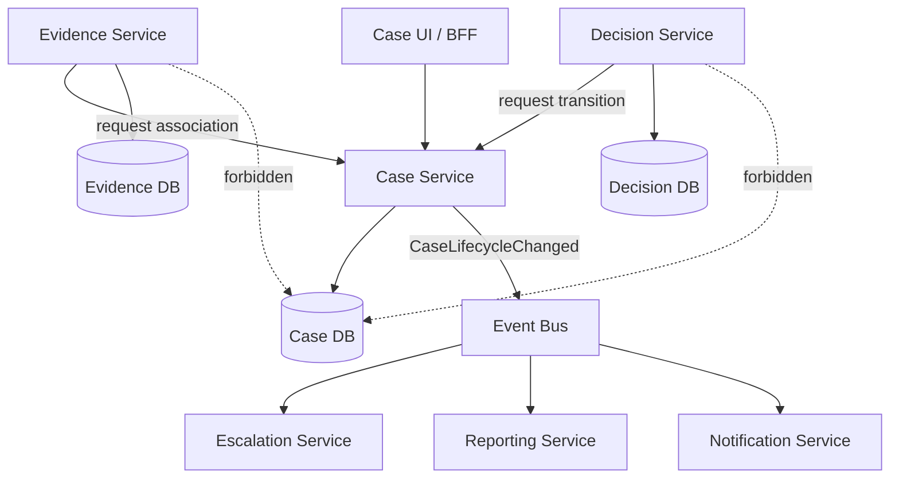
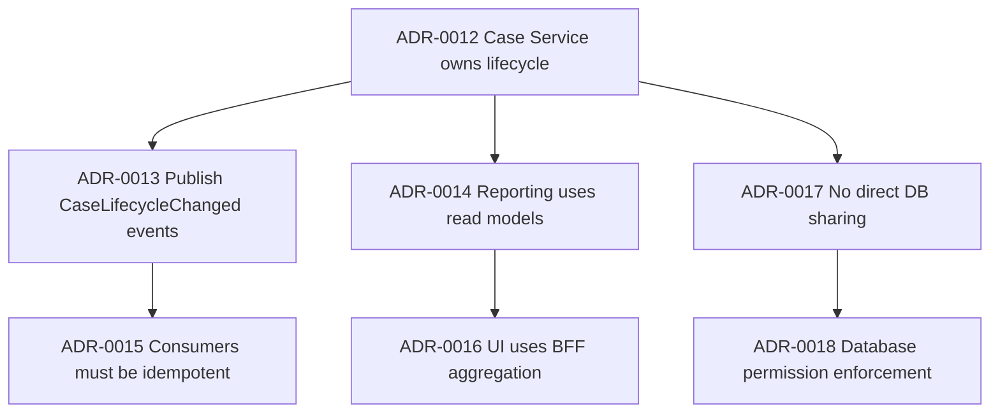
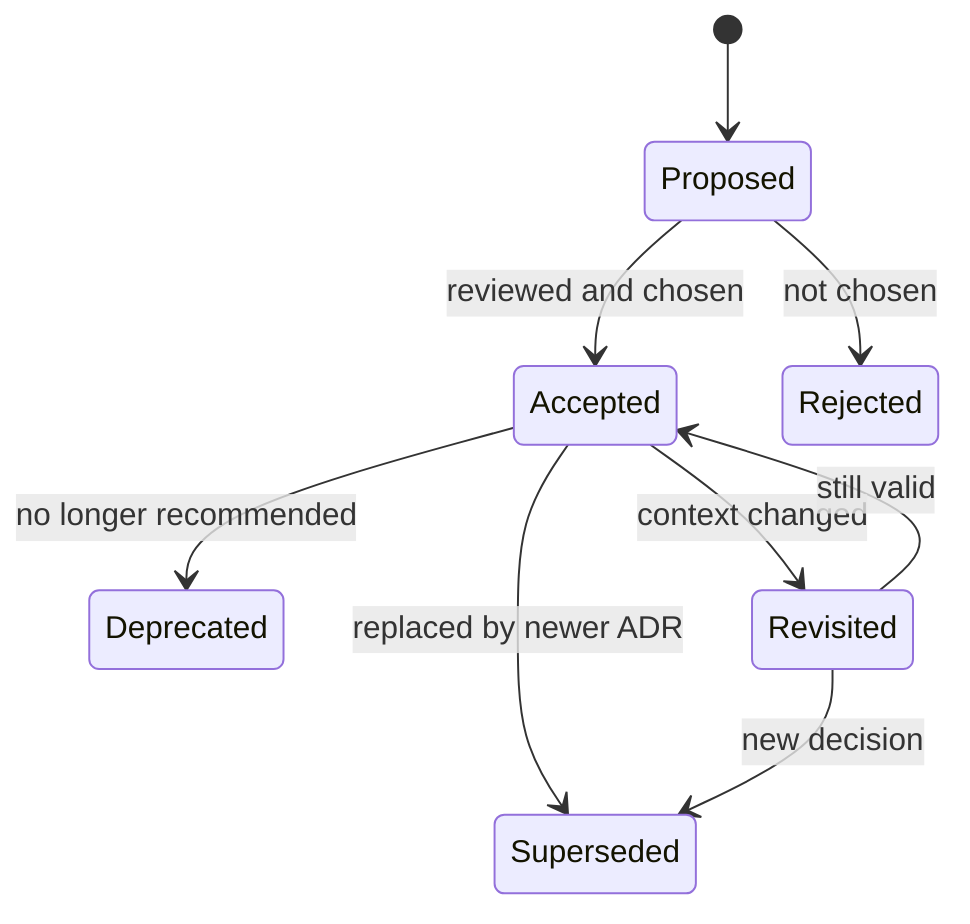

# Part 014 — Architecture Decision Records for Service Boundaries

> Arsitektur yang tidak ditulis akan berubah menjadi legenda.  
> Legenda sulit diuji, sulit diperdebatkan, sulit diwariskan, dan sulit dipertanggungjawabkan.

Dalam microservices, keputusan paling mahal biasanya bukan “pakai Spring Boot atau Quarkus”. Keputusan paling mahal adalah:

- apakah capability ini service terpisah atau module;
- siapa pemilik data;
- siapa system of record;
- transaksi mana harus synchronous;
- event mana menjadi contract;
- consistency window berapa lama;
- boundary mana boleh dilanggar sementara;
- service mana boleh memanggil service mana;
- apakah workflow di-orchestrate atau choreograph;
- apa konsekuensi ketika dependency down;
- kapan desain ini harus dievaluasi ulang.

Jika keputusan ini hanya hidup di kepala architect atau tech lead, sistem akan kehilangan memori.

Architecture Decision Record atau ADR adalah cara ringan untuk menyimpan keputusan arsitektur penting beserta konteks dan konsekuensinya. Michael Nygard mempopulerkan ADR sebagai file teks pendek yang mencatat forces dan satu keputusan. ADR bukan dokumentasi besar. ADR adalah **decision memory**.

Part ini fokus pada ADR untuk **service boundary** microservices.

---

## 1. Core Thesis

ADR menjawab:

> “Keputusan arsitektur apa yang kita ambil, dalam konteks apa, opsi apa yang ditolak, konsekuensinya apa, dan bagaimana kita tahu keputusan itu masih benar?”

Untuk service boundary, ADR harus menjawab:

- mengapa boundary ini ada;
- capability apa yang dilindungi;
- data apa yang dimiliki;
- invariant apa yang dijaga;
- service apa yang boleh bergantung;
- API/event apa yang menjadi contract;
- consistency trade-off apa yang diterima;
- failure mode apa yang sudah dipertimbangkan;
- apa migration path-nya;
- kapan keputusan perlu dievaluasi ulang.

ADR bukan ceremony. ADR adalah alat berpikir.

---

## 2. Why ADR Matters More in Microservices

Dalam monolith, banyak keputusan architecture masih bisa dilihat dari codebase tunggal.

Dalam microservices, keputusan tersebar di:

- repository berbeda;
- team berbeda;
- deployment pipeline berbeda;
- database berbeda;
- API contract;
- event topic;
- infrastructure config;
- service mesh policy;
- runbook;
- dashboard;
- incident history.

Tanpa ADR, alasan desain hilang.

Setelah enam bulan, engineer baru hanya melihat akibat:

```text
Case Service cannot access Evidence DB directly.
Case Service must consume EvidenceAttached event.
Decision Service owns final decision state.
Escalation Service owns SLA timer.
```

Tetapi mereka tidak tahu mengapa.

Mereka bertanya:

> “Kenapa tidak query database Evidence langsung saja? Lebih cepat.”

Tanpa ADR, jawaban menjadi:

> “Karena dulu architect bilang begitu.”

Itu bukan governance. Itu folklore.

ADR mengubah folklore menjadi rationale.

---

## 3. ADR Is Not Heavy Architecture Document

ADR bukan:

- 50 halaman enterprise architecture document;
- diagram besar yang jarang diperbarui;
- meeting minutes;
- proposal yang tidak pernah dieksekusi;
- checklist approval kosong;
- dokumen pembenaran setelah keputusan politik selesai.

ADR adalah record kecil untuk satu keputusan.

Format klasik Nygard:

```text
# Title

## Status

## Context

## Decision

## Consequences
```

Format ini sengaja sederhana.

Untuk service boundary microservices, kita bisa memperluasnya sedikit agar menangkap data ownership, contracts, alternatives, risks, and fitness functions.

---

## 4. Architecture Decision vs Implementation Detail

Tidak semua keputusan perlu ADR.

Butuh ADR jika keputusan:

- sulit dibalik;
- berdampak lintas service/team;
- memengaruhi data ownership;
- memengaruhi SLA/SLO;
- mengubah security posture;
- mengubah failure mode;
- memengaruhi compliance/audit;
- menciptakan dependency baru;
- memilih consistency model;
- menolak opsi yang kelihatannya lebih mudah;
- akan dipertanyakan lagi di masa depan.

Tidak perlu ADR untuk:

- rename class;
- method extraction;
- library patch minor;
- endpoint kecil tanpa architectural significance;
- refactor lokal yang tidak mengubah boundary;
- keputusan yang bisa dilihat jelas dari code dan mudah dibalik.

Heuristic:

> Jika engineer baru 6 bulan lagi kemungkinan bertanya “kenapa begini?”, tulis ADR.

---

## 5. Boundary ADR Trigger

Buat ADR ketika:

1. Membuat service baru.
2. Memecah service lama.
3. Menggabungkan service.
4. Memindahkan data ownership.
5. Mengubah synchronous call menjadi event.
6. Mengubah event menjadi synchronous query.
7. Mengubah orchestrated workflow menjadi choreography.
8. Memilih workflow engine.
9. Menambahkan shared read model.
10. Mengizinkan temporary database sharing.
11. Menentukan system of record.
12. Mengubah consistency guarantee.
13. Menambahkan anti-corruption layer.
14. Menentukan gateway/BFF responsibility.
15. Menentukan service ownership team.

Boundary ADR bukan hanya untuk “big architecture”. Ia juga untuk keputusan kecil yang punya efek jangka panjang.

---

## 6. Recommended File Structure

```text
docs/
  architecture/
    adr/
      0001-use-case-service-as-case-lifecycle-owner.md
      0002-evidence-service-owns-evidence-metadata.md
      0003-use-domain-events-for-case-status-propagation.md
      0004-do-not-share-case-database-with-decision-service.md
      0005-use-acl-for-legacy-party-registry.md
    decision-log.md
    service-boundary-map.md
```

Untuk seri ini, karena format materi MDX, contoh file bisa tetap Markdown biasa di repo project.

Naming convention:

```text
NNNN-short-kebab-title.md
```

Jangan rename ADR lama setelah diterima jika sudah menjadi reference. Jika digantikan, buat ADR baru dan tandai old ADR sebagai `Superseded`.

---

## 7. ADR Status Lifecycle

Gunakan status eksplisit:

```text
Proposed
Accepted
Rejected
Deprecated
Superseded
Revisited
```

Meaning:

| Status | Meaning |
|---|---|
| Proposed | Belum berlaku, sedang dibahas |
| Accepted | Berlaku sebagai keputusan arsitektur |
| Rejected | Opsi ini dipertimbangkan tetapi tidak dipilih |
| Deprecated | Dulu berlaku, sekarang tidak direkomendasikan untuk usage baru |
| Superseded | Digantikan ADR lain |
| Revisited | Sedang dievaluasi ulang karena context berubah |

ADR harus immutable in spirit.

Jika keputusan berubah, jangan rewrite history. Buat ADR baru dan link ke ADR lama.

---

## 8. Service Boundary ADR Template

Template dasar:

```md
# ADR-0012: Case Service Owns Case Lifecycle State

## Status
Accepted

## Date
2026-07-05

## Context
What problem are we solving? What constraints exist?

## Decision
What decision are we making?

## Scope
What is included and excluded?

## Forces
What trade-offs are pulling the decision in different directions?

## Options Considered
What alternatives did we evaluate?

## Consequences
What becomes easier? What becomes harder?

## Data Ownership
What data does this boundary own?

## Contracts
What APIs/events does this decision imply?

## Consistency Model
What consistency guarantee do we accept?

## Failure Model
What happens when dependency is down?

## Migration Plan
How do we move from current state to target state?

## Fitness Functions
How do we check this decision remains true?

## Review Date / Revisit Trigger
When or why should this be revisited?

## Links
Related ADRs, diagrams, service catalog, tickets, runbooks.
```

This is longer than Nygard’s minimal format, but still focused on one decision.

---

## 9. Boundary ADR Mental Model

A service boundary ADR should capture **decision pressure**.

Decision pressure is the set of forces that make the decision non-obvious.

Example:

```text
Force A: Case lifecycle needs strong auditability.
Force B: Evidence lifecycle changes independently.
Force C: UI needs a single view of case + evidence.
Force D: Direct DB join would be simpler for reporting.
Force E: Compliance requires evidence metadata authority to be clear.
```

Good ADR does not pretend the chosen option has no downside.

Good ADR says:

> We choose X because under these constraints X is the least-wrong option. We accept Y downside and mitigate it with Z.

That is real architecture.

---

## 10. Example ADR: Case Service Owns Case Lifecycle

```md
# ADR-0012: Case Service Owns Case Lifecycle State

## Status
Accepted

## Date
2026-07-05

## Context
The enforcement platform manages long-running regulatory cases. A case can move through intake, assessment, investigation, escalation, decision, closure, and reopening.

Several services need to react to case lifecycle changes:

- Evidence Service attaches evidence to cases.
- Decision Service records regulatory decisions.
- Notification Service sends party notifications.
- Escalation Service tracks SLA timers.
- Reporting Service builds operational read models.

We need a single authoritative owner for case lifecycle state. Without clear ownership, multiple services may update or infer case status independently, creating inconsistent audit history.

## Decision
Case Service is the system of record for case lifecycle state.

Only Case Service may transition case lifecycle state.
Other services may request a transition through Case Service APIs or react to CaseLifecycleChanged events.
No service may update case lifecycle state by directly writing to Case Service database.

## Scope
Included:

- case lifecycle status;
- case opened/closed/reopened timestamps;
- lifecycle transition reason;
- transition actor;
- transition audit trail;
- lifecycle domain events.

Excluded:

- evidence file storage;
- decision content;
- notification delivery state;
- escalation timer execution;
- reporting projections.

## Forces
- Auditability requires a single authoritative lifecycle timeline.
- Evidence and Decision services must evolve independently.
- UI requires aggregated view of case, evidence, decision, and SLA.
- Reporting wants denormalized data.
- Direct database sharing would simplify short-term implementation but creates long-term ownership ambiguity.
- Case lifecycle transitions are business decisions, not simple CRUD updates.

## Options Considered

### Option A: Case Service owns lifecycle state
Pros:
- clear authority;
- auditable transition history;
- invariant enforcement centralized;
- easier lifecycle reasoning.

Cons:
- other services need API/event integration;
- reporting needs projection;
- UI composition becomes necessary.

### Option B: Shared case_status table updated by multiple services
Pros:
- simple joins;
- fewer APIs initially.

Cons:
- unclear ownership;
- weak auditability;
- race conditions;
- distributed monolith risk;
- hard to enforce transition rules.

### Option C: Workflow engine owns lifecycle state
Pros:
- durable process visibility;
- strong timer/human-task support.

Cons:
- domain state becomes coupled to workflow implementation;
- not all lifecycle transitions are process steps;
- service ownership becomes ambiguous.

## Consequences
Positive:
- lifecycle state has one owner;
- audit reconstruction is simpler;
- transition rules live near case domain;
- other services can evolve without owning case status.

Negative:
- consumers must handle eventual consistency from lifecycle events;
- read models are required for cross-service views;
- Case Service availability affects lifecycle transitions.

## Data Ownership
Case Service owns:

- case_id;
- lifecycle_state;
- transition_history;
- lifecycle_reason;
- opened_at;
- closed_at;
- reopened_at;
- transition_actor;
- lifecycle_version.

Case Service does not own:

- evidence binary;
- evidence classification;
- regulatory decision content;
- notification delivery result;
- SLA timer execution log.

## Contracts
Synchronous APIs:

- POST /cases
- POST /cases/{caseId}/transition
- GET /cases/{caseId}/lifecycle

Events:

- CaseOpened
- CaseLifecycleChanged
- CaseClosed
- CaseReopened

## Consistency Model
Case lifecycle changes are strongly consistent inside Case Service.
Other services observe lifecycle changes asynchronously through events.
Consumers must tolerate event delivery delay and duplicate events.

## Failure Model
If Case Service is unavailable:

- lifecycle transitions cannot be committed;
- Evidence Service may still store evidence as pending association;
- Notification Service must not infer lifecycle transition independently;
- UI should show lifecycle transition unavailable rather than fabricate state.

## Migration Plan
1. Add lifecycle transition API to Case Service.
2. Publish CaseLifecycleChanged event.
3. Move Decision Service status update logic to transition request.
4. Create reporting projection from lifecycle events.
5. Remove direct writes to shared case_status table.
6. Lock down database permission.

## Fitness Functions
- No service except Case Service has write permission to case lifecycle table.
- Code search shows no external repository writes to case lifecycle table.
- Architecture test forbids Decision Service client from accessing Case DB.
- Event consumers handle duplicate CaseLifecycleChanged events.
- Service catalog marks Case Service as lifecycle owner.

## Revisit Trigger
Revisit if:

- lifecycle state becomes fully process-engine-owned;
- Case Service becomes availability bottleneck for critical workflows;
- regulatory requirement demands external lifecycle authority;
- more than three services require synchronous lifecycle orchestration.

## Links
- ADR-0007: Use Domain Events for Cross-Service State Propagation
- ADR-0009: Reporting Service Uses Denormalized Read Models
- Service catalog: case-service.yaml
```

Notice how the ADR captures both decision and operational consequences.

---

## 11. Diagram Inside ADR

Use diagrams when they clarify boundary.



Diagram harus menunjukkan:

- allowed dependency;
- forbidden dependency;
- data ownership;
- event flow;
- system of record.

---

## 12. Options Must Be Real Alternatives

Bad ADR:

```md
## Options
A. Good microservices architecture
B. Bad shared database architecture
```

Ini bukan trade-off. Ini propaganda.

Good ADR:

```md
## Options
A. Case Service owns lifecycle state
B. Workflow engine owns lifecycle state
C. Shared lifecycle table during migration
D. Decision Service owns final case status
```

Setiap opsi harus dijelaskan dengan jujur:

- kapan opsi itu masuk akal;
- apa keuntungan jangka pendek;
- apa risiko jangka panjang;
- apa alasan ditolak.

Architecture maturity terlihat dari cara tim menulis opsi yang ditolak.

---

## 13. Consequences Are More Important Than Decision

Decision tanpa consequence adalah wishful thinking.

Contoh decision:

```text
We will use async events for lifecycle propagation.
```

Consequences:

```text
- Consumers will observe state eventually, not immediately.
- UI cannot assume reporting read model updates in same transaction.
- Consumers must handle duplicate and out-of-order events.
- Reconciliation job is required for missed events.
- Product must accept consistency window up to 30 seconds.
```

Ini yang membuat ADR berguna.

ADR harus membuat cost terlihat.

---

## 14. ADR and Service Catalog

ADR menjelaskan keputusan. Service catalog menjelaskan current state.

Service catalog entry:

```yaml
service: case-service
owner: enforcement-platform-team
capability: case-lifecycle-management
systemOfRecordFor:
  - case_lifecycle_state
  - case_transition_history
apis:
  - POST /cases
  - POST /cases/{caseId}/transition
eventsPublished:
  - CaseOpened
  - CaseLifecycleChanged
  - CaseClosed
dataStores:
  - case-db
relatedADRs:
  - ADR-0012
  - ADR-0013
slo:
  availability: 99.9
  p95LatencyMs: 300
```

ADR and catalog must be linked.

If ADR says Case Service owns lifecycle state but catalog says Decision Service also owns lifecycle state, architecture knowledge is inconsistent.

---

## 15. ADR and Code Enforcement

ADR should not remain text only when possible.

Decision:

> Only Case Service can write case lifecycle state.

Possible enforcement:

1. Database permission.
2. Repository isolation.
3. API contract.
4. Architecture tests.
5. CI checks.
6. Service catalog validation.
7. Runtime monitoring for forbidden DB user.

Example ArchUnit in Case Service:

```java
@AnalyzeClasses(packages = "com.acme.caseapp")
class CaseArchitectureTest {

    @ArchTest
    static final ArchRule lifecycleTransitionsOnlyInDomainService =
        methods()
            .that().haveNameMatching("transition.*")
            .and().areDeclaredInClassesThat().resideInAPackage("..casecore.domain..")
            .should().bePublic();
}
```

Example build check for forbidden dependency:

```text
Decision Service must not include JDBC configuration for case-db.
```

ADR becomes stronger when connected to fitness function.

---

## 16. Architecture Fitness Function

Fitness function is a test or signal that checks whether architecture still satisfies a desired property.

For boundary ADR, fitness function can be:

- static code rule;
- dependency graph rule;
- API compatibility test;
- event schema compatibility test;
- database permission test;
- runtime call graph check;
- dashboard metric;
- service catalog policy;
- incident review question.

Example:

```yaml
fitnessFunctions:
  - name: no-direct-case-db-access
    type: infrastructure-policy
    description: Only case-service database user may write case_lifecycle table.
  - name: lifecycle-event-consumer-idempotency
    type: contract-test
    description: Consumers must tolerate duplicate CaseLifecycleChanged events.
  - name: service-catalog-owner-consistency
    type: catalog-validation
    description: Only case-service may declare systemOfRecordFor case_lifecycle_state.
```

ADR without fitness function is still useful. ADR with fitness function is operationally powerful.

---

## 17. ADR and Bounded Context

A bounded context decision should be documented when language differs.

Example ADR title:

```text
ADR-0021: Separate Case Assessment Context from Investigation Context
```

Key questions:

- What term means different things in each context?
- What model is owned by each context?
- What translation is required?
- Which context is upstream?
- Which context publishes language?
- Is ACL needed?
- What happens when one context changes independently?

Example:

```text
Assessment Context:
- allegation is a preliminary claim requiring triage.

Investigation Context:
- allegation is an accepted investigation object with evidence linkage.
```

Same word, different meaning.

ADR captures this before accidental shared model spreads.

---

## 18. ADR and Data Ownership

Data ownership must be explicit.

Bad statement:

```text
Case Service manages cases.
```

Too vague.

Better:

```text
Case Service owns case lifecycle state and transition history.
Evidence Service owns evidence metadata and evidence file references.
Decision Service owns regulatory decision content and decision approval state.
Reporting Service owns denormalized operational read models but is not authoritative.
```

ADR should distinguish:

| Data Type | Owner | Authoritative? | Writable By | Consumed By |
|---|---|---|---|---|
| case_lifecycle_state | Case Service | Yes | Case Service | UI, Reporting, Escalation |
| evidence_metadata | Evidence Service | Yes | Evidence Service | Case, Decision, Reporting |
| case_summary_projection | Reporting Service | No | Reporting Service | UI/dashboard |

Without this table, shared-database coupling often returns.

---

## 19. ADR and Consistency Model

Every boundary decision implies consistency decision.

Example:

```text
Decision Service records decision approval.
Case Service observes DecisionApproved event and transitions case to DECIDED.
```

Questions:

- Is transition synchronous or asynchronous?
- Can UI show decision approved before case status becomes decided?
- What is acceptable delay?
- What happens if event is lost?
- Is reconciliation required?
- Can user issue conflicting command during window?
- Who resolves conflict?

ADR should document:

```text
Consistency Model:
- Decision approval is strongly consistent inside Decision Service.
- Case lifecycle update is eventually consistent via DecisionApproved event.
- Target propagation delay is below 10 seconds under normal operation.
- Reconciliation job checks approved decisions without case transition every 5 minutes.
- UI must show pending lifecycle sync when decision is approved but case status is not updated yet.
```

This prevents false expectations.

---

## 20. ADR and Failure Model

Boundary decision without failure model is incomplete.

For every dependency, ask:

```text
If dependency is down, what can still happen?
What must stop?
What can be queued?
What can be degraded?
What must never be inferred?
What must be reconciled later?
```

Example:

```text
If Evidence Service is unavailable:
- Case Service can still open a case without evidence.
- Case Service cannot confirm evidence completeness.
- UI must show evidence status unavailable.
- Decision Service must not approve final decision requiring evidence review.
- Reconciliation will refresh evidence summary after recovery.
```

This moves architecture from “happy path diagram” to operational design.

---

## 21. ADR and Migration

Many boundary decisions are not implemented instantly.

ADR should separate:

```text
Target state
Transition state
Forbidden final state
Temporary exception
Exit criteria
```

Example:

```md
## Migration Plan

Current state:
- Case and Decision share case_status table.

Target state:
- Case Service owns lifecycle status.
- Decision Service requests transition through API/event.

Temporary exception:
- Decision Service may read case_status table for 60 days during migration.
- Decision Service may not write case_status after milestone M2.

Exit criteria:
- No write grants to case_status except case_service_user.
- Reporting projection reads CaseLifecycleChanged event.
- All direct SQL references removed from Decision Service.
```

Without exit criteria, temporary coupling becomes permanent.

---

## 22. ADR and Reversibility

Architectural decisions differ in reversibility.

Classify:

| Reversibility | Meaning | Example |
|---|---|---|
| Easy | Can be changed in days with low blast radius | package structure |
| Moderate | Needs migration but limited blast radius | HTTP client library |
| Hard | Cross-service/data migration needed | service boundary split |
| Very hard | Organizational/data/platform lock-in | shared canonical enterprise model |

Boundary decisions are usually hard.

ADR should say:

```text
Reversibility: Hard
Reason: Data ownership and event contracts will be built around Case Service as lifecycle owner.
Mitigation: Use versioned events and keep transition API stable.
```

This helps decision-makers understand risk.

---

## 23. ADR and Team Ownership

Microservice architecture is socio-technical.

Boundary ADR should include owner:

```text
Decision Owner: Enforcement Platform Tech Lead
Service Owner: Case Platform Team
Consulted: Evidence Team, Decision Team, Compliance, SRE
Informed: Reporting Team, Frontend Team
```

This prevents orphan decisions.

If no team owns a service boundary, the boundary will decay.

Ownership includes:

- code;
- data;
- operational alerts;
- runbook;
- contract evolution;
- consumer support;
- incident response;
- deprecation path.

---

## 24. ADR and Governance Without Bureaucracy

Bad governance:

```text
Every endpoint requires architecture board approval.
```

This slows teams and encourages avoidance.

Better governance:

```text
ADR required only for architecturally significant decisions.
Review is risk-based.
Low-risk ADR reviewed by owning team.
Cross-team boundary ADR reviewed by impacted teams.
High-risk data/security/compliance ADR reviewed by architecture + security + compliance.
```

Risk-based ADR review:

| Risk | Example | Review |
|---|---|---|
| Low | internal module structure | team review |
| Medium | new service dependency | owning + consuming teams |
| High | data ownership migration | architecture + affected teams |
| Critical | regulatory audit trail change | architecture + compliance + security + SRE |

Governance should increase clarity, not paperwork.

---

## 25. Good ADR Writing Style

Write ADR like an engineer explaining a trade-off to a future maintainer.

Use:

- concrete context;
- short sentences;
- explicit constraints;
- real options;
- honest consequences;
- measurable fitness functions;
- links to code/catalog/contracts.

Avoid:

- vague claims;
- buzzwords;
- vendor marketing;
- moral language like “proper architecture”;
- undocumented assumptions;
- fake alternatives;
- passive voice hiding owner.

Bad:

```text
To achieve scalability and flexibility, we will adopt event-driven microservices architecture following best practices.
```

Better:

```text
Case lifecycle updates will be published as events because Escalation, Notification, and Reporting need to react independently. We accept eventual consistency up to 30 seconds and require consumers to handle duplicate events.
```

---

## 26. ADR Review Questions

When reviewing service boundary ADR, ask:

### Context

- What problem is this decision solving?
- What business capability is involved?
- What current pain makes this necessary?
- What assumptions are stated?

### Boundary

- What exactly is inside the boundary?
- What is outside?
- What data is authoritative?
- Who can write it?

### Alternatives

- What options were considered?
- Is “do nothing” considered?
- Are rejected options fairly represented?
- Is there a simpler option?

### Coupling

- What new dependency is introduced?
- Is it synchronous or asynchronous?
- What is the blast radius?
- Does this create lockstep deployment?

### Consistency

- What is strongly consistent?
- What is eventually consistent?
- What stale states can users see?
- Is reconciliation required?

### Failure

- What happens when dependency is down?
- What retries are safe?
- What state becomes unknown?
- What must not be inferred?

### Operation

- What metric shows this decision working?
- What alert would detect violation?
- What runbook changes?
- Who owns production support?

### Evolution

- How is this decision reversed?
- When should it be revisited?
- What future change would invalidate it?

---

## 27. ADR Decision Graph

ADRs are not isolated. They form a decision graph.



Decision graph helps answer:

- what decision depends on what;
- which ADRs are affected by change;
- what must be reviewed together;
- where architecture drift may appear.

Maintain a decision log:

```md
# Architecture Decision Log

| ADR | Title | Status | Area | Related Service | Supersedes |
|---|---|---|---|---|---|
| 0012 | Case Service Owns Case Lifecycle State | Accepted | Boundary | case-service | - |
| 0013 | Publish CaseLifecycleChanged Events | Accepted | Integration | case-service | - |
| 0017 | No Direct DB Sharing for Case Lifecycle | Accepted | Data | case-service | - |
```

---

## 28. ADR and Incident Learning

Incidents often reveal missing ADRs.

Example incident:

```text
Reporting dashboard showed case as OPEN for 20 minutes after Decision Service approved closure.
```

Post-incident questions:

- Did we document consistency window?
- Did UI know stale read was possible?
- Did Reporting own projection delay SLO?
- Did Case Service publish event correctly?
- Did consumer handle retry/duplicate?
- Did ADR define reconciliation?

If no ADR exists, create one after the incident.

Not as blame. As architecture memory.

---

## 29. ADR and Regulatory Defensibility

In regulated systems, ADR helps explain why system behavior is defensible.

Example audit question:

> “Why could Decision Service not directly close a case after approval?”

ADR answer:

```text
Because Case Service is the system of record for lifecycle state. This ensures all lifecycle transitions pass through one invariant and audit trail. Decision approval is a separate domain event. Case closure requires lifecycle transition validation and audit reason capture.
```

This is much stronger than:

> “That is how the microservices are designed.”

For regulated platforms, ADR is part of evidence chain.

---

## 30. Common ADR Anti-Patterns

### 30.1 Decision Theater

ADR exists only to justify a decision already made without real alternatives.

Symptom:

```text
Options section contains only one realistic option.
```

### 30.2 Eternal Proposed

ADR remains `Proposed` forever while code ships.

Symptom:

```text
Production behavior depends on undecided ADR.
```

### 30.3 No Consequences

ADR says what but not what it costs.

Symptom:

```text
No mention of failure, migration, consistency, or ownership.
```

### 30.4 Stale ADR

ADR says one thing, code/catalog/runtime says another.

Symptom:

```text
ADR says no DB sharing; runtime shows cross-service DB access.
```

### 30.5 Giant ADR

One ADR covers 20 decisions.

Symptom:

```text
Cannot supersede one part without rewriting everything.
```

### 30.6 ADR Dumping Ground

ADR used for every small implementation detail.

Symptom:

```text
Team stops reading ADRs because signal-to-noise is low.
```

### 30.7 No Owner

Decision exists but no one owns enforcement.

Symptom:

```text
Everyone agrees with ADR, nobody updates tests, catalog, or permissions.
```

---

## 31. Lightweight ADR Workflow

Recommended workflow:

```text
1. Draft ADR when decision pressure appears.
2. Discuss with impacted owners.
3. Record real alternatives.
4. Accept/reject decision.
5. Link ADR to implementation tasks.
6. Add fitness functions where possible.
7. Update service catalog.
8. Revisit after incident, migration, or context change.
```

Flow:



---

## 32. ADR Pack for a New Service

When creating a new microservice, minimum ADR pack:

1. Why this is a separate service and not module.
2. Service capability and bounded context.
3. Data ownership.
4. API/event collaboration model.
5. Consistency model.
6. Failure model.
7. Security/trust model.
8. Deployment/runtime ownership.
9. Migration from current state.
10. Revisit trigger.

This does not mean ten long documents. It may be three to five focused ADRs.

Example:

```text
ADR-0101: Create Evidence Service as Evidence Metadata Owner
ADR-0102: Evidence Service Publishes EvidenceAttached Events
ADR-0103: Case Service Uses Evidence Summary Projection Instead of Direct Query
ADR-0104: Evidence Binary Storage Remains in Document Platform
```

---

## 33. ADR for “Do Not Split Yet”

ADR is not only for splitting services.

Sometimes the best architecture decision is not to split.

Example:

```md
# ADR-0020: Keep Case Assessment and Intake in Modular Monolith for Now

## Decision
We will not extract Case Assessment into a separate service in this phase.

## Context
Assessment and Intake are owned by the same team, share strong transaction invariants, and change together in current roadmap.

## Consequences
- Simpler transaction model.
- Faster delivery.
- Less operational overhead.
- Future extraction still possible if ownership or scaling pressure changes.

## Revisit Trigger
Revisit if Assessment requires separate team ownership, independent deployment, or separate scaling profile.
```

This is often more mature than premature microservice extraction.

---

## 34. ADR and Boundary Violations

When code violates ADR, do not only fix code. Ask why violation happened.

Violation example:

```text
Reporting Service directly queries Case DB.
```

Possible reasons:

- ADR not known;
- service catalog missing data owner;
- API too slow;
- event missing required field;
- reporting deadline pressured team;
- no database permission guardrail;
- read model not available;
- architecture review too late.

Response:

1. Identify violation.
2. Check whether ADR still valid.
3. If valid, fix enabling constraint.
4. Add fitness function.
5. Update ADR if context changed.

Architecture governance should learn from violations.

---

## 35. Applying ADR to Previous Part: ACL

Part 013 introduced Anti-Corruption Layer.

A good ACL deserves ADR when translation has architectural significance.

Example ADR title:

```text
ADR-0015: Use Anti-Corruption Layer for Legacy Party Registry
```

Key sections:

```text
Context:
Legacy registry uses status codes that do not match regulatory eligibility.

Decision:
Case Service will depend on PartyRegistry port. Legacy DTOs remain inside infrastructure adapter. Legacy statuses are translated into RegulatoryEligibility.

Consequences:
Unknown status becomes UNKNOWN/REQUIRES_MANUAL_REVIEW, not default active. Translation warnings are emitted. Raw payload is stored for evidence.

Fitness Functions:
Domain package must not depend on legacy DTO package. Unknown status codes emit metric and alert.
```

This links design pattern to enforceable architecture.

---

## 36. Practical Boundary ADR Checklist

Before accepting a boundary ADR, verify:

- decision title is specific;
- status is clear;
- context includes current pain;
- business capability is named;
- owner is named;
- data ownership is explicit;
- alternatives are real;
- rejected options are fairly described;
- consistency model is explicit;
- failure behavior is explicit;
- migration path exists;
- temporary exception has exit criteria;
- contracts are listed;
- event/API implications are clear;
- operational consequences are named;
- fitness functions exist where possible;
- revisit trigger is defined;
- related ADRs are linked;
- service catalog will be updated.

If many answers are missing, the decision is probably not ready.

---

## 37. Exercise

Write an ADR for this decision:

> “Escalation Service should own SLA timers instead of Case Service.”

Include:

1. context;
2. decision;
3. options considered;
4. data ownership;
5. event contracts;
6. consistency model;
7. failure model;
8. migration plan;
9. fitness functions;
10. revisit trigger.

Expected reasoning:

- Case Service owns lifecycle, but SLA timer execution may be separate capability.
- Escalation Service may subscribe to CaseOpened, CaseLifecycleChanged, CaseClosed.
- Timer state is authoritative in Escalation Service.
- Case Service should not infer escalation state from lifecycle only.
- UI may need aggregation/read model.
- Duplicate events and delayed events must be handled.
- Case closure must cancel or complete active timers.

---

## 38. Summary

ADR is the memory of architecture.

For Java microservices, ADR is especially valuable because boundaries, ownership, consistency, and failure behavior are not always visible in code.

A strong service boundary ADR:

- records why the boundary exists;
- names the capability;
- names the owner;
- defines data ownership;
- lists real alternatives;
- states accepted trade-offs;
- documents consistency and failure model;
- captures migration path;
- connects to API/event contracts;
- defines fitness functions;
- links to service catalog and related ADRs;
- gives future engineers enough context to evolve the system safely.

The deeper principle:

> Architecture is not the diagram.  
> Architecture is the set of consequential decisions that shape how the system can change, fail, scale, and be owned.

ADR is how we keep those decisions alive.

---

## References

- Michael Nygard — Documenting Architecture Decisions: https://www.cognitect.com/blog/2011/11/15/documenting-architecture-decisions
- ADR GitHub Organization — Architecture Decision Records: https://adr.github.io/
- Architecture Decision Record repository: https://github.com/architecture-decision-record/architecture-decision-record
- MADR — Markdown Architectural Decision Records: https://adr.github.io/madr/
- Neal Ford, Rebecca Parsons, Patrick Kua, Pramod Sadalage — Building Evolutionary Architectures
