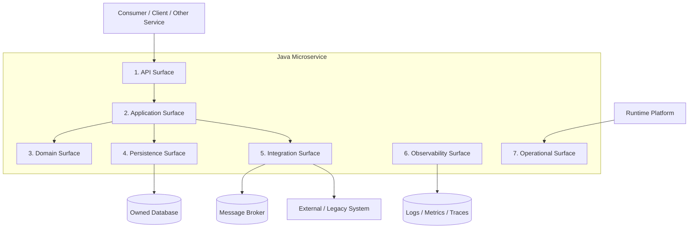
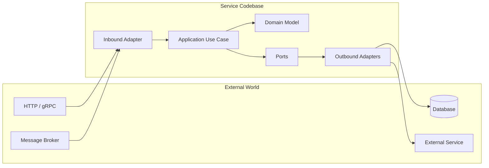
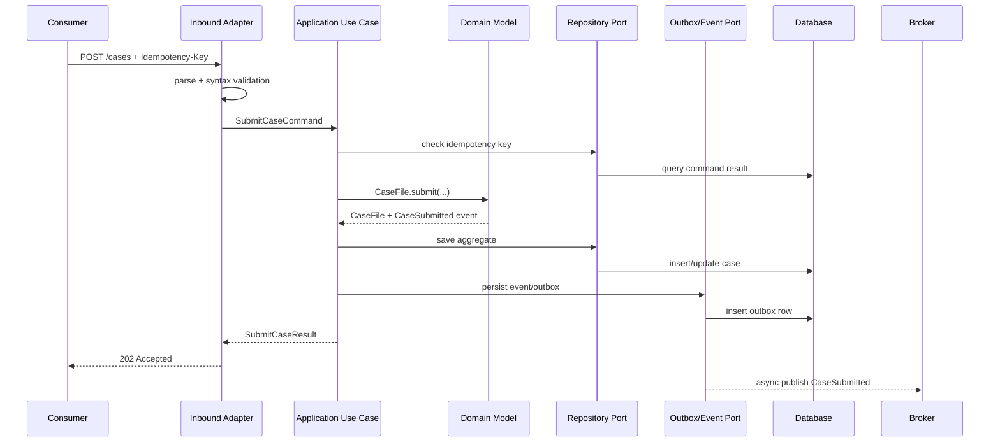
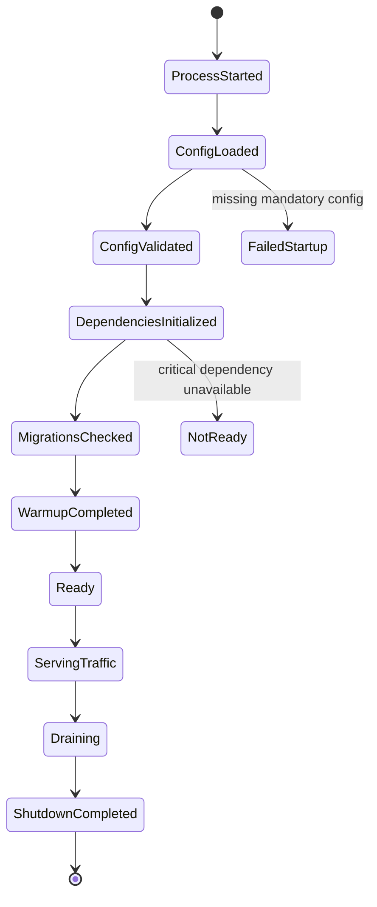
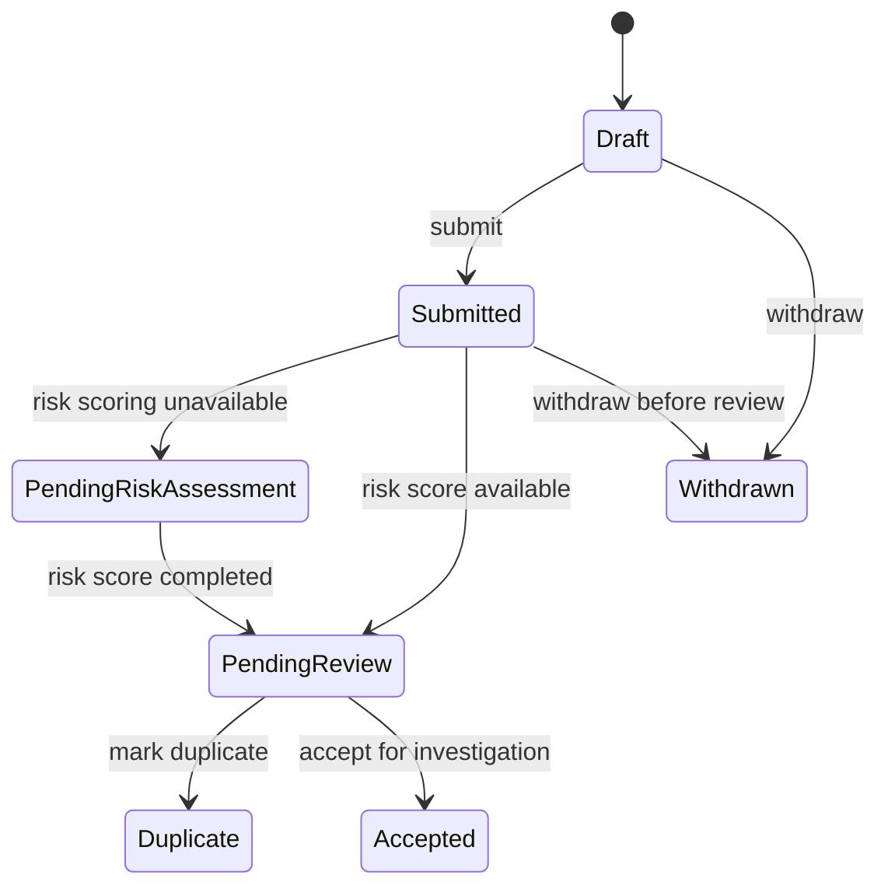

# Part 015 — Anatomy of a Java Microservice

Microservice yang production-grade bukan sekadar aplikasi Java kecil dengan REST controller.

Microservice adalah **unit bisnis, unit ownership, unit deployment, unit observability, unit failure, dan unit perubahan**. Kalau kita hanya melihatnya sebagai folder `controller-service-repository`, kita akan melewatkan hal terpenting: service harus bisa hidup, gagal, dioperasikan, berevolusi, dan dipertanggungjawabkan sebagai bagian dari sistem terdistribusi.

Part ini menjawab satu pertanyaan praktis:

> Kalau kita harus membangun satu Java microservice yang benar-benar siap masuk enterprise production, bentuk internal dan kontraknya seperti apa?

Kita tidak akan mengulang detail Spring Security, authorization, data contract, testing, Maven, Kubernetes, atau observability dari nol. Bagian ini hanya akan menghubungkan hal-hal itu ke **anatomi service**.

---

## 1. Target Mental Model

Setelah part ini, kita ingin punya model yang tajam:

1. Microservice bukan hanya codebase.
2. Struktur package harus memperlihatkan boundary, bukan sekadar layer teknis.
3. Framework harus menjadi runtime shell, bukan pusat domain.
4. Setiap service punya beberapa surface: API, domain, persistence, integration, observability, operation, dan ownership.
5. Desain internal service harus membuat dependency direction, invariant, transaction boundary, dan failure mode terlihat.
6. Production readiness harus menjadi bagian dari desain sejak awal, bukan task DevOps di akhir sprint.

Kalimat sederhananya:

> Microservice yang baik adalah program kecil yang menjalankan satu business capability secara mandiri, dengan kontrak eksternal jelas, state ownership jelas, failure behavior jelas, dan operasi harian yang bisa dipahami tanpa membaca semua source code.

---

## 2. Anatomi Besar: Service sebagai 7 Surface

Jangan mulai dari package. Mulai dari surface.

Satu service production-grade minimal punya tujuh surface berikut.



Penjelasan ringkas:

| Surface | Pertanyaan desain |
|---|---|
| API surface | Bagaimana consumer berinteraksi dengan service? |
| Application surface | Use case apa yang service jalankan? |
| Domain surface | Invariant bisnis apa yang dijaga? |
| Persistence surface | State apa yang dimiliki service? |
| Integration surface | Dependency keluar apa yang dipanggil/dipublish? |
| Observability surface | Bagaimana perilaku service terlihat dari luar? |
| Operational surface | Bagaimana service dijalankan, dihentikan, diskalakan, dan dipulihkan? |

Kesalahan umum engineer menengah adalah hanya mendesain tiga surface pertama: controller, service, repository. Engineer senior harus melihat semua surface, karena failure production hampir selalu muncul dari surface yang diabaikan: timeout, readiness palsu, metric tidak cukup, config salah, dependency downstream lambat, atau ownership state kabur.

---

## 3. Service Anatomy Bukan Struktur Folder Saja

Struktur folder hanya representasi. Yang lebih penting adalah aturan di baliknya.

Service harus punya beberapa boundary internal:



Aturan dependency yang sehat:

```text
inbound adapter  -> application -> domain
application      -> port interface
outbound adapter -> port interface
framework        -> adapter/application wiring
```

Yang tidak sehat:

```text
domain -> spring annotation everywhere
domain -> database entity
domain -> HTTP DTO
domain -> Kafka record
domain -> external API model
```

Bukan berarti domain tidak boleh pakai annotation sama sekali. Tetapi jika domain hanya bisa dipahami setelah memahami framework, persistence, transport, dan serialization, maka domain sudah tidak lagi menjadi pusat bisnis. Ia hanya menjadi bentuk lain dari DTO.

---

## 4. Minimum Production-Grade Service Skeleton

Berikut struktur yang bisa dipakai sebagai starting point. Ini bukan template mutlak, tetapi menunjukkan dependency direction dan ownership.

```text
case-intake-service/
  src/main/java/com/acme/enforcement/caseintake/
    CaseIntakeApplication.java

    api/
      http/
        CaseIntakeController.java
        CaseIntakeRequest.java
        CaseIntakeResponse.java
        ApiExceptionHandler.java
      messaging/
        EvidenceReceivedConsumer.java
        PartyRiskChangedConsumer.java

    application/
      command/
        SubmitCaseCommand.java
        SubmitCaseHandler.java
        AttachEvidenceCommand.java
        AttachEvidenceHandler.java
      query/
        GetCaseSummaryQuery.java
        GetCaseSummaryHandler.java
      workflow/
        CaseIntakeProcessService.java
      policy/
        IntakeEligibilityPolicy.java
      port/
        CaseRepository.java
        CaseNumberGenerator.java
        RiskScoringClient.java
        DomainEventPublisher.java
        ClockProvider.java

    domain/
      model/
        CaseFile.java
        CaseStatus.java
        Allegation.java
        EvidenceReference.java
        PartyReference.java
      event/
        CaseSubmitted.java
        EvidenceAttached.java
      exception/
        InvalidCaseTransition.java
        DuplicateCaseSubmission.java
      value/
        CaseId.java
        CaseNumber.java
        OfficerId.java

    infrastructure/
      persistence/
        JpaCaseRepositoryAdapter.java
        CaseJpaEntity.java
        CaseJpaMapper.java
      client/
        HttpRiskScoringClient.java
        RiskScoringClientProperties.java
      messaging/
        KafkaDomainEventPublisher.java
        CaseEventEnvelope.java
      time/
        SystemClockProvider.java
      config/
        CaseIntakeProperties.java

    observability/
      CaseIntakeMetrics.java
      CaseIntakeTraceAttributes.java
      StructuredLogFields.java

    ops/
      CaseIntakeHealthIndicator.java
      CaseIntakeReadinessIndicator.java
```

Ada beberapa prinsip di sini:

1. `api` berisi inbound adapter, bukan business logic.
2. `application` berisi use case orchestration.
3. `domain` berisi invariant dan business state transition.
4. `infrastructure` berisi implementasi teknis port.
5. `observability` eksplisit, bukan sisipan logging acak.
6. `ops` eksplisit, karena service production harus bisa diperiksa runtime state-nya.

Untuk service kecil, struktur ini bisa terasa berat. Itu wajar. Jangan memakai struktur ini secara dogmatis. Yang penting bukan jumlah folder, tetapi **separation of responsibility**.

---

## 5. Rule: Framework Is a Shell, Not the Architecture

Dalam service Java modern, kita mungkin memakai Spring Boot, Quarkus, Micronaut, atau Jakarta EE runtime. Tetapi arsitektur service tidak boleh identik dengan framework.

Contoh salah:

```java
@RestController
@RequestMapping("/cases")
class CaseController {

    @Autowired
    private CaseRepository repository;

    @PostMapping
    @Transactional
    public CaseJpaEntity submit(@RequestBody CaseJpaEntity request) {
        request.setStatus("SUBMITTED");
        return repository.save(request);
    }
}
```

Masalahnya bukan hanya style.

Masalah strukturalnya:

1. API menerima entity persistence.
2. Controller memutuskan state bisnis.
3. Transaction boundary hidup di adapter layer tanpa use case jelas.
4. Tidak ada command intention.
5. Tidak ada invariant domain.
6. Tidak ada idempotency.
7. Tidak ada event yang menjelaskan perubahan bisnis.
8. Tidak ada separation antara transport error dan domain error.

Contoh yang lebih sehat:

```java
@RestController
@RequestMapping("/cases")
final class CaseIntakeController {

    private final SubmitCaseHandler submitCase;

    CaseIntakeController(SubmitCaseHandler submitCase) {
        this.submitCase = submitCase;
    }

    @PostMapping
    ResponseEntity<CaseIntakeResponse> submit(
            @RequestHeader("Idempotency-Key") String idempotencyKey,
            @RequestBody SubmitCaseRequest request
    ) {
        var command = new SubmitCaseCommand(
                request.reporterId(),
                request.subjectPartyId(),
                request.allegations(),
                idempotencyKey
        );

        var result = submitCase.handle(command);

        return ResponseEntity
                .accepted()
                .body(CaseIntakeResponse.from(result));
    }
}
```

Controller hanya menerjemahkan HTTP ke command. Use case ada di handler.

```java
public final class SubmitCaseHandler {

    private final CaseRepository cases;
    private final CaseNumberGenerator numbers;
    private final DomainEventPublisher events;
    private final ClockProvider clock;

    public SubmitCaseHandler(
            CaseRepository cases,
            CaseNumberGenerator numbers,
            DomainEventPublisher events,
            ClockProvider clock
    ) {
        this.cases = cases;
        this.numbers = numbers;
        this.events = events;
        this.clock = clock;
    }

    @Transactional
    public SubmitCaseResult handle(SubmitCaseCommand command) {
        if (cases.existsByIdempotencyKey(command.idempotencyKey())) {
            return cases.findResultByIdempotencyKey(command.idempotencyKey());
        }

        var caseFile = CaseFile.submit(
                CaseId.newId(),
                numbers.next(),
                command.reporterId(),
                command.subjectPartyId(),
                command.allegations(),
                clock.now()
        );

        cases.save(caseFile, command.idempotencyKey());
        events.publishAll(caseFile.releaseEvents());

        return SubmitCaseResult.from(caseFile);
    }
}
```

Domain menjaga invariant.

```java
public final class CaseFile {

    private final CaseId id;
    private final CaseNumber number;
    private CaseStatus status;
    private final List<Allegation> allegations;
    private final List<DomainEvent> events = new ArrayList<>();

    private CaseFile(
            CaseId id,
            CaseNumber number,
            CaseStatus status,
            List<Allegation> allegations
    ) {
        this.id = id;
        this.number = number;
        this.status = status;
        this.allegations = List.copyOf(allegations);
    }

    public static CaseFile submit(
            CaseId id,
            CaseNumber number,
            ReporterId reporterId,
            PartyId subjectPartyId,
            List<Allegation> allegations,
            Instant submittedAt
    ) {
        if (allegations == null || allegations.isEmpty()) {
            throw new CaseMustContainAtLeastOneAllegation();
        }

        var caseFile = new CaseFile(id, number, CaseStatus.SUBMITTED, allegations);
        caseFile.events.add(new CaseSubmitted(id, number, reporterId, subjectPartyId, submittedAt));
        return caseFile;
    }

    public List<DomainEvent> releaseEvents() {
        var copy = List.copyOf(events);
        events.clear();
        return copy;
    }
}
```

Perhatikan pola berpikirnya:

```text
HTTP request -> command -> use case -> domain transition -> persistence -> event -> response
```

Bukan:

```text
HTTP request -> entity -> repository.save()
```

---

## 6. Inbound Adapter: Menerima Dunia Luar Tanpa Membiarkan Dunia Luar Masuk

Inbound adapter adalah tempat service menerima interaksi. Bentuknya bisa:

1. REST controller.
2. gRPC endpoint.
3. message consumer.
4. scheduled job.
5. CLI command.
6. batch trigger.
7. workflow activity endpoint.

Inbound adapter punya tugas sempit:

1. Parse transport input.
2. Validate syntax-level input.
3. Build command/query.
4. Call application use case.
5. Translate result/error ke transport response.

Inbound adapter **tidak boleh**:

1. Memutuskan business transition kompleks.
2. Mengakses repository langsung untuk mutation utama.
3. Membentuk domain object dari persistence entity.
4. Menentukan retry terhadap downstream dependency tanpa koordinasi application policy.
5. Publish event domain tanpa use case.

Contoh request validation yang baik:

```java
public record SubmitCaseRequest(
        @NotBlank String reporterId,
        @NotBlank String subjectPartyId,
        @NotEmpty List<AllegationRequest> allegations
) {
}
```

Ini syntax validation. Tetapi rule seperti “case tidak boleh diajukan jika party sedang under sealed investigation” bukan syntax validation. Itu policy/domain rule dan harus hidup di application/domain layer.

---

## 7. Application Layer: Use Case, Transaction, dan Coordination Boundary

Application layer menjawab:

> Untuk menjalankan satu user/business intention, apa saja langkah yang harus dikoordinasikan?

Application layer biasanya berisi:

1. Command handler.
2. Query handler.
3. Use case service.
4. Process coordinator.
5. Policy orchestration.
6. Transaction boundary.
7. Port interface.

Contoh command handler:

```java
public interface CommandHandler<C, R> {
    R handle(C command);
}
```

Application layer bukan tempat menaruh semua business logic. Ia mengeksekusi alur. Domain tetap menjaga invariant.

Pemisahan yang baik:

| Concern | Lokasi |
|---|---|
| Parse HTTP request | inbound adapter |
| Validate JSON shape | inbound adapter |
| Check duplicate command | application |
| Load aggregate | application |
| Enforce aggregate invariant | domain |
| Start transaction | application |
| Save state | persistence adapter via port |
| Publish integration event | application via event port/outbox |
| Map domain error to HTTP 409 | inbound adapter exception handler |

Transaction boundary biasanya ada di application layer karena application layer tahu satu use case butuh atomicity seperti apa.

```java
@Transactional
public AssignCaseResult handle(AssignCaseCommand command) {
    var caseFile = cases.get(command.caseId());
    var officer = officers.get(command.officerId());

    caseFile.assignTo(officer, command.assignedBy(), clock.now());

    cases.save(caseFile);
    events.publishAll(caseFile.releaseEvents());

    return AssignCaseResult.from(caseFile);
}
```

Catatan penting: kalau event publish dilakukan langsung ke broker di dalam transaction database, kita membuka risiko database commit berhasil tetapi publish gagal. Nanti Part 035 akan membahas outbox/inbox. Di part ini cukup pahami bahwa event publishing adalah bagian dari service anatomy, bukan logging tambahan.

---

## 8. Domain Layer: Tempat Invariant Tinggal

Domain layer menjawab:

> Apa yang tidak boleh dilanggar oleh service ini, apa pun transport, database, dan framework-nya?

Invariant contoh:

1. Case tidak boleh masuk `UNDER_REVIEW` sebelum minimal satu allegation valid.
2. Case tidak boleh di-close jika ada mandatory review task yang belum selesai.
3. Escalation hanya bisa dilakukan dari status tertentu.
4. Evidence sealed tidak boleh terlihat oleh role tertentu.
5. Decision final tidak boleh diubah tanpa reopening process.

Domain layer tidak harus selalu kaya. Untuk service yang hanya integration adapter, domain bisa tipis. Tetapi untuk core business capability, domain yang terlalu tipis akan membuat business rule tersebar di controller, mapper, SQL, dan workflow script.

Contoh state transition:

```java
public void escalate(OfficerId requestedBy, EscalationReason reason, Instant at) {
    if (!status.canEscalate()) {
        throw new InvalidCaseTransition(id, status, CaseAction.ESCALATE);
    }

    if (reason == null || reason.isBlank()) {
        throw new EscalationRequiresReason(id);
    }

    this.status = CaseStatus.ESCALATED;
    this.events.add(new CaseEscalated(id, requestedBy, reason, at));
}
```

Di sini domain tidak peduli apakah command datang dari REST, Kafka, atau workflow engine. Itu indikator sehat.

---

## 9. Port Interface: Kontrak Internal ke Dunia Teknis

Port adalah interface yang dibutuhkan application/domain untuk berinteraksi dengan dunia luar.

```java
public interface CaseRepository {
    Optional<CaseFile> findById(CaseId id);
    CaseFile get(CaseId id);
    void save(CaseFile caseFile);
    boolean existsByIdempotencyKey(String key);
    SubmitCaseResult findResultByIdempotencyKey(String key);
}
```

Port harus ditulis dalam bahasa domain/application, bukan bahasa vendor.

Buruk:

```java
public interface CaseRepository {
    JpaRepository<CaseJpaEntity, UUID> delegate();
}
```

Lebih baik:

```java
public interface CaseRepository {
    CaseFile get(CaseId id);
    void save(CaseFile caseFile);
}
```

Port bukan abstraksi palsu untuk semua hal. Jangan membuat port untuk `StringUtils`, `LocalDate`, atau operasi trivial. Port bernilai jika:

1. Mengisolasi dependency eksternal.
2. Membuat testing seam.
3. Mengubah bahasa teknis menjadi bahasa domain.
4. Melindungi service dari vendor/runtime detail.
5. Mengontrol failure behavior.

---

## 10. Outbound Adapter: Semua Dependency Keluar Harus Dapat Dikendalikan

Outbound adapter bisa berupa:

1. Database adapter.
2. HTTP client adapter.
3. Kafka publisher.
4. S3/object storage client.
5. Email/SMS client.
6. Policy engine adapter.
7. Legacy system adapter.

Outbound adapter bukan hanya “client wrapper”. Ia harus mengontrol:

1. Timeout.
2. Retry eligibility.
3. Error translation.
4. Circuit breaker integration.
5. Observability tags.
6. Payload mapping.
7. Authentication context.
8. Idempotency/correlation header.

Contoh adapter client:

```java
public final class HttpRiskScoringClient implements RiskScoringClient {

    private final WebClient client;
    private final RiskScoringClientProperties properties;

    public HttpRiskScoringClient(WebClient client, RiskScoringClientProperties properties) {
        this.client = client;
        this.properties = properties;
    }

    @Override
    public RiskScore score(PartyId partyId, CaseType caseType) {
        try {
            return client.post()
                    .uri("/risk-score")
                    .header("X-Correlation-Id", Correlation.current())
                    .bodyValue(new RiskScoreRequest(partyId.value(), caseType.name()))
                    .retrieve()
                    .bodyToMono(RiskScoreResponse.class)
                    .timeout(properties.requestTimeout())
                    .map(RiskScoreResponse::toDomain)
                    .block();
        } catch (TimeoutException ex) {
            throw new RiskScoringUnavailable("Risk scoring timed out", ex);
        } catch (WebClientResponseException.TooManyRequests ex) {
            throw new RiskScoringOverloaded("Risk scoring overloaded", ex);
        }
    }
}
```

Hal penting: adapter menerjemahkan error teknis menjadi error yang application bisa pahami. Application layer tidak perlu tahu detail HTTP 429, socket timeout, atau JSON parse exception.

---

## 11. Persistence Surface: Database Bukan Detail Kecil

Dalam microservices, database adalah bagian dari boundary. Service owns its data. Artinya:

1. Schema dimiliki service.
2. Write model dimiliki service.
3. Migration dimiliki service.
4. Data invariant dijaga service.
5. Service lain tidak membaca tabel langsung.

Persistence adapter harus memetakan domain model ke persistence model. Untuk service kecil, entity dan domain kadang bisa sama. Tetapi default enterprise-grade yang lebih aman adalah memisahkan:

```text
Domain object != JPA entity != API DTO != event payload
```

Mengapa?

Karena masing-masing berubah karena alasan berbeda:

| Model | Berubah karena |
|---|---|
| Domain object | business invariant berubah |
| JPA entity | schema/index/query berubah |
| API DTO | consumer contract berubah |
| Event payload | integration contract berubah |

Contoh mapper persistence:

```java
final class CaseJpaMapper {

    CaseJpaEntity toEntity(CaseFile caseFile) {
        var entity = new CaseJpaEntity();
        entity.setId(caseFile.id().value());
        entity.setCaseNumber(caseFile.number().value());
        entity.setStatus(caseFile.status().name());
        entity.setVersion(caseFile.version());
        return entity;
    }

    CaseFile toDomain(CaseJpaEntity entity) {
        return CaseFile.rehydrate(
                new CaseId(entity.getId()),
                new CaseNumber(entity.getCaseNumber()),
                CaseStatus.valueOf(entity.getStatus()),
                entity.getVersion()
        );
    }
}
```

Kalau mapping terasa berat, cek apakah domain terlalu anemia atau schema terlalu bocor ke domain. Mapping itu biaya. Tetapi dalam sistem yang berubah lama, biaya mapping sering lebih murah daripada coupling jangka panjang.

---

## 12. API Surface: Contract yang Tidak Membocorkan Internal Model

API surface harus menyatakan intention consumer, bukan internal table.

Buruk:

```http
POST /case-table
PUT /case-table/{id}
PATCH /case-table/{id}/status
```

Lebih baik:

```http
POST /cases
POST /cases/{caseId}/assignment
POST /cases/{caseId}/escalation
POST /cases/{caseId}/closure-request
GET  /cases/{caseId}/summary
```

API bukan database CRUD remote. API harus memperlihatkan capability.

Response error juga kontrak:

```json
{
  "type": "https://acme.example/problems/invalid-case-transition",
  "title": "Invalid case transition",
  "status": 409,
  "detail": "Case CASE-2026-00091 cannot move from CLOSED to UNDER_REVIEW.",
  "instance": "/cases/CASE-2026-00091/escalation",
  "correlationId": "01JZ7S7CZ0Q2ZJABZV6MSW6C7M"
}
```

Mapping error:

| Domain/Application Error | HTTP |
|---|---:|
| Validation syntax invalid | 400 |
| Authentication missing | 401 |
| Authorization denied | 403 |
| Resource not found | 404 |
| State transition conflict | 409 |
| Idempotency key conflict | 409 |
| Downstream dependency unavailable | 503 |
| Internal unexpected error | 500 |

Jangan mengembalikan `500` untuk business conflict. Itu membuat consumer dan operator salah memahami masalah.

---

## 13. Observability Surface: Service Harus Bisa Bicara Saat Sakit

Service production-grade harus menjawab pertanyaan operator:

1. Apakah service menerima traffic?
2. Endpoint mana lambat?
3. Dependency mana gagal?
4. Apakah queue menumpuk?
5. Apakah database saturated?
6. Apakah error berasal dari input, dependency, atau bug?
7. Tenant/consumer mana yang terkena dampak?
8. Apakah deployment baru menyebabkan regresi?

Minimal telemetry:

```text
Logs:
  - structured JSON logs
  - correlationId
  - traceId/spanId
  - command name
  - domain key where safe
  - error classification

Metrics:
  - request rate
  - error rate
  - latency percentiles
  - dependency latency
  - dependency error rate
  - queue lag/depth
  - JVM memory/GC/thread metrics
  - business counters

Traces:
  - inbound span
  - database span
  - outbound HTTP/gRPC span
  - message publish/consume span
  - workflow/activity span
```

Contoh structured logging field:

```java
public final class StructuredLogFields {
    public static final String CORRELATION_ID = "correlation_id";
    public static final String CASE_ID = "case_id";
    public static final String COMMAND = "command";
    public static final String FAILURE_CLASS = "failure_class";
    public static final String DEPENDENCY = "dependency";

    private StructuredLogFields() {
    }
}
```

Log buruk:

```text
failed to submit case
```

Log lebih berguna:

```json
{
  "level": "WARN",
  "message": "case submission rejected by domain rule",
  "correlation_id": "01JZ7S7CZ0Q2ZJABZV6MSW6C7M",
  "command": "SubmitCase",
  "case_id": "CASE-2026-00091",
  "failure_class": "DOMAIN_CONFLICT",
  "rule": "CASE_MUST_CONTAIN_ALLEGATION"
}
```

Hati-hati: observability tidak boleh melanggar privacy. Domain key boleh membantu debugging, tetapi PII dan sensitive evidence harus direduksi atau di-redact.

---

## 14. Operational Surface: Runtime Contract Service

Operational surface menjawab:

1. Bagaimana platform tahu service siap menerima traffic?
2. Bagaimana service shutdown tanpa merusak in-flight request?
3. Bagaimana service menyatakan dependency critical sedang down?
4. Bagaimana config invalid dideteksi sebelum traffic masuk?
5. Bagaimana deployment aman dilakukan?
6. Bagaimana operator menemukan version, build, commit, dan feature flag state?

Minimal operational endpoints:

```text
/health/live      -> process masih hidup
/health/ready     -> siap menerima traffic
/metrics          -> metrics endpoint
/info             -> build/service metadata
```

Dalam Spring Boot, production-ready features seperti health, metrics, auditing, dan management endpoint biasanya disediakan melalui Actuator. Dalam platform lain, konsepnya sama: service harus menyediakan sinyal runtime yang bisa dibaca platform dan operator.

Readiness harus jujur. Jangan tandai ready jika:

1. Migration wajib belum selesai.
2. Config mandatory invalid.
3. Connection pool critical tidak bisa dibuat.
4. Cache warm-up wajib belum selesai.
5. Message consumer belum siap tetapi service sudah menerima command yang bergantung pada event.

Tetapi readiness juga tidak boleh terlalu sensitif. Jika readiness memanggil semua downstream dependency secara agresif, dependency kecil bisa membuat seluruh service dikeluarkan dari load balancer walaupun masih bisa melayani sebagian fungsi.

Prinsipnya:

```text
liveness  = should the process be restarted?
readiness = should this instance receive traffic now?
health    = what is the observed operational state?
```

---

## 15. Configuration Surface: Config adalah Runtime Contract

Config bukan tempat menaruh string acak. Config menentukan perilaku runtime.

Contoh config production-grade:

```yaml
case-intake:
  submission:
    max-allegations-per-case: 50
    duplicate-window: PT24H
  risk-scoring:
    base-url: https://risk-scoring.internal
    request-timeout: PT750MS
    retry:
      max-attempts: 2
      backoff: PT100MS
  events:
    topic: enforcement.case-events.v1
    publish-timeout: PT500MS
```

Config harus:

1. Typed.
2. Validated at startup.
3. Have safe defaults only when safe.
4. Fail fast for mandatory missing values.
5. Visible in sanitized operational diagnostics.
6. Versioned when it changes behavior.

Contoh typed properties:

```java
@ConfigurationProperties(prefix = "case-intake.risk-scoring")
@Validated
public record RiskScoringClientProperties(
        @NotBlank String baseUrl,
        @NotNull Duration requestTimeout,
        Retry retry
) {
    public record Retry(
            @Min(0) int maxAttempts,
            @NotNull Duration backoff
    ) {}
}
```

Smell: config yang mengubah business rule besar tanpa audit atau approval. Untuk regulatory domain, beberapa config adalah policy dan harus punya governance, bukan sekadar environment variable.

---

## 16. Request Lifecycle dalam Service yang Sehat

Mari lihat lifecycle request dari awal sampai akhir.



Beberapa keputusan penting tampak di diagram:

1. Idempotency dicek sebelum mutation.
2. Domain transition terjadi sebelum persistence.
3. Event tidak langsung menjadi side effect tak terkendali.
4. API response tidak menunggu semua downstream selesai jika prosesnya long-running.
5. Boundary antara synchronous command dan asynchronous propagation jelas.

---

## 17. Command vs Query Anatomy

Dalam microservice, command dan query punya sifat berbeda.

Command:

1. Mengubah state.
2. Perlu idempotency.
3. Punya transaction boundary.
4. Menghasilkan event atau state transition.
5. Harus punya audit trail.
6. Failure bisa meninggalkan partial progress jika keluar service boundary.

Query:

1. Membaca state.
2. Harus eksplisit soal freshness/staleness.
3. Bisa memakai read model.
4. Biasanya butuh pagination/filtering.
5. Failure tidak boleh mengubah state.

Contoh command:

```java
public record EscalateCaseCommand(
        CaseId caseId,
        OfficerId requestedBy,
        EscalationReason reason,
        String idempotencyKey
) {}
```

Contoh query:

```java
public record SearchCasesQuery(
        Optional<CaseStatus> status,
        Optional<OfficerId> assignedOfficer,
        PageRequest page
) {}
```

Jangan campur mutation dalam query handler. Query yang “sekalian update last viewed” terdengar praktis, tetapi membuat behavior sulit diprediksi dan bisa merusak cache, audit, serta retry safety.

---

## 18. Error Taxonomy Internal Service

Production-grade service butuh error taxonomy, bukan sekadar exception random.

```text
ServiceException
  DomainException
    InvalidTransition
    InvariantViolation
    DuplicateBusinessAction
  ApplicationException
    IdempotencyConflict
    PolicyDecisionUnavailable
    CommandRejected
  DependencyException
    DependencyTimeout
    DependencyOverloaded
    DependencyInvalidResponse
  InfrastructureException
    PersistenceFailure
    MessagePublishFailure
    ConfigInvalid
```

Mapping ke transport harus eksplisit.

```java
@RestControllerAdvice
final class ApiExceptionHandler {

    @ExceptionHandler(InvalidCaseTransition.class)
    ResponseEntity<ProblemDetail> handleInvalidTransition(InvalidCaseTransition ex) {
        var problem = ProblemDetail.forStatus(HttpStatus.CONFLICT);
        problem.setTitle("Invalid case transition");
        problem.setDetail(ex.getMessage());
        problem.setProperty("failureClass", "DOMAIN_CONFLICT");
        problem.setProperty("correlationId", Correlation.current());
        return ResponseEntity.status(HttpStatus.CONFLICT).body(problem);
    }
}
```

Tujuan taxonomy:

1. Consumer tahu apakah boleh retry.
2. Operator tahu apakah ini bug, dependency, overload, atau input problem.
3. Alert bisa dipilah.
4. Dashboard bisa membaca failure class.
5. Incident review punya data yang bisa dianalisis.

---

## 19. Owned State dan Transaction Boundary

Service harus tahu state mana yang benar-benar ia miliki.

Untuk `case-intake-service`:

Owned state:

1. Case intake draft.
2. Intake submission record.
3. Duplicate submission marker.
4. Outbox event for intake.

Not owned:

1. Party master data.
2. Officer roster.
3. Evidence binary content.
4. Risk score model.
5. Final enforcement decision.

Service boleh menyimpan reference atau snapshot untuk kebutuhan historis, tetapi tidak boleh berpura-pura menjadi owner dari data tersebut.

Contoh:

```java
public record PartyReference(
        PartyId partyId,
        String displayNameSnapshot,
        Instant snapshotAt
) {}
```

`displayNameSnapshot` bukan sumber kebenaran terbaru. Ia adalah snapshot untuk audit/context. Naming harus jujur agar developer masa depan tidak salah pakai.

---

## 20. Service Startup Anatomy

Startup bukan hanya `main()`.

Startup production-grade melewati beberapa fase:



Apa yang harus fail fast?

1. Mandatory config missing.
2. Invalid credential format.
3. Invalid topic/table name.
4. Required schema migration incompatible.
5. Port binding failure.
6. Invalid feature flag combination.

Apa yang tidak selalu harus fail startup?

1. Optional downstream service unavailable.
2. Non-critical cache unavailable.
3. Analytics sink temporarily down.
4. Degraded-mode dependency unavailable.

Perbedaan ini harus dinyatakan dalam design, bukan dibiarkan sebagai kebetulan startup framework.

---

## 21. Graceful Shutdown Anatomy

Shutdown juga bagian dari correctness.

Saat instance menerima signal shutdown:

1. Stop menerima traffic baru.
2. Mark readiness false.
3. Drain in-flight request.
4. Stop polling message baru.
5. Finish atau safely checkpoint current message.
6. Flush telemetry.
7. Close connection pool.
8. Exit dalam termination grace period.

Jika service punya message consumer, shutdown yang buruk bisa menyebabkan:

1. Duplicate processing.
2. Event commit sebelum DB commit.
3. Lost progress.
4. Lock tidak dilepas.
5. Consumer group rebalance storm.

Pola yang sehat:

```text
SIGTERM
  -> readiness=false
  -> stop inbound HTTP acceptance
  -> pause message consumer
  -> complete current unit of work
  -> commit offset only after durable write
  -> close resources
  -> exit
```

---

## 22. Internal Modularity di Dalam Satu Service

Microservice bukan alasan untuk menulis spaghetti kecil.

Untuk service yang tumbuh, internal modularity penting:

```text
caseintake/
  submission/
    api/
    application/
    domain/
    infrastructure/
  assignment/
    api/
    application/
    domain/
    infrastructure/
  escalation/
    api/
    application/
    domain/
    infrastructure/
  shared/
    value/
    observability/
```

Tetapi hati-hati dengan `shared`. Folder `shared` sering menjadi tempat semua coupling bersembunyi.

Rule:

1. Shared value object boleh jika benar-benar stabil.
2. Shared utility harus minimal.
3. Shared domain service harus dicurigai.
4. Shared DTO antar feature hampir selalu smell.
5. Shared mapper sering menjadi coupling magnet.

Kalau satu service punya banyak subdomain internal yang berubah secara independen, mungkin service terlalu besar. Tetapi jangan langsung split. Pertama jadikan modular monolith kecil di dalam service, lalu ukur volatility dan ownership.

---

## 23. Build Artifact dan Runtime Metadata

Service artifact harus bisa menjawab:

1. Service apa ini?
2. Version berapa?
3. Commit apa?
4. Dibangun kapan?
5. Config profile apa?
6. Feature flag apa aktif?
7. Schema version apa yang didukung?
8. API version apa yang diekspos?

Minimal metadata:

```json
{
  "service": "case-intake-service",
  "version": "1.18.3",
  "commit": "8fd2a71",
  "buildTime": "2026-07-05T09:10:00Z",
  "runtime": "java-21",
  "contractVersion": "case-intake-api-v3",
  "schemaCompatibility": "2026.07"
}
```

Ini bukan hiasan. Saat incident, metadata mempercepat jawaban: “instance mana yang menjalankan versi bermasalah?”

---

## 24. Security Hooks Tanpa Mengulang Materi Security

Walaupun security dibahas di bagian lain, anatomy service harus menyiapkan hook:

1. Principal/current actor propagation.
2. Authorization check location.
3. Tenant context validation.
4. Audit event capture.
5. Sensitive data redaction.
6. Secure outbound call identity.

Contoh actor context:

```java
public record ActorContext(
        ActorId actorId,
        Set<String> roles,
        Optional<TenantId> tenantId,
        String correlationId
) {}
```

Jangan mengakses security context framework dari domain object. Application layer boleh menerima `ActorContext`, lalu domain menerima data yang relevan untuk rule.

Buruk:

```java
SecurityContextHolder.getContext().getAuthentication()
```

di dalam domain object.

Lebih baik:

```java
caseFile.close(actor.actorId(), closeReason, clock.now());
```

---

## 25. Anatomy of a Service Design Document

Sebelum coding, satu service production-grade seharusnya punya design document singkat.

Template:

```md
# Service: Case Intake Service

## Purpose
Owns intake lifecycle for regulatory cases before formal investigation starts.

## Business Capability
Case intake, duplicate detection, initial allegation capture.

## Owned Data
- case_intake
- intake_submission
- intake_outbox

## Not Owned Data
- party master data
- final enforcement decision
- evidence binary content

## APIs
- POST /cases
- GET /cases/{id}/summary
- POST /cases/{id}/evidence-references

## Events Published
- CaseSubmitted.v1
- EvidenceReferenceAttached.v1

## Events Consumed
- PartyRiskChanged.v1

## Critical Dependencies
- party-service
- risk-scoring-service
- PostgreSQL
- Kafka

## Consistency Model
- local ACID for intake state
- eventual propagation through outbox events
- duplicate detection within 24h window

## Failure Behavior
- risk scoring unavailable: accept submission as pending risk assessment
- database unavailable: reject command with 503
- event broker unavailable: persist outbox, retry publishing

## SLO
- POST /cases p95 < 400ms excluding downstream degraded mode
- availability 99.9% monthly

## Operational Notes
- readiness requires DB connectivity and migration compatibility
- Kafka outage does not fail readiness if outbox can persist
```

Design document bukan bureaucracy. Ia adalah cara memastikan service punya identity sebelum menjadi code.

---

## 26. Common Smells

### Smell 1 — Controller Does Everything

Gejala:

1. Controller panjang.
2. Banyak repository call.
3. Banyak `if status == ...`.
4. Banyak try-catch dependency.
5. Test controller menjadi test semua rule.

Diagnosis: application/domain layer tidak ada atau tidak dipercaya.

---

### Smell 2 — Entity as Universal Model

Gejala:

1. JPA entity dipakai sebagai request body.
2. Entity dipublish sebagai Kafka event.
3. Entity dipakai sebagai domain object.
4. Schema change memecahkan API.

Diagnosis: internal model bocor ke semua surface.

---

### Smell 3 — Service Has No Owned Decision

Gejala:

1. Service hanya pass-through.
2. Semua rule ada di downstream.
3. Tidak ada state/invariant.
4. Tidak jelas kenapa service berdiri sendiri.

Diagnosis: service mungkin hanya technical proxy. Gabungkan ke edge/BFF/integration layer atau ubah purpose-nya.

---

### Smell 4 — Repository Called from Everywhere

Gejala:

1. Repository dipakai controller, scheduler, consumer, helper, mapper.
2. Mutation terjadi di banyak tempat.
3. Transaction boundary tidak konsisten.

Diagnosis: use case boundary hilang.

---

### Smell 5 — Readiness Lies

Gejala:

1. `/ready` selalu 200.
2. Service menerima traffic walau DB migration gagal.
3. Deployment sukses tetapi request pertama gagal.

Diagnosis: operational surface hanya formalitas.

---

### Smell 6 — Event Is Just Database Row Dump

Gejala:

1. Event bernama `CaseUpdated` berisi seluruh row.
2. Consumer harus diff sendiri.
3. Tidak jelas business meaning.

Diagnosis: event tidak merepresentasikan domain occurrence.

---

### Smell 7 — Business Logic in Mapper

Gejala:

1. Mapper mengubah status.
2. Mapper memutuskan default policy.
3. Mapper memfilter field berdasarkan role.

Diagnosis: mapper menjadi hidden application/domain layer.

---

## 27. Practical Build Sequence

Kalau membangun service baru, jangan mulai dari database table. Ikuti urutan ini:

```text
1. Define capability and owner
2. Define commands and queries
3. Define state lifecycle
4. Define invariants
5. Define owned data
6. Define API contract
7. Define events published/consumed
8. Define application use cases
9. Define ports
10. Implement domain model
11. Implement adapters
12. Add observability
13. Add operational endpoints
14. Add config validation
15. Add deployment/runtime metadata
16. Add runbook notes
```

Dalam praktik, langkah ini iteratif. Tetapi urutan mentalnya penting. Jika mulai dari table, biasanya service menjadi CRUD wrapper. Jika mulai dari capability dan lifecycle, service lebih mungkin memiliki boundary yang sehat.

---

## 28. Case Study Mini: Case Intake Service

Misalkan kita membangun `case-intake-service`.

### Capability

Menerima laporan awal, melakukan validasi minimal, mencegah duplikasi submission, membuat case intake record, dan memulai assessment awal.

### Commands

| Command | Meaning |
|---|---|
| SubmitCase | Reporter mengajukan case baru |
| AttachEvidenceReference | Menambahkan referensi evidence |
| WithdrawSubmission | Reporter menarik submission sebelum review |
| MarkDuplicate | Intake officer menandai sebagai duplicate |

### Queries

| Query | Meaning |
|---|---|
| GetCaseIntakeSummary | Melihat ringkasan intake |
| SearchPendingIntakes | Melihat intake yang menunggu review |
| GetSubmissionHistory | Melihat riwayat submission |

### Events

| Event | Meaning |
|---|---|
| CaseSubmitted | Case intake berhasil dibuat |
| EvidenceReferenceAttached | Evidence reference ditambahkan |
| CaseMarkedDuplicate | Submission dinyatakan duplicate |
| IntakeWithdrawn | Submission ditarik |

### Owned state

| Table | Purpose |
|---|---|
| case_intake | aggregate state |
| case_intake_submission | idempotency and submission metadata |
| case_intake_evidence_ref | evidence references only |
| outbox_event | event publishing durability |

### Critical design decision

Risk scoring unavailable tidak boleh selalu menggagalkan submission. Untuk domain enforcement, lebih baik menerima submission sebagai `PENDING_RISK_ASSESSMENT` daripada kehilangan laporan. Ini bukan keputusan teknis; ini keputusan bisnis dan operasional.



---

## 29. Architecture Review Checklist

Gunakan checklist ini untuk membaca satu Java microservice.

### Purpose

- [ ] Service punya business capability yang jelas.
- [ ] Service bukan sekadar wrapper table.
- [ ] Owner team jelas.
- [ ] Consumer utama jelas.

### Boundary

- [ ] Owned data jelas.
- [ ] Non-owned data jelas.
- [ ] Tidak ada shared database write.
- [ ] External model tidak bocor ke domain.

### Internal Architecture

- [ ] Inbound adapter tipis.
- [ ] Use case boundary eksplisit.
- [ ] Domain invariant tidak tersebar.
- [ ] Ports memakai bahasa domain/application.
- [ ] Outbound adapter mengontrol timeout/error translation.

### API

- [ ] API task/capability-oriented.
- [ ] Error response konsisten.
- [ ] Idempotency untuk command penting.
- [ ] Versioning/compatibility strategy ada.

### Data and Consistency

- [ ] Transaction boundary jelas.
- [ ] Event publishing strategy jelas.
- [ ] Duplicate handling jelas.
- [ ] Read model staleness dijelaskan jika ada.

### Reliability

- [ ] Timeout ada untuk outbound call.
- [ ] Retry tidak sembarangan.
- [ ] Graceful degradation didefinisikan.
- [ ] Shutdown behavior aman.

### Observability

- [ ] Structured logs punya correlation ID.
- [ ] Metrics mencakup RED/dependency/business signal.
- [ ] Trace propagation aktif.
- [ ] Failure taxonomy terlihat di telemetry.

### Operations

- [ ] Liveness/readiness benar.
- [ ] Config tervalidasi.
- [ ] Runtime metadata tersedia.
- [ ] Runbook minimal ada.

---

## 30. Latihan

Ambil satu service di sistemmu. Jawab tanpa membuka code terlebih dahulu:

1. Service ini capability apa?
2. State apa yang benar-benar ia miliki?
3. Command apa yang mengubah state?
4. Query apa yang hanya membaca state?
5. Event apa yang dipublish?
6. Dependency mana yang critical?
7. Apa failure mode paling berbahaya?
8. Apa invariant domain paling penting?
9. Apa yang terjadi jika downstream utama timeout?
10. Bagaimana operator tahu service ini sehat?

Setelah itu baru buka code. Jika jawaban mentalmu tidak cocok dengan struktur code, berarti service architecture belum cukup ekspresif.

---

## 31. Ringkasan

Anatomi Java microservice production-grade tidak berhenti di `Controller`, `Service`, dan `Repository`.

Model yang lebih kuat:

```text
Microservice = capability owner
             + deployment unit
             + state owner
             + contract provider
             + runtime participant
             + observable object
             + operational responsibility
```

Struktur internal yang sehat membuat hal-hal berikut terlihat:

1. Inbound adapter menerima dunia luar tanpa membocorkan transport ke domain.
2. Application layer menjalankan use case dan transaction boundary.
3. Domain layer menjaga invariant.
4. Ports mengungkap dependency yang dibutuhkan use case.
5. Outbound adapters mengendalikan dependency teknis.
6. Persistence surface menjaga owned state.
7. Observability surface membuat behavior bisa dibaca.
8. Operational surface membuat service bisa hidup aman di platform.

Part berikutnya akan membahas pilihan platform: **Spring Boot vs Jakarta EE vs MicroProfile vs Quarkus vs Micronaut**. Fokusnya bukan “mana yang paling bagus”, tetapi “framework mana cocok untuk constraint arsitektur tertentu”.

---

## References

- Spring Boot Reference Documentation — Production-ready Features: https://docs.spring.io/spring-boot/reference/actuator/index.html
- Spring Boot Reference Documentation — Actuator: https://docs.spring.io/spring-boot/reference/actuator/enabling.html
- Jakarta EE Specifications: https://jakarta.ee/specifications/
- MicroProfile: https://microprofile.io/
