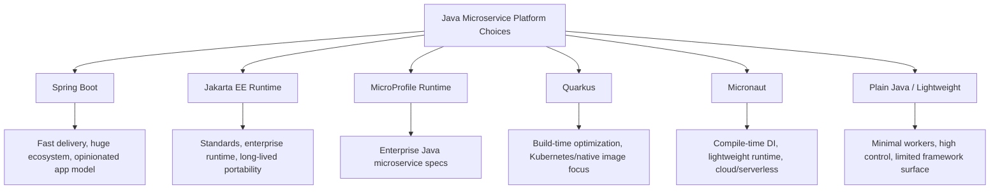
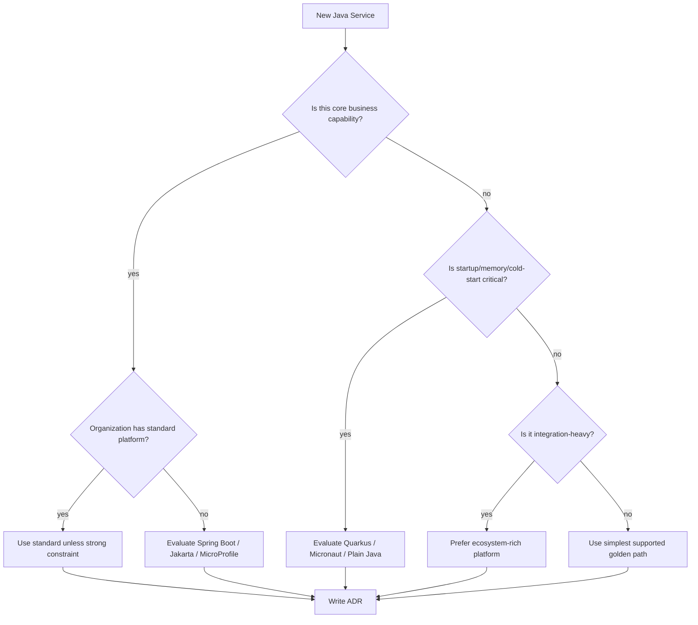

# Part 016 — Spring Boot vs Jakarta EE vs MicroProfile

Framework decision bukan agama. Ini keputusan arsitektur.

Pertanyaan yang benar bukan:

> Spring Boot atau Jakarta EE, mana yang terbaik?

Pertanyaan yang lebih matang:

> Untuk service ini, dengan team ini, runtime ini, latency/cost/startup constraint ini, governance ini, dan ecosystem dependency ini, platform Java mana yang memberi delivery speed terbaik tanpa menghancurkan operability jangka panjang?

Part ini membahas Spring Boot, Jakarta EE, MicroProfile, Quarkus, Micronaut, dan plain Java sebagai pilihan platform microservices. Kita tidak akan membahas tutorial hello world. Fokusnya adalah **decision model**.

---

## 1. Prinsip Utama: Framework adalah Keputusan Portfolio

Dalam enterprise microservices, framework tidak hanya dipilih per service. Ia menjadi keputusan portfolio.

Framework memengaruhi:

1. Cara dependency injection bekerja.
2. Cara endpoint diekspos.
3. Cara config divalidasi.
4. Cara telemetry dikumpulkan.
5. Cara security diintegrasikan.
6. Cara container image dibuat.
7. Cara startup dan memory behavior bekerja.
8. Cara testing dilakukan.
9. Cara upgrade dilakukan.
10. Cara engineer baru onboarding.
11. Cara platform team membuat golden path.

Framework yang bagus untuk satu team bisa menjadi beban untuk organisasi jika:

1. Tidak ada engineer yang bisa mengoperasikannya.
2. Observability tidak standar.
3. Security integration berbeda sendiri.
4. Library internal tidak kompatibel.
5. Deployment pipeline butuh pengecualian khusus.
6. Upgrade lifecycle tidak jelas.

Jadi framework decision harus membaca dua layer:

```text
service-level fit + organization-level fit
```

---

## 2. Evaluation Dimensions

Gunakan dimensi berikut sebelum memilih platform.

| Dimension | Pertanyaan |
|---|---|
| Developer velocity | Seberapa cepat team bisa membangun dan merawat service? |
| Ecosystem maturity | Library, examples, integrations, community, support? |
| Standards alignment | Apakah API mengikuti standard Jakarta/MicroProfile atau framework-specific? |
| Runtime footprint | Startup time, memory, CPU, native image support? |
| Operational surface | Health, metrics, tracing, config, graceful shutdown? |
| Cloud-native fit | Container, Kubernetes, serverless, buildpack, native image? |
| Testing model | Unit/integration/contract test support? |
| Governance | Mudah dibuat golden path, policy, dependency baseline? |
| Upgrade path | Seberapa stabil major upgrade dan compatibility story? |
| Team fluency | Seberapa familiar engineer dan operator? |
| Vendor/runtime portability | Bisa pindah runtime/vendor atau lock-in acceptable? |
| Failure behavior | Timeout, retry, fault tolerance, backpressure support? |

Framework selection yang buruk biasanya terjadi karena hanya memakai satu dimensi:

1. “Startup paling cepat.”
2. “Community paling besar.”
3. “Standard paling murni.”
4. “Yang dipakai perusahaan besar.”
5. “Yang paling baru.”

Arsitektur production butuh multi-dimensional trade-off.

---

## 3. Big Picture Landscape



Tidak semua service dalam portfolio harus memakai framework yang sama. Tetapi semakin banyak variasi, semakin besar platform cost.

Prinsip praktis:

```text
Default should be standardized.
Exceptions should be justified.
Experiments should be contained.
```

---

## 4. Spring Boot: The Pragmatic Default for Many Teams

Spring Boot sering menjadi default Java microservices karena ekosistemnya sangat besar, developer familiarity tinggi, dan integrasi production cukup matang.

### 4.1 Kekuatan Spring Boot

Spring Boot kuat ketika service membutuhkan:

1. Delivery cepat.
2. REST API umum.
3. Integrasi database, messaging, security, validation, scheduling.
4. Banyak library dan starter.
5. Production-ready operational endpoints.
6. Cloud-native deployment dengan buildpack/container.
7. Observability integration yang mudah.
8. Team dengan pengalaman Spring.

Spring Boot Actuator menyediakan fitur production-ready seperti monitoring/management endpoint, health, metrics, auditing, dan observability-related features. Ini membuat Spring Boot cocok sebagai golden path untuk banyak organisasi karena operational surface bisa distandardisasi sejak awal.

### 4.2 Cost Spring Boot

Spring Boot juga punya cost:

1. Banyak magic dan auto-configuration bisa menyembunyikan behavior.
2. Classpath-driven behavior kadang sulit diprediksi.
3. Startup/memory bisa lebih berat untuk function/serverless tertentu.
4. Annotation bisa menyebar ke domain jika discipline buruk.
5. Upgrade major version bisa berdampak besar jika dependency ecosystem luas.
6. Developer bisa terlalu cepat membuat service tanpa desain boundary.

Spring Boot tidak otomatis membuat microservice bagus. Ia mempercepat pembuatan aplikasi. Boundary, ownership, consistency, dan failure behavior tetap harus didesain.

### 4.3 Spring Boot Fit

Spring Boot biasanya cocok untuk:

| Situation | Fit |
|---|---|
| Enterprise API service | Sangat cocok |
| CRUD-ish but governed service | Cocok |
| Domain-heavy service | Cocok jika domain tidak bocor ke framework |
| Event-driven service | Cocok dengan discipline outbox/inbox |
| Internal platform standard | Sangat cocok |
| Startup-time-critical serverless | Perlu evaluasi |
| Extremely small memory footprint | Perlu evaluasi |
| Native image first | Bisa, tetapi perlu discipline |

### 4.4 Spring Boot Architecture Rule

Gunakan Spring Boot sebagai composition root dan adapter shell.

```text
Spring Boot owns wiring.
Application layer owns use case.
Domain layer owns invariant.
Infrastructure owns technical integrations.
```

Buruk:

```java
@Entity
@RestController
@Service
public class CaseFile { ... }
```

Lebih sehat:

```text
@RestController -> command handler -> domain object -> repository port -> JPA adapter
```

### 4.5 Spring Boot Service Template Baseline

Minimal enterprise baseline:

```text
spring-boot-starter-web or webflux
spring-boot-starter-validation
spring-boot-starter-actuator
micrometer tracing/metrics integration
problem detail error response
configuration properties validation
structured logging
resilience library integration
OpenAPI generation/checking
migration tool integration
container image build strategy
```

Golden path harus menyediakan baseline ini agar setiap team tidak mengulang keputusan operasional.

---

## 5. Jakarta EE: Standards-Oriented Enterprise Java

Jakarta EE adalah keluarga specification untuk enterprise Java. Ia bukan satu framework tunggal, tetapi standard yang diimplementasikan runtime seperti GlassFish, Open Liberty, WildFly, Payara, dan lainnya.

Jakarta EE 11 memperbarui platform enterprise Java modern, termasuk dukungan Java 21 dan pembaruan berbagai specification. Jakarta EE juga memiliki profile seperti Platform, Web Profile, dan Core Profile. Core Profile ditargetkan untuk runtime yang lebih kecil dan lebih sesuai untuk cloud-native/microservice-style runtime.

### 5.1 Kekuatan Jakarta EE

Jakarta EE kuat ketika organisasi mengutamakan:

1. Standards portability.
2. Vendor/runtime choice.
3. Long-lived enterprise applications.
4. Governance formal.
5. Existing Jakarta EE/Jakarta namespace skill.
6. Stable API contracts across runtimes.
7. App-server-style operational maturity.

Contoh API Jakarta:

```java
@Path("/cases")
@ApplicationScoped
public class CaseResource {

    private final SubmitCaseHandler submitCase;

    @Inject
    public CaseResource(SubmitCaseHandler submitCase) {
        this.submitCase = submitCase;
    }

    @POST
    public Response submit(SubmitCaseRequest request) {
        var result = submitCase.handle(request.toCommand());
        return Response.accepted(CaseIntakeResponse.from(result)).build();
    }
}
```

### 5.2 Cost Jakarta EE

Cost yang perlu dihitung:

1. Developer experience bisa berbeda antar runtime.
2. Ecosystem tidak selalu seopinionated Spring Boot.
3. Beberapa integrasi modern butuh library/runtime-specific extension.
4. Team yang terbiasa Spring mungkin perlu adaptation.
5. App server mental model bisa membawa kebiasaan lama jika tidak dikontrol.

Jakarta EE bukan “legacy” hanya karena ia berasal dari enterprise Java. Tetapi penggunaan Jakarta EE bisa menjadi legacy jika service masih memakai pola shared app server, shared database, big deployment unit, dan release lockstep.

### 5.3 Jakarta EE Fit

| Situation | Fit |
|---|---|
| Standards-heavy enterprise | Cocok |
| Long-lived regulated system | Cocok |
| Runtime portability required | Cocok |
| Existing app server investment | Cocok dengan modernization discipline |
| Ultra-fast startup/serverless | Perlu evaluasi runtime |
| Team mostly Spring Boot | Perlu training |
| Need opinionated batteries-included ecosystem | Bervariasi |

### 5.4 Core Profile Significance

Core Profile penting karena microservices tidak selalu butuh full enterprise platform. Ia memberi subset yang lebih kecil seperti CDI, RESTful Web Services, JSON Processing/Binding, dan related specs. Dengan ini, Jakarta EE bisa dipakai dalam runtime yang lebih ringan, bukan hanya model app server besar.

Architecture takeaway:

> Jakarta EE modern bisa relevan untuk microservices jika dipakai sebagai standard runtime boundary, bukan sebagai alasan kembali ke centralized deployment monolith.

---

## 6. MicroProfile: Enterprise Java Specs for Microservices

MicroProfile adalah kumpulan specification untuk membangun microservices dengan enterprise Java style. MicroProfile 7.1 dirilis pada Juni 2025 dan memperbarui MicroProfile Telemetry serta MicroProfile OpenAPI. Komponen MicroProfile mencakup area seperti Config, Fault Tolerance, Rest Client, OpenAPI, Health, Telemetry, dan JWT Authentication.

### 6.1 Apa yang Diberikan MicroProfile

MicroProfile menjawab kebutuhan microservices yang dulu tidak sepenuhnya dicakup oleh Java EE klasik:

1. Externalized configuration.
2. Health checks.
3. Fault tolerance.
4. Type-safe REST client.
5. OpenAPI documentation.
6. Telemetry/tracing/logging/metrics direction.
7. JWT authentication integration.

Contoh MicroProfile style:

```java
@RegisterRestClient(configKey = "risk-scoring")
public interface RiskScoringRestClient {

    @POST
    @Path("/risk-score")
    RiskScoreResponse score(RiskScoreRequest request);
}
```

Fault tolerance style:

```java
@ApplicationScoped
public class RiskScoringAdapter implements RiskScoringClient {

    @Inject
    @RestClient
    RiskScoringRestClient client;

    @Override
    @Timeout(750)
    @Retry(maxRetries = 1, delay = 100)
    @CircuitBreaker(requestVolumeThreshold = 20, failureRatio = 0.5)
    public RiskScore score(PartyId partyId, CaseType caseType) {
        return client.score(new RiskScoreRequest(partyId.value(), caseType.name())).toDomain();
    }
}
```

Catatan penting: annotation fault tolerance bukan pengganti design. Tetap harus tahu command mana retry-safe, timeout budget berapa, dan fallback apa yang benar secara bisnis.

### 6.2 Kekuatan MicroProfile

MicroProfile cocok jika:

1. Organisasi ingin standard microservice API.
2. Jakarta EE skill sudah kuat.
3. Runtime portability penting.
4. Service butuh health/config/fault tolerance/openapi/rest client secara standard.
5. Platform team ingin API yang tidak terlalu vendor-specific.

### 6.3 Cost MicroProfile

1. Implementasi detail bisa berbeda antar runtime.
2. Ecosystem lebih kecil dibanding Spring Boot.
3. Developer harus memahami spec dan runtime behavior.
4. Dokumentasi/tutorial sering runtime-specific.
5. Tidak semua organisasi punya skill MicroProfile.

### 6.4 MicroProfile Fit

| Situation | Fit |
|---|---|
| Enterprise Java microservices | Cocok |
| Standards-first architecture | Sangat cocok |
| Runtime portability | Cocok |
| Spring-heavy organization | Perlu justifikasi |
| Highly opinionated rapid delivery | Bervariasi |
| Platform team wants spec baseline | Cocok |

---

## 7. Quarkus: Build-Time Optimized, Kubernetes-Native Java

Quarkus memposisikan dirinya sebagai framework Java untuk cloud-native/Kubernetes workloads, dengan build-time optimization, fast startup, memory efficiency, dan dukungan GraalVM/native image. Quarkus juga mendukung model imperative dan reactive, serta banyak extension berbasis library Java populer.

### 7.1 Kekuatan Quarkus

Quarkus kuat ketika service membutuhkan:

1. Startup cepat.
2. Memory footprint lebih kecil.
3. Container/Kubernetes native workflow.
4. Native image option.
5. Developer productivity dengan dev mode.
6. MicroProfile/Jakarta-style APIs dengan runtime modern.
7. Reactive core jika diperlukan.

Quarkus cocok untuk service yang banyak scale-to-zero, serverless-ish, high density container, atau environment di mana startup/memory cost penting.

### 7.2 Cost Quarkus

1. Build-time augmentation mengubah beberapa asumsi runtime Java klasik.
2. Native image butuh perhatian terhadap reflection, dynamic proxies, resource loading.
3. Extension ecosystem harus dicek untuk dependency spesifik.
4. Team Spring Boot perlu learning curve.
5. Debugging native image/performance issue bisa lebih khusus.

### 7.3 Quarkus Fit

| Situation | Fit |
|---|---|
| Kubernetes/container-first service | Sangat cocok |
| Native image target | Sangat cocok |
| Serverless/scale-to-zero-ish | Cocok |
| MicroProfile-style service | Cocok |
| Heavy Spring ecosystem dependency | Perlu evaluasi |
| Runtime reflection-heavy library | Perlu evaluasi native compatibility |
| Organization Spring Boot standard | Perlu exception rationale |

### 7.4 Quarkus Architecture Rule

Jangan pilih Quarkus hanya karena cepat startup. Pilih jika startup/memory/build-time optimization benar-benar menjadi constraint.

Contoh justified decision:

```text
We choose Quarkus for notification-worker because it scales from zero in bursty workloads, has low steady memory cost, integrates with Kubernetes deployment model, and the service has limited reflection-heavy dependencies.
```

Contoh weak decision:

```text
We choose Quarkus because it is newer and faster.
```

---

## 8. Micronaut: Compile-Time DI and Lightweight Cloud-Native Runtime

Micronaut adalah JVM-based full-stack toolkit untuk microservices dan serverless applications. Salah satu karakter pentingnya adalah compile-time dependency injection/AOT-oriented design yang mengurangi kebutuhan runtime reflection dibanding framework yang lebih dynamic.

### 8.1 Kekuatan Micronaut

Micronaut cocok ketika:

1. Service butuh lightweight runtime.
2. Startup dan memory penting.
3. Compile-time DI lebih disukai.
4. Native image/GraalVM menjadi target.
5. Cloud/serverless workload dominan.
6. Team ingin framework modern tapi tidak terlalu Spring-heavy.

Contoh controller style:

```java
@Controller("/cases")
public class CaseController {

    private final SubmitCaseHandler submitCase;

    public CaseController(SubmitCaseHandler submitCase) {
        this.submitCase = submitCase;
    }

    @Post
    HttpResponse<CaseIntakeResponse> submit(@Body SubmitCaseRequest request) {
        var result = submitCase.handle(request.toCommand());
        return HttpResponse.accepted(CaseIntakeResponse.from(result));
    }
}
```

### 8.2 Cost Micronaut

1. Ecosystem lebih kecil dari Spring Boot.
2. Team familiarity mungkin lebih rendah.
3. Library integration perlu dicek.
4. Platform team mungkin perlu membangun lebih banyak standard sendiri.
5. Hiring/onboarding bisa lebih sulit di organisasi Spring-heavy.

### 8.3 Micronaut Fit

| Situation | Fit |
|---|---|
| Lightweight API service | Cocok |
| Serverless/JVM function style | Cocok |
| Native image target | Cocok |
| Compile-time DI preference | Sangat cocok |
| Huge Spring ecosystem requirement | Perlu evaluasi |
| Existing Micronaut skill | Sangat cocok |
| Organization-wide default | Tergantung maturity platform |

---

## 9. Plain Java / Lightweight Service

Tidak semua microservice butuh full framework.

Plain Java atau lightweight library cocok untuk:

1. Worker kecil.
2. CLI/batch job.
3. Stream processor yang framework-nya sudah disediakan platform.
4. Very specialized high-performance component.
5. Library-like service embedded dalam runtime khusus.

Tetapi jangan meremehkan missing platform surface.

Jika tanpa framework, kamu tetap harus menyediakan:

1. Config loading and validation.
2. Logging standard.
3. Metrics.
4. Health/readiness.
5. Dependency lifecycle.
6. Graceful shutdown.
7. HTTP/gRPC/message handling.
8. Error taxonomy.
9. Security integration.
10. Testing harness.

Frameworkless bukan berarti architectureless.

---

## 10. Decision Matrix

Gunakan matrix awal berikut.

| Constraint | Spring Boot | Jakarta EE | MicroProfile | Quarkus | Micronaut | Plain Java |
|---|---:|---:|---:|---:|---:|---:|
| Fast enterprise delivery | 5 | 3 | 3 | 4 | 4 | 2 |
| Ecosystem breadth | 5 | 3 | 3 | 4 | 3 | 1 |
| Standards portability | 3 | 5 | 5 | 4 | 3 | 2 |
| Low startup/memory | 3 | 3 | 3 | 5 | 5 | 5 |
| Native image readiness | 3 | 3 | 3 | 5 | 5 | 4 |
| Team familiarity mainstream | 5 | 3 | 3 | 3 | 2 | 4 |
| Golden path maturity | 5 | 3 | 3 | 4 | 3 | 1 |
| Minimal abstraction | 2 | 3 | 3 | 3 | 4 | 5 |
| Microservice specs | 3 | 3 | 5 | 4 | 3 | 1 |
| Operational batteries included | 5 | 3 | 4 | 4 | 4 | 1 |

Score ini bukan kebenaran universal. Gunakan sebagai conversation starter. Bobotkan sesuai context.

Contoh weighted scoring:

```text
notification-worker:
  startup/memory: weight 5
  ecosystem breadth: weight 2
  team familiarity: weight 3
  native image: weight 4
  operational batteries: weight 3

case-management-core-api:
  domain complexity: weight 5
  ecosystem breadth: weight 5
  team familiarity: weight 5
  operational batteries: weight 5
  startup/memory: weight 2
```

Hasil dua service bisa berbeda.

---

## 11. Service Type to Framework Fit

### 11.1 Core Business API Service

Contoh: `case-management-service`, `decision-service`, `order-service`.

Biasanya membutuhkan:

1. Domain model.
2. Database transaction.
3. API contract.
4. Observability.
5. Security integration.
6. Team maintainability.

Fit umum:

```text
Spring Boot      -> strong default
Jakarta EE       -> strong if standards/runtime governance matters
MicroProfile     -> strong if enterprise Java spec baseline preferred
Quarkus          -> good if runtime efficiency/Kubernetes constraint matters
Micronaut        -> good if lightweight/runtime efficiency matters
Plain Java       -> rarely justified
```

### 11.2 Edge/BFF Service

Contoh: `mobile-bff`, `officer-portal-bff`.

Membutuhkan:

1. API composition.
2. Security context handling.
3. Response shaping.
4. Caching.
5. High traffic fan-out control.

Fit:

```text
Spring Boot/WebFlux -> strong
Quarkus reactive    -> strong if reactive model desired
Micronaut           -> good
Jakarta/MicroProfile -> possible, depends ecosystem
```

### 11.3 Event Worker

Contoh: `case-event-projector`, `notification-worker`.

Membutuhkan:

1. Message consumption.
2. Idempotency.
3. Checkpoint/offset discipline.
4. Graceful shutdown.
5. Low footprint sometimes.

Fit:

```text
Quarkus/Micronaut -> strong if footprint/startup matters
Spring Boot       -> strong if ecosystem/golden path matters
Plain Java        -> possible if small and platform provides scaffolding
```

### 11.4 Integration Adapter

Contoh: adapter ke legacy enforcement database.

Membutuhkan:

1. ACL.
2. Protocol mapping.
3. Error translation.
4. Retry/timeout.
5. Observability.

Fit:

```text
Spring Boot       -> strong due integration ecosystem
MicroProfile      -> strong if standards desired
Quarkus/Micronaut -> good if dependencies compatible
```

### 11.5 Serverless Function

Membutuhkan:

1. Fast cold start.
2. Low memory.
3. Minimal runtime cost.
4. Event trigger integration.

Fit:

```text
Quarkus native / Micronaut native -> strong
Plain Java                        -> possible
Spring Boot                       -> evaluate carefully
```

---

## 12. Architecture Decision Flow



ADR harus menjawab:

```md
## Decision
Use Spring Boot 3.x for case-intake-service.

## Context
- Core business API service
- Team has high Spring fluency
- Needs database, REST, validation, actuator, observability integration
- Startup time is not a primary constraint
- Organization has Spring Boot golden path

## Alternatives
- Quarkus: better startup/memory, but team/platform maturity lower
- Jakarta EE/MicroProfile: standards benefit, but ecosystem/golden path less mature internally
- Micronaut: good lightweight option, but not portfolio default

## Consequences
- Faster delivery and standardized operations
- Must enforce architecture rule to prevent Spring annotations leaking into domain
- Future native image optimization is not first-class goal
```

---

## 13. Standardization vs Polyglot Framework Portfolio

A mature organization may allow multiple Java frameworks. But it must avoid uncontrolled sprawl.

### 13.1 Standardization Benefits

1. Common operational model.
2. Shared libraries.
3. Easier onboarding.
4. Simpler security baseline.
5. Unified observability.
6. Lower support burden.
7. Easier dependency upgrade campaigns.

### 13.2 Standardization Risks

1. One framework forced into bad fit.
2. Innovation blocked.
3. Runtime cost ignored.
4. Serverless/high-density workloads penalized.
5. Teams build awkward workarounds.

### 13.3 Controlled Diversity Model

A good model:

```text
Tier 1: Default supported platform
  - Spring Boot golden path

Tier 2: Approved specialized platforms
  - Quarkus for native/container-density workloads
  - Micronaut for lightweight/serverless workloads
  - MicroProfile runtime for standards-first teams

Tier 3: Experimental
  - Requires architecture review
  - Limited blast radius
  - Exit criteria defined
```

Framework governance should not say “no” by default. It should say:

> Show the constraint that the default cannot satisfy, and show how you will operate the exception.

---

## 14. Framework Choice and Architecture Boundaries

No framework removes the need for architecture boundaries.

### 14.1 Spring Boot Boundary Risk

Risk: annotation-driven convenience spreads everywhere.

Control:

```text
- Domain module has no Spring dependency.
- Application use cases depend on ports.
- Controllers are thin.
- JPA entities stay in infrastructure.
```

### 14.2 Jakarta/MicroProfile Boundary Risk

Risk: spec annotations become architecture instead of adapter shell.

Control:

```text
- JAX-RS resources stay in api layer.
- CDI wiring does not replace use case design.
- Fault tolerance annotations reflect explicit retry/deadline policy.
```

### 14.3 Quarkus/Micronaut Boundary Risk

Risk: performance/runtime goal overshadows domain clarity.

Control:

```text
- Native image constraints documented.
- Reflection-heavy libraries reviewed.
- Domain model remains framework-light.
- Build-time behavior included in troubleshooting guide.
```

### 14.4 Plain Java Boundary Risk

Risk: every team reinvents platform features inconsistently.

Control:

```text
- Use platform-provided libraries.
- Define health/config/logging/metrics baseline.
- Keep service scope narrow.
```

---

## 15. Operational Baseline Comparison

| Capability | Spring Boot | Jakarta EE | MicroProfile | Quarkus | Micronaut | Plain Java |
|---|---|---|---|---|---|---|
| Health endpoint | Actuator | Runtime/spec dependent | MP Health | Built-in/extensions | Built-in/modules | Build yourself |
| Metrics | Micrometer/Actuator | Runtime-specific | MP Telemetry/metrics ecosystem | Micrometer/MP | Micrometer modules | Build yourself |
| Tracing | Micrometer/OpenTelemetry | Runtime-specific | MP Telemetry | OpenTelemetry support | OpenTelemetry support | Build yourself |
| Config | Spring config | Jakarta/runtime config | MP Config | Config support | Config support | Build yourself |
| Fault tolerance | Resilience4j/etc | Runtime/library | MP Fault Tolerance | Extension/support | Libraries/modules | Build yourself |
| OpenAPI | springdoc/etc | Jakarta/runtime | MP OpenAPI | Extension | Modules | Build yourself |
| Native image | Supported with constraints | Runtime-dependent | Runtime-dependent | Strong focus | Strong focus | Possible |

Matrix ini bukan untuk menghafal. Gunakan untuk mencari missing production surface. Banyak incident terjadi bukan karena framework salah, tetapi karena operational baseline tidak distandardisasi.

---

## 16. Upgrade and Lifecycle Strategy

Framework selection harus memasukkan lifecycle.

Tanyakan:

1. Seberapa sering major version keluar?
2. Siapa yang memantau CVE?
3. Bagaimana dependency baseline dipaksa?
4. Apakah ada BOM/platform dependency management?
5. Apakah internal starter/archetype harus ikut upgrade?
6. Bagaimana testing compatibility dilakukan?
7. Apakah service bisa upgrade independen?
8. Apakah runtime/deployment image ikut berubah?

Upgrade smell:

```text
We cannot upgrade because every service customized its own framework stack.
```

Golden path harus menyediakan:

1. Parent/BOM baseline.
2. Security patch cadence.
3. Starter/service template.
4. Compatibility test suite.
5. Migration guide.
6. Deprecation policy.
7. Observability regression check.

---

## 17. Library and Ecosystem Compatibility

Framework choice juga dipengaruhi oleh library:

1. Database access: JPA, JDBC, jOOQ, MyBatis, Hibernate Reactive.
2. Messaging: Kafka, RabbitMQ, Pulsar, JMS.
3. HTTP client: JDK HttpClient, Apache, OkHttp, WebClient, REST Client.
4. Serialization: Jackson, JSON-B, Protobuf.
5. Validation: Jakarta Validation.
6. Observability: Micrometer, OpenTelemetry.
7. Resilience: Resilience4j, MicroProfile Fault Tolerance.
8. Security: OAuth2/OIDC, JWT, mTLS, service mesh.
9. Native image: reflection/resource/proxy compatibility.

Decision rule:

```text
If the service depends on a critical library that the framework does not support well, the framework is not a good fit for that service, regardless of benchmark numbers.
```

---

## 18. Performance Decision: Jangan Tertipu Benchmark Mentah

Benchmark startup/memory penting, tetapi tidak cukup.

Pertanyaan yang lebih baik:

1. Service ini long-running atau bursty?
2. Apakah cold start user-visible?
3. Apakah memory cost membatasi node density?
4. Apakah bottleneck sebenarnya database/downstream?
5. Apakah latency p95 didominasi network call?
6. Apakah GC menjadi problem nyata?
7. Apakah native image mengurangi observability/debuggability?
8. Apakah team mampu troubleshoot runtime tersebut?

Untuk core API yang selalu warm dan bottleneck-nya database, framework startup mungkin tidak signifikan. Untuk serverless function dengan cold start ketat, startup sangat penting.

Jangan optimasi dimensi yang bukan bottleneck.

---

## 19. Example Portfolio Decision

Misalkan enterprise regulatory platform punya service berikut.

| Service | Type | Constraint | Recommended Default |
|---|---|---|---|
| case-intake-service | Core API | domain, transaction, audit | Spring Boot or Jakarta/MicroProfile |
| decision-service | Core API | rules, audit, explainability | Spring Boot or Jakarta/MicroProfile |
| notification-worker | Event worker | bursty, low memory | Quarkus or Micronaut |
| officer-portal-bff | BFF | fan-out, latency, security | Spring Boot WebFlux or Quarkus reactive |
| legacy-case-adapter | Integration | protocol mapping, reliability | Spring Boot or MicroProfile |
| evidence-thumbnail-function | Function | cold start, CPU burst | Quarkus native or Micronaut native |
| audit-query-service | Query/read model | high read throughput | Spring Boot, Quarkus, or Micronaut depending stack |

Portfolio answer is not one framework. Portfolio answer is controlled fit.

---

## 20. Framework Selection Anti-Patterns

### Anti-Pattern 1 — Resume-Driven Framework Choice

> “Kita pakai X karena engineer ingin belajar X.”

Belajar itu valid. Tetapi production platform bukan playground. Gunakan bounded experiment dengan blast radius kecil.

---

### Anti-Pattern 2 — Benchmark-Only Decision

> “X lebih cepat startup, jadi semua service pindah.”

Startup bukan satu-satunya quality attribute.

---

### Anti-Pattern 3 — Ecosystem-Only Decision

> “Spring Boot punya library paling banyak, jadi selalu Spring Boot.”

Bisa benar sebagai default, tetapi salah untuk serverless/native/high-density workloads tertentu.

---

### Anti-Pattern 4 — Standards Purism

> “Harus Jakarta/MicroProfile karena standard.”

Standards penting, tetapi delivery speed, hiring, debugging, and platform maturity juga penting.

---

### Anti-Pattern 5 — Framework as Architecture

> “Karena kita pakai Spring Boot, architecture-nya Spring MVC + JPA.”

Framework bukan architecture. Architecture adalah boundary, contract, ownership, failure behavior, dan evolution rule.

---

## 21. Recommended Decision Process

Gunakan proses berikut untuk service baru:

```text
1. Classify service type.
2. Identify runtime constraints.
3. Identify organizational default.
4. Identify critical dependencies.
5. Evaluate operational baseline.
6. Evaluate team fluency.
7. Run small production-like spike if needed.
8. Score options with explicit weights.
9. Write ADR.
10. Register service platform choice in service catalog.
```

Spike harus menguji hal production-like:

1. Startup and memory under container limit.
2. Health/readiness behavior.
3. Config validation.
4. Database/messaging integration.
5. Observability integration.
6. Native image build if relevant.
7. Graceful shutdown.
8. Test style.
9. CI/CD pipeline compatibility.

Jangan hanya membuat hello world endpoint.

---

## 22. Practical ADR Template

```md
# ADR: Java Platform for <service-name>

## Status
Proposed / Accepted / Superseded

## Context
- Service type:
- Business criticality:
- Runtime constraints:
- Team fluency:
- Organization default:
- Required integrations:
- Observability/security requirements:

## Options Considered
1. Spring Boot
2. Jakarta EE / MicroProfile runtime
3. Quarkus
4. Micronaut
5. Plain Java

## Decision
We choose <platform>.

## Rationale
- Reason 1
- Reason 2
- Reason 3

## Consequences
Positive:
- ...

Negative:
- ...

Mitigations:
- ...

## Fitness Functions
- Service exposes standard health/readiness endpoint.
- Service emits trace, metrics, structured logs.
- Service starts under <N> seconds in container limit.
- Service passes dependency baseline scan.
- Service keeps domain package free from framework annotations.
```

The last item is important: platform choice must not erase internal architecture discipline.

---

## 23. My Practical Recommendation

For most enterprise Java microservices organizations:

```text
Default: Spring Boot golden path
Approved specialized: Quarkus or Micronaut for footprint/cold-start/native-image constraints
Standards-first track: Jakarta EE + MicroProfile where portability/governance matters
Plain Java: only for narrow workers or platform-owned components
```

But the stronger recommendation is:

> Pick fewer frameworks than engineers want, but more than one if constraints genuinely differ.

A single framework can simplify operations. Too many frameworks create support chaos. But refusing all specialized runtime options can create unnecessary cost and poor fit.

---

## 24. Summary

Framework selection is an architecture decision because it affects delivery, operations, runtime behavior, dependency model, upgrade path, and team ownership.

Use this mental model:

```text
Framework fit = service constraint fit
              + team fluency
              + operational baseline
              + ecosystem compatibility
              + lifecycle governance
```

Spring Boot is often the pragmatic default because of ecosystem, developer familiarity, and production-ready operational features.

Jakarta EE is strong when standards, portability, and enterprise governance matter.

MicroProfile adds microservice-oriented specifications such as config, health, fault tolerance, REST client, OpenAPI, telemetry, and JWT authentication.

Quarkus is strong when build-time optimization, Kubernetes-native deployment, low memory, fast startup, and native image matter.

Micronaut is strong when compile-time DI, lightweight runtime, cloud/serverless fit, and native-image friendliness matter.

Plain Java is valid for narrow components, but you must build or import the operational baseline yourself.

The real top-tier skill is not memorizing framework features. It is matching service constraints to platform consequences and documenting that decision clearly.

---

## References

- Spring Boot Reference Documentation — Production-ready Features: https://docs.spring.io/spring-boot/reference/actuator/index.html
- Jakarta EE 11 Release: https://jakarta.ee/release/11/
- Jakarta EE Core Profile 11: https://jakarta.ee/specifications/coreprofile/11/
- Jakarta EE Specifications: https://jakarta.ee/specifications/
- MicroProfile 7.1: https://microprofile.io/
- MicroProfile 7.1 Release: https://microprofile.io/2025/06/17/microprofile-7-1-released/
- Quarkus: https://quarkus.io/
- Micronaut: https://micronaut.io/
