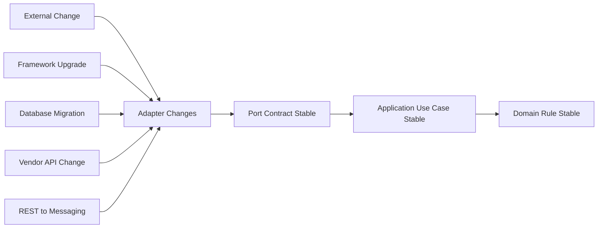
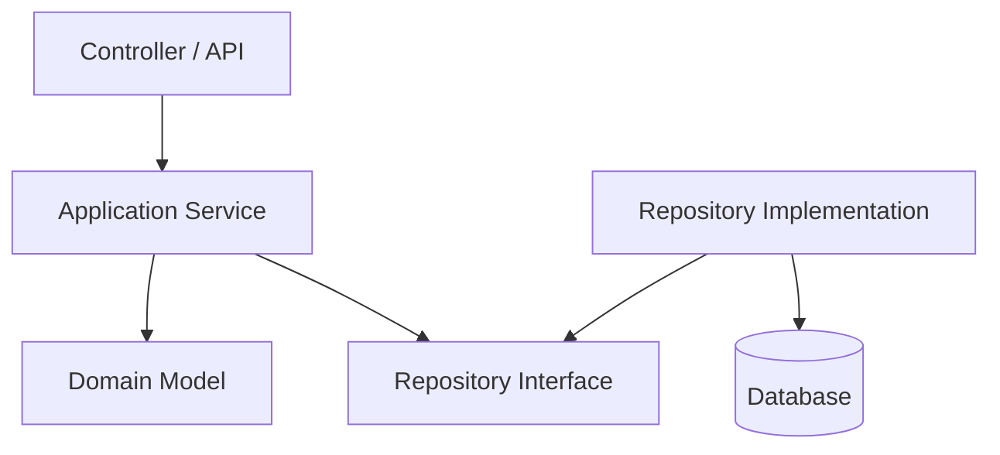
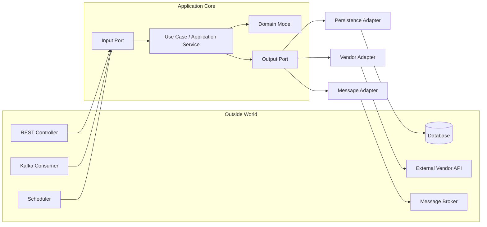
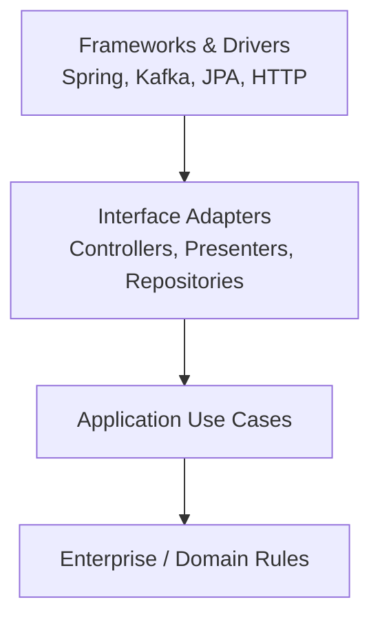
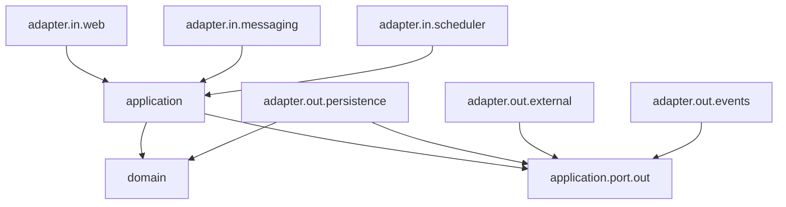
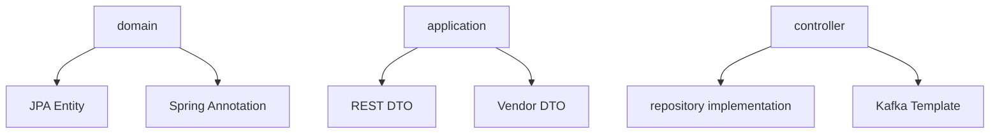
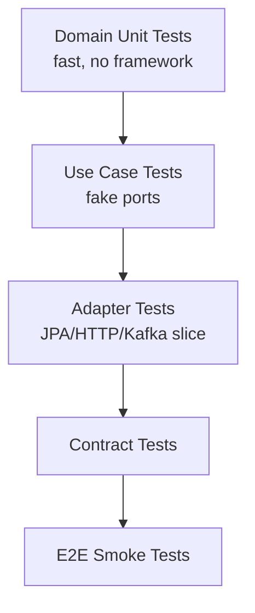

# Part 017 — Layering vs Hexagonal vs Clean Architecture

## 1. Core Problem

Banyak Java microservice terlihat rapi di awal:

```text
controller -> service -> repository
```

Tetapi setelah beberapa bulan, struktur itu sering berubah menjadi:

```text
controller -> service -> repository -> mapper -> http client -> kafka producer -> utility -> static context -> config -> more service
```

Lalu semua orang berkata, “ini layered architecture”. Padahal yang terjadi bukan architecture. Itu hanya folder convention.

Masalah utama bukan nama layer. Masalah utama adalah **arah dependency**.

Service yang sehat harus menjawab pertanyaan ini dengan tegas:

> Apakah business rule inti bisa hidup tanpa HTTP, database, Kafka, framework, vendor SDK, dan deployment platform?

Kalau jawabannya tidak, maka domain logic sedang ditarik keluar oleh teknologi. Akibatnya:

- business rule susah dites tanpa Spring context;
- perubahan database bocor ke use case;
- perubahan API eksternal merusak domain model;
- model bisnis menjadi DTO dengan validasi tipis;
- service sulit dipindahkan dari REST ke messaging, dari synchronous ke async, atau dari JPA ke MyBatis;
- kode terlihat modular, tetapi dependency-nya tidak modular.

Part ini membahas tiga pendekatan yang sering dipakai dalam Java microservices:

1. **Layered architecture**
2. **Hexagonal architecture / ports and adapters**
3. **Clean architecture**

Tujuannya bukan memilih dogma. Tujuannya adalah membuat kamu bisa mendesain service yang:

- change-tolerant;
- testable;
- operationally explicit;
- tidak framework-driven;
- tidak berubah menjadi distributed CRUD script;
- tetap pragmatis untuk tim enterprise.

---

## 2. The Mental Model: Architecture Is Dependency Control

Dalam microservices, service boundary sudah mahal karena melewati network, deployment, observability, data ownership, dan team ownership. Jangan membuat boundary internal di dalam service ikut kacau.

Arsitektur internal service harus menjaga tiga hal:

| Hal | Pertanyaan |
|---|---|
| Business rule stability | Apakah rule inti aman dari perubahan transport, persistence, dan vendor? |
| Change isolation | Apakah perubahan adapter tidak menyebar ke application/domain layer? |
| Testability | Apakah use case dan invariant bisa dites tanpa runtime production? |

Architecture yang baik bukan banyak folder. Architecture yang baik adalah **kode yang menunjukkan apa yang boleh bergantung pada apa**.

Diagram mentalnya:



Prinsipnya sederhana:

> Perubahan teknologi boleh mengguncang adapter, tetapi tidak boleh langsung mengguncang business rule.

---

## 3. Layered Architecture

Layered architecture membagi sistem berdasarkan tanggung jawab teknis:

```text
API / Controller Layer
Application / Service Layer
Domain Layer
Persistence / Repository Layer
Database
```

Bentuk umum di Java:

```text
com.acme.casehandling
├── controller
├── service
├── repository
├── entity
├── dto
├── mapper
└── config
```

Ini familiar, mudah diajarkan, dan cukup untuk sistem sederhana.

### 3.1 Layered Architecture yang Sehat

Layered architecture sehat jika dependency-nya tetap terkendali:



Ciri sehat:

- controller hanya menerjemahkan transport ke command/query;
- application service mengorkestrasi use case;
- domain object menjaga invariant;
- repository interface berada dekat application/domain need;
- implementation detail berada di infrastructure;
- DTO tidak menjadi domain model;
- entity persistence tidak otomatis menjadi aggregate.

### 3.2 Layered Architecture yang Sakit

Layered architecture mulai sakit saat layer hanya menjadi folder, bukan dependency rule.

Contoh smell:

```java
@RestController
class EscalationController {
    private final CaseRepository caseRepository;
    private final ExternalRiskClient riskClient;
    private final KafkaTemplate<String, Object> kafkaTemplate;

    @PostMapping("/cases/{id}/escalate")
    public ResponseEntity<?> escalate(@PathVariable String id, @RequestBody EscalateRequest request) {
        CaseEntity entity = caseRepository.findById(UUID.fromString(id)).orElseThrow();
        RiskResponse risk = riskClient.calculate(entity.getPartyId(), request.reason());

        entity.setStatus("ESCALATED");
        entity.setRiskScore(risk.score());
        caseRepository.save(entity);

        kafkaTemplate.send("case-events", new CaseEscalatedEvent(id, risk.score()));
        return ResponseEntity.accepted().build();
    }
}
```

Kode ini bekerja. Tetapi secara architecture, ia buruk karena:

- controller tahu persistence model;
- controller tahu external client;
- controller tahu event publication;
- domain invariant tersebar sebagai setter;
- tidak ada use case boundary;
- transaction dan side effect tidak jelas;
- test use case harus membawa HTTP/Spring/Kafka/JPA concern.

Layered architecture sering gagal bukan karena layering salah, tetapi karena tim berhenti di struktur folder dan tidak menjaga dependency direction.

---

## 4. Hexagonal Architecture / Ports and Adapters

Hexagonal architecture, juga dikenal sebagai **ports and adapters**, memisahkan application core dari dunia luar.

Mental model-nya:



Hexagonal architecture membalik cara berpikir:

- REST bukan pusat service;
- database bukan pusat service;
- Kafka bukan pusat service;
- pusat service adalah **use case dan domain rule**;
- dunia luar berkomunikasi melalui port;
- teknologi dipasang melalui adapter.

### 4.1 Port

Port adalah kontrak percakapan antara application core dan luar.

Ada dua jenis umum:

| Jenis Port | Arah | Contoh |
|---|---|---|
| Input port | Outside calls application | `EscalateCaseUseCase` |
| Output port | Application calls outside capability | `CaseRepository`, `RiskScoringPort`, `AuditLogPort` |

Contoh input port:

```java
package com.acme.casehandling.application.port.in;

public interface EscalateCaseUseCase {
    EscalateCaseResult escalate(EscalateCaseCommand command);
}
```

Contoh output port:

```java
package com.acme.casehandling.application.port.out;

import java.util.Optional;

public interface CaseRepository {
    Optional<Case> findById(CaseId caseId);
    void save(Case regulatoryCase);
}
```

```java
package com.acme.casehandling.application.port.out;

public interface RiskScoringPort {
    RiskAssessment assess(CaseSnapshot snapshot);
}
```

Port harus menggunakan bahasa application/domain, bukan bahasa vendor.

Buruk:

```java
public interface RiskScoringPort {
    ExternalVendorRiskResponse callVendorRiskApi(VendorRiskRequest request);
}
```

Lebih baik:

```java
public interface RiskScoringPort {
    RiskAssessment assess(CaseSnapshot snapshot);
}
```

Kenapa?

Karena application core butuh **risk assessment**, bukan butuh vendor response.

### 4.2 Adapter

Adapter menerjemahkan teknologi luar ke port.

Inbound adapter:

```java
@RestController
@RequestMapping("/cases")
class CaseEscalationController {
    private final EscalateCaseUseCase useCase;

    CaseEscalationController(EscalateCaseUseCase useCase) {
        this.useCase = useCase;
    }

    @PostMapping("/{caseId}/escalation")
    ResponseEntity<EscalateCaseResponse> escalate(
            @PathVariable String caseId,
            @RequestBody EscalateCaseRequest request
    ) {
        EscalateCaseCommand command = new EscalateCaseCommand(
                CaseId.from(caseId),
                request.reason(),
                request.actorId(),
                request.requestId()
        );

        EscalateCaseResult result = useCase.escalate(command);

        return ResponseEntity.accepted().body(
                EscalateCaseResponse.from(result)
        );
    }
}
```

Outbound adapter:

```java
@Component
class VendorRiskScoringAdapter implements RiskScoringPort {
    private final VendorRiskHttpClient client;

    VendorRiskScoringAdapter(VendorRiskHttpClient client) {
        this.client = client;
    }

    @Override
    public RiskAssessment assess(CaseSnapshot snapshot) {
        VendorRiskRequest request = VendorRiskRequest.from(snapshot);
        VendorRiskResponse response = client.calculateRisk(request);

        return new RiskAssessment(
                RiskLevel.fromVendorCode(response.levelCode()),
                response.score(),
                response.explanation()
        );
    }
}
```

Adapter boleh tahu Spring, HTTP, JSON, Kafka, JPA, vendor SDK. Core tidak boleh.

---

## 5. Clean Architecture

Clean architecture menekankan dependency rule:

> Source code dependencies point inward. Inner policy must not depend on outer mechanism.

Dalam Java microservice, biasanya diterjemahkan seperti ini:



Clean architecture lebih eksplisit tentang policy vs mechanism:

| Layer | Isi | Tidak boleh tahu |
|---|---|---|
| Domain | Entity, value object, invariant | Spring, SQL, HTTP, Kafka |
| Application | Use case, orchestration, port | Controller, JPA implementation, vendor DTO |
| Interface adapter | Controller, repository impl, mapper | Business decision detail tersembunyi |
| Framework | Spring Boot, Jackson, Hibernate, Kafka client | Domain rule |

Hexagonal dan Clean Architecture sering overlap. Perbedaannya lebih pada emphasis:

| Aspek | Hexagonal | Clean Architecture |
|---|---|---|
| Fokus utama | Ports/adapters around application core | Dependency rule and policy isolation |
| Bahasa | Port, adapter, input, output | Entity, use case, interface adapter, framework |
| Bentuk visual | Core surrounded by adapters | Concentric circles |
| Cocok untuk | Mengisolasi integration points | Menjaga dependency direction dan policy purity |

Dalam praktik Java enterprise, kamu tidak perlu fanatik. Kamu bisa memakai Clean Architecture sebagai rule, dan Hexagonal sebagai implementation style.

---

## 6. The Golden Rule for Java Microservices

Gunakan rule ini:

```text
Transport depends on application.
Persistence depends on application/domain needs.
External clients depend on application ports.
Application depends on domain and ports.
Domain depends on nothing business-irrelevant.
```

Diagram dependency yang diinginkan:



Yang harus dihindari:



---

## 7. A Practical Java Package Structure

Satu service bernama `case-handling-service` dapat dimulai seperti ini:

```text
com.acme.casehandling
├── CaseHandlingApplication.java
├── application
│   ├── port
│   │   ├── in
│   │   │   ├── EscalateCaseUseCase.java
│   │   │   └── AssignCaseUseCase.java
│   │   └── out
│   │       ├── CaseRepository.java
│   │       ├── RiskScoringPort.java
│   │       ├── AuditLogPort.java
│   │       └── CaseEventPublisher.java
│   ├── command
│   │   ├── EscalateCaseCommand.java
│   │   └── AssignCaseCommand.java
│   ├── handler
│   │   ├── EscalateCaseHandler.java
│   │   └── AssignCaseHandler.java
│   └── query
│       └── GetCaseSummaryHandler.java
├── domain
│   ├── model
│   │   ├── Case.java
│   │   ├── CaseId.java
│   │   ├── CaseStatus.java
│   │   └── EscalationReason.java
│   ├── event
│   │   └── CaseEscalated.java
│   └── policy
│       └── EscalationPolicy.java
├── adapter
│   ├── in
│   │   ├── web
│   │   │   ├── CaseController.java
│   │   │   └── dto
│   │   └── messaging
│   │       └── CaseCommandConsumer.java
│   └── out
│       ├── persistence
│       │   ├── JpaCaseRepositoryAdapter.java
│       │   ├── CaseJpaEntity.java
│       │   └── SpringDataCaseJpaRepository.java
│       ├── externalrisk
│       │   ├── VendorRiskScoringAdapter.java
│       │   └── VendorRiskClient.java
│       └── event
│           └── KafkaCaseEventPublisher.java
└── config
    ├── TransactionConfig.java
    └── ObservabilityConfig.java
```

Ini bukan template mutlak. Ini adalah starting point yang mengkomunikasikan dependency direction.

---

## 8. Walkthrough: Escalate Case Use Case

Kita mulai dari domain.

### 8.1 Domain Model

```java
package com.acme.casehandling.domain.model;

import java.time.Instant;
import java.util.Objects;

public final class Case {
    private final CaseId id;
    private CaseStatus status;
    private AssigneeId assigneeId;
    private RiskLevel riskLevel;
    private Instant escalatedAt;

    public Case(CaseId id, CaseStatus status, AssigneeId assigneeId, RiskLevel riskLevel) {
        this.id = Objects.requireNonNull(id);
        this.status = Objects.requireNonNull(status);
        this.assigneeId = assigneeId;
        this.riskLevel = riskLevel;
    }

    public void escalate(EscalationReason reason, RiskAssessment risk, Instant now) {
        if (status == CaseStatus.CLOSED) {
            throw new CaseCannotBeEscalated("Closed case cannot be escalated");
        }
        if (!reason.isValidFor(risk.level())) {
            throw new CaseCannotBeEscalated("Escalation reason is not valid for risk level");
        }

        this.status = CaseStatus.ESCALATED;
        this.riskLevel = risk.level();
        this.escalatedAt = now;
    }

    public CaseSnapshot snapshot() {
        return new CaseSnapshot(id, status, assigneeId, riskLevel);
    }

    public CaseId id() {
        return id;
    }
}
```

Perhatikan:

- tidak ada `@Entity`;
- tidak ada `@Service`;
- tidak ada `ResponseEntity`;
- tidak ada `KafkaTemplate`;
- tidak ada vendor DTO;
- rule escalation berada di domain, bukan controller.

Domain model harus bicara business language.

### 8.2 Application Handler

```java
package com.acme.casehandling.application.handler;

import com.acme.casehandling.application.command.EscalateCaseCommand;
import com.acme.casehandling.application.port.in.EscalateCaseUseCase;
import com.acme.casehandling.application.port.out.AuditLogPort;
import com.acme.casehandling.application.port.out.CaseEventPublisher;
import com.acme.casehandling.application.port.out.CaseRepository;
import com.acme.casehandling.application.port.out.RiskScoringPort;
import com.acme.casehandling.domain.event.CaseEscalated;
import com.acme.casehandling.domain.model.Case;

import java.time.Clock;

public final class EscalateCaseHandler implements EscalateCaseUseCase {
    private final CaseRepository caseRepository;
    private final RiskScoringPort riskScoringPort;
    private final CaseEventPublisher eventPublisher;
    private final AuditLogPort auditLogPort;
    private final Clock clock;

    public EscalateCaseHandler(
            CaseRepository caseRepository,
            RiskScoringPort riskScoringPort,
            CaseEventPublisher eventPublisher,
            AuditLogPort auditLogPort,
            Clock clock
    ) {
        this.caseRepository = caseRepository;
        this.riskScoringPort = riskScoringPort;
        this.eventPublisher = eventPublisher;
        this.auditLogPort = auditLogPort;
        this.clock = clock;
    }

    @Override
    public EscalateCaseResult escalate(EscalateCaseCommand command) {
        Case regulatoryCase = caseRepository.findById(command.caseId())
                .orElseThrow(() -> new CaseNotFound(command.caseId()));

        RiskAssessment risk = riskScoringPort.assess(regulatoryCase.snapshot());

        regulatoryCase.escalate(command.reason(), risk, clock.instant());

        caseRepository.save(regulatoryCase);

        CaseEscalated event = CaseEscalated.from(regulatoryCase, command.requestId());
        eventPublisher.publish(event);

        auditLogPort.record(AuditRecord.caseEscalated(command, risk));

        return EscalateCaseResult.from(regulatoryCase);
    }
}
```

Application handler mengorkestrasi. Ia tahu urutan use case. Tetapi ia tidak tahu cara HTTP, SQL, Kafka, atau vendor API bekerja.

### 8.3 Spring Wiring

Spring boleh dipakai. Tetapi jangan biarkan Spring mendefinisikan domain.

```java
@Configuration
class CaseHandlingUseCaseConfig {

    @Bean
    EscalateCaseUseCase escalateCaseUseCase(
            CaseRepository caseRepository,
            RiskScoringPort riskScoringPort,
            CaseEventPublisher eventPublisher,
            AuditLogPort auditLogPort,
            Clock clock
    ) {
        return new EscalateCaseHandler(
                caseRepository,
                riskScoringPort,
                eventPublisher,
                auditLogPort,
                clock
        );
    }
}
```

Dalam service kecil, kamu boleh memakai `@Service` langsung di handler. Tetapi untuk service yang ingin menjaga domain purity, explicit wiring membuat dependency lebih terlihat.

Pragmatisnya:

| Context | Pilihan wajar |
|---|---|
| Team kecil, service sederhana | `@Service` di application handler masih acceptable |
| Domain kompleks/regulatory/long-lived | Explicit configuration lebih aman |
| Banyak adapter / vendor / testing seam | Ports and adapters lebih kuat |
| CRUD admin tool | Layered architecture sederhana cukup |

---

## 9. Where Should Transaction Live?

Di Java microservice, transaction boundary sering membuat dependency kacau.

Rule praktis:

> Transaction adalah application use case concern, bukan domain concern dan bukan controller concern.

Buruk:

```java
@RestController
@Transactional
class CaseController {
    // business transaction hidden in HTTP layer
}
```

Lebih baik:

```java
@Service
class TransactionalEscalateCaseUseCase implements EscalateCaseUseCase {
    private final EscalateCaseHandler delegate;

    @Transactional
    @Override
    public EscalateCaseResult escalate(EscalateCaseCommand command) {
        return delegate.escalate(command);
    }
}
```

Atau cukup:

```java
@Service
class EscalateCaseHandler implements EscalateCaseUseCase {
    @Transactional
    public EscalateCaseResult escalate(EscalateCaseCommand command) {
        // use case transaction boundary
    }
}
```

Yang penting:

- transaction membungkus perubahan state lokal;
- external call yang lambat tidak sembarangan berada di dalam transaction;
- event publication harus jelas: langsung, outbox, atau post-commit;
- compensation tidak disamakan dengan database rollback;
- distributed transaction tidak disembunyikan seolah local transaction.

---

## 10. Where Should Mapping Live?

Mapping biasanya terlihat sepele, tapi sering menjadi sumber coupling.

Ada beberapa mapping berbeda:

| Mapping | Dari | Ke | Lokasi |
|---|---|---|---|
| HTTP request mapping | REST DTO | Command | inbound web adapter |
| Persistence mapping | JPA/entity/row | Domain model | persistence adapter |
| Vendor mapping | Vendor DTO | Domain/application type | external adapter |
| Event mapping | Domain event | Integration event | event adapter / publisher |
| Query response mapping | Read model | API response | query adapter/application depending complexity |

Jangan membuat satu `CommonMapper` raksasa.

Buruk:

```text
com.acme.common.mapper.GlobalMapper
```

Lebih baik:

```text
adapter.in.web.CaseWebMapper
adapter.out.persistence.CasePersistenceMapper
adapter.out.externalrisk.VendorRiskMapper
adapter.out.event.CaseEventMapper
```

Kenapa?

Karena setiap mapping melindungi boundary berbeda.

---

## 11. Layered vs Hexagonal vs Clean: Decision Guide

Gunakan tabel ini secara praktis.

| Kondisi | Architecture style yang cocok |
|---|---|
| Service sangat sederhana, mostly CRUD, umur pendek | Layered sederhana |
| Service punya domain rule, workflow, audit, policy | Hexagonal/Clean |
| Banyak external integration/vendor | Hexagonal kuat |
| Banyak transport: REST, Kafka, scheduler, batch | Hexagonal kuat |
| Domain harus dites tanpa framework | Clean/Hexagonal |
| Team sering salah dependency direction | Clean architecture rule eksplisit |
| Banyak modul dalam service | Package-by-capability + ports/adapters |
| Prototype internal kecil | Jangan over-engineer |

Keputusan terbaik sering hybrid:

```text
Package by capability
+ application use cases
+ domain model
+ ports for external dependency
+ adapters for infrastructure
+ pragmatic Spring Boot wiring
```

---

## 12. Common Failure Modes

### 12.1 Domain Depends on Persistence

```java
@Entity
public class Case {
    @ManyToOne
    private Officer officer;

    public void escalate() {
        // business rule + lazy loading side effect
    }
}
```

Risiko:

- lazy loading muncul sebagai business behavior;
- unit test butuh JPA context;
- persistence constraint membentuk domain model;
- aggregate boundary kacau.

Bukan berarti JPA entity selalu buruk. Tetapi untuk domain kompleks, pisahkan persistence entity dari domain object.

### 12.2 Application Depends on Transport DTO

```java
public EscalateCaseResult escalate(EscalateCaseRequest request) {
    // application layer now depends on REST contract
}
```

Risiko:

- REST contract menjadi use case contract;
- Kafka/scheduler sulit reuse use case;
- API versioning menyeret application layer.

### 12.3 Port Leaks Vendor Language

```java
interface PaymentPort {
    StripeChargeResponse charge(StripeChargeRequest request);
}
```

Risiko:

- vendor becomes architecture;
- replacement mahal;
- domain language kalah oleh SDK language.

Lebih baik:

```java
interface PaymentPort {
    PaymentAuthorization authorize(PaymentAttempt attempt);
}
```

### 12.4 Over-Abstracting Everything

Tidak semua dependency perlu port.

Jangan membuat port untuk:

- `Clock` jika cukup inject langsung;
- simple JSON utility;
- internal pure function;
- framework object yang tidak bocor keluar adapter;
- library stabil yang memang bagian dari language/runtime idiom.

Architecture yang baik bukan menambah interface sebanyak mungkin. Architecture yang baik menaruh seam di tempat perubahan benar-benar mungkin terjadi.

---

## 13. Testing Implication

Architecture sehat menghasilkan testing pyramid yang lebih murah.



Contoh use case test:

```java
class EscalateCaseHandlerTest {
    private final InMemoryCaseRepository cases = new InMemoryCaseRepository();
    private final FakeRiskScoringPort risk = new FakeRiskScoringPort();
    private final CapturingCaseEventPublisher events = new CapturingCaseEventPublisher();
    private final CapturingAuditLogPort audit = new CapturingAuditLogPort();
    private final Clock clock = Clock.fixed(Instant.parse("2026-07-05T00:00:00Z"), ZoneOffset.UTC);

    @Test
    void escalatesOpenCaseAndPublishesEvent() {
        CaseId caseId = CaseId.newId();
        cases.save(Case.open(caseId));
        risk.nextAssessment(RiskAssessment.high("pattern matched"));

        EscalateCaseHandler handler = new EscalateCaseHandler(cases, risk, events, audit, clock);

        handler.escalate(new EscalateCaseCommand(caseId, EscalationReason.PUBLIC_RISK, "officer-1", "req-123"));

        assertThat(cases.get(caseId).status()).isEqualTo(CaseStatus.ESCALATED);
        assertThat(events.published()).hasSize(1);
        assertThat(audit.records()).hasSize(1);
    }
}
```

Test ini tidak butuh:

- Spring Boot context;
- HTTP server;
- database;
- Kafka broker;
- vendor API.

Itulah payoff dari dependency direction.

---

## 14. Architecture Review Checklist

Gunakan checklist ini saat review Java service:

### Dependency Direction

- Apakah domain bebas dari Spring, JPA, HTTP, Kafka, vendor SDK?
- Apakah application layer memakai command/query/use-case type, bukan REST DTO?
- Apakah outbound dependency diwakili port yang memakai bahasa domain/application?
- Apakah adapter bergantung ke port, bukan sebaliknya?

### Boundary Quality

- Apakah controller hanya menerjemahkan transport?
- Apakah repository implementation hanya persistence concern?
- Apakah external client response diterjemahkan sebelum masuk core?
- Apakah event publication memiliki boundary jelas?

### Transaction and Side Effects

- Apakah transaction boundary berada di use case?
- Apakah external call di dalam transaction memang disengaja?
- Apakah event publication aman terhadap rollback?
- Apakah retry/idempotency tidak tersembunyi di adapter secara sembarangan?

### Maintainability

- Apakah package structure mengungkap capability?
- Apakah mapping tersebar sesuai boundary, bukan global mapper?
- Apakah domain test bisa berjalan tanpa framework?
- Apakah ada adapter test untuk integration detail?

---

## 15. Practical Heuristics

1. Kalau class domain punya `@Entity`, pikirkan dua kali.
2. Kalau application service menerima `HttpServletRequest`, arsitektur bocor.
3. Kalau use case menerima REST DTO, transport sudah masuk core.
4. Kalau port mengembalikan vendor response, vendor sudah masuk core.
5. Kalau controller mengandung business decision, use case hilang.
6. Kalau repository implementation dipanggil langsung dari controller, dependency direction rusak.
7. Kalau semua disebut `Service`, language architecture tidak jelas.
8. Kalau semua dependency diberi interface, mungkin over-engineered.
9. Kalau tidak bisa mengetes invariant tanpa Spring, domain terlalu framework-coupled.
10. Kalau mengganti adapter menyebabkan domain berubah, port tidak stabil.

---

## 16. Exercise

Ambil satu endpoint dari service nyata, lalu klasifikasikan kodenya:

```text
Endpoint: POST /cases/{caseId}/escalation
```

Isi tabel:

| Concern | Lokasi saat ini | Lokasi ideal | Risiko |
|---|---|---|---|
| Request validation | | | |
| Authorization decision | | | |
| Use case orchestration | | | |
| Domain invariant | | | |
| Persistence load/save | | | |
| External risk call | | | |
| Event publication | | | |
| Audit recording | | | |
| Error mapping | | | |

Lalu jawab:

1. Apa yang saat ini berada di controller tetapi seharusnya di application/domain?
2. Apa yang saat ini berada di domain tetapi sebenarnya infrastructure detail?
3. Port apa yang dibutuhkan?
4. Adapter apa yang dibutuhkan?
5. Apa yang bisa dites tanpa Spring?
6. Apa yang memang harus dites dengan integration test?

---

## 17. Summary

Layered architecture, hexagonal architecture, dan clean architecture bukan agama. Ketiganya adalah cara mengendalikan complexity.

Kesimpulan praktis:

- Layered architecture cukup untuk sistem sederhana, tetapi sering berubah menjadi folder convention tanpa dependency discipline.
- Hexagonal architecture kuat saat service punya banyak integration point dan domain core perlu dilindungi.
- Clean architecture kuat sebagai rule dependency: policy tidak boleh bergantung pada mechanism.
- Java microservice production-grade sebaiknya memisahkan transport, application use case, domain rule, dan infrastructure adapter.
- Port harus memakai bahasa application/domain, bukan bahasa vendor/framework.
- Adapter adalah tempat teknologi boleh kotor.
- Domain adalah tempat business invariant harus jernih.

Top engineer tidak memilih pattern karena populer. Mereka memilih struktur yang membuat perubahan mahal tetap terkendali.

---

## References

- Alistair Cockburn, **Hexagonal Architecture / Ports and Adapters**: https://alistair.cockburn.us/hexagonal-architecture
- Robert C. Martin, **The Clean Architecture**: https://blog.cleancoder.com/uncle-bob/2012/08/13/the-clean-architecture.html
- Spring Modulith Reference, **Application Modules and Structural Verification**: https://docs.spring.io/spring-modulith/reference/fundamentals.html
