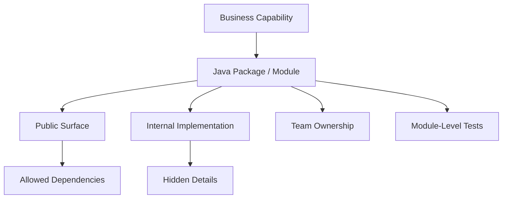
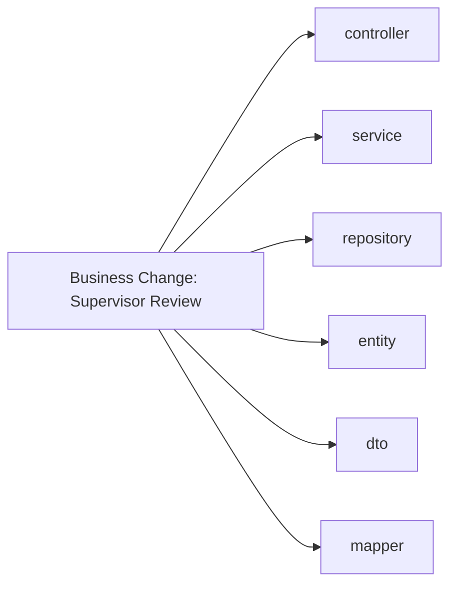
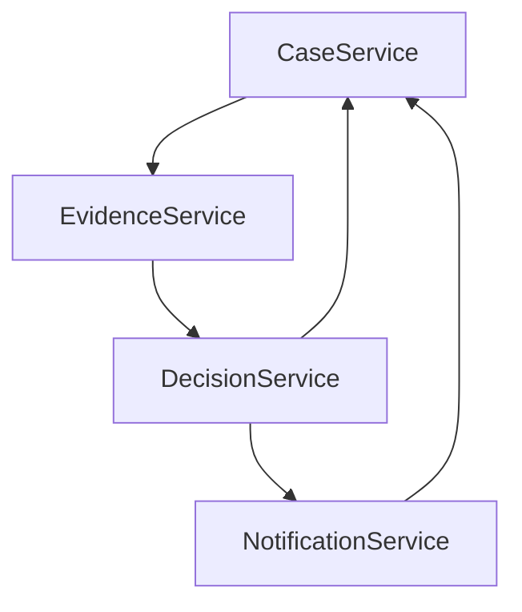
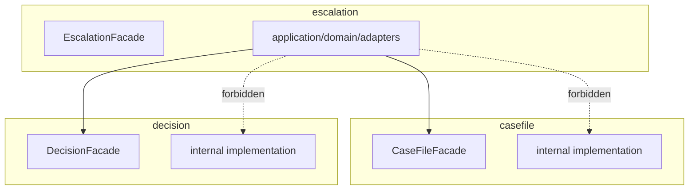
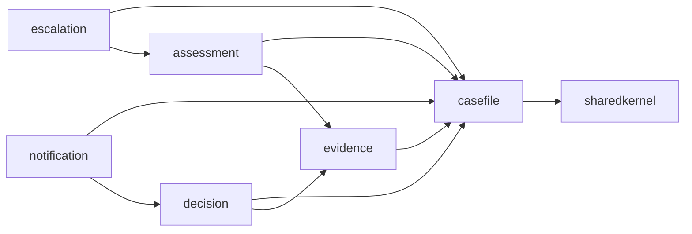
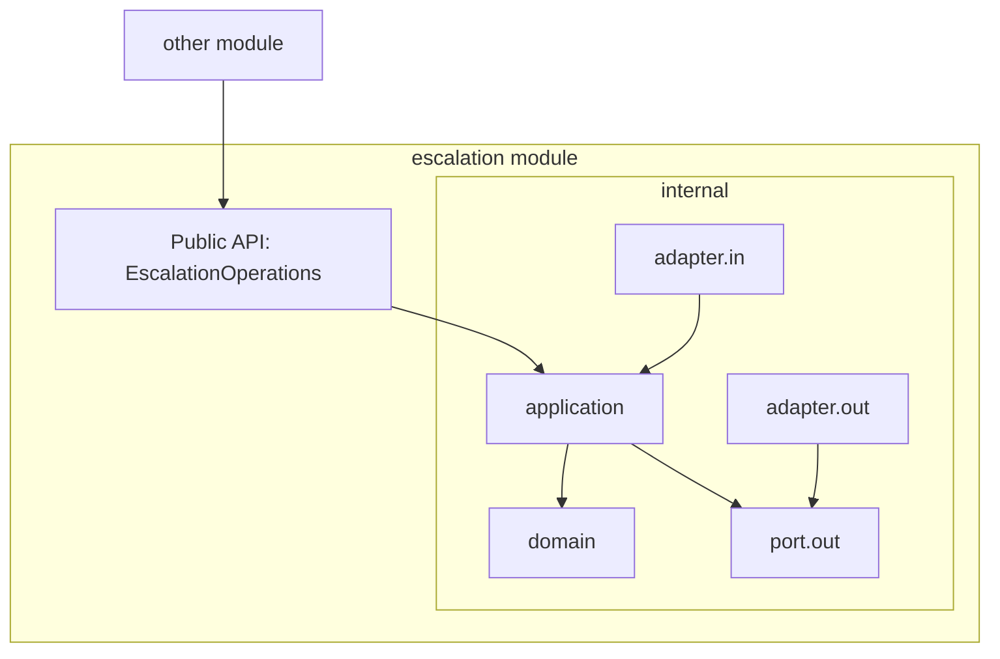
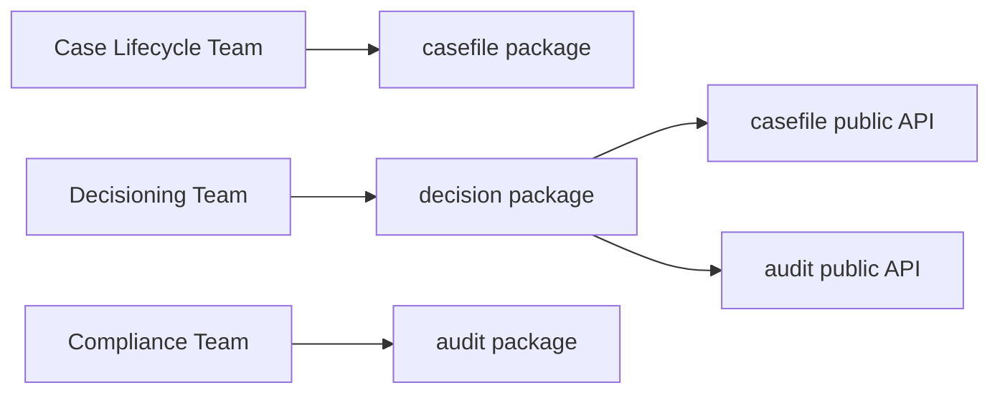
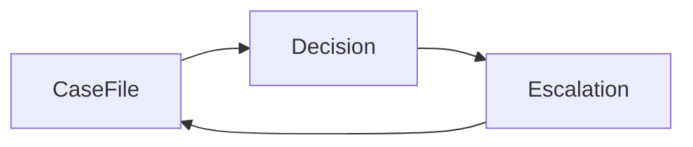

# Part 018 — Package Structure That Scales

## 1. Core Problem

Package structure adalah architecture yang paling sering diremehkan.

Banyak tim berkata:

> “Architecture kami hexagonal.”

Tetapi package-nya seperti ini:

```text
com.acme.platform
├── controller
├── service
├── repository
├── entity
├── dto
├── mapper
├── util
├── config
└── exception
```

Struktur ini mudah dibuat, tetapi buruk untuk pertumbuhan. Kenapa?

Karena ia mengelompokkan kode berdasarkan **technical role**, bukan berdasarkan **business capability**.

Akibatnya:

- semua controller bercampur;
- semua service bercampur;
- semua repository bercampur;
- `common` tumbuh menjadi tempat sampah;
- dependency antar fitur tidak terlihat;
- ownership sulit dibagi;
- perubahan satu capability menyentuh banyak folder;
- boundary hanya ada di diagram, bukan di kode.

Package structure yang scalable harus membantu engineer menjawab:

1. Capability bisnis apa yang diimplementasikan?
2. Siapa owner-nya?
3. Apa public surface-nya?
4. Apa internal detail-nya?
5. Dependency ke capability lain lewat apa?
6. Apa yang boleh berubah tanpa merusak module lain?

Dengan kata lain:

> Package structure bukan tentang merapikan file. Package structure adalah cara membuat architecture terlihat di source code.

---

## 2. Mental Model: Package as Boundary Signal

Dalam Java, package sering dianggap namespace. Di sistem besar, package harus dianggap **boundary signal**.

Package yang baik menunjukkan:

| Signal | Maksud |
|---|---|
| Business capability | Area bisnis yang diwakili kode |
| Public API | Class/interface yang boleh dipakai module lain |
| Internal detail | Class yang tidak boleh dipakai langsung |
| Dependency direction | Siapa boleh bergantung pada siapa |
| Change locality | Perubahan fitur menyentuh area yang jelas |
| Ownership | Tim/person yang accountable |

Package structure harus membuat yang benar menjadi mudah dan yang salah menjadi terlihat.

Diagram mental:



Jika package tidak menunjukkan capability, engineer harus membuka banyak file hanya untuk mengerti sistem.

---

## 3. Package-by-Layer: Why It Breaks at Scale

Package-by-layer mengorganisasi kode seperti ini:

```text
com.acme.enforcement
├── controller
│   ├── CaseController.java
│   ├── EvidenceController.java
│   ├── DecisionController.java
│   └── EscalationController.java
├── service
│   ├── CaseService.java
│   ├── EvidenceService.java
│   ├── DecisionService.java
│   └── EscalationService.java
├── repository
│   ├── CaseRepository.java
│   ├── EvidenceRepository.java
│   ├── DecisionRepository.java
│   └── EscalationRepository.java
└── dto
    ├── CaseDto.java
    ├── EvidenceDto.java
    ├── DecisionDto.java
    └── EscalationDto.java
```

Untuk lima class, ini terlihat rapi. Untuk lima ratus class, ini berubah menjadi inventory teknis.

### 3.1 Change Scattering

Misalnya fitur baru: “case escalation requires supervisor review”.

Di package-by-layer, perubahan tersebar:

```text
controller/EscalationController.java
service/EscalationService.java
service/CaseService.java
repository/EscalationRepository.java
repository/CaseRepository.java
dto/EscalationRequest.java
dto/EscalationResponse.java
entity/CaseEntity.java
entity/EscalationEntity.java
mapper/EscalationMapper.java
```

Perubahan bisnis menyebar secara horizontal.

Diagramnya:



Ini membuat review sulit. Reviewer harus menebak apakah perubahan benar-benar satu fitur atau diam-diam menyentuh fitur lain.

### 3.2 Hidden Coupling

Karena semua `service` berada di package yang sama, pemanggilan silang tampak normal:

```java
@Service
class DecisionService {
    private final CaseService caseService;
    private final EvidenceService evidenceService;
    private final NotificationService notificationService;
}
```

Ini terlihat sederhana, tetapi dependency capability menjadi tidak eksplisit.

Setelah waktu berjalan:



Akhirnya service internal menjadi mini distributed monolith di dalam satu codebase.

### 3.3 Ownership Ambiguity

Package-by-layer membuat owner menjadi kabur:

```text
controller = siapa owner?
service = siapa owner?
repository = siapa owner?
```

Kalau satu tim bertanggung jawab atas “Decision Management”, mereka tidak punya boundary source code yang jelas.

---

## 4. Package-by-Capability

Package-by-capability mengorganisasi kode berdasarkan area bisnis:

```text
com.acme.enforcement
├── casefile
├── evidence
├── decision
├── escalation
├── notification
└── sharedkernel
```

Setiap capability memiliki struktur internal sendiri.

Contoh:

```text
com.acme.enforcement.escalation
├── EscalationModule.java
├── EscalationFacade.java
├── application
│   ├── EscalateCaseHandler.java
│   ├── ReviewEscalationHandler.java
│   └── port
│       ├── in
│       └── out
├── domain
│   ├── Escalation.java
│   ├── EscalationPolicy.java
│   └── EscalationStatus.java
├── adapter
│   ├── in
│   │   ├── web
│   │   └── messaging
│   └── out
│       ├── persistence
│       ├── audit
│       └── event
└── internal
    └── EscalationNumberGenerator.java
```

Dengan struktur ini, perubahan escalation mostly berada di package `escalation`.

Diagram:



Rule-nya:

> Module boleh bergantung pada public surface module lain, bukan internal detail-nya.

---

## 5. Public Surface vs Internal Detail

Package scalable harus membedakan class yang boleh dipakai luar dan class yang internal.

Contoh:

```text
com.acme.enforcement.escalation
├── EscalationOperations.java       <-- public surface
├── EscalationRequest.java          <-- public surface if needed
├── EscalationResult.java           <-- public surface if needed
├── internal
│   ├── EscalationHandler.java      <-- internal
│   ├── EscalationPolicy.java       <-- internal/domain
│   ├── JpaEscalationRepository.java
│   └── EscalationEntity.java
```

Namun di Java, `public` berarti public untuk semua package. Maka kamu perlu convention dan enforcement.

Pilihan enforcement:

| Teknik | Keterangan |
|---|---|
| Naming convention | `internal` package tidak boleh diimport module lain |
| ArchUnit tests | Menguji dependency rule |
| Spring Modulith | Memodelkan application modules dan verifikasi struktur |
| JPMS | Stronger module boundary, tetapi lebih berat di banyak Spring apps |
| Build multi-module | Boundary lebih keras, operational overhead lebih tinggi |
| Code review checklist | Minimal tetapi bergantung disiplin manusia |

Untuk kebanyakan Java microservices enterprise, kombinasi efektif adalah:

```text
package-by-capability
+ internal package convention
+ ArchUnit/Spring Modulith verification
+ explicit module facade
+ code review rule
```

---

## 6. Recommended Structure for a Medium-Complexity Service

Untuk service microservice dengan domain cukup kompleks, gunakan struktur ini:

```text
com.acme.casehandling
├── CaseHandlingApplication.java
├── casefile
│   ├── CaseFileOperations.java
│   ├── CaseSummary.java
│   └── internal
│       ├── application
│       ├── domain
│       └── adapter
├── assignment
│   ├── AssignmentOperations.java
│   ├── AssignmentResult.java
│   └── internal
│       ├── application
│       ├── domain
│       └── adapter
├── escalation
│   ├── EscalationOperations.java
│   ├── EscalationCommand.java
│   ├── EscalationResult.java
│   └── internal
│       ├── application
│       ├── domain
│       └── adapter
├── decision
│   ├── DecisionOperations.java
│   ├── DecisionSummary.java
│   └── internal
│       ├── application
│       ├── domain
│       └── adapter
├── audit
│   ├── AuditRecorder.java
│   └── internal
│       ├── application
│       └── adapter
└── sharedkernel
    ├── CaseId.java
    ├── OfficerId.java
    ├── TenantId.java
    └── BusinessClock.java
```

### 6.1 Why Public Types at Module Root?

Public types at module root make module API obvious:

```text
com.acme.casehandling.escalation.EscalationOperations
com.acme.casehandling.escalation.EscalationCommand
com.acme.casehandling.escalation.EscalationResult
```

Internal implementation lives below:

```text
com.acme.casehandling.escalation.internal.application
com.acme.casehandling.escalation.internal.domain
com.acme.casehandling.escalation.internal.adapter
```

This creates a visual rule:

> Importing `...escalation.*` may be okay. Importing `...escalation.internal.*` from another module is suspicious.

---

## 7. Structure for a Small Service

Jangan over-engineer service kecil.

Untuk small CRUD-ish service:

```text
com.acme.referencecode
├── ReferenceCodeApplication.java
├── code
│   ├── CodeController.java
│   ├── CodeService.java
│   ├── CodeRepository.java
│   ├── CodeEntity.java
│   └── CodeMapper.java
└── config
```

Itu bisa cukup.

Tetapi tetap hindari:

```text
controller
service
repository
dto
entity
mapper
```

Kenapa?

Karena meskipun service kecil, package-by-capability membuat growth path lebih sehat.

Small service bisa mulai dari:

```text
com.acme.referencecode
├── ReferenceCodeApplication.java
├── code
│   ├── api
│   ├── application
│   └── persistence
└── config
```

Lalu ketika domain tumbuh, kamu bisa memperdalam struktur tanpa memindahkan seluruh sistem.

---

## 8. Structure for a Large Service / Modular Monolith Candidate

Kadang satu deployment unit berisi banyak capability karena alasan transaction, latency, migration, atau team maturity. Itu tidak otomatis buruk. Yang buruk adalah jika tidak ada modular boundary.

Struktur large service:

```text
com.acme.enforcement
├── EnforcementApplication.java
├── casefile
│   ├── CaseFileApi.java
│   └── internal
├── allegation
│   ├── AllegationApi.java
│   └── internal
├── evidence
│   ├── EvidenceApi.java
│   └── internal
├── assessment
│   ├── AssessmentApi.java
│   └── internal
├── decision
│   ├── DecisionApi.java
│   └── internal
├── escalation
│   ├── EscalationApi.java
│   └── internal
├── notification
│   ├── NotificationApi.java
│   └── internal
└── platform
    ├── tenancy
    ├── observability
    └── securitycontext
```

Dependency rule contoh:

```text
escalation -> casefile public API
escalation -> assessment public API
decision -> casefile public API
decision -> evidence public API
casefile -> no dependency on decision/escalation
notification -> consumes public event/api, not internal state
```

Mermaid:



Graph ini harus sengaja. Kalau graph tumbuh tanpa aturan, service akan menjadi monolith bola lumpur.

---

## 9. What Goes Into `sharedkernel`?

`sharedkernel` sering menjadi awal kehancuran modularity.

Yang boleh masuk `sharedkernel`:

- stable identity types: `CaseId`, `TenantId`, `OfficerId`;
- tiny value object yang benar-benar lintas capability;
- domain-neutral error base type jika perlu;
- clock abstraction jika dipakai konsisten;
- common result primitives yang stabil;
- constants yang benar-benar universal.

Yang tidak boleh masuk `sharedkernel`:

- business rule spesifik;
- service spesifik;
- repository;
- DTO API;
- mapper;
- `CommonUtil` raksasa;
- enum yang hanya milik satu context;
- vendor client;
- security decision spesifik;
- helper yang berubah setiap minggu.

Rule praktis:

> Kalau perubahan pada sharedkernel memerlukan diskusi banyak owner, mungkin ia bukan sharedkernel; mungkin ia hidden coupling.

### 9.1 Shared Kernel Smell

```text
sharedkernel
├── CommonConstants.java
├── CommonMapper.java
├── CommonValidation.java
├── Status.java
├── Type.java
├── JsonUtils.java
├── DateUtils.java
├── SecurityUtils.java
└── GlobalExceptionHandler.java
```

Ini bukan shared kernel. Ini landfill.

Lebih baik:

```text
sharedkernel
├── identity
│   ├── CaseId.java
│   ├── TenantId.java
│   └── OfficerId.java
├── time
│   └── BusinessClock.java
└── result
    └── BusinessError.java
```

---

## 10. Module Facade Pattern

Module facade adalah public entry point untuk capability internal.

Contoh:

```java
package com.acme.casehandling.escalation;

public interface EscalationOperations {
    EscalationResult requestEscalation(EscalationCommand command);
    EscalationReviewResult reviewEscalation(EscalationReviewCommand command);
}
```

Implementation internal:

```java
package com.acme.casehandling.escalation.internal.application;

import com.acme.casehandling.escalation.EscalationCommand;
import com.acme.casehandling.escalation.EscalationOperations;
import com.acme.casehandling.escalation.EscalationResult;

class EscalationApplicationService implements EscalationOperations {
    private final EscalationRepository repository;
    private final EscalationPolicy policy;

    @Override
    public EscalationResult requestEscalation(EscalationCommand command) {
        // orchestration and domain rule
    }
}
```

Consumer module:

```java
package com.acme.casehandling.decision.internal.application;

import com.acme.casehandling.escalation.EscalationOperations;

class DecisionApplicationService {
    private final EscalationOperations escalationOperations;

    DecisionApplicationService(EscalationOperations escalationOperations) {
        this.escalationOperations = escalationOperations;
    }
}
```

Yang tidak boleh:

```java
import com.acme.casehandling.escalation.internal.application.EscalationApplicationService;
import com.acme.casehandling.escalation.internal.domain.EscalationPolicy;
import com.acme.casehandling.escalation.internal.adapter.persistence.EscalationEntity;
```

Jika module lain butuh internal detail, ada tiga kemungkinan:

1. public API module belum cukup;
2. boundary module salah;
3. consumer sedang melanggar encapsulation karena jalan pintas.

---

## 11. Package Structure with Hexagonal Internals

Package-by-capability bisa digabung dengan hexagonal architecture.

Contoh `escalation`:

```text
com.acme.casehandling.escalation
├── EscalationOperations.java
├── EscalationCommand.java
├── EscalationResult.java
└── internal
    ├── application
    │   ├── RequestEscalationHandler.java
    │   ├── ReviewEscalationHandler.java
    │   └── port
    │       ├── out
    │       │   ├── EscalationRepository.java
    │       │   ├── CaseFilePort.java
    │       │   ├── AssessmentPort.java
    │       │   └── EscalationEventPublisher.java
    │       └── in
    │           └── RequestEscalationUseCase.java
    ├── domain
    │   ├── Escalation.java
    │   ├── EscalationId.java
    │   ├── EscalationStatus.java
    │   └── EscalationPolicy.java
    └── adapter
        ├── in
        │   ├── web
        │   └── messaging
        └── out
            ├── persistence
            ├── casefile
            ├── assessment
            └── event
```

Here, capability boundary is outer structure. Hexagonal boundary is inside capability.



---

## 12. Spring Component Scanning Discipline

Spring makes it easy to wire everything. Too easy.

If everything is a bean and everything can inject everything, package boundary weakens.

Bad smell:

```java
@Service
class AnyServiceCanInjectAnyOtherService {
    AnyServiceCanInjectAnyOtherService(
        CaseService caseService,
        DecisionService decisionService,
        EvidenceRepository evidenceRepository,
        KafkaTemplate<String, Object> kafkaTemplate
    ) {}
}
```

Better discipline:

- expose only module facade beans;
- keep internal implementation package-private where possible;
- avoid injecting repository of another module;
- avoid scanning accidental utility beans globally;
- use configuration class per module when useful;
- verify dependencies with tests.

Example module configuration:

```java
package com.acme.casehandling.escalation.internal;

@Configuration
class EscalationModuleConfiguration {

    @Bean
    EscalationOperations escalationOperations(
            EscalationRepository repository,
            CaseFilePort caseFilePort,
            AssessmentPort assessmentPort,
            EscalationEventPublisher publisher,
            Clock clock
    ) {
        return new EscalationApplicationService(
                repository,
                caseFilePort,
                assessmentPort,
                publisher,
                clock
        );
    }
}
```

Module public API stays at root package. Implementation stays internal.

---

## 13. Enforcing Package Rules with ArchUnit

Architecture rule should not depend only on memory.

Example ArchUnit rule:

```java
@AnalyzeClasses(packages = "com.acme.casehandling")
class ModuleDependencyRulesTest {

    @ArchTest
    static final ArchRule internal_packages_should_not_be_accessed_from_other_modules =
            noClasses()
                    .that().resideOutsideOfPackage("..escalation..")
                    .should().accessClassesThat()
                    .resideInAnyPackage("..escalation.internal..");
}
```

More generic idea:

```java
@ArchTest
static final ArchRule modules_must_not_access_each_other_internal_packages =
        noClasses()
                .that().resideInAPackage("com.acme.casehandling.(*)..")
                .should().accessClassesThat()
                .resideInAPackage("com.acme.casehandling.(*)..internal..");
```

Actual implementation may need custom predicates, depending on your package naming. The point is not syntax perfection. The point is architecture becomes executable.

---

## 14. Spring Modulith Style Verification

Spring Modulith supports the idea of application modules in Spring Boot applications. In its default model, direct subpackages of the main application package are treated as application modules, and it can verify module boundaries.

A package structure aligned with that model:

```text
com.acme.casehandling
├── CaseHandlingApplication.java
├── casefile
├── escalation
├── decision
└── audit
```

Each direct subpackage becomes a candidate module.

A module can expose a public API at its root and hide internals in nested packages.

Example conceptual verification:

```java
class ModularityTests {

    @Test
    void verifiesModularStructure() {
        ApplicationModules modules = ApplicationModules.of(CaseHandlingApplication.class);
        modules.verify();
    }
}
```

This kind of verification helps detect forbidden dependencies early, before package structure becomes meaningless.

---

## 15. Naming Rules That Matter

Names are architecture.

Avoid generic names:

```text
service
manager
helper
processor
handler
common
util
client
adapter
impl
```

These names are not always wrong, but if they dominate the codebase, business meaning is missing.

Prefer capability and intent names:

```text
casefile
assignment
escalation
decision
evidence
audit
notification
riskassessment
```

Class naming examples:

| Weak Name | Better Name |
|---|---|
| `CaseService` | `OpenCaseHandler`, `AssignCaseHandler`, `CaseFileOperations` |
| `StatusManager` | `EscalationPolicy`, `DecisionLifecycle` |
| `CommonMapper` | `CasePersistenceMapper`, `DecisionApiMapper` |
| `ExternalClient` | `RiskScoringAdapter`, `PartyRegistryClient` |
| `Processor` | `EvidenceSubmissionHandler`, `SlaBreachDetector` |

Good names reduce need for comments.

---

## 16. Package Structure and Team Ownership

A mature package structure lets ownership map to source code.

Example:

```text
casefile      -> Case Lifecycle Team
evidence      -> Evidence Platform Team
decision      -> Decisioning Team
escalation    -> Workflow / Operations Team
audit         -> Compliance Platform Team
notification  -> Communication Platform Team
```

This matters because microservices are socio-technical. If code boundaries do not align with ownership boundaries, team autonomy is fake.

Mermaid:



If every team edits `service/CaseService.java`, ownership is not clear.

---

## 17. Internal Events Between Packages

Within one deployment unit, module communication can be:

1. direct facade call;
2. internal domain/application event;
3. shared read model;
4. scheduled reconciliation;
5. extracted later to broker-based event.

Do not immediately use Kafka inside one codebase just to simulate microservices.

Example internal event:

```java
package com.acme.casehandling.casefile;

public record CaseStatusChanged(
        CaseId caseId,
        CaseStatus previousStatus,
        CaseStatus newStatus,
        Instant changedAt
) {}
```

Consumer:

```java
package com.acme.casehandling.escalation.internal.application;

@Component
class CaseStatusChangedListener {

    @EventListener
    void on(CaseStatusChanged event) {
        // react if escalation state must be updated
    }
}
```

Be careful: internal events can also become hidden coupling.

Rules:

- events should describe facts, not commands;
- consumers must be visible in module docs/tests;
- event payload must not expose internal entity;
- event should not be used to avoid clear API design;
- if ordering/idempotency matters, make it explicit.

---

## 18. Package Structure for Extractability

A good internal module can become a microservice later with less pain.

Not every module should become a service. But the code should not make extraction impossible.

Extractability checklist:

| Question | Good sign |
|---|---|
| Does module own clear business capability? | Yes |
| Is public API explicit? | Yes |
| Are internal classes hidden? | Yes |
| Does it avoid direct repository access across modules? | Yes |
| Does it communicate through facade/events? | Yes |
| Does it own its data model conceptually? | Yes |
| Are dependencies known and documented? | Yes |
| Can tests run at module boundary? | Yes |

If extraction requires hunting random imports across `service`, `repository`, and `util`, package structure failed.

---

## 19. Package Structure Smells

### 19.1 God `common`

```text
common
├── CommonService.java
├── CommonMapper.java
├── CommonValidator.java
├── CommonRepository.java
└── CommonUtils.java
```

Smell: “common” means nobody owns it.

Fix:

- move business-specific code back to owning capability;
- split technical platform utilities into `platform` package;
- keep only stable shared kernel types;
- delete unused helpers.

### 19.2 Entity-Centric Packages

```text
case
party
document
user
status
```

This can be okay if entities map to capabilities. But often it means CRUD decomposition.

Better capability names:

```text
casefile
partyregistry
evidencemanagement
decisioning
assignment
escalation
```

### 19.3 Circular Module Dependency



Cycle means one of these is likely true:

- boundary wrong;
- missing domain event;
- missing shared abstraction;
- orchestration belongs elsewhere;
- one module should own the process.

### 19.4 Adapter Shared Across Capabilities

```text
adapter/out/persistence
├── CaseRepositoryImpl.java
├── DecisionRepositoryImpl.java
├── EvidenceRepositoryImpl.java
```

This recreates package-by-layer under hexagonal naming.

Prefer:

```text
casefile/internal/adapter/out/persistence
decision/internal/adapter/out/persistence
evidence/internal/adapter/out/persistence
```

### 19.5 Too Many Tiny Packages

Over-modularization creates navigation cost.

Bad:

```text
escalation
├── command
├── commandhandler
├── commandvalidator
├── dto
├── exception
├── factory
├── mapper
├── model
├── policy
├── service
├── usecase
└── valueobject
```

Better:

```text
escalation
└── internal
    ├── application
    ├── domain
    └── adapter
```

Use fewer, stronger categories.

---

## 20. Decision Matrix

Gunakan matrix ini saat memilih struktur package.

| Context | Recommended Structure |
|---|---|
| Very small CRUD service | capability package + simple internal structure |
| Medium domain service | package-by-capability + hexagonal internals |
| Large modular monolith | direct subpackage modules + public root API + internal packages |
| Service planned for extraction | strict module facade + ArchUnit/Spring Modulith tests |
| Heavy platform service | separate platform subpackages with clear ownership |
| Library/shared component | JPMS or build multi-module if boundary must be hard |

---

## 21. Refactoring From Package-by-Layer

Suppose current structure:

```text
controller
service
repository
entity
dto
mapper
```

Refactor step-by-step.

### Step 1: Identify Capabilities

Group classes by feature/change reason:

```text
casefile:
  CaseController
  CaseService
  CaseRepository
  CaseEntity
  CaseMapper

decision:
  DecisionController
  DecisionService
  DecisionRepository
  DecisionEntity
  DecisionMapper

escalation:
  EscalationController
  EscalationService
  EscalationRepository
  EscalationEntity
  EscalationMapper
```

### Step 2: Move One Capability at a Time

```text
casefile
├── CaseController.java
├── CaseService.java
├── CaseRepository.java
├── CaseEntity.java
└── CaseMapper.java
```

Do not introduce full hexagonal structure immediately if risk is high.

### Step 3: Introduce Public API

```text
casefile
├── CaseFileOperations.java
├── CaseSummary.java
└── internal
    ├── CaseController.java
    ├── CaseService.java
    ├── CaseRepository.java
    ├── CaseEntity.java
    └── CaseMapper.java
```

### Step 4: Fix Cross-Capability Imports

Replace:

```java
import com.acme.casehandling.casefile.internal.CaseService;
```

With:

```java
import com.acme.casehandling.casefile.CaseFileOperations;
```

### Step 5: Add Architecture Tests

Start permissive, then tighten.

```java
noClasses()
    .that().resideOutsideOfPackage("..casefile..")
    .should().accessClassesThat()
    .resideInAnyPackage("..casefile.internal..");
```

### Step 6: Repeat Per Capability

Do not refactor everything in one giant PR. Refactor by capability slice.

---

## 22. Documentation Per Module

Each module package should include lightweight documentation.

Example `escalation/README.md` or module docs:

```md
# Escalation Module

## Purpose
Manages escalation lifecycle for cases requiring elevated review.

## Owns
- Escalation request
- Escalation review state
- Escalation SLA timers

## Does Not Own
- Case file master data
- Final enforcement decision
- Evidence content

## Public API
- EscalationOperations
- EscalationCommand
- EscalationResult

## Dependencies
- casefile public API
- assessment public API
- audit public API

## Events Published
- EscalationRequested
- EscalationApproved
- EscalationRejected
- EscalationSlaBreached

## Forbidden Dependencies
- decision internal packages
- evidence persistence entities
- notification adapter internals
```

This is small, but extremely powerful for onboarding and review.

---

## 23. Architecture Review Checklist

### Package Shape

- Does top-level package represent business capability?
- Are public API and internal implementation distinguishable?
- Are technical layers nested inside capability, not global?
- Is `sharedkernel` small and stable?
- Is `common` avoided or aggressively controlled?

### Dependency

- Can module A access module B only through public API?
- Are internal packages protected by tests or tooling?
- Are circular dependencies detected?
- Are repository/entity classes private to owning capability?
- Are adapters not shared accidentally across capabilities?

### Change Locality

- Does one business change mostly affect one package?
- Are PRs reviewable by capability owner?
- Can the module be tested at its boundary?
- Could the module be extracted later if needed?

### Naming

- Do package names reflect business language?
- Are generic names like `manager`, `helper`, `processor`, `common` rare and justified?
- Is module public API obvious from imports?

---

## 24. Practical Rules

1. Prefer package-by-capability over package-by-layer.
2. Put technical layers inside capability, not above capability.
3. Make public module surface obvious.
4. Hide implementation in `internal` package.
5. Treat imports from another module’s `internal` package as architecture violation.
6. Keep `sharedkernel` small and boring.
7. Avoid `common` unless ownership is explicit.
8. Use architecture tests to enforce rules.
9. Start simple, deepen structure only when complexity demands it.
10. Let package structure reveal business architecture.

---

## 25. Exercise

Take an existing Java service and produce three views.

### 25.1 Current Package View

```text
controller
service
repository
dto
entity
mapper
```

List classes under each.

### 25.2 Capability View

Regroup classes by capability:

```text
casefile
assignment
escalation
decision
evidence
audit
notification
```

### 25.3 Target Package View

Design target:

```text
capability
├── PublicApi.java
├── PublicCommand.java
├── PublicResult.java
└── internal
    ├── application
    ├── domain
    └── adapter
```

Then answer:

1. Which package currently changes most often?
2. Which classes are imported by too many unrelated features?
3. Which package hides real ownership?
4. Which internal dependency should become public API?
5. Which dependency cycle exists?
6. Which module could be extracted later?
7. Which module should definitely stay internal?

---

## 26. Summary

Package structure is not cosmetic. It is architecture made visible.

Key conclusions:

- Package-by-layer is easy but scales poorly because it hides business boundaries.
- Package-by-capability makes change locality, ownership, and dependency direction clearer.
- Public module API should be obvious; internal detail should be protected.
- `sharedkernel` must remain small and stable.
- `common` is dangerous when it becomes ownerless dumping ground.
- Hexagonal internals fit naturally inside capability packages.
- Architecture tests turn package rules into executable constraints.
- Good package structure makes future extraction possible without forcing premature microservices.

A strong Java microservice does not merely compile. It tells future engineers where business meaning lives, what can change, and what must not be touched casually.

---

## References

- Spring Modulith Reference, **Fundamentals / Application Modules**: https://docs.spring.io/spring-modulith/reference/fundamentals.html
- Spring Modulith Project Page: https://spring.io/projects/spring-modulith
- Alistair Cockburn, **Hexagonal Architecture / Ports and Adapters**: https://alistair.cockburn.us/hexagonal-architecture
