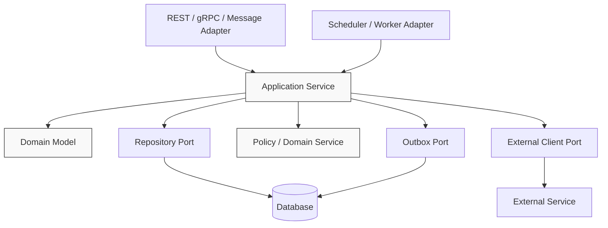
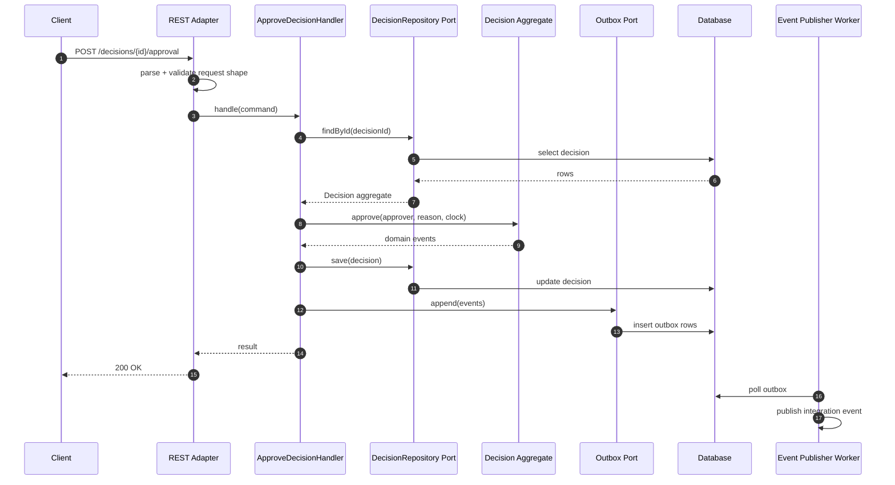
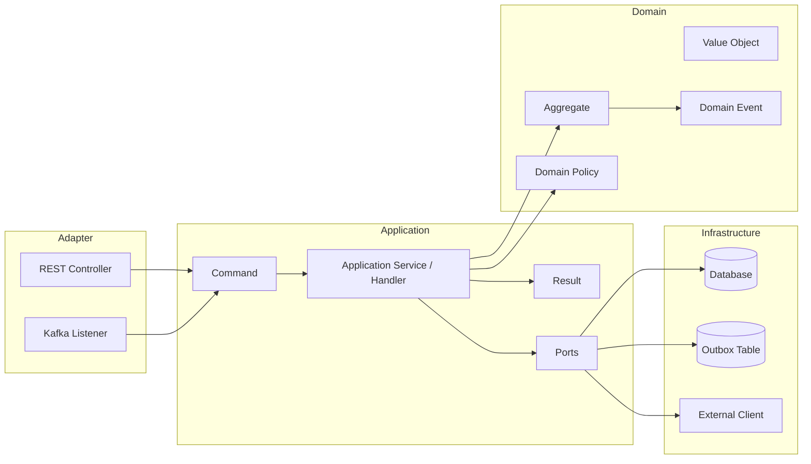

# Part 019 — Application Service Pattern

## 1. Core Problem

Di banyak Java microservices, class yang disebut `SomethingService` sering menjadi tempat semua hal diletakkan:

```text
CaseService
├── validate input
├── check permission
├── query database
├── apply business rule
├── call external service
├── mutate entity
├── publish event
├── build response DTO
├── catch every exception
└── log everything
```

Sekilas terlihat produktif. Satu class menyelesaikan banyak use case. Tetapi setelah sistem tumbuh, class seperti ini berubah menjadi **business logic landfill**.

Gejalanya:

- method service panjang dan sulit dites;
- domain object hanya berisi getter/setter;
- aturan bisnis tersebar di banyak service method;
- perubahan policy menyentuh banyak endpoint;
- transaksi database membungkus call ke service eksternal;
- event dipublish langsung dari controller atau repository;
- error handling tidak konsisten;
- test lebih banyak mock daripada memahami business behavior;
- sulit menjawab “aturan bisnis ini sebenarnya tinggal di mana?”

Masalahnya bukan penggunaan suffix `Service`. Masalahnya adalah tidak adanya pemisahan antara:

1. **use-case orchestration**;
2. **domain decision**;
3. **infrastructure interaction**;
4. **transport/API concern**;
5. **cross-service integration**.

Application service pattern menyelesaikan masalah ini dengan menjadikan application service sebagai **koordinator use case**, bukan otak domain.

> Application service menjawab: “Untuk menjalankan use case ini, langkah sistemnya apa?”  
> Domain model menjawab: “Apakah perubahan ini valid menurut aturan bisnis?”

---

## 2. Mental Model: Application Service as Use-Case Boundary

Application service adalah boundary tempat sebuah use case dieksekusi secara eksplisit.

Ia berada di antara adapter luar dan domain core:



Dalam arsitektur hexagonal/clean architecture, application service adalah bagian dari **application core**. Ia tidak boleh bergantung langsung pada HTTP, Kafka, SQL framework, atau vendor SDK. Ia boleh bergantung pada interface/port yang mewakili kemampuan yang dibutuhkan.

Application service sebaiknya punya nama berdasarkan use case, bukan tabel.

Kurang baik:

```text
CaseService.updateCase(...)
CaseService.approveCase(...)
CaseService.assignCase(...)
CaseService.closeCase(...)
CaseService.reopenCase(...)
```

Lebih jelas:

```text
SubmitCaseForReviewHandler
ApproveEnforcementDecisionHandler
AssignInvestigatorHandler
CloseCaseHandler
ReopenCaseHandler
```

Atau jika tim memilih class per capability:

```text
CaseLifecycleApplicationService.submitForReview(...)
CaseLifecycleApplicationService.close(...)
```

Yang penting: boundary use case terlihat jelas.

---

## 3. Responsibilities of an Application Service

Application service boleh melakukan orchestration. Tetapi orchestration bukan berarti semua logic diletakkan di situ.

### 3.1 Yang Boleh Dilakukan

Application service biasanya bertanggung jawab atas:

1. **Menerima command/query object** dari adapter.
2. **Membuka transaction boundary** untuk perubahan state lokal.
3. **Meload aggregate/entity** melalui repository port.
4. **Memanggil domain behavior** untuk menjalankan aturan bisnis.
5. **Memanggil policy/domain service** jika keputusan membutuhkan beberapa informasi domain.
6. **Menyimpan perubahan** melalui repository port.
7. **Merekam domain event/integration event** melalui outbox.
8. **Mengembalikan result object** yang netral dari transport.
9. **Menghasilkan application-level error** yang bisa diterjemahkan oleh adapter.
10. **Mencatat telemetry penting** di boundary use case.

### 3.2 Yang Tidak Boleh Menjadi Tanggung Jawab Utama

Application service tidak seharusnya menjadi tempat:

- parsing HTTP request;
- menyusun HTTP response code;
- menjalankan SQL detail;
- memanggil `EntityManager` di banyak tempat tanpa repository boundary;
- menyimpan semua business invariant;
- melakukan mapping vendor API secara langsung;
- melakukan retry/circuit breaker manual di semua use case;
- mengubah event broker API langsung;
- menjadi class util global;
- menjadi tempat semua authorization/business policy bercampur tanpa model.

---

## 4. Request Lifecycle

Lihat alur sebuah command `ApproveDecision`:



Perhatikan detail penting:

- adapter mengurus HTTP shape;
- application service menjalankan use case;
- aggregate menjaga invariant;
- repository menyembunyikan persistence detail;
- event keluar melalui outbox, bukan publish langsung di tengah transaksi;
- publisher worker adalah infrastructure concern, bukan domain behavior.

---

## 5. Application Service vs Domain Service vs Infrastructure Service

Nama `Service` sering ambigu. Gunakan klasifikasi ini.

| Jenis | Pertanyaan yang Dijawab | Contoh | Boleh Bergantung Pada |
|---|---|---|---|
| Application Service | “Langkah sistem untuk menjalankan use case ini apa?” | `ApproveDecisionHandler` | Domain model, repository port, outbox port, clock, policy port |
| Domain Service | “Keputusan domain apa yang tidak natural diletakkan di satu aggregate?” | `PenaltyPolicy`, `EligibilityRule` | Domain object/value object/policy data |
| Infrastructure Service | “Bagaimana kemampuan teknis dilakukan?” | `S3EvidenceFileStore`, `KafkaOutboxPublisher` | SDK, database, broker, HTTP client |
| Adapter Service | “Bagaimana transport dipetakan ke application boundary?” | REST controller, Kafka listener | Application service |

Rule sederhana:

> Jika logic membicarakan business invariant, taruh di domain.  
> Jika logic membicarakan alur use case, taruh di application service.  
> Jika logic membicarakan teknologi, taruh di adapter/infrastructure.

---

## 6. Transaction Script vs Application Service vs Rich Domain Model

Transaction Script adalah pattern yang sah untuk domain sederhana. Masalah muncul ketika transaction script dipakai untuk domain kompleks yang punya lifecycle panjang dan banyak invariant.

### 6.1 Transaction Script

```java
@Transactional
public void approveDecision(UUID decisionId, UUID approverId, String reason) {
    DecisionEntity decision = decisionRepository.findById(decisionId)
        .orElseThrow(() -> new NotFoundException("decision"));

    if (!decision.getStatus().equals("SUBMITTED")) {
        throw new IllegalStateException("Only submitted decisions can be approved");
    }

    if (decision.getAuthorId().equals(approverId)) {
        throw new IllegalStateException("Author cannot approve own decision");
    }

    if (reason == null || reason.isBlank()) {
        throw new IllegalArgumentException("Approval reason is required");
    }

    decision.setStatus("APPROVED");
    decision.setApprovedBy(approverId);
    decision.setApprovedAt(Instant.now());
    decision.setApprovalReason(reason);

    decisionRepository.save(decision);
    eventPublisher.publish(new DecisionApprovedEvent(decisionId, approverId));
}
```

Untuk sistem kecil, ini bisa diterima. Untuk domain kompleks, ini rapuh karena:

- invariant tersebar di method service;
- status berupa string raw;
- event publish terjadi langsung di dalam transaction;
- test harus mengeksekusi application service untuk menguji rule domain;
- rule “author cannot approve own decision” bisa terduplikasi di use case lain.

### 6.2 Application Service with Domain Behavior

```java
@Transactional
public ApprovalResult handle(ApproveDecisionCommand command) {
    Decision decision = decisions.get(command.decisionId())
        .orElseThrow(() -> DecisionNotFound.forId(command.decisionId()));

    decision.approve(
        ApproverId.of(command.approverId()),
        ApprovalReason.of(command.reason()),
        clock.instant()
    );

    decisions.save(decision);
    outbox.append(decision.releaseEvents());

    return ApprovalResult.approved(decision.id(), decision.version());
}
```

Di sini application service hanya mengatur alur:

1. load aggregate;
2. call behavior;
3. save;
4. append event;
5. return result.

Rule domain hidup di `Decision.approve(...)`.

---

## 7. Command Handler Pattern

Untuk sistem besar, command handler sering lebih jelas daripada “god application service”.

```text
application
├── command
│   ├── SubmitCaseForReviewCommand.java
│   ├── SubmitCaseForReviewHandler.java
│   ├── ApproveDecisionCommand.java
│   └── ApproveDecisionHandler.java
├── query
│   ├── GetCaseOverviewQuery.java
│   └── GetCaseOverviewHandler.java
└── port
    ├── CaseRepository.java
    ├── DecisionRepository.java
    └── Outbox.java
```

### 7.1 Command Object

Command adalah representation dari **intent**, bukan DTO HTTP mentah.

```java
package com.acme.enforcement.decision.application.command;

import java.util.UUID;

public record ApproveDecisionCommand(
    UUID decisionId,
    UUID approverId,
    String reason,
    String requestId
) {}
```

`requestId` bisa digunakan untuk idempotency/correlation. Tetapi command tidak perlu membawa seluruh HTTP header. Adapter yang menerjemahkan HTTP ke command.

### 7.2 Handler

```java
package com.acme.enforcement.decision.application.command;

import com.acme.enforcement.decision.application.port.DecisionRepository;
import com.acme.enforcement.decision.application.port.Outbox;
import com.acme.enforcement.decision.domain.ApprovalReason;
import com.acme.enforcement.decision.domain.ApproverId;
import com.acme.enforcement.decision.domain.Decision;
import org.springframework.stereotype.Service;
import org.springframework.transaction.annotation.Transactional;

import java.time.Clock;

@Service
public class ApproveDecisionHandler {

    private final DecisionRepository decisions;
    private final Outbox outbox;
    private final Clock clock;

    public ApproveDecisionHandler(
        DecisionRepository decisions,
        Outbox outbox,
        Clock clock
    ) {
        this.decisions = decisions;
        this.outbox = outbox;
        this.clock = clock;
    }

    @Transactional
    public ApprovalResult handle(ApproveDecisionCommand command) {
        Decision decision = decisions.get(command.decisionId())
            .orElseThrow(() -> DecisionApplicationError.notFound(command.decisionId()));

        decision.approve(
            ApproverId.of(command.approverId()),
            ApprovalReason.of(command.reason()),
            clock.instant()
        );

        decisions.save(decision);
        outbox.append(decision.releaseEvents());

        return ApprovalResult.approved(decision.id().value(), decision.version());
    }
}
```

Handler ini punya dependency kecil dan mudah diuji.

---

## 8. Query Handler Pattern

Tidak semua read perlu melewati aggregate penuh.

Dalam microservices, command side dan query side sering punya kebutuhan berbeda:

- command butuh invariant;
- query butuh projection/read model;
- command biasanya transactional;
- query biasanya optimized untuk shape UI/API;
- command mengubah state;
- query tidak mengubah state.

Contoh query handler:

```java
package com.acme.enforcement.caseview.application.query;

import org.springframework.stereotype.Service;
import org.springframework.transaction.annotation.Transactional;

import java.util.UUID;

@Service
public class GetCaseOverviewHandler {

    private final CaseOverviewReadModel readModel;

    public GetCaseOverviewHandler(CaseOverviewReadModel readModel) {
        this.readModel = readModel;
    }

    @Transactional(readOnly = true)
    public CaseOverviewView handle(GetCaseOverviewQuery query) {
        return readModel.findOverview(query.caseId())
            .orElseThrow(() -> CaseViewApplicationError.notFound(query.caseId()));
    }
}

record GetCaseOverviewQuery(UUID caseId) {}
```

Ini bukan berarti harus menerapkan CQRS penuh. Ini hanya memisahkan model baca dari model tulis ketika kebutuhan berbeda.

Rule praktis:

> Untuk write use case, lewat aggregate/invariant.  
> Untuk read use case, boleh lewat read model/projection jika tidak mengubah invariant.

---

## 9. Policy Handler and Decision Boundary

Dalam enterprise/regulatory system, banyak use case bukan hanya “update data”. Mereka melakukan **decision**.

Contoh:

- apakah case boleh dieskalasi?
- apakah investigator boleh melihat evidence tertentu?
- apakah decision membutuhkan second approval?
- apakah enforcement action harus dikirim ke external agency?
- apakah SLA breach harus dibuat otomatis?

Application service tidak boleh menyimpan semua policy branching. Buat policy eksplisit.

```java
public interface EscalationPolicy {
    EscalationDecision evaluate(EscalationRequest request);
}

public record EscalationDecision(
    boolean allowed,
    boolean requiresSupervisorApproval,
    String reasonCode
) {}
```

Application service menggunakannya sebagai decision dependency:

```java
@Transactional
public EscalationResult handle(EscalateCaseCommand command) {
    CaseFile caseFile = cases.get(command.caseId())
        .orElseThrow(() -> CaseApplicationError.notFound(command.caseId()));

    EscalationDecision decision = escalationPolicy.evaluate(
        EscalationRequest.from(caseFile, command.actorId(), clock.instant())
    );

    caseFile.escalate(command.actorId(), decision, clock.instant());

    cases.save(caseFile);
    outbox.append(caseFile.releaseEvents());

    return EscalationResult.from(caseFile);
}
```

Keuntungannya:

- policy menjadi testable;
- reason code bisa diaudit;
- perubahan policy tidak tersebar;
- use case tetap terbaca;
- domain tetap menjaga invariant akhir.

---

## 10. Transaction Boundary Placement

Application service sering menjadi tempat paling cocok untuk `@Transactional` karena ia mewakili satu use case.

```java
@Transactional
public ApprovalResult handle(ApproveDecisionCommand command) {
    // load aggregate
    // call domain behavior
    // save aggregate
    // append outbox
}
```

Tetapi ada beberapa aturan penting.

### 10.1 Jangan Membuka Transaction di Controller

Controller adalah adapter. Ia sebaiknya tidak menentukan transactional semantics.

Buruk:

```java
@RestController
class DecisionController {

    @Transactional
    @PostMapping("/decisions/{id}/approval")
    ResponseEntity<?> approve(...) {
        // too much
    }
}
```

Ini membuat HTTP concern dan transaction concern bercampur.

### 10.2 Jangan Memanggil External Service di Dalam DB Transaction

Buruk:

```java
@Transactional
public void approve(ApproveDecisionCommand command) {
    Decision decision = decisions.get(command.decisionId()).orElseThrow();
    decision.approve(...);
    decisions.save(decision);

    // bad: remote call inside transaction
    notificationClient.sendApprovalNotification(decision.id());
}
```

Risikonya:

- transaction lock lebih lama;
- remote call lambat memperpanjang database resource hold;
- jika remote call berhasil tetapi commit gagal, state eksternal inconsistent;
- jika remote call gagal, transaction rollback bisa membuat retry storm;
- failure mode sulit direkonstruksi.

Lebih baik:

```java
@Transactional
public void approve(ApproveDecisionCommand command) {
    Decision decision = decisions.get(command.decisionId()).orElseThrow();
    decision.approve(...);
    decisions.save(decision);
    outbox.append(decision.releaseEvents());
}
```

Lalu worker mempublish event setelah commit.

### 10.3 Transaction Boundary Tidak Selalu Sama dengan Business Process Boundary

Use case `SubmitCaseForReview` mungkin selesai dalam satu transaction lokal.

Business process “case review lifecycle” mungkin berlangsung beberapa hari, melewati:

- submit;
- assign reviewer;
- request additional evidence;
- receive evidence;
- draft decision;
- approve decision;
- notify party.

Jangan mencoba membungkus seluruh process dalam satu transaction. Gunakan state machine, saga, workflow, dan event.

---

## 11. Idempotency at Application Boundary

Application service adalah tempat yang baik untuk menerapkan idempotency karena ia memahami use case intent.

Contoh idempotency port:

```java
public interface IdempotencyStore {
    <T> T executeOnce(String key, Class<T> resultType, java.util.function.Supplier<T> action);
}
```

Penggunaan:

```java
@Transactional
public ApprovalResult handle(ApproveDecisionCommand command) {
    return idempotency.executeOnce(
        command.requestId(),
        ApprovalResult.class,
        () -> approveOnce(command)
    );
}

private ApprovalResult approveOnce(ApproveDecisionCommand command) {
    Decision decision = decisions.get(command.decisionId())
        .orElseThrow(() -> DecisionApplicationError.notFound(command.decisionId()));

    decision.approve(...);
    decisions.save(decision);
    outbox.append(decision.releaseEvents());

    return ApprovalResult.approved(decision.id().value(), decision.version());
}
```

Catatan penting:

- idempotency key harus berasal dari client/request intent;
- result yang disimpan harus cukup untuk replay response;
- idempotency harus transactional dengan state change bila memungkinkan;
- jangan menganggap retry hanya terjadi dari client; broker/worker juga bisa mengulang delivery.

---

## 12. Error Model at Application Layer

Application service tidak seharusnya melempar semua error sebagai `RuntimeException` generik.

Gunakan application error yang membawa semantic.

```java
public sealed interface DecisionApplicationError permits
    DecisionApplicationError.NotFound,
    DecisionApplicationError.Conflict,
    DecisionApplicationError.ForbiddenOperation {

    String code();

    record NotFound(String code, String message) extends RuntimeException(message)
        implements DecisionApplicationError {}

    record Conflict(String code, String message) extends RuntimeException(message)
        implements DecisionApplicationError {}

    record ForbiddenOperation(String code, String message) extends RuntimeException(message)
        implements DecisionApplicationError {}

    static NotFound notFound(Object id) {
        return new NotFound("DECISION_NOT_FOUND", "Decision not found: " + id);
    }
}
```

REST adapter menerjemahkan error ke HTTP:

```java
@RestControllerAdvice
class DecisionExceptionHandler {

    @ExceptionHandler(DecisionApplicationError.NotFound.class)
    ResponseEntity<ApiError> notFound(DecisionApplicationError.NotFound error) {
        return ResponseEntity.status(404)
            .body(new ApiError(error.code(), error.getMessage()));
    }

    @ExceptionHandler(DecisionApplicationError.Conflict.class)
    ResponseEntity<ApiError> conflict(DecisionApplicationError.Conflict error) {
        return ResponseEntity.status(409)
            .body(new ApiError(error.code(), error.getMessage()));
    }
}
```

Dengan begini:

- application layer tidak bergantung pada HTTP;
- REST adapter tetap bisa membuat response yang benar;
- gRPC adapter bisa menerjemahkan ke status berbeda;
- message consumer bisa menentukan retry/non-retry;
- error code menjadi stabil untuk client dan observability.

---

## 13. Application Service and Domain Events

Domain event sebaiknya lahir dari domain behavior, bukan dibuat manual oleh application service untuk menebak apa yang berubah.

```java
public final class Decision {

    private final List<DomainEvent> events = new ArrayList<>();

    public void approve(ApproverId approverId, ApprovalReason reason, Instant approvedAt) {
        ensureSubmitted();
        ensureAuthorIsNotApprover(approverId);

        this.status = DecisionStatus.APPROVED;
        this.approvedBy = approverId;
        this.approvedAt = approvedAt;
        this.approvalReason = reason;

        events.add(new DecisionApproved(id, approverId, approvedAt));
    }

    public List<DomainEvent> releaseEvents() {
        List<DomainEvent> released = List.copyOf(events);
        events.clear();
        return released;
    }
}
```

Application service mengumpulkan event:

```java
decision.approve(...);
decisions.save(decision);
outbox.append(decision.releaseEvents());
```

Ini menghindari bug seperti:

```java
// bad: event says approved but domain mutation may have failed earlier/later
outbox.append(new DecisionApproved(decisionId, approverId, now));
decision.approve(...);
```

---

## 14. Orchestrating Multiple Aggregates

Application service kadang perlu melibatkan lebih dari satu aggregate dalam service yang sama. Ini harus dilakukan hati-hati.

Contoh: menutup case membutuhkan `CaseFile` dan `Decision`.

```java
@Transactional
public CloseCaseResult handle(CloseCaseCommand command) {
    CaseFile caseFile = cases.get(command.caseId())
        .orElseThrow(() -> CaseApplicationError.notFound(command.caseId()));

    Decision finalDecision = decisions.findFinalDecisionFor(command.caseId())
        .orElseThrow(() -> CaseApplicationError.finalDecisionRequired(command.caseId()));

    caseFile.closeUsing(finalDecision.summary(), command.actorId(), clock.instant());

    cases.save(caseFile);
    outbox.append(caseFile.releaseEvents());

    return CloseCaseResult.from(caseFile);
}
```

Ini masih aman jika:

- kedua aggregate berada dalam satu service/data ownership boundary;
- invariant yang dijaga memang lokal;
- transaction lokal cukup;
- tidak ada remote service call;
- concurrency control jelas.

Jika aggregate berada di service berbeda, jangan load langsung database service lain. Gunakan:

- API call dengan timeout dan contract jelas;
- replicated read model;
- event-carried state transfer;
- saga/workflow;
- domain process manager.

---

## 15. External Calls from Application Service

Ada tiga model umum.

### 15.1 Call Before Transaction

Cocok jika data eksternal hanya dipakai sebagai input decision dan tidak perlu atomik dengan state change.

```java
public SubmitResult handle(SubmitCaseCommand command) {
    PartyRiskScore score = riskClient.getScore(command.partyId());

    return tx.execute(() -> {
        CaseFile caseFile = CaseFile.open(command, score);
        cases.save(caseFile);
        outbox.append(caseFile.releaseEvents());
        return SubmitResult.from(caseFile);
    });
}
```

Risiko: score bisa berubah setelah diambil. Simpan snapshot jika penting.

### 15.2 Call After Commit via Outbox

Cocok untuk notification, indexing, downstream update, integration event.

```java
@Transactional
public ApprovalResult handle(ApproveDecisionCommand command) {
    Decision decision = ...;
    decision.approve(...);
    decisions.save(decision);
    outbox.append(decision.releaseEvents());
    return ApprovalResult.from(decision);
}
```

Worker melakukan publish/call setelah commit.

### 15.3 Reservation Pattern

Cocok jika perlu koordinasi dengan resource eksternal.

Contoh:

1. reserve external resource;
2. commit local state with reservation id;
3. confirm asynchronously;
4. compensate if timeout.

Jangan sembunyikan ini sebagai “method call biasa”. Ini adalah distributed workflow.

---

## 16. Application Service Observability

Application service adalah tempat bagus untuk menandai telemetry use case.

Log yang berguna:

```java
log.info("decision.approval.started decisionId={} approverId={} requestId={}",
    command.decisionId(), command.approverId(), command.requestId());
```

Log yang buruk:

```java
log.info("calling approve method");
```

Metric yang berguna:

- `usecase.approve_decision.duration`;
- `usecase.approve_decision.success.count`;
- `usecase.approve_decision.conflict.count`;
- `usecase.approve_decision.validation_error.count`;
- `usecase.approve_decision.idempotency_replay.count`.

Trace span yang berguna:

```text
ApproveDecisionHandler.handle
├── DecisionRepository.get
├── Decision.approve
├── DecisionRepository.save
└── Outbox.append
```

Jangan memasukkan PII/sensitive evidence content ke log. Application service mengetahui business context, sehingga ia juga harus disiplin terhadap data classification.

---

## 17. Testing Application Services

Application service test harus membuktikan orchestration dan boundary behavior, bukan menduplikasi domain test.

### 17.1 Test Happy Path

```java
@Test
void approveSubmittedDecision() {
    Decision decision = DecisionFixture.submitted()
        .authoredBy(authorId)
        .build();

    InMemoryDecisionRepository decisions = new InMemoryDecisionRepository(decision);
    InMemoryOutbox outbox = new InMemoryOutbox();

    ApproveDecisionHandler handler = new ApproveDecisionHandler(
        decisions,
        outbox,
        Clock.fixed(Instant.parse("2026-07-05T10:00:00Z"), ZoneOffset.UTC)
    );

    ApprovalResult result = handler.handle(new ApproveDecisionCommand(
        decision.id().value(),
        approverId.value(),
        "Reviewed and approved",
        "req-123"
    ));

    assertThat(result.status()).isEqualTo("APPROVED");
    assertThat(decisions.saved()).hasSize(1);
    assertThat(outbox.events()).hasSize(1);
}
```

### 17.2 Test Application Error

```java
@Test
void failsWhenDecisionDoesNotExist() {
    ApproveDecisionHandler handler = new ApproveDecisionHandler(
        new InMemoryDecisionRepository(),
        new InMemoryOutbox(),
        Clock.systemUTC()
    );

    assertThatThrownBy(() -> handler.handle(commandForUnknownDecision()))
        .isInstanceOf(DecisionApplicationError.NotFound.class);
}
```

### 17.3 What Not to Over-Mock

Jika test application service punya 15 mocks, itu sinyal buruk.

Kemungkinan penyebab:

- handler terlalu besar;
- use case terlalu banyak dependency;
- domain behavior bocor ke service;
- external calls tidak dipisah;
- query dan command bercampur;
- policy tidak diekstrak.

---

## 18. Application Service Smells

### 18.1 God Service

```text
CaseService.java: 4,800 lines
```

Gejala:

- semua use case ada di satu class;
- dependency constructor terlalu panjang;
- sulit memahami transaction boundary;
- perubahan kecil sering conflict saat merge.

Perbaikan:

- pecah per use case/handler;
- ekstrak domain behavior;
- ekstrak policy;
- pisahkan command/query;
- pindahkan infrastructure detail ke adapter.

### 18.2 Anemic Domain by Accident

Gejala:

```java
caseEntity.setStatus(CLOSED);
caseEntity.setClosedAt(now);
caseEntity.setClosedBy(actorId);
caseEntity.setClosureReason(reason);
```

Ada di banyak application service.

Perbaikan:

```java
caseFile.close(actorId, ClosureReason.of(reason), now);
```

### 18.3 Transaction Wrapped Around Remote Calls

Gejala:

```java
@Transactional
public void submit(...) {
    repository.save(...);
    externalApi.call(...);
    broker.publish(...);
}
```

Perbaikan:

- outbox;
- after-commit hook dengan hati-hati;
- workflow/saga;
- split local state transition and external effect.

### 18.4 Boolean Parameter Use Case

```java
processCase(caseId, true, false, true)
```

Perbaikan:

- command object eksplisit;
- method per intent;
- value object.

### 18.5 Service Method Returns JPA Entity

Buruk:

```java
public DecisionEntity approve(...) { ... }
```

Risiko:

- persistence model bocor ke adapter;
- lazy loading issue;
- API shape terikat database shape;
- domain mutation bisa dilakukan di luar use case.

Perbaikan:

```java
public ApprovalResult handle(ApproveDecisionCommand command) { ... }
```

---

## 19. Design Heuristic

Gunakan pertanyaan ini ketika mendesain application service:

1. Use case ini punya nama intent yang jelas?
2. Apakah method ini mengubah state atau hanya query?
3. Aggregate apa yang menjadi transaction root?
4. Invariant apa yang harus dijaga di dalam transaction?
5. Apakah ada remote call? Jika iya, apakah ia harus terjadi sebelum/after commit?
6. Apakah event dibuat dari domain behavior?
7. Apakah idempotency dibutuhkan?
8. Error apa yang bisa terjadi dan siapa yang menerjemahkannya?
9. Apakah application service tahu HTTP/gRPC/Kafka detail?
10. Apakah test bisa membaca business use case tanpa 15 mock?

---

## 20. Mini Case Study: Submit Enforcement Case

### 20.1 Use Case

Regulator menerima complaint. Sistem perlu membuat enforcement case.

Rules:

- complaint harus punya subject party;
- duplicate complaint untuk party dan allegation yang sama dalam 30 hari harus ditandai sebagai possible duplicate;
- case baru masuk status `OPENED`;
- event `CaseOpened` harus tercatat;
- jika duplicate risk tinggi, event tambahan `PossibleDuplicateDetected` dicatat;
- notification ke investigator dilakukan async.

### 20.2 Command

```java
public record SubmitEnforcementCaseCommand(
    UUID complaintId,
    UUID subjectPartyId,
    String allegationType,
    String allegationSummary,
    UUID submittedBy,
    String requestId
) {}
```

### 20.3 Application Service

```java
@Service
public class SubmitEnforcementCaseHandler {

    private final CaseRepository cases;
    private final DuplicateComplaintPolicy duplicatePolicy;
    private final Outbox outbox;
    private final Clock clock;

    public SubmitEnforcementCaseHandler(
        CaseRepository cases,
        DuplicateComplaintPolicy duplicatePolicy,
        Outbox outbox,
        Clock clock
    ) {
        this.cases = cases;
        this.duplicatePolicy = duplicatePolicy;
        this.outbox = outbox;
        this.clock = clock;
    }

    @Transactional
    public SubmitCaseResult handle(SubmitEnforcementCaseCommand command) {
        DuplicateAssessment duplicate = duplicatePolicy.assess(
            command.subjectPartyId(),
            command.allegationType(),
            clock.instant()
        );

        CaseFile caseFile = CaseFile.open(
            ComplaintId.of(command.complaintId()),
            PartyId.of(command.subjectPartyId()),
            Allegation.of(command.allegationType(), command.allegationSummary()),
            UserId.of(command.submittedBy()),
            duplicate,
            clock.instant()
        );

        cases.save(caseFile);
        outbox.append(caseFile.releaseEvents());

        return SubmitCaseResult.from(caseFile);
    }
}
```

### 20.4 Domain Behavior

```java
public static CaseFile open(
    ComplaintId complaintId,
    PartyId subjectPartyId,
    Allegation allegation,
    UserId submittedBy,
    DuplicateAssessment duplicate,
    Instant openedAt
) {
    if (duplicate == null) {
        throw new DomainException("Duplicate assessment is required");
    }

    CaseFile caseFile = new CaseFile(
        CaseId.newId(),
        complaintId,
        subjectPartyId,
        CaseStatus.OPENED,
        openedAt,
        submittedBy
    );

    caseFile.allegations.add(allegation);
    caseFile.events.add(new CaseOpened(caseFile.id, complaintId, subjectPartyId, openedAt));

    if (duplicate.highRisk()) {
        caseFile.duplicateFlag = DuplicateFlag.possibleDuplicate(duplicate.reasonCode());
        caseFile.events.add(new PossibleDuplicateDetected(caseFile.id, duplicate.reasonCode(), openedAt));
    }

    return caseFile;
}
```

Application service mengatur alur. Domain model menjaga rule pembentukan case.

---

## 21. Mermaid: Responsibility Split



---

## 22. Implementation Checklist

Sebuah application service production-grade sebaiknya memenuhi checklist ini:

- [ ] Nama use case jelas.
- [ ] Input berupa command/query object, bukan HTTP object.
- [ ] Output berupa result/view object, bukan JPA entity.
- [ ] Transaction boundary eksplisit.
- [ ] Domain invariant tidak bocor ke handler secara masif.
- [ ] External service call tidak dilakukan sembarangan di dalam transaction.
- [ ] Event dicatat melalui outbox atau mekanisme reliable lain.
- [ ] Error semantic jelas.
- [ ] Idempotency dipertimbangkan untuk command retryable.
- [ ] Telemetry memakai business operation name.
- [ ] Test tidak over-mock.
- [ ] Dependency mengarah ke port/interface, bukan vendor SDK.
- [ ] Query path tidak dipaksa melewati aggregate jika hanya read model.
- [ ] Tidak ada `CommonService` yang menjadi dumping ground.

---

## 23. Architecture Review Questions

Saat review pull request atau design doc, tanyakan:

1. Apa use case boundary-nya?
2. Apakah ada satu transaction lokal yang jelas?
3. Apakah use case ini bagian dari process panjang?
4. Apakah domain object menjaga invariant sendiri?
5. Apakah event merepresentasikan perubahan domain yang sudah valid?
6. Apakah application service tahu transport detail?
7. Apakah ada call eksternal di dalam transaction?
8. Apakah retry aman?
9. Apakah result object stabil untuk client?
10. Apakah error bisa dipetakan oleh adapter tanpa string matching?

---

## 24. Exercise

Gunakan domain regulatory case management.

Desain application service untuk use case:

```text
Request Additional Evidence
```

Requirements:

- case harus dalam status `UNDER_REVIEW`;
- reviewer mengirim daftar evidence request;
- due date wajib lebih besar dari hari ini;
- party harus dinotifikasi async;
- audit event harus tercatat;
- request yang sama tidak boleh dibuat dua kali jika retry terjadi;
- jika case sudah closed, command harus menghasilkan conflict.

Deliverables:

1. command object;
2. application service/handler;
3. domain method di aggregate;
4. domain event;
5. outbox append point;
6. application error model;
7. test cases minimal.

---

## 25. Key Takeaways

Application service adalah salah satu pattern paling penting dalam Java microservices karena ia menjadi titik temu antara use case, transaction, domain model, persistence, event, dan integration.

Tetapi application service bukan tempat semua business logic ditumpuk.

Mental model yang harus dibawa:

> Application service coordinates.  
> Domain model decides.  
> Repository persists.  
> Adapter translates.  
> Outbox externalizes.  
> Policy explains decisions.  
> Telemetry makes behavior visible.

Jika pattern ini diterapkan konsisten, service menjadi lebih mudah dipahami, diuji, dioperasikan, dan dievolusi.

---

## References

- Martin Fowler — Domain Model: https://martinfowler.com/eaaCatalog/domainModel.html
- Martin Fowler — Anemic Domain Model: https://martinfowler.com/bliki/AnemicDomainModel.html
- Spring Framework Reference — Transaction Propagation: https://docs.spring.io/spring-framework/reference/data-access/transaction/declarative/tx-propagation.html
- Alistair Cockburn — Hexagonal Architecture: https://alistair.cockburn.us/hexagonal-architecture
