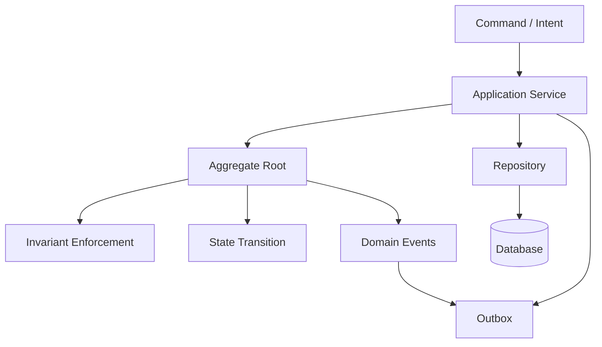
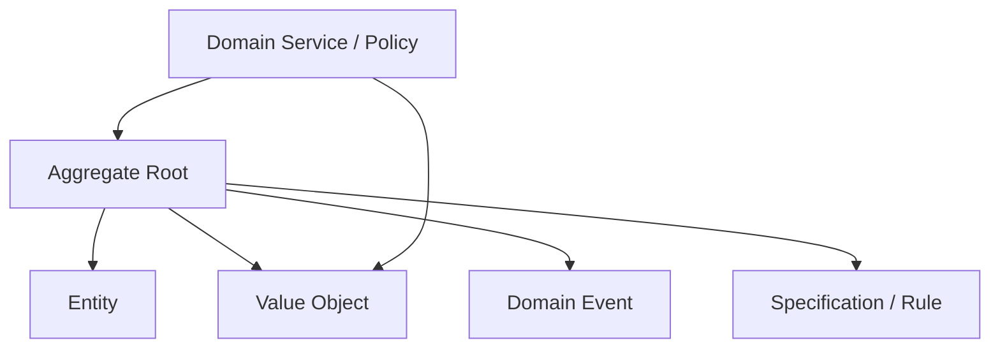
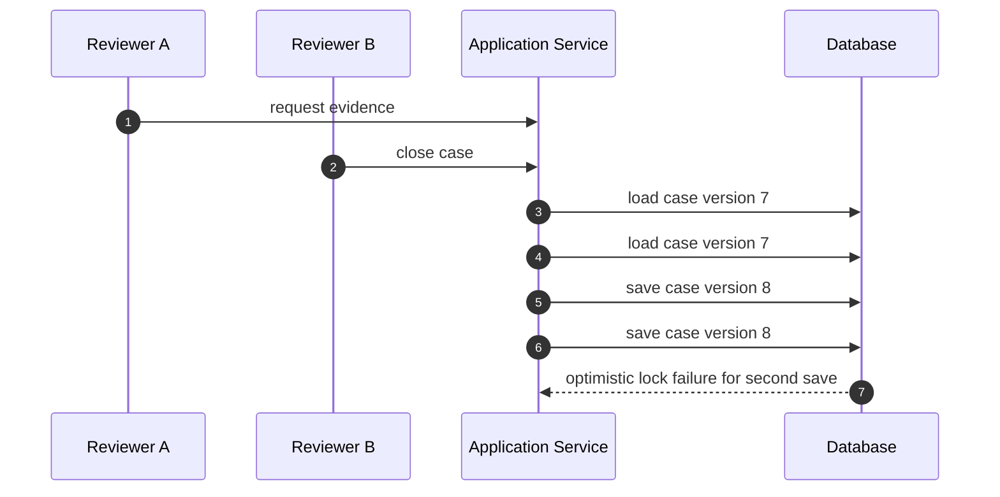
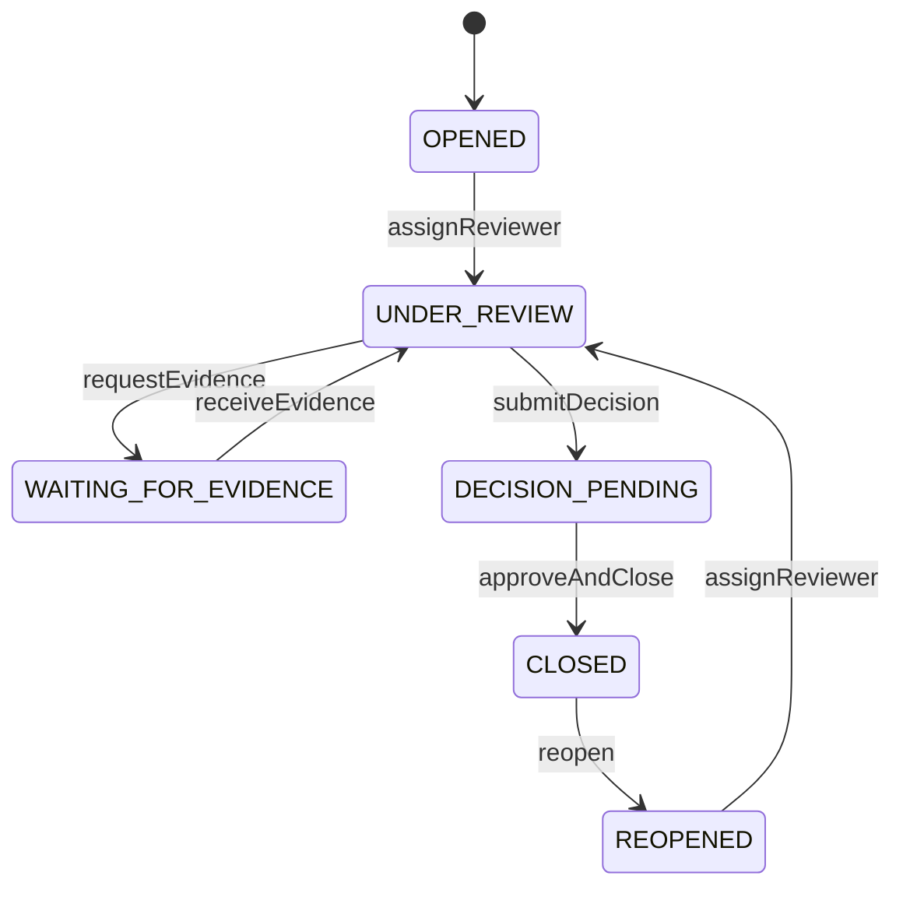

# Part 020 — Domain Model Inside Microservices

## 1. Core Problem

Banyak Java microservices punya package bernama `domain`, tetapi isinya bukan domain model. Isinya hanya data structure:

```java
public class CaseEntity {
    private UUID id;
    private String status;
    private UUID assignedTo;
    private Instant closedAt;
    private String closureReason;

    public UUID getId() { return id; }
    public void setId(UUID id) { this.id = id; }
    public String getStatus() { return status; }
    public void setStatus(String status) { this.status = status; }
    // getters/setters...
}
```

Lalu business logic berada di application service:

```java
if (!caseEntity.getStatus().equals("UNDER_REVIEW")) {
    throw new IllegalStateException("Case must be under review");
}

if (evidenceRequests.isEmpty()) {
    throw new IllegalArgumentException("Evidence request is required");
}

caseEntity.setStatus("WAITING_FOR_EVIDENCE");
caseEntity.setEvidenceDueDate(dueDate);
caseEntity.setUpdatedAt(now);
```

Ini disebut **anemic domain model**: object terlihat seperti domain object, tetapi behavior dan aturan bisnisnya tinggal di luar.

Masalahnya bukan karena semua sistem wajib memakai domain model yang kaya. Untuk CRUD sederhana, anemic model sering cukup. Masalah muncul ketika domain punya:

- lifecycle kompleks;
- aturan status ketat;
- invariant lintas field;
- policy bisnis yang berubah;
- auditability;
- regulatory defensibility;
- concurrency risk;
- event yang harus akurat;
- state transition yang tidak boleh sembarangan.

Dalam kondisi itu, domain model yang hanya getter/setter akan membuat business rule tersebar, sulit diuji, dan mudah dilanggar.

> Domain model bukan folder. Domain model adalah executable business language.

---

## 2. Mental Model: Domain Model as Invariant Engine

Domain model di microservice bukan miniatur seluruh enterprise. Ia adalah model lokal untuk bounded context tertentu.

Tugas domain model:

1. Menyatakan konsep bisnis dengan bahasa yang tepat.
2. Menjaga invariant yang harus selalu benar di dalam boundary service.
3. Mengatur state transition yang valid.
4. Menghasilkan domain event dari perubahan yang valid.
5. Menyembunyikan representasi internal agar tidak dimutasi sembarangan.
6. Membuat business behavior bisa dites tanpa database, HTTP, broker, atau framework.



Domain model yang baik membuat illegal state sulit atau mustahil dibuat.

---

## 3. Domain Model Is Not the Same as Database Entity

Di Java, terutama dengan JPA, banyak tim menyamakan domain model dengan database entity. Kadang ini cukup. Kadang ini merusak desain.

Ada tiga pendekatan umum.

### 3.1 JPA Entity as Domain Object

```java
@Entity
public class CaseFile {
    @Id
    private UUID id;

    @Enumerated(EnumType.STRING)
    private CaseStatus status;

    public void close(UserId actor, ClosureReason reason, Instant now) {
        ensureCanBeClosed();
        this.status = CaseStatus.CLOSED;
        this.closedBy = actor.value();
        this.closedAt = now;
        this.closureReason = reason.value();
    }
}
```

Kelebihan:

- lebih sedikit mapping;
- sederhana untuk tim kecil;
- mudah dengan Spring Data/JPA;
- cocok jika model persistence dan domain tidak terlalu berbeda.

Risiko:

- annotation persistence bocor ke domain;
- lazy loading memengaruhi behavior;
- constructor/setter dibuka demi framework;
- aggregate boundary bisa kabur karena relation JPA;
- domain test bisa tergantung persistence behavior.

### 3.2 Separate Domain Object and Persistence Entity

```text
domain/CaseFile.java
infrastructure/persistence/CaseFileJpaEntity.java
infrastructure/persistence/CaseFileMapper.java
```

Kelebihan:

- domain bersih dari framework;
- persistence detail tidak memengaruhi domain behavior;
- mapping bisa mengontrol aggregate loading;
- cocok untuk domain kompleks.

Risiko:

- ada biaya mapping;
- duplikasi field;
- mapper bisa menjadi kompleks;
- perlu disiplin agar mapping tidak mengandung business rule.

### 3.3 Hybrid

Beberapa aggregate sederhana memakai JPA entity langsung. Aggregate yang kompleks dipisah.

Ini sering pragmatis di enterprise.

Rule praktis:

> Jangan pilih “pure domain” karena terlihat elegan.  
> Jangan pilih “JPA entity as domain” karena cepat.  
> Pilih berdasarkan complexity, coupling risk, invariant density, dan team discipline.

---

## 4. Building Blocks

Domain model biasanya terdiri dari beberapa building block.



### 4.1 Aggregate Root

Aggregate root adalah entry point untuk perubahan state yang harus konsisten bersama.

Contoh:

```text
CaseFile
├── allegations
├── assignments
├── evidenceRequests
├── lifecycle status
└── domain events
```

Kode luar tidak boleh mengubah child entity secara langsung tanpa aggregate root.

### 4.2 Entity

Entity punya identity dan lifecycle.

Contoh:

```text
EvidenceRequest
- id
- requestedItem
- dueDate
- status
```

### 4.3 Value Object

Value object tidak punya identity. Ia valid karena value-nya.

Contoh:

```text
ClosureReason
DueDate
AllegationType
RiskScore
```

### 4.4 Domain Service / Policy

Domain service dipakai ketika behavior domain tidak natural berada di satu aggregate.

Contoh:

```text
DuplicateComplaintPolicy
PenaltyCalculationPolicy
EscalationEligibilityPolicy
```

### 4.5 Domain Event

Domain event menyatakan sesuatu yang sudah benar-benar terjadi dalam domain.

Contoh:

```text
CaseOpened
CaseAssigned
EvidenceRequested
DecisionApproved
CaseClosed
```

---

## 5. Aggregate as Consistency Boundary

Kesalahan umum: menganggap aggregate sebagai object graph besar.

Buruk:

```text
CaseFile
├── Party
├── Investigator
├── EvidenceDocument binary metadata
├── Decision
├── Payment
├── Notification
├── AuditLog
└── ExternalAgencySubmission
```

Ini menciptakan god aggregate.

Aggregate seharusnya dibentuk oleh invariant yang perlu konsisten dalam satu transaction.

Pertanyaan desain:

1. State apa yang harus berubah atomik?
2. Rule apa yang tidak boleh pernah dilanggar?
3. Data apa yang hanya perlu snapshot/reference?
4. Entity apa yang punya lifecycle independen?
5. Apakah concurrency akan tinggi jika semua disatukan?
6. Apakah aggregate ini terlalu sering diload untuk use case kecil?

Contoh boundary yang lebih sehat:

```text
Case Management Context
├── CaseFile aggregate
│   ├── allegations
│   ├── assignments
│   └── evidence requests metadata

Decision Context
├── EnforcementDecision aggregate
│   ├── decision status
│   ├── approval chain
│   └── decision rationale

Evidence Context
├── EvidenceRecord aggregate
│   ├── metadata
│   ├── chain of custody
│   └── retention policy
```

`CaseFile` boleh menyimpan `DecisionId` atau `EvidenceRecordId`, tetapi tidak harus memiliki semua object.

---

## 6. Invariant

Invariant adalah kondisi yang harus selalu benar untuk model tertentu.

Contoh invariant `CaseFile`:

- closed case tidak boleh menerima evidence request baru;
- case tidak boleh ditutup jika mandatory action belum selesai;
- due date evidence request harus di masa depan;
- investigator tidak boleh assigned dua kali secara aktif;
- reopened case harus punya reopening reason;
- escalation harus memiliki reason code.

Invariant bukan sekadar validation input. Invariant adalah aturan konsistensi domain.

### 6.1 Bad: Invariant Outside Domain

```java
if (caseFile.getStatus() == CaseStatus.CLOSED) {
    throw new IllegalStateException("Closed case cannot request evidence");
}

caseFile.getEvidenceRequests().add(new EvidenceRequest(...));
caseFile.setStatus(CaseStatus.WAITING_FOR_EVIDENCE);
```

### 6.2 Good: Invariant Inside Aggregate

```java
public void requestEvidence(
    ReviewerId reviewerId,
    List<EvidenceRequestItem> items,
    DueDate dueDate,
    Instant requestedAt
) {
    ensureUnderReview();
    ensureItemsProvided(items);
    ensureDueDateInFuture(dueDate, requestedAt);

    EvidenceRequest request = EvidenceRequest.create(
        EvidenceRequestId.newId(),
        reviewerId,
        items,
        dueDate,
        requestedAt
    );

    evidenceRequests.add(request);
    status = CaseStatus.WAITING_FOR_EVIDENCE;

    events.add(new EvidenceRequested(id, request.id(), dueDate.value(), requestedAt));
}
```

Sekarang tidak ada caller yang bisa request evidence tanpa melewati rule.

---

## 7. Designing a Rich Aggregate

Contoh aggregate `CaseFile`.

```java
package com.acme.enforcement.casefile.domain;

import java.time.Instant;
import java.util.ArrayList;
import java.util.List;
import java.util.Objects;

public final class CaseFile {

    private final CaseId id;
    private final ComplaintId complaintId;
    private final PartyId subjectPartyId;
    private CaseStatus status;
    private ReviewerId assignedReviewer;
    private final List<EvidenceRequest> evidenceRequests;
    private final List<DomainEvent> events;
    private long version;

    private CaseFile(
        CaseId id,
        ComplaintId complaintId,
        PartyId subjectPartyId,
        CaseStatus status,
        List<EvidenceRequest> evidenceRequests,
        long version
    ) {
        this.id = Objects.requireNonNull(id);
        this.complaintId = Objects.requireNonNull(complaintId);
        this.subjectPartyId = Objects.requireNonNull(subjectPartyId);
        this.status = Objects.requireNonNull(status);
        this.evidenceRequests = new ArrayList<>(evidenceRequests);
        this.events = new ArrayList<>();
        this.version = version;
    }

    public static CaseFile open(
        ComplaintId complaintId,
        PartyId subjectPartyId,
        UserId submittedBy,
        Instant openedAt
    ) {
        CaseFile caseFile = new CaseFile(
            CaseId.newId(),
            complaintId,
            subjectPartyId,
            CaseStatus.OPENED,
            List.of(),
            0
        );

        caseFile.events.add(new CaseOpened(
            caseFile.id,
            complaintId,
            subjectPartyId,
            submittedBy,
            openedAt
        ));

        return caseFile;
    }

    public static CaseFile rehydrate(
        CaseId id,
        ComplaintId complaintId,
        PartyId subjectPartyId,
        CaseStatus status,
        List<EvidenceRequest> evidenceRequests,
        long version
    ) {
        return new CaseFile(id, complaintId, subjectPartyId, status, evidenceRequests, version);
    }

    public void assignReviewer(ReviewerId reviewerId, UserId assignedBy, Instant assignedAt) {
        ensureNotClosed();
        ensureReviewerIsDifferent(reviewerId);

        this.assignedReviewer = reviewerId;
        this.status = CaseStatus.UNDER_REVIEW;

        events.add(new CaseReviewerAssigned(id, reviewerId, assignedBy, assignedAt));
    }

    public void requestEvidence(
        ReviewerId reviewerId,
        List<EvidenceRequestItem> items,
        DueDate dueDate,
        Instant requestedAt
    ) {
        ensureUnderReview();
        ensureAssignedReviewer(reviewerId);
        ensureItemsProvided(items);
        dueDate.ensureAfter(requestedAt);

        EvidenceRequest request = EvidenceRequest.create(
            EvidenceRequestId.newId(),
            reviewerId,
            items,
            dueDate,
            requestedAt
        );

        evidenceRequests.add(request);
        status = CaseStatus.WAITING_FOR_EVIDENCE;

        events.add(new EvidenceRequested(id, request.id(), dueDate.value(), requestedAt));
    }

    public void close(UserId actorId, ClosureReason reason, Instant closedAt) {
        ensureCanBeClosed();

        this.status = CaseStatus.CLOSED;

        events.add(new CaseClosed(id, actorId, reason, closedAt));
    }

    public List<DomainEvent> releaseEvents() {
        List<DomainEvent> released = List.copyOf(events);
        events.clear();
        return released;
    }

    public CaseId id() {
        return id;
    }

    public CaseStatus status() {
        return status;
    }

    public long version() {
        return version;
    }

    private void ensureNotClosed() {
        if (status == CaseStatus.CLOSED) {
            throw new DomainRuleViolation("CASE_ALREADY_CLOSED", "Closed case cannot be modified");
        }
    }

    private void ensureUnderReview() {
        if (status != CaseStatus.UNDER_REVIEW) {
            throw new DomainRuleViolation(
                "CASE_NOT_UNDER_REVIEW",
                "Evidence can only be requested while case is under review"
            );
        }
    }

    private void ensureAssignedReviewer(ReviewerId reviewerId) {
        if (!Objects.equals(assignedReviewer, reviewerId)) {
            throw new DomainRuleViolation(
                "REVIEWER_NOT_ASSIGNED",
                "Only the assigned reviewer can request evidence"
            );
        }
    }

    private void ensureReviewerIsDifferent(ReviewerId reviewerId) {
        if (Objects.equals(assignedReviewer, reviewerId)) {
            throw new DomainRuleViolation(
                "REVIEWER_ALREADY_ASSIGNED",
                "Reviewer is already assigned"
            );
        }
    }

    private void ensureItemsProvided(List<EvidenceRequestItem> items) {
        if (items == null || items.isEmpty()) {
            throw new DomainRuleViolation(
                "EVIDENCE_ITEMS_REQUIRED",
                "At least one evidence item is required"
            );
        }
    }

    private void ensureCanBeClosed() {
        ensureNotClosed();

        boolean hasOpenEvidenceRequest = evidenceRequests.stream()
            .anyMatch(EvidenceRequest::isOpen);

        if (hasOpenEvidenceRequest) {
            throw new DomainRuleViolation(
                "OPEN_EVIDENCE_REQUEST_EXISTS",
                "Case cannot be closed while evidence request is open"
            );
        }
    }
}
```

Hal penting:

- constructor private;
- factory method untuk state baru;
- `rehydrate` untuk repository;
- behavior bernama business intent;
- collection internal tidak diekspos mutable;
- event hanya muncul setelah state transition valid;
- rule failure memakai code yang stabil;
- aggregate tidak tahu HTTP, SQL, Kafka, atau Spring.

---

## 8. Value Object

Value object membuat invalid primitive sulit masuk ke domain.

### 8.1 Bad Primitive Obsession

```java
public void close(UUID actorId, String reason, Instant closedAt) { ... }
```

Masalah:

- reason bisa blank;
- actorId bisa salah jenis ID;
- tidak ada semantic;
- method signature tidak memberi informasi rule.

### 8.2 Good Value Object

```java
public record ClosureReason(String value) {

    public ClosureReason {
        if (value == null || value.isBlank()) {
            throw new DomainRuleViolation(
                "CLOSURE_REASON_REQUIRED",
                "Closure reason is required"
            );
        }

        if (value.length() > 500) {
            throw new DomainRuleViolation(
                "CLOSURE_REASON_TOO_LONG",
                "Closure reason must not exceed 500 characters"
            );
        }
    }
}
```

```java
public record DueDate(java.time.LocalDate value) {

    public void ensureAfter(Instant instant) {
        LocalDate today = instant.atZone(ZoneOffset.UTC).toLocalDate();
        if (!value.isAfter(today)) {
            throw new DomainRuleViolation(
                "DUE_DATE_MUST_BE_FUTURE",
                "Due date must be in the future"
            );
        }
    }
}
```

Value object membuat rule kecil terkonsentrasi.

---

## 9. Entity Inside Aggregate

Child entity boleh punya identity, tetapi mutation-nya tetap dikontrol aggregate root.

```java
public final class EvidenceRequest {

    private final EvidenceRequestId id;
    private final ReviewerId requestedBy;
    private final List<EvidenceRequestItem> items;
    private final DueDate dueDate;
    private EvidenceRequestStatus status;
    private final Instant requestedAt;

    private EvidenceRequest(
        EvidenceRequestId id,
        ReviewerId requestedBy,
        List<EvidenceRequestItem> items,
        DueDate dueDate,
        EvidenceRequestStatus status,
        Instant requestedAt
    ) {
        this.id = id;
        this.requestedBy = requestedBy;
        this.items = List.copyOf(items);
        this.dueDate = dueDate;
        this.status = status;
        this.requestedAt = requestedAt;
    }

    static EvidenceRequest create(
        EvidenceRequestId id,
        ReviewerId requestedBy,
        List<EvidenceRequestItem> items,
        DueDate dueDate,
        Instant requestedAt
    ) {
        return new EvidenceRequest(
            id,
            requestedBy,
            items,
            dueDate,
            EvidenceRequestStatus.OPEN,
            requestedAt
        );
    }

    boolean isOpen() {
        return status == EvidenceRequestStatus.OPEN;
    }

    EvidenceRequestId id() {
        return id;
    }
}
```

Perhatikan visibility method. Tidak semua method harus public. Jika child entity hanya digunakan oleh aggregate, biarkan package-private.

---

## 10. Domain Event

Domain event harus bernama past tense karena ia menyatakan fakta yang sudah terjadi.

Baik:

```text
CaseOpened
EvidenceRequested
DecisionApproved
CaseClosed
```

Kurang baik:

```text
OpenCase
RequestEvidence
ApproveDecision
CloseCase
```

Itu command, bukan event.

Contoh event:

```java
public sealed interface DomainEvent permits
    CaseOpened,
    EvidenceRequested,
    CaseClosed {

    String eventId();
    String aggregateId();
    Instant occurredAt();
    String eventType();
}

public record EvidenceRequested(
    String eventId,
    CaseId caseId,
    EvidenceRequestId evidenceRequestId,
    LocalDate dueDate,
    Instant occurredAt
) implements DomainEvent {

    public EvidenceRequested(CaseId caseId, EvidenceRequestId evidenceRequestId, LocalDate dueDate, Instant occurredAt) {
        this(UUID.randomUUID().toString(), caseId, evidenceRequestId, dueDate, occurredAt);
    }

    @Override
    public String aggregateId() {
        return caseId.value().toString();
    }

    @Override
    public String eventType() {
        return "evidence.requested";
    }
}
```

Domain event tidak harus sama persis dengan integration event. Domain event bisa internal; integration event bisa hasil mapping/publishing dengan schema contract tertentu.

---

## 11. Domain Service and Policy

Tidak semua rule harus dipaksa masuk aggregate.

Gunakan domain service/policy jika rule:

- membutuhkan beberapa aggregate;
- membutuhkan reference data domain;
- berupa calculation/policy kompleks;
- tidak mengubah state langsung;
- perlu reason code/explanation.

Contoh:

```java
public final class EscalationEligibilityPolicy {

    public EscalationDecision evaluate(CaseFile caseFile, RiskProfile riskProfile, Instant now) {
        if (caseFile.status() == CaseStatus.CLOSED) {
            return EscalationDecision.denied("CASE_CLOSED");
        }

        if (riskProfile.level() == RiskLevel.HIGH) {
            return EscalationDecision.allowed("HIGH_RISK_PARTY");
        }

        if (caseFile.daysOpenAt(now) > 30) {
            return EscalationDecision.allowed("CASE_AGE_EXCEEDED_THRESHOLD");
        }

        return EscalationDecision.denied("NO_ESCALATION_TRIGGER");
    }
}
```

Aggregate tetap bisa menerima hasil policy:

```java
caseFile.escalate(decision, actorId, now);
```

Jangan biarkan policy mengubah state aggregate dari luar secara bebas. Policy memberi keputusan; aggregate menjalankan state transition dan menjaga invariant.

---

## 12. Repository Boundary

Repository di domain/application boundary bukan DAO umum. Repository menyimpan dan mengambil aggregate.

```java
public interface CaseRepository {
    Optional<CaseFile> get(CaseId id);
    void save(CaseFile caseFile);
}
```

Jangan membuat repository menjadi query dumping ground:

```java
interface CaseRepository {
    List<CaseFile> findByStatusAndReviewerAndDateAndRiskAndRegion(...);
    List<CaseFile> findDashboardPage(...);
    List<CaseFile> findReportExport(...);
}
```

Untuk query, buat read model port terpisah:

```java
public interface CaseDashboardReadModel {
    Page<CaseDashboardRow> search(CaseDashboardFilter filter, PageRequest page);
}
```

Rule:

> Repository untuk aggregate lifecycle.  
> Read model untuk query shape.

---

## 13. Persistence Mapping

Jika domain object dipisahkan dari JPA entity, mapper harus bodoh. Mapper tidak boleh memutuskan business rule.

```java
class CaseFileMapper {

    CaseFile toDomain(CaseFileJpaEntity entity) {
        return CaseFile.rehydrate(
            CaseId.of(entity.id()),
            ComplaintId.of(entity.complaintId()),
            PartyId.of(entity.subjectPartyId()),
            CaseStatus.valueOf(entity.status()),
            entity.evidenceRequests().stream()
                .map(this::toDomain)
                .toList(),
            entity.version()
        );
    }

    CaseFileJpaEntity toEntity(CaseFile domain) {
        // map current state to persistence representation
        // no domain decision here
    }
}
```

Mapping smell:

```java
if (entity.status().equals("CLOSED") && entity.closedAt() == null) {
    entity.setClosedAt(Instant.now());
}
```

Ini business repair tersembunyi. Jangan letakkan di mapper.

---

## 14. Concurrency and Versioning

Aggregate boundary juga terkait concurrency.

Jika dua command mengubah aggregate yang sama bersamaan, butuh mekanisme versioning/optimistic locking.

Contoh flow:



Domain model menjaga business rule, tetapi database versioning menjaga concurrent update.

Dalam JPA:

```java
@Version
private long version;
```

Dalam domain object terpisah, repository adapter bisa membawa version field dan menggunakan optimistic update:

```sql
update case_file
set status = ?, version = version + 1
where id = ? and version = ?
```

Jika affected rows = 0, lempar conflict.

---

## 15. Aggregate Size Heuristic

Aggregate terlalu besar menyebabkan:

- lock contention;
- load lambat;
- transaction conflict tinggi;
- memory besar;
- coupling antar use case.

Aggregate terlalu kecil menyebabkan:

- invariant bocor ke application service;
- consistency sulit dijaga;
- terlalu banyak coordination;
- saga berlebihan.

Gunakan matrix:

| Pertanyaan | Jika Ya | Implikasi |
|---|---|---|
| Harus berubah atomik? | Ya | Pertimbangkan satu aggregate |
| Bisa eventually consistent? | Ya | Pisahkan aggregate/service |
| Diubah oleh actor/use case berbeda? | Ya | Waspadai aggregate terlalu besar |
| Query membutuhkan semua data? | Tidak | Jangan jadikan alasan satu aggregate |
| Invariant lintas object wajib real-time? | Ya | Satu aggregate atau local transaction |
| Data punya lifecycle independen? | Ya | Pisahkan aggregate |

---

## 16. Domain Model and Microservice Boundary

Domain model hanya berwenang atas data yang dimiliki service.

Buruk:

```java
public void approveDecision(Party party, PaymentAccount account, ExternalAgency agency) {
    // mutating multiple service-owned concepts
}
```

Jika `Party`, `PaymentAccount`, dan `ExternalAgency` dimiliki service lain, aggregate lokal tidak boleh berpura-pura mengontrol mereka.

Lebih baik:

```java
public void approveDecision(
    ApproverId approver,
    PartySnapshot partySnapshot,
    RiskAssessmentSnapshot riskAssessment,
    Instant approvedAt
) {
    ensureSubmitted();
    ensurePartyIsEligible(partySnapshot);
    ensureRiskAllowed(riskAssessment);
    transitionToApproved(approver, approvedAt);
}
```

Snapshot harus jelas:

- kapan diambil;
- dari sumber apa;
- berlaku untuk decision apa;
- apakah boleh stale;
- apakah perlu audit.

---

## 17. Avoiding Framework Leakage

Domain model sebaiknya tidak tahu:

- `ResponseEntity`;
- `HttpStatus`;
- `KafkaTemplate`;
- `EntityManager`;
- `JdbcTemplate`;
- `@RestController`;
- request header;
- JSON annotation yang tidak perlu;
- vendor SDK.

Boleh? Kadang annotation kecil seperti `@Embeddable` atau `@Entity` dipakai jika tim memilih JPA entity as domain. Tetapi pahami cost-nya.

Rule:

> Framework boleh membantu menjalankan domain. Framework tidak boleh menjadi bahasa domain.

---

## 18. Domain Exception Model

Domain exception harus menjelaskan rule yang dilanggar.

```java
public final class DomainRuleViolation extends RuntimeException {

    private final String code;

    public DomainRuleViolation(String code, String message) {
        super(message);
        this.code = code;
    }

    public String code() {
        return code;
    }
}
```

Contoh:

```java
throw new DomainRuleViolation(
    "CASE_NOT_UNDER_REVIEW",
    "Evidence can only be requested while case is under review"
);
```

Application layer dapat menerjemahkan domain exception menjadi application error jika perlu. Adapter menerjemahkan application error menjadi HTTP/gRPC/message outcome.

Jangan membuat domain exception seperti ini:

```java
throw new BadRequestException("bad request");
```

Itu transport concern.

---

## 19. Testing Domain Model

Domain model test harus cepat, deterministic, dan tanpa framework.

### 19.1 Test State Transition

```java
@Test
void assignedReviewerCanRequestEvidence() {
    CaseFile caseFile = CaseFileFixture.opened()
        .assignedTo(reviewerId)
        .underReview()
        .build();

    caseFile.requestEvidence(
        reviewerId,
        List.of(EvidenceRequestItem.of("bank statement")),
        new DueDate(LocalDate.parse("2026-08-01")),
        Instant.parse("2026-07-05T10:00:00Z")
    );

    assertThat(caseFile.status()).isEqualTo(CaseStatus.WAITING_FOR_EVIDENCE);
    assertThat(caseFile.releaseEvents())
        .anyMatch(event -> event instanceof EvidenceRequested);
}
```

### 19.2 Test Invariant

```java
@Test
void closedCaseCannotRequestEvidence() {
    CaseFile caseFile = CaseFileFixture.closed().build();

    assertThatThrownBy(() -> caseFile.requestEvidence(
        reviewerId,
        List.of(EvidenceRequestItem.of("bank statement")),
        new DueDate(LocalDate.parse("2026-08-01")),
        Instant.parse("2026-07-05T10:00:00Z")
    ))
    .isInstanceOf(DomainRuleViolation.class)
    .hasMessageContaining("Evidence can only be requested");
}
```

### 19.3 Test Value Object

```java
@Test
void closureReasonIsRequired() {
    assertThatThrownBy(() -> new ClosureReason(" "))
        .isInstanceOf(DomainRuleViolation.class);
}
```

Domain test tidak perlu Spring context. Jika perlu Spring untuk menguji domain rule, model terlalu bergantung pada framework.

---

## 20. State Machine Inside Domain

Jika entity punya lifecycle, buat state transition eksplisit.

Buruk:

```java
caseFile.setStatus(CaseStatus.CLOSED);
```

Baik:

```java
caseFile.close(actorId, reason, now);
```

State transition:



Domain method harus mengikuti transition ini.

Jika transition matrix makin kompleks, jangan sembunyikan dalam nested `if`. Gunakan:

- explicit transition table;
- state pattern;
- policy object;
- workflow engine jika process sudah long-running dan melibatkan timer/human task.

---

## 21. Domain Event vs Audit Event

Domain event dan audit event sering mirip, tetapi tujuannya berbeda.

| Jenis | Tujuan | Contoh |
|---|---|---|
| Domain Event | Menginformasikan perubahan domain | `CaseClosed` |
| Integration Event | Kontrak antar service | `case.closed.v1` |
| Audit Event | Bukti siapa melakukan apa dan kenapa | `User X closed case Y with reason Z` |
| Security Event | Monitoring akses/ancaman | `EvidenceAccessDenied` |

Satu domain behavior bisa menghasilkan lebih dari satu event type melalui layer berbeda.

Contoh:

```text
caseFile.close(...)
├── domain event: CaseClosed
├── outbox integration event: case.closed.v1
└── audit trail: CASE_CLOSED_BY_USER
```

Jangan mengandalkan broker event sebagai satu-satunya audit trail untuk sistem regulatory. Audit membutuhkan durability, queryability, retention, dan semantic evidence chain.

---

## 22. Domain Model Smells

### 22.1 Getter/Setter Domain

```java
case.setStatus(CLOSED);
case.setClosedAt(now);
```

Perbaikan:

```java
case.close(actor, reason, now);
```

### 22.2 Enum Without Behavior

Jika status enum hanya dicek di mana-mana:

```java
if (status == A || status == B || status == C) { ... }
```

Pertimbangkan method:

```java
status.ensureAllowsEvidenceRequest();
```

atau state transition policy.

### 22.3 Aggregate Knows Too Much

Jika aggregate butuh 10 repository/client, itu bukan aggregate. Itu application service/process manager yang menyamar.

### 22.4 Domain Calls External API

Buruk:

```java
riskClient.getScore(...)
```

langsung dari aggregate.

Perbaikan:

- application service mengambil risk score;
- domain menerima snapshot/value object;
- policy mengevaluasi.

### 22.5 Public Mutable Collection

Buruk:

```java
public List<EvidenceRequest> getEvidenceRequests() {
    return evidenceRequests;
}
```

Perbaikan:

```java
public List<EvidenceRequestView> evidenceRequests() {
    return evidenceRequests.stream().map(EvidenceRequestView::from).toList();
}
```

atau tidak expose sama sekali jika tidak dibutuhkan.

### 22.6 Domain Event Created Outside Behavior

Buruk:

```java
caseFile.setStatus(CLOSED);
outbox.append(new CaseClosed(caseFile.id()));
```

Perbaikan:

```java
caseFile.close(actor, reason, now);
outbox.append(caseFile.releaseEvents());
```

---

## 23. Practical Design Workflow

Saat membuat domain model untuk microservice baru:

1. Tulis lifecycle state.
2. Tulis command yang mengubah state.
3. Tulis invariant untuk setiap transition.
4. Tentukan aggregate root.
5. Tentukan value object untuk primitive penting.
6. Tentukan domain event yang muncul dari transition.
7. Tentukan repository boundary.
8. Tentukan read model terpisah jika query shape kompleks.
9. Tulis domain tests sebelum adapter.
10. Baru tentukan persistence mapping.

Urutan ini mencegah database schema mendikte domain terlalu awal.

---

## 24. Mini Case Study: Evidence Request

### 24.1 Lifecycle

```text
CaseFile: UNDER_REVIEW
Command: RequestEvidence
Result: CaseFile WAITING_FOR_EVIDENCE
Event: EvidenceRequested
```

### 24.2 Invariants

- case harus `UNDER_REVIEW`;
- requester harus assigned reviewer;
- item tidak boleh kosong;
- due date harus masa depan;
- tidak boleh ada request duplicate aktif untuk item yang sama;
- closed case tidak boleh berubah.

### 24.3 Domain API

```java
caseFile.requestEvidence(
    reviewerId,
    List.of(EvidenceRequestItem.of("transaction records")),
    new DueDate(LocalDate.parse("2026-08-01")),
    now
);
```

API ini jauh lebih baik daripada:

```java
caseFile.setStatus(WAITING_FOR_EVIDENCE);
caseFile.getEvidenceRequests().add(...);
```

Karena method pertama membawa intent dan rule; method kedua hanya mutation.

---

## 25. Architecture Review Checklist

Saat review domain model, gunakan checklist ini:

- [ ] Apakah class domain punya behavior, bukan hanya data?
- [ ] Apakah invariant utama dijaga di domain?
- [ ] Apakah state transition memakai method bernama business intent?
- [ ] Apakah primitive penting dibungkus value object?
- [ ] Apakah collection internal terlindungi?
- [ ] Apakah aggregate root mengontrol child entity?
- [ ] Apakah aggregate terlalu besar?
- [ ] Apakah aggregate memanggil external API?
- [ ] Apakah domain event dibuat setelah transition valid?
- [ ] Apakah repository menyimpan aggregate, bukan menjadi query dumping ground?
- [ ] Apakah test domain bisa jalan tanpa Spring/database?
- [ ] Apakah persistence mapping tidak mengandung business rule?
- [ ] Apakah versioning/concurrency sudah dipikirkan?
- [ ] Apakah event/audit/security event tidak dicampur sembarangan?

---

## 26. Exercise

Desain domain model untuk aggregate:

```text
EnforcementDecision
```

Requirements:

- decision dibuat dalam status `DRAFT`;
- hanya author yang bisa mengubah draft;
- draft bisa disubmit untuk approval;
- author tidak boleh approve decision sendiri;
- approval membutuhkan reason;
- decision dengan severity tinggi membutuhkan second approval;
- approved decision tidak boleh diedit;
- rejected decision bisa direvisi dengan revision reason;
- setiap transition menghasilkan domain event;
- semua rule bisa dites tanpa database.

Deliverables:

1. state diagram;
2. aggregate fields;
3. value objects;
4. domain methods;
5. domain events;
6. invariant test cases;
7. repository interface;
8. concurrency/versioning strategy.

---

## 27. Key Takeaways

Domain model di microservice tidak harus besar, tetapi harus cukup kuat untuk menjaga rule yang memang milik service tersebut.

Mental model utama:

> Aggregate is a consistency boundary.  
> Value object protects meaning.  
> Domain method expresses intent.  
> Invariant lives near the state it protects.  
> Domain event records a valid fact.  
> Repository persists aggregate lifecycle.  
> Application service coordinates but does not become the domain brain.

Jika domain model hanya getter/setter, microservice akan terlihat rapi di diagram tetapi rapuh di perubahan nyata. Jika domain model terlalu besar, microservice akan menjadi monolith kecil yang sulit diskalakan.

Desain domain model yang baik berada di tengah: cukup kaya untuk menjaga invariant, cukup kecil untuk tetap operable, dan cukup eksplisit untuk bisa dipahami engineer lain.

---

## References

- Martin Fowler — Domain Model: https://martinfowler.com/eaaCatalog/domainModel.html
- Martin Fowler — Anemic Domain Model: https://martinfowler.com/bliki/AnemicDomainModel.html
- Martin Fowler — Domain-Driven Design tag: https://martinfowler.com/tags/domain%20driven%20design.html
- Spring Framework Reference — Transaction Propagation: https://docs.spring.io/spring-framework/reference/data-access/transaction/declarative/tx-propagation.html
