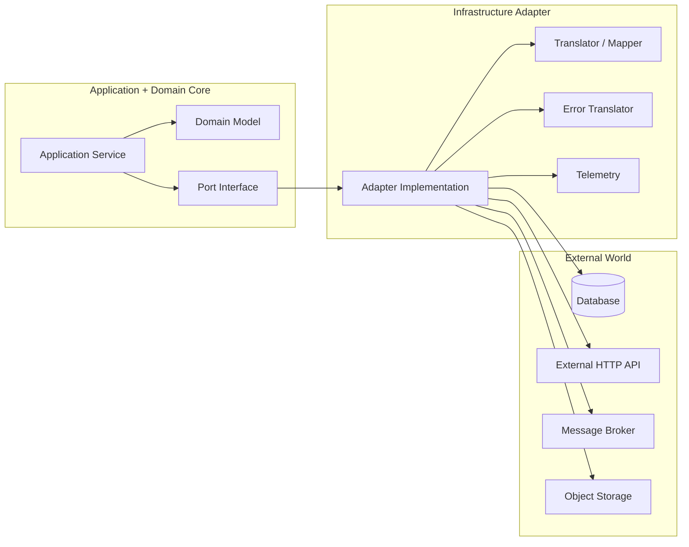
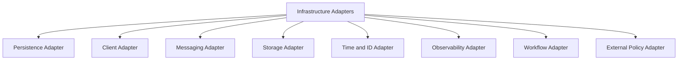
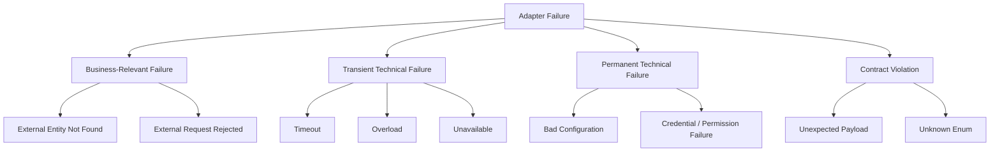
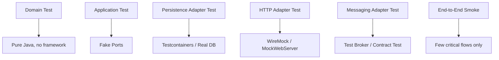

# Part 021 — Infrastructure Adapters in Java

## 1. Core Problem

Di Part 017 kita sudah membahas arah dependency. Di Part 019 dan 020 kita memisahkan application service dan domain model. Sekarang masalahnya menjadi lebih praktis:

> Bagaimana Java service berbicara dengan database, HTTP API, broker, object storage, workflow engine, dan library eksternal tanpa membuat domain ikut tercemar oleh detail infrastruktur?

Banyak service gagal bukan karena tidak tahu membuat `Repository`, `WebClient`, atau `KafkaProducer`. Mereka gagal karena adapter-nya tidak punya boundary yang jelas.

Contoh yang sering terlihat:

```java
@Service
public class CaseAssessmentService {
    private final JdbcTemplate jdbcTemplate;
    private final WebClient sanctionsClient;
    private final KafkaTemplate<String, Object> kafkaTemplate;

    public void assess(UUID caseId) {
        Map<String, Object> row = jdbcTemplate.queryForMap(
            "select * from cases where id = ?", caseId
        );

        SanctionsResponse response = sanctionsClient.get()
            .uri("/sanctions?partyId=" + row.get("party_id"))
            .retrieve()
            .bodyToMono(SanctionsResponse.class)
            .block();

        if (response.status().equals("MATCH_FOUND")) {
            jdbcTemplate.update("update cases set status = 'ESCALATED' where id = ?", caseId);
            kafkaTemplate.send("case-events", new CaseEscalatedEvent(caseId));
        }
    }
}
```

Kode ini bekerja. Tetapi secara arsitektur, ia mencampur:

- business use case;
- SQL shape;
- remote API contract;
- message broker detail;
- blocking behavior;
- external status semantics;
- event publication;
- transaction ordering;
- error handling;
- observability.

Akibatnya, test harus memakai database/API/broker palsu sekaligus. Domain logic sulit dibaca. Perubahan contract eksternal bisa merusak application service. Error remote API bocor sebagai business decision. Dan yang paling berbahaya: service terlihat sederhana, tetapi sebenarnya punya coupling tersembunyi.

Infrastructure adapter adalah boundary yang mengubah detail dunia luar menjadi bahasa lokal service.

---

## 2. Mental Model: Adapter as Semantic Firewall

Adapter bukan hanya wrapper library.

Adapter adalah **semantic firewall** antara core service dan dunia luar.



Core hanya boleh tahu:

- apa kemampuan yang dibutuhkan;
- apa input/output lokalnya;
- apa failure yang bermakna bagi use case;
- apa contract konsistensi yang dijanjikan.

Adapter boleh tahu:

- nama table;
- SQL;
- HTTP path;
- JSON field;
- header;
- timeout;
- retry policy;
- broker topic;
- partition key;
- vendor SDK;
- serialization format;
- pagination token;
- low-level exception.

Boundary yang sehat menjawab pertanyaan ini:

> Jika vendor API berubah, berapa banyak package domain/application yang harus berubah?

Jawaban ideal: nol atau hampir nol.

---

## 3. What Is a Port?

Port adalah interface yang diekspresikan dalam bahasa service lokal. Port tidak boleh berbicara dalam bahasa teknologi.

Buruk:

```java
public interface SanctionsHttpClient {
    SanctionsApiResponse getSanctions(String partyId);
}
```

Lebih baik:

```java
public interface SanctionsScreeningPort {
    ScreeningResult screen(PartyRef partyRef, ScreeningContext context);
}
```

Perbedaan mental model:

| Buruk | Baik |
|---|---|
| `HttpClient` | `SanctionsScreeningPort` |
| `ApiResponse` | `ScreeningResult` |
| `String partyId` | `PartyRef` |
| Remote API shape bocor | Domain capability terlihat |
| Transport-first | Capability-first |

Port bukan dibuat untuk menyenangkan pattern. Port dibuat agar core service tetap berbicara dalam bahasa bisnis.

### 3.1 Port Should Represent Need, Not Implementation

Application service membutuhkan kemampuan:

- menyimpan aggregate;
- mengambil case berdasarkan ID;
- memeriksa sanctions risk;
- menerbitkan integration event;
- membuat audit record;
- membaca waktu saat ini;
- menghasilkan ID.

Itu semua bisa menjadi port.

```java
public interface CaseFileRepository {
    Optional<CaseFile> findById(CaseId id);
    void save(CaseFile caseFile);
}

public interface CaseEventPublisher {
    void publish(List<DomainEvent> events);
}

public interface ClockPort {
    Instant now();
}

public interface IdGenerator {
    CaseId newCaseId();
}
```

Port yang baik tidak menyebut `JPA`, `Kafka`, `S3`, `REST`, atau `Redis`, kecuali istilah itu memang bagian dari domain, bukan detail teknologi.

---

## 4. Taxonomy of Infrastructure Adapters

Dalam Java microservices, adapter biasanya jatuh ke beberapa kategori.



### 4.1 Persistence Adapter

Tugasnya mengubah domain object menjadi persistence representation dan sebaliknya.

Contoh port:

```java
public interface CaseFileRepository {
    Optional<CaseFile> findById(CaseId id);
    void save(CaseFile caseFile);
}
```

Contoh adapter:

```java
@Repository
final class PostgresCaseFileRepository implements CaseFileRepository {
    private final CaseFileJpaRepository jpaRepository;
    private final CaseFilePersistenceMapper mapper;

    PostgresCaseFileRepository(
        CaseFileJpaRepository jpaRepository,
        CaseFilePersistenceMapper mapper
    ) {
        this.jpaRepository = jpaRepository;
        this.mapper = mapper;
    }

    @Override
    public Optional<CaseFile> findById(CaseId id) {
        return jpaRepository.findById(id.value())
            .map(mapper::toDomain);
    }

    @Override
    public void save(CaseFile caseFile) {
        CaseFileEntity entity = mapper.toEntity(caseFile);
        jpaRepository.save(entity);
    }
}
```

Adapter tahu JPA. Domain tidak.

### 4.2 Client Adapter

Tugasnya memanggil service eksternal dan menerjemahkan response menjadi result lokal.

```java
public interface PartyRiskPort {
    PartyRiskSnapshot getRiskSnapshot(PartyId partyId);
}
```

```java
@Component
final class HttpPartyRiskAdapter implements PartyRiskPort {
    private final WebClient webClient;
    private final PartyRiskMapper mapper;

    HttpPartyRiskAdapter(
        @Qualifier("partyRiskWebClient") WebClient webClient,
        PartyRiskMapper mapper
    ) {
        this.webClient = webClient;
        this.mapper = mapper;
    }

    @Override
    public PartyRiskSnapshot getRiskSnapshot(PartyId partyId) {
        try {
            PartyRiskApiResponse response = webClient.get()
                .uri(uriBuilder -> uriBuilder
                    .path("/v1/parties/{partyId}/risk")
                    .build(partyId.value()))
                .retrieve()
                .bodyToMono(PartyRiskApiResponse.class)
                .block();

            return mapper.toDomain(response);
        } catch (WebClientResponseException.NotFound e) {
            throw new ExternalPartyNotFoundException(partyId, e);
        } catch (WebClientResponseException.TooManyRequests e) {
            throw new ExternalDependencyOverloadedException("party-risk", e);
        } catch (WebClientRequestException e) {
            throw new ExternalDependencyUnavailableException("party-risk", e);
        }
    }
}
```

Catatan penting: contoh di atas sengaja sederhana. Blocking `.block()` bisa diterima dalam aplikasi servlet/thread-per-request jika dibatasi oleh timeout dan thread budget. Dalam stack reactive, `.block()` biasanya smell. Keputusan ini harus konsisten dengan runtime model service, bukan dipilih acak.

### 4.3 Messaging Adapter

Messaging adapter punya dua sisi:

- outbound publisher;
- inbound consumer.

Outbound port:

```java
public interface IntegrationEventPublisher {
    void publishCaseEvents(List<CaseIntegrationEvent> events);
}
```

Outbound adapter:

```java
@Component
final class KafkaCaseEventPublisher implements IntegrationEventPublisher {
    private final KafkaTemplate<String, CaseEventEnvelope> kafkaTemplate;
    private final CaseEventEnvelopeMapper mapper;

    @Override
    public void publishCaseEvents(List<CaseIntegrationEvent> events) {
        for (CaseIntegrationEvent event : events) {
            CaseEventEnvelope envelope = mapper.toEnvelope(event);
            kafkaTemplate.send("case.integration-events", envelope.aggregateId(), envelope);
        }
    }
}
```

Inbound adapter:

```java
@Component
final class PartyUpdatedKafkaConsumer {
    private final PartyEventMapper mapper;
    private final HandlePartyUpdatedUseCase useCase;

    @KafkaListener(topics = "party.integration-events")
    void onMessage(PartyEventEnvelope envelope) {
        PartyUpdatedCommand command = mapper.toCommand(envelope);
        useCase.handle(command);
    }
}
```

Inbound adapter tidak boleh langsung memutasi repository. Ia menerjemahkan message menjadi command/use case lokal.

### 4.4 Storage Adapter

Object storage, file storage, document repository, dan blob storage harus punya port lokal.

```java
public interface EvidenceDocumentStore {
    StoredDocumentRef store(EvidenceDocument document);
    Optional<EvidenceDocument> retrieve(StoredDocumentRef ref);
}
```

Jangan biarkan `S3Object`, `BlobClient`, atau vendor SDK object masuk ke domain.

### 4.5 Time and ID Adapter

Waktu dan ID sering dianggap trivial. Padahal keduanya memengaruhi testability, ordering, audit, dan idempotency.

```java
public interface TimeSource {
    Instant now();
}

@Component
final class SystemTimeSource implements TimeSource {
    @Override
    public Instant now() {
        return Instant.now();
    }
}
```

Di test:

```java
final class FixedTimeSource implements TimeSource {
    private final Instant fixed;

    FixedTimeSource(Instant fixed) {
        this.fixed = fixed;
    }

    @Override
    public Instant now() {
        return fixed;
    }
}
```

Ini kecil, tetapi membuat domain test deterministik.

---

## 5. Adapter Boundary Rules

Gunakan aturan ini sebagai invariant arsitektur.

### Rule 1 — External DTO Must Stop at Adapter Boundary

Buruk:

```java
public class CaseAssessmentApplicationService {
    public void assess(SanctionsApiResponse response) {
        if (response.getStatus().equals("MATCH_FOUND")) {
            // business decision
        }
    }
}
```

Baik:

```java
public record ScreeningResult(
    ScreeningOutcome outcome,
    RiskScore score,
    String providerReference
) {}
```

Application service melihat `ScreeningResult`, bukan `SanctionsApiResponse`.

### Rule 2 — Low-Level Exception Must Be Translated

Jangan biarkan error seperti ini bocor:

- `SQLException`;
- `DataIntegrityViolationException`;
- `WebClientResponseException`;
- `JsonProcessingException`;
- `TimeoutException`;
- `KafkaException`;
- vendor SDK exception.

Translate menjadi exception yang bermakna untuk use case.

```java
public sealed class ExternalDependencyException extends RuntimeException
    permits ExternalDependencyUnavailableException,
            ExternalDependencyOverloadedException,
            ExternalDependencyRejectedRequestException {

    private final String dependencyName;

    protected ExternalDependencyException(String dependencyName, Throwable cause) {
        super("External dependency failed: " + dependencyName, cause);
        this.dependencyName = dependencyName;
    }

    public String dependencyName() {
        return dependencyName;
    }
}
```

### Rule 3 — Adapter Owns Protocol Mechanics

Application service tidak boleh tahu:

- header HTTP apa yang dipakai;
- topic broker apa yang dipakai;
- SQL join apa yang dibutuhkan;
- pagination token vendor;
- retryable status code;
- idempotency header eksternal;
- serialization format.

Application service hanya tahu capability.

### Rule 4 — Adapter Must Preserve Local Semantics

Jika external system memakai status `PENDING_REVIEW`, tetapi service lokal memakai `UNDER_ASSESSMENT`, mapping harus eksplisit.

```java
enum ExternalCaseStatus {
    PENDING_REVIEW,
    APPROVED,
    REJECTED,
    CANCELLED
}

enum LocalAssessmentStatus {
    UNDER_ASSESSMENT,
    ACCEPTED,
    REFUSED,
    WITHDRAWN
}
```

```java
final class AssessmentStatusMapper {
    LocalAssessmentStatus toLocal(ExternalCaseStatus status) {
        return switch (status) {
            case PENDING_REVIEW -> LocalAssessmentStatus.UNDER_ASSESSMENT;
            case APPROVED -> LocalAssessmentStatus.ACCEPTED;
            case REJECTED -> LocalAssessmentStatus.REFUSED;
            case CANCELLED -> LocalAssessmentStatus.WITHDRAWN;
        };
    }
}
```

Mapping seperti ini terlihat membosankan. Justru inilah tempat corruption sering dicegah.

---

## 6. Persistence Adapter Design

Persistence adapter sering menjadi adapter paling rumit karena ia menyentuh consistency, transaction, locking, query shape, dan database schema.

### 6.1 Repository Port Should Be Aggregate-Oriented

Buruk:

```java
public interface CaseRepository {
    CaseEntity findCase(UUID id);
    List<EvidenceEntity> findEvidence(UUID caseId);
    List<PartyEntity> findParties(UUID caseId);
    void updateStatus(UUID id, String status);
    void insertAudit(UUID id, String action);
}
```

Repository ini berbasis table dan operation teknis.

Lebih baik:

```java
public interface CaseFileRepository {
    Optional<CaseFile> findById(CaseId id);
    void save(CaseFile caseFile);
}
```

Application service tidak perlu tahu bahwa `CaseFile` disimpan di 4 table.

### 6.2 Query Side Can Have Separate Port

Jangan paksa semua query melewati aggregate repository. Read model boleh punya port sendiri.

```java
public interface CaseDashboardQuery {
    Page<CaseDashboardRow> findOpenCases(CaseDashboardFilter filter, PageRequest pageRequest);
}
```

```java
@Repository
final class JdbcCaseDashboardQuery implements CaseDashboardQuery {
    private final NamedParameterJdbcTemplate jdbc;

    @Override
    public Page<CaseDashboardRow> findOpenCases(
        CaseDashboardFilter filter,
        PageRequest pageRequest
    ) {
        // optimized SQL for dashboard read model
    }
}
```

Ini bukan pelanggaran domain purity. Query side memang boleh optimized untuk kebutuhan baca. Yang penting jangan membuat command-side invariant bergantung pada query projection yang stale.

### 6.3 Optimistic Locking Belongs to Persistence + Application Boundary

Domain bisa punya version field, tetapi konflik version biasanya muncul dari persistence adapter.

```java
public record AggregateVersion(long value) {
    public AggregateVersion {
        if (value < 0) {
            throw new IllegalArgumentException("version must not be negative");
        }
    }
}
```

Adapter menerjemahkan optimistic locking exception:

```java
catch (ObjectOptimisticLockingFailureException e) {
    throw new ConcurrentModificationDetectedException(caseFile.id(), e);
}
```

Application service lalu memutuskan:

- fail fast;
- retry use case;
- return conflict response;
- publish reconciliation task.

Jangan menyembunyikan concurrency conflict sebagai generic 500.

---

## 7. HTTP Client Adapter Design

HTTP client adapter harus memodelkan remote dependency sebagai dependency yang bisa gagal sebagian.

### 7.1 Define a Local Port

```java
public interface OrganizationRegistryPort {
    OrganizationSnapshot getOrganization(OrganizationId id);
}
```

`OrganizationSnapshot` adalah local read snapshot, bukan response mentah.

```java
public record OrganizationSnapshot(
    OrganizationId id,
    OrganizationName name,
    OrganizationStatus status,
    Instant lastVerifiedAt
) {}
```

### 7.2 Configure Client Once, Use Everywhere

```java
@Configuration
class OrganizationRegistryClientConfig {

    @Bean
    WebClient organizationRegistryWebClient(
        WebClient.Builder builder,
        OrganizationRegistryProperties properties
    ) {
        return builder
            .baseUrl(properties.baseUrl().toString())
            .defaultHeader("Accept", "application/json")
            .build();
    }
}
```

Timeout tidak boleh disebar di setiap method. Ia bagian dari runtime contract dependency. Part 040 akan membahas timeout/deadline lebih dalam; di sini cukup pegang prinsipnya: adapter adalah tempat pertama untuk mengikat client behavior ke dependency contract.

### 7.3 Translate Status Code to Local Failure

```java
private RuntimeException translate(WebClientResponseException e, OrganizationId id) {
    return switch (e.getStatusCode().value()) {
        case 404 -> new OrganizationNotFoundException(id, e);
        case 409 -> new OrganizationRegistryConflictException(id, e);
        case 429 -> new ExternalDependencyOverloadedException("organization-registry", e);
        default -> {
            if (e.getStatusCode().is5xxServerError()) {
                yield new ExternalDependencyUnavailableException("organization-registry", e);
            }
            yield new ExternalDependencyRejectedRequestException("organization-registry", e);
        }
    };
}
```

Jangan membuat application service memeriksa HTTP status.

---

## 8. Message Adapter Design

Message adapter sering merusak boundary karena payload message langsung dipakai sebagai domain object.

### 8.1 Inbound Message Must Become Local Command

```java
public record PartyRiskChangedMessage(
    String eventId,
    String partyId,
    String riskLevel,
    String occurredAt
) {}
```

Jangan masukkan message ini langsung ke domain.

```java
final class PartyRiskChangedMessageMapper {
    ReassessCaseRiskCommand toCommand(PartyRiskChangedMessage message) {
        return new ReassessCaseRiskCommand(
            EventId.of(message.eventId()),
            PartyId.of(message.partyId()),
            RiskLevel.parse(message.riskLevel()),
            Instant.parse(message.occurredAt())
        );
    }
}
```

### 8.2 Inbound Adapter Must Handle Duplicate and Poison Message

Minimal inbound adapter perlu memikirkan:

- message ID;
- idempotency;
- schema version;
- deserialization failure;
- validation failure;
- retryable vs non-retryable error;
- dead letter behavior;
- observability.

Detail outbox/inbox akan dibahas di Part 035. Tetapi sejak adapter, kita sudah harus menyediakan seam yang jelas.

```java
@Component
final class PartyRiskChangedConsumer {
    private final InboxPort inbox;
    private final PartyRiskChangedMessageMapper mapper;
    private final ReassessCaseRiskUseCase useCase;

    @KafkaListener(topics = "party.risk-events")
    void consume(PartyRiskChangedMessage message) {
        MessageId messageId = MessageId.of(message.eventId());

        if (inbox.alreadyProcessed(messageId)) {
            return;
        }

        ReassessCaseRiskCommand command = mapper.toCommand(message);
        useCase.handle(command);
        inbox.markProcessed(messageId);
    }
}
```

### 8.3 Outbound Adapter Should Not Decide Business Meaning

Buruk:

```java
if (caseFile.status() == CaseStatus.ESCALATED) {
    kafkaTemplate.send("regulatory-alerts", ...);
}
```

Jika keputusan "status escalated harus menghasilkan alert" adalah aturan bisnis, jangan sembunyikan di Kafka adapter. Application/domain harus menghasilkan event atau command yang eksplisit.

Adapter hanya mengirim.

---

## 9. Mapper Is Not Just Boilerplate

Mapper sering dianggap noise. Dalam architecture boundary, mapper adalah kontrol semantic.

Mapper menjawab:

- field mana yang boleh masuk;
- field mana yang harus diabaikan;
- nilai eksternal mana yang harus dianggap unknown;
- enum mana yang tidak kompatibel;
- default mana yang aman;
- format waktu mana yang diterima;
- apakah precision hilang;
- apakah ID eksternal bisa dipercaya.

### 9.1 Unknown Value Handling

```java
public RiskLevel toRiskLevel(String value) {
    return switch (value) {
        case "LOW" -> RiskLevel.LOW;
        case "MEDIUM" -> RiskLevel.MEDIUM;
        case "HIGH" -> RiskLevel.HIGH;
        default -> throw new UnknownExternalValueException("riskLevel", value);
    };
}
```

Dalam beberapa domain, unknown harus reject. Dalam domain lain, unknown boleh mapped ke `UNKNOWN` agar sistem tetap berjalan. Itu keputusan bisnis/operasional, bukan keputusan mapper acak.

### 9.2 Lossy Mapping Must Be Visible

Jika external API punya 12 status dan domain lokal hanya punya 4 status, mapping itu lossy. Dokumentasikan.

```java
/**
 * Lossy mapping:
 * External statuses MANUAL_REVIEW and AUTOMATED_REVIEW both map to UNDER_REVIEW.
 * We intentionally collapse them because Case Assessment only needs review visibility,
 * not review origin.
 */
AssessmentStatus toLocal(ExternalStatus status) { ... }
```

Lossy mapping yang diam-diam adalah awal corruption.

---

## 10. Adapter Error Model

Core service tidak perlu tahu semua detail error. Tetapi core harus tahu failure yang memengaruhi keputusan use case.

Buat taxonomy lokal.



Contoh sealed hierarchy:

```java
public sealed interface DependencyFailure
    permits BusinessDependencyFailure,
            TransientDependencyFailure,
            PermanentDependencyFailure,
            ContractDependencyFailure {

    String dependencyName();
}
```

Tujuan taxonomy:

- application service bisa membedakan `not found` vs `dependency down`;
- API layer bisa mapping ke response yang benar;
- retry policy bisa dibatasi;
- alert bisa lebih akurat;
- runbook bisa jelas.

---

## 11. Adapter Observability

Adapter adalah tempat terbaik untuk melihat hubungan service dengan dunia luar.

Setiap adapter penting harus menghasilkan signal:

- dependency name;
- operation name;
- latency;
- success/failure;
- failure category;
- remote status code jika aman;
- retry count;
- timeout count;
- payload size jika relevan;
- message lag jika messaging;
- row count jika query berat;
- correlation ID / trace context.

Contoh log event:

```json
{
  "event": "external_dependency_call_completed",
  "dependency": "organization-registry",
  "operation": "getOrganization",
  "outcome": "failure",
  "failureCategory": "overloaded",
  "statusCode": 429,
  "latencyMs": 183,
  "correlationId": "b57f2f6e-8bb7-4f8b-9c82-..."
}
```

Jangan hanya log:

```text
Error calling API
```

Log seperti itu tidak membantu incident response.

---

## 12. Package Structure for Adapters

Contoh struktur yang cukup scalable:

```text
src/main/java/com/acme/caseassessment/
  casefile/
    application/
      SubmitCaseUseCase.java
      EscalateCaseUseCase.java
      port/
        CaseFileRepository.java
        CaseEventPublisher.java
        PartyRiskPort.java
    domain/
      CaseFile.java
      CaseStatus.java
      CaseEscalated.java
    infrastructure/
      persistence/
        PostgresCaseFileRepository.java
        CaseFileEntity.java
        CaseFileJpaRepository.java
        CaseFilePersistenceMapper.java
      client/
        partyrisk/
          HttpPartyRiskAdapter.java
          PartyRiskApiResponse.java
          PartyRiskMapper.java
          PartyRiskClientProperties.java
      messaging/
        KafkaCaseEventPublisher.java
        CaseEventEnvelope.java
        CaseEventEnvelopeMapper.java
```

Perhatikan:

- port berada dekat application layer;
- adapter berada di infrastructure;
- DTO eksternal berada bersama adapter;
- mapper berada bersama adapter;
- domain tidak import infrastructure.

Jika memakai multi-module build, dependency direction bisa dibuat lebih keras:

```text
case-assessment-domain
case-assessment-application -> domain
case-assessment-infrastructure -> application, domain
case-assessment-api -> application, domain
```

---

## 13. Dependency Injection Rule

Framework seperti Spring boleh mengikat port ke adapter, tetapi jangan membuat core bergantung pada Spring.

Baik:

```java
@Service
final class SubmitCaseApplicationService implements SubmitCaseUseCase {
    private final CaseFileRepository repository;
    private final TimeSource timeSource;
    private final CaseEventPublisher eventPublisher;

    SubmitCaseApplicationService(
        CaseFileRepository repository,
        TimeSource timeSource,
        CaseEventPublisher eventPublisher
    ) {
        this.repository = repository;
        this.timeSource = timeSource;
        this.eventPublisher = eventPublisher;
    }
}
```

Lebih bersih lagi, jika ingin domain/application bebas framework, pindahkan annotation ke configuration class:

```java
@Configuration
class CaseFileApplicationConfig {
    @Bean
    SubmitCaseUseCase submitCaseUseCase(
        CaseFileRepository repository,
        TimeSource timeSource,
        CaseEventPublisher eventPublisher
    ) {
        return new SubmitCaseApplicationService(repository, timeSource, eventPublisher);
    }
}
```

Keputusan ini trade-off. Pada banyak tim Spring Boot, annotation di application service masih acceptable. Yang harus dihindari adalah domain object penuh dengan `@Autowired`, `WebClient`, `JdbcTemplate`, dan `KafkaTemplate`.

---

## 14. Adapter Testing Strategy

Adapter test berbeda dari domain test.



### 14.1 Application Test Uses Fake Adapter

```java
final class InMemoryCaseFileRepository implements CaseFileRepository {
    private final Map<CaseId, CaseFile> data = new HashMap<>();

    @Override
    public Optional<CaseFile> findById(CaseId id) {
        return Optional.ofNullable(data.get(id));
    }

    @Override
    public void save(CaseFile caseFile) {
        data.put(caseFile.id(), caseFile);
    }
}
```

Application test tidak butuh PostgreSQL jika yang diuji adalah orchestration rule.

### 14.2 Persistence Adapter Test Uses Real Database Behavior

Persistence adapter test harus menangkap:

- SQL syntax;
- schema mapping;
- constraint;
- transaction behavior;
- lock behavior;
- timezone behavior;
- JSON/array column behavior;
- migration compatibility.

Mocking `JpaRepository` biasanya tidak memberi banyak nilai untuk adapter persistence. Yang penting justru behavior database nyata.

### 14.3 HTTP Adapter Test Uses Stub Server

HTTP adapter test harus menangkap:

- path;
- query parameter;
- header;
- serialization;
- status mapping;
- timeout behavior;
- unknown field tolerance;
- error body parsing.

### 14.4 Mapper Test Is Worth It

Mapper test bukan test remeh jika mapping-nya semantic.

```java
@Test
void mapsExternalPendingReviewToLocalUnderAssessment() {
    var mapper = new AssessmentStatusMapper();

    assertThat(mapper.toLocal(ExternalCaseStatus.PENDING_REVIEW))
        .isEqualTo(LocalAssessmentStatus.UNDER_ASSESSMENT);
}
```

---

## 15. Common Smells

### 15.1 DTO Leak

Gejala:

- `ApiResponse` dipakai di application service;
- `JpaEntity` dipakai di domain;
- `KafkaMessage` dipakai sebagai command internal;
- `S3Object` dipakai di domain model.

Dampak:

- contract eksternal menjadi contract internal;
- test menjadi berat;
- perubahan vendor menyebar.

### 15.2 Generic Adapter

```java
public interface ExternalApiClient {
    Object call(String endpoint, Object request);
}
```

Ini bukan port. Ini transport abstraction yang kehilangan semantic.

### 15.3 God Integration Service

```text
integration/
  ExternalIntegrationService.java
```

Satu class memanggil semua dependency. Ia menjadi mini ESB di dalam service.

### 15.4 Hidden Business Rule in Mapper

Mapper diam-diam membuat keputusan penting:

```java
if (externalRisk == null) {
    return RiskLevel.LOW;
}
```

Default seperti ini bisa fatal. Null eksternal tidak otomatis berarti low risk.

### 15.5 Adapter Does Retry Without Idempotency Awareness

Adapter menambahkan retry karena ingin resilient, tetapi operation remote tidak idempotent. Hasilnya duplicate submission.

Retry adalah design decision, bukan dekorasi.

### 15.6 Adapter Swallows Failure

```java
try {
    client.send(...);
} catch (Exception e) {
    log.warn("failed", e);
}
```

Jika event penting hilang, audit chain bisa rusak. Adapter tidak boleh menelan failure tanpa contract eksplisit.

---

## 16. Architecture Review Questions

Gunakan pertanyaan ini ketika review adapter.

1. Apa port yang diekspresikan dalam bahasa lokal service?
2. Apakah port merepresentasikan capability atau teknologi?
3. Apakah DTO eksternal berhenti di adapter?
4. Apakah low-level exception diterjemahkan?
5. Apakah mapper menangani unknown/invalid/lossy mapping secara eksplisit?
6. Apakah timeout/retry/idempotency berada pada tempat yang benar?
7. Apakah adapter punya observability cukup?
8. Apakah application service bisa dites dengan fake port?
9. Apakah persistence adapter menjaga aggregate boundary?
10. Apakah inbound message diterjemahkan menjadi command lokal?
11. Apakah adapter menyembunyikan business rule?
12. Apakah dependency name dan operation name jelas untuk incident response?
13. Apakah adapter contract didokumentasikan?
14. Apakah perubahan vendor/API eksternal bisa dibatasi ke package adapter?

---

## 17. Minimal Adapter Design Template

Setiap adapter penting sebaiknya punya dokumen kecil:

```md
# Adapter: Organization Registry Client

## Purpose
Provide organization snapshot needed by Case Assessment.

## Local Port
OrganizationRegistryPort#getOrganization(OrganizationId)

## External Dependency
organization-registry-service / GET /v1/organizations/{id}

## Local Semantics
- 404 means organization does not exist.
- 429 means dependency overloaded.
- 5xx means dependency unavailable.
- Unknown organization status is contract violation.

## Timeout / Retry
- Timeout: 300ms connect, 800ms total.
- Retry: none for read during synchronous case submission.
- Fallback: not allowed; assessment must fail closed.

## Observability
- metric: dependency.call.duration
- tags: dependency=organization-registry, operation=getOrganization, outcome
- log event on failure category

## Test Coverage
- success mapping
- 404 mapping
- 429 mapping
- 5xx mapping
- unknown enum mapping
- invalid payload
```

Ini sederhana, tetapi membuat adapter dapat direview.

---

## 18. Practical Java Example: End-to-End Adapter Boundary

### 18.1 Port

```java
package com.acme.caseassessment.casefile.application.port;

public interface SanctionsScreeningPort {
    ScreeningResult screen(PartyRef partyRef, CaseRef caseRef);
}
```

### 18.2 Domain Result

```java
package com.acme.caseassessment.casefile.application.port;

public record ScreeningResult(
    ScreeningOutcome outcome,
    RiskScore riskScore,
    ExternalReference providerReference
) {
    public boolean requiresEscalation() {
        return outcome == ScreeningOutcome.MATCH_FOUND || riskScore.isHigh();
    }
}
```

### 18.3 Adapter DTO

```java
package com.acme.caseassessment.casefile.infrastructure.client.sanctions;

record SanctionsApiResponse(
    String requestId,
    String result,
    int score,
    String matchedList,
    String evaluatedAt
) {}
```

### 18.4 Mapper

```java
final class SanctionsScreeningMapper {
    ScreeningResult toDomain(SanctionsApiResponse response) {
        return new ScreeningResult(
            mapOutcome(response.result()),
            RiskScore.of(response.score()),
            ExternalReference.of(response.requestId())
        );
    }

    private ScreeningOutcome mapOutcome(String result) {
        return switch (result) {
            case "NO_MATCH" -> ScreeningOutcome.NO_MATCH;
            case "MATCH" -> ScreeningOutcome.MATCH_FOUND;
            case "POSSIBLE_MATCH" -> ScreeningOutcome.POSSIBLE_MATCH;
            default -> throw new ExternalContractViolationException(
                "sanctions-screening",
                "Unknown screening result: " + result
            );
        };
    }
}
```

### 18.5 Adapter

```java
@Component
final class HttpSanctionsScreeningAdapter implements SanctionsScreeningPort {
    private final WebClient client;
    private final SanctionsScreeningMapper mapper;

    HttpSanctionsScreeningAdapter(
        @Qualifier("sanctionsWebClient") WebClient client,
        SanctionsScreeningMapper mapper
    ) {
        this.client = client;
        this.mapper = mapper;
    }

    @Override
    public ScreeningResult screen(PartyRef partyRef, CaseRef caseRef) {
        try {
            SanctionsApiResponse response = client.post()
                .uri("/v1/screenings")
                .bodyValue(new SanctionsScreeningRequest(
                    partyRef.value(),
                    caseRef.value()
                ))
                .retrieve()
                .bodyToMono(SanctionsApiResponse.class)
                .block();

            return mapper.toDomain(response);
        } catch (WebClientResponseException.TooManyRequests e) {
            throw new ExternalDependencyOverloadedException("sanctions-screening", e);
        } catch (WebClientResponseException e) {
            throw new ExternalDependencyUnavailableException("sanctions-screening", e);
        } catch (RuntimeException e) {
            throw new ExternalDependencyUnavailableException("sanctions-screening", e);
        }
    }
}
```

### 18.6 Application Service Uses Only Port

```java
final class SubmitCaseApplicationService implements SubmitCaseUseCase {
    private final CaseFileRepository repository;
    private final SanctionsScreeningPort sanctionsScreening;
    private final TimeSource timeSource;

    @Override
    public SubmitCaseResult submit(SubmitCaseCommand command) {
        CaseFile caseFile = CaseFile.open(command.caseId(), command.partyRef(), timeSource.now());

        ScreeningResult result = sanctionsScreening.screen(command.partyRef(), command.caseRef());
        caseFile.recordScreeningResult(result);

        repository.save(caseFile);
        return SubmitCaseResult.accepted(caseFile.id());
    }
}
```

Tidak ada `WebClient`, DTO eksternal, HTTP status code, atau vendor status string di application service.

---

## 19. What Good Looks Like

Infrastructure adapter yang baik membuat sistem punya properti berikut:

- domain bisa dites tanpa infrastructure;
- application service membaca seperti use case bisnis;
- perubahan API eksternal terlokalisasi;
- mapping semantic terlihat;
- error taxonomy jelas;
- observability dependency kuat;
- contract runtime bisa direview;
- duplicate, timeout, dan invalid payload tidak mengejutkan;
- developer baru bisa menemukan letak integrasi dengan cepat.

> Adapter yang baik bukan adapter yang paling generic. Adapter yang baik adalah adapter yang paling jujur tentang semantic boundary.

---

## 20. Practice Drill

Ambil satu service yang kamu miliki. Pilih satu integrasi eksternal paling penting.

Jawab:

1. Apa capability lokal yang sebenarnya dibutuhkan?
2. Apa nama port yang tepat?
3. Apa DTO eksternal yang saat ini bocor?
4. Apa mapping yang lossy?
5. Apa unknown value yang belum ditangani?
6. Apa low-level exception yang masih bocor?
7. Apa failure yang retryable?
8. Apa failure yang harus fail-fast?
9. Apa metric/log yang dibutuhkan saat incident?
10. Package mana yang akan berubah jika external API berubah?

Jika jawaban nomor 10 adalah “banyak package”, adapter boundary belum sehat.

---

## 21. Key Takeaways

- Infrastructure adapter adalah semantic firewall, bukan sekadar wrapper library.
- Port harus merepresentasikan capability lokal, bukan teknologi eksternal.
- DTO eksternal, low-level exception, dan protocol detail harus berhenti di adapter.
- Mapper adalah tempat penting untuk menjaga semantic compatibility.
- Adapter harus punya error taxonomy, observability, dan testing strategy sendiri.
- Inbound message harus diterjemahkan menjadi command lokal.
- Outbound adapter tidak boleh menyembunyikan business rule.
- Adapter boundary yang sehat membuat service lebih mudah diuji, diubah, dan dioperasikan.

---

## References

- Alistair Cockburn — Hexagonal Architecture / Ports and Adapters: https://alistair.cockburn.us/hexagonal-architecture/
- Spring Framework Reference — WebClient: https://docs.spring.io/spring-framework/reference/web/webflux-webclient.html
- Spring Boot Reference — Testing and auto-configuration concepts: https://docs.spring.io/spring-boot/reference/
- Martin Fowler — Domain Model: https://martinfowler.com/eaaCatalog/domainModel.html
- Microsoft Azure Architecture Center — Anti-Corruption Layer Pattern: https://learn.microsoft.com/en-us/azure/architecture/patterns/anti-corruption-layer
