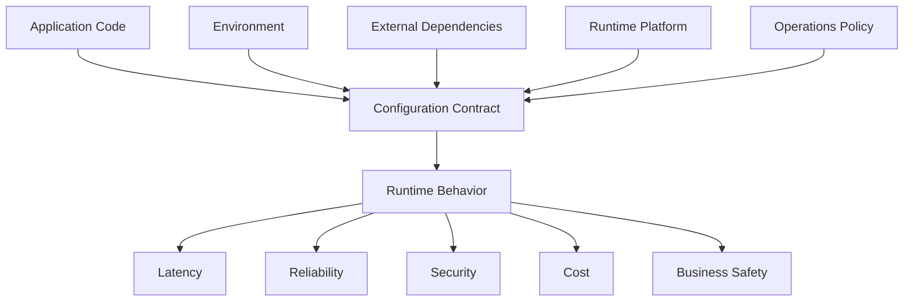
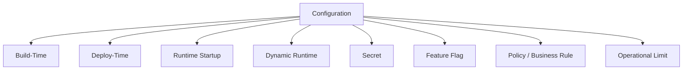

# Part 022 — Configuration as Runtime Contract

## 1. Core Problem

Banyak engineer memperlakukan konfigurasi sebagai detail kecil:

```yaml
some:
  timeout: 3000
  retry: true
  url: https://api.example.com
```

Lalu service berjalan, sampai production incident terjadi:

- timeout terlalu besar sehingga thread habis;
- retry aktif untuk operation non-idempotent;
- feature flag salah environment;
- base URL menunjuk dependency staging;
- secret expired tetapi service tetap dianggap healthy;
- default config development terbawa ke production;
- queue consumer concurrency terlalu tinggi;
- max pool size lebih besar dari database connection budget;
- config map berubah tetapi service tidak reload;
- property typo diam-diam diabaikan.

Configuration bukan “file pendukung”. Configuration adalah **runtime contract** antara code, environment, dependency, platform, dan operator.

> Code menentukan kemampuan service. Configuration menentukan bagaimana kemampuan itu dijalankan di environment nyata.

Jika configuration tidak tervalidasi, tidak terdokumentasi, dan tidak observable, service kamu punya behavior tersembunyi.

---

## 2. Mental Model: Configuration Defines Runtime Behavior

Konfigurasi mengikat keputusan arsitektur ke runtime.



Contoh:

- `payment.client.timeout=200ms` bukan sekadar angka; itu menyatakan berapa lama request boleh menunggu dependency payment.
- `case.workflow.escalation-window=3d` bukan sekadar durasi; itu menyatakan SLA bisnis.
- `consumer.max-concurrency=16` bukan sekadar tuning; itu menyatakan load yang akan diberikan ke downstream dan database.
- `feature.auto-close-case.enabled=true` bukan sekadar flag; itu mengubah business behavior.

Karena itu configuration harus diperlakukan seperti API:

- punya nama yang stabil;
- punya tipe;
- punya validasi;
- punya default yang aman;
- punya documentation;
- punya owner;
- punya compatibility policy;
- punya observability;
- punya change control.

---

## 3. Configuration Taxonomy

Tidak semua konfigurasi sama. Kesalahan umum adalah menyimpan semua hal sebagai property biasa.



### 3.1 Build-Time Configuration

Contoh:

- target Java version;
- dependency version;
- generated client option;
- build profile;
- native image build flag.

Build-time config berubah melalui build artifact. Jangan berharap bisa mengubahnya tanpa rebuild.

### 3.2 Deploy-Time Configuration

Contoh:

- environment name;
- region;
- base URL dependency;
- database host;
- broker bootstrap server;
- Kubernetes resource limit.

Deploy-time config diubah saat deployment.

### 3.3 Runtime Startup Configuration

Contoh:

- connection pool size;
- HTTP client timeout;
- worker concurrency;
- cache max size;
- enabled modules;
- topic name.

Biasanya dibaca saat startup dan tidak berubah sampai process restart.

### 3.4 Dynamic Runtime Configuration

Contoh:

- feature flag;
- traffic percentage;
- throttling limit;
- temporary kill switch;
- routing weight.

Dynamic config bisa berubah saat process hidup. Karena itu ia butuh propagation model, cache TTL, audit trail, dan fallback behavior.

### 3.5 Secret

Contoh:

- database password;
- API key;
- private key;
- OAuth client secret;
- signing material.

Secret bukan config biasa. Ia butuh lifecycle, rotation, redaction, access control, dan tidak boleh tampil di logs/actuator/config report.

### 3.6 Feature Flag

Feature flag bukan replacement untuk design. Flag adalah mechanism untuk mengontrol exposure atau behavior sementara.

Feature flag harus punya:

- owner;
- purpose;
- expiry date;
- rollout plan;
- fallback behavior;
- observability;
- cleanup task.

Flag permanen berubah menjadi distributed configuration debt.

### 3.7 Policy / Business Rule Configuration

Contoh:

```yaml
case:
  escalation:
    max-review-days: 14
    high-risk-auto-escalate: true
```

Ini bukan tuning teknis. Ini policy bisnis. Perubahan nilainya bisa mengubah keputusan sistem. Treat with governance.

### 3.8 Operational Limit

Contoh:

```yaml
case:
  submission:
    max-payload-size: 2MB
    max-open-cases-per-party: 10
worker:
  concurrency: 8
client:
  timeout: 800ms
```

Operational limit menjaga sistem dari overload, abuse, dan runaway workload.

---

## 4. Configuration Contract Principles

### Principle 1 — Explicit Over Implicit

Buruk:

```java
int timeout = Integer.parseInt(System.getenv().getOrDefault("TIMEOUT", "30000"));
```

Lebih baik:

```java
@ConfigurationProperties(prefix = "dependency.organization-registry")
@Validated
public record OrganizationRegistryProperties(
    @NotNull URI baseUrl,
    @NotNull Duration connectTimeout,
    @NotNull Duration responseTimeout,
    @Min(0) int maxRetries
) {}
```

Konfigurasi punya nama, tipe, dan validasi.

### Principle 2 — Safe Default, Not Convenient Default

Default development sering tidak aman untuk production.

Buruk:

```yaml
audit:
  enabled: false
```

Jika default ini terbawa ke production, audit hilang.

Lebih baik:

```yaml
audit:
  enabled: true
```

Untuk development, override secara eksplisit.

Safe default berarti service gagal aman, bukan berjalan mudah.

### Principle 3 — Fail Fast on Invalid Configuration

Jika config tidak valid, service harus gagal saat startup, bukan gagal di request production pertama.

Contoh:

```java
@ConfigurationProperties(prefix = "case.workflow")
@Validated
public record CaseWorkflowProperties(
    @NotNull Duration evidenceSubmissionWindow,
    @NotNull Duration escalationReviewWindow
) {
    public CaseWorkflowProperties {
        if (evidenceSubmissionWindow.compareTo(escalationReviewWindow) > 0) {
            throw new IllegalArgumentException(
                "evidenceSubmissionWindow must not exceed escalationReviewWindow"
            );
        }
    }
}
```

### Principle 4 — Configuration Must Be Observable

Operator harus bisa menjawab:

- service berjalan di environment apa;
- dependency URL apa yang dipakai;
- timeout/retry berapa;
- feature flag mana yang aktif;
- config version/hash berapa;
- secret version apa yang digunakan tanpa melihat secret value;
- config source mana yang menang.

Tetapi observability harus redacted.

### Principle 5 — Configuration Change Is Behavior Change

Perubahan config harus diperlakukan sebagai perubahan behavior. Minimal:

- tercatat di deployment/change log;
- bisa di-rollback;
- punya owner;
- punya blast radius jelas;
- punya validation.

---

## 5. 12-Factor Config, But With Engineering Discipline

Twelve-Factor App menekankan pemisahan config dari code dan menyimpan config yang berbeda antar deploy di environment. Prinsip ini berguna, tetapi tidak cukup jika diterapkan secara literal tanpa typed contract.

Environment variable baik untuk portability. Namun raw env var punya risiko:

- semua nilai string;
- typo mudah tidak terlihat;
- tidak ada schema;
- sulit memvalidasi relationship antar property;
- secret mudah tercetak;
- naming bisa tidak konsisten.

Karena itu di Java microservice, env var sebaiknya masuk ke structured typed configuration.

```text
ENVIRONMENT VARIABLE
        ↓
Spring / MicroProfile config source
        ↓
Typed properties object
        ↓
Validation
        ↓
Runtime component
```

Jangan biarkan raw env var tersebar di kode.

---

## 6. Spring Boot Configuration Model

Spring Boot mendukung externalized configuration dari berbagai source seperti properties file, YAML, environment variables, command-line arguments, dan lain-lain. Untuk service production-grade, gunakan `@ConfigurationProperties` dibanding menyebar `@Value` ke banyak class.

### 6.1 Prefer `@ConfigurationProperties`

Buruk:

```java
@Component
class OrganizationRegistryClient {
    @Value("${organization.url}")
    private String url;

    @Value("${organization.timeout}")
    private int timeout;
}
```

Masalah:

- property tersebar;
- tipe sering primitif/string;
- validasi sulit;
- documentation sulit;
- test setup rapuh;
- refactoring susah.

Lebih baik:

```java
@ConfigurationProperties(prefix = "dependency.organization-registry")
@Validated
public record OrganizationRegistryProperties(
    @NotNull URI baseUrl,
    @NotNull Duration connectTimeout,
    @NotNull Duration responseTimeout,
    @Min(0) @Max(3) int maxRetries,
    @NotBlank String operationName
) {}
```

```java
@Configuration
@EnableConfigurationProperties(OrganizationRegistryProperties.class)
class OrganizationRegistryClientConfiguration {

    @Bean
    WebClient organizationRegistryWebClient(
        WebClient.Builder builder,
        OrganizationRegistryProperties properties
    ) {
        return builder
            .baseUrl(properties.baseUrl().toString())
            .build();
    }
}
```

### 6.2 Use Duration and DataSize Types

Buruk:

```yaml
client:
  timeout: 3000
upload:
  max-size: 10485760
```

Apa satuannya? Milliseconds? Seconds? Bytes? KB?

Lebih baik:

```yaml
client:
  timeout: 800ms
upload:
  max-size: 10MB
```

```java
public record UploadProperties(
    @NotNull DataSize maxSize,
    @NotNull Duration scanTimeout
) {}
```

Configuration harus mengurangi ambiguity.

### 6.3 Validate Relationships, Not Only Fields

Bean Validation menangkap field-level constraint. Banyak runtime contract butuh cross-field validation.

```java
@ConfigurationProperties(prefix = "worker")
@Validated
public record WorkerProperties(
    @Min(1) int minConcurrency,
    @Min(1) int maxConcurrency,
    @NotNull Duration pollInterval
) {
    public WorkerProperties {
        if (minConcurrency > maxConcurrency) {
            throw new IllegalArgumentException(
                "worker.minConcurrency must be <= worker.maxConcurrency"
            );
        }
    }
}
```

### 6.4 Avoid Profile Explosion

Spring profiles berguna, tetapi terlalu banyak profile membuat behavior sulit ditebak.

Smell:

```text
application-dev.yml
application-local.yml
application-local-docker.yml
application-test.yml
application-staging.yml
application-uat.yml
application-prod.yml
application-prod-blue.yml
application-prod-green.yml
application-prod-region-a.yml
application-prod-region-b.yml
```

Masalahnya bukan jumlah file saja. Masalahnya konfigurasi behavior tersebar dan sulit diketahui source mana yang menang.

Lebih baik:

- gunakan base config untuk invariant global;
- environment override hanya untuk perbedaan environment;
- feature flag tidak disembunyikan di profile;
- secret tidak disimpan di repo;
- validasi config berjalan di semua environment;
- generate config report yang redacted.

---

## 7. MicroProfile Config Model

Jika menggunakan Jakarta EE/MicroProfile runtime, MicroProfile Config menyediakan model konfigurasi yang menggabungkan multiple config sources menjadi satu view. Spec ini mendukung source seperti system properties, environment variables, property files, dan custom config sources.

Contoh:

```java
@Inject
@ConfigProperty(name = "dependency.organization-registry.base-url")
URI baseUrl;
```

Untuk service besar, tetap hindari menyebar config injection mentah ke seluruh code. Buat configuration object lokal.

```java
@ApplicationScoped
public class OrganizationRegistryConfig {
    private final URI baseUrl;
    private final Duration responseTimeout;

    @Inject
    public OrganizationRegistryConfig(
        @ConfigProperty(name = "dependency.organization-registry.base-url") URI baseUrl,
        @ConfigProperty(name = "dependency.organization-registry.response-timeout") Duration responseTimeout
    ) {
        this.baseUrl = Objects.requireNonNull(baseUrl);
        this.responseTimeout = Objects.requireNonNull(responseTimeout);
        validate();
    }

    private void validate() {
        if (responseTimeout.isNegative() || responseTimeout.isZero()) {
            throw new IllegalArgumentException("response-timeout must be positive");
        }
    }

    public URI baseUrl() { return baseUrl; }
    public Duration responseTimeout() { return responseTimeout; }
}
```

Framework berbeda, prinsip sama:

- bind;
- type;
- validate;
- expose safely;
- avoid raw config scattered everywhere.

---

## 8. Config Naming Discipline

Nama config adalah API internal. Buat hierarchical, meaningful, dan stable.

Buruk:

```yaml
url: https://example.com
timeout: 500
retry: true
enabled: true
```

Baik:

```yaml
dependency:
  organization-registry:
    base-url: https://organization-registry.internal
    connect-timeout: 200ms
    response-timeout: 800ms
    max-retries: 1
    circuit-breaker-enabled: true

case:
  workflow:
    evidence-submission-window: 14d
    escalation-review-window: 3d
```

Naming rule:

1. Prefix berdasarkan ownership atau capability.
2. Hindari nama generic seperti `enabled` tanpa context.
3. Gunakan satuan eksplisit.
4. Pisahkan dependency config dari business policy.
5. Jangan ubah nama tanpa compatibility plan.
6. Jangan reuse satu property untuk dua meaning.

---

## 9. Configuration Schema as Documentation

Setiap config penting harus terdokumentasi. Minimal:

| Property | Type | Default | Required | Owner | Meaning | Safe Range |
|---|---:|---:|---:|---|---|---|
| `dependency.organization-registry.base-url` | URI | none | yes | platform/team | endpoint service registry organisasi | internal HTTPS URL |
| `dependency.organization-registry.response-timeout` | Duration | `800ms` | yes | owning service | max wait for registry response | `100ms-2s` |
| `case.workflow.evidence-submission-window` | Duration | none | yes | business/product | window user submit evidence | `1d-30d` |
| `worker.max-concurrency` | int | `4` | yes | service owner | max worker threads | <= DB pool budget |

Untuk konfigurasi operasional besar, simpan metadata ini dekat code:

```java
@ConfigurationProperties(prefix = "dependency.organization-registry")
public record OrganizationRegistryProperties(...) {}
```

Lalu generate metadata/documentation jika framework mendukung. Yang penting: config tidak menjadi folklore.

---

## 10. Fail-Fast Startup Validation

Startup validation harus menjawab:

- property wajib ada;
- URI valid;
- duration positif;
- numeric range benar;
- relationship antar property valid;
- secret reference tersedia;
- dependency config tidak menunjuk environment yang salah;
- dangerous combination ditolak.

Contoh dangerous combination:

```yaml
payment:
  submit:
    retry-enabled: true
    idempotency-enabled: false
```

Startup harus menolak:

```java
@ConfigurationProperties(prefix = "payment.submit")
public record PaymentSubmitProperties(
    boolean retryEnabled,
    boolean idempotencyEnabled
) {
    public PaymentSubmitProperties {
        if (retryEnabled && !idempotencyEnabled) {
            throw new IllegalArgumentException(
                "payment.submit.retry-enabled requires idempotency-enabled"
            );
        }
    }
}
```

Ini contoh kecil dari architectural invariant dalam configuration.

---

## 11. Secrets Are Not Normal Configuration

Secret harus diperlakukan berbeda.

Rules:

1. Jangan commit secret ke repo.
2. Jangan log secret.
3. Jangan expose secret di actuator/config endpoint.
4. Jangan kirim secret ke error reporting tool.
5. Jangan salin secret ke domain object.
6. Jangan simpan secret sebagai plain text jika platform menyediakan secret manager.
7. Pastikan rotation punya strategy.
8. Pastikan client bisa recover saat secret berubah, atau restart plan jelas.

Contoh config object:

```java
public record DatabaseCredentialProperties(
    @NotBlank String username,
    @NotBlank SecretRef passwordRef
) {}

public record SecretRef(String value) {
    @Override
    public String toString() {
        return "<redacted>";
    }
}
```

Jangan membuat `toString()` config mencetak secret.

### 11.1 Secret Version as Observable Metadata

Yang boleh terlihat:

```json
{
  "databaseCredential": {
    "username": "case_service",
    "passwordSecretVersion": "v17",
    "status": "loaded"
  }
}
```

Yang tidak boleh terlihat:

```json
{
  "password": "actual-password"
}
```

---

## 12. Configuration and Kubernetes Runtime

Dalam Kubernetes, config biasanya masuk melalui:

- environment variables;
- ConfigMap;
- Secret;
- mounted files;
- command-line args;
- service discovery/DNS;
- downward API;
- operator/controller.

Tetapi ingat:

> Kubernetes menyediakan delivery mechanism. Ia tidak otomatis membuat configuration contract sehat.

Kamu tetap perlu:

- typed binding di Java;
- validation;
- safe defaults;
- redaction;
- config hash/version;
- rollout behavior;
- readiness semantics.

### 12.1 Config Change Usually Needs Restart

Banyak Java apps membaca config saat startup. Jika ConfigMap berubah tetapi pod tidak restart, service masih memakai config lama.

Karena itu perlu strategy:

- immutable config + rollout restart;
- config hash annotation di deployment;
- dynamic config library dengan watch/reload;
- explicit admin reload endpoint;
- sidecar/controller.

Jangan menganggap “ConfigMap sudah diubah” berarti process Java sudah berubah behavior.

### 12.2 Resource Limits Are Also Runtime Contract

Memory dan CPU limit memengaruhi JVM behavior.

Config service tidak lengkap jika hanya melihat `application.yml`. Runtime contract juga mencakup:

```yaml
resources:
  requests:
    cpu: "500m"
    memory: "512Mi"
  limits:
    cpu: "1"
    memory: "1Gi"
```

JVM thread pool, connection pool, and queue size harus konsisten dengan resource budget.

---

## 13. Config and Dependency Contracts

Setiap dependency eksternal harus punya config contract eksplisit.

```yaml
dependency:
  sanctions-screening:
    base-url: https://sanctions-screening.internal
    connect-timeout: 200ms
    response-timeout: 800ms
    max-retries: 0
    fail-mode: fail-closed
    required: true
```

`fail-mode` penting.

Dalam regulatory/compliance domain, jika sanctions screening gagal, mungkin sistem harus `fail-closed`: jangan lanjut proses.

Dalam recommendation/banner domain, jika personalization gagal, sistem bisa `fail-open`: tampilkan default.

Jangan biarkan programmer memilih fallback diam-diam di adapter.

### 13.1 Dependency Contract Table

| Dependency | Required? | Fail Mode | Timeout | Retry | Fallback | Owner |
|---|---:|---|---:|---:|---|---|
| sanctions-screening | yes | fail-closed | 800ms | 0 | none | compliance platform |
| organization-registry | yes | fail-closed | 800ms | 1 | none | registry team |
| notification-service | no | fail-open | 500ms | 1 | enqueue retry | comms team |
| analytics-sink | no | fail-open | 300ms | 0 | drop with metric | data platform |

This table is architecture, not documentation garnish.

---

## 14. Dynamic Configuration and Feature Flags

Dynamic config harus dibatasi. Ia powerful, tetapi dapat membuat behavior sistem berubah tanpa deployment artifact.

Gunakan dynamic config untuk:

- kill switch;
- progressive rollout;
- traffic shifting;
- temporary throttling;
- experiment yang aman.

Hindari dynamic config untuk:

- invariant domain kritis;
- schema behavior;
- security boundary;
- transaction semantics;
- data ownership decision;
- permanent business logic yang kompleks.

### 14.1 Feature Flag Lifecycle

Setiap flag harus punya metadata:

```yaml
flags:
  auto-escalate-high-risk-case:
    enabled: false
    owner: case-assessment-team
    created: 2026-07-05
    expires: 2026-08-05
    reason: staged rollout of high-risk auto escalation
    fallback: manual-review
```

Flag tanpa expiry cenderung jadi legacy path permanen.

### 14.2 Flag Evaluation Must Be Observable

Saat incident, kita harus tahu apakah behavior terjadi karena flag.

Log audit/event:

```json
{
  "event": "feature_flag_evaluated",
  "flag": "auto-escalate-high-risk-case",
  "value": true,
  "context": "case-submission",
  "caseId": "...",
  "correlationId": "..."
}
```

Jangan log semua flag untuk semua request jika volume besar. Tetapi untuk keputusan bisnis penting, flag evaluation harus bisa direkonstruksi.

---

## 15. Configuration Drift

Configuration drift terjadi ketika environment berbeda tanpa alasan jelas.

Contoh:

| Property | Staging | Production | Expected? |
|---|---:|---:|---|
| `client.timeout` | 5s | 500ms | mungkin |
| `audit.enabled` | true | false | tidak |
| `worker.concurrency` | 2 | 64 | perlu review |
| `feature.new-flow.enabled` | true | true | mungkin |
| `retry.max-attempts` | 3 | 9 | berbahaya |

Config drift harus dideteksi.

Strategy:

- define baseline config;
- allow explicit environment override;
- diff config antar environment;
- block dangerous diff;
- expose config version/hash;
- review config change dalam deployment pipeline.

### 15.1 Redacted Config Fingerprint

Hitung hash dari effective config yang sudah redacted.

```json
{
  "service": "case-assessment",
  "configVersion": "git:7a91c2",
  "effectiveConfigHash": "sha256:ab91...",
  "environment": "prod-id-jakarta",
  "region": "ap-southeast-3"
}
```

Saat dua pod seharusnya identik tetapi hash berbeda, operator bisa menemukan drift.

---

## 16. Config Observability Endpoint

Buat endpoint internal/admin yang aman.

```json
{
  "service": "case-assessment",
  "environment": "prod",
  "region": "ap-southeast-3",
  "configHash": "sha256:...",
  "dependencies": {
    "organization-registry": {
      "baseUrl": "https://organization-registry.internal",
      "connectTimeout": "200ms",
      "responseTimeout": "800ms",
      "maxRetries": 1
    },
    "sanctions-screening": {
      "baseUrl": "https://sanctions-screening.internal",
      "connectTimeout": "200ms",
      "responseTimeout": "800ms",
      "maxRetries": 0,
      "failMode": "fail-closed"
    }
  },
  "secrets": {
    "databasePassword": {
      "loaded": true,
      "version": "v17",
      "value": "<redacted>"
    }
  }
}
```

Endpoint ini harus:

- protected;
- redacted;
- tidak public;
- tidak expose token/secret;
- tidak terlalu verbose untuk attacker;
- berguna untuk incident response.

---

## 17. Config Testing Strategy

Configuration harus dites.

### 17.1 Binding Test

Pastikan YAML/properties bind ke object yang benar.

```java
class OrganizationRegistryPropertiesTest {

    private final ApplicationContextRunner contextRunner = new ApplicationContextRunner()
        .withUserConfiguration(TestConfig.class);

    @Test
    void bindsValidProperties() {
        contextRunner
            .withPropertyValues(
                "dependency.organization-registry.base-url=https://registry.internal",
                "dependency.organization-registry.connect-timeout=200ms",
                "dependency.organization-registry.response-timeout=800ms",
                "dependency.organization-registry.max-retries=1",
                "dependency.organization-registry.operation-name=getOrganization"
            )
            .run(context -> {
                var props = context.getBean(OrganizationRegistryProperties.class);
                assertThat(props.responseTimeout()).isEqualTo(Duration.ofMillis(800));
            });
    }
}
```

### 17.2 Invalid Config Test

```java
@Test
void failsWhenRetryEnabledWithoutIdempotency() {
    contextRunner
        .withPropertyValues(
            "payment.submit.retry-enabled=true",
            "payment.submit.idempotency-enabled=false"
        )
        .run(context -> assertThat(context).hasFailed());
}
```

### 17.3 Environment Config Test

Pipeline bisa menjalankan config validation untuk setiap environment manifest.

```text
config/production/application.yml
config/staging/application.yml
k8s/overlays/prod/deployment.yaml
```

Test bukan hanya unit test. Bisa juga static validation dalam CI.

---

## 18. Config Review Checklist

Gunakan checklist ini sebelum production.

1. Apakah semua config penting punya typed object?
2. Apakah semua required property tervalidasi?
3. Apakah duration/data size punya satuan eksplisit?
4. Apakah default aman untuk production?
5. Apakah dangerous combination ditolak saat startup?
6. Apakah secret tidak muncul di log, endpoint, exception, dan `toString()`?
7. Apakah dependency timeout/retry/fail mode eksplisit?
8. Apakah config dynamic punya audit dan expiry?
9. Apakah config per environment bisa di-diff?
10. Apakah config change bisa di-rollback?
11. Apakah effective config bisa dilihat secara redacted?
12. Apakah config hash/version tersedia?
13. Apakah config ownership jelas?
14. Apakah runtime resource limit konsisten dengan thread/connection pool?
15. Apakah startup validation berjalan di semua environment?

---

## 19. Common Configuration Smells

### 19.1 Stringly-Typed Everywhere

```java
String retry = env.getProperty("retry");
```

Ini membuat config tidak punya contract.

### 19.2 Hidden Production Default

```java
boolean auditEnabled = Boolean.parseBoolean(
    env.getProperty("audit.enabled", "false")
);
```

Audit disabled by default di regulatory system adalah smell serius.

### 19.3 Profile-Based Business Logic

```java
if (profile.equals("prod")) {
    enableStrictValidation();
}
```

Behavior bisnis tidak seharusnya bergantung pada string profile tersebar.

### 19.4 One Property, Many Meanings

```yaml
timeout: 5s
```

Timeout untuk apa? HTTP? DB? Workflow? Lock? Queue poll?

### 19.5 Feature Flag Without Cleanup

Flag lama tetap hidup bertahun-tahun. Code punya dua path permanen. Test matrix meledak.

### 19.6 Config Change Without Observability

Operator mengubah config, incident terjadi, tetapi tidak ada log/config version yang menunjukkan perubahan.

---

## 20. Practical Config Template

Contoh struktur `application.yml` yang lebih sehat:

```yaml
service:
  name: case-assessment
  environment: ${SERVICE_ENVIRONMENT}
  region: ${SERVICE_REGION}

case:
  workflow:
    evidence-submission-window: 14d
    escalation-review-window: 3d
  submission:
    max-open-cases-per-party: 10
    max-payload-size: 2MB

dependency:
  organization-registry:
    base-url: ${ORGANIZATION_REGISTRY_BASE_URL}
    connect-timeout: 200ms
    response-timeout: 800ms
    max-retries: 1
    fail-mode: fail-closed
  sanctions-screening:
    base-url: ${SANCTIONS_SCREENING_BASE_URL}
    connect-timeout: 200ms
    response-timeout: 800ms
    max-retries: 0
    fail-mode: fail-closed

worker:
  case-reassessment:
    min-concurrency: 2
    max-concurrency: 8
    poll-interval: 1s

features:
  auto-escalate-high-risk-case:
    enabled: false
    owner: case-assessment-team
    expires-on: 2026-08-05

observability:
  config-report:
    enabled: true
    include-sensitive-values: false
```

Contoh typed config:

```java
@ConfigurationProperties(prefix = "dependency.sanctions-screening")
@Validated
public record SanctionsScreeningProperties(
    @NotNull URI baseUrl,
    @NotNull Duration connectTimeout,
    @NotNull Duration responseTimeout,
    @Min(0) @Max(1) int maxRetries,
    @NotNull FailMode failMode
) {
    public SanctionsScreeningProperties {
        if (failMode == FailMode.FAIL_OPEN) {
            throw new IllegalArgumentException(
                "sanctions-screening must not be configured as fail-open"
            );
        }
    }
}
```

This is not over-engineering. This is making the runtime contract executable.

---

## 21. Configuration as Architecture Fitness Function

Configuration can be checked automatically.

Example fitness functions:

- all dependencies must define timeout;
- payment retry requires idempotency;
- audit must be enabled in production;
- production dependencies must use HTTPS;
- max worker concurrency must not exceed DB pool size;
- feature flags must have owner and expiry;
- secret property names must not appear in logs;
- no production config may point to staging host;
- all config properties must be documented;
- effective config hash must be exposed.

In CI:

```text
validate-config-schema
validate-prod-config
validate-secret-references
validate-feature-flag-expiry
validate-runtime-budget
```

Architecture becomes enforceable when configuration rules are automated.

---

## 22. What Good Looks Like

A production-grade Java microservice treats configuration as follows:

- config is externalized but not raw;
- config is typed and validated;
- default values are safe;
- secrets are separated and redacted;
- dependency contracts are explicit;
- feature flags are governed;
- dynamic config is audited;
- environment drift is visible;
- startup fails on invalid config;
- operators can inspect effective config safely;
- CI validates environment config before deployment.

> Configuration is where architecture meets runtime reality.

---

## 23. Practice Drill

Ambil satu service production atau service latihan. Buat config inventory.

| Config | Type | Owner | Required | Default | Runtime Effect | Safe Range | Secret? |
|---|---|---|---:|---|---|---|---:|
| | | | | | | | |

Lalu jawab:

1. Property mana yang masih raw string?
2. Property mana yang tidak punya satuan?
3. Property mana yang default-nya tidak aman?
4. Property mana yang mengubah business behavior?
5. Property mana yang harus punya owner/expiry?
6. Property mana yang harus redacted?
7. Property mana yang harus fail-fast jika invalid?
8. Dependency mana yang belum punya timeout/retry/fail mode?
9. Apakah production config bisa menunjuk staging tanpa terdeteksi?
10. Apakah operator bisa melihat effective config saat incident?

Jika kamu tidak bisa menjawab ini, configuration belum menjadi runtime contract.

---

## 24. Key Takeaways

- Configuration bukan property bag; configuration adalah runtime contract.
- Externalized config harus diikat ke typed, validated configuration object.
- Safe defaults lebih penting daripada convenient defaults.
- Service harus fail fast saat config invalid.
- Secrets harus dipisahkan, dirotasi, dan diredaksi.
- Feature flag butuh lifecycle, owner, expiry, observability, dan cleanup.
- Config drift antar environment harus bisa dideteksi.
- Effective config harus observable secara aman.
- Runtime resource, timeout, retry, concurrency, dan fail mode adalah bagian dari arsitektur.
- Configuration yang baik membuat behavior service dapat diprediksi, direview, dan dioperasikan.

---

## References

- Spring Boot Reference — Externalized Configuration: https://docs.spring.io/spring-boot/reference/features/external-config.html
- Spring Boot Reference — Properties and Configuration: https://docs.spring.io/spring-boot/how-to/properties-and-configuration.html
- MicroProfile Config Specification: https://microprofile.io/specifications/config/
- The Twelve-Factor App — Config: https://12factor.net/config
- Kubernetes Documentation — ConfigMaps and Secrets: https://kubernetes.io/docs/concepts/configuration/
