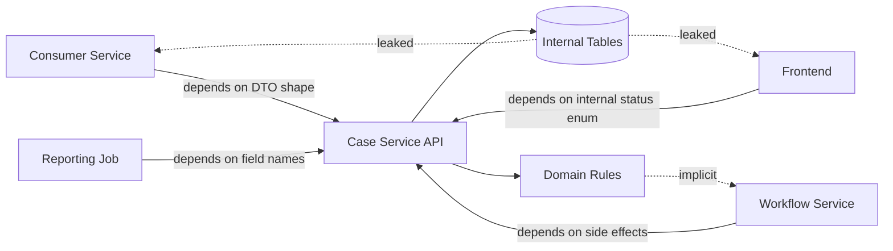
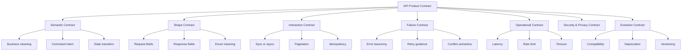
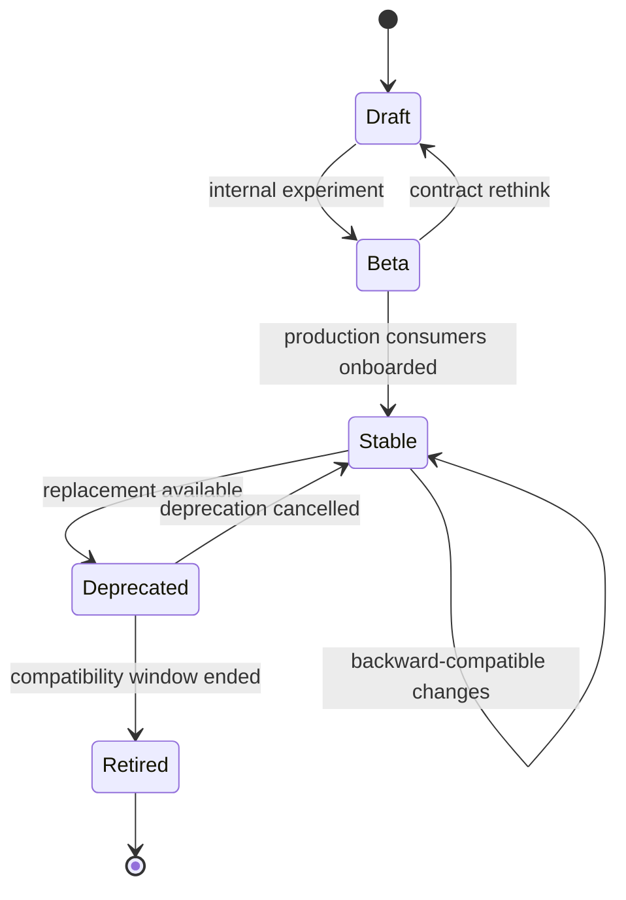
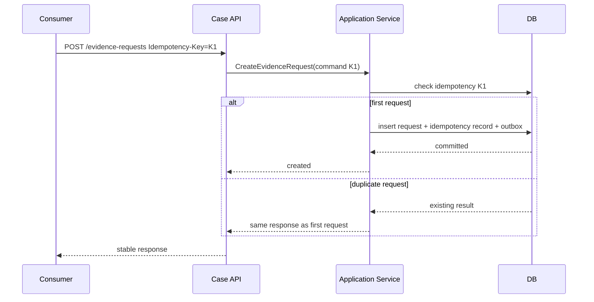
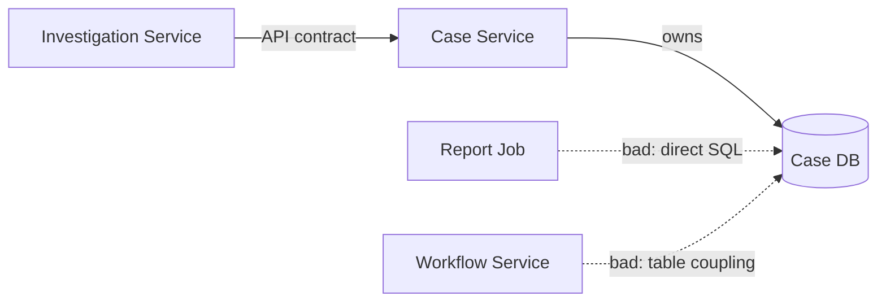
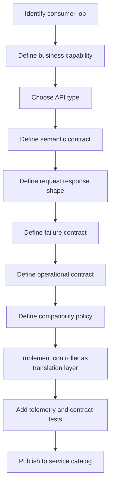

# Part 023 — Service API as Product Contract

> API microservice bukan sekadar method controller yang kebetulan bisa dipanggil lewat HTTP.
> API adalah **kontrak produk** antara provider dan consumer.
>
> Begitu API dipakai service lain, UI, workflow engine, report generator, batch job, atau external partner, API itu menjadi bagian dari supply chain sistem. Mengubahnya tanpa disiplin sama seperti mengganti bentuk baut di mesin yang sedang berjalan.

Pada level beginner, API sering dipahami sebagai:

- endpoint,
- request DTO,
- response DTO,
- controller,
- dokumentasi Swagger/OpenAPI,
- atau URL yang dipanggil frontend.

Itu belum cukup.

Pada level architecture, API adalah:

- **semantic contract**: apa arti operasi ini dalam domain?
- **interaction contract**: bagaimana consumer berinteraksi dengan service?
- **stability contract**: perubahan apa yang aman dan tidak aman?
- **failure contract**: bagaimana consumer membedakan error retryable, non-retryable, invalid, conflict, unavailable?
- **operational contract**: latency, rate limit, timeout, pagination, correlation, observability.
- **trust contract**: data apa yang boleh terlihat, siapa yang boleh memanggil, dan bagaimana audit dibangun.

Bagian ini tidak mengulang detail OpenAPI/data-contract engineering yang sudah dipelajari di seri lain. Di sini kita fokus pada **cara architect-level mendesain API sebagai product surface**.

---

## 1. The Real Problem: API yang Buruk Menciptakan Coupling Tersembunyi

Microservices sering gagal bukan karena Java, Spring, Kafka, atau Kubernetes-nya buruk.

Sering gagal karena service mengekspos API yang:

- terlalu mirip struktur tabel internal,
- terlalu CRUD-centric,
- tidak mencerminkan intent bisnis,
- tidak jelas error contract-nya,
- berubah tanpa compatibility window,
- memaksa consumer tahu workflow internal,
- response-nya terlalu banyak data sensitif,
- pagination/filtering-nya tidak stabil,
- tidak punya idempotency model,
- tidak punya deprecation policy,
- tidak punya owner yang bertanggung jawab terhadap consumer impact.

Akibatnya service terlihat terpisah secara deployment, tetapi tetap terkunci secara behavior.

Itulah distributed monolith versi API.



Masalahnya bukan dependency eksplisit. Dependency eksplisit bisa dilihat.

Masalahnya adalah **semantic dependency** yang tersembunyi:

- consumer mengasumsikan status `UNDER_REVIEW` selalu berarti officer sudah ditugaskan,
- consumer mengasumsikan field `assignedOfficerId` selalu non-null,
- consumer mengasumsikan `POST /cases/{id}/submit` selalu synchronous selesai,
- consumer mengasumsikan response list selalu sorted by created date,
- consumer mengasumsikan error 500 boleh di-retry tanpa risiko duplicate command.

API contract yang baik membuat asumsi-asumsi penting menjadi eksplisit.

---

## 2. Mental Model: API sebagai Produk Internal

API product bukan berarti semua API harus punya marketing page.

Maksudnya:

> API didesain, dirilis, dioperasikan, dievolusi, dan didepresiasi dengan memikirkan user-nya.

User API bisa berupa:

| Consumer | Kebutuhan | Risiko Jika API Buruk |
|---|---|---|
| Frontend web/mobile | response stabil, error jelas, latency rendah | UX rusak, defensive code berlebihan |
| Service lain | semantic jelas, retry-safe, backward compatible | cascading failure, coupling tersembunyi |
| Workflow engine | command stateful, idempotency, process visibility | duplicate action, process stuck |
| Reporting/read model | pagination stabil, snapshot semantics, data classification | inconsistent report, data leakage |
| External partner | contract versioning, auth, quota, audit | integration break, compliance issue |
| Internal batch job | large data traversal, cursor, resumability | timeout, load spike, partial result |

API yang baik tidak hanya menjawab “bisa dipanggil atau tidak”.

API yang baik menjawab:

1. Untuk siapa API ini dibuat?
2. Masalah consumer apa yang diselesaikan?
3. Apa arti operasi ini dalam domain?
4. Apa guarantee yang diberikan provider?
5. Apa yang tidak dijamin provider?
6. Bagaimana consumer harus bereaksi terhadap kegagalan?
7. Bagaimana API ini akan berevolusi?

---

## 3. API Contract Memiliki Beberapa Lapisan

Jangan menyempitkan API contract menjadi schema JSON.

Schema hanya satu lapisan.



### 3.1 Semantic Contract

Semantic contract menjawab:

- apa arti command/query?
- invariant apa yang dijaga?
- state transition apa yang mungkin terjadi?
- side effect apa yang boleh terjadi?
- apa yang tidak boleh diasumsikan consumer?

Contoh buruk:

```http
POST /cases/123/updateStatus

{
  "status": "ESCALATED"
}
```

Ini lemah karena consumer dipaksa tahu status internal dan boleh memindahkan state secara liar.

Contoh lebih baik:

```http
POST /cases/123/escalations

{
  "reasonCode": "MISCONDUCT_SEVERITY_HIGH",
  "requestedBy": "officer-771",
  "evidenceRefs": ["evd-11", "evd-12"]
}
```

Yang kedua menyatakan intent bisnis: membuat escalation request.

Service tetap bebas menentukan apakah status case menjadi:

- `ESCALATION_PENDING`,
- `ESCALATED`,
- `ESCALATION_REJECTED`,
- atau state lain di masa depan.

Consumer tidak perlu mengontrol state machine internal.

### 3.2 Shape Contract

Shape contract adalah bentuk request/response:

- field,
- type,
- enum,
- nullability,
- nested object,
- array,
- pagination envelope,
- error payload.

Shape penting, tetapi shape tanpa semantic adalah DTO kosong.

Jangan hanya bertanya:

> Field apa saja yang dibutuhkan?

Tanya juga:

> Apa arti field ini? Apakah consumer boleh menyimpan, menampilkan, membuat keputusan, atau menggunakannya sebagai key?

### 3.3 Interaction Contract

Interaction contract menjawab:

- apakah command selesai synchronous?
- apakah operasi long-running?
- apakah response berarti accepted, completed, atau scheduled?
- apakah consumer boleh retry?
- apakah ada idempotency key?
- apakah list endpoint pakai offset atau cursor?
- apakah query result snapshot-stable?
- apakah ada eventual consistency window?

Contoh:

```http
POST /cases/123/submission
Idempotency-Key: submit-case-123-20260705-001
```

Response:

```json
{
  "submissionId": "sub_9sx1",
  "caseId": "case_123",
  "status": "ACCEPTED_FOR_PROCESSING",
  "statusUrl": "/case-submissions/sub_9sx1"
}
```

Ini memberi tahu consumer bahwa request diterima, bukan berarti semua downstream process selesai.

### 3.4 Failure Contract

Failure contract menjawab:

- apa error invalid input?
- apa error authorization?
- apa error conflict?
- apa error dependency unavailable?
- apa error duplicate command?
- mana yang retryable?
- mana yang final?
- mana yang butuh user action?

Tanpa failure contract, consumer akan membuat retry dan fallback berdasarkan tebakan.

Tebakan itulah sumber duplicate action, retry storm, dan incident.

### 3.5 Operational Contract

Operational contract mencakup:

- latency target,
- timeout expectation,
- max page size,
- rate limit,
- payload size limit,
- eventual consistency expectation,
- sorting stability,
- response caching,
- trace propagation,
- deprecation header,
- correlation ID.

API tidak bisa dianggap selesai hanya karena pass unit test.

API selesai ketika consumer tahu cara menggunakannya dalam kondisi normal dan buruk.

### 3.6 Security and Privacy Contract

Security contract tidak hanya “endpoint ini butuh token”.

Pertanyaan yang lebih penting:

- siapa actor-nya?
- action apa yang dilakukan?
- resource apa yang disentuh?
- scope data apa yang boleh keluar?
- field mana PII/sensitive?
- apakah response bisa digunakan untuk inferensi data?
- apakah error message membocorkan existence resource?
- apakah audit trail cukup untuk rekonstruksi keputusan?

Detail authentication/authorization tidak diulang di sini. Namun API design harus menyediakan surface yang memungkinkan authorization dan audit berjalan benar.

### 3.7 Evolution Contract

Evolution contract menjawab:

- perubahan apa yang backward compatible?
- kapan version baru dibuat?
- bagaimana deprecation diumumkan?
- berapa lama compatibility window?
- bagaimana consumer impact dianalisis?
- apakah contract test/lint mengunci rule?

API yang tidak punya evolution policy akan cepat berubah menjadi artefak politik: semua orang takut mengubahnya, tetapi tidak ada yang benar-benar memilikinya.

---

## 4. API Consumer Empathy: Desain dari Sisi Pemakai

Engineer provider sering mendesain API dari struktur internal:

```text
We have CaseEntity, AssignmentEntity, ReviewEntity.
Let's expose endpoints for them.
```

Architect-level API design membalik perspektif:

```text
What job is the consumer trying to complete?
What decision does the consumer need to make?
What should the consumer not need to know?
```

Contoh domain case management.

Frontend officer dashboard tidak butuh seluruh internal case aggregate. Ia butuh:

- daftar case yang butuh tindakan,
- prioritas,
- due date,
- next allowed action,
- ringkasan risiko,
- assignment status,
- link detail.

Endpoint buruk:

```http
GET /cases?status=OPEN&assignedOfficerId=771
```

Response terlalu mentah:

```json
[
  {
    "id": "case_123",
    "status": "OPEN",
    "assignmentId": "asg_991",
    "workflowState": "S2",
    "reviewStatus": "PENDING",
    "lastEvidenceId": "evd_55"
  }
]
```

Endpoint lebih consumer-oriented:

```http
GET /officer-workbench/cases?view=needs-action
```

Response:

```json
{
  "items": [
    {
      "caseId": "case_123",
      "displayNumber": "CASE-2026-000123",
      "title": "Market Conduct Investigation",
      "priority": "HIGH",
      "dueAt": "2026-07-12T17:00:00+07:00",
      "nextActions": ["SUBMIT_REVIEW", "REQUEST_EVIDENCE"],
      "riskSummary": {
        "level": "HIGH",
        "reasons": ["LATE_RESPONSE", "HIGH_IMPACT_ENTITY"]
      }
    }
  ],
  "nextCursor": "eyJwb3MiOi..."
}
```

Ini tidak berarti setiap UI harus punya service sendiri. Bisa BFF, query service, atau API composition layer. Point-nya: API harus didesain dari consumer job, bukan table shape.

---

## 5. Internal API Tidak Berarti Bebas Berantakan

Kesalahan umum:

> “Ini cuma internal API, jadi tidak perlu didesain serius.”

Di microservices, internal API sering lebih berbahaya daripada public API karena:

- dipakai banyak service tanpa dokumentasi formal,
- berubah cepat tanpa komunikasi,
- punya trust assumption berlebihan,
- consumer-nya adalah code otomatis yang akan retry, cache, atau fan-out,
- kegagalannya bisa menciptakan cascading failure.

Public API biasanya punya governance.

Internal API sering punya chaos.

Karena itu internal API minimal harus punya:

- owner,
- purpose,
- consumer list,
- compatibility rule,
- error contract,
- authentication/authorization expectation,
- observability requirement,
- deprecation path.

---

## 6. API Surface Types dalam Microservices

Tidak semua API punya peran yang sama.

| API Type | Consumer | Design Bias |
|---|---|---|
| Command API | Service/UI/workflow yang ingin mengubah state | intent, idempotency, validation, conflict |
| Query API | UI/reporting/service lain yang butuh membaca | pagination, filtering, projection, staleness |
| Event API | Async consumer | semantic event, schema evolution, ordering assumption |
| Admin API | Operator/internal platform | safety, audit, explicit risk |
| Callback/Webhook API | External/system integration | signature, retry, replay defense |
| Bulk API | Batch/migration/analytics | resumability, chunking, throttling |
| Status API | Long-running process observer | state visibility, polling interval, terminal state |

Jangan mencampur semuanya dalam satu mental model.

Command API berbeda dari Query API.

Query API boleh kaya projection. Command API harus intent-based dan menjaga invariant.

Event API bukan REST API, tetapi tetap product contract.

---

## 7. Command API: Expose Intent, Not State Mutation

Command API yang baik tidak memberi consumer tombol bebas untuk mengubah field internal.

Buruk:

```http
PATCH /cases/123

{
  "status": "APPROVED",
  "approvedBy": "officer-771",
  "approvedAt": "2026-07-05T10:00:00+07:00"
}
```

Masalah:

- consumer menentukan state final,
- consumer menentukan timestamp yang seharusnya authoritative dari service,
- invariant mudah dilanggar,
- audit trail menjadi lemah,
- authorization sulit karena action tidak eksplisit.

Lebih baik:

```http
POST /cases/123/approval-decisions

{
  "decision": "APPROVE",
  "reasonCode": "EVIDENCE_SUFFICIENT",
  "comment": "All mandatory evidence has been reviewed."
}
```

Service menentukan:

- apakah actor boleh approve,
- apakah case dalam state yang bisa di-approve,
- apakah evidence mandatory sudah lengkap,
- timestamp authoritative,
- audit event,
- state transition,
- downstream event.

Java boundary:

```java
@RestController
@RequestMapping("/cases/{caseId}/approval-decisions")
final class CaseApprovalController {

    private final ApproveCaseUseCase approveCase;

    CaseApprovalController(ApproveCaseUseCase approveCase) {
        this.approveCase = approveCase;
    }

    @PostMapping
    ResponseEntity<ApprovalDecisionResponse> approve(
            @PathVariable String caseId,
            @RequestHeader("Idempotency-Key") String idempotencyKey,
            @Valid @RequestBody ApprovalDecisionRequest request,
            Principal principal) {

        var command = new ApproveCaseCommand(
                CaseId.of(caseId),
                ActorId.of(principal.getName()),
                IdempotencyKey.of(idempotencyKey),
                request.decision(),
                request.reasonCode(),
                request.comment()
        );

        var result = approveCase.handle(command);

        return ResponseEntity
                .status(HttpStatus.CREATED)
                .body(ApprovalDecisionResponse.from(result));
    }
}
```

Controller tidak menjalankan business rule.

Controller hanya:

- membaca transport input,
- memvalidasi shape dasar,
- membangun command,
- memanggil use case,
- menerjemahkan result ke response.

---

## 8. Query API: Expose Useful Projection, Not Internal Aggregate Dump

Query API sering salah arah karena provider mengekspor aggregate internal.

Buruk:

```http
GET /cases/123
```

Response:

```json
{
  "caseId": "case_123",
  "internalState": "S_REVIEW_7",
  "assignmentEntity": {...},
  "workflowEntity": {...},
  "evidenceRows": [...],
  "auditRows": [...],
  "riskCalculationDebug": {...}
}
```

Ini membuat consumer tahu terlalu banyak.

API query yang baik didesain berdasarkan projection purpose:

- case detail for officer,
- case summary for dashboard,
- case audit view,
- case public status,
- case escalation context,
- case reporting projection.

Contoh:

```http
GET /cases/123/officer-view
```

atau lebih baik melalui capability API:

```http
GET /officer-workbench/cases/123
```

Response:

```json
{
  "caseId": "case_123",
  "displayNumber": "CASE-2026-000123",
  "title": "Market Conduct Investigation",
  "currentStage": "EVIDENCE_REVIEW",
  "availableActions": ["REQUEST_MORE_EVIDENCE", "SUBMIT_REVIEW"],
  "deadline": {
    "dueAt": "2026-07-12T17:00:00+07:00",
    "slaStatus": "AT_RISK"
  },
  "links": {
    "evidence": "/cases/case_123/evidence-summary",
    "audit": "/cases/case_123/audit-timeline"
  }
}
```

Projection bukan dosa.

Yang berbahaya adalah projection yang tidak diakui sebagai contract.

---

## 9. API Shape Should Hide Internal Model but Preserve Domain Meaning

Ada dua ekstrem:

1. API terlalu mirip database.
2. API terlalu generik sampai tidak punya makna domain.

Contoh terlalu database-centric:

```json
{
  "case_tbl_id": 123,
  "case_stat_cd": "R3",
  "assgn_usr_fk": 771
}
```

Contoh terlalu generik:

```json
{
  "entityId": "123",
  "state": "active",
  "metadata": {
    "field1": "R3",
    "field2": "771"
  }
}
```

Keduanya buruk.

API contract yang baik menggunakan bahasa domain yang stabil:

```json
{
  "caseId": "case_123",
  "reviewStage": "EVIDENCE_REVIEW",
  "assignedOfficerId": "officer_771"
}
```

Prinsipnya:

- jangan bocorkan nama tabel,
- jangan bocorkan enum internal yang tidak dimengerti consumer,
- jangan hilangkan domain language,
- jangan gunakan field generik untuk menghindari desain,
- jangan expose data yang tidak punya consumer purpose.

---

## 10. Contract Stability: Backward Compatibility by Default

API provider harus menganggap consumer tidak bisa update serentak.

Dalam microservices, independent deployability hanya mungkin kalau API bisa berevolusi tanpa lockstep deployment.

Perubahan yang biasanya backward compatible:

- menambah optional response field,
- menambah optional request field dengan default aman,
- menambah enum value jika consumer sudah siap unknown value,
- menambah endpoint baru,
- menambah link baru,
- menambah metadata non-breaking,
- memperlonggar validation dengan aman.

Perubahan yang biasanya breaking:

- menghapus field,
- mengubah type field,
- mengubah semantic field,
- mengubah required field,
- mengubah status code meaning,
- mengubah error format,
- mengubah pagination order default,
- mengubah enum tanpa compatibility handling,
- mengubah id stability,
- mengubah behavior synchronous menjadi async tanpa contract baru.

### Compatibility Is Semantic, Not Just Schema

Misal response lama:

```json
{
  "riskLevel": "HIGH"
}
```

Response baru:

```json
{
  "riskLevel": "HIGH"
}
```

Schema sama.

Tetapi semantic berubah:

- dulu `HIGH` berarti high financial exposure,
- sekarang `HIGH` berarti high regulatory urgency.

Ini breaking change meski JSON schema tidak berubah.

### Rule

> Kalau consumer yang benar menurut kontrak lama bisa berperilaku salah setelah perubahan provider, perubahan itu breaking.

---

## 11. API Lifecycle: Draft, Beta, Stable, Deprecated, Retired

API harus punya lifecycle.



### Draft

Dipakai untuk eksplorasi. Jangan jadikan dependency production.

### Beta

Boleh dipakai limited consumer. Breaking change masih mungkin dengan komunikasi eksplisit.

### Stable

Default expectation: backward compatible.

### Deprecated

Masih berjalan, tetapi tidak direkomendasikan. Harus ada replacement path.

### Retired

Sudah dimatikan setelah consumer migration selesai atau melewati policy window.

Metadata yang harus ada di service catalog:

```yaml
api:
  name: Case Approval API
  lifecycle: stable
  owner: case-lifecycle-team
  consumers:
    - enforcement-workflow-service
    - officer-workbench-bff
  compatibilityPolicy: backward-compatible-by-default
  deprecationWindow: P90D
  supportChannel: '#case-platform-support'
```

---

## 12. Deprecation Is a Product Operation

Deprecation bukan sekadar menulis “deprecated” di docs.

Deprecation yang benar punya:

1. alasan,
2. replacement,
3. timeline,
4. consumer list,
5. migration guide,
6. telemetry untuk melihat usage,
7. escalation path,
8. final retirement date,
9. rollback decision jika migration gagal.

Header bisa membantu:

```http
Deprecation: true
Sunset: Sat, 31 Oct 2026 23:59:59 GMT
Link: </docs/apis/case-approval-v2-migration>; rel="deprecation"
```

Tapi header saja tidak cukup.

Harus ada ownership dan telemetry.

---

## 13. Error Contract: Consumer Butuh Keputusan, Bukan Stack Trace

Consumer tidak butuh stack trace.

Consumer butuh tahu:

- apakah input salah?
- apakah user boleh memperbaiki?
- apakah command sudah pernah diproses?
- apakah conflict karena state berubah?
- apakah boleh retry?
- apakah harus menunggu?
- apakah perlu contact support?

Contoh shape error:

```json
{
  "type": "https://api.example.internal/problems/case-state-conflict",
  "title": "Case state conflict",
  "status": 409,
  "detail": "Case case_123 cannot be approved from EVIDENCE_COLLECTION state.",
  "instance": "/cases/case_123/approval-decisions/req_789",
  "code": "CASE_STATE_CONFLICT",
  "retryable": false,
  "currentState": "EVIDENCE_COLLECTION",
  "allowedActions": ["SUBMIT_EVIDENCE", "CANCEL_CASE"]
}
```

Field penting:

| Field | Tujuan |
|---|---|
| `type` | stable problem identifier |
| `title` | human-readable summary |
| `status` | HTTP status |
| `detail` | explanation untuk request spesifik |
| `instance` | occurrence identifier |
| `code` | internal stable machine code |
| `retryable` | guidance untuk automation |
| domain-specific fields | recovery hint |

Jangan membuat error contract seperti ini:

```json
{
  "message": "Something went wrong"
}
```

atau:

```json
{
  "error": "java.lang.IllegalStateException: invalid state"
}
```

Yang pertama tidak berguna. Yang kedua membocorkan internal.

---

## 14. Status Codes Are Part of Contract

Status code bukan dekorasi.

Status code adalah bagian dari machine contract.

Contoh mapping umum:

| Situation | Status | Meaning |
|---|---:|---|
| Command accepted and completed by creating resource | 201 | created |
| Command accepted for async processing | 202 | accepted, not completed |
| Query success | 200 | OK |
| Command success without body | 204 | no content |
| Invalid request shape | 400 | client sent bad request |
| Unauthenticated | 401 | no/invalid authentication |
| Authenticated but not allowed | 403 | forbidden |
| Resource not found or intentionally hidden | 404 | not found |
| Duplicate create with same unique key | 409 | conflict |
| Validation semantic failed | 422 | unprocessable content, if policy uses it |
| Rate limit exceeded | 429 | too many requests |
| Dependency/time-based unavailable | 503 | service unavailable |

Jangan semua error dijadikan 500.

500 berarti provider gagal menjalankan request valid karena masalah internal yang tidak diantisipasi. Jika business rule menolak approval karena case belum siap, itu bukan 500.

---

## 15. Idempotency Is API Product Design

Idempotency tidak boleh hanya menjadi detail retry library.

Command yang mungkin di-retry harus punya idempotency strategy.

Contoh:

```http
POST /cases/case_123/evidence-requests
Idempotency-Key: req-case-123-evd-20260705-001
```

Provider harus menyimpan hasil idempotency key dalam boundary operasi.



Good idempotency contract menjelaskan:

- header/field apa yang dipakai,
- scope key: per user, per resource, per endpoint, atau global,
- TTL key,
- apakah duplicate request harus memiliki body identik,
- response apa untuk duplicate key dengan different payload,
- apakah result lama dikembalikan.

---

## 16. API Should Not Expose Internal Workflow Accidentally

Workflow internal sering bocor ke API melalui status enum.

Contoh buruk:

```json
{
  "workflowState": "TASK_17_WAITING_FOR_SIGNAL_2"
}
```

Consumer sekarang bergantung pada workflow engine detail.

Lebih baik expose business stage:

```json
{
  "caseStage": "AWAITING_RESPONDENT_RESPONSE",
  "availableActions": ["SEND_REMINDER", "EXTEND_DEADLINE"],
  "deadline": {
    "dueAt": "2026-07-15T17:00:00+07:00",
    "policy": "RESPONDENT_RESPONSE_14_DAYS"
  }
}
```

Internal workflow boleh berubah dari:

- Camunda BPMN,
- Temporal workflow,
- hand-written state machine,
- Kafka choreography,
- database-driven scheduler,

selama API semantic tetap stabil.

---

## 17. API and Data Ownership

API adalah satu-satunya cara consumer mengakses capability service, kecuali ada explicit replicated read model/event stream contract.

Jika service A membaca database service B langsung, service B tidak lagi memiliki data-nya secara nyata.



API product contract harus menjelaskan:

- data apa yang authoritative,
- data apa yang derived,
- data apa yang stale,
- siapa owner field,
- apakah consumer boleh persist copy,
- apakah consumer harus subscribe event untuk update.

---

## 18. Java Implementation Pattern: API Layer Is Translation Layer

API layer tidak boleh menjadi tempat business rule.

Struktur yang sehat:

```text
case-service
└── src/main/java/com/example/caseplatform/caseapproval
    ├── api
    │   ├── CaseApprovalController.java
    │   ├── ApprovalDecisionRequest.java
    │   ├── ApprovalDecisionResponse.java
    │   └── CaseApprovalErrorHandler.java
    ├── application
    │   ├── ApproveCaseUseCase.java
    │   ├── ApproveCaseCommand.java
    │   └── ApproveCaseResult.java
    ├── domain
    │   ├── Case.java
    │   ├── CaseApprovalPolicy.java
    │   └── CaseApproved.java
    └── infrastructure
        ├── JpaCaseRepository.java
        └── OutboxPublisher.java
```

DTO API tidak perlu sama dengan command application.

```java
public record ApprovalDecisionRequest(
        @NotNull ApprovalDecision decision,
        @NotBlank String reasonCode,
        @Size(max = 1000) String comment
) {}
```

Command application lebih domain-aware:

```java
public record ApproveCaseCommand(
        CaseId caseId,
        ActorId actorId,
        IdempotencyKey idempotencyKey,
        ApprovalDecision decision,
        ReasonCode reasonCode,
        Comment comment
) {}
```

Response API bukan domain object:

```java
public record ApprovalDecisionResponse(
        String decisionId,
        String caseId,
        String outcome,
        String decidedAt,
        List<String> emittedEvents
) {
    static ApprovalDecisionResponse from(ApproveCaseResult result) {
        return new ApprovalDecisionResponse(
                result.decisionId().value(),
                result.caseId().value(),
                result.outcome().name(),
                result.decidedAt().toString(),
                result.emittedEvents().stream().map(Object::toString).toList()
        );
    }
}
```

Rule:

> API DTO is not domain model. Domain model is not persistence model. Persistence model is not integration event.

Mirip bentuknya boleh. Sama secara paksa jangan.

---

## 19. API Product Contract Document Template

Setiap API penting sebaiknya punya contract page ringkas.

```md
# Case Approval API

## Purpose
Allows authorized officers to submit approval or rejection decisions for eligible enforcement cases.

## Owner
Case Lifecycle Team

## Consumers
- Officer Workbench BFF
- Enforcement Workflow Service
- Audit Timeline Projection

## Operations
- POST /cases/{caseId}/approval-decisions
- GET /cases/{caseId}/approval-decisions/{decisionId}

## Semantic Guarantees
- A case can only be approved from REVIEW_READY state.
- Decision timestamp is assigned by Case Service.
- Approval emits CaseApproved integration event after transaction commit.

## Idempotency
- Required header: Idempotency-Key
- Scope: actor + caseId + endpoint
- TTL: 7 days
- Duplicate key with same payload returns original response.
- Duplicate key with different payload returns 409.

## Failure Contract
- 400 invalid request shape
- 401 unauthenticated
- 403 actor not allowed
- 404 case not found or hidden
- 409 state conflict or idempotency conflict
- 422 semantic validation failure
- 503 temporary dependency unavailable

## Operational Contract
- p95 latency target: 300ms excluding downstream event processing
- timeout budget: consumer should set <= 1s
- max payload: 16KB
- tracing: W3C trace context propagated

## Evolution Policy
- Backward-compatible changes allowed anytime.
- Breaking changes require new endpoint/version and 90-day migration window.
```

Dokumen ini tidak menggantikan OpenAPI. Ini melengkapi OpenAPI dengan semantic/operational context.

---

## 20. API Review Questions

Sebelum API dianggap siap, tanyakan:

### Purpose

- Consumer mana yang akan memakai API ini?
- Job apa yang mereka selesaikan?
- Apakah endpoint ini capability-oriented atau table-oriented?

### Semantic

- Apa intent operasi ini?
- State transition apa yang mungkin?
- Side effect apa yang terjadi?
- Apa yang tidak boleh diasumsikan consumer?

### Contract

- Field mana required/optional?
- Field mana stable identifier?
- Enum mana bisa bertambah?
- Response list punya sorting guarantee?

### Failure

- Apakah error contract machine-readable?
- Mana error retryable?
- Apakah conflict dibedakan dari internal error?
- Apakah validation error cukup spesifik?

### Operational

- Apa latency expectation?
- Apa timeout recommendation?
- Ada idempotency untuk command?
- Ada pagination untuk collection?
- Ada rate limit?

### Evolution

- Apa perubahan compatible?
- Apa deprecation policy?
- Bagaimana usage consumer dilacak?
- Siapa owner API?

---

## 21. Common Smells

### Smell 1 — API adalah CRUD dari tabel internal

```http
PUT /case_table/123
```

Biasanya berarti domain model bocor.

### Smell 2 — Consumer mengatur status internal

```json
{
  "status": "APPROVED"
}
```

Biasanya berarti invariant berpindah ke consumer.

### Smell 3 — Error selalu 200 dengan `success=false`

```json
{
  "success": false,
  "message": "invalid state"
}
```

Ini merusak HTTP semantics dan menyulitkan gateway/client automation.

### Smell 4 — Semua error 500

Business rejection bukan internal server error.

### Smell 5 — Tidak ada idempotency untuk command yang bisa di-retry

Ini undangan duplicate action.

### Smell 6 — Response mengandung semua field “untuk jaga-jaga”

Ini memperbesar payload, data leakage, dan coupling.

### Smell 7 — Tidak ada consumer registry

Provider tidak tahu siapa yang akan rusak ketika API berubah.

### Smell 8 — API lifecycle tidak jelas

Endpoint beta dipakai production. Endpoint lama tidak bisa dimatikan. Tidak ada ownership.

---

## 22. Practical Design Flow

Gunakan urutan ini saat mendesain API baru.



Jangan mulai dari controller.

Mulai dari consumer job dan business capability.

---

## 23. Mini Case Study: Evidence Request API

### Business Need

Officer perlu meminta evidence tambahan dari respondent.

### Bad API

```http
PATCH /cases/{caseId}

{
  "status": "WAITING_FOR_EVIDENCE",
  "evidenceRequestText": "Please upload trading records",
  "deadline": "2026-07-20"
}
```

Masalah:

- status dimutasi langsung,
- tidak ada request identity,
- tidak ada idempotency,
- tidak jelas apakah notification dikirim,
- tidak jelas apakah deadline policy valid,
- tidak jelas audit event.

### Better API

```http
POST /cases/{caseId}/evidence-requests
Idempotency-Key: evidence-request-case-123-001

{
  "requestType": "TRADING_RECORDS",
  "message": "Please upload trading records for the specified period.",
  "dueAt": "2026-07-20T17:00:00+07:00",
  "attachments": [
    {
      "documentId": "doc_template_91",
      "purpose": "REQUEST_TEMPLATE"
    }
  ]
}
```

Response:

```json
{
  "evidenceRequestId": "evreq_991",
  "caseId": "case_123",
  "status": "CREATED",
  "dueAt": "2026-07-20T17:00:00+07:00",
  "links": {
    "self": "/cases/case_123/evidence-requests/evreq_991",
    "case": "/cases/case_123"
  }
}
```

Semantic guarantees:

- service validates officer authorization,
- service validates case allows evidence request,
- service owns timestamp and audit event,
- service emits `EvidenceRequested` after commit,
- duplicate idempotency key returns same result,
- notification is asynchronous and visible via event/notification status if needed.

---

## 24. API Governance Without Killing Delivery Speed

Governance yang buruk membuat semua endpoint harus menunggu committee.

Governance yang baik memberi guardrail otomatis.

Gunakan tiga level:

### Level 1 — Local Team Review

Untuk API internal low-risk.

Checklist:

- purpose jelas,
- error contract jelas,
- idempotency untuk command,
- pagination untuk collection,
- owner tercatat.

### Level 2 — Architecture Review

Untuk API yang:

- dipakai banyak service,
- public/external,
- membawa sensitive data,
- mengubah lifecycle bisnis utama,
- punya cross-service side effects.

### Level 3 — Platform Guardrails

Automated checks:

- OpenAPI lint,
- forbidden field names,
- error shape compliance,
- pagination rule,
- deprecated endpoint usage telemetry,
- consumer contract tests,
- API catalog completeness.

Governance seharusnya mempercepat keputusan aman, bukan memperlambat semua perubahan.

---

## 25. Architecture-Level Heuristic

API yang baik terasa boring bagi consumer.

Consumer tidak perlu menebak:

- apa arti endpoint,
- kapan boleh retry,
- apa arti error,
- field mana stable,
- apakah result stale,
- kapan endpoint berubah,
- siapa owner-nya.

API yang buruk terasa mudah dibuat oleh provider, tetapi mahal dipakai oleh semua consumer.

Top engineer mendesain API dengan menghitung **total system cost**, bukan hanya effort controller.

---

## 26. Latihan

Ambil satu API internal yang pernah kamu lihat atau buat.

Jawab:

1. Siapa consumer-nya?
2. Apa job consumer?
3. Apakah endpoint-nya intent-based atau data-shape-based?
4. Apa semantic guarantee-nya?
5. Apa failure contract-nya?
6. Apa retry rule-nya?
7. Apa compatibility policy-nya?
8. Apakah response membocorkan internal model?
9. Apakah ada idempotency untuk command?
10. Apakah API bisa didepresiasi tanpa chaos?

Kalau kamu tidak bisa menjawab 6 dari 10 pertanyaan ini, API tersebut belum menjadi product contract. Ia baru menjadi controller yang terpublikasi.

---

## 27. Ringkasan

API dalam microservices adalah product contract.

Yang harus dijaga:

- business semantic,
- consumer intent,
- backward compatibility,
- failure clarity,
- operational behavior,
- security/privacy boundary,
- ownership,
- lifecycle.

Jangan mulai dari URL.

Mulai dari consumer job dan capability boundary.

Controller hanyalah adapter.

Kontrak sebenarnya adalah kombinasi domain meaning, interaction rule, failure behavior, dan evolution policy.
