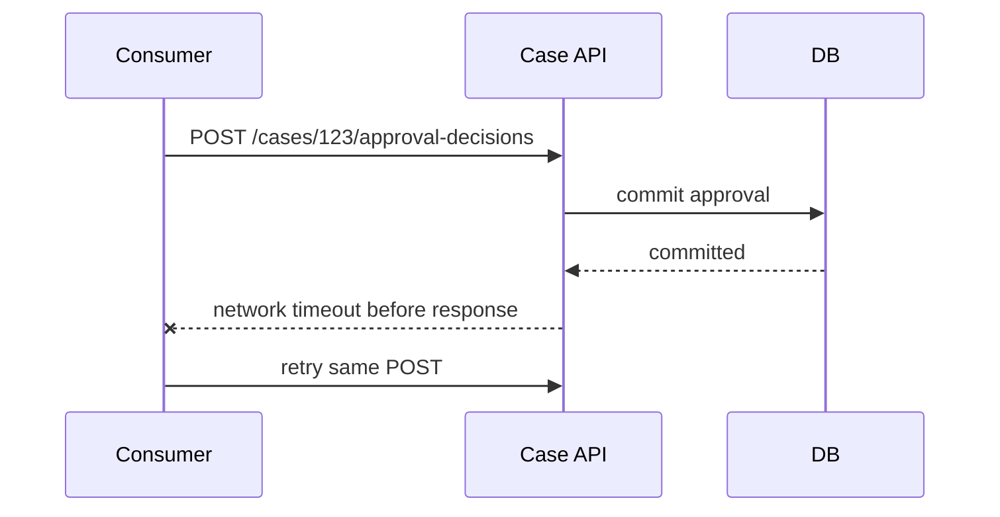

# Part 024 — REST API Design for Java Microservices

> REST API production-grade bukan sekadar `@RestController`, `@GetMapping`, dan JSON response.
>
> REST API yang baik memakai HTTP semantics secara sadar, menyembunyikan internal model, mengekspose intent yang jelas, punya error contract, pagination yang stabil, idempotency untuk command, dan failure behavior yang bisa diprogram oleh consumer.

Bagian sebelumnya membahas API sebagai product contract.

Sekarang kita masuk ke bentuk yang paling umum di Java microservices: REST-style HTTP API.

Kita tidak akan membahas REST sebagai dogma akademik. Kita akan membahas REST sebagai interface praktis untuk service enterprise yang harus:

- mudah dipakai,
- tahan evolusi,
- aman di-retry,
- bisa diobservasi,
- tidak bocor internal,
- dan tidak membuat consumer menebak-nebak.

---

## 1. REST API Design Starts from Resource, But Ends with Use Case

REST mengajak kita berpikir dalam resource.

Namun microservices enterprise tidak selalu murni CRUD resource.

Kamu harus bisa membedakan:

1. resource-oriented endpoint,
2. task/command-oriented endpoint,
3. query/projection endpoint,
4. long-running operation endpoint.

Kesalahan umum adalah memaksakan semua operasi menjadi CRUD.

### Resource-Oriented Endpoint

Cocok ketika operasi memang natural terhadap resource.

```http
GET /cases/case_123
GET /cases/case_123/evidence-requests/evreq_991
```

### Task-Oriented Command Endpoint

Cocok ketika operasi adalah action bisnis dengan invariant.

```http
POST /cases/case_123/approval-decisions
POST /cases/case_123/escalations
POST /cases/case_123/evidence-requests
```

Ini tetap REST-style karena command direpresentasikan sebagai resource baru:

- approval decision,
- escalation,
- evidence request.

Bukan:

```http
POST /cases/case_123/approve
POST /cases/case_123/escalate
POST /cases/case_123/requestEvidence
```

Yang terakhir kadang acceptable untuk internal API jika domain action lebih jelas daripada resource noun. Namun default yang lebih stabil adalah membuat action penting menjadi resource domain.

### Query/Projection Endpoint

Cocok ketika consumer membutuhkan read model tertentu.

```http
GET /officer-workbench/cases?view=needs-action
GET /cases/case_123/audit-timeline
GET /cases/case_123/escalation-context
```

### Long-Running Operation Endpoint

Cocok ketika command tidak selesai saat request HTTP selesai.

```http
POST /bulk-case-reclassification-jobs
GET /bulk-case-reclassification-jobs/job_123
```

Response awal:

```http
202 Accepted
Location: /bulk-case-reclassification-jobs/job_123
```

---

## 2. URI Design: Stable, Meaningful, Boring

URI yang baik harus:

- berbasis domain language,
- menggunakan noun/resource,
- tidak membocorkan database/table,
- tidak membawa implementation detail,
- tidak terlalu dalam nesting,
- stabil ketika internal berubah.

### Good

```http
GET /cases/case_123
GET /cases/case_123/evidence-requests
GET /cases/case_123/approval-decisions/decision_991
POST /cases/case_123/escalations
```

### Bad

```http
GET /case_tbl/123
GET /case-service/v1/getCaseById?id=123
POST /caseWorkflow/task17/signal2
POST /cases/123/updateStatus
```

### Nesting Rule

Nesting boleh jika child resource tidak punya meaningful existence tanpa parent.

```http
GET /cases/case_123/evidence-requests/evreq_991
```

Tapi jangan membuat URL menjadi dependency graph seluruh domain.

Buruk:

```http
GET /regulators/reg_1/entities/entity_2/cases/case_3/evidence/evidence_4/comments/comment_5
```

Jika resource punya identity global, URL lebih pendek biasanya lebih baik:

```http
GET /evidence-items/evidence_4/comments/comment_5
```

Atau expose melalui projection:

```http
GET /case-comments/comment_5
```

---

## 3. HTTP Method Semantics

HTTP method bukan dekorasi. Ia memberi sinyal kepada client, proxy, gateway, cache, observability, dan engineer.

| Method | Typical Use | Safe | Idempotent | Notes |
|---|---|---:|---:|---|
| GET | read resource/query | yes | yes | should not mutate business state |
| POST | create subordinate resource/submit command | no | not by default | use idempotency key for retry-safe command |
| PUT | replace resource at known URI | no | yes | full replacement semantics |
| PATCH | partial update | no | not always | must define patch format/semantics |
| DELETE | delete/cancel resource | no | yes by intent | deletion may be soft/business cancellation |

### GET Must Not Mutate Business State

Bad:

```http
GET /cases/case_123/mark-as-read
```

Better:

```http
POST /cases/case_123/read-receipts
```

or if only UI-local state:

```http
PUT /users/user_771/read-receipts/case_123
```

### POST Is Not Bad

Be careful with simplistic advice: “REST harus pakai PUT/PATCH untuk update.”

For business command, POST is often right.

```http
POST /cases/case_123/approval-decisions
```

Because you are not merely updating fields. You are submitting a domain decision.

---

## 4. Resource Modeling: CRUD Entity vs Domain Resource

A database entity is not automatically a REST resource.

A REST resource should be something the consumer can understand and manipulate according to domain semantics.

### Internal Entity

```java
@Entity
class CaseAssignmentEntity {
    @Id Long id;
    Long caseFk;
    Long officerFk;
    String assignmentStateCd;
    Instant createdTs;
}
```

### Domain Resource

```http
GET /cases/case_123/assignment
```

Response:

```json
{
  "caseId": "case_123",
  "assignedOfficerId": "officer_771",
  "assignedAt": "2026-07-05T09:30:00+07:00",
  "assignmentStatus": "ACTIVE",
  "links": {
    "case": "/cases/case_123",
    "officer": "/officers/officer_771"
  }
}
```

The API hides:

- table names,
- foreign key naming,
- legacy code values,
- persistence representation.

But it preserves domain meaning.

---

## 5. Command Endpoint Design

Command endpoint should show intent and protect invariants.

### Pattern

```http
POST /{aggregate-or-context}/{id}/{command-resource}
```

Examples:

```http
POST /cases/case_123/approval-decisions
POST /cases/case_123/escalations
POST /cases/case_123/evidence-requests
POST /cases/case_123/assignments
POST /cases/case_123/deadline-extensions
```

### Request Body

Request body should contain command input, not final state.

Bad:

```json
{
  "status": "ESCALATED",
  "assignedTeam": "ENFORCEMENT_SENIOR"
}
```

Good:

```json
{
  "reasonCode": "HIGH_SYSTEMIC_RISK",
  "justification": "Multiple entities affected by the same pattern.",
  "recommendedTeam": "ENFORCEMENT_SENIOR"
}
```

The service decides final state.

### Response Body

Command response should return useful result:

```json
{
  "escalationId": "esc_123",
  "caseId": "case_123",
  "outcome": "ESCALATION_CREATED",
  "caseStage": "ESCALATION_REVIEW",
  "createdAt": "2026-07-05T10:00:00+07:00",
  "links": {
    "self": "/cases/case_123/escalations/esc_123",
    "case": "/cases/case_123"
  }
}
```

Do not return full aggregate by default after every command. That creates payload bloat and hidden coupling.

---

## 6. Query Endpoint Design

Query endpoint should have explicit projection purpose.

### Good Query Endpoint

```http
GET /officer-workbench/cases?view=needs-action&priority=high&pageSize=25
```

Response:

```json
{
  "items": [
    {
      "caseId": "case_123",
      "displayNumber": "CASE-2026-000123",
      "title": "Market Conduct Investigation",
      "priority": "HIGH",
      "dueAt": "2026-07-12T17:00:00+07:00",
      "nextActions": ["SUBMIT_REVIEW", "REQUEST_EVIDENCE"]
    }
  ],
  "nextCursor": "eyJzb3J0IjoiZHVlQXQifQ"
}
```

### Query Parameter Rules

Use query parameters for:

- filtering,
- sorting,
- pagination,
- field selection,
- view/projection selection,
- date range.

Examples:

```http
GET /cases?stage=EVIDENCE_REVIEW&assignedOfficerId=officer_771
GET /cases?createdAfter=2026-07-01T00:00:00+07:00&pageSize=50
GET /cases?sort=dueAt,-priority
```

Be careful with arbitrary query power.

If you expose `filter=any SQL-like expression`, you may create:

- security risk,
- unbounded database cost,
- unstable index dependency,
- hidden reporting dependency.

For internal enterprise APIs, prefer named filters for high-value use cases.

---

## 7. Pagination: Offset, Cursor, and Stability

Collection endpoint must not return unbounded results.

Bad:

```http
GET /cases
```

returning 80,000 rows.

### Offset Pagination

```http
GET /cases?offset=100&limit=50
```

Pros:

- simple,
- good for small/stable datasets,
- easy for UI page number.

Cons:

- unstable when rows are inserted/deleted,
- expensive for large offsets,
- can skip/duplicate items during concurrent changes.

### Cursor Pagination

```http
GET /cases?pageSize=50&cursor=eyJkdWV... 
```

Response:

```json
{
  "items": [...],
  "nextCursor": "eyJuZXh0IjoiY2FzZV8xMjQifQ",
  "hasMore": true
}
```

Pros:

- stable for large datasets,
- better for infinite scroll/batch traversal,
- less expensive at high offset.

Cons:

- less convenient for jumping to arbitrary page,
- cursor format must be opaque,
- sorting must be stable.

### Stable Sort Requirement

Cursor pagination needs deterministic order.

Bad:

```sql
ORDER BY updated_at DESC
```

If multiple rows share same timestamp, order can shift.

Better:

```sql
ORDER BY updated_at DESC, case_id DESC
```

API contract should state default sort.

Example:

```json
{
  "items": [...],
  "page": {
    "nextCursor": "eyJ1cGRhdGVkQXQiOiIyMDI2LTA3LTA1VDEwOjAwOjAwKzA3OjAwIiwiY2FzZUlkIjoiY2FzZV8xMjMifQ",
    "pageSize": 50,
    "hasMore": true
  }
}
```

Never expose database offset/cursor internals as contract.

Cursor should be opaque.

---

## 8. Filtering and Sorting Should Be Designed, Not Dumped

Bad:

```http
GET /cases?where=status='OPEN' and exists(select ...)
```

Better:

```http
GET /cases?stage=EVIDENCE_REVIEW&priority=HIGH&assignedOfficerId=officer_771
```

Or named view:

```http
GET /officer-workbench/cases?view=needs-action
```

Design rules:

- support filters backed by indexes/read models,
- document allowed values,
- reject unknown filters,
- cap date ranges,
- cap page size,
- make sort fields explicit,
- avoid ad hoc query languages unless the API is intentionally query platform.

Validation example:

```java
public record CaseSearchRequest(
        CaseStage stage,
        Priority priority,
        String assignedOfficerId,
        @Min(1) @Max(100) Integer pageSize,
        String cursor
) {
    int effectivePageSize() {
        return pageSize == null ? 25 : pageSize;
    }
}
```

---

## 9. Status Code Design

Status code should match the contract.

### Success

| Situation | Status | Example |
|---|---:|---|
| Read resource | 200 | `GET /cases/case_123` |
| Create resource synchronously | 201 | `POST /cases/case_123/evidence-requests` |
| Accepted async job | 202 | `POST /bulk-case-reclassification-jobs` |
| Update/delete no response body | 204 | `DELETE /drafts/draft_1` |

### Client/Domain Errors

| Situation | Status | Example |
|---|---:|---|
| malformed JSON/invalid query parameter | 400 | invalid date format |
| no/invalid authentication | 401 | missing token |
| authenticated but forbidden | 403 | officer not assigned |
| resource absent/hidden | 404 | case not visible |
| state conflict | 409 | approve from wrong state |
| unsupported media type | 415 | XML sent to JSON endpoint |
| semantic validation failed | 422 | due date violates policy |
| rate limit | 429 | too many requests |

### Server/Temporary Errors

| Situation | Status | Example |
|---|---:|---|
| unexpected provider failure | 500 | unhandled bug |
| dependency gateway failure | 502 | upstream bad response |
| provider overloaded/down | 503 | temporary unavailable |
| dependency timeout/gateway timeout | 504 | upstream timeout |

Be consistent across services. If one service uses 409 for state conflict and another uses 422 for the same meaning, clients become more complex.

---

## 10. Error Response with Problem Details

Use a consistent machine-readable error shape.

Example:

```http
HTTP/1.1 409 Conflict
Content-Type: application/problem+json
```

```json
{
  "type": "https://api.example.internal/problems/case-state-conflict",
  "title": "Case state conflict",
  "status": 409,
  "detail": "Case case_123 cannot be approved from EVIDENCE_COLLECTION state.",
  "instance": "/cases/case_123/approval-decisions/req_789",
  "code": "CASE_STATE_CONFLICT",
  "retryable": false,
  "currentState": "EVIDENCE_COLLECTION",
  "allowedActions": ["SUBMIT_EVIDENCE", "CANCEL_CASE"]
}
```

### Spring MVC Example

```java
@RestControllerAdvice
final class ApiExceptionHandler {

    @ExceptionHandler(CaseStateConflictException.class)
    ResponseEntity<ProblemDetail> handle(CaseStateConflictException ex,
                                         HttpServletRequest request) {
        ProblemDetail problem = ProblemDetail.forStatus(HttpStatus.CONFLICT);
        problem.setType(URI.create("https://api.example.internal/problems/case-state-conflict"));
        problem.setTitle("Case state conflict");
        problem.setDetail(ex.getMessage());
        problem.setInstance(URI.create(request.getRequestURI()));
        problem.setProperty("code", "CASE_STATE_CONFLICT");
        problem.setProperty("retryable", false);
        problem.setProperty("currentState", ex.currentState().name());
        problem.setProperty("allowedActions", ex.allowedActions());

        return ResponseEntity.status(HttpStatus.CONFLICT).body(problem);
    }
}
```

Do not return stack trace, SQL error, class name, or internal workflow task ID.

---

## 11. Validation Error Design

Validation error should help consumer fix request.

Bad:

```json
{
  "message": "Validation failed"
}
```

Better:

```json
{
  "type": "https://api.example.internal/problems/validation-error",
  "title": "Validation failed",
  "status": 400,
  "detail": "Request contains invalid fields.",
  "code": "VALIDATION_ERROR",
  "errors": [
    {
      "field": "dueAt",
      "code": "MUST_BE_FUTURE_BUSINESS_DAY",
      "message": "dueAt must be a future business day in Asia/Jakarta timezone."
    },
    {
      "field": "reasonCode",
      "code": "REQUIRED",
      "message": "reasonCode is required."
    }
  ]
}
```

Spring example:

```java
@ExceptionHandler(MethodArgumentNotValidException.class)
ResponseEntity<ProblemDetail> handleValidation(MethodArgumentNotValidException ex) {
    ProblemDetail problem = ProblemDetail.forStatus(HttpStatus.BAD_REQUEST);
    problem.setType(URI.create("https://api.example.internal/problems/validation-error"));
    problem.setTitle("Validation failed");
    problem.setDetail("Request contains invalid fields.");
    problem.setProperty("code", "VALIDATION_ERROR");

    var errors = ex.getBindingResult().getFieldErrors().stream()
            .map(err -> Map.of(
                    "field", err.getField(),
                    "code", err.getCode() == null ? "INVALID" : err.getCode(),
                    "message", err.getDefaultMessage() == null ? "Invalid value" : err.getDefaultMessage()
            ))
            .toList();

    problem.setProperty("errors", errors);
    return ResponseEntity.badRequest().body(problem);
}
```

Validation has two layers:

1. shape validation: field required, format, length,
2. semantic validation: business rule, state, policy.

Do not hide semantic conflict as generic bad request.

---

## 12. Idempotency for POST Commands

POST is not idempotent by default.

But many POST commands must be retry-safe because distributed systems fail after commit but before response reaches consumer.

### Scenario



Without idempotency, duplicate approval may happen.

### Contract

```http
POST /cases/case_123/approval-decisions
Idempotency-Key: approve-case-123-001
```

Duplicate same key + same payload:

```http
200 OK
```

or

```http
201 Created
```

with same response as original, depending on policy.

Duplicate same key + different payload:

```http
409 Conflict
Content-Type: application/problem+json
```

```json
{
  "type": "https://api.example.internal/problems/idempotency-conflict",
  "title": "Idempotency key conflict",
  "status": 409,
  "detail": "The idempotency key was already used with a different request payload.",
  "code": "IDEMPOTENCY_CONFLICT",
  "retryable": false
}
```

### Java Sketch

```java
interface IdempotencyStore {
    Optional<StoredIdempotencyResult> find(IdempotencyKey key, RequestFingerprint fingerprint);
    void reserve(IdempotencyKey key, RequestFingerprint fingerprint);
    void complete(IdempotencyKey key, RequestFingerprint fingerprint, StoredResponse response);
}
```

Application service:

```java
@Transactional
public ApproveCaseResult handle(ApproveCaseCommand command) {
    RequestFingerprint fingerprint = RequestFingerprint.from(command);

    var existing = idempotencyStore.find(command.idempotencyKey(), fingerprint);
    if (existing.isPresent()) {
        return ApproveCaseResult.fromStored(existing.get());
    }

    idempotencyStore.reserve(command.idempotencyKey(), fingerprint);

    Case caze = caseRepository.get(command.caseId());
    Approval approval = caze.approve(command.actorId(), command.reasonCode(), clock.now());

    caseRepository.save(caze);
    outbox.add(CaseApproved.from(caze, approval));

    var result = ApproveCaseResult.from(caze, approval);
    idempotencyStore.complete(command.idempotencyKey(), fingerprint, StoredResponse.from(result));
    return result;
}
```

In production, reservation/complete must handle concurrency and transaction atomicity carefully. The concept is more important here than the exact implementation.

---

## 13. Optimistic Concurrency with ETag / If-Match

For update-like operations, consumer may need to avoid overwriting state based on stale data.

### Read

```http
GET /cases/case_123
```

Response:

```http
ETag: "case_123-v17"
```

```json
{
  "caseId": "case_123",
  "stage": "EVIDENCE_REVIEW",
  "summary": "..."
}
```

### Update with If-Match

```http
PATCH /cases/case_123/summary
If-Match: "case_123-v17"
```

If current version is still v17, update succeeds.

If resource already changed:

```http
412 Precondition Failed
```

Problem:

```json
{
  "type": "https://api.example.internal/problems/precondition-failed",
  "title": "Resource version mismatch",
  "status": 412,
  "detail": "Case case_123 has changed since it was read.",
  "code": "RESOURCE_VERSION_MISMATCH",
  "retryable": false,
  "currentVersion": "case_123-v18"
}
```

Use this when stale write is risky.

For pure domain command, state conflict via 409 may be more meaningful.

---

## 14. Partial Update: PATCH Is Not Magic

PATCH needs explicit semantics.

Bad:

```http
PATCH /cases/case_123

{
  "stage": "APPROVED"
}
```

This bypasses domain command.

Acceptable use:

```http
PATCH /cases/case_123/draft-summary
Content-Type: application/merge-patch+json

{
  "summary": "Updated summary text"
}
```

or domain-specific:

```http
PATCH /cases/case_123/triage-notes/note_1

{
  "content": "Updated note"
}
```

Guidelines:

- use PATCH for resource partial modification, not business transition,
- define patch format,
- support optimistic concurrency for critical updates,
- avoid using PATCH as generic “change anything” endpoint.

---

## 15. Async REST Pattern for Long-Running Operation

Do not block HTTP request for long process.

Example: bulk reclassification of thousands of cases.

```http
POST /bulk-case-reclassification-jobs
```

Request:

```json
{
  "criteria": {
    "caseStage": "TRIAGE",
    "riskLevel": "HIGH"
  },
  "targetQueue": "SENIOR_REVIEW",
  "reasonCode": "POLICY_UPDATE_2026_07"
}
```

Response:

```http
202 Accepted
Location: /bulk-case-reclassification-jobs/job_123
```

```json
{
  "jobId": "job_123",
  "status": "ACCEPTED",
  "statusUrl": "/bulk-case-reclassification-jobs/job_123"
}
```

Status endpoint:

```http
GET /bulk-case-reclassification-jobs/job_123
```

Response:

```json
{
  "jobId": "job_123",
  "status": "RUNNING",
  "progress": {
    "processed": 1200,
    "estimatedTotal": 5000
  },
  "startedAt": "2026-07-05T10:00:00+07:00",
  "links": {
    "cancel": "/bulk-case-reclassification-jobs/job_123/cancellation"
  }
}
```

Cancellation as command resource:

```http
POST /bulk-case-reclassification-jobs/job_123/cancellation
```

This pattern keeps HTTP timeout separate from business processing time.

---

## 16. Response Body Design

Response should be:

- useful,
- stable,
- minimal enough,
- explicit about links/status,
- free from internal noise.

### Do Not Return Domain Aggregate by Default

Bad command response:

```json
{
  "case": {
    "allFields": "...",
    "allEvidence": [...],
    "allAudit": [...],
    "internalRules": [...]
  }
}
```

Better:

```json
{
  "approvalDecisionId": "decision_123",
  "caseId": "case_123",
  "outcome": "APPROVED",
  "decidedAt": "2026-07-05T10:00:00+07:00",
  "links": {
    "self": "/cases/case_123/approval-decisions/decision_123",
    "case": "/cases/case_123"
  }
}
```

### Field Naming

Use stable business names:

```json
{
  "caseId": "case_123",
  "displayNumber": "CASE-2026-000123",
  "stage": "EVIDENCE_REVIEW"
}
```

Avoid:

```json
{
  "case_tbl_pk": 123,
  "wf_state_cd": "S7"
}
```

---

## 17. Link Design Without Overengineering HATEOAS

You do not need to force full HATEOAS everywhere.

But links can reduce hardcoded URL knowledge and make workflows clearer.

Example:

```json
{
  "caseId": "case_123",
  "stage": "EVIDENCE_REVIEW",
  "links": {
    "self": "/cases/case_123",
    "evidenceRequests": "/cases/case_123/evidence-requests",
    "availableActions": "/cases/case_123/available-actions"
  }
}
```

For dynamic actions:

```json
{
  "availableActions": [
    {
      "rel": "request-evidence",
      "method": "POST",
      "href": "/cases/case_123/evidence-requests"
    },
    {
      "rel": "submit-review",
      "method": "POST",
      "href": "/cases/case_123/review-submissions"
    }
  ]
}
```

Useful when:

- workflow state affects allowed actions,
- UI needs action discovery,
- authorization affects available operations,
- consumer should not encode state machine.

---

## 18. Headers as Contract

Headers can express cross-cutting contract.

| Header | Use |
|---|---|
| `Idempotency-Key` | retry-safe command |
| `ETag` | resource version |
| `If-Match` | optimistic concurrency |
| `Location` | created/accepted resource URL |
| `Retry-After` | rate limit/unavailable guidance |
| `Correlation-Id` / `X-Correlation-Id` | request correlation, if platform standard uses it |
| `traceparent` | distributed tracing context |
| `Deprecation` | endpoint lifecycle |
| `Sunset` | planned retirement |

Do not invent random headers per team without platform convention.

---

## 19. Controller Implementation Pattern

Controller should be thin but not stupid.

It owns transport concerns:

- HTTP method,
- URI,
- request body binding,
- basic validation,
- header extraction,
- response status,
- response DTO,
- error translation.

It does not own:

- business rule,
- workflow decision,
- repository transaction details,
- outbound integration logic,
- domain event construction.

### Example

```java
@RestController
@RequestMapping("/cases/{caseId}/evidence-requests")
final class EvidenceRequestController {

    private final CreateEvidenceRequestUseCase createEvidenceRequest;

    EvidenceRequestController(CreateEvidenceRequestUseCase createEvidenceRequest) {
        this.createEvidenceRequest = createEvidenceRequest;
    }

    @PostMapping(consumes = MediaType.APPLICATION_JSON_VALUE,
                 produces = MediaType.APPLICATION_JSON_VALUE)
    ResponseEntity<EvidenceRequestResponse> create(
            @PathVariable String caseId,
            @RequestHeader("Idempotency-Key") String idempotencyKey,
            @Valid @RequestBody EvidenceRequestRequest body,
            Principal principal) {

        var command = new CreateEvidenceRequestCommand(
                CaseId.of(caseId),
                ActorId.of(principal.getName()),
                IdempotencyKey.of(idempotencyKey),
                EvidenceRequestType.valueOf(body.requestType()),
                MessageText.of(body.message()),
                body.dueAt(),
                body.attachments().stream()
                        .map(a -> new AttachmentRef(a.documentId(), a.purpose()))
                        .toList()
        );

        var result = createEvidenceRequest.handle(command);

        URI location = URI.create("/cases/%s/evidence-requests/%s"
                .formatted(result.caseId().value(), result.evidenceRequestId().value()));

        return ResponseEntity
                .created(location)
                .body(EvidenceRequestResponse.from(result));
    }
}
```

Request DTO:

```java
public record EvidenceRequestRequest(
        @NotBlank String requestType,
        @NotBlank @Size(max = 4000) String message,
        @NotNull OffsetDateTime dueAt,
        @NotNull List<AttachmentRequest> attachments
) {}

public record AttachmentRequest(
        @NotBlank String documentId,
        @NotBlank String purpose
) {}
```

Response DTO:

```java
public record EvidenceRequestResponse(
        String evidenceRequestId,
        String caseId,
        String status,
        OffsetDateTime dueAt,
        Map<String, String> links
) {
    static EvidenceRequestResponse from(CreateEvidenceRequestResult result) {
        return new EvidenceRequestResponse(
                result.evidenceRequestId().value(),
                result.caseId().value(),
                result.status().name(),
                result.dueAt(),
                Map.of(
                        "self", "/cases/%s/evidence-requests/%s".formatted(
                                result.caseId().value(), result.evidenceRequestId().value()),
                        "case", "/cases/%s".formatted(result.caseId().value())
                )
        );
    }
}
```

---

## 20. Do Not Leak Framework Types into Domain

Bad:

```java
public class CaseDomainService {
    public ResponseEntity<?> approve(HttpServletRequest request, ApprovalRequest dto) {
        // business logic here
    }
}
```

Domain/application should not depend on:

- `HttpServletRequest`,
- `ResponseEntity`,
- `@RequestBody`,
- `ProblemDetail`,
- `MultipartFile`,
- servlet session,
- framework-specific exception if avoidable.

Better:

```java
public interface ApproveCaseUseCase {
    ApproveCaseResult handle(ApproveCaseCommand command);
}
```

Transport adapter maps HTTP into command.

---

## 21. API Versioning: Mentioned, Not Overused

Versioning will be covered deeper later, but REST design must avoid versioning too early and too late.

Common options:

```http
/api/v1/cases
```

or media type/header-based versioning.

For most enterprise internal APIs, path versioning is operationally simple.

But remember:

- versioning does not excuse breaking changes every week,
- `/v2` should represent a meaningful contract break,
- compatible changes should not need new version,
- provider must support migration window.

Do not version internal implementation. Version consumer contract.

---

## 22. Security-Aware REST Shape

Do not design endpoint that makes authorization impossible.

Bad:

```http
PATCH /cases/case_123

{
  "assignedOfficerId": "officer_771",
  "status": "APPROVED",
  "riskLevel": "LOW"
}
```

One endpoint mutates unrelated authority areas.

Better:

```http
POST /cases/case_123/assignments
POST /cases/case_123/approval-decisions
POST /cases/case_123/risk-assessments
```

Now authorization can be action-specific:

- assign case,
- approve case,
- submit risk assessment.

REST shape affects authorization design.

If API is too generic, policy becomes vague.

---

## 23. Observability-Aware REST API

Every endpoint should be observable by:

- route template,
- status code,
- latency,
- error code,
- consumer identity,
- correlation/trace ID,
- idempotency outcome,
- domain outcome where safe.

Metrics tags should avoid high cardinality.

Good metric labels:

```text
http.route=/cases/{caseId}/approval-decisions
http.method=POST
http.status_code=409
error.code=CASE_STATE_CONFLICT
consumer=workflow-service
```

Bad labels:

```text
caseId=case_123
userId=officer_771
comment=...
```

Do not put PII or high-cardinality identifiers into metrics labels.

---

## 24. API Smells

### Smell 1 — Verb soup

```http
POST /approveCase
POST /rejectCase
POST /escalateCase
POST /assignCase
```

Could indicate missing domain resources.

### Smell 2 — Generic update endpoint

```http
POST /cases/update
```

Hides intent, weak authorization, weak audit.

### Smell 3 — GET with side effect

```http
GET /cases/123/close
```

Breaks HTTP semantics.

### Smell 4 — Unbounded list

```http
GET /cases
```

No page size. Dangerous.

### Smell 5 — Deep nesting

```http
GET /a/1/b/2/c/3/d/4/e/5
```

Often exposes internal relationship traversal.

### Smell 6 — Error string only

```json
{"error":"invalid"}
```

Not machine-actionable.

### Smell 7 — DTO equals database entity

`CaseEntity` returned directly from controller.

High coupling and data leak risk.

### Smell 8 — Consumer controls timestamps/state

Consumer should not set authoritative audit fields.

### Smell 9 — No idempotency for POST command

Retry can duplicate business action.

### Smell 10 — Arbitrary filter language without guardrail

Query API becomes database exposure layer.

---

## 25. REST API Review Checklist

### Resource and URI

- Is the URI domain meaningful?
- Does it hide persistence/workflow internals?
- Is nesting limited?
- Is action modeled as domain resource where appropriate?

### Method

- Is GET side-effect-free?
- Is POST used for command/create semantics?
- Is PUT only used for full replace at known URI?
- Is PATCH semantics explicitly defined?

### Request

- Are required fields minimal?
- Is validation explicit?
- Are timestamps/actor fields authoritative from service where needed?
- Is idempotency key required for retryable commands?

### Response

- Does response expose consumer-useful projection?
- Does it avoid internal aggregate dump?
- Are IDs stable?
- Are links useful where workflow/action discovery matters?

### Errors

- Is error response machine-readable?
- Are business conflict, validation, auth, and internal failure separated?
- Is retryability clear?
- Are internal exceptions hidden?

### Collection

- Is pagination mandatory?
- Is max page size capped?
- Is sorting stable?
- Are filters explicit and index-aware?

### Operations

- Are latency/timeout expectations clear?
- Are rate limits documented?
- Is tracing/correlation propagated?
- Are metrics low-cardinality?

### Evolution

- Are compatible changes defined?
- Are breaking changes versioned?
- Is deprecation telemetry available?

---

## 26. Mini Case Study: Case Approval REST API

### Requirement

Officer approves a case after review is complete.

### Bad Design

```http
PATCH /cases/case_123

{
  "status": "APPROVED"
}
```

Problems:

- state mutation not intent,
- no reason code,
- no idempotency,
- weak audit,
- weak authorization,
- no conflict semantics,
- consumer controls final state.

### Production-Grade Design

```http
POST /cases/case_123/approval-decisions
Idempotency-Key: approve-case-123-officer-771-001
Content-Type: application/json
Accept: application/json
```

```json
{
  "decision": "APPROVE",
  "reasonCode": "REVIEW_COMPLETE",
  "comment": "All evidence has been reviewed and no blocking issue remains."
}
```

Success:

```http
201 Created
Location: /cases/case_123/approval-decisions/decision_991
```

```json
{
  "approvalDecisionId": "decision_991",
  "caseId": "case_123",
  "outcome": "APPROVED",
  "decidedAt": "2026-07-05T10:00:00+07:00",
  "links": {
    "self": "/cases/case_123/approval-decisions/decision_991",
    "case": "/cases/case_123"
  }
}
```

Conflict:

```http
409 Conflict
Content-Type: application/problem+json
```

```json
{
  "type": "https://api.example.internal/problems/case-state-conflict",
  "title": "Case state conflict",
  "status": 409,
  "detail": "Case case_123 cannot be approved from EVIDENCE_COLLECTION state.",
  "code": "CASE_STATE_CONFLICT",
  "retryable": false,
  "currentState": "EVIDENCE_COLLECTION",
  "allowedActions": ["SUBMIT_EVIDENCE", "REQUEST_EVIDENCE"]
}
```

This endpoint is REST-style, domain-safe, audit-friendly, authorization-friendly, and retry-aware.

---

## 27. Architecture-Level Heuristics

1. Start from domain intent, not controller method.
2. Use HTTP semantics deliberately.
3. Do not expose internal tables/workflow states.
4. Use POST for business commands when command creates a decision/request/action resource.
5. Require idempotency key for retryable command.
6. Use cursor pagination for large mutable datasets.
7. Make error response machine-readable.
8. Separate business conflict from internal failure.
9. Keep controllers as transport adapters.
10. Design REST shape so authorization and audit are natural.

---

## 28. Latihan

Desain REST API untuk skenario berikut:

> Regulator officer ingin memperpanjang deadline respondent selama 7 hari karena alasan yang valid menurut policy.

Jawab:

1. Endpoint apa yang kamu buat?
2. Method apa?
3. Request body apa?
4. Perlukah idempotency key?
5. Status code success apa?
6. Apa response body?
7. Apa error untuk case sudah closed?
8. Apa error untuk actor tidak punya authority?
9. Apakah consumer boleh mengirim `newStatus`?
10. Apa audit event yang seharusnya terjadi?

Desain yang baik kemungkinan bukan:

```http
PATCH /cases/{id}
{"deadline":"...","status":"EXTENDED"}
```

Desain yang lebih baik kemungkinan:

```http
POST /cases/{caseId}/deadline-extensions
```

Dengan body berisi reason, requested extension, dan supporting reference. Service menentukan apakah policy mengizinkan dan apa efek state-nya.

---

## 29. Ringkasan

REST API production-grade untuk Java microservices adalah kombinasi:

- domain resource modeling,
- HTTP method semantics,
- status code discipline,
- command/query separation,
- idempotency,
- pagination/filtering,
- machine-readable errors,
- optimistic concurrency,
- thin controller,
- operational observability,
- compatibility discipline.

Jangan desain REST API sebagai pantulan database.

Jangan juga desain REST API sebagai kumpulan verb bebas.

Desainlah sebagai product contract yang memakai HTTP dengan sadar untuk melindungi domain, consumer, dan operasi production.
