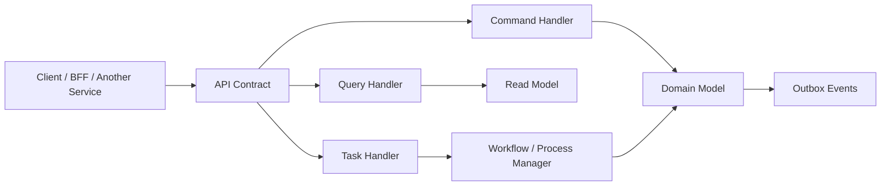
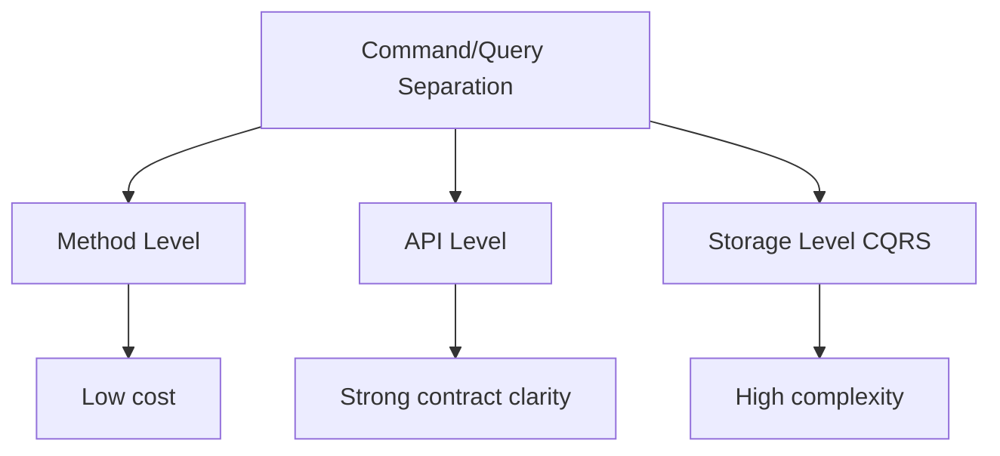
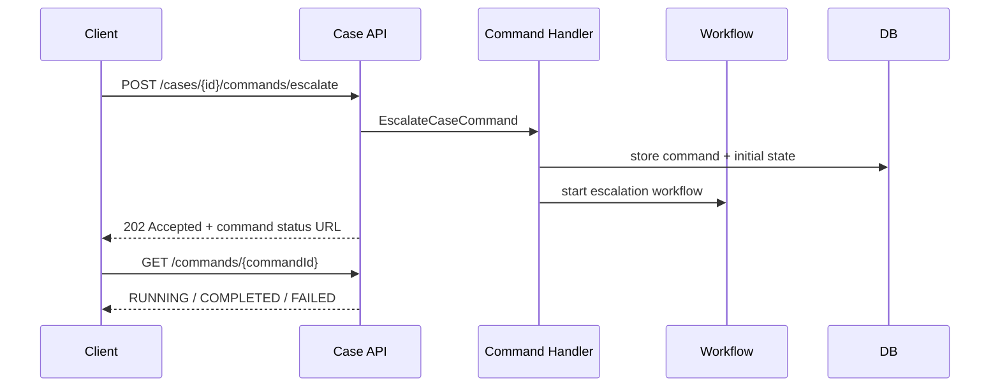
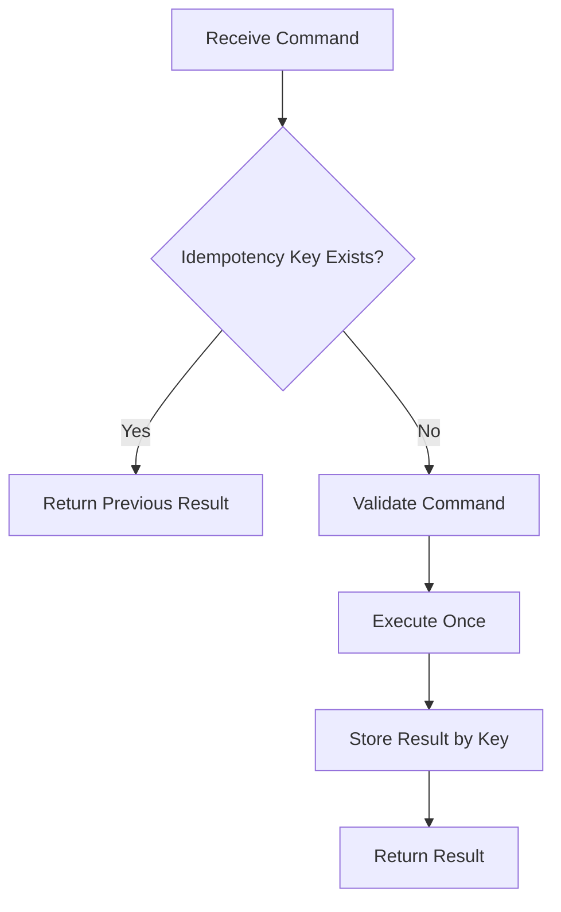
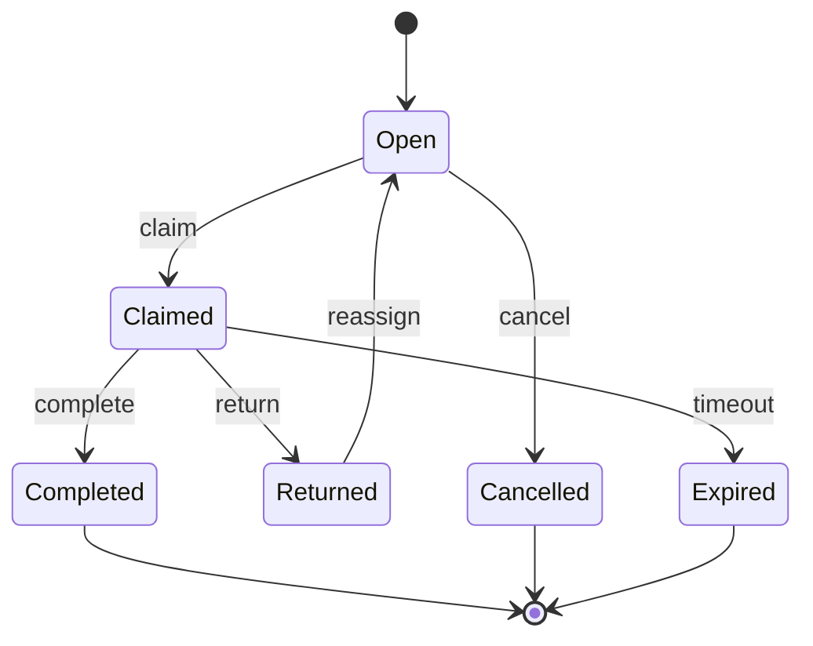
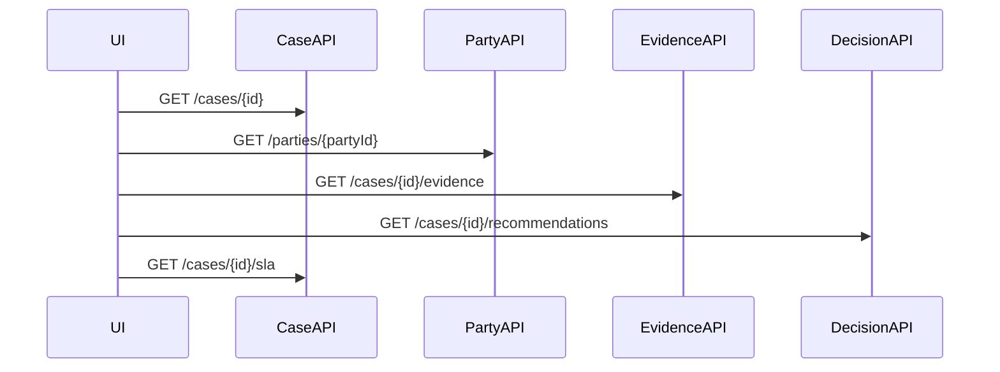
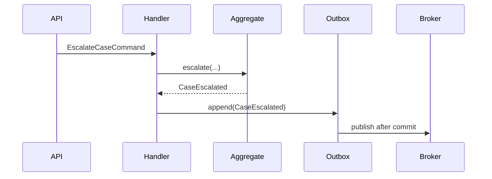

# Part 025 — Command, Query, and Task-Oriented API

> API yang baik tidak sekadar mengekspos tabel atau entity. API yang baik mengekspos **intent**.

Banyak Java microservice rusak bukan karena Spring Controller-nya buruk, tetapi karena API-nya salah membaca domain. Semua hal dijadikan CRUD:

- `POST /cases`
- `PATCH /cases/{id}`
- `DELETE /cases/{id}`
- `POST /case-statuses`
- `PATCH /case-statuses/{id}`

Padahal bisnis tidak berpikir seperti itu. Bisnis berpikir:

- assign case ke investigator;
- escalate case karena SLA breach;
- close case dengan decision dan evidence summary;
- reopen case karena appeal;
- request additional evidence;
- submit enforcement recommendation;
- approve or reject enforcement action.

Jika API hanya CRUD, service kehilangan bahasa bisnisnya. Invariant menjadi tersebar di client. Audit trail menjadi lemah. Retry menjadi berbahaya. Observability menjadi kabur karena log hanya berisi `PATCH /cases/{id}`, bukan `EscalateCase`.

Part ini membahas cara mendesain API berdasarkan **command**, **query**, dan **task** agar microservice lebih expressive, lebih aman, dan lebih mudah dioperasikan.

---

## 1. Core Model

Ada tiga jenis interaksi utama dengan service:

| Jenis | Pertanyaan | Efek | Contoh |
|---|---|---:|---|
| Query | “Apa yang diketahui sistem?” | Tidak mengubah state bisnis | `GET /cases/{caseId}` |
| Command | “Tolong ubah state dengan intent ini.” | Mengubah state bisnis | `POST /cases/{caseId}/commands/escalate` |
| Task | “Tolong jalankan pekerjaan/proses ini.” | Bisa sync atau async, sering long-running | `POST /case-review-tasks/{taskId}/complete` |

Diagram mentalnya:



Prinsipnya sederhana:

> Jangan memaksa semua intent masuk ke bentuk CRUD jika domain sebenarnya memiliki command/task yang lebih jelas.

---

## 2. Resource-Oriented API Tidak Salah

REST resource-oriented API tetap sangat berguna untuk:

- mengambil representasi resource;
- membuat resource baru;
- mengganti representasi resource;
- menghapus resource;
- navigasi koleksi;
- exposing stable information model.

Contoh yang wajar:

```http
GET /cases/CASE-2026-00041
GET /cases?status=UNDER_REVIEW&assignee=investigator-17
GET /cases/CASE-2026-00041/evidence
```

Masalah muncul ketika semua aksi bisnis dipaksakan menjadi update field.

Contoh API yang lemah:

```http
PATCH /cases/CASE-2026-00041
Content-Type: application/json

{
  "status": "ESCALATED",
  "escalationReason": "SLA_BREACH",
  "priority": "HIGH"
}
```

Secara teknis ini bisa bekerja, tetapi contract-nya tidak menjelaskan:

- siapa yang boleh melakukan escalation;
- apakah case boleh diescalate dari semua status;
- apakah escalation membuat audit event;
- apakah escalation mengubah SLA timer;
- apakah escalation mengirim notification;
- apakah retry aman;
- apakah status boleh di-set langsung oleh client;
- apakah field `priority` adalah input sah atau derived effect.

Task-oriented API membuat intent eksplisit:

```http
POST /cases/CASE-2026-00041/commands/escalate
Idempotency-Key: esc-CASE-2026-00041-20260705-001
Content-Type: application/json

{
  "reason": "SLA_BREACH",
  "requestedBy": "supervisor-3",
  "comment": "No investigator response after SLA window."
}
```

Sekarang domain punya command bernama jelas: `EscalateCase`.

---

## 3. Command API: Intent, Not Mutation

Command adalah permintaan untuk mengubah state berdasarkan intent bisnis.

Command yang baik punya ciri:

1. **verb bisnis jelas**;
2. **precondition eksplisit**;
3. **authorization boundary jelas**;
4. **idempotency strategy jelas**;
5. **side effect bisa diaudit**;
6. **hasilnya dapat diamati**.

Contoh command:

| Domain | Command | Endpoint |
|---|---|---|
| Case | AssignCase | `POST /cases/{caseId}/commands/assign` |
| Case | EscalateCase | `POST /cases/{caseId}/commands/escalate` |
| Evidence | RequestEvidence | `POST /cases/{caseId}/commands/request-evidence` |
| Decision | SubmitRecommendation | `POST /cases/{caseId}/commands/submit-recommendation` |
| Enforcement | ApproveAction | `POST /enforcement-actions/{actionId}/commands/approve` |

Nama endpoint bukan yang paling penting. Yang penting adalah API contract merepresentasikan command sebagai **unit intent**.

---

## 4. Command Tidak Selalu Berarti CQRS Besar

Banyak engineer mendengar “command” lalu langsung membayangkan CQRS/event sourcing besar. Itu premature.

Command/query separation bisa dipakai pada tiga level:

| Level | Bentuk | Kapan cukup |
|---|---|---|
| Method-level | `handle(command)` dan `find(query)` terpisah | Hampir semua service |
| API-level | command endpoint dan query endpoint terpisah | Domain punya lifecycle/action jelas |
| Storage-level CQRS | write model dan read model berbeda | Query kompleks, read scale besar, denormalisasi perlu |

Di sebagian besar microservice, level 1 dan 2 sudah memberi banyak manfaat tanpa kompleksitas read model terpisah.



Jangan memakai full CQRS kalau problem-nya hanya API naming.

---

## 5. Anatomy of a Command Contract

Command contract minimal:

```json
{
  "reason": "SLA_BREACH",
  "comment": "No investigator response after SLA window.",
  "requestedBy": "supervisor-3",
  "expectedVersion": 12
}
```

Elemen penting:

| Field | Fungsi |
|---|---|
| `reason` | Business reason, bukan free-text saja |
| `comment` | Human-readable note |
| `requestedBy` | Actor identity/context, jika tidak diambil dari token/session |
| `expectedVersion` | Optimistic concurrency guard |
| `idempotencyKey` | Biasanya header, bukan body |
| `correlationId` | Biasanya header dari platform/gateway |

Command response sebaiknya tidak selalu mengembalikan full aggregate.

Contoh response sync:

```json
{
  "caseId": "CASE-2026-00041",
  "commandId": "cmd-01JZ7X3Q7CJ4",
  "status": "ACCEPTED",
  "newCaseStatus": "ESCALATED",
  "version": 13,
  "occurredEvents": [
    "CaseEscalated",
    "SupervisorReviewRequested"
  ]
}
```

Untuk command async:

```http
HTTP/1.1 202 Accepted
Location: /commands/cmd-01JZ7X3Q7CJ4
Retry-After: 3
```

```json
{
  "commandId": "cmd-01JZ7X3Q7CJ4",
  "status": "ACCEPTED",
  "statusUrl": "/commands/cmd-01JZ7X3Q7CJ4"
}
```

---

## 6. Synchronous vs Asynchronous Command

Tidak semua command harus langsung selesai.

Gunakan command sync jika:

- perubahan state lokal cepat;
- invariant bisa diputuskan di service yang sama;
- tidak perlu menunggu dependency lambat;
- client perlu hasil langsung.

Gunakan command async jika:

- proses long-running;
- melibatkan workflow/human task;
- membutuhkan dependency eksternal yang lambat;
- perlu queue/backpressure;
- perlu retry terkontrol;
- hasil bisa diambil lewat status endpoint atau event.



A common mistake: membuat endpoint sync tapi di belakangnya melakukan banyak side effect lambat. Hasilnya client timeout, server tetap bekerja, client retry, lalu duplicate side effect terjadi.

---

## 7. HTTP Method Semantics untuk Command

Karena command biasanya membuat “processing attempt” atau “business action”, `POST` sering paling aman.

Tetapi jangan berpikir `POST` otomatis tidak bisa idempotent. Idempotency adalah **contract**, bukan sekadar method.

Pola umum:

```http
POST /cases/{caseId}/commands/escalate
Idempotency-Key: CASE-2026-00041:ESCALATE:SLA-2026-07-05
```

Server menyimpan hasil command berdasarkan idempotency key:



Idempotency harus mempertimbangkan scope:

| Scope | Contoh |
|---|---|
| Per actor | user yang sama retry request sama |
| Per resource | command sama untuk case yang sama |
| Per business event | escalation karena SLA breach pada window tertentu |
| Per external request | payment provider / external workflow callback |

Idempotency key yang terlalu global bisa menolak command sah. Idempotency key yang terlalu sempit tidak mencegah duplicate.

---

## 8. Command Handler di Java

Contoh sederhana:

```java
public record EscalateCaseRequest(
    String reason,
    String comment,
    Long expectedVersion
) {}

public record EscalateCaseCommand(
    CaseId caseId,
    EscalationReason reason,
    String comment,
    ActorId requestedBy,
    long expectedVersion,
    IdempotencyKey idempotencyKey,
    CorrelationId correlationId
) {}

public record CommandResult(
    String commandId,
    String status,
    String aggregateId,
    long version,
    List<String> occurredEvents
) {}
```

Controller hanya mapping transport ke command:

```java
@RestController
@RequestMapping("/cases/{caseId}/commands")
final class CaseCommandController {

    private final EscalateCaseHandler escalateCaseHandler;

    CaseCommandController(EscalateCaseHandler escalateCaseHandler) {
        this.escalateCaseHandler = escalateCaseHandler;
    }

    @PostMapping("/escalate")
    ResponseEntity<CommandResult> escalate(
            @PathVariable String caseId,
            @RequestHeader("Idempotency-Key") String idempotencyKey,
            @RequestHeader(value = "X-Correlation-Id", required = false) String correlationId,
            @AuthenticationPrincipal AuthenticatedUser user,
            @RequestBody @Valid EscalateCaseRequest request) {

        var command = new EscalateCaseCommand(
            CaseId.parse(caseId),
            EscalationReason.parse(request.reason()),
            request.comment(),
            ActorId.of(user.id()),
            request.expectedVersion(),
            IdempotencyKey.of(idempotencyKey),
            CorrelationId.optional(correlationId)
        );

        CommandResult result = escalateCaseHandler.handle(command);

        return ResponseEntity
            .ok()
            .header("X-Command-Id", result.commandId())
            .body(result);
    }
}
```

Application handler:

```java
@Service
final class EscalateCaseHandler {

    private final CaseRepository cases;
    private final IdempotencyStore idempotencyStore;
    private final Outbox outbox;
    private final Clock clock;

    @Transactional
    public CommandResult handle(EscalateCaseCommand command) {
        return idempotencyStore.executeOnce(command.idempotencyKey(), () -> {
            CaseFile caseFile = cases.getForUpdate(command.caseId())
                .orElseThrow(() -> new CaseNotFound(command.caseId()));

            caseFile.assertVersion(command.expectedVersion());

            List<DomainEvent> events = caseFile.escalate(
                command.reason(),
                command.comment(),
                command.requestedBy(),
                clock.instant()
            );

            cases.save(caseFile);
            outbox.appendAll(events);

            return CommandResult.completed(
                CommandId.newId(),
                command.caseId().value(),
                caseFile.version(),
                events.stream().map(e -> e.getClass().getSimpleName()).toList()
            );
        });
    }
}
```

Hal yang sengaja tidak dilakukan controller:

- tidak memutuskan business rule;
- tidak langsung mengubah entity JPA;
- tidak publish event langsung;
- tidak memanggil service eksternal;
- tidak mencampur authorization detail dan domain decision.

---

## 9. Query API: Designed for Reading, Not Reusing Write Model

Query bukan sekadar `GET` atas aggregate.

Pertanyaan client sering berbeda:

- “Tampilkan daftar case yang hampir breach SLA.”
- “Tampilkan case yang butuh review supervisor.”
- “Tampilkan timeline audit case.”
- “Tampilkan dashboard workload investigator.”

Jika query memaksa client mengambil banyak resource satu per satu, API menjadi chatty.

Bad:

```http
GET /cases?assignee=investigator-17
GET /cases/{id}/sla
GET /cases/{id}/latest-action
GET /cases/{id}/risk-score
GET /cases/{id}/party-summary
```

Better:

```http
GET /case-workbench/investigators/investigator-17/active-cases
```

Response:

```json
{
  "items": [
    {
      "caseId": "CASE-2026-00041",
      "status": "UNDER_REVIEW",
      "priority": "HIGH",
      "sla": {
        "state": "BREACHING_SOON",
        "dueAt": "2026-07-06T10:00:00Z"
      },
      "latestAction": "EVIDENCE_REQUESTED",
      "partySummary": "Acme Lending Ltd",
      "riskScore": 87
    }
  ],
  "nextPageToken": "eyJvZmZzZXQiOjEwMH0="
}
```

Ini bukan “melanggar REST”. Ini desain query sesuai user journey.

---

## 10. Query Handler di Java

Query object:

```java
public record ActiveCasesQuery(
    InvestigatorId investigatorId,
    int limit,
    Optional<String> pageToken,
    Optional<SlaState> slaState
) {}

public record ActiveCaseRow(
    String caseId,
    String status,
    String priority,
    String slaState,
    Instant dueAt,
    String latestAction,
    String partySummary,
    int riskScore
) {}
```

Query handler:

```java
@Service
final class ActiveCasesQueryHandler {

    private final ActiveCaseReadModel readModel;

    @Transactional(readOnly = true)
    public Page<ActiveCaseRow> handle(ActiveCasesQuery query) {
        return readModel.findActiveCases(
            query.investigatorId(),
            query.slaState(),
            query.limit(),
            query.pageToken()
        );
    }
}
```

Controller:

```java
@RestController
@RequestMapping("/case-workbench")
final class CaseWorkbenchController {

    private final ActiveCasesQueryHandler handler;

    @GetMapping("/investigators/{investigatorId}/active-cases")
    PageResponse<ActiveCaseRow> activeCases(
            @PathVariable String investigatorId,
            @RequestParam(defaultValue = "50") int limit,
            @RequestParam Optional<String> pageToken,
            @RequestParam Optional<String> slaState) {

        var query = new ActiveCasesQuery(
            InvestigatorId.of(investigatorId),
            Math.min(limit, 100),
            pageToken,
            slaState.map(SlaState::parse)
        );

        return PageResponse.from(handler.handle(query));
    }
}
```

Query handler boleh memakai read model, projection, SQL view, materialized table, search index, atau cache. Tetapi contract harus menyatakan **freshness/staleness** jika data tidak strongly consistent.

---

## 11. Task-Oriented API

Task API cocok untuk work item yang punya lifecycle sendiri.

Contoh:

- evidence review task;
- supervisor approval task;
- remediation monitoring task;
- external agency referral task;
- manual reconciliation task.

Task biasanya bukan aggregate utama. Task adalah unit pekerjaan dalam proses.

Contoh:

```http
POST /review-tasks/TASK-8821/commands/complete
Content-Type: application/json

{
  "outcome": "APPROVED",
  "comment": "Evidence package is sufficient for escalation.",
  "expectedVersion": 4
}
```

Task lifecycle:



Task API harus menjelaskan:

- siapa owner task;
- siapa boleh claim/complete;
- apakah task bisa expired;
- outcome apa yang sah;
- side effect completion;
- apakah completion idempotent;
- audit field apa yang wajib.

---

## 12. Command Result Should Be Stable

Jangan mengembalikan object internal yang mudah berubah.

Bad:

```json
{
  "id": "CASE-2026-00041",
  "internalStatusCode": 9,
  "jpaVersion": 13,
  "internalWorkflowNode": "NODE_ESC_SUP_02",
  "hibernateLazyFields": []
}
```

Better:

```json
{
  "commandId": "cmd-01JZ7X3Q7CJ4",
  "result": "COMPLETED",
  "caseId": "CASE-2026-00041",
  "caseStatus": "ESCALATED",
  "version": 13,
  "links": {
    "case": "/cases/CASE-2026-00041",
    "timeline": "/cases/CASE-2026-00041/timeline"
  }
}
```

Command result adalah contract. Jangan bocorkan internal workflow node, table id, atau implementation detail.

---

## 13. Error Semantics untuk Command API

Command error harus dapat dibedakan.

| Error | Meaning | Typical HTTP |
|---|---|---|
| ValidationError | request shape/value invalid | 400 |
| AuthenticationRequired | caller belum authenticated | 401 |
| PermissionDenied | caller tidak boleh command ini | 403 |
| AggregateNotFound | target tidak ada | 404 |
| Conflict | expected version/state conflict | 409 |
| BusinessRuleViolation | command valid tapi rule menolak | 422 or 409 |
| DuplicateCommand | idempotency conflict | 409 |
| DependencyUnavailable | dependency gagal | 503 |
| CommandAccepted | async processing diterima | 202 |

Contoh error:

```json
{
  "type": "https://errors.example.com/case-command-rejected",
  "title": "Case command rejected",
  "status": 409,
  "detail": "Case CASE-2026-00041 cannot be escalated from status CLOSED.",
  "instance": "/cases/CASE-2026-00041/commands/escalate",
  "errorCode": "CASE_INVALID_STATE_FOR_ESCALATION",
  "currentStatus": "CLOSED",
  "allowedStatuses": ["UNDER_REVIEW", "PENDING_SUPERVISOR_REVIEW"]
}
```

Error yang baik membantu caller memutuskan:

- retry atau tidak;
- ubah input atau tidak;
- refresh state atau tidak;
- eskalasi ke manusia atau tidak.

---

## 14. Command Naming Rules

Gunakan nama command yang stabil secara bisnis.

Good:

- `AssignCase`
- `EscalateCase`
- `RequestEvidence`
- `SubmitRecommendation`
- `ApproveEnforcementAction`
- `CloseCase`
- `ReopenCase`

Weak:

- `UpdateCase`
- `ModifyStatus`
- `SetFlag`
- `ChangeData`
- `ProcessCase`
- `ExecuteAction`

Nama command yang terlalu generik biasanya tanda domain belum dipahami.

---

## 15. Avoid Chatty APIs

Chatty API sering muncul ketika service terlalu entity-centric.

Bad flow:



Jika ini terjadi pada satu screen, mungkin perlu query/composition API:

```http
GET /case-workbench/cases/CASE-2026-00041/review-summary
```

Tetapi hati-hati: composition API bukan tempat business rule utama. Ia adalah read experience. Jangan ubah aggregator menjadi god service.

---

## 16. Command API and Authorization Boundary

Command API memperjelas authorization.

Lebih mudah menulis policy:

```text
Supervisor can EscalateCase when case.status in [UNDER_REVIEW, PENDING_SUPERVISOR_REVIEW]
```

daripada:

```text
Supervisor can PATCH /cases/{id} if patch contains status=ESCALATED and previous status is ...
```

Authorization bukan topik utama part ini, tetapi command naming membantu policy menjadi eksplisit.

---

## 17. Event Emission from Command

Command bukan event.

- Command: permintaan melakukan sesuatu.
- Event: fakta bahwa sesuatu sudah terjadi.

Contoh:

| Command | Event |
|---|---|
| `EscalateCase` | `CaseEscalated` |
| `RequestEvidence` | `EvidenceRequested` |
| `ApproveAction` | `EnforcementActionApproved` |
| `CloseCase` | `CaseClosed` |

Flow:



Jangan publish `EscalateCaseRequested` jika sebenarnya command gagal. Event harus merepresentasikan fakta bisnis yang sudah valid.

---

## 18. Expected Version and Lost Update

Command yang mengubah aggregate penting sebaiknya menyertakan expected version.

Contoh skenario:

1. User A membuka case versi 12.
2. User B menutup case menjadi versi 13.
3. User A mencoba escalate berdasarkan versi 12.
4. Service harus menolak karena state yang dilihat User A sudah stale.

Request:

```json
{
  "reason": "SLA_BREACH",
  "expectedVersion": 12
}
```

Response:

```http
HTTP/1.1 409 Conflict
```

```json
{
  "errorCode": "STALE_AGGREGATE_VERSION",
  "expectedVersion": 12,
  "actualVersion": 13,
  "message": "Case has changed since the client last read it. Refresh before retrying."
}
```

Ini jauh lebih aman daripada last-write-wins.

---

## 19. API Shape Options

Ada beberapa bentuk endpoint command.

### Option A — Nested command resource

```http
POST /cases/{caseId}/commands/escalate
```

Pros:

- jelas command menargetkan case;
- mudah dipahami;
- cocok untuk internal API.

Cons:

- tidak terlalu pure REST;
- command list bisa bertambah banyak.

### Option B — Command collection

```http
POST /case-commands
```

Body:

```json
{
  "type": "EscalateCase",
  "caseId": "CASE-2026-00041",
  "reason": "SLA_BREACH"
}
```

Pros:

- cocok untuk async command bus;
- mudah membuat command status endpoint.

Cons:

- type dispatch bisa menjadi generic endpoint smell;
- validation dan documentation bisa lebih sulit.

### Option C — Task/action resource

```http
POST /case-escalations
```

Body:

```json
{
  "caseId": "CASE-2026-00041",
  "reason": "SLA_BREACH"
}
```

Pros:

- escalation diperlakukan sebagai resource/process;
- cocok jika escalation punya lifecycle sendiri.

Cons:

- overkill untuk command sederhana.

Tidak ada satu bentuk yang selalu benar. Pilih berdasarkan lifecycle command.

---

## 20. Decision Matrix

| Situation | Prefer |
|---|---|
| Simple read by id | Resource API |
| List/search/filter | Query API |
| Business action with invariant | Command API |
| Long-running human/system work | Task API |
| Multi-step business process | Workflow/process API |
| UI screen needs joined data | Query/composition API |
| External integration needs stable state changes | Command + event |
| High write/read divergence | CQRS read/write model |

---

## 21. Smells

### Smell 1 — Generic Update Endpoint

```http
PATCH /cases/{id}
```

Body has many optional fields and each field triggers hidden side effects.

Better: explicit commands.

### Smell 2 — Client Owns Workflow

Client calls:

1. update status;
2. create audit row;
3. notify supervisor;
4. create task;
5. update SLA.

This means server has leaked business process to client.

### Smell 3 — Event Before Invariant

Service publishes event just because command was received, before business invariant is validated.

### Smell 4 — Query Requires N+1 Remote Calls

One screen causes 20 remote calls. This is a query/composition smell.

### Smell 5 — Command Has No Idempotency

Client timeout causes retry and duplicate side effect.

### Smell 6 — Command Name Mirrors Database Operation

`SetCaseStatus`, `UpdatePriority`, `ChangeOwnerId` are often field mutation, not business intent.

---

## 22. Architecture Review Checklist

For each API endpoint, ask:

1. Is this endpoint a query, command, or task?
2. If command, what business intent does it represent?
3. What invariant does it protect?
4. Is the endpoint retry-safe?
5. What is the idempotency key scope?
6. What is the concurrency guard?
7. What events can be emitted?
8. Are side effects explicit or hidden?
9. What error tells caller to retry vs not retry?
10. Does the response expose internal implementation detail?
11. Does the endpoint force client orchestration?
12. Does the query create chatty remote call behavior?
13. Does the API match a user journey or just database shape?
14. Can the contract evolve without breaking consumers?
15. Is audit semantics clear?

---

## 23. Mini Case Study — Case Escalation

### Bad CRUD Design

```http
PATCH /cases/CASE-2026-00041

{
  "status": "ESCALATED",
  "priority": "HIGH",
  "assignedTeam": "SUPERVISOR_REVIEW"
}
```

Hidden rules:

- only supervisor can escalate;
- closed case cannot be escalated;
- escalation reason is required;
- audit event must be stored;
- SLA timer changes;
- supervisor review task must be created;
- notification may be sent.

### Better Command Design

```http
POST /cases/CASE-2026-00041/commands/escalate
Idempotency-Key: CASE-2026-00041:ESCALATE:SLA-BREACH:2026-07-05

{
  "reason": "SLA_BREACH",
  "comment": "No response before due time.",
  "expectedVersion": 12
}
```

Domain method:

```java
public List<DomainEvent> escalate(
        EscalationReason reason,
        String comment,
        ActorId requestedBy,
        Instant now) {

    if (status == CaseStatus.CLOSED) {
        throw new CaseCannotBeEscalated(id, status);
    }

    if (!status.canEscalate()) {
        throw new InvalidCaseStateForEscalation(id, status);
    }

    this.status = CaseStatus.ESCALATED;
    this.priority = Priority.HIGH;
    this.escalatedAt = now;
    this.version++;

    return List.of(
        new CaseEscalated(id, reason, requestedBy, now),
        new SupervisorReviewRequested(id, requestedBy, now)
    );
}
```

The API now protects business meaning.

---

## 24. Key Takeaways

- Resource-oriented API is useful, but not every business interaction is CRUD.
- Command API exposes intent and protects invariants.
- Query API should be shaped by read use cases, not necessarily write aggregates.
- Task API is useful for human/system work items with lifecycle.
- Idempotency, expected version, error semantics, and auditability are part of the API contract.
- Do not jump to full CQRS unless read/write complexity justifies it.
- A good API reduces hidden workflow in clients.

---

## 25. Practice

Take one existing CRUD endpoint in your system and answer:

1. What business command is hidden behind this update?
2. What invariant is currently enforced by client code?
3. What side effects happen after the update?
4. What should the idempotency key be?
5. What should happen on retry?
6. What event should be emitted after success?
7. What response should caller receive?
8. What errors are retryable and non-retryable?
9. What audit evidence must be stored?
10. Would this be sync command, async command, or task?

Then rewrite the endpoint as command/query/task-oriented API.

---

## References

- RFC 9110 — HTTP Semantics: https://www.rfc-editor.org/rfc/rfc9110.html
- RFC 9457 — Problem Details for HTTP APIs: https://www.rfc-editor.org/rfc/rfc9457.html
- Martin Fowler — CQRS: https://martinfowler.com/bliki/CQRS.html
- Martin Fowler — Task-Based UI: https://martinfowler.com/bliki/TaskBasedUI.html
- Microsoft REST API Guidelines: https://github.com/microsoft/api-guidelines
