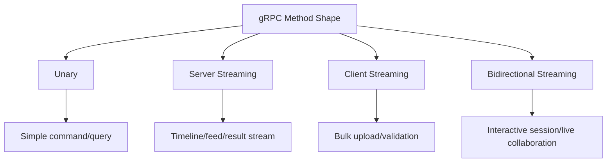
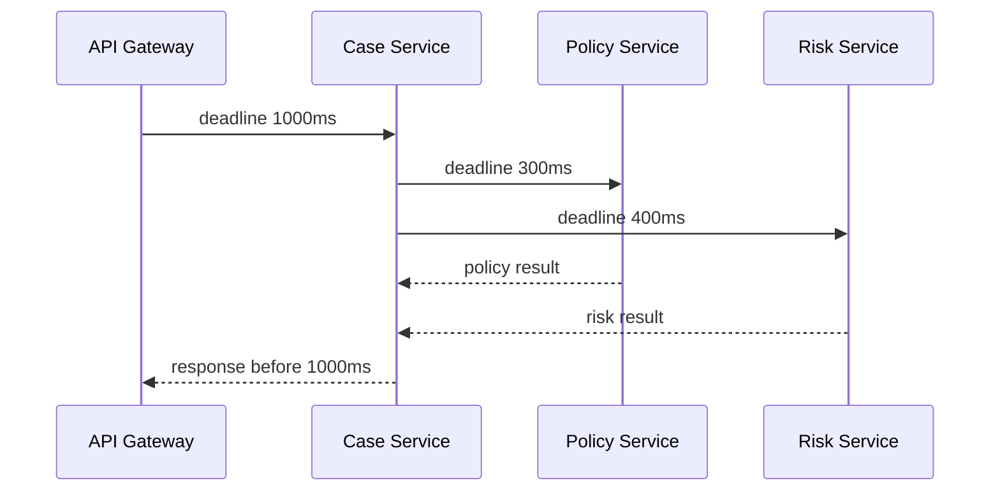
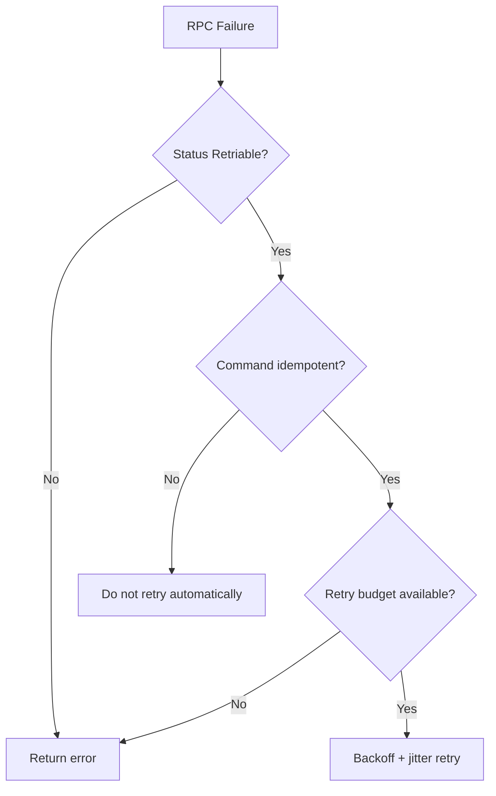
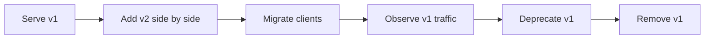
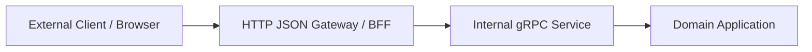

# Part 026 — gRPC and Binary RPC in Java Microservices

> gRPC bukan “REST yang lebih cepat”. gRPC adalah kontrak RPC strongly typed dengan operational semantics yang berbeda.

REST/HTTP JSON sering menjadi default untuk microservices karena mudah dibaca, mudah dites, dan mudah diintegrasikan. Tetapi dalam beberapa konteks, JSON-over-HTTP mulai terasa mahal atau kurang presisi:

- internal service-to-service call dengan traffic tinggi;
- low-latency dependency path;
- strongly typed contract lintas bahasa;
- streaming data;
- binary payload yang efisien;
- API internal yang tidak perlu human-readable by default;
- contract-first RPC yang ingin menghasilkan client/server stub.

Di titik itu, gRPC menjadi pilihan menarik.

Tetapi ada jebakan: banyak tim mengadopsi gRPC karena “performant”, lalu lupa bahwa distributed call tetap distributed call. Timeout, deadline, retry, cancellation, overload, compatibility, observability, dan load balancing tetap menjadi masalah utama.

Part ini membahas gRPC sebagai **architecture choice**, bukan hanya cara generate stub.

---

## 1. Mental Model: REST Resource vs RPC Procedure

REST cenderung memodelkan resource dan representasi:

```http
GET /cases/CASE-2026-00041
POST /cases/CASE-2026-00041/commands/escalate
```

gRPC memodelkan service dan method:

```proto
service CaseCommandService {
  rpc EscalateCase(EscalateCaseRequest) returns (EscalateCaseResponse);
}
```

Perbedaannya:

| Concern | REST/JSON | gRPC/Protobuf |
|---|---|---|
| Primary abstraction | Resource / HTTP semantics | Service method / RPC semantics |
| Contract | OpenAPI/JSON Schema/etc | `.proto` IDL |
| Payload | Text JSON | Binary protobuf |
| Streaming | Possible, less uniform | First-class RPC shape |
| Browser support | Native-friendly | Needs gateway/proxy for many browser cases |
| Human debugging | Easy with curl | Needs grpcurl/proto tooling |
| Type safety | Depends on generation discipline | Strong by default |
| Public API friendliness | Often better | Possible but more specialized |
| Internal service call | Good | Often excellent |

Do not choose gRPC only because it is fashionable. Choose it because the interaction model benefits from RPC semantics.

---

## 2. When gRPC Fits

gRPC fits well when:

1. **service-to-service traffic is internal and high volume**;
2. **schema needs strong typing**;
3. **latency and payload size matter**;
4. **streaming is natural**;
5. **clients are controlled**;
6. **contract generation is valuable**;
7. **you can invest in tooling and observability**.

Examples:

- pricing service called thousands of times per second;
- risk scoring service used by multiple internal products;
- real-time case activity stream;
- batch validation service with server-streamed result;
- feature computation service;
- internal policy decision service.

---

## 3. When gRPC Does Not Fit

Avoid gRPC as default if:

- external consumers expect simple HTTP/JSON;
- browser/client integration is dominant;
- human operability via plain HTTP tools is more important;
- organization lacks protobuf governance;
- public API versioning/deprecation process is immature;
- API is mostly document/resource-oriented;
- payload is small, traffic low, and simplicity matters more.

If you adopt gRPC without platform support, every team will reinvent:

- deadline propagation;
- client channel configuration;
- retry policy;
- error mapping;
- interceptor conventions;
- auth metadata;
- tracing propagation;
- proto compatibility checks.

That is how “fast RPC” becomes a distributed monolith accelerator.

---

## 4. Basic gRPC Service Design

Example `.proto`:

```proto
syntax = "proto3";

package enforcement.case.v1;

option java_multiple_files = true;
option java_package = "com.acme.enforcement.caseapi.v1";
option java_outer_classname = "CaseCommandApi";

service CaseCommandService {
  rpc EscalateCase(EscalateCaseRequest) returns (EscalateCaseResponse);
  rpc AssignCase(AssignCaseRequest) returns (AssignCaseResponse);
}

message EscalateCaseRequest {
  string case_id = 1;
  string reason = 2;
  string comment = 3;
  int64 expected_version = 4;
  string idempotency_key = 5;
}

message EscalateCaseResponse {
  string command_id = 1;
  string case_id = 2;
  string status = 3;
  int64 version = 4;
  repeated string occurred_events = 5;
}
```

Design rules:

- package by domain capability and version;
- method names should be business intent;
- avoid generic `Execute(Command)` unless building an internal command bus intentionally;
- keep request/response messages method-specific unless reuse is semantically true;
- include idempotency and version fields if command mutates state;
- document deadline expectation.

---

## 5. RPC Shapes

gRPC supports four interaction shapes.

### Unary RPC

One request, one response.

```proto
rpc EscalateCase(EscalateCaseRequest) returns (EscalateCaseResponse);
```

Use for most command/query operations.

### Server Streaming

One request, stream of responses.

```proto
rpc StreamCaseTimeline(StreamCaseTimelineRequest)
    returns (stream CaseTimelineEvent);
```

Use when server emits many items over time or result set is large.

### Client Streaming

Stream of requests, one response.

```proto
rpc UploadEvidenceMetadata(stream EvidenceMetadataChunk)
    returns (UploadEvidenceMetadataResponse);
```

Use when client sends many items and wants aggregated result.

### Bidirectional Streaming

Stream both ways.

```proto
rpc ReviewSession(stream ReviewSessionMessage)
    returns (stream ReviewSessionMessage);
```

Use rarely. It is powerful but operationally more complex.



Default to unary unless streaming solves a real problem.

---

## 6. Deadline Is Not Optional

Every RPC should have a deadline.

A deadline answers:

> “Past what point is the client no longer interested in the result?”

Without deadlines:

- client waits too long;
- server keeps processing useless work;
- thread pools saturate;
- retry storms grow;
- upstream timeout and downstream work continue misaligned.

Java client example:

```java
CaseCommandServiceGrpc.CaseCommandServiceBlockingStub stub =
    CaseCommandServiceGrpc.newBlockingStub(channel)
        .withDeadlineAfter(750, TimeUnit.MILLISECONDS);

EscalateCaseResponse response = stub.escalateCase(request);
```

Server should respect cancellation:

```java
@Override
public void streamCaseTimeline(
        StreamCaseTimelineRequest request,
        StreamObserver<CaseTimelineEvent> responseObserver) {

    Context context = Context.current();

    try {
        for (CaseTimelineEvent event : timelineEvents(request.getCaseId())) {
            if (context.isCancelled()) {
                return;
            }
            responseObserver.onNext(event);
        }
        responseObserver.onCompleted();
    } catch (Exception ex) {
        responseObserver.onError(toStatusException(ex));
    }
}
```

Deadline should be part of architecture, not caller preference alone.

---

## 7. Deadline Budget Propagation

In a service chain, each hop must consume part of the remaining budget.



Do not do this:

```text
Gateway timeout: 1000ms
Case -> Policy timeout: 1000ms
Case -> Risk timeout: 1000ms
Case -> Notification timeout: 1000ms
```

That creates overload because downstream work can exceed upstream budget.

Better:

- total request budget: 1000 ms;
- local validation: 50 ms;
- DB read: 150 ms;
- policy RPC: 250 ms;
- risk RPC: 350 ms;
- response assembly: 100 ms;
- buffer: 100 ms.

Deadline propagation is one of the biggest practical differences between robust and fragile RPC systems.

---

## 8. Status Codes and Error Model

gRPC returns status code + optional description + trailers/metadata.

Common mapping:

| gRPC Status | Meaning |
|---|---|
| `OK` | success |
| `INVALID_ARGUMENT` | request invalid independent of current state |
| `NOT_FOUND` | target resource not found |
| `ALREADY_EXISTS` | duplicate creation/idempotency conflict |
| `FAILED_PRECONDITION` | system state does not allow operation |
| `ABORTED` | concurrency conflict / transaction abort |
| `PERMISSION_DENIED` | authenticated but not allowed |
| `UNAUTHENTICATED` | identity missing/invalid |
| `DEADLINE_EXCEEDED` | deadline expired |
| `UNAVAILABLE` | transient dependency/service unavailable |
| `RESOURCE_EXHAUSTED` | quota/rate/resource limit exceeded |
| `INTERNAL` | server bug/unexpected failure |

Example server mapping:

```java
private StatusRuntimeException toStatusException(Throwable ex) {
    if (ex instanceof CaseNotFound e) {
        return Status.NOT_FOUND
            .withDescription("Case not found: " + e.caseId())
            .asRuntimeException();
    }

    if (ex instanceof InvalidCaseState e) {
        return Status.FAILED_PRECONDITION
            .withDescription(e.getMessage())
            .asRuntimeException();
    }

    if (ex instanceof StaleVersion e) {
        return Status.ABORTED
            .withDescription(e.getMessage())
            .asRuntimeException();
    }

    return Status.INTERNAL
        .withDescription("Unexpected server error")
        .asRuntimeException();
}
```

Do not map every business error to `UNKNOWN` or `INTERNAL`. That destroys retry logic and operability.

---

## 9. Retry Semantics

Retriable gRPC failures often include:

- `UNAVAILABLE`;
- `DEADLINE_EXCEEDED` with careful interpretation;
- `RESOURCE_EXHAUSTED` if retry-after/backoff is honored;
- some `ABORTED` cases if operation is concurrency-safe.

Non-retriable failures often include:

- `INVALID_ARGUMENT`;
- `NOT_FOUND` unless data propagation delay is expected;
- `PERMISSION_DENIED`;
- `UNAUTHENTICATED` without credential refresh;
- `FAILED_PRECONDITION` when business state rejects command.

But never rely only on status code. Command retry requires idempotency.



---

## 10. Channel and Stub Lifecycle in Java

Creating channel per call is a smell.

Bad:

```java
public EscalateCaseResponse call(EscalateCaseRequest request) {
    ManagedChannel channel = ManagedChannelBuilder
        .forAddress("case-service", 9090)
        .usePlaintext()
        .build();

    try {
        return CaseCommandServiceGrpc.newBlockingStub(channel)
            .escalateCase(request);
    } finally {
        channel.shutdown();
    }
}
```

Better:

```java
final class CaseCommandClient implements AutoCloseable {

    private final ManagedChannel channel;
    private final CaseCommandServiceGrpc.CaseCommandServiceBlockingStub stub;

    CaseCommandClient(String host, int port) {
        this.channel = ManagedChannelBuilder
            .forAddress(host, port)
            .useTransportSecurity()
            .build();

        this.stub = CaseCommandServiceGrpc.newBlockingStub(channel);
    }

    EscalateCaseResponse escalate(EscalateCaseRequest request, Duration timeout) {
        return stub
            .withDeadlineAfter(timeout.toMillis(), TimeUnit.MILLISECONDS)
            .escalateCase(request);
    }

    @Override
    public void close() {
        channel.shutdown();
    }
}
```

Channel lifecycle should be owned by application infrastructure, not per request.

---

## 11. Interceptors

Interceptors are the RPC equivalent of cross-cutting middleware.

Use interceptors for:

- trace context propagation;
- correlation ID;
- authentication metadata;
- logging envelope;
- metric instrumentation;
- deadline enforcement;
- tenant context;
- error normalization.

Do not use interceptors for:

- business decisions;
- domain validation;
- workflow orchestration;
- hidden side effects.

Example client interceptor conceptually:

```java
final class CorrelationIdClientInterceptor implements ClientInterceptor {

    private static final Metadata.Key<String> CORRELATION_ID =
        Metadata.Key.of("x-correlation-id", Metadata.ASCII_STRING_MARSHALLER);

    @Override
    public <ReqT, RespT> ClientCall<ReqT, RespT> interceptCall(
            MethodDescriptor<ReqT, RespT> method,
            CallOptions callOptions,
            Channel next) {

        return new ForwardingClientCall.SimpleForwardingClientCall<>(
                next.newCall(method, callOptions)) {
            @Override
            public void start(Listener<RespT> responseListener, Metadata headers) {
                headers.put(CORRELATION_ID, Correlation.currentId());
                super.start(responseListener, headers);
            }
        };
    }
}
```

---

## 12. Protobuf Evolution Rules

Protobuf compatibility is powerful, but only if teams follow rules.

Important practices:

- never reuse field numbers;
- reserve deleted field numbers and names;
- add fields instead of changing meaning;
- do not add required fields;
- avoid changing field type incompatibly;
- treat enum zero value carefully;
- never change semantic meaning silently;
- version package when compatibility cannot be preserved.

Example:

```proto
message EscalateCaseRequest {
  string case_id = 1;
  string reason = 2;
  string comment = 3;
  int64 expected_version = 4;
  string idempotency_key = 5;

  reserved 6;
  reserved "legacy_priority_override";

  string escalation_policy_id = 7;
}
```

Enum:

```proto
enum EscalationReason {
  ESCALATION_REASON_UNSPECIFIED = 0;
  ESCALATION_REASON_SLA_BREACH = 1;
  ESCALATION_REASON_HIGH_RISK = 2;
  ESCALATION_REASON_MANUAL_SUPERVISOR_REQUEST = 3;
}
```

Zero value should mean unspecified/unknown, not a real business value.

---

## 13. Versioning Strategy

Package versioning:

```proto
package enforcement.case.v1;
```

Breaking change:

```proto
package enforcement.case.v2;
```

But do not create v2 for every additive field. Additive compatible evolution should stay in v1.

Use v2 when:

- method semantics change;
- field meaning changes;
- response structure changes incompatibly;
- authorization model changes materially;
- old and new clients cannot safely share contract.

Migration pattern:



---

## 14. gRPC Gateway Pattern

Sometimes you want internal gRPC but external HTTP/JSON.

Pattern:



This can work, but avoid turning gateway into business owner.

Gateway responsibilities:

- protocol translation;
- auth/session adaptation;
- response shaping for client;
- rate limit at edge;
- input normalization.

Gateway should not own core domain decisions.

---

## 15. Streaming Design

Server streaming example:

```proto
service CaseTimelineService {
  rpc StreamCaseTimeline(StreamCaseTimelineRequest)
      returns (stream CaseTimelineEvent);
}

message StreamCaseTimelineRequest {
  string case_id = 1;
  string after_event_id = 2;
}

message CaseTimelineEvent {
  string event_id = 1;
  string case_id = 2;
  string event_type = 3;
  int64 occurred_at_epoch_ms = 4;
  string summary = 5;
}
```

Questions before choosing streaming:

1. Is this long-lived or just pagination?
2. What happens if client disconnects?
3. Can client resume from last event id?
4. What is max stream duration?
5. How do we apply backpressure?
6. What is per-tenant stream limit?
7. How is stream observed?
8. Does server hold scarce resources?

Streaming is not free. It moves complexity from pagination to lifecycle management.

---

## 16. Backpressure and Resource Limits

gRPC streaming can overwhelm either side if not controlled.

Controls:

- max message size;
- max concurrent streams;
- per-client stream limit;
- server-side flow control awareness;
- bounded queues;
- cancellation checks;
- deadlines;
- rate limits.

Bad design:

```java
for (var event : millionsOfEvents) {
    responseObserver.onNext(event);
}
responseObserver.onCompleted();
```

Better design:

- page from storage;
- check cancellation;
- cap result count;
- expose resume token;
- prefer pagination if stream is not truly needed.

---

## 17. Observability for gRPC

For every RPC method, collect:

- request count;
- latency histogram;
- status code count;
- deadline exceeded count;
- cancellation count;
- message size;
- active streams;
- retry count;
- downstream dependency duration;
- tenant/client label with controlled cardinality.

Trace span naming:

```text
grpc.server / enforcement.case.v1.CaseCommandService/EscalateCase
grpc.client / enforcement.policy.v1.PolicyDecisionService/Evaluate
```

Log envelope:

```json
{
  "event": "grpc_request_completed",
  "service": "case-service",
  "method": "enforcement.case.v1.CaseCommandService/EscalateCase",
  "status": "FAILED_PRECONDITION",
  "durationMs": 41,
  "caseId": "CASE-2026-00041",
  "correlationId": "corr-01JZ7X",
  "tenantId": "tenant-a"
}
```

Do not log raw protobuf payload if it contains sensitive data. Define redaction rules.

---

## 18. Security and Metadata

gRPC metadata often carries:

- authorization token;
- tenant id;
- correlation id;
- locale;
- caller service identity;
- request id.

Do not treat metadata as trusted unless authenticated by platform or token.

In zero-trust internal networks:

- use TLS/mTLS where appropriate;
- authenticate workload identity;
- authorize method-level access;
- avoid passing user identity as plain string without verification;
- propagate least necessary context.

Security details will be covered later, but gRPC design must leave space for them.

---

## 19. Load Balancing and Name Resolution

gRPC clients use long-lived HTTP/2 connections. That affects load balancing.

If a client opens one long-lived connection to one backend, traffic may not spread as expected.

Practical options:

- proxy/load balancer that understands HTTP/2/gRPC;
- client-side load balancing with service discovery;
- service mesh;
- multiple channels/subchannels;
- xDS-based control plane in mature platforms.

Architecture review must ask:

- how does client discover endpoints?
- how are connections balanced?
- what happens when pod is removed?
- how fast does client react to endpoint changes?
- are long-lived streams drained on deploy?

---

## 20. Testing gRPC APIs

Test layers:

| Layer | What to test |
|---|---|
| Proto compatibility | breaking field/method changes |
| Unit | mapper and domain handler |
| In-process server test | service implementation behavior |
| Contract test | generated client vs server compatibility |
| Integration test | deadline, status code, metadata |
| Load test | channel, latency, stream behavior |

Example service test concept:

```java
@Test
void rejectsEscalationWhenCaseClosed() {
    var request = EscalateCaseRequest.newBuilder()
        .setCaseId("CASE-2026-00041")
        .setReason("SLA_BREACH")
        .setExpectedVersion(7)
        .setIdempotencyKey("test-key-1")
        .build();

    StatusRuntimeException ex = assertThrows(
        StatusRuntimeException.class,
        () -> client.escalateCase(request)
    );

    assertEquals(Status.FAILED_PRECONDITION.getCode(), ex.getStatus().getCode());
}
```

Contract test should fail if someone reuses a removed field number.

---

## 21. gRPC vs REST Decision Matrix

| Requirement | Prefer REST/JSON | Prefer gRPC/Protobuf |
|---|---:|---:|
| Public web API | Strong | Sometimes |
| Browser native usage | Strong | Weak without gateway |
| Internal high-volume call | Good | Strong |
| Strong generated typing | Medium | Strong |
| Human debugging | Strong | Medium with tooling |
| Streaming | Medium | Strong |
| Long-lived client compatibility | Strong if governed | Strong if proto governed |
| Edge caching/CDN | Strong | Weak/complex |
| Polyglot internal platform | Good | Strong |
| Simple CRUD/resource API | Strong | Usually unnecessary |
| Low-latency fan-out path | Medium | Strong |

Default recommendation:

- external/public API: REST/JSON unless strong reason otherwise;
- internal service-to-service: REST or gRPC, based on traffic, typing, and platform maturity;
- streaming/high-throughput internal API: consider gRPC;
- mixed environment: use gateway/BFF carefully.

---

## 22. Anti-Patterns

### Anti-Pattern 1 — gRPC Because Faster

Performance without deadline, retry, and observability discipline only makes failure faster.

### Anti-Pattern 2 — Generic RPC God Service

```proto
service GenericService {
  rpc Execute(CommandEnvelope) returns (ResponseEnvelope);
}
```

This hides contract, makes compatibility harder, and weakens tooling.

### Anti-Pattern 3 — Proto as Database Schema

Do not expose JPA/entity structure as protobuf. Proto is API contract, not table mirror.

### Anti-Pattern 4 — No Deadlines

Every client call can wait indefinitely. This is an overload bug waiting to happen.

### Anti-Pattern 5 — Reusing Field Numbers

Old clients may decode new data incorrectly. This is catastrophic and hard to debug.

### Anti-Pattern 6 — Mapping All Errors to UNKNOWN

Client cannot distinguish retryable, invalid, permission, and state errors.

### Anti-Pattern 7 — Long Stream Without Lifecycle Rules

No max duration, no resume token, no cancellation handling, no active stream metric.

---

## 23. Production Checklist

Before approving a gRPC service, verify:

1. Does `.proto` model business capability, not database tables?
2. Are package names versioned?
3. Are method names intent-revealing?
4. Are deadlines required and documented?
5. Does every client set deadline?
6. Are server cancellations respected?
7. Are status codes mapped consistently?
8. Are retryable vs non-retryable errors clear?
9. Are mutating RPCs idempotent or explicitly non-retryable?
10. Are field numbers reserved when removed?
11. Are enum zero values safe?
12. Are generated clients versioned and distributed safely?
13. Is channel lifecycle managed centrally?
14. Is load balancing strategy known?
15. Are metrics/traces/logs standardized?
16. Are sensitive fields redacted?
17. Are stream limits enforced?
18. Are compatibility tests in CI?
19. Is there a REST/gateway strategy if external clients need JSON?
20. Is operational ownership clear?

---

## 24. Mini Case Study — Policy Decision Service

Imagine Case Service needs to ask Policy Service whether a case can be escalated.

REST option:

```http
POST /policy-decisions/case-escalation
```

Good enough if traffic is moderate and external readability matters.

gRPC option:

```proto
service PolicyDecisionService {
  rpc EvaluateCaseEscalation(EvaluateCaseEscalationRequest)
      returns (EvaluateCaseEscalationResponse);
}

message EvaluateCaseEscalationRequest {
  string case_id = 1;
  string tenant_id = 2;
  string current_status = 3;
  string reason = 4;
  repeated string actor_roles = 5;
  int64 case_version = 6;
}

message EvaluateCaseEscalationResponse {
  Decision decision = 1;
  repeated string reasons = 2;
  string policy_version = 3;
}

enum Decision {
  DECISION_UNSPECIFIED = 0;
  DECISION_ALLOWED = 1;
  DECISION_DENIED = 2;
  DECISION_REQUIRES_SUPERVISOR_REVIEW = 3;
}
```

Client:

```java
EvaluateCaseEscalationResponse decision = policyClient
    .withDeadlineAfter(200, TimeUnit.MILLISECONDS)
    .evaluateCaseEscalation(request);

if (decision.getDecision() == Decision.DECISION_DENIED) {
    throw new EscalationDenied(decision.getReasonsList());
}
```

Architecture decision:

- gRPC is justified if Policy Service is internal, high-volume, latency-sensitive, and used by many Java/Go services.
- REST is simpler if the policy decision is low-volume or externally consumed.
- Either way, decision must include `policy_version` for audit defensibility.

---

## 25. Key Takeaways

- gRPC is an RPC contract model, not merely faster HTTP.
- Use it when strong typing, internal traffic, streaming, and performance justify the operational cost.
- Every RPC needs deadlines, cancellation handling, status semantics, and observability.
- Protobuf evolution rules are non-negotiable: do not reuse field numbers, reserve removed fields, and avoid required fields.
- Channel lifecycle and load balancing matter because gRPC uses long-lived HTTP/2 connections.
- Streaming is powerful but must have lifecycle, limits, cancellation, and backpressure strategy.
- REST and gRPC can coexist: REST at the edge, gRPC internally, with gateway/BFF used carefully.

---

## 26. Practice

Design a gRPC API for one internal dependency in your system.

Answer:

1. Why is gRPC better than REST for this interaction?
2. Is the method unary or streaming?
3. What is the deadline budget?
4. What status codes can be returned?
5. Which failures are retryable?
6. Is the RPC idempotent?
7. What metadata is required?
8. What fields are sensitive?
9. How will compatibility be tested?
10. How will the API be exposed to non-gRPC clients if needed?
11. What metrics and trace spans are required?
12. What happens during rolling deployment?

If you cannot answer these questions, you are not ready to adopt gRPC for that interaction.

---

## References

- gRPC Introduction: https://grpc.io/docs/what-is-grpc/introduction/
- gRPC Deadlines: https://grpc.io/docs/guides/deadlines/
- gRPC Status Codes: https://grpc.io/docs/guides/status-codes/
- gRPC Performance Best Practices: https://grpc.io/docs/guides/performance/
- Protocol Buffers Overview: https://protobuf.dev/overview/
- Protocol Buffers Proto3 Language Guide: https://protobuf.dev/programming-guides/proto3/
- Protocol Buffers Best Practices: https://protobuf.dev/best-practices/dos-donts/
