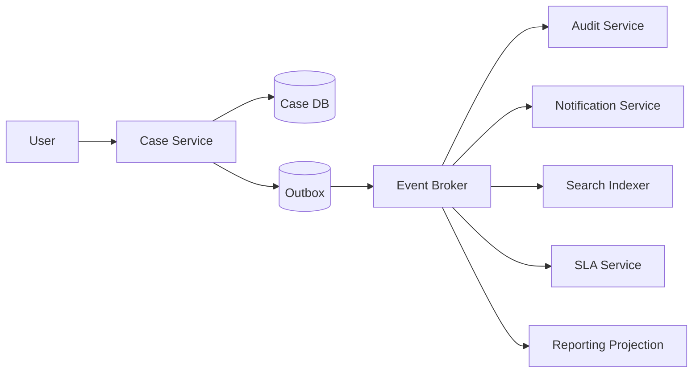
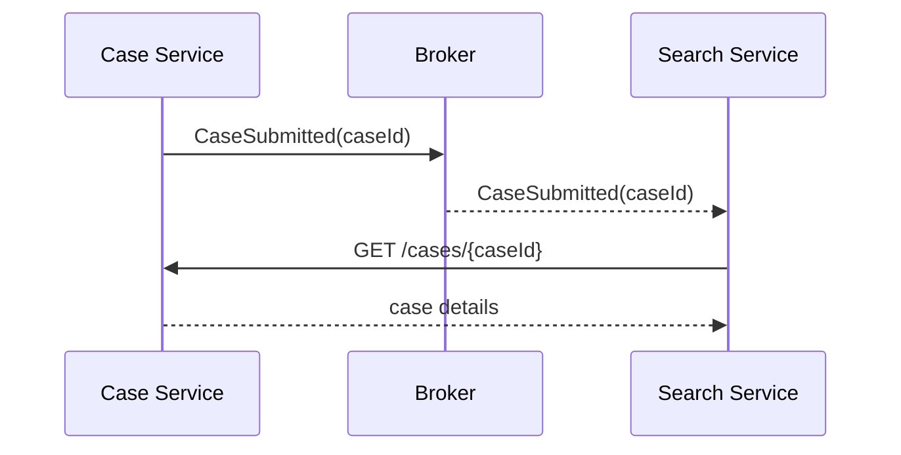
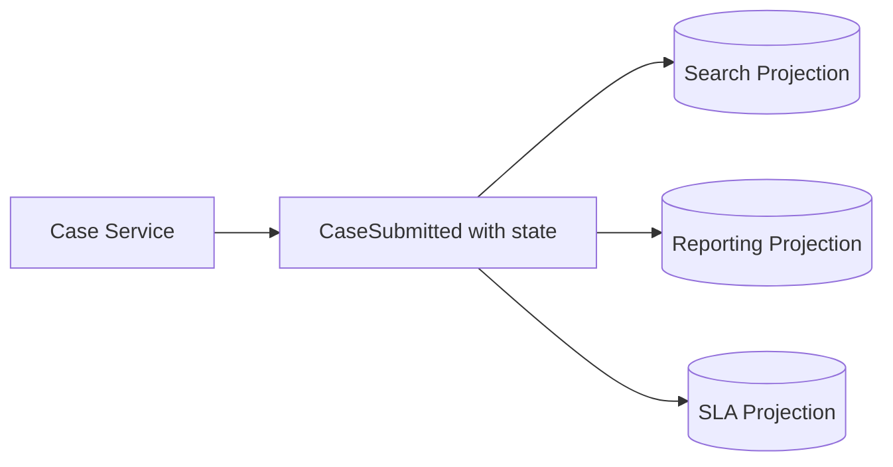
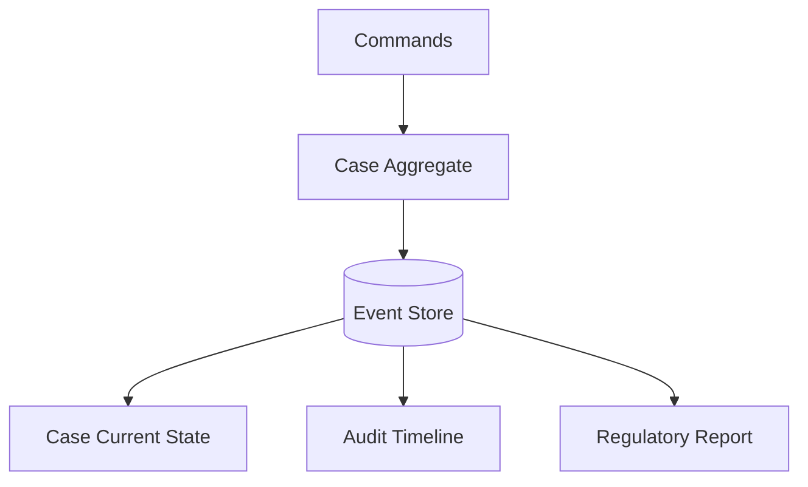
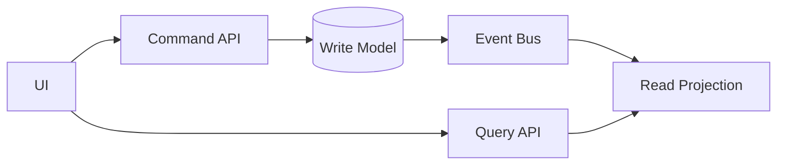
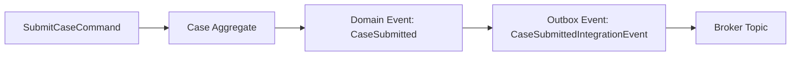
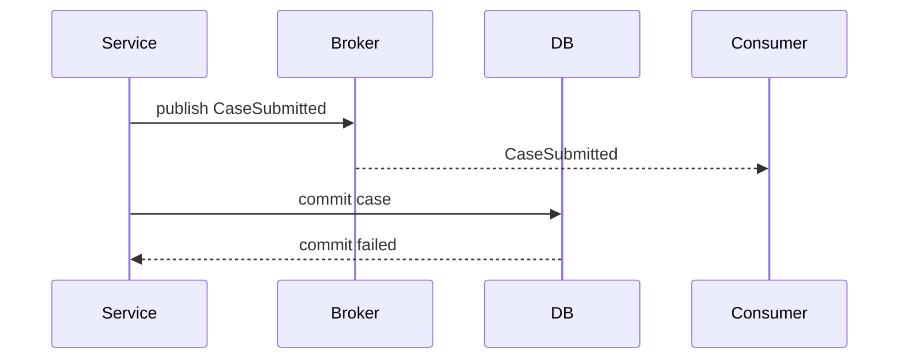
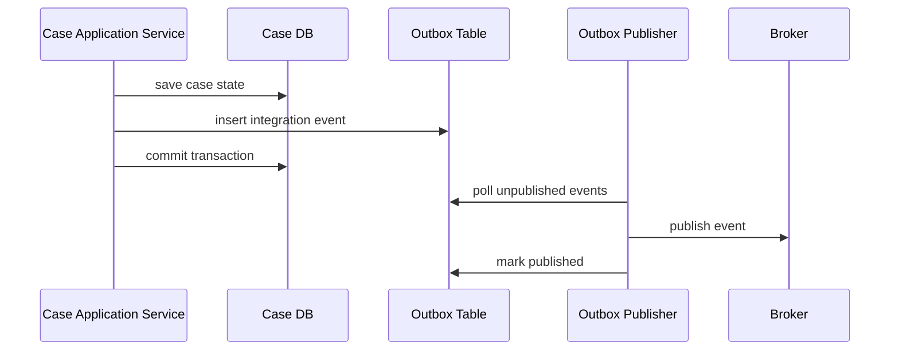
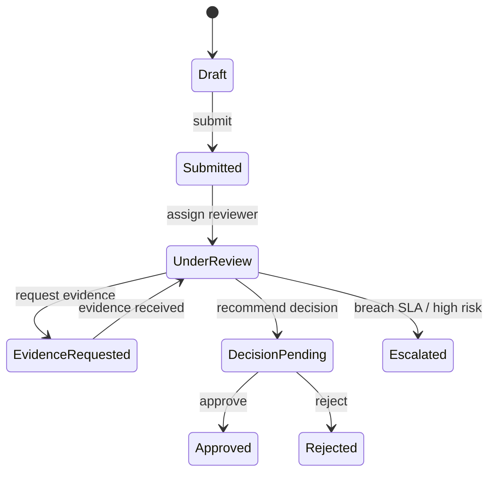
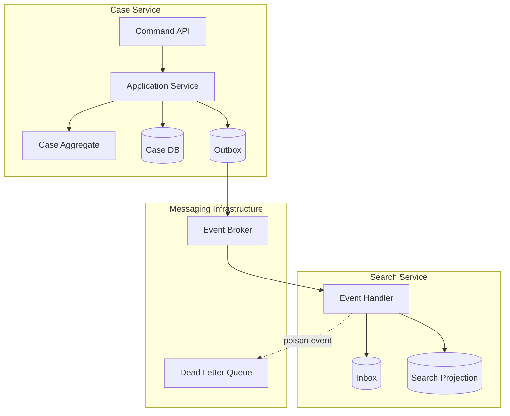

# Part 027 — Event-Driven Collaboration Model

> Event-driven architecture bukan berarti “semua service publish Kafka event”. Event adalah cara service memberi tahu dunia bahwa sesuatu **sudah terjadi**, bukan cara menyembunyikan coupling.

Microservices sering dimulai dengan HTTP call antar service. Awalnya terasa sederhana:

```text
Case Service -> Party Service -> Risk Service -> Notification Service
```

Lalu sistem tumbuh. Satu aksi user memicu audit, notifikasi, eligibility, SLA timer, reporting, search indexing, fraud signal, dan escalation rule. Kalau semuanya synchronous, request path berubah menjadi rantai dependency yang rapuh. Kalau semuanya dijadikan event tanpa model, sistem berubah menjadi event soup.

Part ini membangun mental model event-driven collaboration yang benar:

1. apa itu event;
2. kapan event membantu;
3. kapan event memperburuk desain;
4. bagaimana membedakan domain event, integration event, command, dan state snapshot;
5. bagaimana Java service mem-publish dan mengonsumsi event secara aman.

Kita tidak akan mengulang detail Kafka, schema registry, atau data contract engineering secara mendalam karena itu sudah masuk seri lain. Di sini fokusnya adalah **collaboration design**.

---

## 1. Mental Model: Event Adalah Fakta, Bukan Perintah

Event adalah rekaman bahwa sesuatu sudah terjadi.

Contoh event:

```text
CaseSubmitted
CaseAssigned
EvidenceReceived
RiskScoreCalculated
DecisionApproved
EscalationDeadlineBreached
```

Event buruk:

```text
SendNotification
RecalculateRisk
CreateAuditRecord
UpdateSearchIndex
```

Yang buruk itu bukan karena nama teknisnya. Yang buruk adalah event tersebut sebenarnya **command** yang menyuruh consumer melakukan sesuatu.

Perbedaan inti:

| Message type | Meaning | Temporal nature | Receiver obligation |
|---|---|---|---|
| Command | “Please do this” | Future intent | Targeted receiver should accept/reject |
| Event | “This happened” | Past fact | Interested receivers may react |
| Query | “Tell me this” | Current/read intent | Receiver returns data |
| Document/state message | “Here is the current view” | Snapshot | Receiver may update local read model |

Rule pertama:

> Jangan memberi nama event berdasarkan apa yang kamu ingin consumer lakukan. Beri nama berdasarkan fakta domain yang telah terjadi.

---

## 2. Why Event-Driven Collaboration Exists

Event-driven collaboration berguna ketika satu perubahan domain punya banyak konsekuensi yang tidak perlu memblokir aksi utama.

Misalnya user submit case:



`SubmitCase` harus berhasil jika case tersimpan dan event commit masuk outbox. Audit, notification, search, SLA, dan reporting boleh menyusul secara asynchronous.

Keuntungan:

- producer tidak perlu tahu semua consumer;
- consumer bisa ditambahkan tanpa mengubah producer;
- request path lebih pendek;
- side effect non-kritis tidak memblokir core transaction;
- service bisa membangun local read model;
- failure bisa diisolasi dengan retry/dead-letter/replay;
- sistem lebih mudah berevolusi untuk use case baru.

Tetapi event-driven bukan obat universal. Ia menukar coupling langsung dengan coupling temporal, semantic, dan operational.

---

## 3. Hidden Cost Event-Driven Architecture

Event-driven collaboration menambah masalah baru:

| Cost | Meaning | Example |
|---|---|---|
| Temporal coupling | Consumer harus menerima bahwa data datang terlambat | Search index belum memuat case baru |
| Semantic coupling | Consumer bergantung pada arti event | `CaseSubmitted` berubah makna tanpa breaking schema |
| Ordering complexity | Event bisa datang out-of-order | `CaseAssigned` tiba sebelum `CaseSubmitted` projection |
| Duplicate delivery | Message bisa diproses lebih dari sekali | Notification terkirim dua kali |
| Observability difficulty | Flow tidak terlihat dari stack trace | Submit case berhasil tapi SLA timer tidak dibuat |
| Replay risk | Consumer harus aman saat event lama diputar ulang | Audit duplicate saat replay |
| Versioning complexity | Event hidup lebih lama daripada release producer | Consumer lama membaca event baru |
| Ownership confusion | Siapa pemilik side effect? | Notification gagal: Case Service atau Notification Service? |

Mental modelnya:

> Event-driven architecture mengurangi caller coupling, tetapi menaikkan kebutuhan discipline pada event semantics, idempotency, observability, dan ownership.

---

## 4. Four Meanings of “Event-Driven”

Banyak diskusi event-driven kacau karena orang memakai istilah yang sama untuk pola berbeda. Minimal bedakan empat model berikut.

### 4.1 Event Notification

Producer hanya memberi tahu bahwa sesuatu terjadi.

```json
{
  "eventId": "evt-001",
  "eventType": "CaseSubmitted",
  "caseId": "CASE-2026-00041",
  "occurredAt": "2026-07-05T10:15:30Z"
}
```

Consumer yang butuh detail melakukan call balik ke source service.



Keuntungan:

- event kecil;
- data tidak banyak diduplikasi;
- producer tidak expose terlalu banyak payload;
- consumer selalu bisa ambil data terbaru.

Risiko:

- consumer tetap coupling ke source API;
- spike event menyebabkan thundering herd call-back;
- source service harus siap menerima load dari consumer;
- replay event bisa membanjiri source service;
- consumer failure path bergantung pada availability producer.

Gunakan ketika:

- consumer hanya sesekali butuh detail;
- data sensitif tidak boleh disebar di event;
- source API cukup stabil;
- jumlah consumer rendah atau call-back dibatasi.

Hindari ketika:

- banyak consumer perlu detail yang sama;
- producer berada di critical path load tinggi;
- consumer harus tetap bekerja walau producer down;
- replay volume besar.

---

### 4.2 Event-Carried State Transfer

Event membawa data yang cukup agar consumer tidak perlu call balik.

```json
{
  "eventId": "evt-001",
  "eventType": "CaseSubmitted",
  "caseId": "CASE-2026-00041",
  "caseNumber": "REG-2026-41",
  "priority": "HIGH",
  "submittedBy": "officer-17",
  "submittedAt": "2026-07-05T10:15:30Z",
  "jurisdiction": "JKT",
  "classification": "ENFORCEMENT"
}
```

Consumer menyimpan local projection.



Keuntungan:

- consumer lebih autonomous;
- mengurangi synchronous call-back;
- cocok untuk read model/reporting/search;
- producer tidak menjadi bottleneck saat replay;
- local projection bisa cepat.

Risiko:

- data duplikasi;
- event payload lebih besar;
- privacy/data minimization lebih sulit;
- semantic compatibility lebih berat;
- consumer bisa menyimpan data usang;
- perubahan field harus sangat hati-hati.

Gunakan ketika:

- consumer perlu local read model;
- banyak consumer perlu data yang sama;
- source service tidak boleh menjadi runtime dependency;
- staleness bisa didefinisikan.

Hindari ketika:

- payload memuat data sangat sensitif;
- data berubah sangat sering dan event volume meledak;
- consumer sebenarnya butuh strong consistency;
- organisasi belum punya schema evolution discipline.

---

### 4.3 Event Sourcing

Event adalah source of truth untuk aggregate. State sekarang dihitung dari event stream.

```text
CaseOpened
EvidenceAttached
OfficerAssigned
CaseSubmitted
CaseEscalated
DecisionApproved
```



Event sourcing bukan sekadar publish event ke Kafka. Event sourcing berarti database utama service adalah log event yang immutable, dan current state adalah projection.

Keuntungan:

- audit trail sangat kuat;
- historical reconstruction natural;
- temporal query mungkin;
- domain lifecycle terlihat lengkap;
- replay projection bisa dilakukan.

Risiko:

- model lebih sulit;
- event versioning menjadi permanen;
- GDPR/privacy deletion bisa rumit;
- query harus lewat projection;
- schema evolution berat;
- developer harus memahami event replay, snapshotting, dan idempotency.

Gunakan ketika:

- lifecycle dan auditability adalah core domain requirement;
- business decision harus bisa direkonstruksi;
- event history punya nilai bisnis;
- tim matang secara distributed systems.

Hindari ketika:

- CRUD sederhana cukup;
- audit bisa dipenuhi dengan audit log biasa;
- tim belum siap dengan operational complexity;
- domain event semantics belum stabil.

---

### 4.4 CQRS / Projection-Oriented Eventing

Command model dan query model dipisah. Event memperbarui read model.



Ini bukan selalu event sourcing. Write model bisa tetap relational database biasa. Event hanya digunakan untuk membangun read projection.

Gunakan ketika:

- query sangat berbeda dari write model;
- UI butuh denormalized view;
- reporting/search tidak boleh query langsung ke database owner;
- read workload tinggi;
- staleness acceptable.

Hindari ketika:

- query sederhana;
- consistency harus immediate;
- projection ownership tidak jelas;
- tim belum punya reconciliation mechanism.

---

## 5. Domain Event vs Integration Event

Domain event hidup di dalam domain model. Integration event keluar dari service boundary.



### Domain Event

Domain event:

- bagian dari ubiquitous language;
- digunakan di dalam service;
- bisa kaya secara domain;
- tidak harus stabil untuk consumer eksternal;
- bisa berubah bersama internal domain model.

Contoh Java:

```java
public record CaseSubmitted(
    CaseId caseId,
    OfficerId submittedBy,
    Instant submittedAt,
    CasePriority priority
) implements DomainEvent {}
```

### Integration Event

Integration event:

- kontrak publik antar service;
- harus backward compatible;
- payload harus sengaja dipilih;
- tidak boleh expose internal object sembarangan;
- harus punya metadata operasional.

Contoh Java:

```java
public record CaseSubmittedV1(
    String eventId,
    String eventType,
    String schemaVersion,
    String aggregateId,
    long aggregateVersion,
    Instant occurredAt,
    Instant publishedAt,
    String traceId,
    Payload payload
) {
    public record Payload(
        String caseId,
        String caseNumber,
        String priority,
        String jurisdiction
    ) {}
}
```

Rule:

> Jangan publish JPA entity, internal DTO, atau domain object langsung sebagai integration event.

Domain event boleh berubah sesuai model internal. Integration event adalah product contract.

---

## 6. Event Envelope: Metadata yang Wajib Ada

Payload saja tidak cukup. Consumer perlu metadata untuk deduplication, tracing, ordering, dan debugging.

Minimal envelope:

```json
{
  "eventId": "evt-7f3d",
  "eventType": "CaseSubmitted",
  "schemaVersion": "1.0",
  "producer": "case-service",
  "aggregateType": "Case",
  "aggregateId": "CASE-2026-00041",
  "aggregateVersion": 12,
  "occurredAt": "2026-07-05T10:15:30Z",
  "publishedAt": "2026-07-05T10:15:31Z",
  "correlationId": "corr-19a",
  "causationId": "cmd-2026-17",
  "traceId": "4bf92f3577b34da6a3ce929d0e0e4736",
  "tenantId": "tenant-jkt",
  "payload": {
    "caseId": "CASE-2026-00041",
    "priority": "HIGH"
  }
}
```

Field penting:

| Field | Purpose |
|---|---|
| `eventId` | Deduplication dan audit |
| `eventType` | Routing dan handler selection |
| `schemaVersion` | Compatibility handling |
| `producer` | Ownership dan debugging |
| `aggregateId` | Ordering key dan domain identity |
| `aggregateVersion` | Out-of-order detection |
| `occurredAt` | Kapan fakta terjadi di domain |
| `publishedAt` | Kapan message keluar ke broker |
| `correlationId` | Mengikat satu business flow |
| `causationId` | Menjawab “event ini akibat command/event apa?” |
| `traceId` | Distributed tracing |
| `tenantId` | Tenant isolation dan routing |

`occurredAt` dan `publishedAt` tidak sama. Event bisa terjadi di transaction, lalu dipublish beberapa detik/menit kemudian oleh outbox publisher.

---

## 7. Designing Event Semantics

Event schema bisa valid secara teknis tetapi rusak secara bisnis.

Contoh:

```json
{
  "eventType": "CaseUpdated",
  "caseId": "CASE-1"
}
```

Ini hampir tidak berguna. Apa yang berubah? Apakah assignment? priority? status? evidence? deadline?

Event yang lebih baik:

```text
CasePriorityChanged
CaseAssignedToOfficer
EvidenceAttachmentAccepted
CaseEscalationDeadlineBreached
DecisionApprovalRecorded
```

Heuristic:

| Question | Good event should answer |
|---|---|
| What happened? | Specific business fact |
| To what entity? | Aggregate/entity identity |
| When did it happen? | Domain occurrence time |
| Why did it happen? | Causation/correlation if available |
| Who may care? | Consumer category, not implementation name |
| What invariant changed? | State/meaning shift |
| Can it be replayed? | Idempotent effect |

Bad event names:

- `DataChanged`
- `EntityUpdated`
- `SyncRequired`
- `ProcessNextStep`
- `NotifyUser`
- `CaseEvent`
- `UpdateCompleted`

Better event names:

- `CaseSubmitted`
- `CaseAssignmentChanged`
- `RiskClassificationChanged`
- `EvidenceValidated`
- `ComplianceDeadlineBreached`
- `EnforcementDecisionIssued`

---

## 8. Event as Public Contract

Integration event adalah kontrak. Ia punya consumer yang mungkin tidak kamu ketahui semua.

Konsekuensinya:

1. jangan rename field sembarangan;
2. jangan ubah meaning field tanpa versi baru;
3. jangan hapus field yang masih dipakai;
4. jangan ubah enum dengan asumsi consumer siap;
5. jangan expose internal technical state;
6. jangan mengubah event timing tanpa migration note;
7. jangan mengubah ordering key tanpa impact analysis.

Contoh breaking semantic change:

```text
Before:
CaseSubmitted = officer formally submits case for review.

After:
CaseSubmitted = draft case autosaved by UI.
```

Schema mungkin tetap sama. Tetapi consumer SLA, audit, reporting, dan notification akan salah.

> Compatibility bukan hanya field-level. Compatibility juga semantic-level.

---

## 9. Event Publication Boundary

Event harus dipublish setelah domain transaction berhasil. Jangan publish event sebelum database commit, kecuali kamu siap menghadapi ghost event.

Ghost event:



Consumer melihat case submitted, tetapi case sebenarnya tidak tersimpan.

Solusi umum: transactional outbox.



Java application service:

```java
@Transactional
public SubmitCaseResult submit(SubmitCaseCommand command) {
    Case caze = caseRepository.get(command.caseId());
    caze.submit(command.officerId(), clock.instant());

    caseRepository.save(caze);

    caze.pullDomainEvents().stream()
        .map(integrationEventMapper::toIntegrationEvent)
        .forEach(outboxRepository::append);

    return SubmitCaseResult.accepted(caze.id(), caze.version());
}
```

Catatan penting:

- outbox append terjadi dalam transaction yang sama dengan state change;
- publisher boleh retry;
- broker publish bisa at-least-once;
- consumer tetap harus idempotent;
- outbox bukan alasan untuk melupakan observability.

---

## 10. Consumer Idempotency

Event delivery umumnya harus diasumsikan at-least-once. Artinya consumer bisa menerima event yang sama lebih dari sekali.

Consumer buruk:

```java
public void on(CaseSubmittedV1 event) {
    notificationClient.sendEmail(event.payload().caseId());
}
```

Kalau event redelivered, email terkirim dua kali.

Consumer lebih aman:

```java
@Transactional
public void on(CaseSubmittedV1 event) {
    if (inboxRepository.alreadyProcessed(event.eventId(), "notification-service")) {
        return;
    }

    notificationRequestRepository.createIfAbsent(
        NotificationRequest.caseSubmitted(event.payload().caseId(), event.eventId())
    );

    inboxRepository.markProcessed(event.eventId(), "notification-service", clock.instant());
}
```

Pattern:

1. cek inbox/dedup table;
2. lakukan side effect sebagai state transition lokal;
3. mark processed dalam transaction yang sama;
4. side effect eksternal dikirim oleh worker terpisah jika perlu.

Untuk side effect non-transactional seperti email, payment, atau external API, jangan hanya mengandalkan event handler memory.

---

## 11. Ordering: Jangan Mengandalkan Global Order

Banyak desain event gagal karena mengasumsikan semua event punya urutan global.

Yang realistis:

- order per aggregate lebih mungkin;
- global order mahal dan bottleneck;
- consumer harus tahan out-of-order;
- event harus membawa aggregate version;
- projection harus bisa detect gap.

Contoh:

```json
{
  "eventType": "CasePriorityChanged",
  "aggregateId": "CASE-1",
  "aggregateVersion": 8,
  "payload": {
    "newPriority": "HIGH"
  }
}
```

Projection logic:

```java
@Transactional
public void apply(CasePriorityChangedV1 event) {
    CaseProjection projection = projectionRepository.getOrCreate(event.aggregateId());

    if (event.aggregateVersion() <= projection.lastAppliedVersion()) {
        return; // duplicate or old event
    }

    if (event.aggregateVersion() != projection.lastAppliedVersion() + 1) {
        gapRepository.record(event);
        throw new EventGapDetected(event.aggregateId(), event.aggregateVersion());
    }

    projection.changePriority(event.payload().newPriority());
    projection.markApplied(event.aggregateVersion(), event.eventId());
}
```

Tidak semua consumer perlu strict sequence. Audit append-only mungkin cukup menerima event duplicate-safe. Projection current-state biasanya perlu version discipline.

---

## 12. Event Topic Design

Topic bukan sekadar nama teknis broker. Topic adalah boundary konsumsi.

Contoh topic buruk:

```text
events
case-events
service-a-output
updates
```

Contoh topic lebih baik:

```text
case.lifecycle.v1
case.assignment.v1
evidence.lifecycle.v1
decision.lifecycle.v1
```

Decision dimensions:

| Dimension | Option | Trade-off |
|---|---|---|
| By domain area | `case.lifecycle` | Mudah dipahami, cocok business event |
| By aggregate | `case`, `evidence` | Clear ownership, bisa terlalu besar |
| By event category | `audit`, `notification` | Consumer-oriented, risk of coupling |
| By producer service | `case-service.events` | Ownership jelas, kurang semantic |
| By data sensitivity | `case.public`, `case.restricted` | Privacy control lebih baik |

Rule praktis:

- topic harus dimiliki oleh producer domain;
- jangan membuat topic berdasarkan consumer implementation;
- pisahkan high-volume event dari low-volume critical event bila perlu;
- pisahkan sensitive event dari public internal event;
- gunakan partition key yang mendukung ordering yang kamu butuhkan.

---

## 13. Event Notification vs Event-Carried State Transfer: Decision Matrix

| Question | Prefer notification | Prefer event-carried state |
|---|---|---|
| Consumer perlu banyak detail? | No | Yes |
| Producer bisa menerima callback load? | Yes | No |
| Data sangat sensitif? | Yes | Maybe no |
| Banyak consumer butuh data sama? | No | Yes |
| Replay volume besar? | No | Yes |
| Staleness acceptable? | Maybe | Yes |
| Consumer perlu autonomous read model? | No | Yes |
| Schema governance matang? | Not required as much | Required |

Contoh regulatory case:

| Event | Recommended style | Reason |
|---|---|---|
| `CaseSubmitted` | Event-carried state minimal | SLA/search/reporting butuh metadata |
| `EvidenceDocumentUploaded` | Notification | Document content sensitif dan besar |
| `RiskScoreCalculated` | Event-carried state | Consumer butuh score/category |
| `DecisionApproved` | Event-carried state restricted | Audit/reporting perlu decision metadata |
| `PartyProfileChanged` | Mixed | Public attributes via event, sensitive detail via secure API |

---

## 14. Event Payload Size and Privacy Discipline

Jangan mengirim seluruh aggregate ke event karena “biar consumer fleksibel”. Itu anti-pattern.

Event payload harus cukup untuk use case yang diketahui, tetapi tidak menjadi data dump.

Checklist payload:

- apakah field ini diperlukan consumer?
- apakah field ini mengandung PII/sensitive data?
- apakah field ini boleh disimpan consumer?
- apakah field ini punya retention policy?
- apakah field ini bisa berubah makna?
- apakah field ini memaksa consumer tahu internal model?
- apakah field ini akan membuat replay mahal?

Contoh buruk:

```json
{
  "eventType": "CaseSubmitted",
  "payload": {
    "case": { "... entire case aggregate ...": true },
    "parties": ["... all party details ..."],
    "evidence": ["... metadata and notes ..."]
  }
}
```

Contoh lebih sehat:

```json
{
  "eventType": "CaseSubmitted",
  "payload": {
    "caseId": "CASE-2026-00041",
    "caseNumber": "REG-2026-41",
    "classification": "ENFORCEMENT",
    "priority": "HIGH",
    "jurisdiction": "JKT",
    "submittedByOfficerId": "OFFICER-17"
  }
}
```

---

## 15. Event Handler Should Be Small, Deterministic, and Observable

Event handler buruk:

```java
public void on(CaseSubmittedV1 event) {
    var caseDetails = caseClient.get(event.payload().caseId());
    var officer = officerClient.get(caseDetails.assignedOfficerId());
    var template = templateClient.get("case-submitted");
    emailClient.send(officer.email(), template.render(caseDetails));
    auditClient.record(...);
    reportingClient.update(...);
}
```

Masalah:

- banyak remote call;
- tidak idempotent;
- sulit retry;
- side effect bercampur;
- failure di email memblokir reporting;
- tracing sulit;
- duplicate event bahaya.

Event handler lebih baik:

```java
@Transactional
public void on(CaseSubmittedV1 event) {
    if (inbox.alreadyProcessed(event.eventId(), CONSUMER_NAME)) {
        return;
    }

    notificationRequests.createCaseSubmittedRequest(
        event.eventId(),
        event.payload().caseId(),
        event.payload().priority()
    );

    inbox.markProcessed(event.eventId(), CONSUMER_NAME, clock.instant());
}
```

Worker lain mengirim email berdasarkan local state:

```java
public void sendPendingNotifications() {
    List<NotificationRequest> batch = repository.lockNextBatch(100);

    for (NotificationRequest request : batch) {
        try {
            emailGateway.send(request.toEmailMessage());
            request.markSent(clock.instant());
        } catch (TemporaryEmailFailure ex) {
            request.scheduleRetry(clock.instant().plusSeconds(60));
        } catch (PermanentEmailFailure ex) {
            request.markFailed(ex.reason());
        }
    }
}
```

Principle:

> Event handler sebaiknya mengubah local durable state. Side effect eksternal sebaiknya dikelola sebagai workflow/worker yang retry-safe.

---

## 16. Event-Driven Does Not Remove Need for API

Event dan API menyelesaikan masalah berbeda.

| Need | Better fit |
|---|---|
| User membuka detail case sekarang | Query API |
| Service meminta policy decision sekarang | Request-response API |
| Search index diperbarui setelah case berubah | Event |
| Audit trail menerima fakta domain | Event |
| Workflow memberi instruksi participant | Command/message |
| Consumer membangun local projection | Event-carried state |
| UI membutuhkan consistent confirmation | Command API response |

Jangan membuat semua interaksi asynchronous hanya agar terlihat modern.

Contoh salah:

```text
UI publishes SubmitCaseRequested event
Case Service consumes later
UI polling random status
Error handling unclear
```

Untuk user command yang butuh validasi dan acceptance jelas, command API synchronous sering lebih baik:

```text
POST /cases/{id}/commands/submit
-> 202 Accepted with commandId
```

Lalu event mengalir setelah command accepted/processed.

---

## 17. Event-Driven Collaboration in Regulatory Case Domain

Misalkan domain enforcement lifecycle:



Candidate events:

| Event | Producer | Typical consumers | Payload style |
|---|---|---|---|
| `CaseSubmitted` | Case Service | SLA, Search, Audit, Reporting | Carried state minimal |
| `ReviewerAssigned` | Case Service | Notification, Workload, Audit | Carried state minimal |
| `EvidenceRequested` | Evidence/Case Service | Notification, SLA, Audit | Notification + metadata |
| `EvidenceReceived` | Evidence Service | Case, Search, Audit | Notification |
| `RiskClassificationChanged` | Risk Service | Case, SLA, Reporting | Carried state |
| `DecisionRecommended` | Decision Service | Approval Workflow, Audit | Restricted carried state |
| `DecisionApproved` | Decision Service | Case, Reporting, Notification | Restricted carried state |
| `SlaBreached` | SLA Service | Escalation, Audit, Workload | Carried state |

Important distinction:

- `DecisionApproved` adalah event;
- `ApproveDecision` adalah command;
- `DecisionApprovalRequested` bisa menjadi event atau command tergantung semantic;
- `SendDecisionNotification` adalah command/task, bukan domain event.

---

## 18. Mermaid: Event Flow with Outbox, Broker, Inbox, Projection



This is the minimal production mental model:

- producer transaction writes business state + outbox;
- publisher emits event;
- broker delivers at least once;
- consumer deduplicates via inbox;
- projection updates local state;
- poison messages are isolated;
- observability connects the flow.

---

## 19. Common Anti-Patterns

### 19.1 Event Soup

Symptoms:

- hundreds of event types;
- unclear producer ownership;
- consumer depends on undocumented semantics;
- no lifecycle policy;
- no versioning;
- no event catalog;
- no traceability.

Fix:

- create event catalog;
- group by domain capability;
- define event owner;
- document semantic meaning;
- add schema compatibility checks;
- remove consumer-oriented fake events.

---

### 19.2 Command Disguised as Event

Bad:

```text
GenerateInvoiceEvent
SendEmailEvent
UpdateCaseProjectionEvent
```

Fix:

- use command queue if targeted action is intended;
- use domain event if fact happened;
- name event in past tense.

---

### 19.3 Event as Database Replication Dump

Bad:

```text
CaseRowChanged
PartyRowChanged
EvidenceRowChanged
```

This exposes table structure and turns event consumers into database-coupled clients.

Fix:

- publish business events;
- keep CDC/internal replication separate from domain event stream;
- do not confuse data movement with domain collaboration.

---

### 19.4 No Consumer Ownership

Bad question:

```text
Who owns this event failure?
```

Wrong answer:

```text
The broker team.
```

Correct thinking:

- producer owns event semantic and publication;
- consumer owns its processing behavior;
- platform owns delivery infrastructure;
- architecture owns contract governance.

---

### 19.5 Synchronous Call Inside Every Consumer

If every consumer immediately calls producer after receiving event, you have recreated synchronous coupling with extra steps.

Fix:

- use event-carried state where appropriate;
- batch callbacks;
- cache reference data;
- define projection staleness;
- rate-limit replay callbacks.

---

## 20. Architecture Review Checklist

Use this before approving event-driven collaboration.

### Event Meaning

- Is the event named as a past-tense business fact?
- Is it different from a command?
- Is semantic meaning documented?
- Does it map to business lifecycle/invariant?

### Ownership

- Which service owns this event?
- Who approves schema changes?
- Who owns event catalog entry?
- Who is paged if publication stops?

### Contract

- Is envelope standardized?
- Is payload minimal but sufficient?
- Are sensitive fields classified?
- Is compatibility policy defined?
- Are enum changes controlled?

### Delivery

- Is outbox used for transactional publication?
- Is delivery assumed at-least-once?
- Are consumers idempotent?
- Is duplicate handling tested?
- Is out-of-order behavior defined?

### Consumer Behavior

- Does consumer store processed event IDs?
- Does consumer update local durable state?
- Are side effects retry-safe?
- Is poison message handling defined?
- Is replay behavior safe?

### Observability

- Are correlation/causation IDs propagated?
- Can we trace command -> event -> consumer effect?
- Are consumer lag and error rates measured?
- Is DLQ monitored?
- Is replay auditable?

---

## 21. Practical Design Exercise

Given command:

```text
Submit enforcement case for formal review.
```

Design:

1. command API;
2. domain event;
3. integration event;
4. event envelope;
5. payload fields;
6. topic name;
7. expected consumers;
8. consumer idempotency rule;
9. ordering key;
10. privacy classification.

Possible answer:

```text
Command:
SubmitCase(caseId, submittedByOfficerId, expectedVersion)

Domain event:
CaseSubmitted(caseId, submittedBy, submittedAt, priority)

Integration event:
CaseSubmittedV1

Topic:
case.lifecycle.v1

Partition key:
caseId

Payload:
caseId, caseNumber, classification, priority, jurisdiction, submittedByOfficerId

Consumers:
SLA Service, Search Service, Audit Service, Reporting Projection, Notification Service

Idempotency:
consumerName + eventId unique constraint

Privacy:
no complainant/person PII in public internal event
```

---

## 22. Final Mental Model

Event-driven collaboration is not about replacing method calls with messages.

It is about designing how independently owned services share facts without turning each other into runtime prisoners.

A good event-driven design has these properties:

- event means a specific business fact;
- producer owns semantic contract;
- consumer is autonomous and idempotent;
- delivery is assumed duplicate-prone;
- ordering assumptions are explicit;
- event payload is deliberate;
- observability connects the flow;
- privacy is designed, not patched later;
- replay is safe;
- async behavior has business meaning.

The strongest rule:

> Publish facts. Consume facts. Do not hide commands, database replication, or distributed transactions behind the word “event”.

In the next part, we generalize this into broader service collaboration patterns: request-response, async messaging, orchestration, choreography, API composition, and hybrid collaboration.
