# Part 028 — Service Collaboration Patterns

> Tidak ada satu pola komunikasi terbaik. Yang ada adalah pola yang cocok untuk latency, consistency, ownership, failure model, dan user journey tertentu.

Microservices tidak hidup sendiri. Mereka berkolaborasi untuk menyelesaikan business outcome.

Masalahnya, banyak desain langsung memilih teknologi:

```text
“Pakai REST.”
“Pakai Kafka.”
“Pakai gRPC.”
“Pakai workflow engine.”
```

Itu urutan berpikir yang salah. Pertanyaan pertama bukan teknologi. Pertanyaan pertama adalah:

> Bentuk kolaborasi apa yang dibutuhkan oleh business flow ini?

Part ini membangun decision model untuk memilih pola kolaborasi antar service.

---

## 1. Collaboration Is a Business Design Problem

Satu business flow bisa menyentuh banyak service.

Contoh: submit enforcement case.

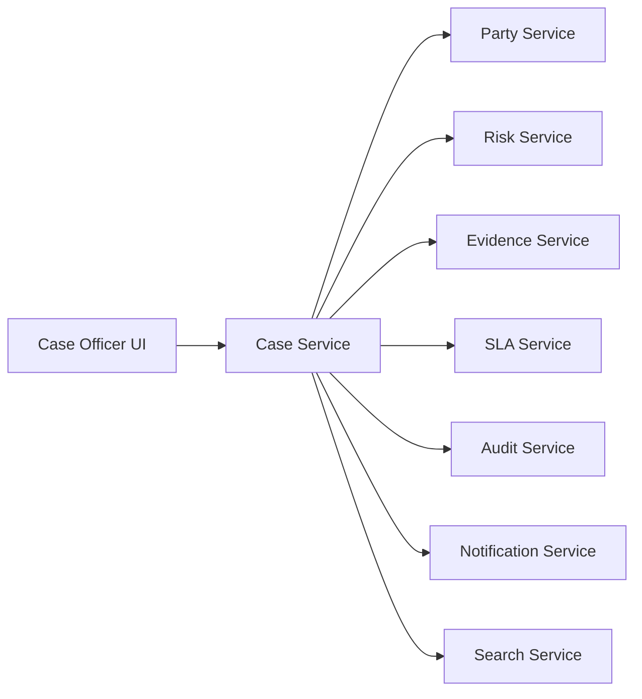

Kalau semua digambar sebagai arrow, kita belum mendesain apa-apa. Kita baru menggambar dependency.

Untuk setiap arrow, tanya:

1. apakah caller butuh jawaban sekarang?
2. apakah aksi harus berhasil sebagai satu unit bisnis?
3. apakah receiver punya ownership sendiri?
4. apakah failure receiver harus menggagalkan caller?
5. apakah user menunggu hasilnya?
6. apakah data boleh stale?
7. apakah request bisa diulang?
8. apakah urutan penting?
9. apakah flow perlu audit/reconstruction?
10. apakah ada human step, timer, SLA, atau escalation?

Jawaban pertanyaan ini menentukan pola collaboration.

---

## 2. Pattern Map

Pola utama:

| Pattern | Core idea | Best for |
|---|---|---|
| Request-response | Caller menunggu response | Query/decision immediate |
| Async command | Sender meminta receiver melakukan aksi nanti | Background task targeted |
| Publish-subscribe event | Producer publish fact, many consumers react | Side effects, projections |
| API composition | Aggregator menggabungkan banyak API | Read experience |
| BFF | Backend khusus client journey | UI-specific aggregation |
| Orchestration | Coordinator mengatur langkah flow | Long-running business process |
| Choreography | Services react to each other's events | Simple decentralized process |
| Hybrid | Campuran pola sesuai boundary | Most real systems |

Tidak ada sistem enterprise besar yang hanya memakai satu pola.

---

## 3. Pattern 1: Request-Response

Request-response berarti caller mengirim request dan menunggu response.

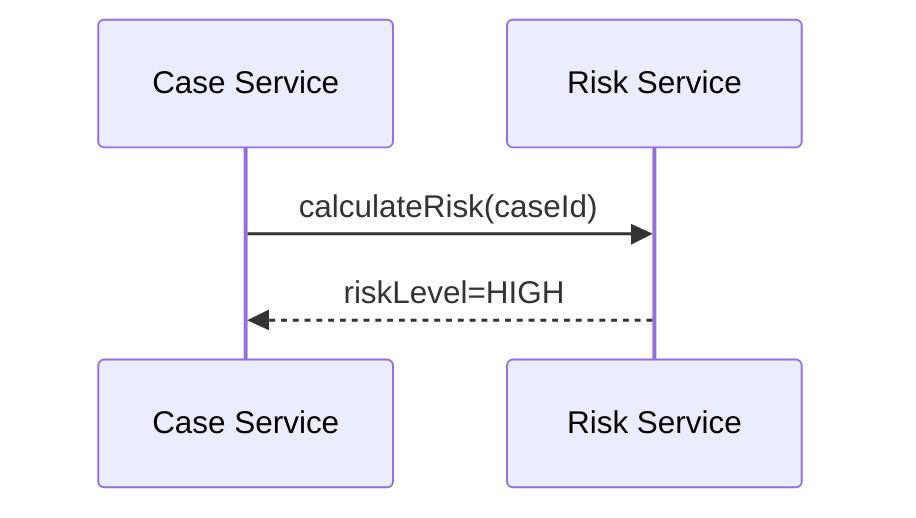

Contoh transport:

- REST/HTTP;
- gRPC;
- GraphQL internal query;
- synchronous message RPC, walau jarang direkomendasikan.

### When It Fits

Gunakan request-response ketika:

- caller butuh jawaban untuk melanjutkan;
- user sedang menunggu response;
- data harus fresh;
- receiver adalah authority untuk decision;
- failure bisa ditampilkan langsung;
- timeout bisa dibuat pendek dan jelas.

Contoh:

- Case Service meminta Risk Service menghitung risk sebelum submit;
- UI mengambil case detail;
- Payment Service meminta fraud decision;
- Policy Service mengevaluasi eligibility;
- API Gateway mengambil profile ringkas untuk response.

### Failure Model

Request-response membawa dependency runtime.

Jika Risk Service lambat, Case Service ikut lambat. Jika Risk Service down, Case Service harus memilih:

- fail closed;
- fail open;
- degrade;
- use cached decision;
- return pending/accepted;
- reject operation.

Jangan membuat remote call tanpa failure policy.

```java
public SubmitCaseResult submit(SubmitCaseCommand command) {
    RiskDecision risk = riskClient.calculateRisk(
        new RiskRequest(command.caseId()),
        Deadline.after(Duration.ofMillis(300))
    );

    if (risk.isTooHighForAutoSubmit()) {
        return SubmitCaseResult.requiresManualReview(risk.reason());
    }

    // continue local transaction
}
```

### Smells

Request-response smell:

- service calls 5+ dependencies in one user request;
- no timeout;
- default HTTP client config;
- retry on all failures;
- no circuit breaker;
- remote call inside database transaction;
- no fallback policy;
- response assembled from many downstream calls without budget.

### Rule

> Use request-response only when the caller genuinely needs the answer now.

---

## 4. Pattern 2: Asynchronous Command

Async command berarti sender meminta receiver melakukan aksi, tetapi tidak menunggu hasil immediate.

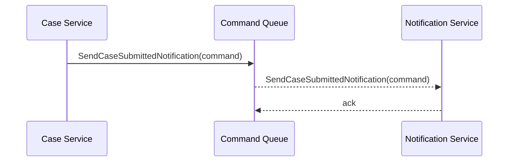

Message ini bukan event. Ini command.

Bad naming:

```text
SendCaseSubmittedNotificationEvent
```

Better:

```text
SendCaseSubmittedNotificationCommand
```

### When It Fits

Gunakan async command ketika:

- ada target receiver jelas;
- sender ingin receiver melakukan aksi;
- aksi bisa terjadi nanti;
- sender tidak butuh response immediate;
- retry/queueing diinginkan;
- action punya lifecycle sendiri.

Contoh:

- send email;
- generate PDF;
- run expensive validation;
- export report;
- submit batch reconciliation;
- request document scanning.

### Command Message Shape

```json
{
  "commandId": "cmd-001",
  "commandType": "SendCaseSubmittedNotification",
  "targetService": "notification-service",
  "requestedBy": "case-service",
  "requestedAt": "2026-07-05T10:15:30Z",
  "correlationId": "corr-001",
  "idempotencyKey": "case-submitted:CASE-2026-00041",
  "payload": {
    "caseId": "CASE-2026-00041",
    "template": "CASE_SUBMITTED"
  }
}
```

### Failure Model

Sender must know whether the command was accepted into durable queue. Receiver owns execution.

Important states:

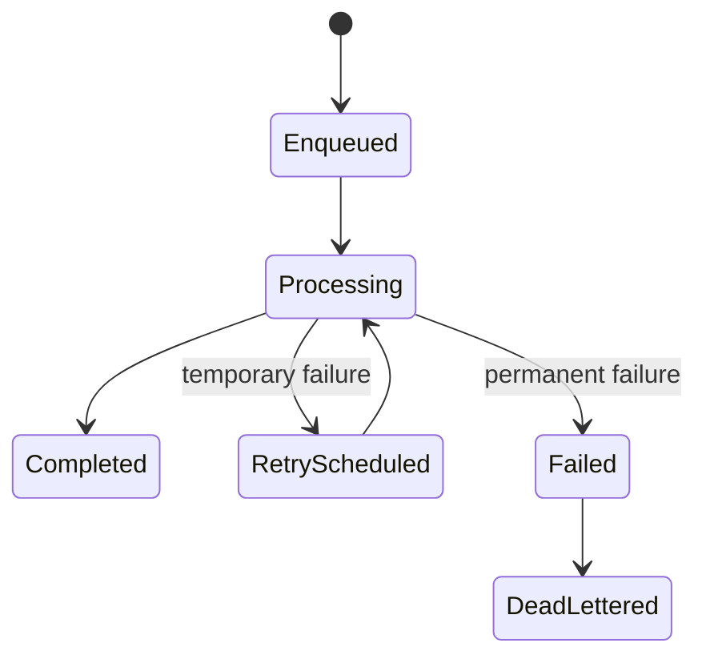

### Java Handler

```java
@Transactional
public void handle(SendCaseSubmittedNotificationCommand command) {
    if (processedCommands.exists(command.commandId())) {
        return;
    }

    NotificationRequest request = NotificationRequest.caseSubmitted(
        command.idempotencyKey(),
        command.payload().caseId(),
        command.payload().template()
    );

    notificationRepository.saveIfAbsent(request);
    processedCommands.markProcessed(command.commandId(), clock.instant());
}
```

### Smells

- command broadcast to many services;
- command named as event;
- no idempotency key;
- sender assumes success after enqueue;
- no command status model;
- poison command blocks queue;
- receiver performs non-idempotent side effect directly.

---

## 5. Pattern 3: Publish-Subscribe Event

Publish-subscribe berarti producer publish fact, multiple consumers react independently.

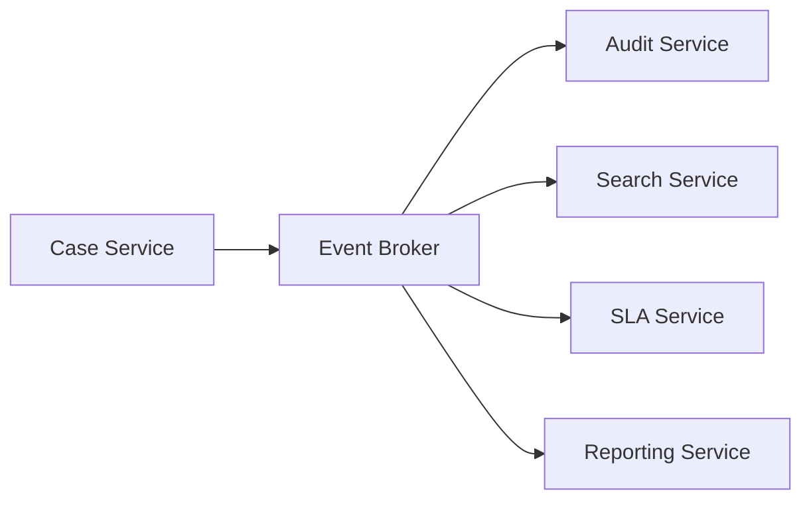

### When It Fits

Gunakan publish-subscribe ketika:

- producer tidak perlu tahu consumer;
- side effects tidak boleh memblokir core transaction;
- banyak consumer tertarik pada fakta yang sama;
- consumer bisa menerima eventual consistency;
- event punya meaning domain yang jelas;
- replay/projection berguna.

### Example

```text
CaseSubmitted published by Case Service.

Consumers:
- SLA Service creates review deadline.
- Search Service indexes case.
- Audit Service records immutable audit event.
- Notification Service creates notification request.
- Reporting Service updates daily count projection.
```

### Failure Model

- producer success tidak berarti semua consumer success;
- consumer failure harus lokal;
- broker delivery mungkin duplicate;
- event order tidak global;
- replay harus aman;
- DLQ harus dimonitor.

### Smells

- event is actually command;
- no event owner;
- no schema compatibility;
- no consumer idempotency;
- no dead-letter handling;
- event payload is entire database row;
- consumer does many synchronous callbacks.

---

## 6. Pattern 4: API Composition

API composition berarti satu layer membaca dari beberapa service dan menyusun response.

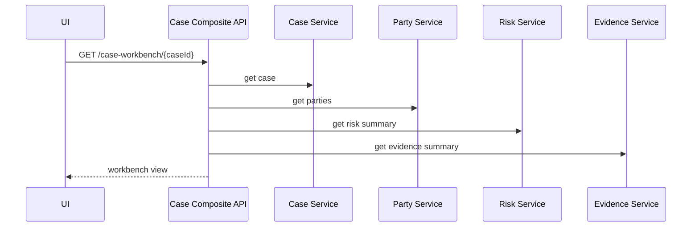

### When It Fits

Gunakan API composition ketika:

- UI butuh view gabungan;
- underlying ownership tetap terpisah;
- view bukan source of truth;
- latency budget masih masuk akal;
- partial response bisa diterima atau didefinisikan.

### Failure Model

API composition rentan fan-out latency.

Jika empat dependency masing-masing punya p95 200ms, response p95 aggregator tidak otomatis 200ms. Tail latency bisa memburuk karena menunggu dependency paling lambat.

Design rules:

- parallelize calls jika aman;
- set per-dependency timeout;
- set total deadline;
- support partial response jika business mengizinkan;
- avoid deep dependency chains;
- cache reference data;
- observe downstream latency separately.

### Java Sketch

```java
public CaseWorkbenchView getWorkbench(CaseId caseId) {
    Deadline deadline = Deadline.after(Duration.ofMillis(800));

    CompletableFuture<CaseSummary> caseFuture = async.get(() ->
        caseClient.getSummary(caseId, deadline.slice(Duration.ofMillis(250)))
    );

    CompletableFuture<RiskSummary> riskFuture = async.get(() ->
        riskClient.getSummary(caseId, deadline.slice(Duration.ofMillis(250)))
    );

    CompletableFuture<EvidenceSummary> evidenceFuture = async.get(() ->
        evidenceClient.getSummary(caseId, deadline.slice(Duration.ofMillis(250)))
    );

    return CaseWorkbenchView.compose(
        caseFuture.join(),
        riskFuture.exceptionally(ex -> RiskSummary.unavailable()).join(),
        evidenceFuture.exceptionally(ex -> EvidenceSummary.unavailable()).join()
    );
}
```

### Smells

- aggregator contains business rule owner should own;
- aggregator writes to multiple services;
- aggregator becomes god service;
- no partial failure model;
- no latency budget;
- nested aggregators call nested aggregators.

---

## 7. Pattern 5: Backend-for-Frontend

BFF is API composition shaped around a specific client experience.

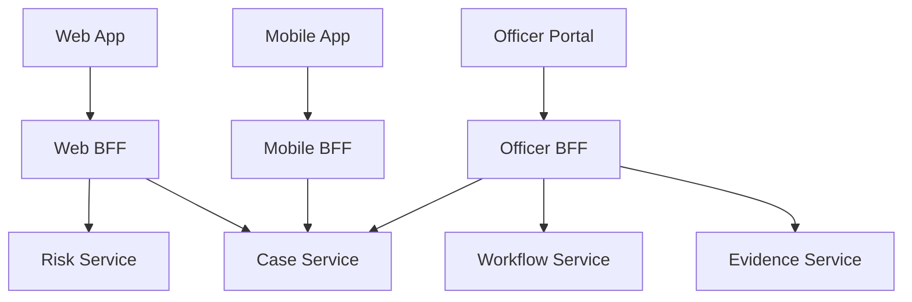

### When It Fits

Gunakan BFF ketika:

- client punya kebutuhan berbeda;
- mobile butuh payload kecil;
- web butuh richer view;
- client release cadence berbeda;
- UI journey butuh composition spesifik;
- security/token/session behavior berbeda.

### Boundary Rule

BFF boleh tahu user experience. BFF tidak boleh menjadi owner business invariant.

Good BFF responsibility:

- view shaping;
- client-specific aggregation;
- UI workflow convenience;
- presentation-level permission filtering;
- payload optimization.

Bad BFF responsibility:

- deciding case can be approved;
- calculating regulatory deadline;
- owning enforcement state machine;
- writing to multiple domain services without process owner;
- storing authoritative domain data.

---

## 8. Pattern 6: Orchestration

Orchestration berarti coordinator menentukan langkah proses.

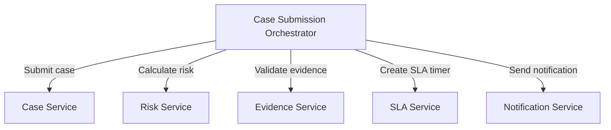

### When It Fits

Gunakan orchestration ketika:

- process long-running;
- ada branching logic kompleks;
- ada timer/SLA;
- ada human task;
- perlu visibility central;
- perlu compensation;
- perlu audit/reconstruction;
- debugging choreography terlalu sulit;
- process owner jelas.

### Process State

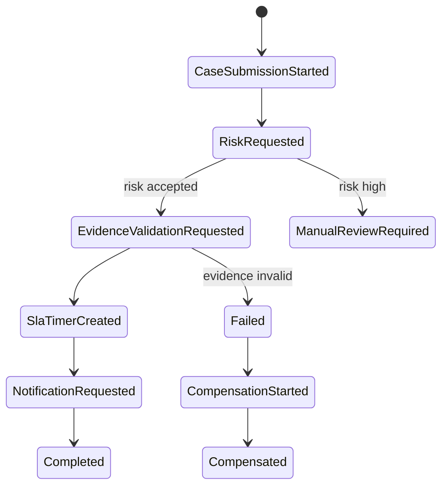

### Java-Like Orchestrator Sketch

```java
public class CaseSubmissionProcess {

    public void start(SubmitCaseCommand command) {
        processStore.create(command.processId(), Step.CASE_SUBMISSION_STARTED);
        commandBus.send(new SubmitCaseInternalCommand(command.caseId(), command.officerId()));
    }

    public void on(CaseSubmitted event) {
        processStore.move(event.processId(), Step.RISK_REQUESTED);
        commandBus.send(new CalculateRiskCommand(event.caseId()));
    }

    public void on(RiskCalculated event) {
        if (event.isHighRisk()) {
            processStore.move(event.processId(), Step.MANUAL_REVIEW_REQUIRED);
            commandBus.send(new RequestManualReviewCommand(event.caseId()));
            return;
        }

        processStore.move(event.processId(), Step.EVIDENCE_VALIDATION_REQUESTED);
        commandBus.send(new ValidateEvidenceCommand(event.caseId()));
    }
}
```

This sketch is simplified. In production, a workflow engine or durable process manager usually handles state, timers, retries, and history better than ad-hoc code.

### Failure Model

Orchestrator failure modes:

- orchestrator becomes bottleneck;
- orchestrator knows too much domain detail;
- orchestrator creates tight command coupling;
- process versioning is hard;
- compensation logic incomplete;
- participant idempotency missing.

### Rule

> Orchestration is good when process visibility and control are more valuable than maximum decentralization.

---

## 9. Pattern 7: Choreography

Choreography berarti tidak ada central coordinator. Service bereaksi terhadap event satu sama lain.

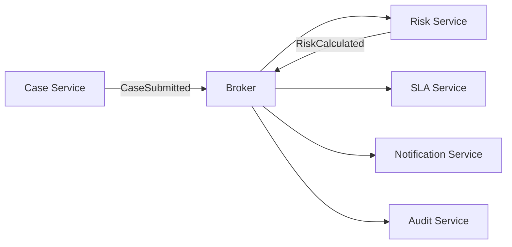

### When It Fits

Gunakan choreography ketika:

- flow sederhana;
- tiap participant punya autonomy tinggi;
- tidak ada central process owner;
- side effects loosely coupled;
- eventual consistency acceptable;
- failure lokal tidak harus menggagalkan flow utama.

### Example

```text
CaseSubmitted ->
  SLA Service creates deadline.
  Search Service updates index.
  Audit Service records fact.
  Notification Service sends message.
```

This is good choreography because these reactions are side effects of a fact.

### When It Fails

Choreography memburuk ketika:

- flow punya banyak branches;
- urutan antar service penting;
- compensation diperlukan;
- business bertanya “case ini stuck di tahap mana?”;
- debug harus membaca 12 topic;
- failure handling tersebar;
- service A publish event agar B publish event agar C publish event agar D melakukan aksi inti.

### Choreography Smell

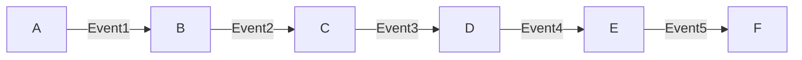

If this is one business transaction, you probably need orchestration or a visible process manager.

### Rule

> Use choreography for independent reactions. Be careful using it for complex business processes.

---

## 10. Orchestration vs Choreography Decision Matrix

| Question | Prefer choreography | Prefer orchestration |
|---|---|---|
| Flow is simple side effects? | Yes | No need |
| Many branching decisions? | No | Yes |
| Human task/timer/SLA? | Maybe | Yes |
| Need central process visibility? | No | Yes |
| Need compensation? | Maybe | Yes |
| Teams highly autonomous? | Yes | Maybe |
| Process owner exists? | Maybe | Yes |
| Debugging distributed flow hard? | No | Yes |
| Failure handling local? | Yes | No |
| Regulatory audit requires reconstruction? | Maybe | Yes |

In regulatory systems, orchestration is often justified for lifecycle processes because auditability, SLA, state visibility, and human decisions matter. Choreography remains excellent for secondary reactions like indexing, notifications, audit ingestion, and reporting projections.

---

## 11. Hybrid Collaboration: The Real Default

A realistic architecture combines patterns.

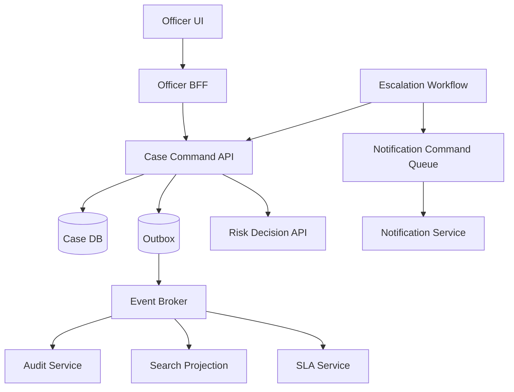

What happens here:

- UI uses BFF for experience-specific view;
- command API handles core write;
- Case Service calls Risk synchronously because decision needed now;
- Case Service publishes event after commit;
- Audit/Search/SLA react asynchronously;
- escalation lifecycle uses workflow orchestration;
- notification uses async command.

This is not messy. This is precise.

---

## 12. Collaboration Pattern by Use Case

| Use case | Recommended pattern | Why |
|---|---|---|
| User opens case dashboard | BFF/API composition | Client-specific read view |
| Submit case | Command API + local transaction | User needs acceptance/rejection |
| Validate risk before submit | Request-response | Immediate decision required |
| Update search index | Pub-sub event | Eventually consistent projection |
| Send notification | Async command or event reaction | Side effect can retry separately |
| Generate monthly regulatory report | Async command/job + projection | Long-running workload |
| Escalate overdue case | Workflow orchestration | Timer, SLA, audit, state visibility |
| Audit case submitted | Pub-sub event | Independent immutable fact recording |
| Fetch party authoritative details | Request-response | Source authority needed |
| Maintain party summary in case view | Event-carried state projection | Avoid runtime coupling |

---

## 13. Collaboration and Consistency

Your collaboration pattern defines consistency behavior.

| Pattern | Consistency tendency |
|---|---|
| Request-response inside command | Can enforce immediate decision, but distributed availability risk |
| Local transaction + event | Strong local consistency, eventual cross-service consistency |
| Async command | Accepted-now, completed-later consistency |
| API composition | Fresh per dependency, partial failure possible |
| Projection query | Fast read, stale by design |
| Workflow orchestration | Process consistency via durable state |
| Choreography | Emergent consistency through reactions |

Never say “eventual consistency” without specifying:

- eventual for whom?
- how long can stale last?
- what user sees during delay?
- what happens on failure?
- who reconciles?
- what invariant is allowed to be temporary?

---

## 14. Collaboration and Ownership

A service collaboration design is wrong if ownership is unclear.

For every interaction, define:

| Ownership question | Example answer |
|---|---|
| Who owns the business decision? | Risk Service owns risk classification |
| Who owns process state? | Escalation Workflow owns escalation lifecycle |
| Who owns user-facing read view? | Officer BFF owns view composition |
| Who owns authoritative case state? | Case Service |
| Who owns notification delivery? | Notification Service |
| Who owns event semantic? | Producing domain service |
| Who owns retry policy? | Caller for sync, consumer for async |
| Who owns compensation? | Process owner/orchestrator |

Without this, production incidents become argument-driven debugging.

---

## 15. Collaboration and Latency Budget

For synchronous collaboration, latency budget is an architecture constraint.

Example:

```text
User submit case target p95 <= 900ms

Budget:
- API gateway/auth overhead: 80ms
- Case Service validation: 120ms
- Risk decision call: 250ms
- DB transaction: 150ms
- Outbox append: 30ms
- response serialization/network: 70ms
- safety buffer: 200ms
```

If you add three more synchronous dependencies, the budget breaks.

Rule:

> Every synchronous dependency must spend latency budget and justify why the caller must wait.

---

## 16. Collaboration and Failure Policy

For every dependency, define failure policy.

| Dependency | Failure policy examples |
|---|---|
| Risk decision | fail closed, manual review, cached decision |
| Notification | enqueue retry, do not block submit |
| Audit | critical audit may block or use durable outbox |
| Search index | async retry, stale search accepted |
| Party profile | partial view or unavailable section |
| Workflow engine | command accepted only if process started |
| Reporting | async projection, reconcile later |

Architecture document should explicitly say:

```text
If Notification Service is unavailable, SubmitCase still succeeds. Notification Service consumes CaseSubmitted later from broker. Notification delay SLO is 5 minutes.
```

Or:

```text
If Audit Outbox append fails, SubmitCase fails because regulatory audit evidence is mandatory for formal submission.
```

That is architecture. Not arrows.

---

## 17. Collaboration Pattern Selection Algorithm

Use this decision flow.

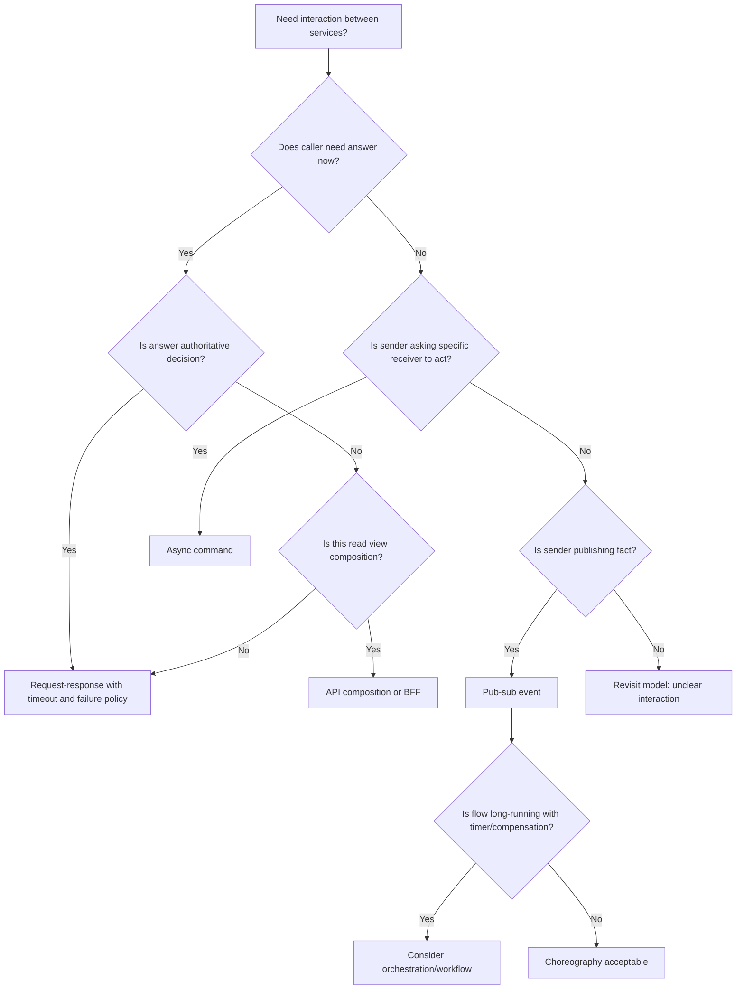

---

## 18. Java Implementation Boundaries

### 18.1 Synchronous Client Port

```java
public interface RiskDecisionPort {
    RiskDecision calculateRisk(CaseId caseId, Deadline deadline);
}
```

Adapter:

```java
@Component
class HttpRiskDecisionAdapter implements RiskDecisionPort {
    private final WebClient webClient;

    @Override
    public RiskDecision calculateRisk(CaseId caseId, Deadline deadline) {
        return webClient.post()
            .uri("/risk-decisions")
            .bodyValue(new RiskDecisionRequest(caseId.value()))
            .retrieve()
            .bodyToMono(RiskDecisionResponse.class)
            .timeout(deadline.remaining())
            .map(RiskDecisionMapper::toDomain)
            .block();
    }
}
```

Application service depends on the port, not WebClient.

---

### 18.2 Event Publisher Port

```java
public interface DomainEventPublisher {
    void publishLater(IntegrationEvent event);
}
```

Outbox implementation:

```java
@Component
class OutboxDomainEventPublisher implements DomainEventPublisher {
    private final OutboxRepository outboxRepository;

    @Override
    public void publishLater(IntegrationEvent event) {
        outboxRepository.append(OutboxMessage.from(event));
    }
}
```

The name `publishLater` is intentional. It prevents developer from assuming broker publish happens immediately.

---

### 18.3 Async Command Sender Port

```java
public interface NotificationCommandPort {
    void requestCaseSubmittedNotification(CaseId caseId, CorrelationId correlationId);
}
```

Implementation writes to command outbox/queue:

```java
@Component
class QueueNotificationCommandAdapter implements NotificationCommandPort {
    private final CommandOutboxRepository outbox;

    @Override
    public void requestCaseSubmittedNotification(CaseId caseId, CorrelationId correlationId) {
        outbox.append(SendCaseSubmittedNotificationCommand.create(caseId, correlationId));
    }
}
```

---

### 18.4 Workflow Port

```java
public interface EscalationWorkflowPort {
    ProcessId startEscalation(CaseId caseId, EscalationReason reason);
}
```

Domain service should not know if implementation uses Temporal, Camunda, custom process manager, or queue-based orchestration.

---

## 19. Collaboration Smell Catalog

### 19.1 Chatty Service Mesh

Symptoms:

- service A calls B for every field;
- many small synchronous calls;
- latency dominated by network;
- N+1 remote calls;
- difficult caching.

Fix:

- coarser API;
- query projection;
- API composition with batch endpoints;
- reconsider service boundary.

---

### 19.2 God Orchestrator

Symptoms:

- orchestrator knows every domain rule;
- services become CRUD participants;
- all changes require orchestrator release;
- autonomy disappears.

Fix:

- move domain decisions back to owning services;
- orchestrator coordinates process, not business internals;
- use published commands/events;
- split process by lifecycle ownership.

---

### 19.3 Event Pinball

Symptoms:

- A event triggers B event triggers C event triggers D event;
- no one owns full business outcome;
- debugging requires reading broker history manually;
- compensation impossible.

Fix:

- introduce process manager;
- define business process owner;
- collapse unnecessary events;
- distinguish side effects from core flow.

---

### 19.4 Shared Client Library Coupling

Symptoms:

- all services import same generated/internal library;
- library includes domain model, API DTOs, persistence objects;
- one library release forces many services to update.

Fix:

- generate clients from stable contracts only;
- avoid shared domain model;
- version client artifacts;
- use consumer compatibility checks.

---

### 19.5 Business Rule in Gateway/BFF

Symptoms:

- BFF decides if case can be approved;
- gateway validates regulatory policy;
- UI-specific service owns core status transition.

Fix:

- move invariant to domain owner;
- BFF only shapes experience;
- use command API for business transition.

---

## 20. Collaboration Design Template

Use this template before implementing cross-service flow.

```md
# Collaboration Design: <Flow Name>

## Business Outcome
What user/system outcome is being achieved?

## Participants
- Service A: owner of ...
- Service B: owner of ...

## Interaction List
| Step | Pattern | Caller/Producer | Receiver/Consumer | Sync/Async | Failure policy |
|---|---|---|---|---|---|

## Consistency Model
What is strong locally? What is eventual? What is user-visible?

## Latency Budget
Total budget and per synchronous dependency budget.

## Idempotency
Command keys, event IDs, duplicate behavior.

## Ordering
What must be ordered? By what key?

## Observability
Trace, correlation ID, business process ID, metrics.

## Compensation/Reconciliation
What happens when downstream step fails permanently?

## Security and Data Exposure
What data crosses service boundary? Any PII/sensitive data?

## Rollout Plan
Compatibility, feature flag, migration, rollback.
```

---

## 21. Worked Example: Submit Case Flow

### 21.1 Naive Design

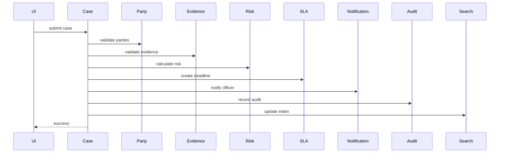

Problems:

- too many synchronous dependencies;
- notification/search/audit latency blocks user;
- unclear failure policy;
- remote calls likely inside transaction;
- partial success impossible to reason about;
- Case Service becomes process god.

### 21.2 Better Design

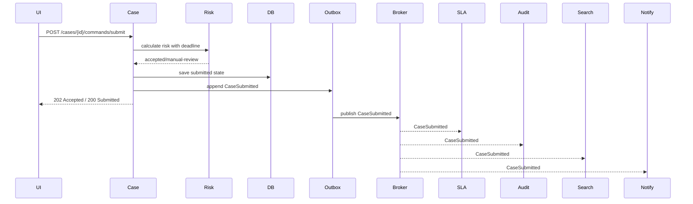

Design decisions:

| Concern | Decision |
|---|---|
| Risk | synchronous because submit decision needs it |
| Case state | local transaction in Case Service |
| Audit | via outbox event; if outbox append fails, submit fails |
| Search | async projection |
| Notification | async event reaction or command |
| SLA | async event reaction creates deadline |
| User response | accepted/submitted after local commit |
| Consistency | case authoritative immediately, projections eventual |

---

## 22. Architecture Review Checklist

### Pattern Fit

- Is each interaction pattern explicitly chosen?
- Is the reason documented?
- Is there any synchronous call that does not need immediate answer?
- Is there any async interaction that actually needs immediate decision?

### Runtime Dependency

- What happens when receiver is down?
- What happens when receiver is slow?
- Is timeout defined?
- Is retry safe?
- Is circuit breaker/load shedding needed?

### Consistency

- What is strong?
- What is eventual?
- What is stale?
- How does user know pending state?
- Is reconciliation needed?

### Ownership

- Who owns the process?
- Who owns each decision?
- Who owns compensation?
- Who owns event/command schema?
- Who owns operational alert?

### Observability

- Is there a correlation ID across sync and async boundaries?
- Can we reconstruct business flow?
- Are command/event lag and failure visible?
- Are partial failures visible to support team?

### Evolution

- Can receiver change independently?
- Can producer add fields without breaking consumers?
- Can new consumer join without producer change?
- Can process version migrate safely?

---

## 23. Final Mental Model

Service collaboration is not a technology choice. It is a decision about time, ownership, consistency, and failure.

Use this simple model:

- **request-response** when caller needs answer now;
- **async command** when a specific receiver should do something later;
- **pub-sub event** when a domain fact happened and many consumers may care;
- **API composition/BFF** when a read experience spans services;
- **orchestration** when a long-running business process needs control, timers, compensation, and visibility;
- **choreography** when independent services react to facts without central process control;
- **hybrid** when the business flow has multiple kinds of interactions.

The top-level skill is not memorizing pattern names. It is reading a business flow and asking:

```text
Who owns the decision?
Who must know now?
Who can react later?
What fails if this dependency is down?
What consistency does the user actually need?
What evidence do we need to debug or defend the outcome?
```

Once you can answer those, the technology choice becomes much easier.

In the next part, we move into API composition and aggregation in more detail: fan-out, partial responses, BFF, aggregator services, latency budget, and failure isolation.
