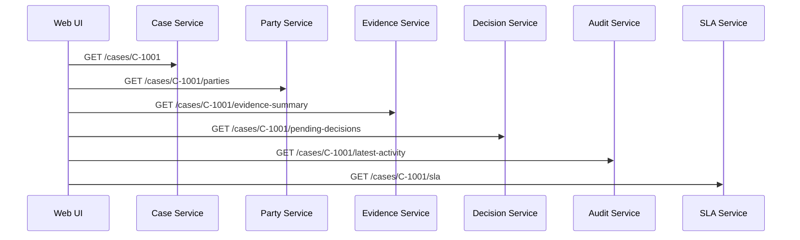
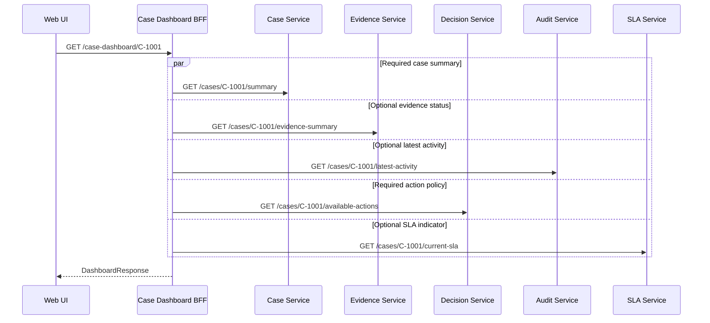
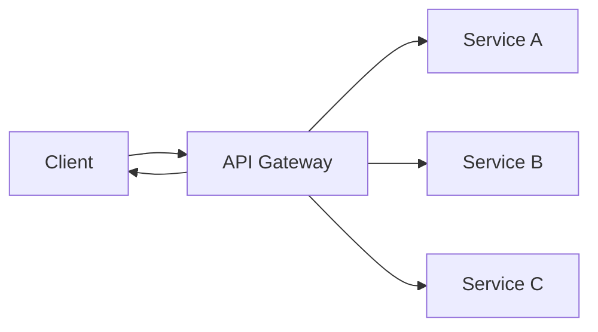
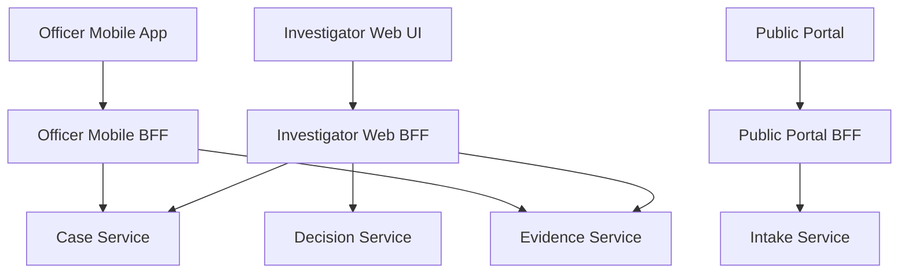
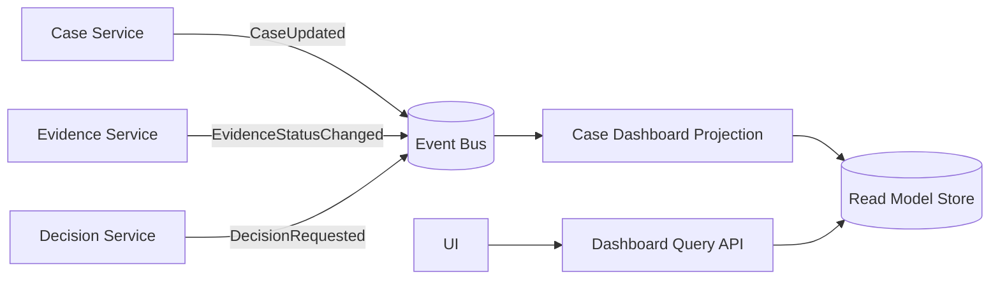
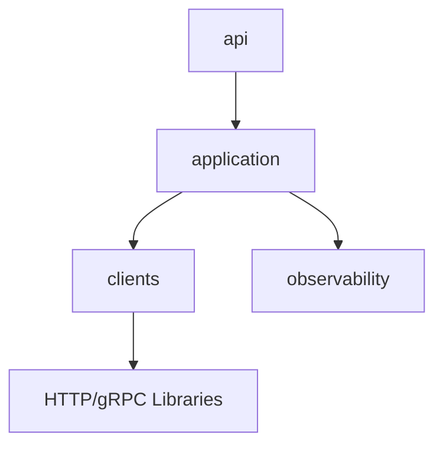
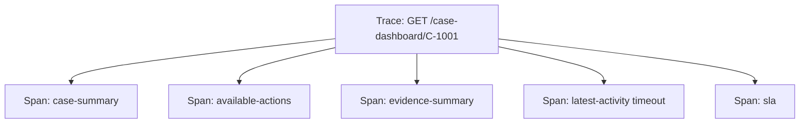

# Part 029 — API Composition and Aggregation

Microservices memecah ownership. User journey menyatukan kembali pengalaman.

Di sinilah API composition lahir.

Namun ada jebakan besar: banyak tim memperlakukan API composition sebagai tempat “mengumpulkan data”. Lama-lama komposer berubah menjadi service raksasa yang tahu semua domain, semua policy, semua exception, dan semua detail lifecycle. Bentuknya terlihat praktis, tetapi secara arsitektur ia adalah **distributed monolith coordinator**.

Part ini membahas cara mendesain API composition yang sehat: cukup kuat untuk menyederhanakan client experience, tetapi tidak merusak ownership service di belakangnya.

---

## 1. Problem yang Sebenarnya

Bayangkan UI dashboard enforcement case management membutuhkan:

- ringkasan case,
- assigned investigator,
- open allegation count,
- latest evidence status,
- pending approval,
- SLA breach indicator,
- last audit activity,
- available next actions.

Kalau client memanggil semua service langsung:



Masalahnya bukan hanya “terlalu banyak call”. Masalah yang lebih serius:

1. **Client mengetahui topology internal.** UI tahu service mana yang harus dipanggil.
2. **Client memikul orchestration logic.** UI harus tahu urutan, retry, fallback, dan dependency optional/required.
3. **Latency menjadi fan-out problem.** Satu halaman menjadi secepat dependency paling lambat.
4. **Security policy bocor ke client.** Client harus tahu token/scope apa untuk tiap service.
5. **Evolution menjadi sulit.** Perubahan service internal bisa memaksa perubahan UI.
6. **Observability pecah.** Satu user action menghasilkan banyak request tanpa satu composition trace yang jelas.

API composition mencoba menjawab ini dengan membuat satu endpoint yang mewakili kebutuhan client journey.



Sekarang client hanya tahu satu contract: dashboard view.

Tetapi komposisi yang buruk bisa lebih berbahaya daripada direct call.

---

## 2. Mental Model: Composer Owns View, Source Owns Truth

Prinsip paling penting:

> **Composer owns the view. Source service owns the truth.**

Artinya:

- API composer boleh membentuk response sesuai kebutuhan client.
- API composer tidak boleh menjadi system of record.
- API composer tidak boleh mengambil alih invariant domain.
- API composer tidak boleh menjadi tempat utama business decision.
- API composer boleh melakukan view-level decision: field mana wajib, field mana optional, bagaimana degraded response ditampilkan.
- API composer tidak boleh melakukan domain-level decision: apakah case boleh ditutup, apakah approval valid, apakah violation terbukti.

Contoh sehat:

```text
Case Dashboard BFF:
- mengambil summary case dari Case Service
- mengambil evidence status dari Evidence Service
- mengambil SLA indicator dari SLA Service
- menyusun response untuk UI dashboard
- mengembalikan partial response kalau latest audit activity gagal
```

Contoh tidak sehat:

```text
Case Dashboard BFF:
- menghitung apakah case boleh dieskalasi
- membaca data dari Case, Evidence, Party, Decision, Risk
- menerapkan rule escalation sendiri
- menulis status baru ke Case Service
- menerbitkan event CaseEscalated
```

Yang kedua bukan BFF lagi. Itu coordinator domain tersembunyi.

---

## 3. Jenis API Composition

Tidak semua composition sama. Pilih berdasarkan ownership dan client need.

### 3.1 Gateway Aggregation

Gateway aggregation terjadi ketika API gateway menerima satu request dari client, lalu menggabungkan beberapa backend call menjadi satu response.

Cocok ketika:

- composition sangat tipis,
- response shape sederhana,
- tidak banyak domain logic,
- dependency count rendah,
- ownership berada di platform/edge team.



Gunakan untuk:

- mengurangi round-trip client,
- centralizing edge concerns,
- simple aggregation.

Hindari untuk:

- workflow,
- complex policy,
- per-client domain transformation yang besar,
- business decision.

Gateway yang terlalu pintar berubah menjadi **god gateway**.

---

### 3.2 Backend-for-Frontend

Backend-for-Frontend atau BFF adalah service khusus untuk client experience tertentu.

Contoh:

- `case-web-bff`,
- `case-mobile-bff`,
- `officer-portal-bff`,
- `public-complaint-bff`.



BFF cocok ketika:

- setiap client punya journey berbeda,
- payload perlu disesuaikan,
- UI sering berubah,
- domain service tidak boleh mengikuti kebutuhan tampilan,
- ada per-client performance optimization.

BFF tidak berarti bebas membuat business rule.

Aturan sehat:

```text
BFF owns:
- screen/view model
- query composition
- partial response policy
- client-specific validation ringan
- edge security mapping
- caching for view

Domain service owns:
- domain rule
- state transition
- aggregate invariant
- audit decision
- data authority
```

---

### 3.3 Aggregator Service

Aggregator service adalah service internal yang bertanggung jawab menyusun satu read model atau query model dari banyak source.

Berbeda dari BFF, aggregator service tidak selalu client-specific. Ia bisa dipakai oleh beberapa consumer.

Contoh:

- `case-overview-query-service`,
- `enforcement-dashboard-service`,
- `regulatory-reporting-query-service`.

Cocok ketika:

- composition punya lifecycle sendiri,
- hasil composition dipakai banyak channel,
- butuh caching/materialized view,
- butuh observability dan ownership lebih kuat daripada gateway script.

Risikonya:

- aggregator menjadi shared dependency besar,
- aggregator mulai menyimpan rule domain,
- aggregator menjadi reporting dumping ground.

---

### 3.4 GraphQL/API Query Layer

GraphQL dapat menjadi composition layer yang fleksibel untuk client.

Kelebihan:

- client memilih field yang dibutuhkan,
- mengurangi over-fetching/under-fetching,
- schema menjadi query contract,
- cocok untuk UI yang banyak variasi.

Risiko:

- resolver N+1 problem,
- auth per-field kompleks,
- schema bisa membocorkan model internal,
- performance budgeting sulit,
- query complexity harus dibatasi.

GraphQL bukan pengganti service boundary. Ia hanya query surface.

---

### 3.5 Materialized Composition

Kadang composition runtime terlalu mahal. Solusinya adalah materialized read model.



Ini bukan lagi API composition runtime. Ini **query-side projection**.

Cocok ketika:

- dashboard sering dibaca,
- fan-out mahal,
- toleransi staleness jelas,
- event stream reliable,
- read model punya owner.

Trade-off-nya:

- data stale,
- reconciliation dibutuhkan,
- event schema evolution penting,
- debugging lebih kompleks.

---

## 4. Decision Matrix

| Kebutuhan | Gateway Aggregation | BFF | Aggregator Service | Materialized Read Model |
|---|---:|---:|---:|---:|
| Simple fan-out | Baik | Baik | Bisa | Berlebihan |
| Client-specific UX | Lemah | Sangat baik | Sedang | Sedang |
| Banyak consumer | Sedang | Lemah | Baik | Baik |
| Butuh low latency stabil | Sedang | Sedang | Sedang | Sangat baik |
| Data boleh stale | Tidak perlu | Tidak perlu | Opsional | Wajib jelas |
| Complex domain rule | Jangan | Jangan | Jangan | Jangan |
| Complex query shaping | Lemah | Baik | Baik | Sangat baik |
| Ownership oleh product team | Sedang | Baik | Baik | Baik |
| Ownership oleh platform team | Baik | Lemah | Sedang | Sedang |

Rule sederhana:

```text
Jika problemnya client round-trip sederhana → gateway aggregation.
Jika problemnya client journey spesifik → BFF.
Jika problemnya reusable query capability → aggregator service.
Jika problemnya repeated expensive read → materialized read model.
```

---

## 5. Fan-Out Latency Model

Misal satu endpoint composition memanggil 5 dependency.

Kalau call serial:

```text
T_total = T_case + T_evidence + T_decision + T_audit + T_sla + T_processing
```

Kalau call parallel:

```text
T_total ≈ max(T_case, T_evidence, T_decision, T_audit, T_sla) + T_processing
```

Parallel lebih cepat, tetapi bukan gratis.

Masalahnya:

- resource concurrency meningkat,
- connection pool cepat habis,
- downstream menerima burst,
- tail latency tetap mendominasi,
- satu dependency lambat bisa membuat keseluruhan response lambat kalau dianggap required.

Contoh:

| Dependency | p50 | p95 | Required? |
|---|---:|---:|---:|
| Case Service | 30 ms | 120 ms | Ya |
| Evidence Service | 45 ms | 300 ms | Tidak |
| Decision Service | 60 ms | 200 ms | Ya |
| Audit Service | 80 ms | 900 ms | Tidak |
| SLA Service | 40 ms | 150 ms | Tidak |

Kalau semua required, p95 composition bisa terseret oleh Audit Service.

Kalau Audit optional, composer bisa mengembalikan dashboard tanpa latest activity.

```json
{
  "caseId": "C-1001",
  "summary": { "status": "UNDER_REVIEW" },
  "availableActions": ["REQUEST_MORE_EVIDENCE", "ESCALATE"],
  "evidence": { "status": "PARTIAL" },
  "sla": { "breachRisk": "HIGH" },
  "latestActivity": null,
  "warnings": [
    {
      "code": "LATEST_ACTIVITY_UNAVAILABLE",
      "message": "Latest audit activity is temporarily unavailable."
    }
  ]
}
```

Partial response bukan error asal contract-nya eksplisit.

---

## 6. Required vs Optional Fragment

Composition response terdiri dari fragment.

Setiap fragment harus diklasifikasi:

| Fragment | Required? | Failure Policy | Reason |
|---|---:|---|---|
| Case summary | Ya | Fail response | Tanpa case summary, dashboard meaningless |
| Available actions | Ya | Fail closed | Action salah bisa melanggar policy |
| Evidence summary | Tidak | Return unavailable fragment | Informational |
| Latest audit activity | Tidak | Return warning | Informational |
| SLA indicator | Tergantung | Degrade or fail | Tergantung apakah SLA menentukan action |

Prinsip:

> Fragment yang memengaruhi permission, legal decision, money movement, atau irreversible action harus fail closed.

Contoh action button:

```text
Jika available actions gagal:
- jangan tampilkan tombol action dengan asumsi aman
- jangan fallback ke cached policy lama tanpa TTL yang jelas
- tampilkan state "actions temporarily unavailable"
```

Untuk regulatory system, ini penting. UI yang “kelihatannya jalan” tetapi menampilkan action yang tidak valid bisa menjadi defect defensibility.

---

## 7. Composition Contract

Endpoint composition harus punya contract eksplisit.

Contoh:

```http
GET /case-dashboard/{caseId}
```

Response contract harus menjawab:

1. Field apa saja yang wajib?
2. Field apa saja yang optional?
3. Apa arti `null`?
4. Apa arti fragment `unavailable`?
5. Apakah response boleh stale?
6. TTL cache berapa?
7. Apakah response mengandung decision/action?
8. Apakah partial response dianggap success?
9. Warning code apa yang mungkin muncul?
10. Correlation ID mana yang bisa dipakai debugging?

Contoh response lebih eksplisit:

```json
{
  "caseId": "C-1001",
  "generatedAt": "2026-07-05T10:20:30Z",
  "staleness": {
    "maxAgeSeconds": 15,
    "source": "runtime-composition"
  },
  "summary": {
    "status": "UNDER_REVIEW",
    "priority": "HIGH"
  },
  "actions": {
    "available": ["REQUEST_MORE_EVIDENCE"],
    "source": "decision-service",
    "computedAt": "2026-07-05T10:20:29Z"
  },
  "fragments": {
    "evidence": {
      "status": "AVAILABLE",
      "data": {
        "submittedCount": 8,
        "pendingReviewCount": 2
      }
    },
    "latestActivity": {
      "status": "UNAVAILABLE",
      "reasonCode": "DEPENDENCY_TIMEOUT"
    }
  },
  "warnings": [
    {
      "code": "LATEST_ACTIVITY_UNAVAILABLE",
      "dependency": "audit-service"
    }
  ]
}
```

Ini lebih baik daripada diam-diam menghilangkan field.

---

## 8. Java Implementation Model

Struktur sehat untuk BFF/aggregator:

```text
case-dashboard-bff/
  src/main/java/com/acme/casedashboard/
    api/
      CaseDashboardController.java
      CaseDashboardResponse.java
      ErrorResponse.java
    application/
      CaseDashboardComposer.java
      FragmentPolicy.java
      FragmentResult.java
    clients/
      caseclient/
        CaseClient.java
        CaseSummaryDto.java
      decisionclient/
        DecisionClient.java
        AvailableActionsDto.java
      evidenceclient/
        EvidenceClient.java
      auditclient/
        AuditClient.java
    observability/
      CompositionMetrics.java
    config/
      ClientTimeoutProperties.java
```

Dependency direction:



Untuk BFF, domain layer biasanya tipis atau tidak ada. Jangan memaksakan rich domain model jika service ini hanya composition layer.

Namun jangan juga membuat semua logic di controller.

Controller harus tipis:

```java
@RestController
@RequestMapping("/case-dashboard")
final class CaseDashboardController {

    private final CaseDashboardComposer composer;

    CaseDashboardController(CaseDashboardComposer composer) {
        this.composer = composer;
    }

    @GetMapping("/{caseId}")
    CaseDashboardResponse getDashboard(
            @PathVariable String caseId,
            @RequestHeader("X-Correlation-Id") String correlationId) {
        return composer.compose(new ComposeDashboardRequest(caseId, correlationId));
    }
}
```

Composer mengatur dependency call dan fragment policy:

```java
final class CaseDashboardComposer {

    private final CaseClient caseClient;
    private final DecisionClient decisionClient;
    private final EvidenceClient evidenceClient;
    private final AuditClient auditClient;
    private final SlaClient slaClient;
    private final ExecutorService executor;

    CaseDashboardResponse compose(ComposeDashboardRequest request) {
        var deadline = Deadline.after(Duration.ofMillis(800));

        var caseFuture = supply("case-summary", true,
                () -> caseClient.getSummary(request.caseId(), deadline));

        var actionFuture = supply("available-actions", true,
                () -> decisionClient.getAvailableActions(request.caseId(), deadline));

        var evidenceFuture = supply("evidence-summary", false,
                () -> evidenceClient.getSummary(request.caseId(), deadline));

        var auditFuture = supply("latest-activity", false,
                () -> auditClient.getLatestActivity(request.caseId(), deadline));

        var slaFuture = supply("sla", false,
                () -> slaClient.getCurrentSla(request.caseId(), deadline));

        var caseSummary = caseFuture.join().requiredValue();
        var actions = actionFuture.join().requiredValue();
        var evidence = evidenceFuture.join();
        var audit = auditFuture.join();
        var sla = slaFuture.join();

        return CaseDashboardResponse.from(caseSummary, actions, evidence, audit, sla);
    }

    private <T> CompletableFuture<FragmentResult<T>> supply(
            String fragment,
            boolean required,
            Supplier<T> supplier) {

        return CompletableFuture
                .supplyAsync(() -> FragmentResult.available(fragment, supplier.get()), executor)
                .orTimeout(700, TimeUnit.MILLISECONDS)
                .exceptionally(error -> {
                    if (required) {
                        return FragmentResult.requiredFailed(fragment, error);
                    }
                    return FragmentResult.unavailable(fragment, classify(error));
                });
    }
}
```

`FragmentResult` membuat partial failure eksplisit:

```java
sealed interface FragmentResult<T> permits Available, Unavailable, RequiredFailed {

    String name();

    default T requiredValue() {
        return switch (this) {
            case Available<T> available -> available.value();
            case Unavailable<T> unavailable ->
                    throw new IllegalStateException("Required fragment unavailable: " + name());
            case RequiredFailed<T> failed ->
                    throw new CompositionFailedException(name(), failed.cause());
        };
    }

    static <T> FragmentResult<T> available(String name, T value) {
        return new Available<>(name, value);
    }

    static <T> FragmentResult<T> unavailable(String name, FailureReason reason) {
        return new Unavailable<>(name, reason);
    }

    static <T> FragmentResult<T> requiredFailed(String name, Throwable cause) {
        return new RequiredFailed<>(name, cause);
    }
}

record Available<T>(String name, T value) implements FragmentResult<T> {}
record Unavailable<T>(String name, FailureReason reason) implements FragmentResult<T> {}
record RequiredFailed<T>(String name, Throwable cause) implements FragmentResult<T> {}
```

Catatan penting: contoh ini menunjukkan bentuk mental model. Di production, kamu harus memastikan:

- executor dibatasi,
- timeout per dependency jelas,
- connection pool jelas,
- cancellation dipropagasikan bila memungkinkan,
- correlation ID diteruskan,
- metrics dicatat per fragment.

---

## 9. Deadline Propagation

Composition endpoint harus punya total deadline.

Contoh:

```text
Client budget: 1000 ms
Gateway overhead: 50 ms
BFF budget: 900 ms
Response serialization: 50 ms
Downstream fragment budget: 600–750 ms
```

Jangan memberi setiap downstream timeout 2 detik jika endpoint client hanya punya SLA 1 detik.

Buruk:

```text
Dashboard endpoint target: 800 ms
Case client timeout: 2000 ms
Evidence client timeout: 2000 ms
Audit client timeout: 2000 ms
Decision client timeout: 2000 ms
```

Baik:

```text
Dashboard endpoint target: 800 ms
Required fragments: 500–650 ms
Optional fragments: 250–400 ms
Composition overhead: 100 ms
Fallback/degraded response: explicit
```

Deadline harus menjadi contract operasional, bukan angka random di config.

---

## 10. Failure Policy

Composition layer harus punya failure matrix.

| Failure | Required Fragment | Optional Fragment |
|---|---|---|
| 404 source not found | Usually fail | Usually unavailable/null depending semantic |
| 403 forbidden | Fail closed | Omit fragment or fail closed depending sensitivity |
| Timeout | Fail or 503 | Degraded response |
| 5xx dependency | Fail or degraded by policy | Degraded response |
| Validation mismatch | Fail | Fail if schema corrupted |
| Stale cache only | Use only with explicit TTL | Use as degraded response |

Jangan membuat fallback yang terlihat nyaman tetapi salah secara domain.

Contoh buruk:

```text
Decision Service timeout → assume action ESCALATE is available
```

Contoh baik:

```text
Decision Service timeout → actions.status = UNAVAILABLE, all mutation buttons disabled
```

Untuk system yang mengandung regulatory decision, fallback harus defensible.

---

## 11. Avoiding Hidden Business Logic

Pertanyaan review:

1. Apakah composer menghitung state domain?
2. Apakah composer memutuskan allowed transition?
3. Apakah composer menulis ke lebih dari satu domain service dalam satu command?
4. Apakah composer punya table rule besar?
5. Apakah perubahan policy bisnis harus deploy composer?
6. Apakah source service hanya menjadi data supplier bodoh?

Jika banyak jawaban “ya”, composition layer sudah melewati batas.

Pola yang lebih baik:

```text
BFF asks Decision Service:
"What actions are available for case C-1001 for user U-17?"

Decision Service answers:
[REQUEST_MORE_EVIDENCE, ESCALATE]

BFF does not compute the rule.
```

---

## 12. Security and Authorization

API composition sering menjadi tempat identity translation.

Yang boleh dilakukan:

- validate user session/token at edge,
- propagate identity context,
- request downstream with service identity plus user context,
- filter view fields based on response from policy/authorization service,
- remove sensitive fields not needed by client.

Yang berbahaya:

- composer mengarang authorization rule sendiri,
- composer memanggil downstream dengan superuser tanpa context,
- composer mengembalikan field karena “UI tidak akan menampilkan”,
- composer menyatukan data lintas tenant tanpa tenant guard.

Minimal context propagation:

```text
X-Correlation-Id: req-123
X-Request-Id: req-123.4
X-Tenant-Id: regulator-id
X-User-Id: user-17
X-User-Roles: avoid if too large; prefer token/claims or policy reference
```

Jangan gunakan header internal sebagai boundary security utama tanpa verifikasi di network/trust layer yang benar.

---

## 13. Caching Strategy

Composition layer boleh caching, tetapi harus jelas apa yang di-cache.

Jenis cache:

| Cache | Cocok untuk | Risiko |
|---|---|---|
| Per-request cache | Menghindari duplicate call dalam satu request | Rendah |
| Short TTL cache | Dashboard fragment | Staleness |
| User-specific cache | Personalized view | Privacy leak |
| Shared cache | Public/reference data | Invalidation |
| Materialized read model | High-read dashboard | Event lag/reconciliation |

Rule:

> Cache view boleh. Cache decision harus sangat hati-hati.

Contoh:

```text
Case summary cache 10s → mungkin aman.
Available action cache 10m → berbahaya jika policy cepat berubah.
Evidence count cache 30s → tergantung UI expectation.
```

Cache response harus membawa staleness metadata jika keputusan user bergantung pada freshness.

---

## 14. Observability untuk API Composition

Satu user action harus terlihat sebagai satu trace dengan beberapa span dependency.



Metrics minimum:

- composition request count,
- composition latency p50/p95/p99,
- dependency latency per fragment,
- fragment timeout count,
- partial response rate,
- required fragment failure rate,
- fallback/degraded response rate,
- cache hit/miss,
- fan-out count per request,
- response size.

Structured log minimum:

```json
{
  "event": "case_dashboard_composed",
  "caseId": "C-1001",
  "correlationId": "req-123",
  "durationMs": 642,
  "requiredFragments": ["case-summary", "available-actions"],
  "optionalUnavailable": ["latest-activity"],
  "dependencyTimeouts": ["audit-service"],
  "partial": true
}
```

Jangan hanya log “dashboard returned 200”. Itu menutup kegagalan partial.

---

## 15. Composition Smells

### Smell 1 — God Gateway

Gateway berisi routing, auth, rate limit, data mapping, workflow, business rule, fallback, reporting, dan audit.

Perbaikan:

- pindahkan business rule ke domain service,
- pindahkan complex view ke BFF/aggregator,
- pertahankan gateway untuk edge concern.

---

### Smell 2 — UI Knows Internal Services

Client memanggil 8 service untuk satu screen.

Perbaikan:

- buat BFF untuk user journey,
- stabilkan view contract,
- sembunyikan topology internal.

---

### Smell 3 — Composer Writes to Many Services

Satu endpoint BFF melakukan:

```text
POST /submit-case
  -> Case Service
  -> Evidence Service
  -> Decision Service
  -> Audit Service
```

Ini bukan composition biasa. Ini command orchestration/saga.

Perbaikan:

- pindahkan ke workflow/process manager,
- pastikan idempotency,
- definisikan compensation,
- jangan bungkus sebagai “simple API”.

---

### Smell 4 — Silent Partial Failure

Dependency gagal, field kosong, response tetap 200 tanpa warning.

Perbaikan:

- buat fragment status,
- return warning,
- expose partial response metric.

---

### Smell 5 — Cross-Service Join in Runtime Path

Composer melakukan join besar antar service untuk setiap request.

Perbaikan:

- gunakan read model/projection,
- batasi fan-out,
- desain query capability khusus.

---

### Smell 6 — Leaking Internal DTO

BFF mengembalikan DTO dari backend service langsung.

Perbaikan:

- buat view model contract sendiri,
- mapping eksplisit,
- jangan expose internal field.

---

## 16. API Composition vs Workflow Orchestration

Bedakan dua hal:

| Aspek | API Composition | Workflow Orchestration |
|---|---|---|
| Tujuan | Membentuk response/read view | Mengelola proses bisnis |
| State | Biasanya stateless | Stateful/durable |
| Operation | Read-heavy | Command/process-heavy |
| Failure handling | Partial response/fallback | Retry, compensation, timeout |
| Ownership | Client/product/query team | Process/domain owner |
| Example | Case dashboard | Enforcement escalation workflow |

Jika endpoint melakukan long-running process, timer, compensation, human approval, dan state transition, itu bukan API composition. Itu workflow.

---

## 17. Architecture Review Checklist

Gunakan checklist ini sebelum menerima API composition layer.

### Boundary

- [ ] Apakah composer hanya membentuk view/query?
- [ ] Apakah system of record tetap jelas?
- [ ] Apakah business invariant tetap di domain service?
- [ ] Apakah mutation multi-service tidak disembunyikan sebagai composition?

### Contract

- [ ] Apakah required/optional fragment jelas?
- [ ] Apakah partial response terdokumentasi?
- [ ] Apakah staleness contract jelas?
- [ ] Apakah warning/error code stabil?

### Performance

- [ ] Apakah fan-out count dibatasi?
- [ ] Apakah call parallel aman untuk downstream?
- [ ] Apakah timeout sesuai total latency budget?
- [ ] Apakah connection pool cukup dan dibatasi?

### Reliability

- [ ] Apakah required fragment fail closed?
- [ ] Apakah optional fragment degrade secara eksplisit?
- [ ] Apakah retry tidak memperkuat overload?
- [ ] Apakah cache fallback punya TTL?

### Security

- [ ] Apakah tenant/user context dipropagasikan?
- [ ] Apakah composer tidak memakai superuser tanpa guard?
- [ ] Apakah sensitive field difilter sebelum response?
- [ ] Apakah authorization decision tidak dikarang di BFF?

### Observability

- [ ] Apakah trace span per fragment tersedia?
- [ ] Apakah partial response rate dimonitor?
- [ ] Apakah dependency timeout per fragment dimonitor?
- [ ] Apakah log mengandung correlation ID?

---

## 18. Practical Exercise

Ambil satu screen nyata, misalnya “Case Detail Dashboard”.

Buat table:

| Field di UI | Source Service | Required? | Freshness | Failure Policy | Owner |
|---|---|---:|---|---|---|
| case status | Case Service | Ya | realtime | fail | case team |
| available actions | Decision Service | Ya | realtime | fail closed | decision team |
| evidence count | Evidence Service | Tidak | 30s | unavailable | evidence team |
| latest activity | Audit Service | Tidak | 60s | warning | audit team |

Lalu jawab:

1. Apakah ini cocok BFF atau materialized read model?
2. Apa total latency budget endpoint?
3. Fragment mana yang boleh stale?
4. Fragment mana yang harus fail closed?
5. Apa warning code yang akan dilihat client?
6. Metrics apa yang akan jadi alert?
7. Apakah ada hidden business logic di composer?

Kalau tidak bisa menjawab pertanyaan ini, composition layer belum siap production.

---

## 19. Final Mental Model

API composition adalah alat untuk menyatukan **client experience**, bukan alat untuk mencampur ownership domain.

Gunakan kalimat ini sebagai invariant desain:

```text
The composer may assemble a view.
The composer must not become the source of truth.
The composer may degrade optional information.
The composer must fail closed for decisions.
The composer may hide topology from clients.
The composer must not hide domain coupling from architects.
```

Jika kamu menjaga invariant ini, API composition menjadi leverage.

Jika kamu melanggarnya, API composition menjadi tempat lahirnya distributed monolith generasi berikutnya.

---

## Referensi

- Microsoft Azure Architecture Center — Gateway Aggregation Pattern.
- Microsoft Azure Architecture Center — API Gateway Pattern in Microservices.
- Martin Fowler — Backends for Frontends.
- Martin Fowler — Microservices.
- Google SRE — Handling Overload.
- RFC 9110 — HTTP Semantics.
