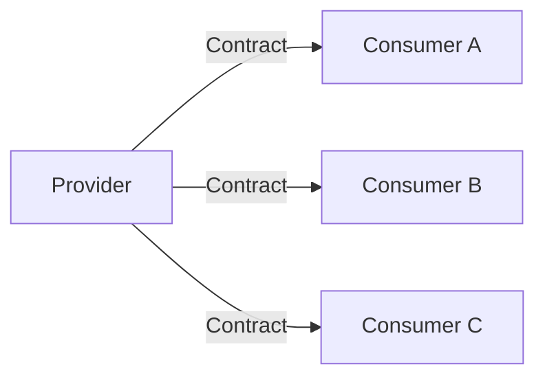
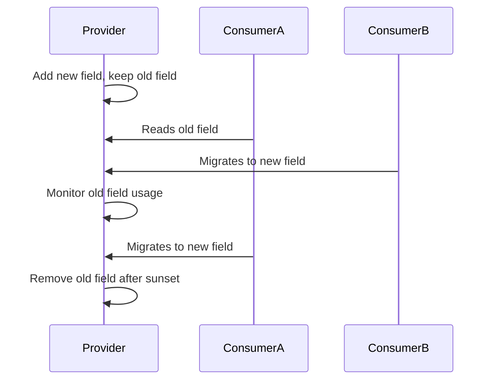
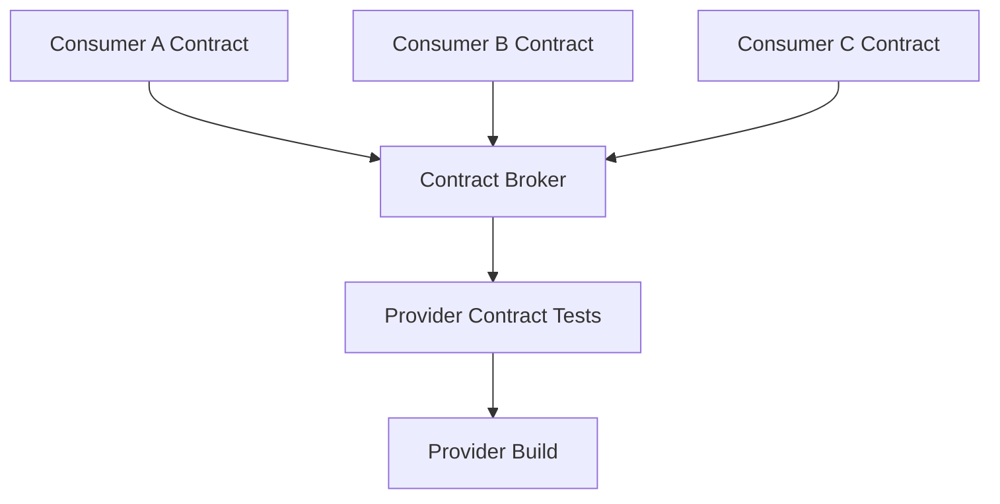
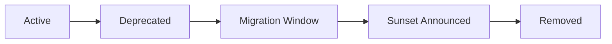
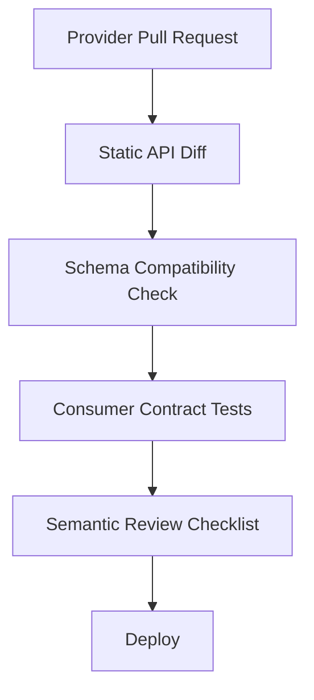
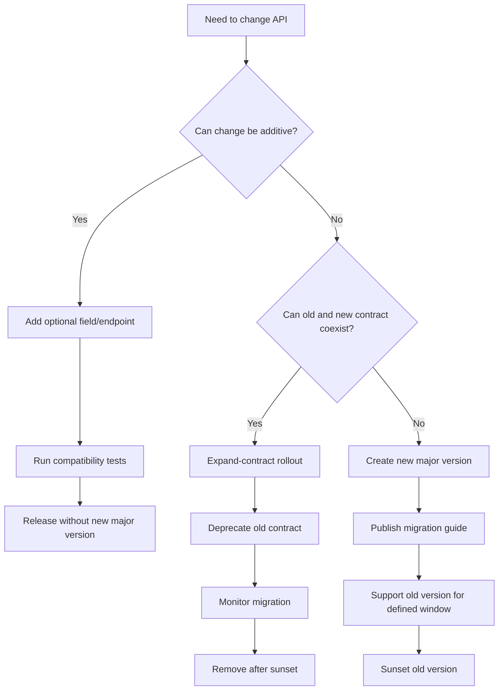

# Part 030 — Versioning and Compatibility Strategy

Microservices hanya benar-benar independen jika service bisa berubah tanpa memaksa semua consumer deploy bersamaan.

Di sinilah compatibility menjadi lebih penting daripada versioning.

Versioning sering dipahami sebagai solusi utama:

```text
Ada breaking change? Buat /v2.
```

Itu terlalu dangkal.

Versioning bukan strategi evolusi. Versioning adalah salah satu alat ketika compatibility tidak bisa dipertahankan.

Strategi yang lebih matang:

```text
Design for compatibility first.
Detect breaking changes early.
Use versioning only when semantic compatibility cannot be preserved.
Deprecate with telemetry, migration plan, and sunset policy.
```

---

## 1. Mental Model: Compatibility First, Versioning Last

API versioning yang buruk menghasilkan dua masalah:

1. **Provider terbebani banyak versi.** Semua versi harus dijaga, diamankan, dimonitor, dan didukung.
2. **Consumer terkunci di versi lama.** Upgrade dianggap mahal, sehingga legacy contract hidup terlalu lama.

API tanpa versioning juga bisa buruk jika provider sering membuat breaking change diam-diam.

Jadi targetnya bukan “punya versi” atau “tidak punya versi”. Targetnya adalah:

> **Provider dapat berevolusi tanpa mengejutkan consumer.**

Compatibility berarti consumer lama tetap bisa berjalan dengan expectation yang wajar setelah provider berubah.

Versioning berarti provider membuka contract baru ketika contract lama tidak bisa lagi berevolusi secara aman.

---

## 2. Compatibility Dimensions

Compatibility bukan hanya schema.

Ada banyak dimensi.

| Dimensi | Contoh Perubahan | Bisa Breaking? |
|---|---|---:|
| Structural | tambah field JSON | Biasanya tidak |
| Structural | rename/remove field | Ya |
| Type | string menjadi object | Ya |
| Requiredness | optional menjadi required | Ya |
| Semantic | arti status berubah | Ya |
| Behavioral | endpoint makin lambat | Bisa |
| Error | 404 berubah menjadi 200 empty | Bisa |
| Security | scope baru diwajibkan | Ya |
| Pagination | default page size berubah drastis | Bisa |
| Ordering | default sort berubah | Bisa |
| Enum | tambah enum value | Bisa jika consumer tidak tolerant |
| Rate limit | limit diturunkan | Bisa |
| Consistency | data yang dulu realtime menjadi stale | Ya jika tidak kontrak |

Banyak tim hanya mengecek OpenAPI diff. Itu perlu, tetapi tidak cukup. Perubahan semantic bisa breaking walaupun schema sama.

Contoh:

```json
{
  "caseStatus": "CLOSED"
}
```

Dulu `CLOSED` berarti case selesai dan tidak bisa reopen.

Sekarang `CLOSED` berarti selesai secara administratif, tetapi bisa reopen dalam 30 hari.

Schema tidak berubah. Semantik berubah. Consumer bisa salah.

---

## 3. Provider and Consumer Contract

Setiap API punya dua sisi:



Provider sering berpikir:

```text
Saya hanya mengubah field internal.
```

Consumer berpikir:

```text
Field itu dipakai untuk workflow saya.
```

Karena itu, contract bukan hanya file OpenAPI. Contract adalah expectation aktual consumer terhadap behavior provider.

Consumer expectation bisa mencakup:

- field yang dipakai,
- status code yang ditangani,
- enum value yang dikenal,
- latency yang diasumsikan,
- error retryability,
- ordering result,
- idempotency behavior,
- staleness,
- authorization behavior,
- event ordering.

Strategi compatibility harus membuat expectation ini terlihat.

---

## 4. Tolerant Reader

Consumer harus membaca response secara toleran.

Prinsip:

```text
Ignore unknown fields.
Handle unknown enum values.
Do not depend on field order.
Do not parse human-readable message for logic.
Do not assume optional field always exists.
```

Buruk:

```java
if (response.getStatus().equals("UNDER_REVIEW")) {
    showReviewButton();
} else if (response.getStatus().equals("CLOSED")) {
    hideAllActions();
} else {
    throw new IllegalStateException("Unknown status: " + response.getStatus());
}
```

Lebih aman:

```java
switch (CaseStatus.from(response.status())) {
    case UNDER_REVIEW -> showReviewButton();
    case CLOSED -> hideAllActions();
    case UNKNOWN -> showSafeFallbackState();
}
```

Untuk enum eksternal, `UNKNOWN` sering lebih baik daripada crash.

Namun tolerant reader bukan alasan provider sembarangan menambah semantik baru tanpa komunikasi.

---

## 5. Compatible Change Rules untuk REST/JSON API

### 5.1 Biasanya Compatible

Perubahan berikut biasanya compatible jika consumer tolerant:

- tambah optional response field,
- tambah endpoint baru,
- tambah optional query parameter,
- tambah optional request field yang tidak wajib,
- tambah link/relation baru,
- tambah warning metadata,
- tambah non-breaking error detail,
- memperbaiki dokumentasi tanpa mengubah behavior,
- memperluas response dengan field nullable yang jelas.

Contoh:

```json
{
  "caseId": "C-1001",
  "status": "UNDER_REVIEW",
  "priority": "HIGH"
}
```

Menjadi:

```json
{
  "caseId": "C-1001",
  "status": "UNDER_REVIEW",
  "priority": "HIGH",
  "sla": {
    "breachRisk": "MEDIUM"
  }
}
```

Ini compatible jika consumer mengabaikan field yang tidak dikenal.

---

### 5.2 Sering Breaking

Perubahan berikut sering breaking:

- rename field,
- remove field,
- ubah type field,
- optional menjadi required,
- required menjadi optional jika consumer bergantung pada keberadaan field,
- ubah format string,
- ubah arti enum,
- tambah enum value jika consumer tidak siap,
- ubah status code untuk kondisi yang sama,
- ubah error code,
- ubah default pagination,
- ubah default sorting,
- ubah id format,
- ubah id stability,
- ubah consistency guarantee,
- ubah authorization requirement,
- menurunkan rate limit tanpa migration window.

Contoh breaking:

```json
{
  "assignedOfficerId": "U-17"
}
```

Menjadi:

```json
{
  "assignedOfficer": {
    "id": "U-17",
    "displayName": "A. Wijaya"
  }
}
```

Ini mungkin terlihat lebih kaya, tetapi consumer lama yang membaca `assignedOfficerId` akan rusak.

Compatible alternative:

```json
{
  "assignedOfficerId": "U-17",
  "assignedOfficer": {
    "id": "U-17",
    "displayName": "A. Wijaya"
  }
}
```

Lalu deprecate field lama setelah telemetry menunjukkan consumer sudah migrasi.

---

## 6. Expand-Contract Rollout

Pattern paling penting untuk evolusi API:

```text
Expand → Migrate → Contract
```

### Step 1 — Expand

Tambahkan contract baru tanpa menghapus contract lama.

```json
{
  "assignedOfficerId": "U-17",
  "assignedOfficer": {
    "id": "U-17",
    "displayName": "A. Wijaya"
  }
}
```

### Step 2 — Migrate

Consumer dipindahkan ke field baru.

Monitor:

- consumer mana masih membaca field lama,
- traffic versi lama,
- error rate,
- contract test status,
- owner consumer.

### Step 3 — Contract

Hapus field lama setelah:

- deprecation period selesai,
- semua critical consumer migrasi,
- telemetry membuktikan field lama tidak dipakai,
- rollback plan jelas,
- release note sudah keluar.



Expand-contract adalah dasar independent deployability.

---

## 7. API Versioning Options

### 7.1 URI Versioning

Contoh:

```http
GET /v1/cases/C-1001
GET /v2/cases/C-1001
```

Kelebihan:

- jelas,
- mudah routing,
- mudah dokumentasi,
- mudah bagi client.

Kekurangan:

- mendorong duplikasi endpoint,
- sulit untuk minor evolution,
- bisa membuat consumer malas migrasi,
- path menjadi bagian dari lifecycle besar.

Gunakan untuk major breaking change yang benar-benar tidak bisa compatible.

---

### 7.2 Header Versioning

Contoh:

```http
GET /cases/C-1001
Accept-Version: 2
```

Kelebihan:

- URI tetap bersih,
- routing bisa fleksibel,
- cocok untuk platform internal dengan client library.

Kekurangan:

- kurang terlihat,
- tooling/cache/proxy bisa lebih rumit,
- debugging manual kurang jelas.

---

### 7.3 Media Type Versioning

Contoh:

```http
Accept: application/vnd.acme.case.v2+json
```

Kelebihan:

- dekat dengan content negotiation,
- cocok untuk representasi berbeda.

Kekurangan:

- lebih kompleks,
- kurang familiar bagi banyak tim,
- sering tidak sepadan untuk internal enterprise API.

---

### 7.4 No Explicit Version for Compatible Evolution

Untuk perubahan compatible, tidak perlu versi baru.

Contoh:

```http
GET /cases/C-1001
```

Provider menambah optional field, consumer tolerant.

Ini ideal selama ada:

- compatibility rules,
- contract testing,
- deprecation process,
- telemetry,
- review untuk semantic changes.

---

## 8. Jangan Version Semua Hal

Kesalahan umum:

```text
/v1/cases
/v1/cases/{id}/actions
/v1/cases/{id}/evidence
/v2/cases
/v3/cases
/v2/cases/{id}/actions
```

Hasilnya:

- dokumentasi bercabang,
- bug fix harus backport,
- monitoring per versi rumit,
- security patch multipel,
- consumer bingung.

Version hanya ketika perlu. Evolusi harian harus compatible.

---

## 9. Consumer-Driven Contracts

Consumer-driven contract berarti consumer mendefinisikan expectation yang mereka butuhkan dari provider.

Provider menjalankan contract test untuk memastikan perubahan tidak merusak consumer.



Yang diuji bukan semua kemungkinan response. Yang diuji adalah expectation nyata consumer.

Contoh expectation:

```text
Given case C-1001 exists
When GET /cases/C-1001 is called
Then response status is 200
And $.caseId is "C-1001"
And $.status is one of known supported values
And $.assignedOfficerId exists when case is assigned
```

CDC sangat berguna untuk microservices karena provider sering tidak tahu semua cara consumer memakai API.

Namun CDC bukan pengganti design review. CDC mendeteksi expectation; ia tidak menentukan apakah API design sehat.

---

## 10. Semantic Compatibility Review

Sebelum merilis perubahan API, tanyakan:

1. Apakah consumer lama masih bisa memproses response?
2. Apakah arti field berubah?
3. Apakah status code berubah?
4. Apakah error retryability berubah?
5. Apakah latency/timeout expectation berubah?
6. Apakah ordering berubah?
7. Apakah data yang dulu strong consistent menjadi eventually consistent?
8. Apakah authorization scope berubah?
9. Apakah enum baru bisa membuat consumer crash?
10. Apakah ada consumer yang parse message manusia?

Contoh semantic breaking walau schema sama:

```json
{
  "riskScore": 75
}
```

Dulu range `0–100`.

Sekarang range `0–1000`.

Field tetap number. Tetapi consumer yang memberi warna merah jika `riskScore > 80` akan salah.

Perubahan semacam ini harus diperlakukan sebagai breaking.

---

## 11. Event Contract Evolution

Event-driven microservices punya masalah compatibility yang lebih tajam karena event disimpan, diproses async, dan bisa direplay.

### 11.1 Compatible Event Changes

Biasanya aman:

- tambah optional field,
- tambah event type baru,
- tambah metadata envelope,
- tambah schema version dalam event,
- tambah nullable field dengan default jelas.

### 11.2 Breaking Event Changes

Sering breaking:

- rename field,
- remove field,
- ubah meaning field,
- ubah event type meaning,
- ubah key/partitioning semantic,
- ubah ordering guarantee,
- ubah event dari fact menjadi command,
- ubah event timestamp meaning,
- ubah identity format.

Event adalah fakta yang sudah terjadi. Jangan mengubah arti fakta lama.

Buruk:

```text
CaseClosed event dulu berarti final closure.
Sekarang CaseClosed berarti temporarily closed.
```

Lebih baik:

```text
CaseAdministrativelyClosed
CaseFinallyClosed
CaseReopened
```

Nama event harus jelas sebagai business fact.

---

## 12. Event Envelope Versioning

Gunakan envelope stabil:

```json
{
  "eventId": "evt-123",
  "eventType": "CaseAssigned",
  "eventVersion": 2,
  "occurredAt": "2026-07-05T09:10:00Z",
  "producer": "case-service",
  "correlationId": "req-789",
  "tenantId": "regulator-id",
  "payload": {
    "caseId": "C-1001",
    "assignedOfficerId": "U-17",
    "assignmentReason": "WORKLOAD_BALANCING"
  }
}
```

Prinsip:

- envelope field jarang berubah,
- payload bisa evolve,
- event version digunakan untuk deserialization/migration,
- consumer harus bisa ignore unknown payload fields,
- producer jangan reuse event type untuk makna baru.

---

## 13. gRPC/Protobuf Compatibility

Untuk Protobuf:

- jangan reuse field number,
- jangan hapus field number tanpa `reserved`,
- jangan ubah type field sembarangan,
- jangan tambah required field,
- tambah optional field biasanya aman,
- enum baru bisa mengganggu consumer jika tidak siap,
- service method removal adalah breaking,
- request/response message evolution harus additive.

Contoh:

```proto
message CaseSummary {
  string case_id = 1;
  string status = 2;
  string priority = 3;

  // New optional field. Compatible for tolerant clients.
  optional string assigned_officer_id = 4;
}
```

Jika field dihapus:

```proto
message CaseSummary {
  string case_id = 1;
  string status = 2;

  reserved 3;
  reserved "priority";
}
```

Tujuannya mencegah field number lama dipakai ulang dengan arti baru.

---

## 14. Java DTO Evolution

DTO eksternal tidak boleh disamakan dengan domain model internal.

Buruk:

```java
@Entity
class CaseEntity {
    @Id String id;
    String status;
    String priority;
}
```

Lalu entity ini langsung menjadi response API.

Masalah:

- perubahan database bocor ke API,
- field internal bisa terekspos,
- rename property internal menjadi breaking API,
- lazy loading bisa menyebabkan bug serialization,
- compatibility sulit dikontrol.

Lebih sehat:

```java
record CaseSummaryResponse(
        String caseId,
        String status,
        String priority,
        AssignedOfficerResponse assignedOfficer,
        List<ApiWarning> warnings
) {}
```

Mapping eksplisit:

```java
final class CaseSummaryMapper {

    CaseSummaryResponse toResponse(CaseSummary summary) {
        return new CaseSummaryResponse(
                summary.caseId().value(),
                summary.status().apiValue(),
                summary.priority().apiValue(),
                summary.assignedOfficer()
                        .map(o -> new AssignedOfficerResponse(o.id().value(), o.displayName()))
                        .orElse(null),
                List.of()
        );
    }
}
```

DTO API adalah compatibility boundary.

---

## 15. Deprecation Strategy

Deprecation bukan sekadar menulis `@Deprecated`.

Deprecation harus punya lifecycle:



Untuk setiap deprecated field/endpoint, catat:

- apa yang deprecated,
- pengganti apa,
- kapan deprecated mulai,
- kapan sunset,
- siapa owner,
- consumer mana yang masih memakai,
- telemetry apa yang membuktikan usage,
- migration guide,
- rollback plan jika removal bermasalah.

Contoh header:

```http
Deprecation: true
Sunset: Wed, 31 Dec 2026 23:59:59 GMT
Link: </docs/migrations/case-summary-v2>; rel="deprecation"
```

Untuk internal API, kamu tetap butuh policy eksplisit. “Ini cuma internal” bukan alasan untuk breaking diam-diam.

---

## 16. Version Support Policy

Tentukan policy sebelum API punya banyak consumer.

Contoh policy:

```text
Internal service API compatibility policy:

1. Compatible changes may be released without new major version.
2. Breaking changes require ADR and migration plan.
3. Deprecated fields require at least 90 days migration window unless security emergency.
4. Critical consumers must be identified before removal.
5. Provider must expose version/field usage telemetry where possible.
6. Provider must run contract tests before release.
7. Old major version receives security and critical bug fixes only.
8. No new feature is added to deprecated major version.
```

Policy ini mencegah negosiasi ulang setiap kali ada perubahan.

---

## 17. Compatibility Testing Pipeline

Pipeline provider harus memeriksa compatibility.



Layer testing:

1. **Static API diff** — OpenAPI/proto/schema berubah apa?
2. **Provider unit test** — behavior tetap benar?
3. **Consumer-driven contract test** — consumer expectation aman?
4. **Integration test** — runtime serialization/deserialization benar?
5. **Canary telemetry** — real traffic aman?
6. **Consumer usage telemetry** — deprecated field masih dipakai?

Jangan berharap satu tool menangkap semua breaking change.

---

## 18. Compatibility Review Card

Gunakan card ini untuk PR yang mengubah API.

```md
## API Compatibility Review

### Change Summary
- Endpoint/event/method changed:
- Type of change: additive / behavioral / semantic / breaking

### Consumer Impact
- Known consumers:
- Critical consumers:
- Consumer contract tests updated:

### Compatibility
- Backward compatible: yes/no
- Forward compatible: yes/no
- Unknown enum handled: yes/no
- Optional/required field changed: yes/no
- Status/error semantic changed: yes/no

### Migration
- Deprecated fields/endpoints:
- Replacement:
- Migration window:
- Sunset date:

### Observability
- Usage telemetry available:
- Alerts/dashboards updated:

### Decision
- Approved / rejected / needs ADR
```

Ini sederhana, tetapi memaksa engineer berpikir sebagai provider dan consumer sekaligus.

---

## 19. Versioning Smells

### Smell 1 — `/v2` untuk Perubahan Additive

Menambah optional field tidak perlu `/v2`.

Akibat:

- versi cepat menumpuk,
- consumer bingung,
- provider support burden naik.

---

### Smell 2 — Breaking Change Tanpa Version

Provider menghapus field karena “tidak dipakai lagi”, tanpa telemetry.

Akibat:

- consumer runtime error,
- incident lintas tim,
- trust rusak.

---

### Smell 3 — Eternal Version

`/v1` hidup selamanya tanpa owner.

Akibat:

- security patch dan bug fix bercabang,
- refactoring terhambat,
- platform cost naik.

---

### Smell 4 — Semantic Change Disamarkan

Schema sama, arti berubah.

Akibat:

- contract test mungkin hijau,
- business behavior salah,
- defect sulit dilacak.

---

### Smell 5 — Consumer Tidak Tolerant

Consumer crash karena field baru atau enum baru.

Akibat:

- provider tidak bisa evolve,
- semua perubahan menjadi koordinasi manual.

---

## 20. Regulatory Case Example

Misal `Case Service` punya endpoint:

```http
GET /cases/{caseId}/summary
```

Response lama:

```json
{
  "caseId": "C-1001",
  "status": "UNDER_REVIEW",
  "assignedOfficerId": "U-17"
}
```

Product ingin menampilkan assigned officer name.

### Wrong Change

```json
{
  "caseId": "C-1001",
  "status": "UNDER_REVIEW",
  "assignedOfficer": {
    "id": "U-17",
    "name": "A. Wijaya"
  }
}
```

Ini breaking karena `assignedOfficerId` hilang.

### Compatible Change

```json
{
  "caseId": "C-1001",
  "status": "UNDER_REVIEW",
  "assignedOfficerId": "U-17",
  "assignedOfficer": {
    "id": "U-17",
    "displayName": "A. Wijaya"
  }
}
```

Lalu:

1. tandai `assignedOfficerId` deprecated,
2. update docs,
3. monitor usage,
4. migrasi BFF/consumer,
5. hapus setelah migration window.

Jika field lama sudah menjadi bagian audit export, penghapusan mungkin tidak boleh dilakukan tanpa compliance approval.

---

## 21. API Evolution Decision Tree



Gunakan decision tree ini sebelum otomatis membuat `/v2`.

---

## 22. Architecture Checklist

### Provider

- [ ] Apakah perubahan ini backward compatible?
- [ ] Apakah semantic compatibility berubah?
- [ ] Apakah field removal bisa dihindari dengan expand-contract?
- [ ] Apakah enum baru aman untuk consumer?
- [ ] Apakah status/error code berubah?
- [ ] Apakah latency/rate limit berubah?
- [ ] Apakah security scope berubah?
- [ ] Apakah contract test dijalankan?
- [ ] Apakah migration window jelas?
- [ ] Apakah usage telemetry tersedia?

### Consumer

- [ ] Apakah unknown field diabaikan?
- [ ] Apakah unknown enum ditangani?
- [ ] Apakah optional field benar-benar optional?
- [ ] Apakah code tidak parse human message?
- [ ] Apakah retry berdasarkan error code stabil?
- [ ] Apakah consumer punya contract test?
- [ ] Apakah consumer tahu deprecation channel?

### Governance

- [ ] Apakah breaking change butuh ADR?
- [ ] Apakah owner consumer diketahui?
- [ ] Apakah old version punya support policy?
- [ ] Apakah removal punya sunset date?
- [ ] Apakah compatibility rule masuk CI/CD?

---

## 23. Final Mental Model

Versioning adalah cost. Compatibility adalah discipline.

Gunakan invariant berikut:

```text
Do not surprise consumers.
Prefer additive evolution.
Make semantic changes explicit.
Use expand-contract before removal.
Version only when compatibility cannot be preserved.
Deprecate with telemetry, ownership, and sunset policy.
```

Microservices tidak gagal karena tidak punya `/v2`.

Microservices gagal karena service berubah tanpa memahami siapa yang bergantung pada contract itu, ekspektasi apa yang sudah terbentuk, dan bagaimana perubahan itu memengaruhi runtime behavior.

Engineer yang matang tidak hanya bertanya:

```text
Apakah schema valid?
```

Ia bertanya:

```text
Apakah consumer lama masih aman secara behavior?
Apakah consumer baru bisa berkembang tanpa menunggu semua orang?
Apakah perubahan ini menjaga independent deployability?
```

Itulah inti versioning dan compatibility strategy.

---

## Referensi

- Martin Fowler — Consumer-Driven Contracts.
- Martin Fowler — Tolerant Reader.
- Martin Fowler — Microservices.
- Google AIP-180 — Backwards Compatibility.
- Google AIP-185 — API Versioning.
- Microsoft Graph — Versioning and Breaking Change Policies.
- Protocol Buffers Language Guide — Updating Message Types.
- RFC 9110 — HTTP Semantics.
