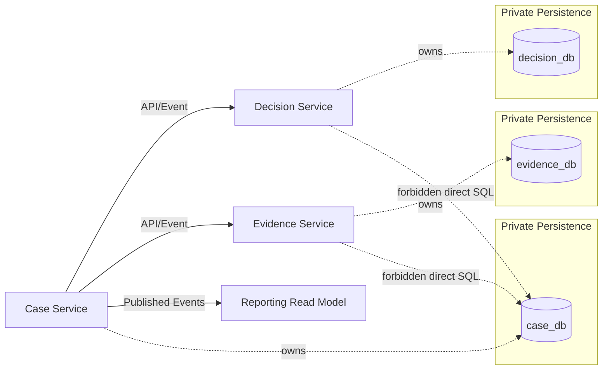
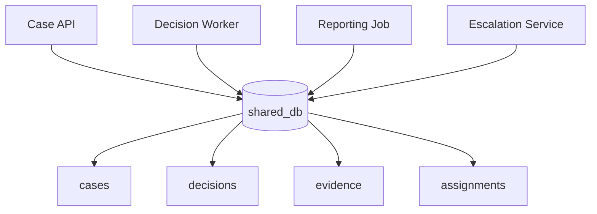
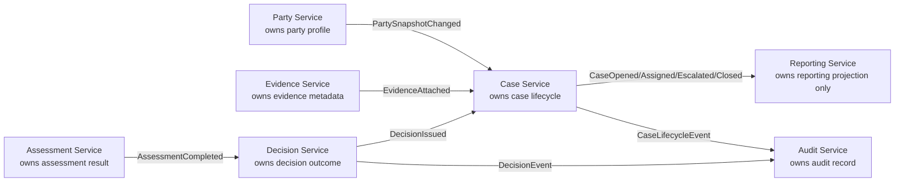
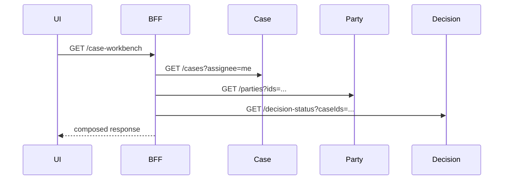
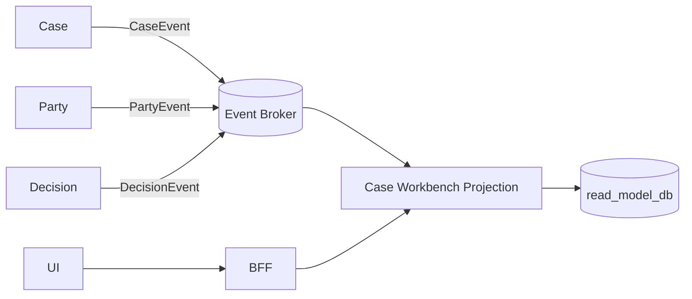
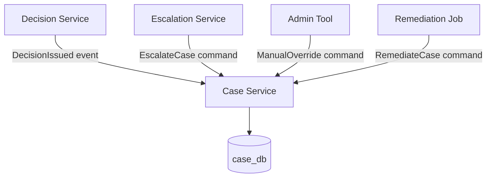

# Part 031 — Data Ownership in Microservices

> Microservices tidak gagal karena service-nya kurang kecil. Microservices sering gagal karena datanya tidak punya pemilik yang jelas.

Di phase sebelumnya kita banyak membahas boundary dari sisi domain, API, event, dan collaboration. Sekarang kita masuk ke bagian yang lebih keras: **data ownership**.

Di microservices, data bukan sekadar tabel. Data adalah **otoritas bisnis**.

Kalau dua service bisa bebas membaca dan menulis tabel yang sama, maka boundary service hanya kosmetik. Kamu punya banyak deployment unit, tetapi satu model data bersama. Itu bukan otonomi; itu distributed monolith dengan database sebagai pusat gravitasi.

Materi ini bukan mengulang database design. Fokusnya adalah:

- bagaimana menentukan siapa pemilik data,
- bagaimana data boleh diakses,
- bagaimana service lain boleh memiliki copy,
- bagaimana menghindari shared database trap,
- bagaimana mendesain authority topology,
- bagaimana memigrasikan shared schema menuju ownership yang defensible,
- dan bagaimana menerapkannya di Java service.

---

## 1. Mental Model: Data Ownership = Authority, Not Storage

Kalimat “service A punya database A” sering disalahpahami.

Yang penting bukan database fisiknya. Yang penting adalah **siapa yang punya otoritas untuk menafsirkan, mengubah, dan menjamin kebenaran data**.

Data ownership berarti satu service memiliki:

1. **Write authority**  
   Hanya service itu yang boleh membuat atau mengubah state utama untuk konsep tersebut.

2. **Semantic authority**  
   Service itu menentukan arti field, status, transition, dan validasi bisnis.

3. **Invariant authority**  
   Service itu bertanggung jawab menjaga aturan yang harus selalu benar.

4. **Lifecycle authority**  
   Service itu mengelola creation, transition, archival, retention, dan deletion.

5. **Evolution authority**  
   Service itu boleh mengubah struktur internal datanya tanpa merusak service lain, selama kontrak eksternalnya dijaga.

6. **Evidence authority**  
   Untuk domain regulated, service itu bisa menjelaskan kenapa data berubah, siapa yang mengubah, melalui command apa, dan akibatnya apa.

Jadi, data ownership bukan:

- “setiap service harus punya database server sendiri”,
- “setiap service harus pakai DB teknologi berbeda”,
- “semua data harus disembunyikan total dari service lain”,
- “tidak boleh ada duplikasi data”,
- “tidak boleh ada reporting database”,
- “tidak boleh ada data warehouse”.

Data ownership adalah aturan bahwa **state utama hanya boleh diubah melalui pemiliknya**.

---

## 2. The Hard Rule

Rule paling sederhana:

> Persistent data milik service adalah private implementation detail. Service lain tidak boleh mengakses tabelnya langsung. Akses harus lewat API, event, replica/read model yang memang dipublikasikan, atau data product yang dikontrak.

Diagramnya begini:



Service lain boleh tahu bahwa `Case Service` punya konsep `Case`. Tetapi service lain tidak boleh tahu bahwa `Case Service` menyimpan `case_status` di tabel `cases`, join ke `case_assignments`, lalu punya enum internal tertentu.

Yang boleh dipublikasikan adalah kontrak:

- command API,
- query API,
- integration event,
- read model,
- exported data product,
- documented lifecycle.

Yang tidak boleh bocor:

- table schema internal,
- internal enum yang belum menjadi kontrak,
- query join internal,
- persistence ID internal jika bukan public identity,
- migration state internal,
- optimized denormalized table internal.

---

## 3. Why Shared Database Feels Good — Until It Breaks You

Shared database menggoda karena cepat.

Service A butuh data dari Service B? Tinggal join.

```sql
SELECT c.case_id, c.status, d.decision_status
FROM cases c
JOIN decisions d ON d.case_id = c.case_id
WHERE c.case_id = ?;
```

Terlihat sederhana. Tapi secara arsitektur, ini membuat service boundary runtuh.

Masalahnya bukan SQL-nya. Masalahnya adalah **ownership**.

Ketika service bebas join tabel milik service lain, kamu kehilangan:

- independent deployability,
- schema evolution,
- clear ownership,
- observability atas dependensi,
- access control boundary,
- auditing boundary,
- failure isolation,
- dan kemampuan mengubah model internal.

Shared database membuat dependency yang paling berbahaya: dependency yang tidak terlihat di API gateway, service mesh, tracing, atau contract test.



Secara diagram aplikasi, kamu melihat empat service. Secara runtime data, kamu punya satu monolith tersembunyi.

---

## 4. The Important Distinction: Data Access vs Data Ownership

Jangan campur dua pertanyaan ini:

1. **Siapa pemilik data?**
2. **Siapa yang membutuhkan data?**

Banyak service boleh membutuhkan data yang sama. Tetapi tidak semua boleh menjadi pemilik.

Contoh domain regulatory case management:

| Data | Owner | Consumer | Bentuk akses yang sehat |
|---|---:|---:|---|
| Case lifecycle | Case Service | Decision, Evidence, Notification, Reporting | API + event `CaseStatusChanged` |
| Evidence metadata | Evidence Service | Case, Decision, Audit | API + event `EvidenceAttached` |
| Decision outcome | Decision Service | Case, Notification, Reporting | API + event `DecisionIssued` |
| Party profile | Party Service | Case, Decision, Notification | API + snapshot event |
| Audit trail | Audit Service | Compliance, Investigation | append-only audit API/event |
| Report projection | Reporting Service | UI, dashboard, analytics | read model, not source of truth |

Kuncinya: **consumer boleh punya copy, tetapi copy bukan authority**.

---

## 5. Authority Taxonomy

Dalam microservices, kamu harus membedakan jenis data copy. Ini menghindari kebingungan seperti “Reporting punya data case, berarti Reporting juga owner case”. Salah.

Gunakan taxonomy berikut.

### 5.1 Source of Truth

Service yang punya state authoritative.

Contoh:

- `Case Service` owns `Case.status`.
- `Decision Service` owns `Decision.outcome`.
- `Evidence Service` owns `Evidence.metadata`.

### 5.2 Writer

Komponen yang boleh mengubah state authoritative. Biasanya sama dengan source-of-truth service.

```text
Only Case Service writes case lifecycle.
Only Decision Service writes decision outcome.
Only Evidence Service writes evidence metadata.
```

### 5.3 Mirror

Copy data yang dipertahankan agar service bisa bekerja tanpa synchronous call setiap saat.

Contoh:

`Decision Service` menyimpan snapshot `CaseSnapshot` berisi:

- `caseId`,
- `caseType`,
- `riskLevel`,
- `currentStatus`,
- `assignedUnit`,
- `version`,
- `observedAt`.

Snapshot ini membantu decision evaluation, tetapi `Decision Service` tidak boleh mengubah `Case.status`.

### 5.4 Projection

Read model yang dibangun dari event untuk query cepat.

Contoh:

`CaseSearchProjection` untuk list page:

- case id,
- status,
- assignee,
- party name,
- latest decision status,
- breach risk,
- last activity timestamp.

Projection boleh denormalized. Tetapi projection bukan owner.

### 5.5 Cache

Copy sementara untuk latency/performance.

Cache harus punya:

- TTL,
- invalidation strategy,
- stale behavior,
- fallback behavior.

### 5.6 Derived Data

Data hasil kalkulasi dari source lain.

Contoh:

- SLA breach indicator,
- risk score,
- dashboard aggregate,
- workload distribution.

Derived data harus punya definisi:

- formula,
- source,
- refresh cadence,
- staleness tolerance,
- owner.

---

## 6. Ownership Card

Setiap data penting harus punya ownership card.

```yaml
concept: Case
owner_service: case-service
business_owner: Enforcement Operations
technical_owner: team-case-platform
source_of_truth: case_db.cases
public_identity: caseId
write_entrypoints:
  - POST /cases
  - POST /cases/{caseId}/assign
  - POST /cases/{caseId}/escalate
  - POST /cases/{caseId}/close
published_events:
  - CaseOpened
  - CaseAssigned
  - CaseEscalated
  - CaseClosed
private_tables:
  - cases
  - case_assignments
  - case_status_history
consumers:
  - decision-service
  - evidence-service
  - notification-service
  - reporting-service
allowed_replication:
  - event_projection
  - bounded_snapshot
forbidden_access:
  - direct_sql
  - cross_schema_join
  - writes_from_other_services
staleness_contract:
  normal_projection_lag: "<= 30s"
  incident_projection_lag: "<= 10m"
audit_requirement:
  command_id_required: true
  actor_required: true
  reason_required_for_manual_override: true
retention:
  active_case: "retained while active"
  closed_case: "10 years or policy-specific"
```

Ownership card mengubah diskusi dari “siapa butuh field ini?” menjadi “siapa bertanggung jawab atas kebenaran field ini?”.

---

## 7. Domain Example: Regulatory Case Management

Misalkan sistem punya capability berikut:

- case intake,
- assignment,
- evidence collection,
- assessment,
- decision,
- escalation,
- notification,
- audit,
- reporting.

Entity yang muncul:

- `Case`,
- `Party`,
- `Evidence`,
- `Allegation`,
- `Assessment`,
- `Decision`,
- `Escalation`,
- `Notification`,
- `AuditRecord`.

Pertanyaan yang salah:

> Tabel `case` harus ada di database mana?

Pertanyaan yang lebih baik:

> Capability mana yang punya otoritas atas lifecycle case?

Kemungkinan ownership:



Perhatikan: `Reporting Service` memiliki database besar berisi gabungan data dari banyak service. Tetapi authority-nya hanya terhadap **projection**, bukan source-of-truth.

---

## 8. Data Duplication Is Not a Smell by Itself

Dalam monolith, duplikasi data sering dianggap buruk.

Dalam microservices, duplikasi data sering perlu.

Yang buruk bukan duplikasi. Yang buruk adalah **duplikasi tanpa authority rule**.

### 8.1 Legitimate Duplication

Duplikasi sehat ketika:

- consumer tidak perlu synchronous call terus-menerus,
- query membutuhkan join lintas service,
- read model perlu optimized untuk UI/reporting,
- service perlu snapshot untuk evaluasi lokal,
- availability lebih penting daripada freshness sempurna,
- data copy punya staleness contract.

### 8.2 Dangerous Duplication

Duplikasi berbahaya ketika:

- dua service sama-sama menulis field yang sama,
- copy dianggap authoritative oleh consumer,
- tidak ada event/reconciliation,
- tidak ada version/source timestamp,
- tidak ada owner jika data berbeda,
- data privacy classification tidak ikut disalin.

Setiap copy harus menjawab:

```text
Copy ini berasal dari mana?
Siapa owner source-nya?
Kapan terakhir diperbarui?
Seberapa stale boleh terjadi?
Apa yang dilakukan kalau source berubah?
Apakah copy ini boleh dipakai untuk keputusan bisnis?
Apakah copy ini boleh ditampilkan ke user?
Apakah copy ini boleh diaudit?
```

---

## 9. Source Reference vs Snapshot

Salah satu design decision paling sering muncul:

> Service lain cukup simpan ID, atau perlu menyimpan snapshot?

### 9.1 Reference Only

```java
public record EvidenceReference(
    EvidenceId evidenceId
) {}
```

Cocok ketika:

- consumer jarang butuh detail,
- freshness sangat penting,
- source service highly available,
- latency masih masuk budget,
- consumer tidak perlu bekerja offline/asynchronously.

### 9.2 Snapshot

```java
public record EvidenceSnapshot(
    EvidenceId evidenceId,
    String evidenceType,
    String classification,
    Instant attachedAt,
    long sourceVersion,
    Instant observedAt
) {}
```

Cocok ketika:

- consumer perlu mengambil keputusan lokal,
- synchronous call mahal/rapuh,
- data berubah jarang,
- stale copy masih acceptable,
- event stream tersedia,
- audit butuh “what did we know at that time?”.

### 9.3 Rule of Thumb

Gunakan reference jika consumer hanya perlu menunjuk ke object.

Gunakan snapshot jika consumer perlu **reasoning** terhadap data itu.

Dalam domain regulated, snapshot sering penting karena keputusan harus bisa direkonstruksi:

> “Ketika keputusan dibuat, evidence metadata apa yang terlihat oleh Decision Service?”

---

## 10. Data Ownership and Invariants

Data ownership paling penting ketika invariant muncul.

Invariant adalah aturan yang tidak boleh dilanggar.

Contoh:

```text
Closed case cannot accept new evidence unless reopened.
Decision cannot be issued before required assessment is completed.
High-risk case must have supervisor approval before closure.
Escalated case must have escalation reason.
```

Klasifikasikan invariant:

| Invariant type | Example | Enforcement location |
|---|---|---|
| Local aggregate invariant | Case cannot move from CLOSED to UNDER_REVIEW directly | Case Service domain model |
| Local service invariant | Case assignment must refer to active officer | Case Service application/domain layer |
| Cross-service invariant | Decision cannot be issued before AssessmentCompleted | Saga/process manager/Decision Service with observed facts |
| Reporting invariant | Dashboard count must match event stream after reconciliation | Reporting Service projection/reconciliation |
| Regulatory invariant | Manual override must record actor, reason, timestamp | Owner service + Audit Service |

Jangan memaksa semua invariant menjadi synchronous distributed transaction. Tidak semua business rule perlu instant global consistency.

Yang perlu kamu desain adalah:

- invariant mana yang harus kuat,
- invariant mana yang boleh eventual,
- siapa yang mendeteksi pelanggaran,
- siapa yang memperbaiki,
- bagaimana user diberi feedback,
- bagaimana audit menjelaskan kondisi sementara.

---

## 11. The Join Problem

Microservices membuat join lintas domain tidak bisa lagi dilakukan sembarang lewat SQL.

Ini bukan kekurangan. Ini konsekuensi dari ownership.

Jika UI butuh list case dengan party name, risk level, latest evidence count, dan decision status, kamu punya beberapa opsi.

### 11.1 API Composition

Composer memanggil beberapa service lalu menggabungkan response.



Cocok untuk:

- small fan-out,
- user-specific view,
- data freshness penting,
- latency masih aman,
- partial response bisa dikelola.

Risiko:

- fan-out latency,
- cascading failure,
- N+1 service call,
- implicit coupling.

### 11.2 Materialized Read Model

Reporting/search service subscribe event dan membuat denormalized view.



Cocok untuk:

- query kompleks,
- high traffic list page,
- reporting,
- dashboard,
- cross-domain search,
- toleransi stale beberapa detik/menit.

Risiko:

- eventual consistency,
- projection lag,
- replay/rebuild complexity,
- event schema governance.

### 11.3 Data Warehouse/Lakehouse

Cocok untuk analytics, bukan operational decision path yang butuh low latency.

### 11.4 Direct Cross-Service SQL Join

Biasanya hindari.

Kalau terpaksa sementara karena migrasi legacy, buat sebagai **migration exception** dengan:

- owner,
- expiry date,
- risk note,
- replacement plan,
- monitoring,
- ADR.

---

## 12. Java Service Persistence Boundary

Di Java, data ownership harus terlihat di struktur kode.

Contoh package sehat:

```text
com.acme.caseplatform.casecore
  ├── api
  │   ├── CaseCommandController.java
  │   └── CaseQueryController.java
  ├── application
  │   ├── OpenCaseHandler.java
  │   ├── AssignCaseHandler.java
  │   └── CloseCaseHandler.java
  ├── domain
  │   ├── Case.java
  │   ├── CaseId.java
  │   ├── CaseStatus.java
  │   ├── CaseRepository.java       # port
  │   └── CaseEvent.java
  ├── infrastructure
  │   ├── persistence
  │   │   ├── JpaCaseEntity.java     # internal
  │   │   ├── SpringDataCaseJpaRepository.java
  │   │   └── PostgresCaseRepository.java
  │   ├── messaging
  │   │   └── OutboxEventPublisher.java
  │   └── clients
  │       └── OfficerDirectoryClient.java
  └── operational
      └── CaseServiceHealthIndicator.java
```

Rule:

- JPA entity tidak keluar dari `infrastructure.persistence`.
- Domain object tidak bergantung pada JPA annotation jika kamu ingin domain benar-benar bersih.
- Repository domain adalah port.
- SQL query internal tidak menjadi kontrak consumer.
- API DTO bukan persistence DTO.
- Event schema bukan dump entity.

### 12.1 Bad Example: Entity Leaks as API

```java
@RestController
class CaseController {
    private final JpaCaseRepository repository;

    @GetMapping("/cases/{id}")
    JpaCaseEntity get(@PathVariable UUID id) {
        return repository.findById(id).orElseThrow();
    }
}
```

Masalah:

- persistence model menjadi public API,
- field internal bocor,
- lazy loading bisa bocor,
- future schema migration menjadi breaking API change,
- security filtering sulit,
- audit contract tidak eksplisit.

### 12.2 Better Example: API Model as Contract

```java
@RestController
class CaseQueryController {
    private final GetCaseView getCaseView;

    @GetMapping("/cases/{caseId}")
    CaseResponse get(@PathVariable String caseId) {
        return getCaseView.handle(new GetCaseQuery(new CaseId(caseId)));
    }
}

public record CaseResponse(
    String caseId,
    String status,
    String assignedUnit,
    Instant openedAt,
    long version
) {}
```

Sekarang public contract tidak tahu tabel internal.

---

## 13. Single Writer Principle

Untuk state authoritative, selalu cari single writer.

> Banyak reader boleh. Banyak writer terhadap konsep yang sama adalah awal chaos.

Contoh buruk:

```text
Case Service writes case.status
Decision Service also writes case.status
Escalation Service also writes case.status
Batch Job also writes case.status
Admin Tool directly updates case.status
```

Jika terjadi bug, siapa yang bertanggung jawab?

Lebih baik:

```text
Only Case Service writes case.status.
Decision Service emits DecisionIssued.
Escalation Service sends EscalateCase command.
Admin Tool calls Case Service manual override API.
Batch Job calls Case Service remediation command.
```

Diagram:



Semua perubahan status masuk melalui pemilik invariant.

---

## 14. Data Ownership vs Foreign Keys

Dalam satu service database, foreign key bagus untuk invariant lokal.

Antar service, foreign key fisik biasanya menciptakan coupling.

Contoh:

`case_db.case.party_id` boleh menyimpan `partyId` sebagai reference. Tetapi jangan membuat FK langsung ke `party_db.parties`.

Kenapa?

- deployment schema jadi terikat,
- restore database jadi sulit,
- ownership kabur,
- service tidak bisa evolusi independen,
- cross-database FK sering tidak portable,
- local transaction menjadi bergantung pada remote owner.

Gunakan **referential integrity by contract**:

- validate at command time jika perlu,
- simpan reference ID,
- subscribe deletion/deactivation event,
- reconcile orphan reference,
- tampilkan degraded state jika source tidak tersedia.

Contoh:

```java
public record PartyReference(
    PartyId partyId,
    String displayNameAtIntake,
    long observedVersion
) {}
```

`displayNameAtIntake` adalah snapshot untuk audit, bukan authority atas party profile.

---

## 15. Read Model Ownership

Read model juga harus punya owner.

Banyak organisasi menganggap read model “hanya query”, sehingga tidak ada owner. Akibatnya projection rusak, stale, tidak diaudit, dan tidak dipercaya.

Read model perlu kontrak:

```yaml
read_model: case_workbench_view
owner_service: case-workbench-query-service
source_events:
  - CaseOpened
  - CaseAssigned
  - CaseEscalated
  - PartySnapshotChanged
  - DecisionIssued
refresh_model: event_driven_projection
staleness_slo: "99% updates visible within 30s"
rebuild_strategy: replay_from_event_store_or_source_export
data_classification:
  contains_pii: true
  contains_sensitive_case_data: true
allowed_use:
  - operational_search
  - workload_dashboard
forbidden_use:
  - authoritative_case_status_update
  - legal_final_record
```

Read model bukan tempat update source-of-truth.

---

## 16. Ownership and Data Privacy

Ketika data disalin ke banyak service, privacy risk meningkat.

Setiap event/copy harus membawa disiplin:

- minimization,
- classification,
- retention,
- redaction,
- purpose limitation,
- access policy.

Jangan publish event seperti ini:

```json
{
  "eventType": "PartyUpdated",
  "party": {
    "partyId": "PTY-123",
    "fullName": "...",
    "nationalId": "...",
    "address": "...",
    "phone": "...",
    "email": "...",
    "riskProfile": "...",
    "internalNotes": "..."
  }
}
```

Ini event sebagai database dump.

Lebih baik publish event sesuai purpose:

```json
{
  "eventType": "PartyDisplayNameChanged",
  "eventId": "evt-...",
  "occurredAt": "2026-07-05T10:15:30Z",
  "partyId": "PTY-123",
  "displayName": "ACME Trading Ltd",
  "sourceVersion": 42
}
```

Dan event sensitif dibuat terpisah dengan access control lebih ketat.

---

## 17. Data Ownership Review Algorithm

Gunakan langkah berikut saat mendesain service baru.

### Step 1 — List Business Concepts

Contoh:

```text
Case
Party
Allegation
Evidence
Assessment
Decision
Escalation
Notification
Audit Record
```

### Step 2 — Identify Lifecycle Owner

Tanya:

```text
Siapa yang membuka?
Siapa yang mengubah?
Siapa yang menutup?
Siapa yang membatalkan?
Siapa yang mengarsipkan?
Siapa yang menjelaskan statusnya?
```

### Step 3 — Identify Invariants

Contoh:

```text
Case cannot be closed while required assessment is missing.
Decision cannot be issued twice for same decision cycle.
Evidence cannot be deleted after decision is issued; only superseded.
```

### Step 4 — Assign Write Authority

Setiap field authoritative harus punya satu writer.

### Step 5 — Define Access Contract

Untuk setiap consumer:

```text
Need command?
Need query?
Need event?
Need snapshot?
Need projection?
Need batch export?
```

### Step 6 — Define Staleness

```text
Can be stale for milliseconds?
Seconds?
Minutes?
Hours?
Never stale?
```

### Step 7 — Define Reconciliation

```text
How do we detect divergence?
How do we replay?
Who owns repair?
What is the audit trail?
```

### Step 8 — Record ADR

Jangan biarkan ownership hanya hidup di kepala architect.

---

## 18. Migration from Shared Schema

Banyak enterprise tidak mulai dari kondisi ideal. Mereka mulai dari shared schema.

Jangan langsung “pecah database” tanpa strategi. Pecah database adalah hasil akhir, bukan langkah pertama.

### 18.1 Baseline Current Access

Cari siapa yang membaca/menulis tabel.

```text
cases table
  writes:
    - legacy-case-app
    - decision-batch
    - admin-sql-script
  reads:
    - reporting-job
    - notification-service
    - escalation-service
    - audit-export
```

### 18.2 Classify Table Ownership

```yaml
table: cases
proposed_owner: case-service
write_authority_target: case-service-only
migration_risk: high
known_external_writers:
  - decision-batch
  - admin-sql-script
known_external_readers:
  - reporting-job
  - escalation-service
  - notification-service
```

### 18.3 Stop New Direct Writes First

Direct write lebih berbahaya daripada direct read.

Langkah awal:

1. Buat command API di owner service.
2. Ubah writer eksternal agar memanggil API.
3. Log semua direct SQL write tersisa.
4. Blokir direct write setelah semua use case pindah.

### 18.4 Replace Direct Reads Gradually

Untuk reader:

- low-volume reader pindah ke API,
- high-volume query pindah ke projection,
- reporting pindah ke event/export/data product,
- emergency SQL diberi expiry.

### 18.5 Publish Events

Owner mulai publish event:

```text
CaseOpened
CaseAssigned
CaseStatusChanged
CaseEscalated
CaseClosed
```

### 18.6 Build Consumer Read Models

Consumer yang butuh query lokal membangun read model.

### 18.7 Remove Cross-Schema Joins

Cari query lintas domain dan pindahkan ke:

- API composition,
- projection,
- reporting model,
- data warehouse.

### 18.8 Physically Separate Last

Setelah ownership logical bersih, baru pertimbangkan pemisahan fisik:

- schema-per-service,
- database-per-service,
- database-server-per-service.

Pemisahan fisik tanpa ownership logical hanya memindahkan kekacauan ke network.

---

## 19. Schema-per-Service vs Database-per-Service vs Server-per-Service

Database-per-service tidak harus selalu berarti satu server DB per service.

| Model | Cocok untuk | Risiko |
|---|---|---|
| Private tables per service | early migration, same DB instance | enforcement lemah, accidental joins |
| Schema per service | stronger boundary, manageable ops | masih bisa cross-schema join jika permission longgar |
| Database per service | autonomy lebih kuat | ops overhead, backup/restore per DB |
| DB server per service | high isolation, high throughput | cost tinggi, platform burden |
| Polyglot persistence | workload khusus | skill/tooling/ops complexity |

Yang harus dipenuhi di semua model:

```text
No direct access from other services.
No cross-service writes.
No hidden SQL dependency.
Published contract exists.
Ownership documented.
```

---

## 20. Enforcement Mechanisms

Ownership tanpa enforcement biasanya kalah oleh deadline.

Gunakan enforcement di beberapa layer.

### 20.1 Database Permission

Consumer tidak diberi credential untuk schema owner.

```text
case_service_user: read/write case schema
reporting_projection_user: read/write reporting schema only
other_service_user: no permission to case schema
```

### 20.2 Repository Visibility

Repository internal tidak diexport sebagai library untuk service lain.

Hindari package `common-dao` yang dipakai lintas service.

### 20.3 Architecture Test

Contoh ArchUnit-style rule:

```java
@AnalyzeClasses(packages = "com.acme")
class PersistenceBoundaryTest {

    @ArchTest
    static final ArchRule api_must_not_depend_on_jpa_entities =
        noClasses()
            .that().resideInAPackage("..api..")
            .should().dependOnClassesThat()
            .resideInAPackage("..infrastructure.persistence..");
}
```

### 20.4 CI/CD Guardrail

- SQL migration hanya boleh menyentuh schema service sendiri.
- Breaking schema change harus punya migration plan.
- Service catalog harus mencantumkan data owner.
- Production DB credential dibatasi per service.

### 20.5 Runtime Detection

- database audit log,
- query origin tagging,
- connection user per service,
- alert direct SQL access ke schema yang tidak dimiliki.

---

## 21. Common Failure Modes

### 21.1 “We Own the Service, But Not the Data”

Service punya API, tetapi data masih ditulis batch job lain.

Ini pseudo-ownership.

Fix:

- pindahkan writer ke owner service,
- expose command API,
- publish events,
- matikan direct writer bertahap.

### 21.2 Shared Enum Across Services

Library `case-status-common.jar` dipakai semua service.

Awalnya terlihat efisien. Lama-lama semua service harus release bersama saat status berubah.

Fix:

- public status contract didefinisikan di API/event,
- internal enum boleh berbeda,
- consumer pakai tolerant handling untuk unknown status.

### 21.3 Reporting Becomes Source of Truth

User melihat dashboard lebih sering daripada operational UI, lalu menganggap dashboard sebagai kebenaran.

Fix:

- label staleness,
- expose last updated time,
- jangan izinkan update dari reporting DB,
- reconciliation report.

### 21.4 Data Copy Without Source Version

Consumer menyimpan snapshot tanpa `sourceVersion` atau `observedAt`.

Saat terjadi konflik, tidak bisa tahu copy mana yang baru.

Fix:

- semua snapshot membawa source version,
- semua event membawa occurredAt dan eventId,
- projection menyimpan processing timestamp.

### 21.5 Foreign Key Nostalgia

Tim mencoba menjaga integritas antar service dengan FK lintas schema.

Fix:

- gunakan reference ID,
- validation via API jika perlu,
- event-based lifecycle tracking,
- reconciliation job.

### 21.6 Ownership by Table Name

Tim bilang “tabel ini milik service X”, tetapi tidak tahu invariant dan lifecycle.

Fix:

- ownership card,
- lifecycle diagram,
- command list,
- invariant catalog.

---

## 22. Architecture Smell Checklist

Waspadai jika ada tanda ini:

- Service lain punya credential write ke database owner.
- Banyak service join tabel yang sama.
- Ada shared `dao` library lintas service.
- API response mengekspos JPA entity.
- Event payload adalah dump table.
- Reporting DB dipakai untuk update operational state.
- Tidak ada field `sourceVersion` pada snapshot.
- Tidak ada owner untuk derived data.
- Tidak ada replay/rebuild strategy untuk projection.
- Semua service harus deploy bersama saat schema berubah.
- Ada batch job yang “membetulkan data” langsung ke banyak schema.
- Tidak ada cara menjelaskan siapa yang mengubah field tertentu.

---

## 23. Practical Design Heuristics

Gunakan heuristik ini:

1. **A service owns behavior before it owns data.**  
   Jika service hanya CRUD table tanpa behavior, boundary mungkin salah.

2. **The service that enforces the invariant should own the data needed for that invariant.**

3. **The service that changes lifecycle status should own the lifecycle.**

4. **Consumer need does not imply ownership.**

5. **Duplication is acceptable; ambiguous authority is not.**

6. **A read model can optimize access, but must not become accidental authority.**

7. **If a data field has legal/regulatory meaning, it needs explicit owner and audit trail.**

8. **If two services keep arguing over one field, the boundary is not understood.**

9. **If every query requires cross-service join, you may be missing a read model or have wrong boundary.**

10. **Physical database separation should follow logical ownership, not replace it.**

---

## 24. Data Ownership Decision Matrix

| Question | Strong signal |
|---|---|
| Who receives the command to change this data? | likely owner |
| Who validates transition? | likely owner |
| Who explains this data to business users? | semantic owner |
| Who is paged when it is wrong? | operational owner |
| Who controls retention/deletion? | lifecycle owner |
| Who publishes change events? | source owner |
| Who can evolve schema safely? | implementation owner |
| Who has audit burden? | evidence owner |

Jika jawaban tersebar ke banyak service, jangan langsung pilih salah satu. Mungkin konsepnya perlu dibagi.

Contoh:

`Case` mungkin terlalu besar.

Bisa dipecah menjadi:

- `CaseIntake`,
- `CaseAssignment`,
- `CaseLifecycle`,
- `CaseDecision`,
- `CaseAuditTrail`.

Tetapi jangan memecah hanya karena tabel besar. Pecah berdasarkan lifecycle dan invariant.

---

## 25. Design Exercise

Ambil domain berikut:

```text
A regulatory system receives complaints.
A complaint may become a case.
A case may involve multiple parties.
Evidence may be attached.
An assessment decides whether enforcement action is required.
A decision may trigger notification and appeal window.
A closed case must remain auditable.
```

Tentukan:

1. service owner untuk setiap concept,
2. authoritative fields,
3. fields yang boleh disnapshot consumer,
4. events yang harus dipublish,
5. read model yang dibutuhkan UI,
6. data yang tidak boleh keluar karena privacy,
7. cross-service invariant,
8. reconciliation strategy.

Gunakan table:

| Concept | Owner | Authoritative Fields | Consumers | Access Form | Staleness | Audit Need |
|---|---|---|---|---|---|---|
| Complaint |  |  |  |  |  |  |
| Case |  |  |  |  |  |  |
| Party |  |  |  |  |  |  |
| Evidence |  |  |  |  |  |  |
| Assessment |  |  |  |  |  |  |
| Decision |  |  |  |  |  |  |
| Appeal Window |  |  |  |  |  |  |
| Audit Record |  |  |  |  |  |  |

---

## 26. Key Takeaways

Data ownership adalah fondasi microservices yang lebih penting daripada framework, broker, API gateway, atau Kubernetes.

Service yang baik bukan hanya punya endpoint. Service yang baik punya authority yang jelas:

```text
I own this business capability.
I own these invariants.
I own this lifecycle.
I own this data.
I publish these facts.
I allow these access paths.
I reject these shortcuts.
```

Kalau ownership jelas, distributed design masih sulit, tetapi masuk akal.

Kalau ownership kabur, semua pattern lain hanya menunda kegagalan.

---

## References

- microservices.io — Database per Service pattern.
- microservices.io — Shared Database pattern.
- Martin Fowler — Microservices: Decentralized Data Management.
- Microsoft Azure Architecture Center — Data considerations for microservices.
- Confluent Developer — Data Ownership in Microservices.
- Martin Fowler — Data Mesh Principles and Logical Architecture.
