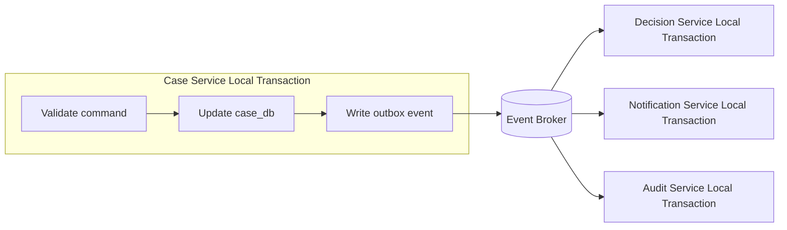
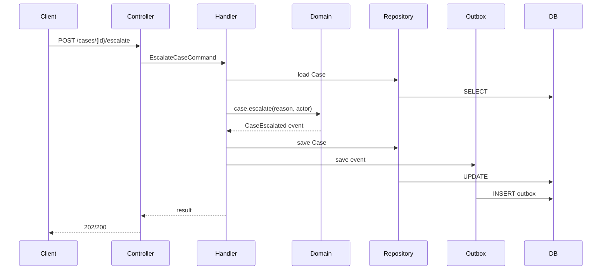
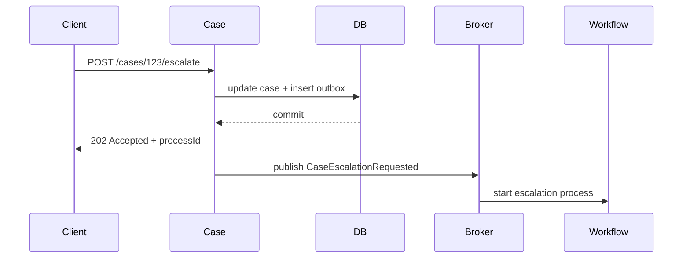
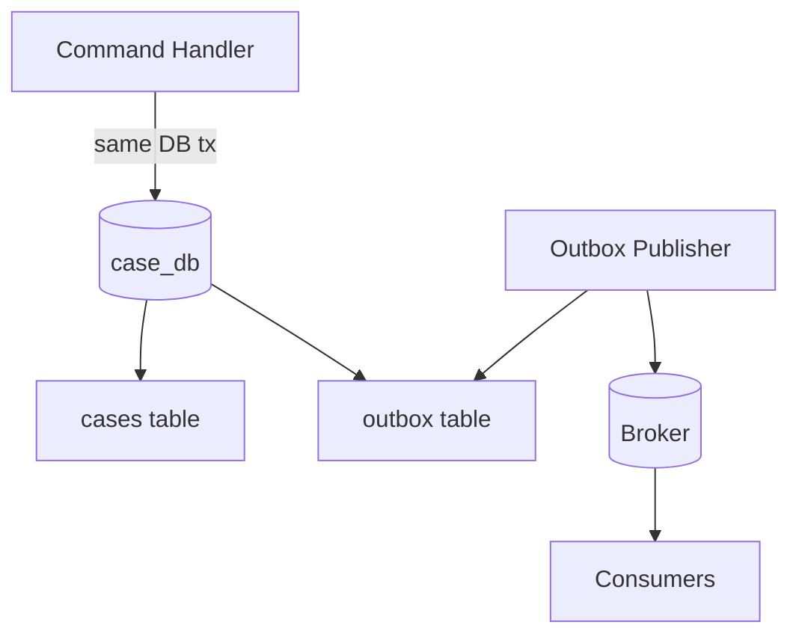
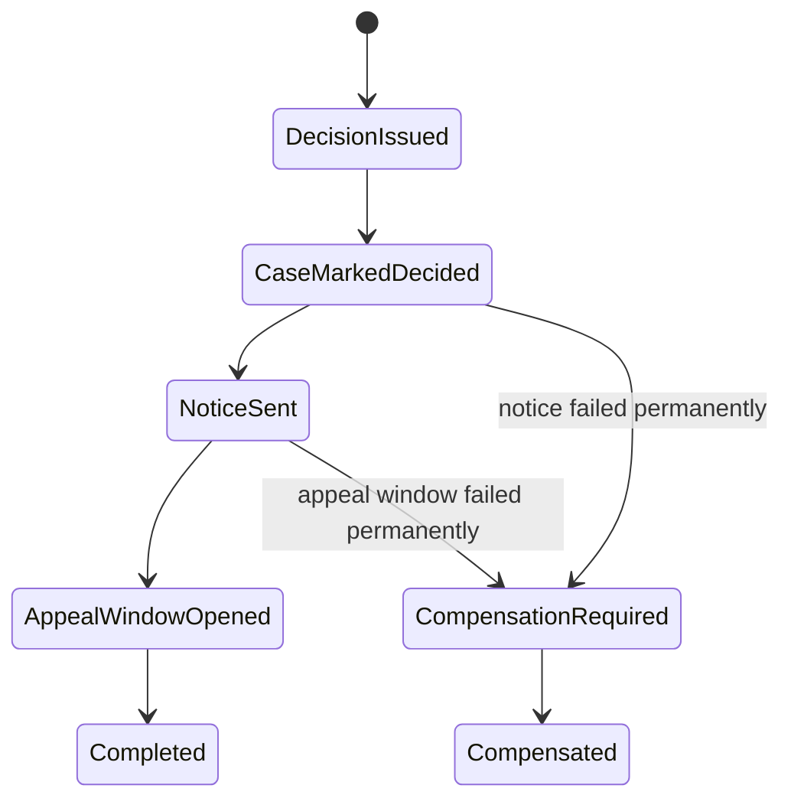

# Part 032 — Transaction Boundary Design

> Di monolith, transaksi sering berarti “satu database transaction”. Di microservices, transaksi bisnis hampir selalu lebih besar daripada satu database transaction.

Part sebelumnya membahas data ownership. Sekarang kita bahas konsekuensi langsungnya: **transaction boundary**.

Kalau setiap service memiliki data sendiri, maka satu use case bisnis bisa melewati banyak service dan banyak database. Kamu tidak bisa lagi mengandalkan satu `BEGIN; ... COMMIT;` untuk membuat seluruh dunia konsisten secara instan.

Ini bukan bug microservices. Ini sifat distributed system.

Tugas architect bukan mencari magic transaction global. Tugas architect adalah menentukan:

- state mana yang harus konsisten secara lokal,
- state mana yang boleh eventual,
- kapan command dianggap berhasil,
- kapan compensation dibutuhkan,
- apa yang terjadi saat service downstream gagal,
- bagaimana user melihat status sementara,
- dan bagaimana sistem pulih tanpa menebak.

---

## 1. Three Different Things Often Called “Transaction”

Kata “transaction” sering dipakai untuk tiga hal yang berbeda.

### 1.1 Database Transaction

Unit ACID di satu database.

```sql
BEGIN;
UPDATE cases SET status = 'ESCALATED' WHERE case_id = 'CASE-123';
INSERT INTO case_status_history (...);
COMMIT;
```

Ini domain database.

### 1.2 Application Transaction

Unit perubahan yang dilakukan satu service dalam satu command.

Contoh:

```text
EscalateCase command:
  - load Case aggregate
  - validate transition
  - change status
  - append domain event
  - save aggregate
  - save outbox event
```

Biasanya application transaction dipetakan ke satu database transaction lokal.

### 1.3 Business Transaction

End-to-end proses bisnis yang bisa melintasi banyak service.

Contoh:

```text
Escalate high-risk case:
  - update case status
  - create supervisor review task
  - notify unit head
  - update SLA dashboard
  - write audit trail
```

Ini tidak boleh dipaksa menjadi satu database transaction global kecuali kamu benar-benar menerima coupling dan availability cost-nya.

---

## 2. The Core Rule

> Dalam microservices, transaksi ACID harus berhenti di boundary data owner. Cross-service business transaction dikelola sebagai workflow/saga/process, bukan sebagai satu local database transaction yang memanggil banyak service.

Diagram:



Yang dijamin atomik:

```text
Case state update + outbox event insert
```

Yang tidak dijamin atomik oleh database yang sama:

```text
Case update + Decision update + Notification send + Audit write
```

Untuk yang kedua, kamu butuh process design.

---

## 3. Why Distributed Transactions Are Usually the Wrong Default

Distributed transaction seperti two-phase commit memberi ilusi sederhana:

```text
Either all services commit or none commit.
```

Tetapi dalam microservices, biaya tersembunyinya besar:

- participants harus available selama protocol,
- coordinator menjadi critical dependency,
- locks bisa bertahan lama,
- latency naik,
- failure recovery kompleks,
- service autonomy turun,
- database/broker heterogen sulit disatukan,
- deployment dan schema evolution lebih terikat.

Distributed transaction bisa valid di sistem tertentu. Tetapi sebagai default microservices architecture, ia sering bertentangan dengan tujuan loose coupling dan independent deployability.

Microservices lebih sering menggunakan:

- local transaction,
- outbox,
- idempotent consumer,
- saga,
- compensation,
- reconciliation,
- explicit process state.

---

## 4. Transaction Boundary in Java Service Anatomy

Dalam service Java yang sehat, boundary transaksi biasanya berada di **application service / command handler**, bukan controller, bukan repository, dan bukan domain entity.



Transaction scope:

```text
load aggregate
validate command
mutate aggregate
persist aggregate
persist outbox message
commit
```

Tidak termasuk:

```text
calling Notification Service
calling Decision Service
sending email
publishing message directly to broker without outbox guarantee
waiting for another service to complete
```

---

## 5. Spring Example: Correct Transaction Placement

```java
@Service
public class EscalateCaseHandler {

    private final CaseRepository caseRepository;
    private final OutboxRepository outboxRepository;
    private final Clock clock;

    public EscalateCaseHandler(
            CaseRepository caseRepository,
            OutboxRepository outboxRepository,
            Clock clock) {
        this.caseRepository = caseRepository;
        this.outboxRepository = outboxRepository;
        this.clock = clock;
    }

    @Transactional
    public EscalateCaseResult handle(EscalateCaseCommand command) {
        Case caze = caseRepository.getById(command.caseId());

        caze.escalate(
            command.actor(),
            command.reason(),
            command.expectedVersion(),
            clock.instant()
        );

        caseRepository.save(caze);

        caze.pullEvents().forEach(event ->
            outboxRepository.save(OutboxMessage.from(event))
        );

        return new EscalateCaseResult(caze.id(), caze.status(), caze.version());
    }
}
```

Kenapa transaksi di sini?

Karena handler tahu use case boundary:

- command dimulai,
- aggregate dimuat,
- invariant diperiksa,
- state berubah,
- event disimpan,
- hasil dikembalikan.

Controller tidak perlu tahu transaksi.

Repository tidak boleh membuka transaksi bisnis sendiri untuk setiap method secara terpisah.

Domain entity tidak tahu database.

---

## 6. Bad Example: Remote Call Inside Local Transaction

```java
@Transactional
public void issueDecision(IssueDecisionCommand command) {
    Decision decision = decisionRepository.get(command.decisionId());
    decision.issue(command.outcome());
    decisionRepository.save(decision);

    caseClient.markDecisionIssued(command.caseId(), decision.id()); // remote call inside tx

    notificationClient.notifyParties(command.caseId()); // another remote call inside tx
}
```

Masalah:

- database lock ditahan sambil menunggu network,
- remote timeout bisa menggagalkan local transaction,
- local rollback tidak membatalkan efek remote yang sudah terjadi,
- retry bisa mengulang remote side effect,
- service availability menjadi saling mengunci,
- latency transaction naik.

Lebih baik:

```java
@Transactional
public void issueDecision(IssueDecisionCommand command) {
    Decision decision = decisionRepository.get(command.decisionId());
    decision.issue(command.outcome());
    decisionRepository.save(decision);

    outboxRepository.save(OutboxMessage.from(
        new DecisionIssued(decision.id(), command.caseId(), command.outcome())
    ));
}
```

Setelah commit, publisher mengirim `DecisionIssued`. Service lain bereaksi dengan transaksi lokal masing-masing.

---

## 7. Transaction Boundary and Aggregate Boundary

Dalam DDD, aggregate adalah consistency boundary.

Artinya, command sebaiknya mengubah satu aggregate utama dalam satu transaksi. Bukan karena mustahil mengubah lebih dari satu, tetapi karena semakin banyak aggregate dalam satu transaksi, semakin besar coupling dan contention.

### 7.1 Good Local Aggregate Transaction

```text
AssignCase:
  modifies Case aggregate
  appends CaseAssigned
```

### 7.2 Acceptable Local Multi-Aggregate Transaction

Masih dalam service yang sama, kadang valid:

```text
OpenCase:
  creates Case aggregate
  creates CaseTimeline entry
  creates InitialAssignment aggregate
```

Jika semua berada dalam satu service dan satu database owner, ini bisa masih masuk akal.

Tetapi pertanyaan review:

```text
Apakah mereka satu invariant kuat?
Apakah lifecycle-nya selalu berubah bersama?
Apakah contention meningkat?
Apakah bisa dipisah dengan event?
```

### 7.3 Suspicious Transaction

```text
CloseCase:
  updates Case
  updates Decision
  updates Evidence
  updates Notification
  updates Reporting
```

Jika ini terjadi lintas service, itu bukan local transaction. Itu process/saga.

---

## 8. Transaction Boundary Decision Table

| Scenario | Recommended boundary | Why |
|---|---|---|
| Change one aggregate inside one service | local DB transaction | strong invariant, low coupling |
| Change multiple aggregates inside same service | local DB transaction if invariant truly local | same owner, same DB |
| Update state and publish event | local DB transaction with outbox | avoid dual-write |
| Call another service and update own DB | local commit + async event/command | avoid remote call in tx |
| Need cross-service business process | saga/workflow/process manager | explicit long-running state |
| Need user immediate response but work continues | accept command + process state | honest async UX |
| Need cross-service query | API composition/projection | not transaction problem |
| Need all-or-nothing across many services | challenge requirement first | likely business process, not ACID |

---

## 9. Command Success Semantics

Salah satu kesalahan desain API adalah tidak jelas kapan command dianggap berhasil.

Contoh endpoint:

```http
POST /cases/CASE-123/escalate
```

Apakah `200 OK` berarti:

1. Case status berubah lokal?
2. Supervisor task sudah dibuat?
3. Notification sudah dikirim?
4. Audit sudah tertulis?
5. Reporting dashboard sudah update?

Jika tidak didefinisikan, consumer akan membuat asumsi.

### 9.1 Define Success Contract

Contoh synchronous local success:

```text
Response 200 means Case Service accepted and committed the case status transition.
Downstream notifications and reporting updates are asynchronous.
Response includes processId if downstream workflow is tracked.
```

Contoh asynchronous process:

```text
Response 202 means escalation request was accepted.
Use GET /case-escalations/{processId} to observe process status.
```

---

## 10. 200 vs 202 Is a Transaction Design Decision

`200 OK` biasanya cocok jika command selesai dalam boundary service lokal.

`202 Accepted` cocok jika proses bisnis berlanjut async.



`202` bukan cara untuk menyembunyikan ketidakjelasan. `202` harus disertai:

- process id,
- status endpoint,
- current state,
- failure reason,
- retry/compensation semantics,
- audit trail.

---

## 11. The Dual-Write Problem

Dual-write terjadi ketika service menulis ke dua resource berbeda tanpa atomicity yang sama.

Contoh:

```java
caseRepository.save(caze);        // DB write
kafkaTemplate.send("case-events", event); // broker write
```

Apa yang terjadi jika DB commit sukses tetapi publish gagal?

Atau publish sukses tetapi DB rollback?

Solusi umum: **transactional outbox**.



Dalam transaction lokal:

```text
update business table
insert outbox message
commit
```

Di luar transaksi command:

```text
publisher reads outbox
publishes to broker
marks as published or retries
```

Outbox mengubah masalah dari “lost event” menjadi “at-least-once delivery”. Consumer harus idempotent.

---

## 12. Transaction Isolation Is a Business Decision Too

Jangan perlakukan isolation level sebagai setting teknis semata.

Isolation memengaruhi apa yang bisa dilihat user dan command lain.

Masalah umum:

- lost update,
- dirty read,
- non-repeatable read,
- phantom read,
- write skew,
- stale decision.

Dalam service Java, dua strategi umum:

### 12.1 Optimistic Locking

Cocok untuk aggregate dengan contention moderat.

```java
@Entity
@Table(name = "cases")
class JpaCaseEntity {
    @Id
    private UUID id;

    @Version
    private long version;

    private String status;
}
```

Command membawa expected version:

```java
public record EscalateCaseCommand(
    CaseId caseId,
    long expectedVersion,
    Actor actor,
    String reason
) {}
```

Jika version berubah, command ditolak sebagai conflict.

API response:

```http
409 Conflict
Content-Type: application/problem+json
```

```json
{
  "type": "https://api.acme.example/problems/concurrent-modification",
  "title": "Case was modified by another command",
  "status": 409,
  "caseId": "CASE-123",
  "expectedVersion": 7,
  "actualVersion": 8
}
```

### 12.2 Pessimistic Locking

Cocok jika contention tinggi dan conflict mahal.

Tetapi hati-hati:

- lock duration harus pendek,
- jangan call remote service saat lock dipegang,
- hindari long-running transaction,
- observability lock wait penting.

---

## 13. Idempotency and Transaction Boundary

Retry adalah fakta hidup distributed system.

Jika client tidak menerima response karena timeout, ia mungkin retry. Service harus bisa membedakan:

```text
new command
same command repeated
conflicting command with same key
```

Gunakan idempotency key untuk command yang mungkin diulang.

```java
@Transactional
public SubmitEvidenceResult handle(SubmitEvidenceCommand command) {
    idempotencyStore.checkOrStart(
        command.idempotencyKey(),
        command.fingerprint()
    );

    Evidence evidence = Evidence.submit(...);
    evidenceRepository.save(evidence);
    outboxRepository.save(OutboxMessage.from(evidence.submittedEvent()));

    idempotencyStore.complete(
        command.idempotencyKey(),
        SubmitEvidenceResult.from(evidence)
    );

    return SubmitEvidenceResult.from(evidence);
}
```

Idempotency record harus berada dalam transaction boundary yang sama dengan business update, atau kamu membuat race condition baru.

---

## 14. Transaction Boundary and Domain Events

Domain event dibuat saat domain berubah. Tetapi publishing event ke broker sebaiknya tidak dilakukan langsung dari domain entity.

Bad:

```java
public class Case {
    public void close(...) {
        this.status = CLOSED;
        kafkaTemplate.send("case-events", new CaseClosed(...)); // bad
    }
}
```

Domain sekarang tahu infrastructure dan network.

Better:

```java
public class Case {
    private final List<DomainEvent> events = new ArrayList<>();

    public void close(Actor actor, String reason, Instant now) {
        requireCanClose();
        this.status = CaseStatus.CLOSED;
        this.closedAt = now;
        this.events.add(new CaseClosed(this.id, actor.id(), reason, now));
    }

    public List<DomainEvent> pullEvents() {
        List<DomainEvent> copy = List.copyOf(events);
        events.clear();
        return copy;
    }
}
```

Application handler menyimpan event ke outbox dalam transaction.

---

## 15. Local Transaction with Outbox: Full Example

```java
@Service
public class CloseCaseHandler {

    private final CaseRepository caseRepository;
    private final OutboxRepository outboxRepository;
    private final IdempotencyRepository idempotencyRepository;
    private final Clock clock;

    @Transactional
    public CloseCaseResponse handle(CloseCaseCommand command) {
        IdempotencyRecord existing = idempotencyRepository.find(command.idempotencyKey());
        if (existing != null) {
            return existing.replayAs(CloseCaseResponse.class);
        }

        Case caze = caseRepository.getById(command.caseId());

        caze.close(
            command.actor(),
            command.reason(),
            command.expectedVersion(),
            clock.instant()
        );

        caseRepository.save(caze);

        for (DomainEvent event : caze.pullEvents()) {
            outboxRepository.save(OutboxMessage.from(event));
        }

        CloseCaseResponse response = new CloseCaseResponse(
            caze.id().value(),
            caze.status().name(),
            caze.version()
        );

        idempotencyRepository.saveCompleted(
            command.idempotencyKey(),
            command.fingerprint(),
            response
        );

        return response;
    }
}
```

Transaction menjamin:

```text
case update + outbox + idempotency completion
```

Jika transaction rollback, semuanya rollback.

Jika publish ke broker gagal setelah commit, outbox masih menyimpan event.

---

## 16. Cross-Service Business Transaction as Saga

Contoh business transaction:

```text
Issue enforcement decision:
  1. Decision Service issues decision.
  2. Case Service marks case as decided.
  3. Notification Service sends notice.
  4. Appeal Service opens appeal window.
  5. Audit Service records evidence.
```

Ini tidak boleh diperlakukan sebagai satu method `@Transactional`.

Gunakan saga/workflow:



Setiap step punya local transaction.

Jika step gagal:

- retry jika transient,
- compensate jika business rollback valid,
- escalate manual jika butuh human decision,
- mark failed jika proses tidak bisa selesai.

---

## 17. Compensation Is Not Database Rollback

Compensation bukan `ROLLBACK`.

Rollback database mengembalikan state seolah perubahan tidak terjadi.

Compensation adalah aksi bisnis baru yang memperbaiki efek sebelumnya.

Contoh:

```text
Decision issued incorrectly.
```

Kamu mungkin tidak boleh menghapus decision karena audit/regulatory requirement. Yang benar:

```text
DecisionSuperseded
CorrectionIssued
NoticeOfCorrectionSent
AuditRecordAppended
```

Dalam domain regulated, compensation sering berupa **reversal, supersession, correction, cancellation, or manual review**, bukan delete.

---

## 18. Transaction Boundary and User Experience

Transaction design memengaruhi UX.

Jika proses async, UI tidak boleh pura-pura selesai.

Bad UX:

```text
User clicks Escalate.
UI says “Escalated successfully.”
But supervisor task creation fails later.
```

Better UX:

```text
User clicks Escalate.
UI says “Escalation submitted.”
Status: Updating supervisor review task.
Then: Escalation completed.
Or: Escalation needs manual attention.
```

Microservices architecture yang baik sering membutuhkan explicit process state yang terlihat oleh user/operator.

---

## 19. Transaction Boundary Patterns

### 19.1 Single Aggregate Command

```text
Command -> aggregate -> DB commit -> outbox
```

Use for:

- status transition,
- assignment,
- metadata update,
- local invariant enforcement.

### 19.2 Local Multi-Aggregate Command

```text
Command -> aggregate A + aggregate B -> same DB commit
```

Use cautiously when same service owns both.

### 19.3 Async Command Handoff

```text
POST command -> store request -> return 202 -> worker/process continues
```

Use for:

- long-running operations,
- expensive validation,
- downstream dependencies,
- human workflow.

### 19.4 Saga Orchestration

Central process manager tells services what to do.

Use when:

- sequence matters,
- compensation matters,
- visibility matters,
- human/manual state matters.

### 19.5 Saga Choreography

Services react to events without central coordinator.

Use when:

- flow simple,
- low branching,
- event semantics stable,
- teams can handle emergent behavior.

### 19.6 Reservation Pattern

Reserve resource locally, confirm later.

Example:

```text
Reserve review slot
Confirm assignment
Release reservation if process fails
```

Good for scarce resource coordination.

### 19.7 Escrow / Quota Pattern

Allocate capacity chunks to avoid global lock.

Example:

```text
Each region gets enforcement quota allocation.
Local service consumes local quota.
Central service replenishes periodically.
```

Useful in high-scale systems, but adds complexity.

---

## 20. Transaction Boundary Anti-Patterns

### 20.1 `@Transactional` on Controller

```java
@RestController
class CaseController {
    @Transactional
    @PostMapping("/cases/{id}/close")
    ResponseEntity<?> close(...) { ... }
}
```

Controller is transport boundary, not use-case boundary.

### 20.2 Transaction Spans Remote Calls

Already covered: avoid.

### 20.3 Repository Opens Independent Transactions

```java
@Transactional
public void saveCase(...) { ... }

@Transactional
public void saveAudit(...) { ... }
```

If called from command handler without outer transaction, partial commit can occur.

### 20.4 Publish Event Before Commit

Consumer sees event for state that later rolls back.

### 20.5 Publish Event After Commit Without Outbox

State commits, event lost.

### 20.6 Long-Running DB Transaction

User waits, remote calls happen, locks remain.

### 20.7 Hidden Autocommit

Multiple repository operations each commit independently.

### 20.8 Global Distributed Lock

A distributed lock used to fake a transaction across services often becomes bottleneck and failure source.

### 20.9 Compensation by Delete

Deleting history in regulated domain destroys evidence.

### 20.10 Treating Eventual Consistency as “No Consistency”

Eventual consistency still needs rules, detection, and repair.

---

## 21. Observability for Transactions

Every command transaction should be observable.

Minimum fields:

```text
commandId
idempotencyKey
correlationId
actorId
aggregateId
aggregateVersionBefore
aggregateVersionAfter
transactionOutcome
outboxMessageCount
latencyMs
failureReason
```

For async process:

```text
processId
currentStep
stepStartedAt
stepAttempt
lastError
nextRetryAt
compensationStatus
manualInterventionRequired
```

Logs without transaction identifiers are weak evidence.

---

## 22. Failure Handling Matrix

| Failure | Example | Desired handling |
|---|---|---|
| validation failure | invalid status transition | reject command, no transaction side effect |
| optimistic conflict | version mismatch | 409 conflict, client refresh/retry intentionally |
| DB transient failure | connection timeout | retry at safe layer if command idempotent |
| DB commit unknown | timeout during commit | reconcile by idempotency key / command id |
| outbox publish failure | broker unavailable | retry publisher, business state committed |
| consumer duplicate | same event delivered twice | inbox/idempotent consumer |
| downstream business failure | cannot create appeal window | compensate/escalate process |
| projection lag | dashboard stale | show lag, repair projection |

---

## 23. Transaction Boundary Review Questions

For every command, ask:

```text
What state changes in the local transaction?
Which service owns each state?
Does this command call remote services?
If yes, why can’t it be async?
What happens if remote service succeeds but local transaction rolls back?
What happens if local commit succeeds but event publish fails?
Is there an outbox?
Is the command idempotent?
What is the expected version/conflict model?
What response means success?
What is visible to the user while downstream work continues?
What compensating action exists?
What audit record proves the command outcome?
```

If the team cannot answer these, the design is not production-ready.

---

## 24. ADR Template for Transaction Boundary

```md
# ADR: Transaction Boundary for Issue Decision

## Context
Issuing a decision affects Decision, Case lifecycle, Notification, Appeal Window, and Audit.

## Decision
Decision Service owns the local transaction that issues Decision.
It writes Decision state and DecisionIssued outbox event atomically.
Case, Notification, Appeal, and Audit react asynchronously through saga orchestration.

## Local Transaction
- load Decision aggregate
- validate required assessment snapshot
- mark decision issued
- persist decision
- persist DecisionIssued outbox event

## Success Semantics
POST /decisions/{id}/issue returns 202 Accepted with processId.
It means DecisionIssued was committed locally and process started.
It does not mean notice was sent or appeal window opened.

## Consistency Model
- Decision status is strongly consistent within Decision Service.
- Case decided status is eventually consistent.
- Notification is eventually completed or escalated.
- Appeal window opening is tracked by process state.

## Failure Handling
- transient downstream failures retried with backoff
- permanent notification failure escalates to operations
- appeal window failure blocks process completion
- correction requires DecisionSuperseded, not delete

## Consequences
- no distributed transaction
- consumers must observe process status
- projection may be stale
- audit reconstruction uses event chain
```

---

## 25. Java Transaction Implementation Checklist

- `@Transactional` is on application service / command handler.
- Controller does not own transaction.
- Repository does not independently commit use-case fragments.
- No remote HTTP/gRPC call inside DB transaction.
- No broker publish as substitute for outbox.
- Business state and outbox write are atomic.
- Command idempotency is stored transactionally.
- Aggregate has version for optimistic concurrency.
- Conflict maps to clear API error.
- Domain event does not depend on infrastructure.
- Consumer handlers are idempotent.
- Async workflow has explicit process state.
- Compensation is business action, not delete by default.
- Logs include command/correlation/aggregate IDs.

---

## 26. Design Exercise

Design transaction boundary for this use case:

```text
A supervisor approves escalation of a high-risk case.
The system must:
1. mark the case as escalated,
2. create a review task,
3. notify the enforcement unit head,
4. update the case workbench dashboard,
5. append audit evidence,
6. start a 3-day SLA timer.
```

Answer:

1. Which service owns the initial command?
2. Which state changes are inside the first local transaction?
3. What event is written to outbox?
4. Which downstream steps are async?
5. Is response `200` or `202`?
6. What process state is visible to user?
7. What happens if notification fails?
8. What happens if review task creation fails?
9. What is the compensation?
10. What audit trail proves the sequence?

Suggested structure:

```text
Local transaction:
  - Case.status: UNDER_ESCALATION or ESCALATED?
  - Case.escalationReason
  - Case.version
  - Outbox: CaseEscalationApproved

Async process:
  - ReviewTaskCreated
  - UnitHeadNotified
  - SlaTimerStarted
  - AuditEvidenceAppended
  - WorkbenchProjectionUpdated
```

The hardest decision is whether case becomes `ESCALATED` immediately or `ESCALATION_IN_PROGRESS` until downstream setup completes. That is not a coding question. It is a business semantics question.

---

## 27. Key Takeaways

Transaction boundary design is where microservices become real.

The main rule:

```text
Use local ACID transactions for data owned by one service.
Use process/saga/workflow for business transactions that cross services.
```

A production-grade Java microservice should make transaction semantics explicit:

- where transaction starts,
- what it includes,
- what it excludes,
- what success means,
- how events are safely published,
- how retries are made safe,
- how conflicts are detected,
- how downstream failures are handled,
- and how operators reconstruct what happened.

Do not hide distributed complexity behind `@Transactional`.

Name the boundary. Design the process. Make failure visible.

---

## References

- AWS Prescriptive Guidance — Saga pattern.
- AWS Prescriptive Guidance — Saga choreography pattern.
- Microsoft Azure Architecture Center — Compensating Transaction pattern.
- microservices.io — Database per Service pattern.
- microservices.io — Saga pattern.
- Martin Fowler — Microservices: Decentralized Data Management and Design for Failure.
