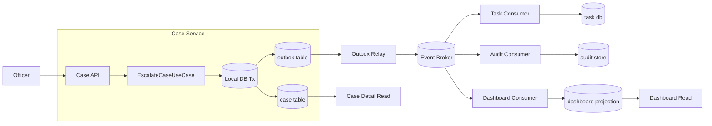
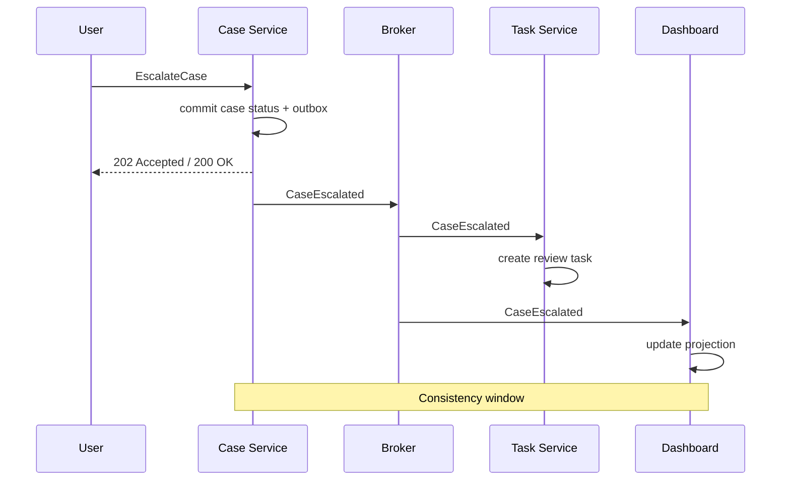
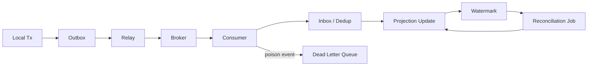

# Part 033 — Eventual Consistency With Business Meaning

> Eventual consistency bukan izin untuk membuat data “nanti juga benar sendiri”. Eventual consistency adalah kontrak bisnis tentang **kapan sistem boleh terlihat belum sinkron**, **berapa lama**, **di permukaan mana**, dan **mekanisme apa yang memastikan konvergensi**.

Part sebelumnya membahas transaction boundary. Kesimpulannya: transaksi ACID harus berhenti di data owner. Begitu proses bisnis melintasi service boundary, kamu tidak lagi punya satu transaksi global.

Konsekuensinya: banyak state di sistem microservices akan menjadi **eventually consistent**.

Masalahnya, banyak tim memperlakukan eventual consistency sebagai kalimat abstrak:

```text
Data may be eventually consistent.
```

Itu bukan desain. Itu disclaimer.

Desain yang benar harus menjawab:

- state mana yang authoritative,
- state mana yang derivative,
- update mana yang harus langsung terlihat oleh user,
- update mana yang boleh terlambat,
- seberapa lama keterlambatan boleh terjadi,
- apa yang user lihat selama sinkronisasi,
- apa yang terjadi saat event hilang, duplicate, out-of-order, atau stuck,
- bagaimana sistem mendeteksi dan memperbaiki divergence,
- dan invariant mana yang tidak boleh dilanggar meskipun sistem belum konsisten penuh.

---

## 1. Mental Model: Consistency Is a User Contract

Di microservices, consistency bukan hanya properti database. Consistency adalah **kontrak pengalaman dan risiko bisnis**.

Contoh regulatory case-management:

```text
User escalates case CASE-123 to supervisor review.
```

Setelah command berhasil:

- Case Service sudah menyimpan status `ESCALATED`.
- Task Service mungkin belum membuat review task.
- Notification Service mungkin belum mengirim notifikasi.
- Reporting Service mungkin belum memperbarui dashboard.
- Audit Service mungkin belum menampilkan event di read model audit.

Secara teknis, ini normal.

Secara bisnis, pertanyaannya:

```text
Apakah user boleh melihat case sudah escalated, tapi task belum muncul?
Apakah supervisor boleh belum menerima notifikasi selama 30 detik?
Apakah dashboard boleh tertinggal 5 menit?
Apakah audit evidence boleh tertinggal?
```

Jawaban tiap domain berbeda. Karena itu eventual consistency harus diberi **makna bisnis**, bukan hanya disebut sebagai technical pattern.

---

## 2. Jangan Mengatakan “Eventually Consistent” Tanpa Window

Kalimat ini lemah:

```text
The dashboard is eventually consistent.
```

Kalimat ini lebih arsitektural:

```text
The operational dashboard may lag behind authoritative case state by up to 60 seconds under normal load and 5 minutes during incident mode. The dashboard exposes its projection watermark and must not be used as legal evidence. Legal audit views are reconciled every 10 minutes and marked incomplete until projection catches up.
```

Perbedaannya besar.

Yang pertama tidak bisa diuji.

Yang kedua bisa diuji, dimonitor, dan dipakai untuk membuat keputusan.

---

## 3. Taxonomy of Consistency You Actually Need

Kamu tidak perlu membawa semua teori konsistensi akademik ke meeting arsitektur. Tapi kamu harus punya kosakata yang cukup tajam.

### 3.1 Strong Local Consistency

State konsisten di dalam satu service owner setelah commit lokal.

Contoh:

```text
Case status and case status history must be committed atomically inside Case Service.
```

Ini domain local ACID.

### 3.2 Cross-Service Eventual Consistency

Service lain akan mengejar perubahan melalui event, outbox, polling, atau workflow.

Contoh:

```text
Case dashboard eventually reflects CaseEscalated event.
```

### 3.3 Read-Your-Writes

Setelah user melakukan write, user yang sama harus bisa melihat hasil write tersebut.

Contoh:

```text
After officer escalates a case, the case detail page must show ESCALATED immediately.
```

Ini tidak selalu berarti semua read model global sudah update. Bisa dicapai dengan membaca dari owner service untuk detail page, atau membawa version token.

### 3.4 Monotonic Reads

User tidak boleh melihat state mundur.

Contoh buruk:

```text
10:00: user sees CASE-123 = ESCALATED
10:01: user refreshes and sees CASE-123 = UNDER_REVIEW
```

Jika `UNDER_REVIEW` adalah state lama, ini merusak trust.

### 3.5 Bounded Staleness

Data boleh stale, tetapi dalam batas waktu yang jelas.

Contoh:

```text
Supervisor workload count may be stale up to 2 minutes.
```

### 3.6 Convergent Consistency

Jika tidak ada update baru, semua replica/projection akhirnya menuju state yang sama.

Ini membutuhkan:

- event yang durable,
- consumer yang idempotent,
- retry policy,
- dead-letter handling,
- reconciliation,
- dan observability atas lag.

### 3.7 Explicit Inconsistency State

Kadang sistem tahu bahwa state belum bisa dipastikan.

Contoh:

```text
Case risk status: PENDING_RECALCULATION
```

Ini lebih baik daripada menampilkan risk score lama seolah-olah benar.

---

## 4. State Classification Before Consistency Decision

Sebelum menentukan consistency model, klasifikasikan state.

| State Type | Meaning | Example | Typical Consistency |
|---|---|---|---|
| Authoritative state | Source of truth | Case status in Case Service | Strong local |
| Derived operational state | Dibangun dari event/source lain | Supervisor workload view | Bounded stale |
| Workflow state | Progress proses lintas service | Escalation saga status | Strong inside orchestrator, eventual externally |
| Notification state | Delivery side effect | Email/SMS sent marker | Eventual, retry-safe |
| Audit evidence | Bukti tindakan/keputusan | CaseEscalated audit event | Durable, append-only, reconciled |
| Analytics state | Agregasi untuk insight | Monthly enforcement statistics | Eventually consistent, batch/recompute |
| Search index | Query convenience | Case search document | Eventually consistent, rebuildable |

Kesalahan umum: memperlakukan semua state seperti authoritative state.

Akibatnya:

- semua service ingin membaca database owner,
- read model dianggap source of truth,
- dashboard dijadikan dasar keputusan legal,
- search index dianggap selalu akurat,
- dan eventual consistency berubah menjadi bug operasional.

---

## 5. Consistency Decision Card

Setiap state lintas service harus punya kartu keputusan seperti ini:

```yaml
state: supervisor_case_queue
owner: task-service
source_of_truth:
  service: task-service
  table: review_task
inputs:
  - CaseEscalated from case-service
  - ReviewTaskAssigned from task-service
consumers:
  - supervisor-ui
  - operations-dashboard
consistency_model: bounded_staleness
normal_lag_target: 10s
maximum_acceptable_lag: 60s
user_visible_behavior_when_lagging:
  - show projection watermark
  - show "syncing" badge when event lag > 10s
not_allowed:
  - use this view as legal audit evidence
reconciliation:
  frequency: every_5_minutes
  source: task-service authoritative table
failure_behavior:
  event_duplicate: ignore_by_event_id
  event_out_of_order: ignore_old_version
  event_missing: detect_by_reconciliation
alerts:
  - projection_lag_seconds > 60 for 5m
  - dead_letter_count > 0
```

Kartu seperti ini membuat eventual consistency bisa dioperasikan.

---

## 6. Diagram: Authoritative Write and Eventual Projections



Interpretasi:

- Case detail sebaiknya membaca dari Case Service agar user melihat write-nya sendiri.
- Dashboard boleh membaca projection, tetapi harus punya staleness contract.
- Audit consumer harus durable dan reconciled karena berhubungan dengan evidence.

---

## 7. Business Consistency Windows

Consistency window adalah selang waktu antara:

```text
authoritative state berubah
```

hingga:

```text
semua dependent view/process yang relevan ikut konsisten
```

Diagram:



Jangan hanya ukur technical lag. Ukur business impact.

| Use Case | Normal Window | Max Window | User Impact | Risk |
|---|---:|---:|---|---|
| Case detail status | immediate | immediate | user must see own write | high |
| Supervisor task creation | 5s | 60s | supervisor may wait | medium |
| Dashboard count | 30s | 5m | approximate workload | low-medium |
| Legal audit evidence view | 10s | 2m | evidence completeness | high |
| Monthly analytics | hours | 24h | reporting delay | low |

---

## 8. User-Visible State Matters

Eventual consistency gagal bukan hanya karena data belum sinkron. Ia gagal karena UI/API berpura-pura sinkron.

### 8.1 Bad UX

```text
Escalate case -> success toast
Supervisor queue -> task not found
Dashboard -> still old count
Audit view -> no event
```

User berpikir sistem rusak.

### 8.2 Better UX

```text
Escalate case -> "Case escalated. Supervisor task is being created."
Case detail -> status ESCALATED, task status PENDING_CREATION
Supervisor queue -> may show "syncing"
Audit view -> shows command accepted and event projection watermark
```

### 8.3 Domain State Instead of Technical Spinner

Jangan hanya pakai loading spinner. Gunakan state domain:

```text
PENDING_SUPERVISOR_TASK
ESCALATED_AWAITING_ASSIGNMENT
AUDIT_PROJECTION_PENDING
RECONCILIATION_REQUIRED
```

State seperti ini bisa diaudit, diuji, dan dijelaskan ke business owner.

---

## 9. Read-Your-Writes Pattern

Masalah umum:

```text
User writes to owner service.
UI refreshes dashboard projection.
Projection belum update.
User melihat data lama.
```

Solusi:

### Option A — Read Detail from Owner

Untuk detail page setelah write, baca dari service owner.

```text
POST /cases/{id}/escalations
GET  /cases/{id}
```

Jangan redirect ke stale projection jika user baru saja melakukan write.

### Option B — Return Authoritative Snapshot

Command response mengembalikan state authoritative minimal.

```json
{
  "caseId": "CASE-123",
  "status": "ESCALATED",
  "version": 17,
  "supervisorTask": {
    "status": "PENDING_CREATION"
  }
}
```

### Option C — Version Token / Consistency Token

Command response membawa token:

```json
{
  "caseId": "CASE-123",
  "caseVersion": 17,
  "eventSequence": 99128
}
```

Read model bisa diberi parameter:

```http
GET /case-dashboard/CASE-123?waitUntilEventSequence=99128
```

Jika projection belum mencapai sequence tersebut, API bisa:

- menunggu sebentar,
- mengembalikan `202 Projection Not Ready`,
- atau mengembalikan stale data dengan watermark.

---

## 10. Projection Watermark

Projection yang eventual harus punya watermark.

Contoh response:

```json
{
  "items": [
    {
      "caseId": "CASE-123",
      "status": "ESCALATED"
    }
  ],
  "projection": {
    "source": "case-events",
    "lastProcessedEventSequence": 99128,
    "lastProcessedAt": "2026-07-05T10:15:23Z",
    "lagSeconds": 7,
    "isStale": false
  }
}
```

Watermark mengubah “mungkin stale” menjadi fakta operasional.

Tanpa watermark, kamu hanya bisa debat.

Dengan watermark, kamu bisa membuat:

- alert,
- SLO,
- UI badge,
- diagnostic runbook,
- dan audit explanation.

---

## 11. Eventual Consistency Requires Durable Convergence

Eventual consistency bukan sekadar publish event.

Agar benar-benar konvergen, kamu perlu pipeline seperti ini:



Minimal guarantees yang harus kamu desain:

1. Event tidak hilang setelah local commit.
2. Event bisa dipublish ulang tanpa merusak consumer.
3. Consumer bisa menerima duplicate.
4. Consumer bisa menerima event out-of-order.
5. Projection bisa dibangun ulang.
6. Divergence bisa dideteksi.
7. Poison message tidak menghentikan seluruh stream.

---

## 12. Idempotent Consumer as Consistency Primitive

Consumer harus idempotent.

Bukan optional.

Contoh tabel inbox:

```sql
CREATE TABLE processed_event (
  consumer_name varchar(100) NOT NULL,
  event_id uuid NOT NULL,
  processed_at timestamptz NOT NULL DEFAULT now(),
  PRIMARY KEY (consumer_name, event_id)
);
```

Java sketch:

```java
public final class CaseEscalatedProjectionHandler {
    private final ProcessedEventRepository processedEvents;
    private final CaseDashboardProjectionRepository projectionRepository;

    public void handle(IntegrationEvent<CaseEscalatedPayload> event) {
        String consumer = "case-dashboard-projection";

        if (processedEvents.alreadyProcessed(consumer, event.eventId())) {
            return;
        }

        CaseEscalatedPayload payload = event.payload();

        projectionRepository.upsertEscalatedCase(
            payload.caseId(),
            payload.caseVersion(),
            payload.escalatedAt(),
            event.sequence()
        );

        processedEvents.markProcessed(consumer, event.eventId());
    }
}
```

Tapi ini belum cukup jika event out-of-order. Kamu juga perlu version guard.

```java
public void upsertEscalatedCase(
    CaseId caseId,
    long sourceVersion,
    Instant escalatedAt,
    long sourceSequence
) {
    CaseProjection current = repository.find(caseId);

    if (current != null && current.sourceVersion() >= sourceVersion) {
        return; // stale event; ignore safely
    }

    repository.save(new CaseProjection(
        caseId,
        "ESCALATED",
        sourceVersion,
        escalatedAt,
        sourceSequence
    ));
}
```

Idempotency tanpa ordering/version check masih bisa salah.

---

## 13. Ordering: Design for Less Ordering Than You Want

Distributed systems jarang memberi ordering global yang murah.

Yang biasanya masuk akal:

- ordering per aggregate,
- ordering per partition key,
- atau no ordering with version guard.

Untuk case-management:

```text
Partition key: caseId
```

Ini membantu agar event untuk `CASE-123` diproses berurutan di satu partition.

Tapi jangan bergantung buta pada ordering. Tetap simpan:

- aggregate version,
- event sequence,
- event time,
- occurredAt,
- producedAt,
- processedAt.

Karena real system tetap bisa mengalami:

- replay,
- reprocessing,
- compaction,
- migration,
- manual repair,
- cross-topic ordering issue.

---

## 14. Local Invariant vs Cross-Service Invariant

Ini inti desain.

### 14.1 Local Invariant

Invariant yang harus selalu benar di dalam satu service.

Contoh:

```text
A closed case cannot be escalated.
```

Letakkan di Case aggregate.

```java
public void escalate(OfficerId officerId, Instant now) {
    if (status == CaseStatus.CLOSED) {
        throw new DomainRuleViolation("Closed case cannot be escalated");
    }
    this.status = CaseStatus.ESCALATED;
    this.version++;
    this.record(new CaseEscalated(caseId, version, officerId, now));
}
```

### 14.2 Cross-Service Invariant

Invariant yang melibatkan beberapa service.

Contoh:

```text
A high-risk escalated case must have an active supervisor review task.
```

Jangan memaksanya dengan direct DB join lintas service. Pilihan desain:

1. Buat task creation bagian dari saga/workflow.
2. Buat state sementara `ESCALATED_AWAITING_REVIEW_TASK`.
3. Buat reconciliation job yang mencari escalated case tanpa task.
4. Buat alert jika task belum dibuat melewati SLA.
5. Buat compensation/escalation manual jika task creation terus gagal.

Cross-service invariant butuh process, bukan hanya constraint database.

---

## 15. Consistency Pattern Menu

### 15.1 Owner Read

Untuk state authoritative, baca dari owner.

Cocok untuk:

- detail page,
- command confirmation,
- decision screen,
- audit-sensitive view.

### 15.2 Projection

Untuk query cepat atau agregasi.

Cocok untuk:

- dashboard,
- search,
- supervisor queue,
- reporting.

### 15.3 Reservation / Hold

Untuk mencegah konflik lintas service tanpa distributed lock global.

Contoh:

```text
Reserve case for supervisor assignment before final assignment.
```

### 15.4 Saga / Workflow

Untuk business transaction lintas service.

Cocok jika ada:

- multiple local transaction,
- compensation,
- timeout,
- human step,
- explicit progress state.

### 15.5 Reconciliation

Untuk memperbaiki divergence.

Contoh:

```text
Every 5 minutes, compare escalated cases with active review tasks.
```

### 15.6 Rebuildable Read Model

Projection harus bisa dihapus dan dibangun ulang dari source/events.

Kalau tidak bisa rebuild, ia bukan projection sederhana; ia sudah menjadi state owner baru.

---

## 16. Java Implementation: Command with Outbox

Contoh sederhana:

```java
public final class EscalateCaseUseCase {
    private final CaseRepository cases;
    private final OutboxRepository outbox;
    private final Clock clock;

    @Transactional
    public EscalateCaseResult handle(EscalateCaseCommand command) {
        Case caze = cases.getById(command.caseId());

        caze.escalate(command.officerId(), clock.instant());

        cases.save(caze);

        for (DomainEvent event : caze.pullDomainEvents()) {
            outbox.append(OutboxMessage.fromDomainEvent(event));
        }

        return new EscalateCaseResult(
            caze.id(),
            caze.status(),
            caze.version(),
            "SUPERVISOR_TASK_PENDING"
        );
    }
}
```

Catatan penting:

- local state update dan outbox insert berada dalam satu DB transaction,
- response tidak berpura-pura semua downstream selesai,
- response memberi domain state sementara,
- event akan diproses downstream secara eventual.

---

## 17. Java Implementation: Projection with Version Guard

```java
public final class SupervisorQueueProjectionHandler {
    private final ProcessedEventRepository inbox;
    private final SupervisorQueueRepository queue;

    @Transactional
    public void on(CaseEscalated event) {
        String consumer = "supervisor-queue";

        if (!inbox.tryMarkProcessing(consumer, event.eventId())) {
            return;
        }

        queue.upsertIfNewer(
            event.caseId(),
            event.caseVersion(),
            new SupervisorQueueItem(
                event.caseId(),
                event.riskLevel(),
                "AWAITING_ASSIGNMENT",
                event.occurredAt()
            )
        );

        inbox.markProcessed(consumer, event.eventId());
    }
}
```

Repository rule:

```java
public void upsertIfNewer(CaseId caseId, long sourceVersion, SupervisorQueueItem item) {
    jdbc.update("""
        INSERT INTO supervisor_queue(case_id, source_version, status, risk_level, occurred_at)
        VALUES (?, ?, ?, ?, ?)
        ON CONFLICT (case_id)
        DO UPDATE SET
          source_version = EXCLUDED.source_version,
          status = EXCLUDED.status,
          risk_level = EXCLUDED.risk_level,
          occurred_at = EXCLUDED.occurred_at
        WHERE supervisor_queue.source_version < EXCLUDED.source_version
        """,
        caseId.value(),
        sourceVersion,
        item.status(),
        item.riskLevel(),
        item.occurredAt()
    );
}
```

Ini mencegah event lama menimpa event baru.

---

## 18. Reconciliation Is Not Optional for Critical Flows

Eventual consistency tanpa reconciliation berarti kamu berharap semua event selalu benar.

Itu bukan engineering.

Contoh reconciliation:

```text
Find escalated cases without review tasks after 60 seconds.
```

Pseudo query:

```sql
SELECT c.case_id
FROM case_read_authority c
LEFT JOIN review_task_read_model t ON t.case_id = c.case_id
WHERE c.status = 'ESCALATED'
  AND c.escalated_at < now() - interval '60 seconds'
  AND t.task_id IS NULL;
```

Dalam arsitektur microservices, query reconciliation lintas owner tidak selalu boleh direct SQL. Pilihan:

- service owner menyediakan reconciliation export,
- read model khusus reconciliation,
- periodic snapshot event,
- workflow engine menyimpan progress,
- atau data platform operational mirror.

Yang penting: divergence bisa ditemukan.

---

## 19. Dead Letter Queue Is a Diagnostic Surface

DLQ bukan tempat sampah.

DLQ adalah sinyal bahwa convergence berhenti untuk sebagian data.

Untuk setiap DLQ item, simpan:

- event id,
- event type,
- aggregate id,
- source version,
- consumer name,
- failure reason,
- first failure time,
- last failure time,
- retry count,
- payload hash,
- correlation id.

Runbook harus menjawab:

```text
Can this event be replayed safely?
Should it be skipped?
Does it require data repair?
Does consumer code need patching?
Is downstream schema incompatible?
```

Kalau DLQ tidak punya owner, eventual consistency tidak punya owner.

---

## 20. Consistency and Legal/Audit Domains

Untuk domain regulated, jangan menyamakan audit dengan dashboard.

Audit evidence perlu:

- append-only event,
- durable persistence,
- correlation id,
- actor identity,
- command intent,
- decision basis,
- before/after material facts jika relevan,
- event time dan record time,
- replay/reconciliation status.

Kalau audit projection tertinggal, tampilkan status:

```text
Audit projection incomplete after event sequence 99128.
```

Jangan tampilkan audit log kosong seolah-olah tidak ada aksi.

---

## 21. Smells

### 21.1 “Eventually Consistent” Without SLA

Kalau tidak ada lag target, itu bukan desain.

### 21.2 Projection Used as Source of Truth

Search index, dashboard, dan report mulai dipakai untuk keputusan authoritative.

### 21.3 No Watermark

Tidak ada yang tahu projection tertinggal berapa jauh.

### 21.4 No Idempotency

Duplicate event menciptakan duplicate task, duplicate notification, atau double count.

### 21.5 No Reconciliation

Sistem hanya berharap message broker sempurna.

### 21.6 UI Hides Pending State

User diberi success seolah semua side effect sudah selesai.

### 21.7 Global Ordering Assumption

Design bergantung pada urutan event lintas aggregate/service.

### 21.8 Compensation by Deleting Data

Tim menghapus row untuk “membatalkan” proses yang sebenarnya butuh domain compensation/audit trail.

---

## 22. Architecture Review Questions

Gunakan pertanyaan ini saat review desain:

1. State mana yang authoritative?
2. Service mana yang boleh menulis state tersebut?
3. View mana yang derivative?
4. Berapa normal lag dan maximum lag?
5. Apakah user perlu read-your-writes?
6. Apakah user bisa melihat state mundur?
7. Apakah projection punya watermark?
8. Apakah consumer idempotent?
9. Apakah event out-of-order aman?
10. Apakah duplicate event aman?
11. Apa yang terjadi saat consumer gagal 1 jam?
12. Bagaimana divergence dideteksi?
13. Siapa owner DLQ?
14. Apakah audit menggunakan projection yang bisa stale?
15. Apakah ada state domain untuk pending/incomplete?

---

## 23. Practical Exercise

Ambil use case:

```text
Officer submits new evidence for an active enforcement case.
```

Buat consistency decision:

- Evidence Service sebagai owner metadata evidence.
- Object Storage sebagai owner binary object.
- Case Service perlu menampilkan evidence count.
- Audit Service perlu evidence-submitted event.
- Search Service perlu indexing.
- Notification Service memberi tahu case owner.

Jawab:

1. Apa state authoritative?
2. Apa state derivative?
3. Mana yang harus read-your-writes?
4. Mana yang boleh stale 1 menit?
5. Mana yang harus durable untuk audit?
6. Event apa yang dipublish?
7. Consumer mana yang perlu idempotency?
8. Bagaimana reconciliation dilakukan?
9. Apa yang user lihat jika search index belum update?
10. Apa alert yang diperlukan?

---

## 24. Summary

Eventual consistency yang baik bukan berarti sistem “tidak konsisten”. Artinya sistem punya aturan jelas tentang:

- owner state,
- consistency window,
- user-visible behavior,
- event delivery,
- idempotent consumer,
- ordering/version guard,
- projection watermark,
- reconciliation,
- dan auditability.

Top engineer tidak bertanya:

```text
Is this eventually consistent?
```

Mereka bertanya:

```text
Eventually consistent where, for whom, for how long, with what risk, and how do we prove it converges?
```

Itulah perbedaan antara memakai microservices pattern dan mendesain sistem distributed yang benar-benar bisa hidup di production.
