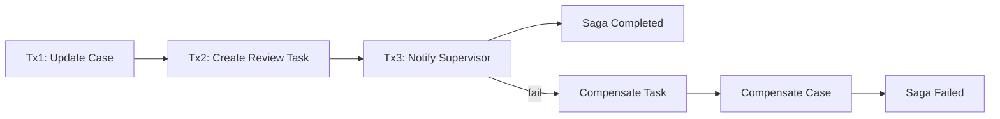
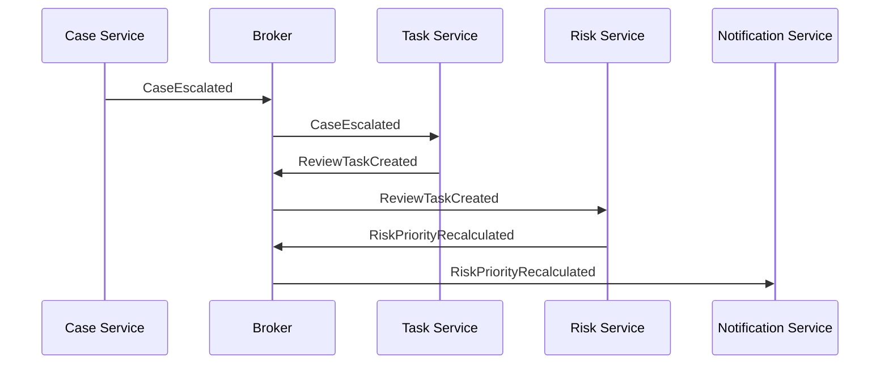
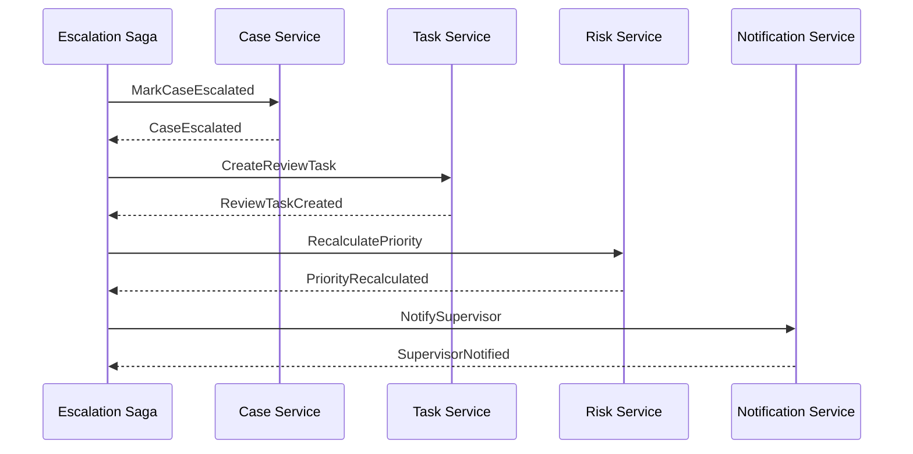
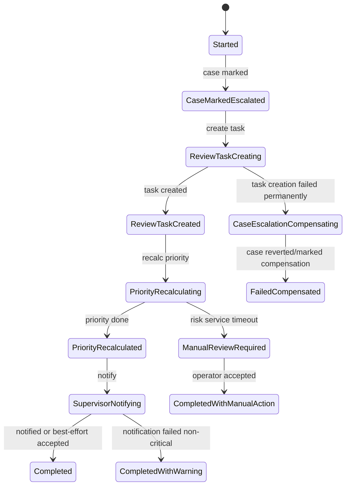
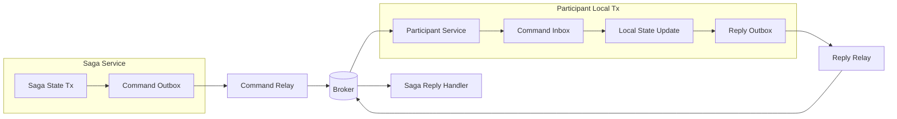

# Part 034 — Saga Pattern in Java

> Saga bukan “distributed transaction versi microservices”. Saga adalah **business process** yang memecah satu transaksi bisnis besar menjadi rangkaian local transaction yang bisa di-retry, di-timeout, dikompensasi, dan diaudit.

Part sebelumnya menjelaskan eventual consistency sebagai kontrak bisnis. Sekarang kita masuk ke pattern paling penting untuk menjalankan proses lintas service: **Saga**.

Saga muncul ketika satu business operation membutuhkan beberapa service, tetapi kamu tidak ingin memakai distributed transaction global.

Contoh:

```text
Escalate high-risk enforcement case:
  1. Case Service marks case as ESCALATED.
  2. Task Service creates supervisor review task.
  3. Risk Service recalculates priority.
  4. Notification Service notifies supervisor.
  5. Audit Service records escalation evidence.
```

Tidak ada satu database transaction yang membungkus semua langkah itu.

Yang ada adalah proses bisnis yang harus:

- tahu langkah mana sudah berhasil,
- tahu langkah mana gagal,
- bisa retry dengan aman,
- bisa timeout,
- bisa compensate jika perlu,
- bisa menunjukkan status ke user,
- dan bisa direkonstruksi saat incident/audit.

Itulah saga.

---

## 1. What Saga Is Not

Saga bukan:

- magic rollback lintas database,
- pengganti desain boundary yang buruk,
- alasan untuk membuat 12 service ikut dalam satu use case tanpa alasan,
- event soup tanpa owner,
- workflow tersembunyi di callback acak,
- atau “kirim event, semoga downstream selesai”.

Saga adalah proses eksplisit.

Kalau proses tidak eksplisit, kamu tidak punya saga. Kamu punya distributed side effect.

---

## 2. Core Definition

Saga adalah sequence local transactions.

Setiap local transaction:

1. dijalankan oleh satu service owner,
2. mengubah database lokal service itu,
3. mempublikasikan message/event/response untuk langkah berikutnya,
4. bisa memiliki compensating action jika langkah setelahnya gagal.

Diagram sederhana:



Yang perlu diingat:

```text
Compensation is not database rollback.
```

Compensation adalah aksi bisnis baru yang memperbaiki/menetralkan efek sebelumnya.

---

## 3. Saga Fit: Kapan Dipakai

Gunakan saga ketika:

- satu business transaction melintasi beberapa service owner,
- setiap service tetap harus punya local transaction sendiri,
- ada proses multi-step dengan status yang harus dilacak,
- ada timeout atau SLA,
- ada langkah yang bisa gagal setelah langkah sebelumnya sukses,
- ada compensation/forward recovery,
- proses harus bisa diaudit,
- dan user/stakeholder perlu melihat progress.

Contoh cocok:

```text
Case escalation
Payment/order fulfillment
Account opening
Loan approval
Regulatory enforcement workflow
Evidence intake with virus scan and classification
```

Jangan pakai saga jika:

- semua perubahan terjadi di satu aggregate/service,
- langkah downstream hanya notification best-effort,
- tidak ada business transaction yang perlu dilacak,
- service boundary salah dan sebenarnya harus digabung,
- proses butuh strict invariant global yang tidak bisa dikompensasi.

Kadang jawaban benar bukan saga, tetapi **merge boundary**.

---

## 4. Saga Anatomy

Saga production-grade punya komponen berikut:

| Component | Meaning |
|---|---|
| Saga ID | Identitas proses lintas service |
| Correlation ID | Menghubungkan request, logs, traces, events |
| Business key | ID domain seperti caseId/orderId |
| State | Current process state |
| Steps | Daftar local transaction/command |
| Participants | Service yang menjalankan step |
| Commands | Instruksi ke participant |
| Events/replies | Hasil dari participant |
| Timeout | Batas waktu menunggu step |
| Retry policy | Cara mengulang step yang transient |
| Compensation | Aksi bisnis jika harus membatalkan efek |
| Audit trail | Rekaman setiap transition |
| Idempotency key | Mencegah duplicate effect |
| Version | Untuk evolution process definition |

Jika salah satu hilang, saga masih bisa jalan, tapi debugging production akan mahal.

---

## 5. Choreography vs Orchestration

Ada dua gaya utama.

### 5.1 Choreography

Tidak ada coordinator pusat. Service bereaksi terhadap event dari service lain.



Kelebihan:

- loose coupling antar publisher/subscriber,
- service autonomy tinggi,
- cocok untuk simple propagation,
- tidak ada orchestrator bottleneck.

Kekurangan:

- flow tersembunyi di banyak consumer,
- sulit melihat progress end-to-end,
- compensation menyebar,
- timeout sulit dikelola,
- debugging membutuhkan graph event yang rapi.

### 5.2 Orchestration

Ada saga orchestrator/process manager yang mengirim command dan menerima reply/event.



Kelebihan:

- flow eksplisit,
- progress mudah dilacak,
- timeout dan retry lebih jelas,
- compensation terpusat,
- cocok untuk regulated workflow.

Kekurangan:

- orchestrator bisa menjadi too smart,
- risiko coupling ke semua participant,
- harus menjaga orchestrator tetap process-level, bukan domain owner semua hal,
- butuh state store yang reliable.

---

## 6. Decision Rule

Gunakan aturan sederhana:

```text
If the process has business-visible progress, timeout, compensation, or audit requirements, prefer orchestration.
If the process is simple propagation with independent subscribers, choreography is often enough.
```

Regulatory case-management sering cocok dengan orchestration karena:

- ada SLA,
- ada human task,
- ada auditability,
- ada escalation path,
- ada compliance evidence,
- dan ada status proses yang perlu dilihat user.

---

## 7. Saga State Machine

Saga harus punya state eksplisit.

Contoh escalation saga:



Perhatikan: tidak semua failure harus membatalkan saga.

Kadang hasil benar adalah:

```text
COMPLETED_WITH_WARNING
MANUAL_REVIEW_REQUIRED
PARTIALLY_COMPLETED
COMPENSATION_REQUIRED
```

Status proses harus mencerminkan realita, bukan memaksa binary success/failure.

---

## 8. Compensation: Semantic, Not Mechanical

Compensation bukan `DELETE FROM ...`.

Contoh buruk:

```text
Task creation succeeded.
Risk recalculation failed.
Delete task.
Set case status back.
```

Dalam domain regulated, itu bisa merusak audit trail.

Lebih baik:

```text
Create compensating event:
  - CaseEscalationCouldNotBeCompleted
  - ReviewTaskCancelledBecauseEscalationFailed
  - ManualRiskReviewRequired
```

Compensation harus domain-aware.

| Original Action | Bad Compensation | Better Compensation |
|---|---|---|
| Mark case escalated | silently set old status | record `EscalationReverted` with reason |
| Create review task | delete task row | cancel task with audit reason |
| Reserve capacity | ignore reservation | release reservation idempotently |
| Send notification | impossible to unsend | send correction notification if required |
| Publish audit event | delete audit event | append correction event |

Beberapa aksi tidak bisa dikompensasi. Untuk aksi seperti itu, gunakan **pivot point**.

---

## 9. Pivot Point

Dalam saga, pivot point adalah langkah setelah mana kamu tidak bisa lagi membatalkan dengan mudah.

Contoh:

```text
Before external legal notice is sent: compensation possible.
After legal notice is sent: must use forward recovery/correction.
```

Desain saga harus menempatkan langkah irreversible di posisi yang tepat:

```text
1. Validate locally
2. Reserve/prepare downstream state
3. Commit pivot action
4. Execute side effects that can tolerate correction
```

Jangan mengirim email, notifikasi legal, atau instruksi pembayaran sebelum precondition penting selesai.

---

## 10. Saga Data Model

Tabel saga minimal:

```sql
CREATE TABLE escalation_saga (
  saga_id uuid PRIMARY KEY,
  case_id varchar(64) NOT NULL,
  status varchar(64) NOT NULL,
  current_step varchar(100) NOT NULL,
  version bigint NOT NULL,
  started_at timestamptz NOT NULL,
  updated_at timestamptz NOT NULL,
  deadline_at timestamptz NULL,
  failure_reason text NULL,
  process_definition_version int NOT NULL
);

CREATE TABLE escalation_saga_step (
  saga_id uuid NOT NULL,
  step_name varchar(100) NOT NULL,
  status varchar(64) NOT NULL,
  attempt_count int NOT NULL,
  last_error text NULL,
  started_at timestamptz NULL,
  completed_at timestamptz NULL,
  PRIMARY KEY (saga_id, step_name)
);
```

Untuk idempotency command:

```sql
CREATE TABLE saga_command_outbox (
  command_id uuid PRIMARY KEY,
  saga_id uuid NOT NULL,
  target_service varchar(100) NOT NULL,
  command_type varchar(100) NOT NULL,
  payload jsonb NOT NULL,
  status varchar(32) NOT NULL,
  created_at timestamptz NOT NULL
);
```

---

## 11. Java Sketch: Saga Aggregate

```java
public final class EscalationSaga {
    private final SagaId sagaId;
    private final CaseId caseId;
    private SagaStatus status;
    private String currentStep;
    private long version;
    private final List<SagaCommand> pendingCommands = new ArrayList<>();

    public static EscalationSaga start(SagaId sagaId, CaseId caseId) {
        EscalationSaga saga = new EscalationSaga(sagaId, caseId);
        saga.status = SagaStatus.STARTED;
        saga.currentStep = "MARK_CASE_ESCALATED";
        saga.pendingCommands.add(new MarkCaseEscalatedCommand(
            CommandId.newId(), sagaId, caseId
        ));
        return saga;
    }

    public void on(CaseMarkedEscalated reply) {
        requireStatus(SagaStatus.STARTED);
        this.status = SagaStatus.CASE_MARKED_ESCALATED;
        this.currentStep = "CREATE_REVIEW_TASK";
        this.pendingCommands.add(new CreateReviewTaskCommand(
            CommandId.newId(), sagaId, caseId, reply.caseVersion()
        ));
        this.version++;
    }

    public void on(ReviewTaskCreated reply) {
        requireStatus(SagaStatus.CASE_MARKED_ESCALATED);
        this.status = SagaStatus.REVIEW_TASK_CREATED;
        this.currentStep = "RECALCULATE_PRIORITY";
        this.pendingCommands.add(new RecalculatePriorityCommand(
            CommandId.newId(), sagaId, caseId, reply.taskId()
        ));
        this.version++;
    }

    public void on(PriorityRecalculationFailed failure) {
        this.status = SagaStatus.MANUAL_REVIEW_REQUIRED;
        this.currentStep = "WAIT_MANUAL_REVIEW";
        this.pendingCommands.add(new CreateManualRiskReviewCommand(
            CommandId.newId(), sagaId, caseId, failure.reason()
        ));
        this.version++;
    }

    public List<SagaCommand> pullPendingCommands() {
        List<SagaCommand> copy = List.copyOf(pendingCommands);
        pendingCommands.clear();
        return copy;
    }

    private void requireStatus(SagaStatus expected) {
        if (this.status != expected) {
            throw new IllegalStateException("Invalid saga transition");
        }
    }
}
```

Ini mirip aggregate domain, tetapi domainnya adalah **process state**, bukan case data owner.

---

## 12. Java Sketch: Saga Application Service

```java
public final class EscalationSagaService {
    private final EscalationSagaRepository sagas;
    private final SagaCommandOutbox outbox;

    @Transactional
    public SagaId start(StartEscalation command) {
        SagaId sagaId = SagaId.newId();

        EscalationSaga saga = EscalationSaga.start(sagaId, command.caseId());

        sagas.save(saga);
        appendCommands(saga);

        return sagaId;
    }

    @Transactional
    public void handle(SagaReply reply) {
        EscalationSaga saga = sagas.getById(reply.sagaId());

        if (saga.alreadyHandled(reply.messageId())) {
            return;
        }

        saga.apply(reply);
        saga.markHandled(reply.messageId());

        sagas.save(saga);
        appendCommands(saga);
    }

    private void appendCommands(EscalationSaga saga) {
        for (SagaCommand command : saga.pullPendingCommands()) {
            outbox.append(command);
        }
    }
}
```

Rules:

- saga state update dan command outbox append harus atomik,
- reply handling harus idempotent,
- command delivery boleh at-least-once,
- participant command handler harus idempotent,
- saga transition harus guarded by current state/version.

---

## 13. Participant Command Handler

Participant service tidak boleh percaya command akan datang sekali saja.

Contoh Task Service:

```java
public final class CreateReviewTaskHandler {
    private final ReviewTaskRepository tasks;
    private final ProcessedCommandRepository processedCommands;
    private final ReplyOutbox replyOutbox;

    @Transactional
    public void handle(CreateReviewTaskCommand command) {
        if (processedCommands.alreadyProcessed(command.commandId())) {
            return;
        }

        ReviewTask task = tasks.findBySagaId(command.sagaId())
            .orElseGet(() -> ReviewTask.create(
                ReviewTaskId.newId(),
                command.caseId(),
                command.sagaId()
            ));

        tasks.save(task);

        processedCommands.markProcessed(command.commandId());

        replyOutbox.append(new ReviewTaskCreated(
            command.sagaId(),
            command.commandId(),
            task.id(),
            command.caseId()
        ));
    }
}
```

Idempotency strategy:

- command ID untuk dedupe,
- saga ID untuk natural uniqueness,
- unique constraint untuk resource created by saga.

SQL:

```sql
ALTER TABLE review_task
ADD CONSTRAINT uq_review_task_saga UNIQUE (saga_id);
```

---

## 14. Timeout Handling

Saga butuh timer.

Contoh:

```text
If ReviewTaskCreated is not received within 60 seconds, retry CreateReviewTask up to 3 times.
If still failing, mark saga as MANUAL_INTERVENTION_REQUIRED.
```

Jangan hanya bergantung pada HTTP timeout di caller.

Timer harus persisted:

```sql
CREATE TABLE saga_timer (
  timer_id uuid PRIMARY KEY,
  saga_id uuid NOT NULL,
  timer_type varchar(100) NOT NULL,
  fire_at timestamptz NOT NULL,
  status varchar(32) NOT NULL
);
```

Java sketch:

```java
public void onTimerFired(SagaTimerFired timer) {
    EscalationSaga saga = sagas.getById(timer.sagaId());

    switch (saga.status()) {
        case CASE_MARKED_ESCALATED -> saga.retryCreateReviewTaskOrEscalate();
        case REVIEW_TASK_CREATED -> saga.retryPriorityRecalculationOrManualReview();
        default -> saga.ignoreTimer(timer.timerId());
    }

    sagas.save(saga);
    appendCommands(saga);
}
```

Timer event juga bisa duplicate. Treat it as idempotent.

---

## 15. Retry Policy

Tidak semua failure boleh di-retry.

| Failure | Retry? | Example |
|---|---|---|
| Network timeout | yes, bounded | Task service unavailable |
| 503 overload | yes with backoff | Downstream saturated |
| Validation error | no | Case not eligible |
| Authorization failure | no | Saga identity lacks permission |
| Duplicate command | safe no-op | Same command ID |
| Business rejection | no, transition state | Supervisor capacity unavailable |
| Unknown outcome | retry with idempotency | Request timed out after downstream commit |

Saga retry harus punya:

- max attempt,
- backoff,
- jitter,
- timeout,
- dead-letter/manual intervention,
- and idempotent participant command.

---

## 16. Unknown Outcome Problem

Kasus paling berbahaya:

```text
Saga sends CreateReviewTask.
Task Service creates task.
Reply is lost.
Saga times out.
Saga retries CreateReviewTask.
```

Jika Task Service tidak idempotent, duplicate task terjadi.

Karena itu command harus membawa:

```text
commandId
sagaId
businessKey
idempotencyKey
```

Participant harus bisa menjawab:

```text
I already did this. Here is the same result.
```

Bukan:

```text
Create another task.
```

---

## 17. Saga and Outbox/Inbox

Saga hampir selalu membutuhkan outbox/inbox.



Tanpa outbox:

- saga state bisa commit tapi command hilang,
- participant state bisa commit tapi reply hilang,
- retry bisa menciptakan duplicate side effect.

---

## 18. Observability for Saga

Saga harus observable sebagai process, bukan hanya sebagai kumpulan request.

Minimal telemetry:

### Metrics

```text
saga_started_total{type="escalation"}
saga_completed_total{type="escalation"}
saga_failed_total{type="escalation",reason="task_creation_failed"}
saga_duration_seconds{type="escalation"}
saga_step_attempts_total{step="create_review_task"}
saga_timeout_total{step="risk_recalculation"}
saga_manual_intervention_total{type="escalation"}
```

### Logs

Setiap transition:

```json
{
  "event": "saga.transition",
  "sagaId": "...",
  "caseId": "CASE-123",
  "from": "CASE_MARKED_ESCALATED",
  "to": "REVIEW_TASK_CREATED",
  "messageId": "...",
  "correlationId": "..."
}
```

### Traces

Propagate:

- trace id,
- correlation id,
- saga id,
- command id,
- business key.

Jangan berharap trace selalu kontinu jika proses berlangsung menit/jam. Untuk long-running saga, **saga id** sering lebih penting daripada trace id.

---

## 19. Saga Audit Trail

Untuk regulated systems, saga audit harus menjawab:

```text
Who initiated the process?
What was the business intent?
Which steps were executed?
Which steps failed?
Which compensation happened?
What did the system know at the time?
Who intervened manually?
What final state was reached?
```

Saga audit event:

```json
{
  "eventType": "EscalationSagaTransitioned",
  "sagaId": "5ee2...",
  "caseId": "CASE-123",
  "fromState": "REVIEW_TASK_CREATING",
  "toState": "REVIEW_TASK_CREATED",
  "causedByMessageId": "d92a...",
  "actor": "system:saga-orchestrator",
  "occurredAt": "2026-07-05T10:20:00Z"
}
```

Audit bukan hanya user action. System decision juga harus bisa dijelaskan.

---

## 20. Avoiding God Orchestrator

Orchestrator sering berubah menjadi god service.

Smell:

- orchestrator tahu internal data model semua service,
- orchestrator melakukan business validation milik participant,
- orchestrator punya semua rules domain,
- participant hanya CRUD endpoint,
- semua proses harus lewat satu orchestrator besar.

Rule yang lebih sehat:

```text
Orchestrator owns process state.
Participant owns domain decision for its own capability.
```

Contoh:

- Saga boleh memutuskan “sekarang minta Task Service membuat review task”.
- Task Service tetap memutuskan apakah task valid, siapa owner task, dan constraint task.

---

## 21. Choreography Failure Mode

Choreography gagal jika tidak ada yang memiliki process.

Contoh smell:

```text
CaseEscalated triggers TaskCreated.
TaskCreated triggers NotificationRequested.
NotificationFailed triggers nobody.
RiskRecalculationFailed triggers dashboard warning but not case owner.
```

Pertanyaan review:

```text
Who owns the end-to-end outcome?
```

Jika jawabannya “semua service”, biasanya artinya tidak ada yang owner.

---

## 22. Versioning Saga Definition

Saga yang berjalan lama bisa melewati deployment.

Pertanyaan:

```text
What happens to saga instances started under process version 1 after code deploys version 2?
```

Simpan process definition version:

```sql
process_definition_version int NOT NULL
```

Strategi:

1. Running instances continue with old definition.
2. New instances use new definition.
3. Migration job upgrades selected states.
4. Backward-compatible handlers support both.

Jangan mengubah state machine tanpa strategi instance lama.

---

## 23. Testing Saga

Saga testing harus mencakup happy path dan failure path.

### 23.1 State Machine Test

```java
@Test
void escalationSagaCreatesReviewTaskAfterCaseMarkedEscalated() {
    EscalationSaga saga = EscalationSaga.start(SagaId.fixed("S1"), CaseId.of("CASE-123"));

    saga.on(new CaseMarkedEscalated(saga.id(), CaseId.of("CASE-123"), 12));

    assertThat(saga.status()).isEqualTo(SagaStatus.CASE_MARKED_ESCALATED);
    assertThat(saga.pullPendingCommands())
        .anyMatch(command -> command instanceof CreateReviewTaskCommand);
}
```

### 23.2 Duplicate Reply Test

```java
@Test
void duplicateReplyDoesNotAdvanceSagaTwice() {
    SagaReply reply = new ReviewTaskCreated(messageId("M1"), sagaId, taskId);

    service.handle(reply);
    service.handle(reply);

    assertThat(outbox.commandsFor(sagaId, "RECALCULATE_PRIORITY")).hasSize(1);
}
```

### 23.3 Timeout Test

```java
@Test
void timeoutMovesSagaToManualInterventionAfterRetriesExhausted() {
    saga.markCreateTaskAttemptFailed();
    saga.markCreateTaskAttemptFailed();
    saga.markCreateTaskAttemptFailed();

    saga.onTimerFired(createTaskTimer());

    assertThat(saga.status()).isEqualTo(SagaStatus.MANUAL_INTERVENTION_REQUIRED);
}
```

### 23.4 Compensation Test

Test compensation bukan hanya “method dipanggil”. Test final domain effect.

```text
Given case marked escalated
And review task created
When irreversible step fails before pivot
Then review task is cancelled with reason
And case receives escalation compensation event
And audit trail contains both original and compensation
```

---

## 24. Production Checklist

Sebelum saga masuk production, jawab:

1. Apa business transaction yang dimodelkan?
2. Siapa owner saga?
3. Apa business key-nya?
4. Apa state machine-nya?
5. Apa participant service-nya?
6. Step mana retryable?
7. Step mana non-retryable?
8. Step mana irreversible?
9. Di mana pivot point?
10. Apa compensation untuk tiap step?
11. Compensation mana yang bisa gagal?
12. Apakah command idempotent?
13. Apakah reply handling idempotent?
14. Apakah ada persisted timer?
15. Apakah saga survive restart?
16. Apakah running saga survive deploy?
17. Apakah ada saga dashboard?
18. Apakah ada manual intervention path?
19. Apakah ada audit trail?
20. Apakah ada runbook untuk stuck saga?

---

## 25. Common Saga Anti-Patterns

### 25.1 Saga for Wrong Boundary

Jika dua service selalu berubah bersama, mungkin boundary salah.

### 25.2 Hidden Saga

Flow tersebar di event handler tanpa state/process owner.

### 25.3 Mechanical Compensation

Menghapus data tanpa domain audit.

### 25.4 Non-Idempotent Participant

Retry menciptakan duplicate side effect.

### 25.5 No Timeout

Saga menunggu selamanya.

### 25.6 No Manual Intervention

Sistem stuck karena semua failure diasumsikan otomatis bisa pulih.

### 25.7 Orchestrator Owns Everyone’s Rules

Orchestrator menjadi monolith baru.

### 25.8 No Process Version

Deployment memecahkan saga lama.

---

## 26. Practical Exercise

Desain saga untuk use case:

```text
Submit evidence for regulatory case.
```

Langkah awal:

1. Evidence Service records metadata.
2. Storage Service confirms binary object availability.
3. Malware Scan Service scans file.
4. Classification Service classifies sensitivity.
5. Case Service links evidence to case.
6. Audit Service records evidence submission.

Tentukan:

- service owner saga,
- state machine,
- participant commands,
- success events/replies,
- failure events/replies,
- retry policy,
- timeout,
- compensation,
- pivot point,
- manual intervention state,
- audit event,
- idempotency keys,
- and dashboard fields for saga progress.

Jangan mulai dari diagram. Mulai dari invariant:

```text
A case must not rely on evidence whose malware scan failed.
```

Lalu turunkan process.

---

## 27. Summary

Saga adalah pattern untuk mengelola business transaction lintas service tanpa distributed transaction global.

Saga yang baik punya:

- explicit process owner,
- local transaction per service,
- durable saga state,
- command/reply outbox,
- idempotent participants,
- timeout,
- retry policy,
- semantic compensation,
- pivot point,
- observability,
- audit trail,
- dan manual intervention path.

Top engineer tidak bertanya:

```text
Should we use saga?
```

Mereka bertanya:

```text
What business process are we actually modeling, which state must be locally consistent, which effects can be compensated, where is the pivot point, and who owns the final outcome?
```

Itulah cara melihat saga sebagai architecture mechanism, bukan sekadar pattern diagram.
