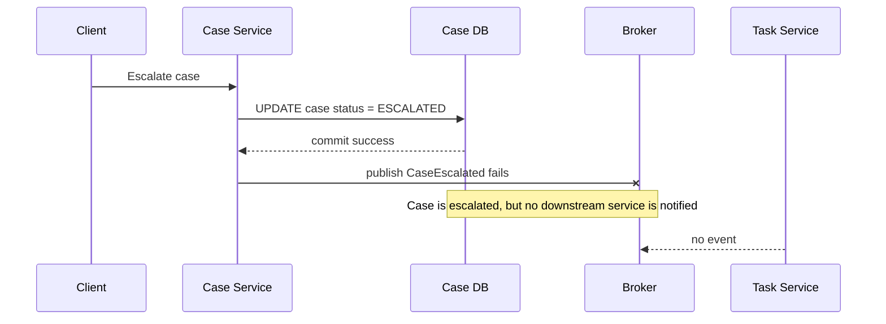
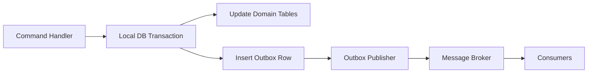
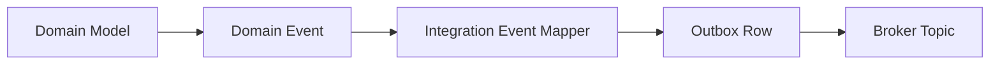
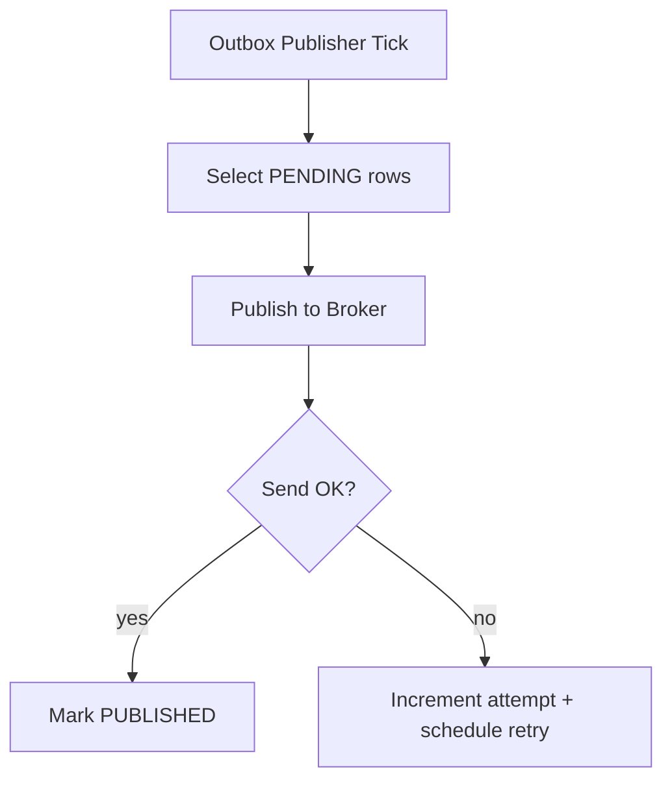
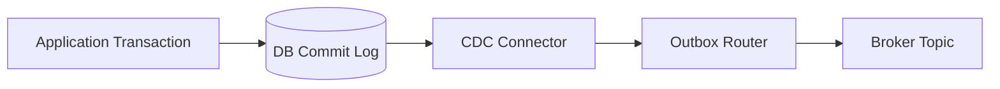
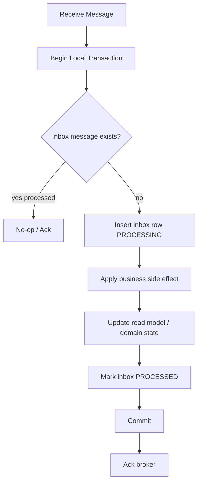
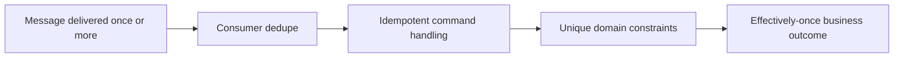
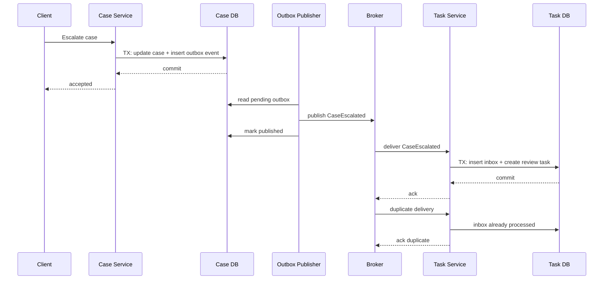
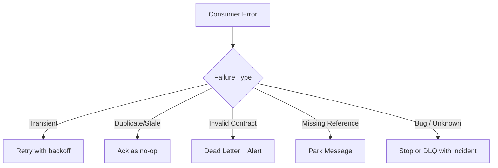

# Part 035 — Outbox, Inbox, and Transactional Messaging

> Reliable messaging in microservices is not achieved by hoping Kafka, RabbitMQ, JMS, or your framework is reliable. It is achieved by designing the **transaction boundary** between domain state and message publication.

Part 031 established data ownership. Part 032 established transaction boundary. Part 033 established eventual consistency. Part 034 established saga as a business transaction pattern.

This part answers the operational question:

```text
How do we safely change local service state and publish the fact that it changed?
```

That question looks small. In production, it is one of the most common sources of ghost bugs:

- database row changed but event was never published,
- event published but database transaction rolled back,
- event published twice,
- consumer processed the same message twice,
- event order is wrong for the same aggregate,
- consumer side effect happened but offset/ack was not committed,
- replay created duplicate downstream effects,
- audit trail says one thing while read model says another.

The outbox/inbox family of patterns exists to make these failure modes explicit.

---

## 1. The Core Problem: Dual Write

A dual write happens when one business operation writes to two resources that cannot be committed atomically together.

Example:

```java
@Transactional
public void escalateCase(EscalateCaseCommand command) {
    Case c = caseRepository.get(command.caseId());
    c.escalate(command.reason());
    caseRepository.save(c);

    kafkaTemplate.send("case-events", new CaseEscalatedEvent(c.id()));
}
```

Looks normal. It is dangerous.

There are two writes:

1. write updated case state to PostgreSQL,
2. write event to Kafka.

They are not in the same transaction.

Failure matrix:

| Step | Database Commit | Message Publish | Result |
|---|---:|---:|---|
| Happy path | success | success | correct |
| DB fails before commit | fail | not sent | correct |
| DB commits, publish fails | success | fail | state changed but nobody knows |
| Publish succeeds, DB later rolls back | fail | success | event lies |
| Publish succeeds, response lost | success | unknown | retry may duplicate |
| App crashes between DB and publish | success | not sent | invisible state change |

The dangerous part is not that failure exists. The dangerous part is that the system can enter a state where different observers see different truths.



This is the **dual-write problem**.

---

## 2. The Outbox Mental Model

The transactional outbox pattern changes the problem from:

```text
Write domain state to DB + publish event to broker
```

into:

```text
Write domain state to DB + write event record to same DB transaction
Then publish event later from the outbox table
```

The key is that domain state and outbound message intent are committed atomically inside one local database transaction.



Outbox does **not** mean message delivery becomes exactly-once.

It means:

- the service will not lose the fact that an event must be published,
- event publication becomes retryable,
- publication can be observed and repaired,
- the business transaction does not depend on broker availability,
- the local database remains the source of truth for what the service committed.

---

## 3. What the Outbox Guarantees

Outbox gives these guarantees:

| Guarantee | Meaning |
|---|---|
| Atomic local commit | Domain state and outbox row commit together |
| Recoverable publication | If publisher crashes, unpublished rows remain |
| Decoupled broker availability | Command can commit even if broker is temporarily down |
| Auditable publication intent | You can inspect what should have been published |
| Retryable send | Publisher can retry failed sends |

Outbox does **not** guarantee:

| Non-guarantee | Why |
|---|---|
| Exactly-once end-to-end side effect | Broker and consumer failures still cause duplicate delivery or duplicate processing attempts |
| Global ordering across all aggregates | Ordering is usually only meaningful per aggregate/key |
| Consumer correctness | Consumers still need idempotency and version guards |
| Schema safety | Event contract still needs evolution discipline |
| Privacy safety | Payload design still matters |

Outbox solves one part of the reliability problem: **reliable publication of committed local facts**.

Inbox solves the other side: **safe consumption of possibly duplicated messages**.

---

## 4. Outbox Table Design

A minimal outbox table:

```sql
CREATE TABLE outbox_event (
    id              UUID PRIMARY KEY,
    aggregate_type  VARCHAR(100) NOT NULL,
    aggregate_id    VARCHAR(100) NOT NULL,
    event_type      VARCHAR(200) NOT NULL,
    event_version   INT NOT NULL,
    occurred_at     TIMESTAMPTZ NOT NULL,
    payload         JSONB NOT NULL,
    headers         JSONB NOT NULL DEFAULT '{}'::jsonb,
    status          VARCHAR(30) NOT NULL DEFAULT 'PENDING',
    publish_attempt INT NOT NULL DEFAULT 0,
    next_attempt_at TIMESTAMPTZ NULL,
    published_at    TIMESTAMPTZ NULL,
    last_error      TEXT NULL,
    created_at      TIMESTAMPTZ NOT NULL DEFAULT now()
);

CREATE INDEX idx_outbox_event_pending
    ON outbox_event (status, next_attempt_at, created_at);

CREATE INDEX idx_outbox_event_aggregate
    ON outbox_event (aggregate_type, aggregate_id, occurred_at);
```

Production-grade fields:

| Field | Purpose |
|---|---|
| `id` | Unique event ID for downstream dedupe and audit |
| `aggregate_type` | Type of domain object that emitted the event |
| `aggregate_id` | Partitioning/ordering key |
| `event_type` | Semantic event name, not Java class leakage |
| `event_version` | Contract version |
| `occurred_at` | Business occurrence time |
| `payload` | Event data |
| `headers` | Correlation ID, causation ID, tenant ID, actor ID, trace context |
| `status` | Publication lifecycle |
| `publish_attempt` | Retry control |
| `next_attempt_at` | Backoff scheduling |
| `published_at` | Observable completion |
| `last_error` | Operational diagnosis |

The table is not just a queue. It is a durable record of integration intent.

---

## 5. Event Identity, Causation, and Correlation

Every outbox event should carry three IDs:

```text
eventId       = this specific event occurrence
correlationId = end-to-end user/business request chain
causationId   = command/event that caused this event
```

Example:

```json
{
  "eventId": "7e0d2f8e-7f4f-471c-9d13-cf74176561ef",
  "correlationId": "req-20260705-000912",
  "causationId": "cmd-escalate-case-82291",
  "eventType": "CaseEscalated",
  "eventVersion": 1,
  "occurredAt": "2026-07-05T10:15:30Z",
  "aggregateType": "Case",
  "aggregateId": "CASE-2026-000481"
}
```

Mental model:

- `eventId` helps dedupe.
- `correlationId` helps trace a business operation.
- `causationId` helps reconstruct why a thing happened.

For regulatory, financial, or enforcement systems, correlation and causation are not observability niceties. They are evidence structure.

---

## 6. Writing Domain State and Outbox in One Transaction

A good application service does not publish directly to the broker. It records events to the outbox inside the same local transaction as the domain change.

```java
@Service
public class EscalateCaseHandler {

    private final CaseRepository caseRepository;
    private final OutboxRepository outboxRepository;
    private final EventMapper eventMapper;

    public EscalateCaseHandler(
            CaseRepository caseRepository,
            OutboxRepository outboxRepository,
            EventMapper eventMapper
    ) {
        this.caseRepository = caseRepository;
        this.outboxRepository = outboxRepository;
        this.eventMapper = eventMapper;
    }

    @Transactional
    public void handle(EscalateCaseCommand command) {
        CaseFile caseFile = caseRepository.getForUpdate(command.caseId());

        CaseEscalated domainEvent = caseFile.escalate(
                command.reason(),
                command.actor(),
                command.commandId()
        );

        caseRepository.save(caseFile);
        outboxRepository.append(eventMapper.toOutboxRecord(domainEvent, command));
    }
}
```

Important rules:

1. Domain behavior creates the domain event.
2. Application service persists domain state and outbox record together.
3. Broker publication happens outside this transaction.
4. Event payload is mapped to an integration contract, not raw entity serialization.
5. `commandId` or causation ID travels into the event metadata.

---

## 7. Domain Event vs Integration Event in Outbox

A domain event is an internal domain fact.

An integration event is a contract for other services.

Do not blindly serialize domain events to the broker.



Example domain event:

```java
public record CaseEscalated(
        CaseId caseId,
        EscalationReason reason,
        RiskLevel previousRisk,
        RiskLevel newRisk,
        ActorId escalatedBy,
        Instant occurredAt
) {}
```

Example integration event:

```json
{
  "type": "case.case-escalated.v1",
  "caseId": "CASE-2026-000481",
  "newRiskLevel": "HIGH",
  "reasonCode": "REPEAT_VIOLATION",
  "occurredAt": "2026-07-05T10:15:30Z"
}
```

Notice what is missing:

- internal object graph,
- database IDs irrelevant to consumers,
- confidential investigation notes,
- Java package/class names,
- fields that are not part of public semantics.

Outbox is a boundary. Treat it like an API.

---

## 8. Publisher Implementations

There are two common publisher approaches.

### 8.1 Polling Publisher

A scheduled worker queries pending outbox rows and publishes them.



Example SQL for safe claiming:

```sql
SELECT *
FROM outbox_event
WHERE status = 'PENDING'
  AND (next_attempt_at IS NULL OR next_attempt_at <= now())
ORDER BY created_at
LIMIT 100
FOR UPDATE SKIP LOCKED;
```

`SKIP LOCKED` lets multiple publisher workers claim different rows without blocking each other.

Pseudo Java:

```java
@Component
public class OutboxPublisherJob {

    private final OutboxRepository outboxRepository;
    private final EventBroker eventBroker;

    @Scheduled(fixedDelayString = "${outbox.publisher.delay-ms:1000}")
    public void publishBatch() {
        List<OutboxEventRecord> batch = outboxRepository.claimPending(100);

        for (OutboxEventRecord record : batch) {
            try {
                eventBroker.publish(
                        record.topic(),
                        record.partitionKey(),
                        record.payload(),
                        record.headers()
                );
                outboxRepository.markPublished(record.id());
            } catch (Exception ex) {
                outboxRepository.markFailedAttempt(
                        record.id(),
                        RetryBackoff.next(record.publishAttempt()),
                        ex.getMessage()
                );
            }
        }
    }
}
```

Polling is simple and explicit. Its trade-offs:

| Strength | Weakness |
|---|---|
| Easy to understand | Adds polling load |
| Easy to debug | Publication latency depends on interval |
| Works with many brokers | Needs careful locking and backoff |
| Does not require CDC infrastructure | More custom code |

### 8.2 Change Data Capture Publisher

CDC-based outbox uses database log capture. A connector reads committed outbox rows from the database transaction log and publishes them to the broker.



This approach is common with Debezium + Kafka.

Trade-offs:

| Strength | Weakness |
|---|---|
| Low app-level publishing code | Requires CDC infrastructure |
| Reads committed DB log | Operational dependency on connector |
| Good throughput | Debug path spans DB + connector + broker |
| Avoids polling query load | Requires topic/routing configuration discipline |

CDC does not remove the need for:

- event contract design,
- consumer idempotency,
- payload privacy,
- schema evolution,
- monitoring,
- replay discipline.

It only changes how outbox rows leave the database.

---

## 9. Publication Status: Should You Mark Published?

With polling publisher, marking `PUBLISHED` is common.

With CDC publisher, rows may simply be appended and retained/deleted later by retention policy.

Two designs:

### Mutable Status Table

```text
PENDING -> PUBLISHING -> PUBLISHED
                   └-> FAILED_RETRYABLE
                   └-> FAILED_TERMINAL
```

Useful when the app owns publisher state.

### Append-Only Outbox

```text
INSERT outbox row once
CDC connector publishes it
Retention job archives/deletes old rows
```

Useful when CDC owns publication.

For audit-heavy domains, prefer append-only or archive-before-delete. Publication state can be stored separately if necessary.

---

## 10. Ordering: The Part Most Teams Underestimate

Ordering is not one thing.

Ask: **ordering of what, for whom, and under which key?**

Types:

| Ordering Type | Meaning | Practicality |
|---|---|---|
| Global order | Every event in exact order across system | Expensive and rarely needed |
| Per-service order | Events from one service ordered | Sometimes useful |
| Per-aggregate order | Events for one aggregate ordered | Usually the correct target |
| Per-consumer processing order | Consumer handles messages in order | Depends on partition and concurrency |

Most systems need per-aggregate ordering.

Kafka-style partitioning:

```text
topic = case-events
key   = caseId
```

This keeps events for the same case on the same partition, preserving order for that key.

But ordering can still be broken by:

- consumer parallelism without key-based serialization,
- reprocessing old events,
- publishing with wrong partition key,
- multiple services emitting events about same conceptual entity,
- clock-based ordering instead of sequence/version ordering.

Use aggregate version where possible:

```json
{
  "caseId": "CASE-2026-000481",
  "caseVersion": 17,
  "eventType": "CaseEscalated"
}
```

Consumer can reject or defer stale events:

```java
if (event.caseVersion() <= projection.currentCaseVersion(event.caseId())) {
    return ProcessingResult.duplicateOrStale();
}
```

---

## 11. The Inbox Pattern

Outbox says: “I will reliably publish what I committed.”

Inbox says: “I will safely process what I might receive more than once.”

A basic inbox table:

```sql
CREATE TABLE inbox_message (
    message_id      UUID PRIMARY KEY,
    consumer_name   VARCHAR(100) NOT NULL,
    received_at     TIMESTAMPTZ NOT NULL DEFAULT now(),
    processed_at    TIMESTAMPTZ NULL,
    status          VARCHAR(30) NOT NULL,
    last_error      TEXT NULL,
    payload_hash    VARCHAR(128) NULL
);

CREATE UNIQUE INDEX uq_inbox_message_consumer
    ON inbox_message (consumer_name, message_id);
```

Why include `consumer_name`?

Because the same event may be consumed by multiple independent consumers. Dedupe is per consumer, not globally.

---

## 12. Consumer Processing Flow

Safe consumer algorithm:



Key rule:

```text
Consumer side effect + inbox processed marker must commit in the same local transaction.
```

Example:

```java
@Transactional
public void onCaseEscalated(MessageEnvelope<CaseEscalatedV1> message) {
    if (inboxRepository.alreadyProcessed("task-service", message.eventId())) {
        return;
    }

    inboxRepository.markProcessing(
            "task-service",
            message.eventId(),
            message.payloadHash()
    );

    Task task = Task.supervisorReview(
            message.payload().caseId(),
            message.payload().newRiskLevel(),
            message.correlationId()
    );

    taskRepository.save(task);
    inboxRepository.markProcessed("task-service", message.eventId());
}
```

This handles duplicate delivery.

But there is still a subtle issue: if the consumer commits DB transaction but crashes before acknowledging broker, broker may redeliver. Inbox turns that redelivery into no-op.

---

## 13. Inbox Status Model

Possible status model:

```text
RECEIVED -> PROCESSING -> PROCESSED
                    └-> FAILED_RETRYABLE
                    └-> FAILED_TERMINAL
```

But be careful: status models can create stuck states.

Simpler robust variant:

- insert processed ID only after successful processing, or
- insert processing row with heartbeat/lease timeout.

Design options:

| Option | How It Works | Risk |
|---|---|---|
| Insert before processing | Prevents concurrent duplicate processing | Stuck processing row if crash |
| Insert after processing | Simpler but duplicates can race | Needs unique business constraint |
| Processing lease | Row expires if worker dies | More complex |
| Business natural key | Side effect guarded by unique constraint | Best when available |

For high-value commands, combine inbox with business constraints.

Example:

```sql
CREATE UNIQUE INDEX uq_task_case_escalation
    ON task (case_id, task_type)
    WHERE task_type = 'SUPERVISOR_REVIEW';
```

Even if dedupe fails, the domain side effect remains protected.

---

## 14. Exactly-Once Is Usually the Wrong Goal

Teams often say:

```text
We need exactly-once messaging.
```

Usually they actually need:

```text
The same business side effect must not be applied more than once.
```

Those are different.

Message delivery can be at-least-once, while business outcome is effectively-once.



“Exactly-once” across broker, app, database, external APIs, and human-observable side effects is usually an illusion or a narrow broker-specific guarantee.

Design for **effectively-once**:

- stable event ID,
- idempotent consumer,
- unique business keys,
- transactional inbox,
- version checks,
- commutative updates where possible,
- reconciliation job,
- audit trail.

---

## 15. Outbox + Inbox End-to-End



This is the core of reliable event collaboration.

---

## 16. Poison Messages and Dead Letter Strategy

A poison message is a message that repeatedly fails processing.

Common causes:

- schema mismatch,
- missing required reference data,
- invalid event payload,
- bug in consumer,
- external dependency unavailable,
- authorization/tenant mismatch,
- stale or out-of-order event.

Do not infinite-retry poison messages at full speed.

Design:

```text
Receive -> validate -> classify failure
                  ├── transient -> retry with backoff
                  ├── stale duplicate -> ack/no-op
                  ├── invalid contract -> DLQ + alert
                  ├── missing dependency -> park/retry later
                  └── bug -> stop consumer / DLQ based on blast radius
```

Mermaid:



A DLQ is not a trash can. It is an operational queue with owner, SLO, replay procedure, and audit implication.

---

## 17. Reconciliation Is Part of the Pattern

Outbox/inbox reduces inconsistency. It does not eliminate all inconsistencies.

You still need reconciliation.

Examples:

```text
Find escalated cases without review task.
Find outbox events pending for more than 5 minutes.
Find inbox messages stuck in PROCESSING.
Find projections behind source aggregate version.
Find DLQ events older than SLA.
```

Example query:

```sql
SELECT id, aggregate_type, aggregate_id, event_type, created_at, last_error
FROM outbox_event
WHERE status IN ('PENDING', 'FAILED_RETRYABLE')
  AND created_at < now() - interval '5 minutes'
ORDER BY created_at;
```

Reconciliation is not a batch hack. It is the safety net for eventual consistency.

---

## 18. Event Payload Design for Outbox

Payload choice affects coupling.

### Thin Event

```json
{
  "caseId": "CASE-2026-000481"
}
```

Pros:

- less data leakage,
- smaller payload,
- consumers fetch latest state.

Cons:

- creates synchronous read dependency,
- state may change between event and fetch,
- more load on source service.

### Rich Event / Event-Carried State Transfer

```json
{
  "caseId": "CASE-2026-000481",
  "status": "ESCALATED",
  "riskLevel": "HIGH",
  "escalationReasonCode": "REPEAT_VIOLATION",
  "caseVersion": 17
}
```

Pros:

- consumer can update projection without callback,
- reduces synchronous dependency,
- better for read models.

Cons:

- schema evolution responsibility,
- privacy risk,
- consumers may depend on too many fields.

Decision rule:

```text
Publish enough stable business facts for consumers to make intended decisions without leaking internal/private state.
```

---

## 19. Topic Design and Routing

Bad topic names:

```text
updates
service-events
data-sync
misc
```

Better topic names:

```text
case.lifecycle.events
case.risk.events
enforcement.decision.events
```

Topic design dimensions:

| Dimension | Question |
|---|---|
| Domain | Which business area owns the stream? |
| Semantics | Are events lifecycle, risk, decision, audit, or projection updates? |
| Volume | Does this event class need separate scaling? |
| Privacy | Does this stream contain sensitive data? |
| Retention | Is replay needed? For how long? |
| Ordering | What is the partition key? |
| Consumer audience | Internal, cross-domain, analytics, audit? |

Avoid topic-per-event-type explosion unless there is a strong operational reason.

Avoid one giant event soup topic unless consumers can safely filter and evolve.

---

## 20. Retention and Cleanup

Outbox tables grow.

Retention strategies:

| Strategy | Description | Fit |
|---|---|---|
| Delete published after N days | Simple cleanup | Low audit needs |
| Archive then delete | Move to archive table/storage | Audit-sensitive systems |
| Partition by time | Fast drop old partitions | High volume |
| Append-only with CDC retention | CDC consumes log/table and table retention is managed | CDC-heavy systems |

For regulatory systems, do not delete integration evidence without retention policy approval.

Suggested metadata:

```sql
CREATE TABLE outbox_event_archive (
    LIKE outbox_event INCLUDING ALL,
    archived_at TIMESTAMPTZ NOT NULL DEFAULT now()
);
```

---

## 21. Transactional Messaging with External APIs

Outbox is not only for message brokers.

It can also represent outbound side effects:

- send notification,
- call external regulator API,
- create payment/refund request,
- send email,
- generate document,
- invoke legacy system.

But external calls require stricter idempotency.

Example outbox command row:

```json
{
  "type": "NotifySupervisorCommand.v1",
  "idempotencyKey": "notify-supervisor:CASE-2026-000481:ESCALATION:17",
  "caseId": "CASE-2026-000481",
  "recipientUserId": "USR-1901"
}
```

Outbound worker:

```text
Read pending command -> call external API with idempotency key -> store external response/result -> mark complete
```

If the external API does not support idempotency, you need a stronger local dedupe and reconciliation strategy.

---

## 22. Spring/JPA Implementation Notes

Common JPA pitfalls:

### Pitfall 1 — Publishing from Entity Listener

Avoid publishing broker messages directly from JPA entity listeners.

Entity listeners are too close to persistence mechanics and too far from integration contract control.

### Pitfall 2 — Serializing Entity Graph

Never serialize JPA entities as event payloads.

Problems:

- lazy loading surprises,
- internal schema leakage,
- circular references,
- accidental sensitive data exposure,
- contract tied to persistence model.

### Pitfall 3 — `@TransactionalEventListener` Misuse

`@TransactionalEventListener(phase = AFTER_COMMIT)` can help trigger post-commit actions, but it does not by itself make broker publication durable.

If the app crashes after commit and before publishing, the event can still be lost unless it was persisted durably first.

Use it carefully, usually to wake up a publisher, not as the durable event store.

---

## 23. Minimal Java Types

```java
public record OutboxEventRecord(
        UUID id,
        String aggregateType,
        String aggregateId,
        String eventType,
        int eventVersion,
        Instant occurredAt,
        String payloadJson,
        Map<String, String> headers
) {
    public String partitionKey() {
        return aggregateType + ":" + aggregateId;
    }
}
```

Repository port:

```java
public interface OutboxRepository {
    void append(OutboxEventRecord event);
    List<OutboxEventRecord> claimPending(int batchSize);
    void markPublished(UUID eventId);
    void markFailedAttempt(UUID eventId, Duration nextDelay, String error);
}
```

Broker port:

```java
public interface EventBroker {
    void publish(
            String topic,
            String partitionKey,
            String payloadJson,
            Map<String, String> headers
    );
}
```

This keeps domain/application code independent from Kafka/Rabbit/JMS implementation.

---

## 24. Fitness Functions

Automatable checks:

```text
Every integration event has eventId, eventType, eventVersion, occurredAt.
Every event has correlationId and causationId headers.
Every event payload has a schema contract.
Every consumer has an inbox/dedupe strategy.
Every retryable publisher uses bounded retry + backoff.
Every DLQ has an owner and alert.
No controller publishes directly to broker.
No entity is serialized directly as event payload.
No consumer performs non-idempotent side effect without guard.
```

Example ArchUnit-style rule idea:

```java
@AnalyzeClasses(packages = "com.acme.caseapp")
class MessagingArchitectureTest {

    @ArchTest
    static final ArchRule domain_must_not_depend_on_kafka =
            noClasses()
                    .that().resideInAPackage("..domain..")
                    .should().dependOnClassesThat()
                    .resideInAnyPackage("org.apache.kafka..");
}
```

---

## 25. Common Smells

| Smell | Why It Is Dangerous | Better Design |
|---|---|---|
| Publish inside DB transaction | Broker call can block/slow/unknown while DB locks held | Write outbox row, publish later |
| Publish after commit without outbox | Crash loses event | Durable outbox |
| Shared event DTO with entity | Persistence leaks to consumers | Integration event mapper |
| No event ID | Consumer cannot dedupe reliably | Stable event identity |
| No inbox | Duplicate delivery creates duplicate side effects | Inbox + idempotent handler |
| Global ordering assumption | Throughput collapse or false correctness | Per-aggregate ordering |
| DLQ ignored | Silent business inconsistency | DLQ ownership and replay playbook |
| Infinite retry | Retry storm and stuck partitions | Backoff, classification, DLQ |
| Event soup topic | Unclear ownership and schema chaos | Domain-owned stream design |
| Deleting outbox immediately | Hard to audit publication issues | Retention/archive policy |

---

## 26. Review Checklist

Before approving event-driven collaboration between services, ask:

1. What local transaction creates the event?
2. Is the event written to an outbox in the same transaction as the domain state?
3. What is the event ID?
4. What is the aggregate ID and partition key?
5. What ordering is required?
6. Does the consumer have inbox/dedupe?
7. Is the consumer side effect idempotent?
8. What happens if the broker delivers twice?
9. What happens if publisher crashes after sending but before marking published?
10. What happens if consumer commits DB but crashes before ack?
11. What is retryable vs terminal failure?
12. Is there a DLQ and owner?
13. Can we replay safely?
14. Is sensitive data minimized?
15. How do we reconcile source and projection?
16. What metric tells us the outbox is stuck?
17. What metric tells us the inbox is failing?
18. What dashboard shows publication lag?
19. What runbook handles stuck events?
20. Is this design documented in the service contract?

---

## 27. Production Metrics

Outbox metrics:

```text
outbox.pending.count
outbox.oldest.pending.age.seconds
outbox.publish.success.rate
outbox.publish.failure.rate
outbox.publish.retry.count
outbox.dlq.count
outbox.publish.latency.ms
```

Inbox metrics:

```text
inbox.process.success.rate
inbox.process.failure.rate
inbox.duplicate.count
inbox.stale.count
inbox.processing.latency.ms
inbox.oldest.unprocessed.age.seconds
```

Business metrics:

```text
case.escalated.count
case.escalation.task.created.count
case.escalation.without.task.count
case.escalation.reconciliation.fixed.count
```

Technical metrics without business reconciliation are not enough.

---

## 28. Worked Example: Case Escalation

Business operation:

```text
When a case becomes HIGH risk, create a supervisor review task and update a case overview projection.
```

Source service: `case-service`

Outbox event:

```json
{
  "eventId": "d80bf861-77c7-40a6-a5f0-b0b767816b33",
  "eventType": "case.case-escalated.v1",
  "aggregateId": "CASE-2026-000481",
  "caseVersion": 17,
  "riskLevel": "HIGH",
  "reasonCode": "REPEAT_VIOLATION",
  "occurredAt": "2026-07-05T10:15:30Z"
}
```

Consumer: `task-service`

Idempotent side effect:

```sql
CREATE UNIQUE INDEX uq_review_task_per_case_version
    ON review_task (case_id, source_case_version, task_type);
```

Consumer logic:

```java
@Transactional
public void handle(CaseEscalatedV1 event, MessageMetadata metadata) {
    if (inbox.alreadyProcessed("task-service", metadata.eventId())) {
        return;
    }

    inbox.recordReceived("task-service", metadata.eventId());

    reviewTaskRepository.createIfAbsent(
            event.caseId(),
            event.caseVersion(),
            ReviewTaskType.SUPERVISOR_REVIEW,
            metadata.correlationId()
    );

    inbox.recordProcessed("task-service", metadata.eventId());
}
```

Projection consumer:

```java
@Transactional
public void updateOverview(CaseEscalatedV1 event, MessageMetadata metadata) {
    if (overview.versionOf(event.caseId()).isAtLeast(event.caseVersion())) {
        return;
    }

    overview.applyEscalation(
            event.caseId(),
            event.caseVersion(),
            event.riskLevel(),
            event.occurredAt()
    );
}
```

The same event supports two consumers with different side effects. Both must be independently idempotent.

---

## 29. Mental Model Summary

Think of outbox/inbox like this:

```text
Outbox = durable promise to tell others what this service committed.
Inbox  = durable memory that this consumer already reacted to a message.
```

Together they let you build reliable collaboration on top of unreliable delivery.

But they are not magic. You still need:

- good service boundaries,
- stable event contracts,
- idempotent consumers,
- bounded retries,
- reconciliation,
- observability,
- operational ownership.

The expert move is not to claim “exactly once”.

The expert move is to design a system where duplicate delivery, crash recovery, replay, and partial failure produce the same acceptable business outcome.

---

## 30. Exercises

### Exercise 1 — Dual Write Detection

Pick one existing service operation.

Write down every resource it writes to:

```text
Database tables:
Broker topics:
External APIs:
Cache:
Search index:
Email/SMS:
Audit log:
```

Mark which writes are inside one transaction and which are not.

### Exercise 2 — Outbox Contract

Design an outbox event for:

```text
CaseClosed
```

Include:

- event ID,
- aggregate ID,
- version,
- occurred time,
- reason code,
- actor reference,
- correlation ID,
- privacy classification.

### Exercise 3 — Consumer Idempotency

For the same event, design two consumers:

1. `notification-service`,
2. `reporting-service`.

For each, define:

- dedupe key,
- side effect,
- unique constraint,
- retry policy,
- DLQ policy.

### Exercise 4 — Reconciliation Query

Write a query or pseudo-query that finds:

```text
Cases closed in Case Service but not reflected in Reporting Service after 10 minutes.
```

### Exercise 5 — Failure Drill

Simulate:

```text
Consumer commits DB transaction but crashes before broker ack.
```

Explain why inbox prevents duplicate side effect.

---

## References

- Chris Richardson, Microservices Patterns — Transactional Outbox and Idempotent Consumer patterns.
- Debezium documentation — Outbox Event Router and CDC-based outbox publication.
- Martin Fowler — Event-driven collaboration and event-carried state transfer.
- RFC 9110 — HTTP idempotency semantics.
- Stripe API documentation and engineering writing — idempotency keys for retry-safe API requests.
