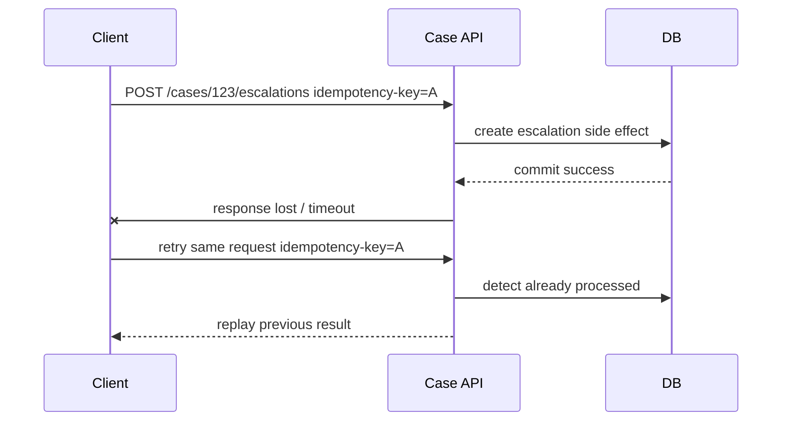
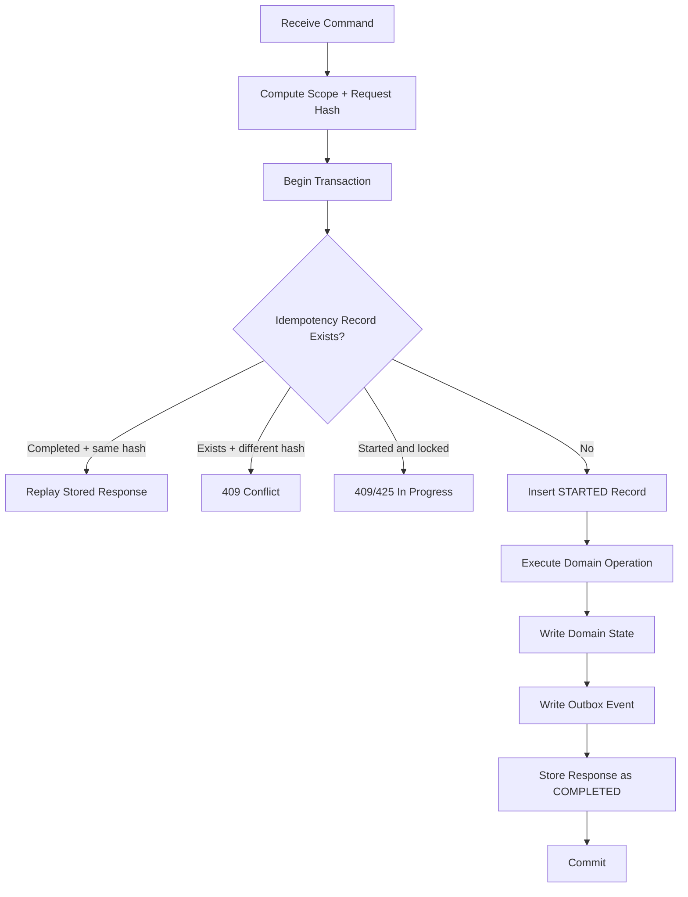
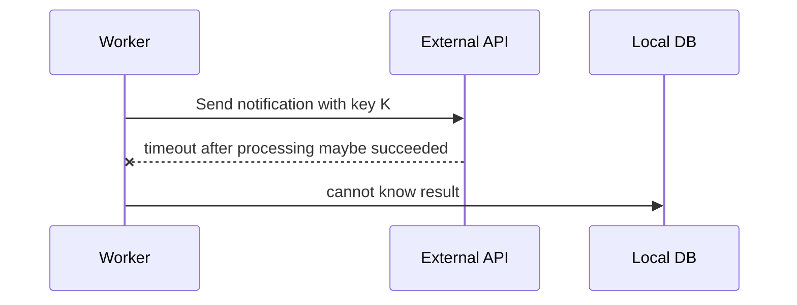
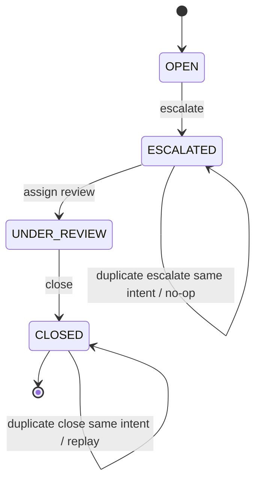
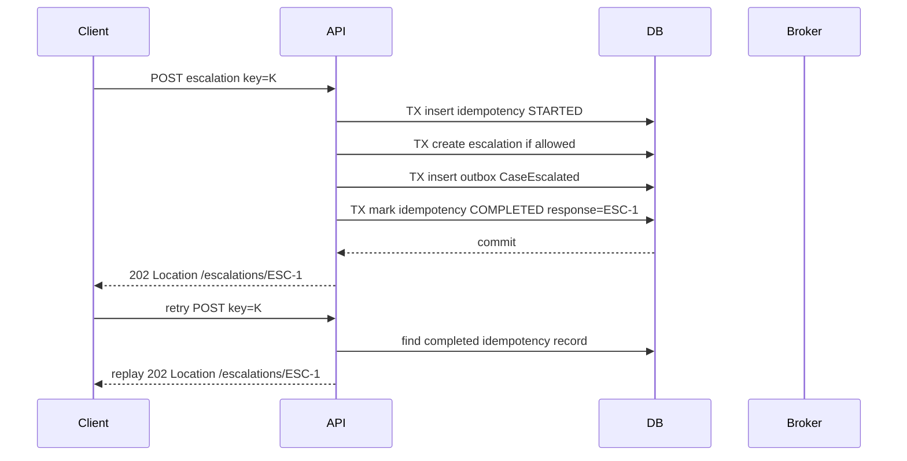

# Part 036 — Idempotency as a First-Class Design Rule

> In distributed systems, duplicate requests are not an edge case. They are a normal consequence of retry, timeout, redelivery, crash recovery, and human impatience. If duplicate execution breaks the business, the design is incomplete.

The previous part covered outbox/inbox. This part zooms into the rule that makes retry safe: **idempotency**.

Most engineers first meet idempotency through HTTP:

```text
GET, PUT, DELETE are idempotent by method semantics.
POST is not automatically idempotent.
```

That is useful, but incomplete.

For microservices, idempotency is not mainly about HTTP verbs. It is about business side effects.

The real question is:

```text
If the same intent is received more than once, can the service produce one correct business outcome?
```

---

## 1. Idempotency: Precise Meaning

A operation is idempotent when applying it multiple times has the same intended effect as applying it once.

Mathematically:

```text
f(f(x)) = f(x)
```

In systems design:

```text
same request intent + same idempotency scope -> one business effect
```

Examples:

| Operation | Idempotent? | Why |
|---|---:|---|
| `Set case status to CLOSED` | Often yes | Repeating set produces same final status |
| `Increment violation count` | No | Repeating increments multiple times |
| `Create review task for case escalation version 17` | Can be | Unique key can ensure one task |
| `Send email` | Usually no | Repeating sends multiple emails |
| `Charge payment` | Must be made idempotent | Duplicate charge is unacceptable |
| `Append audit event` | Depends | Duplicate audit records may distort evidence |

Idempotency is not automatic. It is designed.

---

## 2. Why Duplicates Happen

Duplicates happen even when nobody made a mistake.

Sources:

1. Client timeout after server committed.
2. Load balancer retry.
3. API gateway retry.
4. Service mesh retry.
5. Application retry.
6. Broker at-least-once delivery.
7. Consumer crash before ack.
8. Outbox publisher retry after uncertain send result.
9. User double-click.
10. Mobile client reconnect.
11. Browser refresh/resubmit.
12. Batch replay.
13. Disaster recovery replay.
14. Manual operator replay.



If the server cannot distinguish retry from new intent, it may repeat the side effect.

---

## 3. Idempotency Is About Intent, Not Payload Only

Two requests can have the same payload but represent different business intent.

Example:

```json
{
  "caseId": "CASE-2026-000481",
  "reason": "REPEAT_VIOLATION"
}
```

If this is sent twice with the same idempotency key, it is probably a retry.

If sent twice with different idempotency keys, it might be two separate escalation attempts, or it might still violate domain rule.

Therefore idempotency requires scope:

```text
idempotency scope = actor/client + operation + resource + intent key + time window
```

Bad key:

```text
random UUID only, never stored with operation context
```

Better key:

```text
tenant:client:operation:resource:idempotencyKey
```

Example:

```text
tenant-a:portal-ui:escalate-case:CASE-2026-000481:2a8634e9-8658-4d66-9349-f3c9a2d7f739
```

---

## 4. Idempotency Strategy Types

There is no single strategy. Use the cheapest correct one.

| Strategy | How It Works | Good For |
|---|---|---|
| Natural idempotency | Operation sets state to target value | Status updates, configuration replacement |
| Business unique constraint | DB prevents duplicate business effect | Task creation, one approval per version |
| Idempotency key store | Request key maps to prior result | POST commands, payments, external actions |
| Inbox dedupe | Message ID processed once per consumer | Event consumers |
| Version guard | Apply only if event version is newer | Projections, state transitions |
| Commutative operation | Reordering/duplication acceptable by algebra | Sets, max/min, CRDT-like counters |
| External idempotency key | Send stable key to external API | Payment/email/legacy calls with support |

The best systems combine several.

Example:

```text
API idempotency key + domain invariant + database unique constraint + outbox event ID + consumer inbox
```

---

## 5. Natural Idempotency

Natural idempotency means repeating the operation naturally reaches the same state.

Example:

```java
public void close(CloseReason reason, Actor actor) {
    if (this.status == CaseStatus.CLOSED) {
        return;
    }
    this.status = CaseStatus.CLOSED;
    this.closedReason = reason;
    this.closedBy = actor.id();
    this.closedAt = clock.now();
}
```

But be careful.

This version is not strictly idempotent if repeated with a different reason or actor:

```text
first call: close(reason=A, actor=X)
second call: close(reason=B, actor=Y)
```

A better model:

```java
public CloseCaseResult close(CloseReason reason, Actor actor) {
    if (this.status == CaseStatus.CLOSED) {
        if (!Objects.equals(this.closedReason, reason)) {
            return CloseCaseResult.conflict("Case already closed with different reason");
        }
        return CloseCaseResult.alreadyClosed(this.id);
    }

    this.status = CaseStatus.CLOSED;
    this.closedReason = reason;
    this.closedBy = actor.id();
    this.closedAt = clock.now();
    return CloseCaseResult.closed(this.id);
}
```

Idempotency is not “ignore duplicate blindly”. It is “handle same intent safely and detect conflicting intent.”

---

## 6. Business Unique Constraint

If a business rule says there must be only one thing, encode that in the database.

Example:

```text
There can be only one active supervisor review task per case escalation version.
```

SQL:

```sql
CREATE UNIQUE INDEX uq_supervisor_review_task
    ON review_task (case_id, source_case_version, task_type)
    WHERE task_type = 'SUPERVISOR_REVIEW';
```

Java:

```java
public ReviewTask createSupervisorReview(CaseId caseId, long caseVersion) {
    try {
        return reviewTaskRepository.insert(
                ReviewTask.supervisorReview(caseId, caseVersion)
        );
    } catch (DuplicateKeyException duplicate) {
        return reviewTaskRepository.findSupervisorReview(caseId, caseVersion);
    }
}
```

This is stronger than checking first:

```java
if (!exists()) insert(); // race condition
```

Use the database as the final guard for uniqueness.

---

## 7. Idempotency Key Store

For commands that create side effects, clients should send an idempotency key.

Request:

```http
POST /cases/CASE-2026-000481/escalations
Idempotency-Key: 2a8634e9-8658-4d66-9349-f3c9a2d7f739
Content-Type: application/json

{
  "reasonCode": "REPEAT_VIOLATION",
  "comment": "Repeated breach within review window"
}
```

The server stores the key and result.

Table:

```sql
CREATE TABLE idempotency_record (
    scope              VARCHAR(200) NOT NULL,
    idempotency_key    VARCHAR(200) NOT NULL,
    request_hash       VARCHAR(128) NOT NULL,
    status             VARCHAR(30) NOT NULL,
    response_status    INT NULL,
    response_body      JSONB NULL,
    resource_type      VARCHAR(100) NULL,
    resource_id        VARCHAR(100) NULL,
    error_code         VARCHAR(100) NULL,
    created_at         TIMESTAMPTZ NOT NULL DEFAULT now(),
    locked_until       TIMESTAMPTZ NULL,
    completed_at       TIMESTAMPTZ NULL,
    expires_at         TIMESTAMPTZ NOT NULL,
    PRIMARY KEY (scope, idempotency_key)
);

CREATE INDEX idx_idempotency_record_expires
    ON idempotency_record (expires_at);
```

Status model:

```text
STARTED -> COMPLETED
       └-> FAILED_RETRYABLE
       └-> FAILED_TERMINAL
```

---

## 8. Request Hash: Prevent Key Reuse Bugs

A client must not reuse the same idempotency key with a different payload.

Store a request fingerprint:

```text
hash(method + path + canonical-json-body + tenant + actor + operation)
```

If key exists and hash differs:

```http
409 Conflict
Content-Type: application/problem+json

{
  "type": "https://api.example.com/problems/idempotency-key-reused",
  "title": "Idempotency key reused with different request",
  "status": 409,
  "detail": "The provided Idempotency-Key was already used for a different request."
}
```

This prevents a dangerous class of bugs:

```text
same idempotency key accidentally reused for different command
```

---

## 9. Response Replay

When the same idempotency key is retried with the same request hash, the server can replay the original response.

First call:

```http
202 Accepted
Location: /cases/CASE-2026-000481/escalations/ESC-991
```

Retry:

```http
202 Accepted
Location: /cases/CASE-2026-000481/escalations/ESC-991
Idempotent-Replayed: true
```

Should you replay errors?

Decision:

| Error Type | Replay? | Reason |
|---|---:|---|
| Validation failure | yes | Same request remains invalid |
| Authorization failure | often no | Permissions may change; be careful |
| Conflict due to business state | yes/depends | State-dependent; may need fresh evaluation |
| Server error before side effect | no | Safe to retry |
| Server error after unknown side effect | store unknown/recover | Avoid duplicate side effect |
| Successful creation | yes | Prevent duplicate creation |

Stripe-style APIs commonly store the result of the first request for a key and return the same result on retries. The broader principle is: once the server accepts responsibility for an idempotency key, it must make retries deterministic enough for clients to recover safely.

---

## 10. Idempotency Around Transaction Boundaries

A robust command handler flow:



Key rule:

```text
idempotency record + domain side effect + outbox event must commit atomically.
```

If idempotency record commits but domain effect does not, retries may get stuck.

If domain effect commits but idempotency record does not, retries may duplicate.

---

## 11. Java Idempotency Boundary

Define a small abstraction:

```java
public interface IdempotencyStore {
    IdempotencyDecision startOrReplay(IdempotencyRequest request);
    void complete(IdempotencyCompletion completion);
    void failTerminal(IdempotencyFailure failure);
}
```

Decision model:

```java
public sealed interface IdempotencyDecision {
    record Start(UUID recordId) implements IdempotencyDecision {}
    record Replay(int status, String body) implements IdempotencyDecision {}
    record Conflict(String reason) implements IdempotencyDecision {}
    record InProgress(Duration retryAfter) implements IdempotencyDecision {}
}
```

Command handler:

```java
@Transactional
public EscalateCaseResponse handle(EscalateCaseHttpRequest request) {
    IdempotencyRequest idem = IdempotencyRequest.from(
            request.tenantId(),
            request.actorId(),
            "EscalateCase",
            request.caseId(),
            request.idempotencyKey(),
            request.canonicalBodyHash()
    );

    IdempotencyDecision decision = idempotencyStore.startOrReplay(idem);

    if (decision instanceof IdempotencyDecision.Replay replay) {
        return EscalateCaseResponse.fromStored(replay.status(), replay.body());
    }

    if (decision instanceof IdempotencyDecision.Conflict conflict) {
        throw new IdempotencyConflictException(conflict.reason());
    }

    if (decision instanceof IdempotencyDecision.InProgress inProgress) {
        throw new OperationStillProcessingException(inProgress.retryAfter());
    }

    CaseFile caseFile = caseRepository.getForUpdate(request.caseId());
    Escalation escalation = caseFile.escalate(request.reasonCode(), request.actorId());

    caseRepository.save(caseFile);
    outboxRepository.append(eventMapper.caseEscalated(caseFile, escalation, request));

    EscalateCaseResponse response = EscalateCaseResponse.accepted(escalation.id());
    idempotencyStore.complete(IdempotencyCompletion.from(idem, response));

    return response;
}
```

This makes idempotency part of the application boundary, not a random filter.

---

## 12. Should Idempotency Be Middleware?

Sometimes, but not always.

Middleware can handle:

- extracting idempotency key,
- checking required header,
- canonical request hash,
- generic response replay.

Application service must handle:

- operation scope,
- business resource identity,
- transaction boundary,
- side-effect classification,
- conflict semantics,
- response meaning.

Bad design:

```text
Generic HTTP filter stores response after controller returns, but domain transaction already committed separately.
```

Better design:

```text
HTTP layer parses key, application command handler owns idempotency transaction.
```

Idempotency is too important to hide entirely in infrastructure.

---

## 13. Handling In-Progress Requests

What if the first request is still processing and retry arrives?

Options:

| Response | Meaning | Fit |
|---|---|---|
| `409 Conflict` | Operation with same key is in progress | Simple APIs |
| `425 Too Early` | Retry later; request not ready | Some retry-aware clients |
| `202 Accepted` + status URL | Async operation model | Long-running commands |
| Block/wait briefly | Could reduce client complexity | Risk of thread exhaustion |

For microservices, prefer status URL for long operations:

```http
202 Accepted
Location: /operations/op-2026-000991
Retry-After: 3
```

Do not hold server threads for long-running idempotency waits.

---

## 14. TTL and Retention

Idempotency records cannot live forever in high-volume systems.

But TTL is a business decision, not just storage cleanup.

Questions:

1. How long can clients retry?
2. How long can network failures last?
3. How long can users reasonably resubmit?
4. Is the operation financially/regulatorily sensitive?
5. Do we need audit evidence of duplicate attempts?
6. Can the same business operation naturally happen again later?

Examples:

| Operation | Suggested TTL Thinking |
|---|---|
| Payment charge | Long enough to cover client/network retry and settlement ambiguity |
| Case escalation | Often tied to case version; may be retained as audit evidence |
| Search request | Usually no idempotency needed |
| Notification send | TTL based on notification window |
| File import | Key may be based on file checksum and import batch |

For audit-heavy systems, separate operational TTL from audit retention:

```text
hot idempotency table: 7-30 days
archive/audit evidence: retention policy period
```

---

## 15. HTTP Method Idempotency Is Not Enough

RFC-style HTTP semantics say PUT and DELETE are idempotent, while POST is not automatically idempotent.

But method semantics do not solve your business problem.

Example:

```http
DELETE /cases/CASE-2026-000481/tasks/TASK-123
```

Repeating DELETE may be HTTP-idempotent because final state is task deleted.

But if each delete appends an audit record like:

```text
Actor deleted task
```

then the externally observable audit side effect may not be idempotent.

You need to define idempotency at the business effect layer:

```text
one task deletion decision,
one audit fact,
one notification,
one projection change.
```

---

## 16. Messaging Idempotency

For message consumers, idempotency key is usually the message/event ID.

```java
@Transactional
public void consume(MessageEnvelope<CaseEscalatedV1> message) {
    if (inbox.alreadyProcessed(CONSUMER_NAME, message.eventId())) {
        return;
    }

    inbox.recordProcessing(CONSUMER_NAME, message.eventId());
    handler.apply(message.payload());
    inbox.recordProcessed(CONSUMER_NAME, message.eventId());
}
```

But event ID dedupe alone may not be enough.

Scenario:

```text
Bug causes source service to emit two different event IDs for the same business fact.
```

Consumer should also guard business uniqueness:

```sql
CREATE UNIQUE INDEX uq_notification_once_per_case_escalation
    ON notification (case_id, notification_type, source_case_version);
```

Dedupe by event ID protects against broker duplicates.

Business unique constraints protect against semantic duplicates.

You need both when the side effect matters.

---

## 17. Version Guards for Projections

Projection updates should often be idempotent by version.

Event:

```json
{
  "caseId": "CASE-2026-000481",
  "caseVersion": 17,
  "status": "ESCALATED"
}
```

Projection handler:

```java
@Transactional
public void apply(CaseEscalatedV1 event) {
    CaseOverview overview = repository.findOrCreate(event.caseId());

    if (overview.version() >= event.caseVersion()) {
        return;
    }

    if (overview.version() + 1 != event.caseVersion()) {
        throw new ProjectionGapException(event.caseId(), overview.version(), event.caseVersion());
    }

    overview.markEscalated(event.caseVersion(), event.riskLevel(), event.occurredAt());
    repository.save(overview);
}
```

Three outcomes:

| Condition | Meaning | Action |
|---|---|---|
| event version lower/equal | duplicate or stale | no-op |
| event version exactly next | valid | apply |
| event version has gap | missing event or out-of-order | pause/retry/rebuild |

This is idempotency plus ordering correctness.

---

## 18. Idempotency for External Side Effects

External side effects are hardest because your database cannot enforce what another system does.

Examples:

- sending email,
- SMS,
- payment charge,
- document submission,
- regulator API call,
- legacy case system update.

Pattern:

```text
Local outbox command + stable external idempotency key + stored external result
```

Example:

```java
public void sendSupervisorNotification(NotificationCommand command) {
    String externalKey = "supervisor-notification:%s:%s".formatted(
            command.caseId(),
            command.caseVersion()
    );

    ExternalResponse response = notificationClient.send(
            externalKey,
            command.recipient(),
            command.message()
    );

    notificationAttemptRepository.recordResult(
            command.commandId(),
            externalKey,
            response.providerMessageId(),
            response.status()
    );
}
```

If provider supports idempotency keys, pass your key.

If provider does not, store your own send ledger and make replay a human/operational decision after unknown outcomes.

---

## 19. Unknown Outcome Problem

The hardest failure is not success or failure. It is unknown.



The worker does not know whether the external side effect happened.

Strategies:

| Strategy | Requirement |
|---|---|
| External idempotency key | Provider dedupes repeated call |
| External status lookup | Provider lets you query by key |
| Local pending state | Mark unknown and reconcile later |
| Human review | Needed for high-risk irreversible effects |
| Compensating action | Only if business supports it |

Do not automatically retry irreversible effects without idempotency or status lookup.

---

## 20. Idempotency and State Machines

State machines make idempotency explicit.

Example:



A state transition command should define:

| Question | Example |
|---|---|
| Current allowed states | `OPEN` can become `ESCALATED` |
| Duplicate state behavior | `ESCALATED` + same command returns existing escalation |
| Conflict behavior | `CLOSED` + escalate returns conflict |
| Side effects | outbox event, task creation |
| Idempotency key | command ID or request key |
| Audit event | one audit fact per accepted intent |

State machine + idempotency gives you deterministic duplicate handling.

---

## 21. Audit and Idempotency

Audit systems need special care.

Bad audit behavior:

```text
Duplicate API retry creates duplicate audit facts, making it appear that actor performed action twice.
```

Better audit behavior:

```text
First accepted command creates business audit event.
Duplicate retry creates technical access/retry log if needed, but not another business decision event.
```

Distinguish:

| Record Type | Purpose | Duplicate Retry Handling |
|---|---|---|
| Business audit event | Evidence of decision/action | one per accepted intent |
| Technical request log | Observability/security | may record every request |
| Idempotency record | Retry safety | one per key/scope |
| Integration event | Downstream fact propagation | one per committed domain fact |

This matters for regulatory defensibility.

---

## 22. Canonical Request Hash

Hashing JSON is trickier than it looks.

These two payloads are semantically identical:

```json
{"reasonCode":"REPEAT_VIOLATION","comment":"x"}
```

```json
{
  "comment": "x",
  "reasonCode": "REPEAT_VIOLATION"
}
```

Naive string hash differs.

Use canonicalization:

- normalize JSON field order,
- remove insignificant whitespace,
- normalize number representation,
- normalize Unicode if needed,
- include method/path/tenant/actor/operation,
- avoid hashing volatile headers.

Pseudo:

```java
public String canonicalHash(CommandRequest request) {
    CanonicalJson canonical = jsonCanonicalizer.canonicalize(request.body());
    String fingerprint = String.join("\n",
            request.method(),
            request.pathTemplate(),
            request.tenantId(),
            request.actorId(),
            request.operationName(),
            canonical.value()
    );
    return sha256(fingerprint);
}
```

Never use only the raw request body as the idempotency fingerprint.

---

## 23. Concurrency Control

Two identical retries may arrive at the same time.

The idempotency store must be race-safe.

Anti-pattern:

```java
if (!idempotencyStore.exists(key)) {
    idempotencyStore.insert(key);
    executeSideEffect();
}
```

Race:

```text
Thread A checks: absent
Thread B checks: absent
Both insert/execute or one fails after effect starts
```

Correct pattern:

```sql
INSERT INTO idempotency_record(scope, idempotency_key, request_hash, status, expires_at)
VALUES (?, ?, ?, 'STARTED', ?)
ON CONFLICT (scope, idempotency_key) DO NOTHING;
```

Then inspect whether insert succeeded.

If insert did not succeed, load existing record and decide replay/conflict/in-progress.

Use database uniqueness as the arbiter.

---

## 24. Idempotency Response Semantics

Possible responses:

| Case | Response |
|---|---|
| First execution success | normal success |
| Duplicate after success | same status/body or equivalent resource reference |
| Same key different hash | `409 Conflict` |
| First execution still running | `202 Accepted`, `409`, or `Retry-After` |
| Previous failed before side effect | allow retry |
| Previous failed after terminal validation | replay validation error |
| Unknown external outcome | return operation status requiring reconciliation |

For async commands, a clean response is:

```http
202 Accepted
Location: /operations/op-2026-00991
```

Then idempotency retry returns the same operation URL.

---

## 25. Idempotency Key Generation

Client-generated key is usually better for API retries because the client knows retry intent.

Rules for clients:

```text
Generate a new key for each new business intent.
Reuse the same key for retries of the same intent.
Do not reuse keys across different operations/resources.
Use high-entropy random keys or deterministic operation keys where appropriate.
```

Server-generated deterministic keys are useful for internal workflows:

```text
create-review-task:CASE-2026-000481:caseVersion:17
send-supervisor-notification:CASE-2026-000481:caseVersion:17:supervisor:USR-1901
```

Do not use timestamps alone.

Do not use user ID alone.

Do not use request body hash alone.

---

## 26. Interaction with Retries

Retry without idempotency is gambling.

Retry-safe classification:

| Operation Type | Retry Safe? | Requirement |
|---|---:|---|
| Read query | usually | timeout and cache policy |
| Set state to value | often | conflict/version rules |
| Create resource | only with key/unique constraint | idempotency key |
| Send notification | only with dedupe/external key | send ledger |
| Charge/refund | only with provider idempotency | strong key + lookup |
| Increment counter | no, unless operation ID deduped | operation ledger |
| Consume event | yes if inbox/idempotent | event ID + business guard |

A resilient service defines retry policy and idempotency policy together.

---

## 27. Idempotency Smells

| Smell | Why Dangerous | Better Design |
|---|---|---|
| “Retries disabled so we don’t need idempotency” | Clients/brokers/operators still retry | Design duplicate safety |
| Idempotency key accepted but not stored transactionally | Duplicate can still happen | Store with side effect in same transaction |
| Same key with different payload allowed | Incorrect replay | Request hash conflict |
| Dedupe only in cache | Cache loss allows duplicate side effect | Durable store for critical ops |
| Check-then-insert uniqueness | Race condition | DB unique constraint / upsert |
| Duplicate silently ignored | Hides conflicting intent | Compare request hash / domain state |
| Audit duplicated on retry | False evidence | One business audit per accepted intent |
| No TTL policy | Table grows forever or key reuse breaks | Explicit retention model |
| External side effect retried blindly | Double-send/double-charge | External key/status/reconciliation |
| Consumer dedupes by offset only | Replay breaks | Event ID + inbox |

---

## 28. Design Checklist

For every command endpoint or message consumer, ask:

1. What is the business side effect?
2. What duplicate inputs can occur?
3. What identifies same intent?
4. What identifies conflicting intent?
5. What is the idempotency scope?
6. Is there a durable idempotency record?
7. Is the dedupe guard in the same transaction as the side effect?
8. Is there a database unique constraint for the business effect?
9. What response is replayed?
10. What happens if the request is still in progress?
11. What is the TTL/retention policy?
12. Does retry produce duplicate audit events?
13. Does outbox event duplicate cause duplicate consumer side effect?
14. Does external API support idempotency key?
15. How are unknown outcomes reconciled?
16. What metrics show duplicate rate?
17. What alert fires when idempotency conflicts spike?
18. Can operators safely replay the command/message?

---

## 29. Metrics

Idempotency metrics:

```text
idempotency.started.count
idempotency.replayed.count
idempotency.conflict.count
idempotency.in_progress.count
idempotency.expired.count
idempotency.unknown_outcome.count
idempotency.store.latency.ms
```

Business duplicate protection metrics:

```text
review_task.duplicate_prevented.count
notification.duplicate_suppressed.count
projection.stale_event_ignored.count
message.duplicate_consumed.count
```

High duplicate rate can indicate:

- client timeout too short,
- slow service,
- gateway retry misconfiguration,
- consumer ack failure,
- broker redelivery storm,
- user double-submit issue,
- external provider instability.

Duplicate rate is a reliability signal.

---

## 30. Worked Example: Retry-Safe Case Escalation API

Endpoint:

```http
POST /cases/{caseId}/escalations
Idempotency-Key: <client-generated-key>
```

Business rule:

```text
A case version can have at most one escalation action.
Duplicate retry returns same escalation ID.
Different reason for same idempotency key returns conflict.
Escalating already closed case returns business conflict.
```

Database guards:

```sql
CREATE UNIQUE INDEX uq_escalation_per_case_version
    ON case_escalation (case_id, source_case_version);

CREATE UNIQUE INDEX uq_idempotency
    ON idempotency_record (scope, idempotency_key);
```

Flow:



This design is retry-safe at the API layer and event-safe at the messaging layer.

---

## 31. Mental Model Summary

Idempotency is not a decorator. It is a correctness property.

Use this mental model:

```text
Retry is inevitable.
Duplicate delivery is normal.
Timeout means unknown, not failed.
Idempotency turns unknown outcomes into recoverable outcomes.
```

A production-grade Java microservice should treat idempotency as part of:

- API design,
- command handling,
- database constraints,
- outbox/inbox messaging,
- external integration,
- audit design,
- retry policy,
- observability.

The goal is not to prevent duplicate requests.

The goal is to ensure duplicate requests cannot corrupt business state.

---

## 32. Exercises

### Exercise 1 — Classify Operations

Classify these operations:

```text
Create case
Escalate case
Close case
Assign reviewer
Send notification
Generate regulatory report
Increment risk score
Import evidence file
```

For each, decide:

- naturally idempotent,
- requires idempotency key,
- requires unique constraint,
- requires inbox,
- requires external idempotency.

### Exercise 2 — Design Idempotency Scope

Design an idempotency scope for:

```text
POST /cases/{caseId}/decisions
```

Include tenant, actor, operation, resource, and key.

### Exercise 3 — Unknown Outcome

An external notification provider times out after receiving your request.

Define:

- retry rule,
- idempotency key,
- status lookup strategy,
- reconciliation job,
- operator playbook.

### Exercise 4 — Audit Safety

Design audit behavior for duplicate retries of:

```text
Approve enforcement action
```

Separate business audit event from technical request log.

### Exercise 5 — Concurrency Test

Write a test scenario where two identical requests with the same idempotency key arrive concurrently.

Expected result:

```text
one side effect,
one completed idempotency record,
second request replays or waits,
no duplicate audit event,
no duplicate outbox event.
```

---

## References

- RFC 9110 — HTTP method semantics and idempotent methods.
- Stripe API Documentation — Idempotent requests and idempotency keys.
- Stripe Engineering — Designing robust and predictable APIs with idempotency.
- Chris Richardson, Microservices Patterns — Idempotent Consumer pattern.
- Debezium documentation — Outbox pattern and reliable data exchange.
