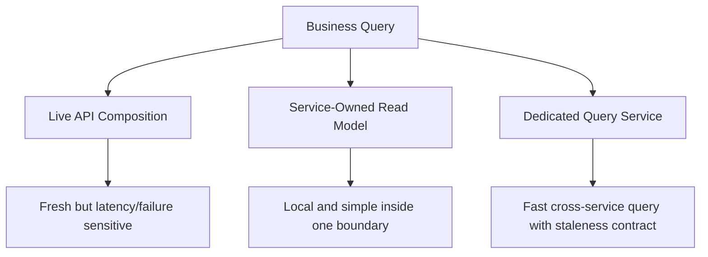
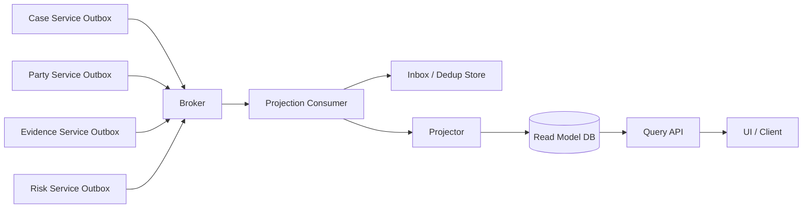
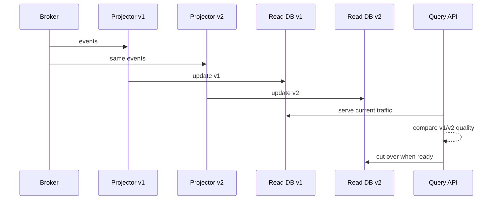
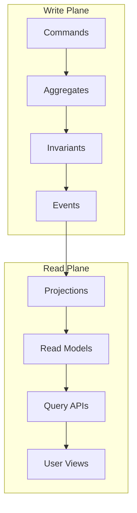

# Part 037 — Read Models and Query-Side Design

> In a microservice system, the write model protects truth. The read model protects user experience. A mature architecture knows they are not always the same model.

The previous parts established three hard rules:

1. A service owns its data.
2. A transaction should usually stay inside one service.
3. Cross-service state changes need explicit consistency, idempotency, and reconciliation.

Now we face a very practical problem:

```text
Users do not query one service.
Users query a business view.
```

A case officer does not think:

```text
Fetch Case Service.
Then Party Service.
Then Evidence Service.
Then Risk Service.
Then Decision Service.
Then join everything in the UI.
```

They think:

```text
Show me the case dashboard.
Show me overdue escalations.
Show me cases by risk, region, assigned reviewer, SLA, and enforcement status.
```

If every query becomes a live distributed join, your system becomes slow, fragile, and hard to operate.

This part teaches how to design **read models** and **query-side services** without violating data ownership.

---

## 1. The Core Problem

Microservices optimize write ownership:

```text
Case Service owns case lifecycle.
Party Service owns party profile.
Evidence Service owns evidence metadata.
Decision Service owns regulatory decision.
Risk Service owns risk assessment.
```

But product screens often need combined views:

```text
Case dashboard = case + party + evidence count + latest risk + pending decision + SLA status.
```

That creates tension.

| Force | Write-side answer | Read-side pressure |
|---|---|---|
| Ownership | One service owns truth | UI needs cross-domain view |
| Consistency | Local transaction | User wants coherent dashboard |
| Scalability | Service-local DB | Query needs filtering/sorting across fields |
| Latency | Avoid distributed transaction | Avoid N+1 remote calls |
| Change | Domain model evolves independently | Dashboard shape changes frequently |
| Security | Owner enforces access | Query result must not leak data |

The naive solution is a shared database.

The mature solution is an explicit read model.

---

## 2. Read Model: Precise Definition

A **read model** is a query-optimized representation of data derived from one or more authoritative sources.

It is not necessarily the source of truth.

It exists to answer a specific query or user journey efficiently.

```text
Read model = projection of authoritative facts optimized for reading.
```

A read model may be:

- a table in the same service database,
- a denormalized table in a query service,
- a search index,
- a cache,
- a materialized view,
- a document store projection,
- a graph projection,
- a reporting warehouse table,
- an in-memory view for a bounded workload.

The key is not the technology.

The key is the contract:

```text
Who owns this read model?
What sources feed it?
How stale can it be?
How is it rebuilt?
What does it guarantee?
Who is allowed to depend on it?
```

---

## 3. Command Model vs Query Model

A command model is optimized to protect invariants.

A query model is optimized to answer questions.

They have different shapes.

### Command-side model

```java
public final class CaseFile {
    private final CaseId id;
    private CaseStatus status;
    private ReviewerId assignedReviewer;
    private RiskLevel riskLevel;
    private final List<CaseEvent> events = new ArrayList<>();

    public void escalate(EscalationReason reason, Instant now) {
        if (!status.canEscalate()) {
            throw new DomainViolation("Case cannot be escalated from " + status);
        }
        this.status = CaseStatus.ESCALATED;
        this.events.add(new CaseEscalated(id, reason, now));
    }
}
```

This model exists to enforce rules.

### Query-side model

```java
public record CaseDashboardRow(
    String caseId,
    String caseNumber,
    String partyDisplayName,
    String assignedReviewerName,
    String status,
    String riskLevel,
    int openEvidenceCount,
    Instant openedAt,
    Instant slaDueAt,
    boolean overdue
) {}
```

This model exists to answer a screen efficiently.

Trying to use one model for both often produces a bad compromise:

- command model becomes anemic and query-shaped,
- query becomes slow because it respects write normalization too much,
- write invariants get polluted by UI concerns,
- read logic starts calling random domain internals.

---

## 4. Three Query Strategies

When a user needs cross-service data, you usually have three options.



### Strategy 1 — Live API Composition

A composer calls multiple services at request time and joins results in memory.

Use it when:

- data must be fresh,
- fan-out is small,
- query volume is low or moderate,
- partial result is acceptable,
- filtering/sorting is not across many remote fields.

Avoid it when:

- dashboard has high traffic,
- fan-out grows with result size,
- query needs sorting/filtering across remote attributes,
- downstream failures break the main journey,
- latency budget is tight.

### Strategy 2 — Service-Owned Read Model

A service maintains a local projection to support its own queries.

Example:

```text
Case Service owns case lifecycle.
Case Service keeps a local table case_dashboard_summary.
It is fed by local case events and selected external facts.
```

Use it when:

- the view primarily belongs to one domain,
- external facts are small snapshots,
- the owning service can define the read contract,
- the query is part of that service's product surface.

### Strategy 3 — Dedicated Query Service

A query service owns a read model assembled from events/snapshots across multiple services.

Example:

```text
Case Workspace Query Service
- consumes CaseOpened, CaseEscalated, EvidenceAttached, RiskAssessed, DecisionIssued
- stores case_workspace_view
- exposes dashboard/search API
```

Use it when:

- the query is cross-domain by nature,
- the read workload is high,
- filtering/sorting/search is complex,
- multiple clients need the same view,
- live fan-out would be too expensive.

---

## 5. The Rule: Source Owns Truth, View Owns Shape

A read model must not silently become the system of record.

Use this rule:

```text
Source service owns truth.
Read model owner owns query shape.
```

Example:

| Data | Source of truth | Query-side representation |
|---|---|---|
| Case status | Case Service | copied status string/code |
| Party legal name | Party Service | display name snapshot |
| Evidence count | Evidence Service | denormalized count |
| Risk level | Risk Service | latest risk label + assessedAt |
| Decision outcome | Decision Service | latest decision summary |
| SLA overdue flag | Case/Workflow policy | computed projection field |

The query side may store copied data, but it must not become the authority to modify that data.

Bad:

```text
Dashboard service updates case status directly.
```

Good:

```text
Dashboard service displays case status derived from CaseStatusChanged events.
Status changes still go through Case Service command API.
```

---

## 6. Read Model Ownership Types

Not all read models have the same ownership meaning.

### 6.1 Internal read model

Private to one service.

```text
Case Service DB:
- case_file
- case_event_outbox
- case_assignment_read_model
```

No other service reads it directly.

### 6.2 Public query API model

Owned by a service and exposed as API.

```text
GET /cases/{id}/summary
GET /cases/search
```

Consumers depend on the API contract, not the table.

### 6.3 Dedicated query service model

Owned by a query service.

```text
Case Workspace Query Service owns dashboard projection.
```

It is a product/service with its own SLO and lifecycle.

### 6.4 Analytical read model

Owned by analytics/reporting platform.

```text
Data warehouse, lakehouse, BI model, compliance reporting mart.
```

This is not for operational command decisions unless explicitly designed for that.

---

## 7. Read Model Design Card

Every serious read model should have a design card.

```yaml
readModel: case_workspace_view
owner: case-workspace-query-service
purpose: Fast dashboard and search for case officers
consumers:
  - case-officer-ui
  - supervisor-workbench
sources:
  - Case Service: CaseOpened, CaseStatusChanged, CaseAssigned
  - Party Service: PartyProfileChanged
  - Evidence Service: EvidenceAttached, EvidenceRemoved
  - Risk Service: RiskAssessed
  - Decision Service: DecisionIssued
freshness:
  targetP95: 5s
  maximumTolerated: 60s
consistency:
  type: eventually-consistent
  userVisibleLabel: "Updated within the last minute"
identity:
  primaryKey: tenant_id + case_id
security:
  rowFilter: tenant_id + authorizedRegion
  piiFields:
    - partyDisplayName
rebuild:
  method: replay events from offsets + snapshot backfill
  expectedDuration: 45m
failurePolicy:
  staleAllowed: true
  staleWarningAfter: 60s
  unavailableFallback: show case list without risk/evidence fragments
metrics:
  - projection_lag_seconds
  - projection_apply_failures_total
  - read_model_rebuild_duration_seconds
  - stale_rows_count
```

If a read model does not have a freshness and rebuild story, it is not production-grade.

---

## 8. Projection Pipeline

A projection transforms source facts into read model rows.



Projection responsibilities:

1. Consume events.
2. Deduplicate messages.
3. Validate schema/version.
4. Apply event to read model.
5. Track source offsets/version.
6. Emit projection metrics.
7. Send invalid messages to DLQ.
8. Support replay/rebuild.

A projector is not just a message listener. It is a state transformation component.

---

## 9. Example: Case Workspace Projection

Imagine these events:

```java
public record CaseOpened(
    String eventId,
    String tenantId,
    String caseId,
    String caseNumber,
    Instant openedAt
) {}

public record CaseAssigned(
    String eventId,
    String tenantId,
    String caseId,
    String reviewerId,
    String reviewerName,
    Instant assignedAt
) {}

public record RiskAssessed(
    String eventId,
    String tenantId,
    String caseId,
    String riskLevel,
    Instant assessedAt
) {}

public record EvidenceAttached(
    String eventId,
    String tenantId,
    String caseId,
    String evidenceId,
    Instant attachedAt
) {}
```

The read model row:

```java
public record CaseWorkspaceDocument(
    String tenantId,
    String caseId,
    String caseNumber,
    String status,
    String assignedReviewerId,
    String assignedReviewerName,
    String latestRiskLevel,
    Instant latestRiskAssessedAt,
    int evidenceCount,
    Instant openedAt,
    Instant updatedAt,
    long sourceVersion
) {}
```

Projector sketch:

```java
public final class CaseWorkspaceProjector {
    private final CaseWorkspaceReadModelRepository repository;
    private final ProcessedMessageRepository inbox;

    public void on(EventEnvelope envelope) {
        if (inbox.alreadyProcessed(envelope.messageId())) {
            return;
        }

        switch (envelope.type()) {
            case "CaseOpened" -> apply(envelope.to(CaseOpened.class));
            case "CaseAssigned" -> apply(envelope.to(CaseAssigned.class));
            case "RiskAssessed" -> apply(envelope.to(RiskAssessed.class));
            case "EvidenceAttached" -> apply(envelope.to(EvidenceAttached.class));
            default -> throw new UnknownEventType(envelope.type());
        }

        inbox.markProcessed(envelope.messageId(), envelope.occurredAt());
    }

    private void apply(CaseOpened event) {
        repository.upsertNewCase(
            event.tenantId(),
            event.caseId(),
            event.caseNumber(),
            event.openedAt()
        );
    }

    private void apply(CaseAssigned event) {
        repository.updateAssignment(
            event.tenantId(),
            event.caseId(),
            event.reviewerId(),
            event.reviewerName(),
            event.assignedAt()
        );
    }

    private void apply(RiskAssessed event) {
        repository.updateRiskIfNewer(
            event.tenantId(),
            event.caseId(),
            event.riskLevel(),
            event.assessedAt()
        );
    }

    private void apply(EvidenceAttached event) {
        repository.incrementEvidenceCount(
            event.tenantId(),
            event.caseId(),
            event.evidenceId()
        );
    }
}
```

Important detail:

```java
repository.updateRiskIfNewer(...)
```

A projection must defend against out-of-order events.

---

## 10. Idempotent Projection Update

A projection update must be idempotent.

Bad:

```sql
UPDATE case_workspace
SET evidence_count = evidence_count + 1
WHERE case_id = :case_id;
```

If the same event is processed twice, the count is wrong.

Better:

```sql
INSERT INTO projected_evidence_item (
    tenant_id,
    case_id,
    evidence_id,
    attached_at
) VALUES (
    :tenant_id,
    :case_id,
    :evidence_id,
    :attached_at
) ON CONFLICT (tenant_id, evidence_id) DO NOTHING;

UPDATE case_workspace cw
SET evidence_count = src.count
FROM (
    SELECT tenant_id, case_id, COUNT(*) AS count
    FROM projected_evidence_item
    WHERE tenant_id = :tenant_id AND case_id = :case_id
    GROUP BY tenant_id, case_id
) src
WHERE cw.tenant_id = src.tenant_id
  AND cw.case_id = src.case_id;
```

Or maintain a processed-message table in the same transaction as the projection update.

```sql
CREATE TABLE projection_inbox (
    consumer_name text NOT NULL,
    message_id text NOT NULL,
    processed_at timestamptz NOT NULL,
    PRIMARY KEY (consumer_name, message_id)
);
```

The write model may be correct, but a non-idempotent read projection can still corrupt user-facing state.

---

## 11. Staleness Contract

Every asynchronous read model is stale sometimes.

Do not hide that fact.

Define a staleness contract:

```text
What is the acceptable lag?
What happens when lag exceeds it?
How does the user know?
What actions are blocked during stale state?
What actions are still allowed?
```

Example:

| View | Normal lag | Max tolerated | Behavior when stale |
|---|---:|---:|---|
| Case dashboard | < 5s | 60s | Show stale indicator |
| Enforcement decision screen | < 2s | 10s | Refresh from source before final decision |
| Public statistics | < 1h | 24h | Show generated-at timestamp |
| Audit evidence reconstruction | 0 tolerance for missing evidence | N/A | Use authoritative event/audit store |

A query-side design is incomplete until it defines staleness.

---

## 12. Read-Your-Writes UX Pattern

A common problem:

1. User submits command.
2. Command succeeds.
3. UI reloads dashboard.
4. Dashboard projection has not caught up.
5. User thinks the command failed.

Options:

### Option A — Return command result with enough data

```json
{
  "caseId": "CASE-123",
  "newStatus": "ESCALATED",
  "acceptedAt": "2026-07-05T09:30:00Z",
  "projectionHint": "dashboard may update within 5 seconds"
}
```

### Option B — Client-side optimistic update

The UI temporarily shows the expected result.

Risk: must reconcile if the projection disagrees.

### Option C — Poll command status

```text
POST /cases/CASE-123/escalations -> 202 Accepted
GET /commands/CMD-789 -> COMPLETED
GET /case-dashboard/CASE-123 -> eventually updated
```

### Option D — Read from authoritative source for critical confirmation

For final regulatory decisions, refresh from the source service before showing irreversible action confirmation.

---

## 13. Query API Shape

A query API should expose query semantics, not table structure.

Bad:

```http
GET /case_workspace_table?where=status%3DOPEN&join=party
```

Better:

```http
GET /case-workspace/cases?status=OPEN&assignedReviewerId=R-17&riskLevel=HIGH&pageSize=50
```

For complex search:

```http
POST /case-workspace/searches
Content-Type: application/json

{
  "filters": {
    "status": ["OPEN", "ESCALATED"],
    "riskLevel": ["HIGH", "CRITICAL"],
    "openedBetween": {
      "from": "2026-01-01",
      "to": "2026-07-05"
    }
  },
  "sort": [
    { "field": "slaDueAt", "direction": "ASC" }
  ],
  "page": {
    "size": 50,
    "cursor": null
  }
}
```

This is acceptable when the operation is query-like and does not create business state.

---

## 14. Cursor Pagination for Read Models

Offset pagination becomes expensive and unstable under concurrent changes.

Prefer cursor/keyset pagination for large operational views.

```sql
SELECT *
FROM case_workspace
WHERE tenant_id = :tenant_id
  AND status = :status
  AND (sla_due_at, case_id) > (:last_sla_due_at, :last_case_id)
ORDER BY sla_due_at ASC, case_id ASC
LIMIT :limit;
```

Cursor response:

```json
{
  "items": [
    {
      "caseId": "CASE-123",
      "caseNumber": "REG-2026-000123",
      "status": "ESCALATED",
      "riskLevel": "HIGH",
      "slaDueAt": "2026-07-06T10:00:00Z"
    }
  ],
  "nextCursor": "eyJzbGFE...",
  "projectionWatermark": "2026-07-05T09:31:12Z"
}
```

Include a projection watermark when staleness matters.

---

## 15. Projection Watermark

A watermark tells consumers how far the read model has caught up.

Types:

| Watermark | Meaning |
|---|---|
| event timestamp watermark | latest event occurredAt applied |
| broker offset watermark | latest broker offset applied |
| source version watermark | latest version per aggregate/source |
| wall-clock refresh watermark | last successful refresh time |

Example API metadata:

```json
{
  "data": { },
  "meta": {
    "generatedAt": "2026-07-05T09:31:20Z",
    "sourceWatermarks": {
      "case-service": "2026-07-05T09:31:10Z",
      "risk-service": "2026-07-05T09:30:59Z",
      "evidence-service": "2026-07-05T09:31:03Z"
    },
    "stale": false
  }
}
```

For audit-sensitive workflows, a watermark is not decoration. It is part of the correctness signal.

---

## 16. Rebuildability

A read model is disposable only if it can be rebuilt.

That means:

1. source events or snapshots are retained,
2. projection code is deterministic enough,
3. schema migrations are planned,
4. rebuild time is acceptable,
5. rebuild does not overload source services,
6. consumers know whether the view is rebuilding,
7. old and new projection versions can run side by side.

Rebuild strategies:

| Strategy | Use when | Risk |
|---|---|---|
| Full event replay | complete event history exists | slow, schema evolution complexity |
| Snapshot + incremental events | large history | snapshot correctness |
| Source API backfill | no events available | source overload, pagination consistency |
| Dual projection | migrating read model | doubled processing cost |
| Blue-green read model | critical read path | cutover complexity |

---

## 17. Projection Versioning

Read models evolve.

Avoid destructive in-place change for critical views.

```text
case_workspace_v1
case_workspace_v2
```

Flow:



This is similar to expand-contract migration for APIs/databases.

---

## 18. Read Model Storage Choice

Do not start with technology. Start with query shape.

| Query shape | Possible storage |
|---|---|
| exact lookup by ID | relational table, key-value store |
| filtered operational list | relational table with indexes |
| full-text search | search engine |
| faceted search | search engine/document store |
| graph traversal | graph database/projection |
| time-series dashboard | time-series store/OLAP |
| large analytical aggregation | warehouse/lakehouse |
| low-latency session view | cache/document store |

A relational table is often enough.

Do not introduce Elasticsearch, Kafka Streams, Flink, Cassandra, Redis, or graph databases because they sound sophisticated. Use them when the query shape demands them.

---

## 19. Security and Privacy in Read Models

Read models often duplicate sensitive data.

That increases risk.

Rules:

1. Copy only fields needed by the query.
2. Store display-safe values where possible.
3. Preserve tenant and authorization dimensions.
4. Redact fields at projection time when the view never needs raw data.
5. Avoid storing secrets or high-sensitivity identifiers.
6. Track PII fields in the read model design card.
7. Apply retention rules.
8. Make rebuild/backfill privacy-safe.

Example:

```yaml
pii:
  fields:
    partyDisplayName: moderate
    nationalIdentifier: prohibited
    address: prohibited
  redaction:
    caseOfficer: visible
    supervisor: visible
    analytics: masked
```

A read model can violate privacy even when every source service is secure.

---

## 20. Authorization on Query Side

Never assume query-side data is safe because it is denormalized.

Authorization options:

| Approach | Description | Trade-off |
|---|---|---|
| row-level attributes | store tenant/region/team/classification in row | fast but must stay updated |
| source authorization check | call source service before returning detail | fresh but adds latency |
| precomputed access list | projection stores authorized principal/group | complex invalidation |
| policy engine at query time | evaluate policy with row attributes | flexible but needs good attributes |
| split views by audience | separate read models per role | duplication but simpler safety |

For high-risk domains, prefer explicit security attributes in the read model:

```sql
tenant_id
region_code
classification_level
assigned_team_id
restricted_flag
```

Do not filter only in the UI.

---

## 21. Read Model Smells

### Smell 1 — Shared database query

```text
Service A queries Service B's tables for dashboard.
```

This breaks ownership.

### Smell 2 — Hidden source of truth

```text
Query service starts accepting writes to fix stale data.
```

The read side has become a shadow system of record.

### Smell 3 — No staleness contract

```text
Eventually consistent, but nobody knows eventually means 2 seconds or 2 days.
```

### Smell 4 — Non-rebuildable projection

```text
Projection table is critical, but no one knows how to recreate it.
```

### Smell 5 — Infinite fan-out query

```text
List 100 cases, then call 5 services per case.
```

This creates N x M dependency pressure.

### Smell 6 — Search index as command source

```text
Business decisions are made from stale search index data.
```

For irreversible commands, validate against authoritative source.

---

## 22. Operational Metrics

A read model needs its own operational telemetry.

Metrics:

```text
projection_lag_seconds
projection_events_applied_total
projection_events_failed_total
projection_dlq_total
projection_rebuild_duration_seconds
projection_rebuild_failures_total
read_model_rows_total
read_model_stale_rows_total
query_latency_ms
query_error_total
query_cache_hit_ratio
source_watermark_age_seconds
```

Logs:

```json
{
  "event": "projection_apply_failed",
  "projection": "case_workspace_view",
  "sourceService": "risk-service",
  "messageId": "evt-123",
  "caseId": "CASE-123",
  "reason": "out_of_order_version",
  "action": "ignored_older_event"
}
```

Trace span attributes:

```text
projection.name=case_workspace_view
projection.event.type=RiskAssessed
projection.source.service=risk-service
projection.lag.ms=4210
```

---

## 23. Query-Side Testing

Test categories:

| Test | Purpose |
|---|---|
| projection unit test | one event transforms row correctly |
| idempotency test | duplicate event does not duplicate side effect |
| ordering test | older event cannot overwrite newer state |
| replay test | event sequence rebuilds expected state |
| schema evolution test | old event version still applies |
| security test | unauthorized rows are not returned |
| staleness test | stale watermark triggers expected behavior |
| rebuild test | projection can be recreated from source |

Example projection test:

```java
@Test
void duplicateEvidenceAttachedDoesNotIncreaseCountTwice() {
    var event = new EvidenceAttached(
        "evt-1",
        "tenant-a",
        "case-123",
        "evidence-999",
        Instant.parse("2026-07-05T10:00:00Z")
    );

    projector.on(envelope(event));
    projector.on(envelope(event));

    var row = repository.find("tenant-a", "case-123").orElseThrow();
    assertThat(row.evidenceCount()).isEqualTo(1);
}
```

---

## 24. Architecture Review Checklist

Ask these questions:

### Ownership

- Who owns the read model?
- Which service owns each source fact?
- Can anyone write directly to the read model?
- Is the read model allowed to influence commands?

### Consistency

- What is the target lag?
- What is the maximum tolerated lag?
- How does the UI behave when stale?
- Are critical commands validated against source?

### Projection

- Are events idempotently applied?
- Is out-of-order delivery handled?
- Is replay supported?
- Is schema evolution handled?

### Security

- Are tenant/security attributes projected?
- Is PII minimized?
- Are authorization rules enforced server-side?
- Is retention defined?

### Operations

- Are projection lag and DLQ monitored?
- Is rebuild documented?
- Is there a runbook for stale read model?
- Is there a reconciliation job?

---

## 25. Mental Model Summary

Think of a microservice system as two planes.



The write plane answers:

```text
Is this change allowed?
```

The read plane answers:

```text
What does the user need to see quickly and safely?
```

A top-level engineer keeps these separate without making them disconnected.

---

## 26. Exercises

### Exercise 1 — Dashboard Read Model

Design a read model for:

```text
Supervisor dashboard showing all high-risk enforcement cases due within 7 days.
```

Define:

- source services,
- fields,
- staleness target,
- authorization attributes,
- rebuild strategy,
- failure behavior.

### Exercise 2 — Projection Idempotency

Given an event:

```text
EvidenceAttached(caseId, evidenceId)
```

Design SQL or Java logic that prevents duplicate evidence count.

### Exercise 3 — Query Strategy Selection

Choose between live API composition, service-owned read model, and dedicated query service for:

1. case detail page,
2. supervisor dashboard,
3. public monthly statistics,
4. final enforcement approval screen.

Explain why.

### Exercise 4 — Staleness Contract

Define a staleness contract for:

```text
Risk score shown on case detail page.
```

Include normal lag, maximum lag, stale UI behavior, and command validation behavior.

### Exercise 5 — Rebuild Plan

Your read model table is corrupted by a projector bug.

Design a rebuild plan:

- source data,
- replay order,
- consumer impact,
- cutover strategy,
- validation checks.

---

## References

- Martin Fowler — CQRS.
- Microsoft Azure Architecture Center — CQRS pattern.
- Microsoft Azure Architecture Center — Materialized View pattern.
- Chris Richardson, microservices.io — CQRS pattern.
- Chris Richardson, microservices.io — API Composition pattern.
- AWS Prescriptive Guidance — API composition and data persistence patterns for microservices.
