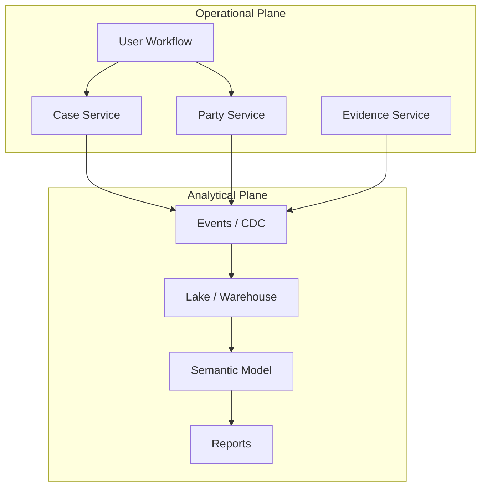
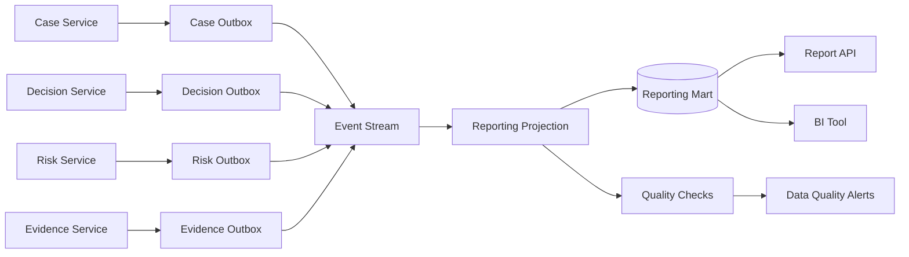
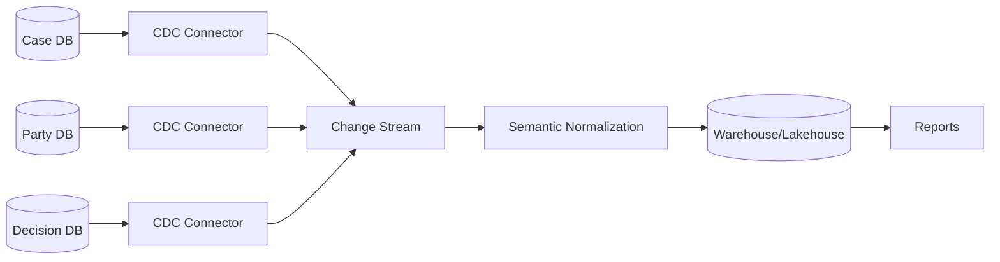
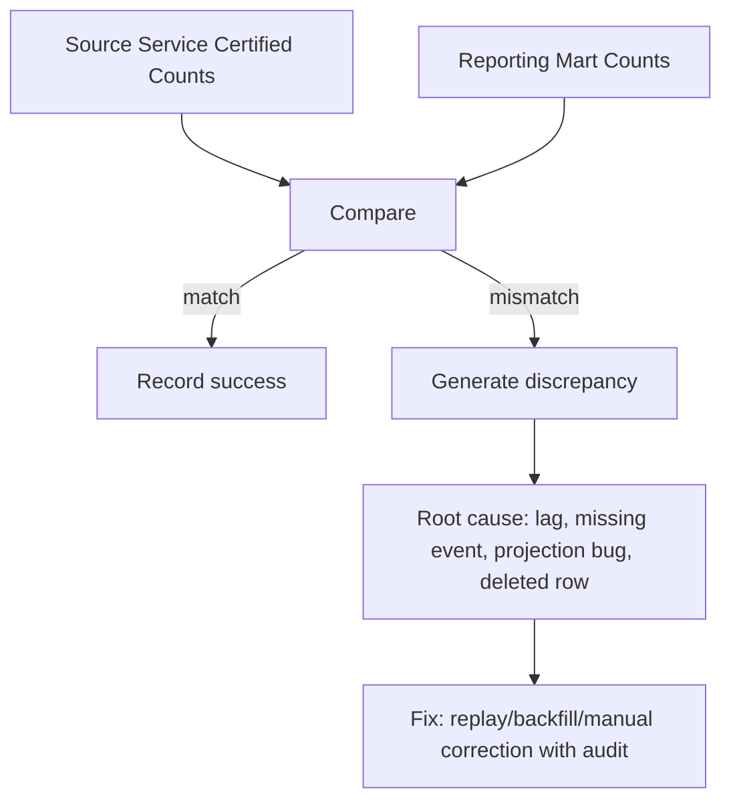
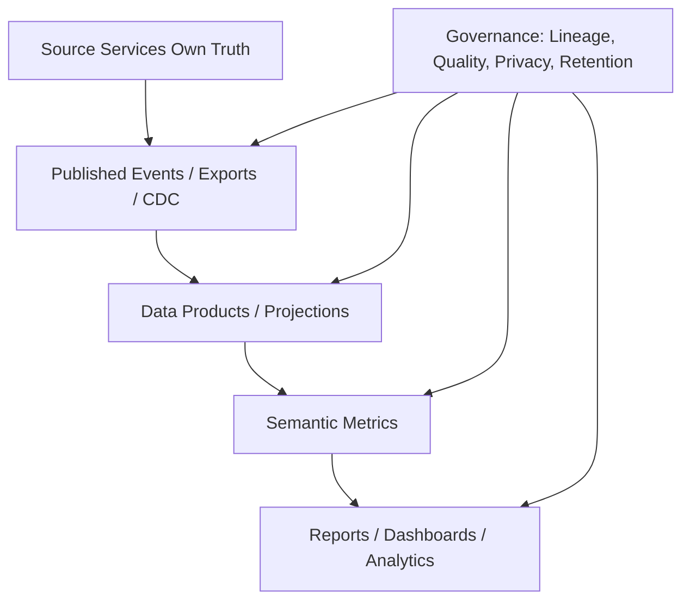

# Part 038 — Cross-Service Reporting and Analytics

> Reporting is where many microservice architectures quietly become monoliths again. The smell is simple: teams split services for ownership, then rejoin everything through a shared reporting database.

The previous part covered read models for operational query paths.

This part covers the broader problem:

```text
How do we report across many services without breaking service autonomy?
```

This includes:

- operational reporting,
- compliance reporting,
- supervisory dashboards,
- analytics,
- BI,
- regulatory evidence reconstruction,
- data science features,
- audit exports,
- executive metrics.

The core lesson:

```text
Reporting is not an excuse to violate data ownership.
```

It deserves its own architecture.

---

## 1. Why Reporting Is Hard in Microservices

In a monolith, reporting often looks like this:

```sql
SELECT *
FROM case c
JOIN party p ON p.id = c.party_id
JOIN evidence e ON e.case_id = c.id
JOIN decision d ON d.case_id = c.id
WHERE c.status = 'ESCALATED';
```

This works because the database is centralized.

In microservices, those tables belong to different services:

```text
Case DB
Party DB
Evidence DB
Decision DB
Risk DB
Workflow DB
Notification DB
Audit DB
```

A direct join is no longer just a query. It is an architectural violation.

Problems:

1. Reporting bypasses service APIs.
2. Consumers depend on private schemas.
3. Source teams cannot evolve tables safely.
4. Access control is inconsistent.
5. PII is copied without governance.
6. Analytical workload competes with operational workload.
7. Report correctness is unclear.
8. Regulatory evidence becomes hard to reconstruct.

---

## 2. Reporting Types

Not all reporting is the same.

| Type | Example | Freshness | Correctness need | Architecture |
|---|---|---:|---|---|
| Operational dashboard | open high-risk cases | seconds/minutes | high for user action | read model/query service |
| Operational report | daily case workload | minutes/hours | moderate-high | reporting projection |
| Compliance report | monthly enforcement summary | hours/days | very high | governed reporting mart |
| Audit reconstruction | who decided what and why | event-time exactness | extremely high | audit/event ledger |
| BI analytics | trends by region/type | hours/days | aggregate correctness | warehouse/lakehouse |
| ML feature generation | risk model features | batch/stream | reproducibility | feature/data platform |
| Executive metrics | KPI dashboard | daily/weekly | definition consistency | semantic metrics layer |

Do not use one mechanism for all.

A dashboard read model and a regulatory audit report have different contracts.

---

## 3. Operational Query vs Analytical Query

A common failure is using operational service APIs as a reporting backend.

Example:

```text
Nightly report fetches 2 million cases by paginating Case Service API,
then calls Party Service, Evidence Service, Risk Service, and Decision Service per case.
```

This creates:

- load spikes,
- API throttling,
- timeouts,
- inconsistent snapshot,
- accidental dependency on API shape,
- failure coupling between BI and production traffic.

Separate the two worlds.



Operational plane:

```text
serves user actions and business workflows.
```

Analytical plane:

```text
serves reporting, aggregation, exploration, and historical analysis.
```

Keep them connected through explicit data products, events, or CDC—not private SQL joins.

---

## 4. The Reporting Coupling Trap

The most dangerous sentence in microservices reporting:

```text
Just give the reporting team read access to all service databases.
```

It sounds harmless because it is “read-only.”

It is not harmless.

Read-only coupling is still coupling.

Why?

1. Schema changes become breaking changes.
2. Database indexes are shaped by external queries.
3. Sensitive columns leak outside service context.
4. Reports interpret internal codes incorrectly.
5. Operational databases carry analytical load.
6. Ownership becomes ambiguous.

A private table is not a contract.

A report should depend on a published data contract.

---

## 5. Reporting Architecture Options

### Option A — Live API Composition

Useful for small, fresh, operational reports.

```text
Report API calls source services at request time.
```

Pros:

- fresh,
- uses service contracts,
- simple for low volume.

Cons:

- slow for large datasets,
- fragile under downstream failure,
- hard to get consistent snapshot,
- expensive for aggregation.

### Option B — Reporting Read Model

A service or reporting component consumes events and maintains reporting tables.

Pros:

- fast query,
- low load on source services,
- can define freshness contract.

Cons:

- eventual consistency,
- projection correctness burden,
- rebuild/reconciliation required.

### Option C — CDC to Data Platform

Change Data Capture exports database changes to a streaming/data platform.

Pros:

- low-touch data extraction,
- good for legacy migration,
- can support large analytical ingestion.

Cons:

- exposes schema-level changes,
- needs governance,
- can leak private implementation details,
- requires semantic modeling downstream.

### Option D — Domain Events as Data Products

Services publish business events intentionally designed for downstream use.

Pros:

- semantic clarity,
- less schema leakage,
- better audit trail,
- supports event-driven read models.

Cons:

- event design effort,
- evolution discipline,
- not all historical attributes may be included.

### Option E — Dedicated Data Products

Teams publish curated datasets with explicit contracts.

Pros:

- strong ownership,
- stable contract,
- governance-friendly,
- analytics-ready.

Cons:

- platform maturity required,
- additional lifecycle management.

---

## 6. Decision Matrix

| Requirement | Best fit |
|---|---|
| User-facing dashboard, seconds freshness | operational read model/query service |
| Small report for one service | service API or service-owned export |
| Cross-service daily report | reporting projection or warehouse |
| Historical trend analysis | warehouse/lakehouse |
| Regulatory evidence reconstruction | audit/event ledger + governed report |
| Real-time monitoring metric | metrics pipeline, not business reporting DB |
| ML training dataset | governed data product/feature platform |
| Legacy DB extraction | CDC with semantic cleansing |

The architecture should follow the report's correctness and freshness requirements.

---

## 7. Reporting Data Product Contract

A reporting dataset should have a contract.

```yaml
dataProduct: enforcement_case_summary_v1
owner: case-domain-team
purpose: Curated reporting dataset for enforcement case lifecycle analysis
classification: confidential
freshness:
  mode: batch
  schedule: hourly
  expectedAvailability: T+15m
sources:
  - case-service.case_lifecycle_events
  - decision-service.decision_events
  - risk-service.risk_assessment_events
schema:
  primaryKey:
    - tenant_id
    - case_id
  fields:
    - name: tenant_id
      type: string
      classification: internal
    - name: case_id
      type: string
      classification: internal
    - name: opened_at
      type: timestamp
      classification: internal
    - name: current_status
      type: string
      classification: internal
    - name: latest_risk_level
      type: string
      classification: confidential
    - name: latest_decision_outcome
      type: string
      classification: confidential
quality:
  checks:
    - no_null_case_id
    - valid_status_enum
    - decision_after_opened_at
    - risk_level_known_values
lineage:
  sourceEventIds: true
  transformationVersion: true
retention:
  period: 7y
  deletionPolicy: legal_hold_aware
access:
  allowedRoles:
    - compliance-analyst
    - enforcement-supervisor
  deniedFieldsForRoles:
    business-analyst:
      - latest_decision_outcome
```

Without a contract, reports become folklore.

---

## 8. Event-Based Reporting Flow

A common production-grade shape:



This avoids direct database reads from operational services.

It also creates a natural lineage path:

```text
report row -> source event ids -> source service -> business action
```

That is important for regulatory defensibility.

---

## 9. CDC-Based Reporting Flow

CDC captures database changes.



CDC is useful when:

- source systems are legacy,
- event publishing is not available,
- large-volume analytical ingestion is required,
- you need near-real-time replication.

But CDC must not be mistaken for a domain contract.

CDC events often say:

```text
row X changed column Y from A to B
```

Domain events say:

```text
Case was escalated because reviewer found high-risk evidence
```

Both are useful. They serve different purposes.

---

## 10. Domain Event vs CDC for Reporting

| Dimension | Domain Event | CDC |
|---|---|---|
| Meaning | business semantic | storage-level change |
| Stability | higher if designed well | tied to schema |
| Producer effort | explicit design required | connector-based extraction |
| Consumer clarity | high | requires interpretation |
| Backfill | needs event history/snapshot | database snapshot possible |
| Audit usefulness | strong for business decision | strong for state mutation trail |
| Risk | missing fields if event too thin | leaks private schema |

Best architecture often uses both:

```text
Domain events for business meaning.
CDC/snapshots for bulk historical state and migration support.
```

But both must be governed.

---

## 11. Consistent Snapshot Problem

Cross-service reports often need a coherent time boundary.

Question:

```text
What was the state of enforcement cases as of 2026-07-01 00:00?
```

In distributed systems, there is no magical global snapshot unless you design for it.

Possible strategies:

### Event-time reconstruction

Use events with occurredAt and version.

```sql
SELECT *
FROM case_status_history
WHERE valid_from <= :as_of
  AND (valid_to IS NULL OR valid_to > :as_of);
```

### Batch snapshot cut

Each source publishes an as-of snapshot for a reporting period.

```text
case_snapshot_2026_07_01
party_snapshot_2026_07_01
decision_snapshot_2026_07_01
```

### Watermark-based reporting

Run report only when all source pipelines have passed a watermark.

```yaml
reportAsOf: 2026-07-01T00:00:00Z
requiredSourceWatermarks:
  case-service: passed
  party-service: passed
  decision-service: passed
  risk-service: passed
```

### Source-owned report fragments

Each service produces its own certified fragment, then a reporting pipeline combines them.

This can be useful for compliance domains where each domain team must certify its facts.

---

## 12. Report Correctness Levels

Define correctness explicitly.

| Level | Meaning | Example |
|---|---|---|
| Informational | approximate is acceptable | executive trend preview |
| Operational | good enough for work queue | supervisor dashboard |
| Financial/regulatory | exact and reproducible | enforcement monthly filing |
| Evidentiary | must reconstruct decision path | audit/investigation review |

For each report, define:

```text
source of truth,
as-of time,
allowed lag,
transformation version,
quality checks,
lineage,
approval process,
retention.
```

Without this, “the report is wrong” becomes impossible to debug.

---

## 13. Data Duplication Is Not the Enemy

In microservices, duplication is often necessary.

Bad duplication:

```text
Two services both think they own and can update the same fact.
```

Good duplication:

```text
One service owns the fact.
Other systems copy it for read/query/reporting under a known freshness contract.
```

Reporting requires duplication.

The design question is:

```text
Is the duplicate clearly derived, governed, rebuildable, and traceable?
```

---

## 14. Java Service Export Pattern

Sometimes a service should publish a reporting export explicitly.

Example:

```http
GET /internal/reporting/case-snapshots?asOf=2026-07-01T00:00:00Z&pageSize=1000
```

But do not expose ad-hoc database-shaped endpoints.

Better service-owned export model:

```java
public record CaseReportingSnapshot(
    String tenantId,
    String caseId,
    String caseNumber,
    String status,
    Instant openedAt,
    Instant lastStatusChangedAt,
    long version,
    Instant snapshotAsOf
) {}
```

Export implementation sketch:

```java
@RestController
final class CaseReportingExportController {
    private final CaseReportingExportQuery query;

    @GetMapping("/internal/reporting/case-snapshots")
    Page<CaseReportingSnapshot> export(
        @RequestParam Instant asOf,
        @RequestParam int pageSize,
        @RequestParam(required = false) String cursor
    ) {
        return query.exportSnapshots(asOf, PageRequest.cursor(cursor, pageSize));
    }
}
```

Rules:

1. The endpoint is owned by the service team.
2. The schema is versioned.
3. Pagination is stable.
4. It has rate limits.
5. It has authorization.
6. It has an as-of contract.
7. It is not a random SQL interface.

---

## 15. Reporting Projection in Java

A reporting projection is similar to the operational read model projector, but usually stricter about lineage and quality.

```java
public final class EnforcementReportingProjector {
    private final ReportingMartRepository mart;
    private final ReportingLineageRepository lineage;
    private final DataQualityReporter quality;

    public void apply(EventEnvelope envelope) {
        try {
            switch (envelope.type()) {
                case "CaseOpened" -> applyCaseOpened(envelope.to(CaseOpened.class), envelope);
                case "CaseStatusChanged" -> applyStatusChanged(envelope.to(CaseStatusChanged.class), envelope);
                case "DecisionIssued" -> applyDecisionIssued(envelope.to(DecisionIssued.class), envelope);
                case "RiskAssessed" -> applyRiskAssessed(envelope.to(RiskAssessed.class), envelope);
                default -> quality.unknownEvent(envelope);
            }
        } catch (RuntimeException ex) {
            quality.projectionFailed(envelope, ex);
            throw ex;
        }
    }

    private void applyStatusChanged(CaseStatusChanged event, EventEnvelope envelope) {
        mart.upsertCaseStatus(
            event.tenantId(),
            event.caseId(),
            event.newStatus(),
            event.changedAt()
        );

        lineage.record(
            "enforcement_case_summary_v1",
            event.tenantId(),
            event.caseId(),
            envelope.messageId(),
            envelope.sourceService(),
            envelope.schemaVersion(),
            envelope.occurredAt()
        );
    }
}
```

Lineage is not optional for serious reporting.

---

## 16. Lineage Model

Lineage answers:

```text
Where did this reported value come from?
```

Minimal lineage table:

```sql
CREATE TABLE reporting_lineage (
    data_product text NOT NULL,
    tenant_id text NOT NULL,
    entity_id text NOT NULL,
    field_name text NOT NULL,
    source_service text NOT NULL,
    source_event_id text NOT NULL,
    source_schema_version int NOT NULL,
    transformation_version text NOT NULL,
    source_occurred_at timestamptz NOT NULL,
    applied_at timestamptz NOT NULL,
    PRIMARY KEY (data_product, tenant_id, entity_id, field_name, source_event_id)
);
```

For every critical reported field, you should be able to answer:

- which source service produced it,
- which event/snapshot produced it,
- when it happened,
- when reporting applied it,
- which transformation code version applied it.

---

## 17. Data Quality Checks

Reporting without data quality is just formatted uncertainty.

Quality checks:

| Check | Example |
|---|---|
| completeness | every closed case has close date |
| validity | status is in allowed enum |
| referential expectation | decision references known case |
| time order | decision issued after case opened |
| uniqueness | one active current status per case |
| freshness | source watermark within SLA |
| reconciliation | counts match source summaries |
| privacy | prohibited fields absent |

Example quality rule:

```java
public final class DecisionAfterCaseOpenedRule implements DataQualityRule<EnforcementCaseSummary> {
    @Override
    public Optional<DataQualityViolation> validate(EnforcementCaseSummary row) {
        if (row.latestDecisionAt() == null) {
            return Optional.empty();
        }
        if (row.latestDecisionAt().isBefore(row.openedAt())) {
            return Optional.of(new DataQualityViolation(
                "decision_before_case_opened",
                row.caseId(),
                "Decision timestamp is earlier than case opened timestamp"
            ));
        }
        return Optional.empty();
    }
}
```

Quality failures should produce alerts, quarantine, or report disclaimers depending on severity.

---

## 18. Reconciliation

Reconciliation compares derived reporting state with authoritative source summaries.

Example:

```text
Case Service says: 12,491 open cases.
Reporting mart says: 12,486 open cases.
Difference: 5 cases.
```

Reconciliation job:



Reconciliation types:

1. Count reconciliation.
2. Sum reconciliation.
3. Entity existence reconciliation.
4. Field-level reconciliation.
5. Event offset reconciliation.
6. As-of snapshot reconciliation.

For regulated systems, reconciliation is part of the control framework.

---

## 19. Avoiding Reporting-Driven Coupling

Reporting teams often ask for columns.

Service teams should answer with data products, events, or exports—not table access.

Bad conversation:

```text
Reporting: We need read access to your case table.
Service team: OK.
```

Better conversation:

```text
Reporting: We need case status, opened date, close date, region, and risk level for monthly enforcement report.
Service team: Case status/opened/close are ours. Risk comes from Risk Service. We'll publish case lifecycle reporting events and a certified monthly case status snapshot.
```

The difference is ownership.

The reporting need is valid. The implementation must not destroy boundaries.

---

## 20. Semantic Metrics Layer

Many executive reports fail because teams define metrics differently.

Example:

```text
What is an open case?
```

Possible definitions:

1. status not CLOSED,
2. status in OPEN/UNDER_REVIEW/ESCALATED,
3. has active workflow task,
4. no final decision issued,
5. not archived,
6. visible to case officer.

A semantic layer defines metrics consistently.

```yaml
metric: open_enforcement_cases
owner: case-domain-team
definition: Count of cases whose lifecycle status is OPEN, UNDER_REVIEW, or ESCALATED as of the reporting timestamp.
exclusions:
  - archived cases
  - duplicate merged cases
dimensions:
  - region
  - risk_level
  - assigned_team
sourceDataProduct: enforcement_case_summary_v1
refresh: hourly
```

A metric without an owner is a future argument.

---

## 21. Privacy and Retention

Reporting platforms tend to accumulate data.

That creates long-term privacy risk.

Rules:

1. Classify fields before publishing.
2. Minimize PII in reporting products.
3. Mask or tokenize sensitive identifiers.
4. Apply row/column-level access controls.
5. Define retention per report/data product.
6. Propagate deletion/legal hold rules where required.
7. Log report access for sensitive data.
8. Avoid dumping operational payloads blindly into a lake.

A data lake without governance becomes a data swamp and a security incident waiting to happen.

---

## 22. Audit Reporting vs Analytics

Audit reporting is not the same as analytics.

Analytics asks:

```text
How many cases were escalated by region last quarter?
```

Audit asks:

```text
For case CASE-123, who changed the risk level, based on what evidence, under which policy version, and who approved the final decision?
```

Audit requires:

- immutable event/audit trail,
- actor identity,
- timestamp discipline,
- policy version,
- source document/evidence references,
- before/after state where needed,
- decision rationale,
- lineage to report output.

Do not rely on a BI aggregate table to reconstruct audit truth.

---

## 23. Report API Design

Expose reports intentionally.

Example:

```http
POST /reports/enforcement-summary/runs
Content-Type: application/json

{
  "asOf": "2026-07-01T00:00:00Z",
  "filters": {
    "region": ["WEST", "CENTRAL"],
    "riskLevel": ["HIGH", "CRITICAL"]
  },
  "format": "CSV"
}
```

Response:

```json
{
  "reportRunId": "rpt-20260705-00091",
  "status": "ACCEPTED",
  "asOf": "2026-07-01T00:00:00Z"
}
```

Status:

```http
GET /reports/runs/rpt-20260705-00091
```

```json
{
  "reportRunId": "rpt-20260705-00091",
  "status": "COMPLETED",
  "generatedAt": "2026-07-05T10:45:00Z",
  "dataProductVersions": {
    "enforcement_case_summary": "v1.12.0",
    "risk_assessment_summary": "v2.4.1"
  },
  "quality": {
    "status": "PASSED",
    "warningCount": 0
  },
  "downloadUrl": "..."
}
```

Report generation is often a long-running task. Treat it like one.

---

## 24. Backfill Strategy

Reporting systems need backfill.

Reasons:

- new field added,
- transformation bug fixed,
- source event schema changed,
- historical report regenerated,
- migration from legacy system,
- reconciliation discrepancy.

Backfill plan:

```yaml
backfill: enforcement_case_summary_region_fix
reason: Region mapping bug for cases opened before 2026-03-01
scope:
  from: 2025-01-01
  to: 2026-03-01
affectedDataProducts:
  - enforcement_case_summary_v1
  - monthly_enforcement_report_v3
source:
  type: source-api-export
  services:
    - case-service
    - region-reference-service
controls:
  dryRun: true
  compareBeforeAfter: true
  approvalRequired: true
  auditBackfillRun: true
rollback:
  restoreSnapshot: reporting_mart_snapshot_20260705
```

Never run an untracked reporting backfill in production.

---

## 25. Failure Modes

### Failure 1 — Report overloads source service

Cause:

```text
report job paginates through operational API at high concurrency.
```

Defense:

- separate export endpoint,
- rate limits,
- data platform ingestion,
- snapshot export.

### Failure 2 — Report uses inconsistent definitions

Cause:

```text
teams define closed case differently.
```

Defense:

- semantic metrics layer,
- metric owner,
- data contract.

### Failure 3 — PII leak through denormalized dataset

Cause:

```text
reporting product copies source payload wholesale.
```

Defense:

- field classification,
- minimization,
- masking,
- access control.

### Failure 4 — Historical report cannot be reproduced

Cause:

```text
report used latest mutable dimension data with no as-of version.
```

Defense:

- slowly changing dimensions,
- event-time reconstruction,
- transformation versioning,
- report run metadata.

### Failure 5 — Source schema change breaks CDC pipeline

Cause:

```text
CDC consumers depend on private column names.
```

Defense:

- CDC contract layer,
- schema registry,
- compatibility checks,
- data product abstraction.

---

## 26. Architecture Review Checklist

### Report identity

- What business question does this report answer?
- Is it operational, analytical, compliance, or audit?
- Who owns its definition?
- Who consumes it?

### Source and ownership

- Which service owns each fact?
- Is data accessed through events, export API, CDC, or private DB?
- Are private schemas exposed?
- Are source teams aware of consumer dependency?

### Correctness

- What is the as-of time?
- What is the freshness requirement?
- Can the report be reproduced?
- Are quality checks defined?
- Is reconciliation defined?

### Governance

- Are fields classified?
- Are retention rules defined?
- Is report access audited?
- Is lineage captured?
- Are metric definitions owned?

### Operations

- Does reporting load affect operational services?
- Are pipelines monitored?
- Are backfills controlled?
- Is there a DLQ/quarantine path?
- Is there a runbook for discrepancy?

---

## 27. Mental Model Summary

For cross-service reporting, think in layers:



The boundary rule remains:

```text
Operational services own business facts.
Reporting systems own derived views.
Governance owns trust.
```

A strong microservices architecture does not avoid reporting. It gives reporting a first-class design path.

---

## 28. Exercises

### Exercise 1 — Monthly Enforcement Report

Design a monthly enforcement report that includes:

- opened cases,
- closed cases,
- escalated cases,
- average time to decision,
- high-risk cases by region.

Define:

- source services,
- data product contract,
- as-of semantics,
- quality checks,
- lineage requirements.

### Exercise 2 — Avoid Shared DB Reporting

A BI team asks for read access to five service databases.

Design an alternative architecture using:

- domain events,
- CDC,
- data product contracts,
- warehouse/lakehouse,
- semantic metric layer.

### Exercise 3 — Audit Reconstruction

For a single enforcement decision, design the data needed to reconstruct:

- actor,
- time,
- policy version,
- evidence considered,
- risk score,
- decision rationale,
- approvals.

Explain why an aggregate BI table is insufficient.

### Exercise 4 — Reconciliation Plan

Reporting mart says there are 1,020 escalated cases.
Case Service certified count says 1,017.

Design a reconciliation process.

### Exercise 5 — CDC Risk Review

You introduce CDC from service databases to a warehouse.

List:

- schema coupling risks,
- privacy risks,
- operational risks,
- compatibility controls,
- ownership rules.

---

## References

- Chris Richardson, microservices.io — Database per Service, API Composition, and CQRS patterns.
- AWS Prescriptive Guidance — Database-per-service, API composition, CQRS, and event sourcing patterns for microservices data persistence.
- Microsoft Azure Architecture Center — CQRS and Materialized View patterns.
- Martin Fowler — CQRS and event-driven architecture discussions.
- Debezium documentation — Change Data Capture and Outbox Event Router.
