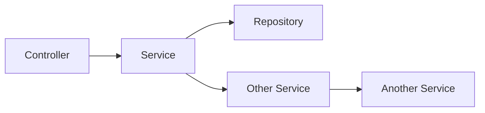
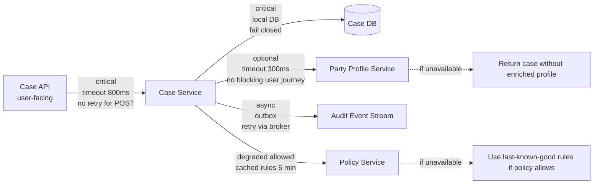
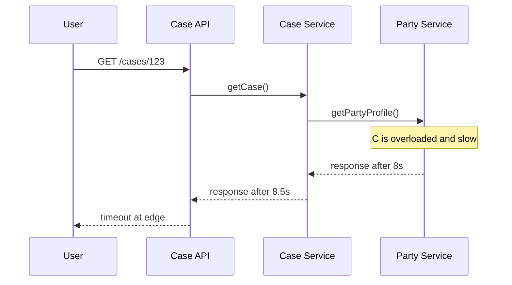
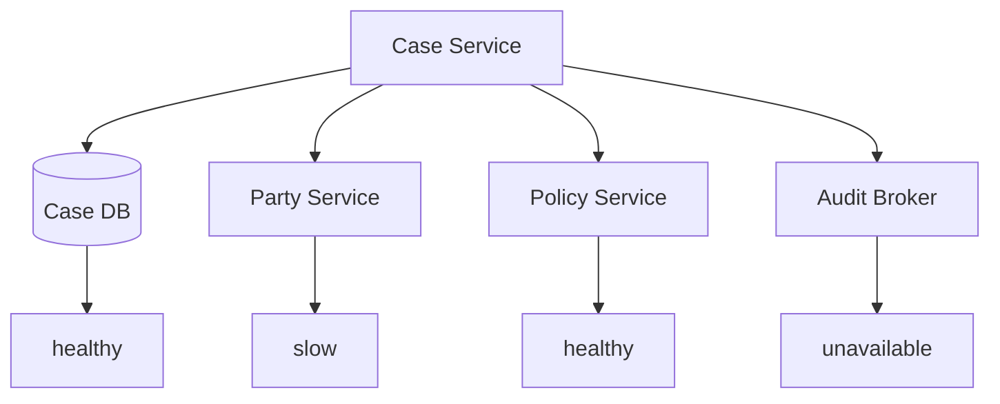
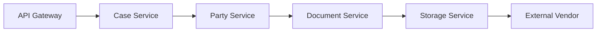
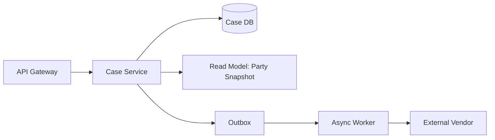
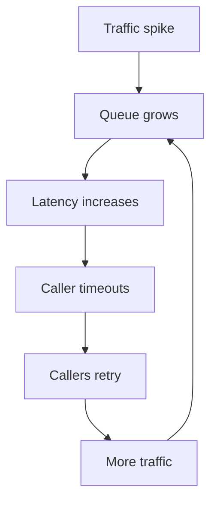
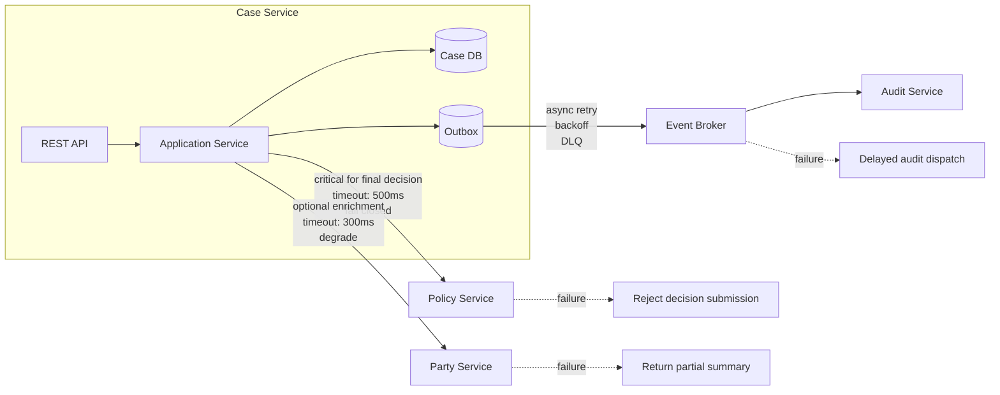

# Part 039 — Failure Model of Java Microservices

Microservice yang bagus bukan service yang “tidak pernah error”. Itu fantasi.

Microservice yang bagus adalah service yang:

1. tahu **jenis kegagalan apa** yang mungkin terjadi,
2. tahu **di mana kegagalan itu boleh berhenti**,
3. tahu **bagaimana memberi respons yang benar saat dependency tidak sehat**,
4. tahu **bagaimana menghindari memperbesar kegagalan menjadi outage sistemik**,
5. tetap bisa menjelaskan kepada operator, auditor, dan consumer: “apa yang terjadi, kapan, kenapa, dan apa dampaknya.”

Dalam monolith, banyak kegagalan terlihat sebagai exception lokal. Dalam microservices, kegagalan menjadi fenomena jaringan, kapasitas, koordinasi, data staleness, message duplication, timeout, retry storm, partial write, dan cascading failure.

Jadi mulai Phase 6 ini kita tidak membahas reliability sebagai “tambahkan library resilience”. Kita membangun **failure model**.

> Top engineer tidak bertanya: “pakai circuit breaker apa?”
>
> Mereka bertanya:
>
> “Kegagalan apa yang mungkin terjadi, siapa terdampak, berapa lama boleh terjadi, apakah retry aman, apakah fallback benar secara bisnis, dan bagaimana sistem tahu bahwa ia sedang masuk kondisi bahaya?”

---

## 1. Core Mental Model

Remote dependency adalah komponen tidak terpercaya.

Bukan karena tim lain buruk. Tapi karena distributed system punya realitas:

- jaringan bisa lambat,
- DNS bisa gagal,
- connection pool bisa habis,
- dependency bisa overload,
- response bisa timeout tapi operasi berhasil,
- retry bisa memperbesar beban,
- queue bisa menumpuk,
- consumer bisa tertinggal,
- event bisa datang terlambat,
- data bisa stale,
- node bisa restart,
- deployment bisa menyebabkan mixed version,
- traffic bisa berubah jauh dari asumsi awal.

Failure model adalah daftar eksplisit tentang **bagaimana service gagal dan apa kontrak perilaku saat gagal**.

Tanpa failure model, desain microservices biasanya menjadi:



Diagram itu terlihat rapi, tapi hampir tidak menjawab pertanyaan production:

- apa timeout A ke D?
- jika D lambat, apakah thread B habis?
- apakah B retry?
- berapa kali?
- retry pada error apa?
- apakah command idempotent?
- apakah user boleh mendapat response partial?
- apakah fallback boleh secara bisnis?
- apakah D dependency critical atau optional?
- apakah call ke E terjadi di transaction?
- bagaimana operator tahu D sedang menurunkan availability A?
- apakah incident D akan menjadi incident A?

Failure model mengubah diagram menjadi peta risiko.



---

## 2. Failure Taxonomy

A service needs a taxonomy before it needs a resilience library.

### 2.1 Local failure

Local failure happens inside the service boundary.

Examples:

- validation failure,
- invariant violation,
- database constraint violation,
- optimistic lock conflict,
- memory pressure,
- thread pool saturation,
- connection pool exhaustion,
- serialization failure,
- config invalid,
- disk full,
- JVM pause,
- deployment startup failure.

Local failure should be the easiest to classify because it is inside your ownership boundary.

### 2.2 Remote dependency failure

Remote dependency failure happens when another service, broker, database, cache, identity provider, or external API fails or degrades.

Examples:

- connection refused,
- DNS resolution failure,
- TLS handshake failure,
- slow response,
- timeout,
- HTTP 5xx,
- HTTP 429,
- gRPC `UNAVAILABLE`,
- gRPC `DEADLINE_EXCEEDED`,
- stale endpoint,
- broker unavailable,
- consumer lag.

Remote failure is dangerous because it can spread.

### 2.3 Data consistency failure

Data consistency failure happens when the state observed by the service is not what the business process expects.

Examples:

- projection not updated yet,
- event arrived out of order,
- duplicate event applied,
- stale cache,
- missing reference,
- saga step completed but reply lost,
- read model behind source-of-truth,
- cross-service report inconsistent during consistency window.

This is not always a bug. Sometimes it is the designed consistency model. The failure appears when consumers were not told the consistency contract.

### 2.4 Capacity failure

Capacity failure happens when demand exceeds the service’s ability to process safely.

Examples:

- CPU saturation,
- heap pressure,
- GC pause,
- event loop starvation,
- executor queue growth,
- DB connection pool exhausted,
- Kafka consumer lag,
- p99 latency explosion,
- HPA scaling too late,
- downstream rate limit exceeded.

Capacity failure often starts as latency, then becomes timeout, then becomes retry storm, then becomes cascading failure.

### 2.5 Semantic failure

Semantic failure happens when the system technically succeeds but violates business meaning.

Examples:

- fallback returns wrong policy,
- duplicate command creates duplicate case,
- compensation reverses too much,
- stale decision shown as final,
- audit event says “approved” but actual state is “pending review”,
- user receives success before durable write exists,
- retry repeats an external side effect.

This is why “availability” cannot be designed purely at transport level. Sometimes returning a fallback is worse than failing closed.

---

## 3. Failure Classification Table

Every service should maintain a failure classification table.

Example for a regulatory case service:

| Failure | Source | User Impact | Retry Safe? | Fallback Allowed? | Availability Mode | Notes |
|---|---:|---:|---:|---:|---:|---|
| Invalid case transition | local domain invariant | request rejected | no | no | fail closed | business error |
| Case DB unavailable | local dependency | cannot mutate case | maybe at client with idempotency | no | fail closed | preserve data correctness |
| Party profile timeout | remote dependency | enrichment missing | yes for GET | yes | degraded | return case without profile |
| Policy service timeout during decision | remote dependency | cannot finalize decision | maybe | only if last-known-good policy allowed | fail closed or controlled degraded | compliance-sensitive |
| Audit broker unavailable | async dependency | command may still succeed if outbox durable | publisher retry | no user fallback needed | delayed audit dispatch | outbox must persist |
| Duplicate command | client/network | potential duplicate side effect | yes if idempotency key exists | no | replay previous response | idempotency store required |
| Projection lag | async read model | stale query | no direct retry | show freshness marker | bounded stale | expose watermark |

This table forces architectural clarity. It prevents accidental resilience.

---

## 4. The Most Dangerous Failure: Slow Dependency

A dependency that fails fast is easier to handle than a dependency that becomes slow.

Fast failure:

```text
Party Service returns 503 in 20ms
```

Slow failure:

```text
Party Service responds sometimes in 5s, sometimes never
```

Slow failure consumes resources:

- servlet threads,
- event-loop tasks,
- HTTP client connections,
- database transaction time,
- memory,
- queues,
- user patience,
- autoscaling capacity.

A service with no timeout treats slow dependencies as infinite wait. That is not resilience. That is surrender.



Even if the dependency eventually responds, the user-facing request may already have timed out. Work done after the caller has given up is often wasted work.

---

## 5. Partial Failure

In a distributed system, one part can fail while others continue.

This is not an exceptional corner case. It is the default.

Example:



The question is not “is the system up?” The question is:

- which capability is available?
- which capability is degraded?
- which capability must fail closed?
- which response can be partial?
- which operations must be queued?
- which operations must be rejected?
- which dependency is optional?
- which dependency is critical?

Binary uptime is too crude for microservices.

A more useful model:

| Capability | Dependency | Mode if dependency fails |
|---|---|---|
| Create case | Case DB, ID generator, audit outbox | fail closed if DB unavailable |
| View case summary | Case DB, Party Service | degraded if Party Service unavailable |
| Submit enforcement decision | Case DB, Policy Service, audit outbox | fail closed if Policy Service unavailable |
| Export analytics report | reporting projection | stale output allowed with freshness marker |
| Send notification | broker/email provider | accept command, retry async, expose delivery status |

---

## 6. Failure Containment Boundary

A failure containment boundary answers:

> “If this component fails, where does the failure stop?”

In microservices, boundaries are often confused:

- service boundary,
- database boundary,
- transaction boundary,
- thread pool boundary,
- connection pool boundary,
- queue boundary,
- rate limit boundary,
- tenant boundary,
- region boundary,
- team ownership boundary.

A service boundary is not automatically a failure boundary. If every service calls every other service synchronously with long timeouts and unbounded retries, you have a distributed failure amplifier.

### Bad containment



If F slows down, A may become slow. That is failure propagation.

### Better containment



Here, user-facing flow does not block on the external vendor. The external side effect becomes asynchronous, observable, retryable, and containable.

---

## 7. Critical vs Optional Dependencies

Not every dependency deserves equal treatment.

Classify each dependency:

### Critical dependency

Without it, the operation cannot produce correct business result.

Examples:

- local database for mutation,
- policy decision service during legally binding decision,
- identity/authorization check for protected resource,
- idempotency store for non-idempotent command,
- outbox table for mandatory audit event.

Failure behavior:

- fail closed,
- reject early,
- do not pretend success,
- expose clear problem detail,
- preserve correctness over availability.

### Optional dependency

Without it, operation can still produce a useful result.

Examples:

- enrichment profile,
- recommendation,
- non-critical notification preview,
- UI decoration,
- analytics counter,
- autocomplete.

Failure behavior:

- use fallback,
- return partial response,
- mark missing fragment,
- cache if safe,
- do not block critical user journey.

### Deferrable dependency

The operation must happen eventually, but not in the request path.

Examples:

- email notification,
- audit publishing when outbox is durable,
- search indexing,
- projection update,
- external CRM sync.

Failure behavior:

- persist intent,
- retry asynchronously,
- expose delivery/reconciliation status,
- alert on backlog/age.

---

## 8. Failure Mode Matrix

A practical design artifact:

| Dependency | Criticality | Timeout | Retry | Fallback | Isolation | Observability |
|---|---:|---:|---:|---:|---:|---|
| Case DB | critical | short DB query timeout | limited transaction retry on transient conflict | no | DB pool + transaction boundary | connection pool, slow query, lock wait |
| Party Service | optional for summary | 300ms | maybe 1 retry for GET only | omit enrichment | separate HTTP pool | dependency latency, timeout count |
| Policy Service | critical for decision | 500ms within deadline | no blind retry for command | last-known-good only if approved | separate pool + circuit breaker | policy version, decision trace |
| Audit Outbox | critical local table | same transaction | no remote retry in transaction | no | local DB | outbox insert count |
| Broker Publisher | deferrable | async publisher timeout | yes with backoff | no | worker pool | publish lag, DLQ, retry age |

This matrix is not bureaucracy. It is how architecture becomes executable.

---

## 9. Exception Taxonomy in Java

A production Java service should not let low-level exceptions leak across layers.

Bad:

```java
catch (Exception e) {
    throw new RuntimeException(e);
}
```

Worse:

```java
throw new RuntimeException("Something went wrong");
```

Better: classify failures explicitly.

```java
public sealed interface ServiceFailure permits
        ValidationFailure,
        ConflictFailure,
        DependencyFailure,
        CapacityFailure,
        InternalFailure {
    String code();
    String message();
}

public record ValidationFailure(String code, String message) implements ServiceFailure {}

public record ConflictFailure(String code, String message) implements ServiceFailure {}

public record DependencyFailure(
        String code,
        String message,
        String dependency,
        boolean retryable,
        boolean degradedResultAllowed
) implements ServiceFailure {}

public record CapacityFailure(
        String code,
        String message,
        boolean retryable
) implements ServiceFailure {}

public record InternalFailure(String code, String message) implements ServiceFailure {}
```

The point is not to over-engineer errors. The point is to avoid treating these as equal:

- user submitted invalid transition,
- party service timed out,
- DB connection pool exhausted,
- duplicate idempotency key,
- optimistic lock conflict,
- bug in mapper,
- policy engine unavailable.

They require different responses.

---

## 10. Mapping Failure to API Response

A common mistake is mapping all exceptions to `500`.

Better mapping:

| Failure | HTTP |
|---|---:|
| malformed JSON | 400 |
| validation failure | 422 |
| unauthorized | 401 |
| forbidden | 403 |
| not found | 404 |
| optimistic lock conflict | 409 |
| idempotency key conflict | 409 |
| rate limited | 429 |
| dependency timeout | 503 or 504 depending boundary |
| local overload | 503 |
| internal bug | 500 |

Example problem response:

```json
{
  "type": "https://errors.example.com/dependency-timeout",
  "title": "Dependency timeout",
  "status": 503,
  "detail": "Case summary was returned without party enrichment because Party Service timed out.",
  "instance": "/cases/CASE-123",
  "errorCode": "CASE_PARTY_PROFILE_TIMEOUT",
  "dependency": "party-service",
  "degraded": true,
  "correlationId": "01HZ..."
}
```

A degraded response is not the same as a failed response. If the API returns `200` with missing optional fragment, the response should expose the completeness contract.

```json
{
  "caseId": "CASE-123",
  "status": "UNDER_REVIEW",
  "party": null,
  "meta": {
    "partial": true,
    "missingFragments": ["partyProfile"],
    "freshness": {
      "case": "2026-07-05T10:15:31Z",
      "partyProfile": null
    }
  }
}
```

---

## 11. Failure-Aware Service Design

A service operation should be designed with failure behavior as part of its contract.

Example command: `SubmitCaseForReview`.

### Functional happy path

```text
Draft case -> validate completeness -> transition to submitted -> emit audit event
```

### Failure-aware design

| Step | Failure | Behavior |
|---|---|---|
| Load case | not found | 404 |
| Check state | invalid transition | 409/422 |
| Validate completeness | missing evidence | 422 |
| Persist transition | optimistic lock conflict | 409, client may reload |
| Insert outbox audit event | DB failure | transaction fails; no false success |
| Publish audit event | broker down | async retry from outbox |
| Notify reviewer | notification provider down | async retry; case submission still valid |

Java application service sketch:

```java
public final class SubmitCaseForReviewHandler {
    private final CaseRepository cases;
    private final Outbox outbox;
    private final Clock clock;

    public SubmitCaseForReviewResult handle(SubmitCaseForReview command) {
        CaseId caseId = CaseId.of(command.caseId());

        CaseRecord record = cases.findByIdForUpdate(caseId)
                .orElseThrow(() -> new CaseNotFoundException(caseId));

        EnforcementCase enforcementCase = CaseMapper.toDomain(record);

        enforcementCase.submitForReview(
                SubmittedBy.of(command.actorId()),
                SubmissionTime.of(clock.instant())
        );

        cases.save(CaseMapper.toRecord(enforcementCase));

        outbox.append(AuditIntegrationEvent.caseSubmittedForReview(
                enforcementCase.id().value(),
                command.actorId(),
                clock.instant()
        ));

        return new SubmitCaseForReviewResult(
                enforcementCase.id().value(),
                enforcementCase.status().name()
        );
    }
}
```

Important detail: the outbox append is in the same local transaction as the case state transition. Broker publishing is not.

---

## 12. Remote Call Placement

One of the most important rules:

> Do not place slow remote calls inside local database transaction unless you have a very specific, reviewed reason.

Bad:

```java
@Transactional
public void submitDecision(Command command) {
    CaseRecord record = caseRepository.find(command.caseId());
    PolicyDecision decision = policyClient.evaluate(command.policyInput()); // remote call inside TX
    record.apply(decision);
    caseRepository.save(record);
}
```

Why bad?

- DB transaction remains open while remote service is slow.
- Locks are held longer.
- Connection pool is occupied longer.
- Retry may repeat remote call.
- Unknown outcome becomes harder to reason about.

Better:

```java
public void submitDecision(Command command) {
    PolicyDecision decision = policyClient.evaluate(command.policyInput());

    transactionTemplate.executeWithoutResult(tx -> {
        CaseRecord record = caseRepository.findForUpdate(command.caseId());
        record.apply(decision);
        caseRepository.save(record);
        outbox.append(AuditIntegrationEvent.decisionSubmitted(...));
    });
}
```

But this still has subtle issues. What if policy evaluation succeeds and transaction fails? You need to ask whether policy evaluation is pure/idempotent or has side effects. If it has side effects, it should be modeled as a saga/workflow step.

---

## 13. Overload

Overload is when the service receives or accepts more work than it can complete safely.

Overload can come from:

- normal traffic spike,
- retry storm,
- batch job,
- thundering herd,
- queue replay after outage,
- downstream slowness,
- expensive query,
- noisy tenant,
- deployment cold start,
- HPA lag,
- GC pause,
- connection pool starvation.

The dangerous part: overload often looks like “just latency” at first.



The system does not need a bug to fail. It can fail because normal safety mechanisms were not bounded.

---

## 14. Saturation Signals

A service should expose saturation signals.

| Resource | Signal |
|---|---|
| CPU | utilization, throttling, run queue |
| Heap | usage, GC pause, allocation rate |
| Thread pool | active threads, queue depth, rejection count |
| HTTP pool | active connections, pending acquire, timeout |
| DB pool | active, idle, pending, acquisition timeout |
| Broker consumer | lag, processing time, commit latency |
| Executor | queue age, queue size, task rejection |
| Cache | hit rate, eviction, load latency |
| Disk | IO wait, fsync latency |
| External API | latency, error rate, rate limit response |

Latency alone is a late signal. Queue age and pool pending counts are often earlier.

---

## 15. Load Shedding

When overloaded, a service should reject work it cannot safely complete.

This feels harsh. It is often the safest behavior.

Bad overloaded behavior:

```text
accept everything -> queue forever -> timeout everything -> retry storm -> total collapse
```

Better overloaded behavior:

```text
accept within capacity -> reject excess quickly -> preserve critical path -> recover
```

Example:

```java
public final class CapacityGuard {
    private final Semaphore permits;

    public CapacityGuard(int maxConcurrentRequests) {
        this.permits = new Semaphore(maxConcurrentRequests);
    }

    public <T> T execute(Supplier<T> operation) {
        boolean acquired = permits.tryAcquire();

        if (!acquired) {
            throw new ServiceOverloadedException("CASE_SERVICE_OVERLOADED");
        }

        try {
            return operation.get();
        } finally {
            permits.release();
        }
    }
}
```

This is a simplified example. In production, you also need:

- priority classes,
- tenant isolation,
- endpoint-specific limits,
- queue timeout,
- metrics,
- clear `Retry-After` behavior where appropriate,
- rejection at edge/gateway before expensive work starts.

---

## 16. Failure-Aware Dependency Graph

A useful architecture diagram should include failure semantics.



This diagram is not decorative. It encodes architectural behavior.

---

## 17. Fail Open, Fail Closed, Fail Degraded

### Fail closed

Reject the operation to preserve correctness/security/compliance.

Use when:

- authorization unavailable,
- policy decision unavailable for legally binding action,
- DB cannot persist mandatory state,
- idempotency cannot be checked for non-idempotent command,
- audit event cannot be durably recorded if audit is mandatory.

### Fail open

Allow operation despite missing check.

Use rarely, and only when explicitly approved.

Examples:

- allow low-risk read if feature flag service unavailable and default is safe,
- allow non-critical UI rendering without personalization.

Do not fail open accidentally.

### Fail degraded

Return reduced functionality while being honest about it.

Examples:

- omit optional enrichment,
- use cached reference data with freshness marker,
- delay notification,
- return stale read model with watermark.

Fail degraded is not a trick to hide failure. It is an explicit product and architecture decision.

---

## 18. Unknown Outcome Problem

The most painful failure is not “success” or “failure”. It is “I do not know.”

Example:

```text
Case Service sends command to Payment/External/Policy service.
Connection times out.
Did the dependency process the command?
```

Possible outcomes:

1. dependency never received command,
2. dependency received and failed,
3. dependency received and succeeded but response was lost,
4. dependency is still processing.

If the operation has side effects, blind retry may duplicate work.

Defense:

- idempotency key,
- operation ID,
- status query,
- outbox/inbox,
- saga state,
- reconciliation job,
- external reference ID,
- audit trail.

```java
public record ExternalOperationId(String value) {
    public static ExternalOperationId forCaseDecision(String caseId, String decisionId) {
        return new ExternalOperationId("case-decision:%s:%s".formatted(caseId, decisionId));
    }
}
```

Do not make remote commands without an operation identity.

---

## 19. Failure Model for Async Messaging

Messaging changes the failure shape. It does not remove failure.

Async failure examples:

- message not published,
- message published but not consumed,
- duplicate message,
- poison message,
- out-of-order message,
- consumer lag,
- DLQ growth,
- schema incompatible,
- broker partition unavailable,
- replay overload,
- projection update failure.

Async systems need their own failure model:

| Failure | Detection | Recovery |
|---|---|---|
| publish failed | outbox pending age | publisher retry |
| duplicate consumed | inbox unique key conflict | ignore/replay previous result |
| poison message | retry count exceeded | DLQ + operator workflow |
| projection lag | watermark age | scale consumer / investigate |
| out-of-order event | aggregate version gap | buffer, refetch, or reject |
| schema incompatible | deserialization error | compatibility test + DLQ |
| replay overload | queue age and CPU saturation | throttle replay |

---

## 20. Java Threading and Failure

Java microservices often fail not because CPU is fully used, but because execution resources are blocked.

### Servlet-style thread-per-request

In a traditional Spring MVC/Tomcat model:

- each request occupies a request thread,
- blocking remote calls occupy threads,
- slow dependency consumes threads,
- once threads are exhausted, new requests queue or fail.

### Reactive/event-loop model

In a reactive model:

- event-loop threads must not block,
- blocking call on event loop can stall many requests,
- backpressure must be explicit,
- thread pool boundaries matter.

Different model, different failure shape.

Bad reactive code:

```java
public Mono<CaseSummary> getCase(String id) {
    return Mono.just(repository.findById(id)); // blocking call inside reactive chain
}
```

Better:

```java
public Mono<CaseSummary> getCase(String id) {
    return Mono.fromCallable(() -> repository.findById(id))
            .subscribeOn(Schedulers.boundedElastic());
}
```

This is not an endorsement to make everything reactive. It is a reminder: concurrency model is part of failure model.

---

## 21. Dependency Isolation

A single bad dependency should not consume all resources.

Bad:

```text
all outbound calls share one HTTP connection pool
```

If Party Service is slow, Policy Service calls may also starve.

Better:

```text
separate client config per dependency
separate timeout
separate pool
separate circuit breaker
separate metrics
```

Example config idea:

```yaml
dependencies:
  party-service:
    base-url: https://party.internal
    connect-timeout: 100ms
    response-timeout: 300ms
    max-connections: 50
    criticality: optional
  policy-service:
    base-url: https://policy.internal
    connect-timeout: 100ms
    response-timeout: 500ms
    max-connections: 30
    criticality: critical
```

Failure model should be visible in configuration.

---

## 22. Incident-Oriented Questions

For each service, ask:

1. What happens if local DB is slow?
2. What happens if local DB rejects connections?
3. What happens if each remote dependency is slow?
4. What happens if each remote dependency returns 5xx?
5. What happens if dependency succeeds but response is lost?
6. What happens if broker is down?
7. What happens if event consumer is 2 hours behind?
8. What happens if message is duplicated?
9. What happens if message is out of order?
10. What happens if cache is stale?
11. What happens if one tenant sends 10x traffic?
12. What happens if a batch job replays one million events?
13. What happens if deployment creates mixed versions?
14. What happens if config is wrong?
15. What happens if clock is skewed?
16. What happens if audit publishing is delayed?
17. What happens if policy engine is unavailable?
18. What happens if external vendor rate-limits us?
19. What happens if HPA scales too late?
20. What happens if service receives traffic during startup?

If the answer is “we’ll see”, the architecture is incomplete.

---

## 23. Review Checklist

Use this before approving a service design.

### Dependency classification

- [ ] Each dependency is classified as critical, optional, or deferrable.
- [ ] Each dependency has timeout, retry, fallback, and isolation policy.
- [ ] Remote calls inside DB transactions are explicitly reviewed.
- [ ] Side-effecting remote commands have operation IDs/idempotency.

### Failure containment

- [ ] Optional dependency failure does not break critical path.
- [ ] Deferrable work is persisted before async processing.
- [ ] Overload behavior is explicit.
- [ ] Load shedding exists for expensive endpoints.
- [ ] Dependency pools are separated where needed.

### Data and messaging

- [ ] Duplicate messages are safe.
- [ ] Out-of-order events are handled or rejected safely.
- [ ] Projection lag is measurable.
- [ ] Reconciliation exists for important async state.
- [ ] Unknown outcome cases have recovery path.

### Observability

- [ ] Dependency latency and error metrics exist.
- [ ] Saturation metrics exist.
- [ ] Error responses include correlation ID.
- [ ] Degraded responses are visible.
- [ ] Dashboards distinguish local failure vs dependency failure.

### Business semantics

- [ ] Fallback is business-approved.
- [ ] Fail-open behavior is explicitly approved.
- [ ] Compliance-critical actions fail closed.
- [ ] Audit trail can explain failure and recovery.

---

## 24. Common Failure Smells

### Smell 1: “All exceptions are 500”

This means the service cannot distinguish user error, conflict, dependency failure, overload, or bug.

### Smell 2: “No timeout because HTTP client has default”

Default timeout is usually not your business timeout.

### Smell 3: “Retry everywhere”

Retry without idempotency and budget is a load amplifier.

### Smell 4: “Fallback returns fake success”

Fallback must preserve business truth. Fake success creates semantic corruption.

### Smell 5: “Healthy but unusable”

Health endpoint says UP while service cannot process main capability because DB pool is exhausted or projection is 2 hours behind.

### Smell 6: “Async means reliable”

Async only moves failure into queue, lag, DLQ, replay, and reconciliation.

### Smell 7: “Service boundary equals failure boundary”

Not if dependencies are synchronous, timeouts are long, and retries are unbounded.

---

## 25. Exercise

Take one service you own or imagine a `Case Decision Service`.

Create a failure model table with these columns:

```text
operation
dependency
criticality
failure mode
timeout
retry policy
fallback policy
idempotency requirement
observability signal
operator action
```

Then answer:

1. Which dependency failure becomes user-visible?
2. Which failure should degrade?
3. Which failure must fail closed?
4. Which failure can be delayed?
5. Which retries are unsafe?
6. Which unknown outcomes need reconciliation?
7. Which overload signal appears first?
8. Which metric should page a human?

If you cannot answer those, the service is not production-designed yet.

---

## 26. Summary

Failure model is the bridge between architecture diagram and production reality.

A Java microservice should not only define:

- endpoints,
- DTOs,
- database tables,
- events,
- repositories,
- deployment manifest.

It must define:

- how it fails,
- how it contains failure,
- which dependencies are critical,
- which operations are retry-safe,
- which results may be partial,
- which actions fail closed,
- which side effects are deferrable,
- which overload signals matter,
- how humans diagnose and recover it.

In distributed systems, reliability is not an afterthought. It is part of the domain design.

---

## References

- Google SRE Book — Addressing Cascading Failures: https://sre.google/sre-book/addressing-cascading-failures/
- Google SRE Book — Handling Overload: https://sre.google/sre-book/handling-overload/
- Microsoft Azure Architecture Center — Retry pattern: https://learn.microsoft.com/en-us/azure/architecture/patterns/retry
- Microsoft Azure Architecture Center — Circuit Breaker pattern: https://learn.microsoft.com/en-us/azure/architecture/patterns/circuit-breaker
- RFC 9110 — HTTP Semantics: https://www.rfc-editor.org/rfc/rfc9110.html
- gRPC Status Codes: https://grpc.io/docs/guides/status-codes/
